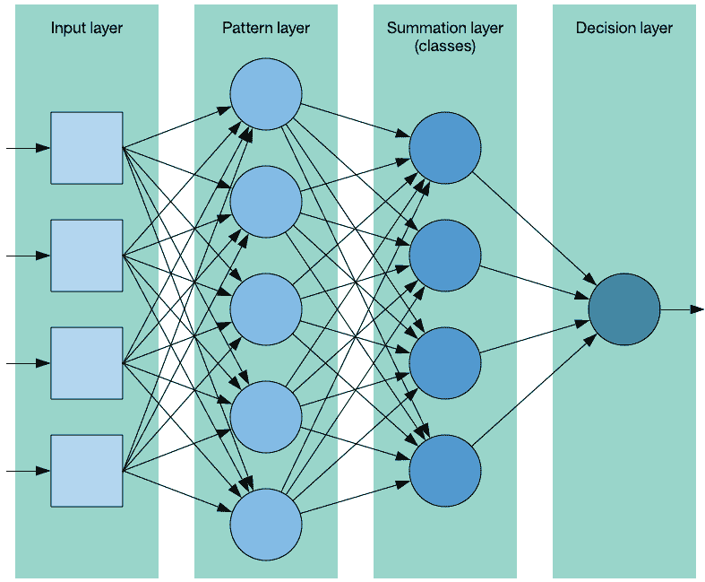
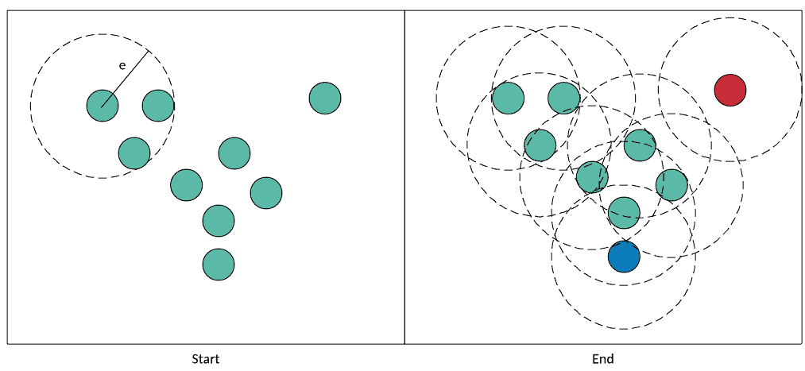

# 通过对数据分类进行预测

> 原文：[`developer.ibm.com/zh/tutorials/ba-intro-data-science-2/`](https://developer.ibm.com/zh/tutorials/ba-intro-data-science-2/)

您可以从原始数据提取出的一种关键价值是，能够构建一个可用于预测或分类的模型。应用此模型，您可以将观察值转换为具有明显价值的预测或分类。本教程延续了第 1 部分：”[数据、结构和数据科学管道](http://www.ibm.com/developerworks/cn/analytics/library/ba-intro-data-science-1/index.html) ”中引入的原则，探讨两种使用监督学习和无监督学习的分类方法（一种预测形式）。

分类是机器学习算法的一种常见应用。您可以使用监督学习来实现预测和分类，使用以前的观察值构建一个模型，以便根据未见过的观察值来预测结果。也可以使用无监督学习来实现这一过程，将观察值聚类到集合中，以便根据与新观察值最接近的集群来预测它们的行为。

机器学习已成功应用于许多预测和分类问题，包括航班晚点、信用评分和股票价格。在这里，我将探讨两种重要算法：概率神经网络和基于密度的聚类 (DBSCAN)。

## 概率神经网络

概率神经网络 (PNN) 是 1966 年创建的，类似于我在”[神经网络深入剖析](https://www.ibm.com/developerworks/cn/cognitive/library/cc-cognitive-neural-networks-deep-dive/index.html) ”中讨论的反向传播（back-propagation）神经网络。二者都是多层的前馈神经网络，但 PNN 不依靠误差反向传播，它采用了一种不同的训练方法。您可以使用 PNN 执行模式识别、聚类、分类，以及预测。

### PNN 架构

PNN 是一种监督学习方法，依赖于一个包含标签（用于标识每个观察值的类）的训练集。PNN 由 4 层组成，如下所示。

##### PNN 架构



*输入层 (input layer)* 代表输入矢量，具有一个包含问题的特征数量的维度。 *模式层 (pattern layer)* 也称为 *隐藏层* ，由训练数据集中每个观察值对应的神经元组成。模式神经元计算离训练样本（由神经元表示）的欧氏距离，并将该距离表示为该类的特征矢量图心的输入特征矢量。 *汇总层 (summation layer)* 包含该数据集表示的每个类所对应的神经元。顾名思义，汇总层中的神经元会计算出它们所代表的特定类的模式层神经元的输出之和（其中包括一个基于该类的观察值数量的平均值）。最后，输出层，也称为 *决策层 (decision layer)* ，实现了一种赢家通吃的方法：它识别汇总层中具有最大值的类神经元。然后，这个类表示了所预测的输入矢量的类。

### PNN 算法

您很快就会在一段代码中看到，训练和使用 PNN 的算法很简单。不需要训练，因为计算一个预测值只需迭代整个数据集来计算汇总层中的神经元。与之相反，在传统的反向传播中，会在训练每个观察值之后调整权重值。因此，反向传播网络使用起来可能更快，但花费的训练时间可能更长（根据一个关于数据集大小的函数）。

该流程从一个示例特征矢量（表示您希望预测其类的观察值）和包含带标签观察值的数据集开始。对于汇总层中的每个神经元（表示一个类），可以迭代该数据集，并计算该类的示例特征矢量和每个数据集观察值的平方和，然后应用一个平滑系数。当利用数据集中表示的（该类的）观察值计算了所有汇总神经元后，会通过赢者通吃的方法选择最大的值。这个类表示了该示例的预测类。

### PNN 实现

可以在 GitHub 上找到 [这个 PNN 的完整实现](https://github.com/mtimjones/pnn) 。 PNN 分类器的 C 代码 提供了分类器函数，该函数接受一个示例观察值并返回它应该属于的类（预测结果）。正如前面所讨论的，此代码从汇总层开始，使用示例观察值来计算该类中包含的数据集观察值的汇总神经元。然后将汇总神经元传递给一个名为 `winner_takes_all` 的函数，该函数只确定哪个神经元具有最大值（赢者）。

##### PNN 分类器的 C 代码

```
int pnn_classifier( dataset_t example )
{
   int class, observation, feature, class_observations;
   double product;
   double summation[CLASSES];

   // Iterate the neurons in the summation layer.
   for ( class = 1 ; class <= CLASSES ; class++ )
   {
      summation[class-1] = 0.0;
      class_observations = 0;

      // Iterate the dataset observations (pattern layer).
      for ( observation = 0 ; observation < OBSERVATIONS ; observation++ )
      {
         product = 0.0;

         // Train the class output node based upon samples for this class.
         if ( dataset[observation].class == class )
         {
            class_observations++;

            // Square product of the example vector and the input feature vector
            for ( feature = 0 ; feature < FEATURES ; feature++ ) {
              product += SQR( ( example.features[feature] -
                                dataset[observation].features[feature] ) );
            }

            // Apply a smoothing factor and sum into the class neuron.
            summation[class-1] += exp( -( product / ( 2.0 * SQR( SIGMA ) ) ) );
         }

      }

      summation[class-1] /= (double)class_observations;
   }

   return winner_takes_all( summation );
} 
```

在我为 PNN 提供一些数据用于预测时，您就可以看到它的实际效果。在本例中，我返回到我的动物园数据集，其中包含一组基于动物特征（毛发、羽毛、产卵情况、空气传播等）的动物。我将构造一些样本观察值，以查看该算法对类（哺乳动物、昆虫、两栖动物等）的预测结果。清单 2 提供了该数据集的元数据（特征矢量描述和类描述）。

##### 动物园数据集元数据

```
// Features are:
//    [ 0] hair
//    [ 1] feathers
//    [ 2] eggs
//    [ 3] milk
//    [ 4] airborne
//    [ 5] aquatic
//    [ 6] predator
//    [ 7] toothed
//    [ 8] backbone
//    [ 9] breathes
//    [10] venomous
//    [11] fins
//    [12] legs
//    [13] tail
//    [14] domestic
//    [15] catsize

// Classes are [1] Mammal, [2] Bird, [3] Reptile, [4] Fish
//             [5] Amphibian, [6] Bug, [7] Invertebrate. 
```

清单 3 给出了示例特征矢量的样本代码，以及用于演示使用 PNN 分类器的类预测结果的输出。此输出表明，一种有牙齿的跳蚤仍是昆虫；一种有毛发的掠食动物是哺乳动物；一种水生的、产卵的、有 6 条腿的动物是无脊椎动物。

##### 特征矢量和预测示例

```
dataset_t example1 = {"flea with teeth",
                      {0,0,1,0,0,0,0,1,0,1,0,0,6,0,0,0}, 0};
printf("Prediction %d for %s\n", pnn_classifier( example1 ), example1.name );

dataset_t example2 = {"predator with hair",
                      {0,1,0,0,0,0,1,0,0,0,0,0,0,0,0,0}, 0};
printf("Prediction %d for %s\n", pnn_classifier( example2 ), example2.name );

dataset_t example3 = {"six legged aquatic egg layer",
                      {0,0,1,0,0,1,0,0,0,0,0,0,6,0,0,0}, 0};
printf("Prediction %d for %s\n", pnn_classifier( example3 ), example3.name );

...

Classification 6 for flea with teeth
Classification 1 for predator with hair
Classification 7 for six legged aquatic egg layer 
```

## 基于数据的聚类

DBSCAN 创建于 1996 年，是一种可自动确定自然集群数量的简单聚类方法。该方法能够以可靠方式处理异常样本（DBSCAN 称之为 *噪声* ）。可以在”[用于数据分类的无监督学习](https://www.ibm.com/developerworks/cn/cognitive/library/cc-unsupervised-learning-data-classification/index.html) ”中进一步了解聚类算法。DBSCAN 最初被定义为用在数据库中，因识别（大小和形状）不规则的集群而闻名，而且适用于 *k-* 均值无法顺利实现聚类的数据。

DBSCAN 是无监督的，它尝试使用数据的隐藏特征来提供数据结构。它使用了两个参数：最少的点数和 epsilon 距离。

### DBSCAN 算法

DBSCAN 处理一个多维空间中的点。每个点由一个特征矢量表示，而且给定了两个矢量，您可以使用一个指标来计算它们之间的距离（比如欧氏距离）。

该算法从一个点开始，您可以识别离原始点给定距离（称为 *epsilon* 距离）内的邻近点数量。如果邻近点数量满足或超出了阈值（称为 *最少点数* 或 `MINPTS` ），则将这个点称为 *核心点* ，并将它与一个新集群相关联。否则，会将这个点标为噪声。对于每个邻近点（称为 *密度可达点* ），只要它继续满足条件（离此点 epsilon 距离内的 `MINPTS` 点），就继续执行此操作并对它执行聚类。如果您到达一个没有密度可达点的点，那么可以将该点包含在集群中，但不使用超过此点的点来合并新点。

任何不满足条件（epsilon 距离内的 `MINPTS` ）的点都被定义为噪声，但是，如果发现它们是一个集群中另一个点的密度可达点，那么最终可以将它们移动到该集群中。

让我们在 完整的 DBSCAN 流程 的上下文中看看此流程。首先在左图中（名为 *Start* ），我挑选了一个点并检查它的邻近点。如果 `MINPTS == 2` ，我的点满足此条件并被添加到集群中。我们添加了两个邻近（密度可达）点用于测试，并继续执行该流程。只要每个点在 epsilon 距离内至少有两个邻近点，它们就会被添加到集群中并称为 *核心点* ）。密度可达但本身不满足密度标准的点是 *非核心点* （例如蓝色的点）。该算法在右侧结束（名为 *End* ）。绿色的点（核心点）和蓝色的点（非核心点，但密度可达）都包含在集群中。右上角的红色点是异常值，被视为噪声。

##### 完整的 DBSCAN 流程



接下来，我将介绍 DBSCAN 实现的核心。

### DBSCAN 实现

可以在 GitHub 上找到 [这个 DBSCAN 实现](https://github.com/mtimjones/dbscan) 。现在我们探讨一下实现该算法的核心的两个关键函数。剩余函数处理距离计算和邻近点内存管理。

`dbscan` 函数（参见 主 dbscan 函数 ）实现了聚类算法的外部循环。它迭代数据集，确定观察值是否满足密度函数（epsilon 距离内的 `MINPTS` 观察值）。如果不满足，则将该观察值标为噪声；否则，会创建一个集群并处理它的邻近点。

##### 主 dbscan 函数

```
int dbscan( void )
{
   int cluster = 0;

   for ( int i = 0 ; i < OBSERVATIONS ; i++ )
   {
      if ( dataset[ i ].label != UNDEFINED ) continue;

      neighbors_t *neighbors = find_neighbors( i );

      if ( neighbors->neighbor_count < MINPTS )
      {
         dataset[ i ].label = NOISE;
         free_neighbors( neighbors );
         continue;
      }

      // Create a new cluster.
      dataset[ i ].label = ++cluster;

      process_neighbors( i, neighbors  );

      free_neighbors( neighbors );
   }

   return cluster;
} 
```

`process_neighbor` 函数（参见 密度可达点之后的 `process_neighbor` 函数 ）围绕一个满足密度限制的点构建一个集群。它迭代邻近点列表（称为 *种子集* ），查看它们是否在当前集群内。以前定义为噪声的观察值会被加载到该集群中，已加载到该集群中的观察值会被忽略。然后检查当前（未被忽略的）观察值的邻近点；此观察值的所有（满足此条件的）邻近点都会加载到种子集中，以针对此集群进行检查。这个过程会一直持续到没有新观察值被加载到种子集中，并且种子集中的所有观察值都已检查。返回时， `dbscan` 函数会挑选下一个观察值并继续执行该流程（可能添加新的集群）。

##### 密度可达点之后的 `process_neighbor` 函数

```
void process_neighbors( int initial_point, neighbors_t *seed_set )
{
   // Process every member in the seed set.
   for ( int i = 0 ; i < OBSERVATIONS ; i++ )
   {
      // Is this a neighbor?
      if ( seed_set->neighbor[ i ] )
      {
         seed_set->neighbor[ i ] = 0;

         if ( dataset[ i ].label == NOISE )
         {
            dataset[ i ].label = dataset[ initial_point ].label;
         }
         else if ( dataset[ i ].label != UNDEFINED )
         {
            continue;
         }

         dataset[ i ].label = dataset[ initial_point ].label;

         neighbors_t *neighbors = find_neighbors( i );

         if ( neighbors->neighbor_count >= MINPTS )
         {
            // Fold new neighbors into the seed_set
            fold_neighbors( seed_set, neighbors );
            i = 0;
         }
         free_neighbors( neighbors );
      }
   }

   return;
} 
```

在不到 50 行的核心 `C` 代码中，我创建了一个简单的聚类解决方案，它与更传统的方法相比具有明显优势。考虑使用前面的动物园数据集的 DBSCAN：必须调整 DBSCAN 来选择正确的 `MINPTS` 和 epsilon。在这个示例中，我选择了 epsilon = 1.7 和 `MINPTS` = 4。通过这些参数，DBSCAN 创建了 6 个类，14 个观察值是噪声，整体准确率为 74%。它完美地对鸟和鱼的类别进行了聚类，但将哺乳动物集群拆分为一个大型集群和一个小型集群。

使用前面的测试案例，它将”flea with teeth”和”six-legged aquatic egg layer”都划分到昆虫类别中，将”predator with hair”划分为噪声。调整 epsilon 距离和 `MINPTS` 参数可以提高此数据集的准确率。

## 结束语

预测和分类是机器学习的两个有许多应用的重要方面。从预测消费者的行为（基于他们对类似消费者的分类）到预测保险政策的风险（基于描述政策和申请者的特征），通过分类进行预测是一个真实的机器学习应用示例。

本文翻译自：[Data and prediction through classification](https://developer.ibm.com/tutorials/ba-intro-data-science-2/)（2018-04-03）