# 启用业务流程来响应区块链事件

> 原文：[`developer.ibm.com/zh/tutorials/cl-enable-bpm-business-processes-to-react-to-blockchain-events/`](https://developer.ibm.com/zh/tutorials/cl-enable-bpm-business-processes-to-react-to-blockchain-events/)

***注意：** IBM Blockchain Platform 现在使用 Hyperledger Fabric 进行端到端开发。用户可以根据自己的选择使用 Hyperledger Composer，但 IBM 不会为其提供支持。*

此系列教程的[第 1 部分](https://www.ibm.com/developerworks/cn/middleware/library/mw-1705-auberger-bluemix/1705-auberger.html)展示了业务流程管理 (BPM) 与区块链技术的结合如何通过可供所有参与者使用的共享分类账，显著简化多家企业之间的分布式协作流程。不再将相关数据单独存储在个别信息系统中并在双方间双向同步，而是更新单个共享分类账实例，并且向所有参与者显示其信息（基于各自的授权）。

现在，在第 2 部分中，我们不仅谈到了通过区块链来共享数据，还探究了区块链的“主动行为”：它能够通过发送事件通知参与者已成功完成交易。

## 协作模型

下图显示了典型的 B2B 交互，以 BPMN（业务流程模型与表示法）协作图的形式来表示，其中的三个参与者通过相互通信实现总体业务目标。假定每个参与者都自主运行各自的专有流程（这些流程不予显示）。专有流程通过双向消息进行交互，确保参与者之间的信息交换与同步。

##### 多方协作（表示为 BPMN 图）

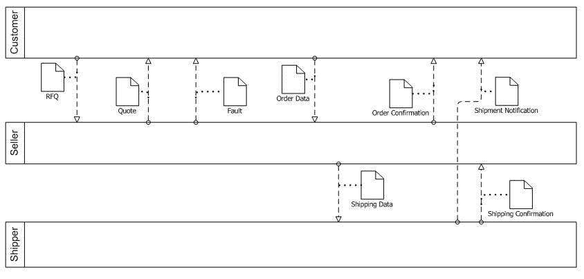

由此产生的协作有时被称为*编排*，因为各参与者根据各自的内部规则自主行动。但仍按预定义的方式根据参与者之间的合同交换消息。遵循此合同的最低限度的流程有时被称为参与者的*公共流程*，表明其他参与者可以观察到该流程。它实际上是通过一个*专有流程*来实现的，其中可能包括参与者内部完成的额外步骤。

这种模型的缺点在于需要多个通信渠道，每个双向通信都需要一个渠道。并且，消息为瞬态消息，不会向除发送方和接收方以外的其他参与者显示。

通过将消息传递基础架构替换为基于区块链的分布式账本可解决这些问题。参与者可触发业务网络中通过分类账实现的事务，这转而又会向任何其他感兴趣的参与者发送通知。因此，区块链框架成为有效的 B2B *消息传递层*。请注意，这基本上是从不同的视角来看待同一种技术：我们可以着重关注区块链以共享的分布式方法通过不可抵赖性和审计功能持久存储数据的能力，也可以着重关注其触发事务并将事务结果作为事件推送至参与者，由此成为消息传递层的能力。

下图显示了位于中间位置的区块链，周围环绕各参与者，并且包括其专有流程。请注意，消息传递被分类账所替代。确定是否可调用事务以及触发哪些事件的实际规则，已纳入业务网络定义和网络智能合约定义的范畴。

##### *利用区块链*开展多方协作

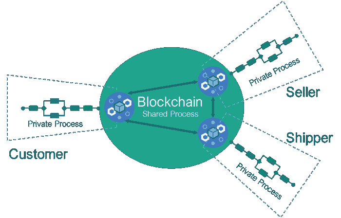

现在，为了使用区块链作为 B2B 消息传递层来实现此类 B2B 交互，您的流程需要能够响应区块链事件。在本教程的余下部分，我们将使用 Hyperledger Composer 和 IBM BPM 向您展示这是如何实现的。

## Event Bridge 的推出

在[第 1 部分](https://www.ibm.com/developerworks/cn/middleware/library/mw-1705-auberger-bluemix/1705-auberger.html)，我们使用了 Hyperledger Composer REST 服务器来查询区块链上的数据，并通过 IBM Business Process Manager (BPM) 流程调用事务。

最近，Hyperledger Composer REST 服务器终于迎来了一项期盼已久的增强功能：事件支持。这意味着区块链事件机制现在通过 Hyperledger Composer REST 服务器来公开。Hyperledger Composer REST 服务器可以发布业务网络上发生的事件，以便连接的应用可以订阅这些事件。

现在，Hyperledger Composer REST 服务器可以发布事件。IBM BPM 可以处理消息事件，根据这些事件启动或继续执行流程。目前为止，效果还不错。但这个等式中缺少了一些要素。我们需要寻找一种途径来侦听 Hyperledger Composer REST 服务器发布的事件，并将其转化为 IBM BPM 可以理解的消息事件。

我们为此缺失链接提供的解决方案称为 *Event Bridge*。Event Bridge 会侦听由 Hyperledger Composer REST 服务器发出的事件，并调用 IBM BPM 中相应的 Undercover Agent (UCA) 来启动或继续执行响应此事件的流程实例。

我们的示例以车辆生命周期业务网络为基础，这是随 Hyperledger Composer 提供的样本网络。在此网络中，某个人在区块链上下单购买一辆车。发起的事务会为制造商创建一份订单，并广播一个事件。制造商需要启动必要操作来安排车辆制造过程并更新区块链上的订单状态，以此来响应此事件。

在此教程中，我们将逐步向您展示如何在 BPM 流程中响应区块链事件：

1.  首先将探究如何在 Hyperledger Composer 中实现事件，以及这些事件的运作方式。
2.  配置 Hyperledger Composer REST 服务器，以发布供 Event Bridge 使用的事件。
3.  开发 Event Bridge 以侦听由 Hyperledger Composer REST 服务器发布的事件。
4.  在 IBM BPM 中实现 UCA，此 UCA 由 Event Bridge 触发以响应事件，并启动流程实例。
5.  扩展 Event Bridge 以通过 REST 服务触发 UCA，并向流程提供事件消息（在此场景中，即订单详细信息）。
6.  说明如何扩展此流程，以便制造商可查看订单详细信息，并可启动必要的操作。
7.  展示如何使业务流程通过中间事件来响应区块链事件。

无论您是熟悉 Hyperledger Composer 和区块链事件机制，想要了解如何在 IBM BPM 流程中处理这些事件，抑或是 IBM BPM 领域的专家，想要了解 Hyperledger Composer 事件运作方式以及如何在 IBM BPM 中使用这些事件，这份教程都可以满足您的需求。

## 完成本教程需要做的准备工作

要遵循本教程进行操作，您需要：

*   IBM BPM V8.5.7 2017.03 或更高版本。

    如果没有所需级别的 IBM BPM，可以考虑使用 IBM BPM on Cloud 来代替。[开始免费试用](https://www.bpm.ibmcloud.com/index.html)。

*   一个业务网络。

    本教程使用随 Hyperledger Composer 提供的车辆生命周期网络，在车辆生命周期中涉及了多个参与者。

*   Hyperledger Composer REST 服务器。

    Hyperledger Composer 包含 composer-rest-server 包，可通过该包轻松地设置一个使用该业务网络的 REST API 服务器。部署业务网络后，请遵循 [REST API 生成指示信息](https://hyperledger.github.io/composer/v0.19/integrating/getting-started-rest-api)进行操作。这些指示信息还介绍了如何检查和执行从业务网络生成的 REST API。

*   Node 与 npm。

    Event Bridge 是使用 Node.js 实现的，因此您的系统上需要安装最新版本的 Node 和 npm。

1

## 探索 Hyperledger Composer 如何公开事件

在 REST API Explorer 中，您可以查看业务网络中的参与者，包括 `Manufacturer、PrivateOwnerRegulator` 和 `ScrapMerchant`。此外，还定义了两种资产：`Order` 和 `Vehicle`。您可以执行多个事务，包括 `SetupDemo、PlaceOrder、UpdateOrderStatus 和 PrivateVehicleTransfer`。

一开始，要为车辆业务网络创建参与者和资产，请执行 POST/SetupDemo 事务。

现在，我们将使用 REST API Explorer 来模拟制造商的订购应用，此应用支持私人所有者向制造商提交订单。浏览至 POST/PlaceOrder 事务，并使用以下数据提交订单：

```
{
  "$class": "org.acme.vehicle.lifecycle.manufacturer.PlaceOrder",
  "orderId": "9999",
  "vehicleDetails": {
    "$class": "org.vda.VehicleDetails",
    "make": "Arium",
    "modelType": "Rose",
    "colour": "red"
  },
  "manufacturer": "org.acme.vehicle.lifecycle.manufacturer.Manufacturer#Arium",
  "orderer": "org.acme.vehicle.lifecycle.PrivateOwner#anthony",
  "timestamp": "2017-11-03T15:26:05.528Z"
} 
```

此事务会在资产注册表中创建一份新订单，并发出 `PlaceOrderEvent` 事件。

现在，我们将探究如何在车辆生命周期网络中实现此事件。此事件是在 `manufacturer.cto` 模型文件中定义的，包含两个属性 –`orderId` 和 `vehicleDetails`：

```
event PlaceOrderEvent {
  o String orderId
  o VehicleDetails vehicleDetails
} 
```

创建 `PlaceOrderEvent` 事件的事务是在 `manufacturer.js` 中定义的。为发布此事件，该事务会实现三项功能并设置事件所需的属性：

```
var factory = getFactory() // allows events to be created as part of the transaction
var placeOrderEvent = factory.newEvent('org.acme.vehicle.lifecycle.manufacturer','PlaceOrderEvent') // creates the PlaceOrderEvent in the specified namespace.
placeOrderEvent.orderId = order.orderId; // sets event properties, as defined in manufacturer.cto
placeOrderEvent.vehicleDetails = order.vehicleDetails;
emit(placeOrderEvent) // emits the event 
```

在此场景中，我们希望 Hyperledger Composer REST 服务器发布可供 Event Bridge 应用使用的事件。这需要在 REST 服务器上进行额外的配置。我们现在就执行此配置。

2

## 在 Hyperledger Composer REST 服务器中启用 WebSocket

在此步骤中，我们将配置 Hyperledger Composer REST 服务器以发布从业务网络发出的事件，以便我们在步骤 3 中实现的 Event Bridge 可以订阅这些事件。在编写时，REST 服务器支持通过 [WebSocket](https://datatracker.ietf.org/doc/rfc6455/) 发布事件。 因此，我们需要在 Hyperledger Composer REST 服务器中启用 WebSocket。这分两个步骤来完成：

1.  导出对应的环境变量：

    `export COMPOSER_WEBSOCKETS=true`

2.  重新启动 Composer REST 服务器

3

## 实现 Event Bridge 以接收事件

在此步骤中，我们将展示如何实现 Event Bridge。目前，Event Bridge 将仅订阅由 Hyperledger Composer REST 服务器发布的事件，并将事件消息（有效内容）写入控制台。在步骤 5 中，我们将扩展 Event Bridge 以调用 IBM BPM 中的流程实例。

Event Bridge 的实现是在 Node.js 中完成的。在一开始实现 Event Bridge 时，会使用 WebSocket 协议与 Hyperledger Composer REST 服务器建立连接。如果发生 `PlaceOrderEvent` 事件，此脚本会向控制台写入事件消息：

```
var WebSocketClient = require('websocket').client;

var client = new WebSocketClient();
client.connect('ws://your-hyperledger-composer-rest-server:3000/');

client.on('connectFailed', function(error) {
    console.log('Connect Error: ' + error.toString());
});

client.on('connect', function(connection) {
    console.log('Connection established');
    connection.on('error', function(error) {
        console.log("Connection Error: " + error.toString());
    });
    connection.on('close', function() {
        console.log('Connection Closed');
    });
    connection.on('message', function(message) {
        var jsonString = JSON.parse(message.utf8Data);

        if (jsonString.$class == "org.acme.vehicle.lifecycle.manufacturer.PlaceOrderEvent") {
            console.log("PlaceOrderEvent received: '" + message.utf8Data + "'");
        }
    });
}); 
```

要运行该脚本，请执行以下操作：

1.  安装所需的 Websocket 模块：

    `npm install websocket`

2.  运行该脚本：

    `node EventBridge.js`

3.  检查控制台中是否出现以下消息：

    `Connection established`

4.  在区块链上下单，如步骤 1 中所示。（提示：由于订单 ID 必须唯一，切记在此处使用其他值。）
5.  检查控制台是否显示事件消息，包括 `orderId` 和 `vehicleDetails`：

    ```
    PlaceOrderEvent received: '{"$class":"org.acme.vehicle.lifecycle.manufacturer.PlaceOrderEvent","orderId":"99998","vehicleDetails":{"$class":"org.vda.VehicleDetails","make":"Arium","modelType":"Rose","colour":"red"},"eventId":"5fdd65ab9a02fcc7c0bfc1caf80055320247e6ee4e83b5b65aef1f18dfbac1d2#0","timestamp":"2017-11-03T15:26:05.528Z"}' 
    ```

4

## 在 IBM BPM 中实现 Undercover Agent

在此步骤中，我们将向您展示如何在 IBM BPM 中实现 UCA。UCA 可提供使用 REST 调用流程的功能：

1.  在 Process Designer 中，创建新的流程应用，提供名称（例如，Order Processing）和首字母缩略词（例如，OP）。
2.  在库中，单击 Events 旁的加号 (+)，然后选择 **Undercover Agent**。

    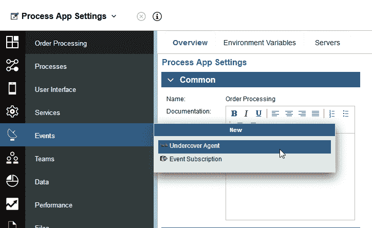

3.  提供一个名称，并选择 **On Event** 作为 Schedule Type。

    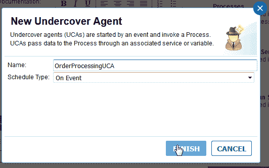

4.  在 Undercover Agent 页面上的 Scheduler 部分中，确保选中 **Message** 作为 Event Marker。

    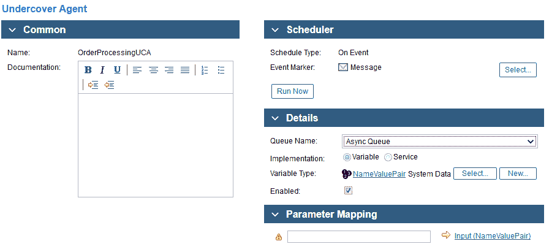

5.  在库中，单击 Processes 旁的 + 号，并创建一个流程。
6.  提供名称，例如，**Process Order**。

    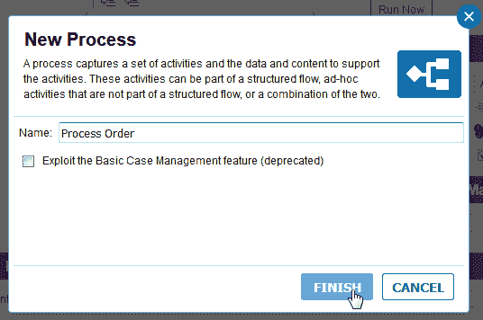

7.  在流程的 Variables 选项卡上，创建三个变量：一个类型为 `NameValuePair` 的 Input 变量和两个类型为 `String` 的 Private 变量。

    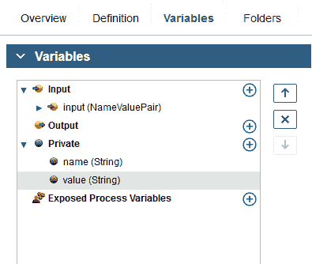

8.  在 Definition 选项卡上，为流程添加一个 **脚本任务** (init)、一个 **用户任务** (Review Order) 和一个 **子流程** (do whatever is needed)，并将其连接在一起。

    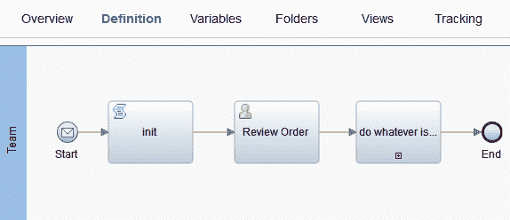

9.  实现 Start 事件。

    在 Properties 选项卡中，单击 **Implementation**。对于 Start Event Type，请选择 **Message**，对于 Attached message UCA，请选择刚才创建的 UCA。由于我们要在流程中使用消息数据，因此请同时选中 **Consume message**。

    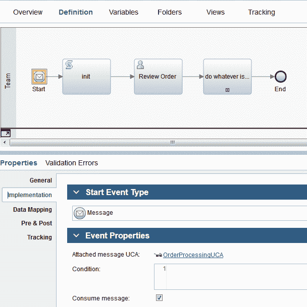

10.  单击 **Data Mapping**，将 `Output(NameValuePair)` 映射到 Input 变量，并将 `name(String)` 和 `value(String)` 映射到您先前创建的 Private 变量。

    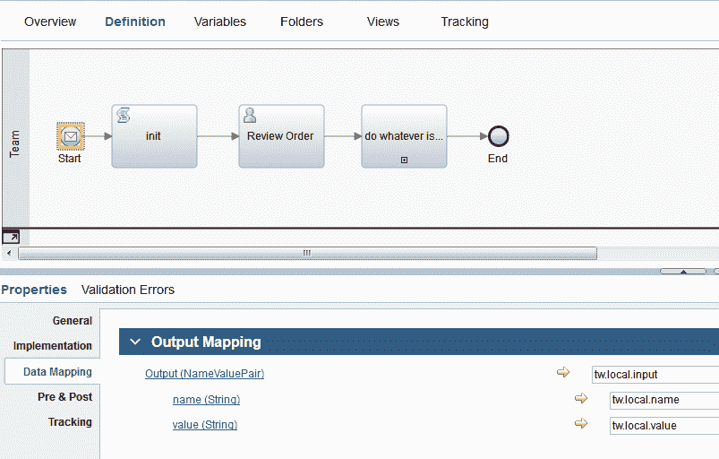

11.  实现 init 脚本任务。

    在 Properties 选项卡中，单击 **Script**。要检查是否已成功收到事件消息，请记录消息的值。

    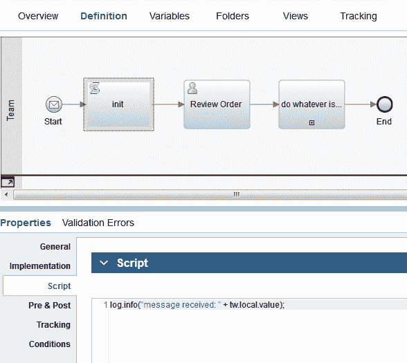

12.  保存工作，并创建流程应用的快照。
13.  通过在 Process Admin Console 中激活流程应用，使 UCA 可从 IBM BPM 外部访问。

    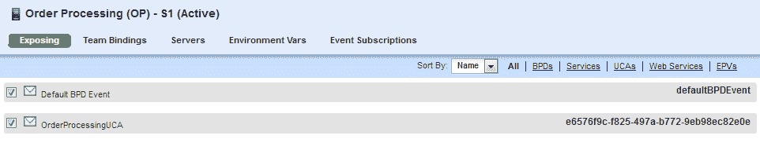

UCA 现已准备好接收事件消息。

提示：在进入下一步之前，请使用随 IBM BPM 提供的 REST API Tester 测试您的 UCA。

1.  访问 REST API Tester。
2.  展开 Business Process Manager REST API，然后展开 Process API。
3.  选择 **Send Message**。
4.  选择 **POST method**。
5.  对于消息，请使用以下格式。根据需要替换 `processApp` 和 `ucaname`，以匹配您使用的名称。

    ```
    <eventmsg>
      <event processApp="OP" ucaname="OrderProcessingUCA">
      </event>
      <parameters>
        <parameter>
          <key>Input</key>
          <value type="NameValuePair">
            <name>message</name>
            <value>Hello from REST API Tester</value>
          </value>
        </parameter>
      </parameters>
    </eventmsg> 
    ```

6.  单击 `Execute Call`。您应该会在 REST API Tester 中看到如下结果：

    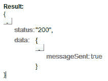

7.  在 Process Portal 中，您应该会看到已启动流程的实例。
8.  在 SystemOut.log 文件中，应该会看到“`message received: Hello from REST API Tester`”。

祝贺您，UCA 已正常运行！

5

## 扩展 Event Bridge 以响应事件

目前，我们在步骤 3 中开发的 Event Bridge 可以检测到从 Hyperledger Composer REST 服务器发出的事件。在此场景中，当发生 `PlaceOrderEvent` 事件时，我们要启动一个 IBM BPM 流程实例，以便制造商处理订单。因此，就需要在 EventBridge.js 中扩展 `connection.on('message')` 函数，以执行必要的 REST 调用。构造 URL 时，将经过编码的事件消息作为消息值添加到 URL 中。

请求包括：

*   构造的 URL。将主机名替换为 BPM 服务器的主机名。
*   `Method: 'POST'`
*   标头，包括 ‘Content-Type’：’application/json’, ‘Authorization’ : ‘Basic *credentials*‘，其中 *credentials* 是您的 BPM 服务器的用户名:密码的 Base64 编码

**备注**：为演示 Event Bridge 的基本功能（订阅区块链事件和启动 BPM 流程），此样本较为简单且易于理解。如果您在自己的环境中使用此样本，可能要替换 `rejectUnauthorized: false` 选项，并添加 BPM 服务器的 CA 证书文件内容，以便可验证服务器的身份。请参阅 [`github.com/request/request`](https://github.com/request/request)，获取更多详细信息。

```
connection.on('message', function(message) {
var jsonString = JSON.parse(message.utf8Data);

if (jsonString.$class == "org.acme.vehicle.lifecycle.manufacturer.PlaceOrderEvent") {
console.log("PlaceOrderEvent received: '" + message.utf8Data + "'");
console.log("Starting IBM BPM process to process order...");

// replace username:password and hostname
var base64encoded = Buffer.from("username:password").toString('base64');
var urlcomplete = 'https://bpmserver:9443/rest/bpm/wle/v1/process?action=sendMessage&message=<eventmsg><event processApp="OP" ucaname="OrderProcessingUCA"></event><parameters><parameter><key>Input</key><value type="NameValuePair"><name>message</name><value>' + encodeURIComponent(message.utf8Data) + '</value></value></parameter></parameters></eventmsg>';

// if class of event : "org.acme.vehicle.lifecycle.manufacturer.PlaceOrderEvent" call the BPM UCA to process the order.
request({
url: urlcomplete,
method: 'POST',
headers: {'Content-Type': 'application/json', 'Authorization' : 'Basic ' + base64encoded},
rejectUnauthorized: false
}, function (err, resp, body) {
if (err){
console.log("resp = " + resp);
}
else{
console.log("StatusCode: "+resp.statusCode);
if (resp.statusCode == 200) {
console.log(body);
}
}
});
};
    }); 
```

服务器请求还需要三个 npm 组件，这些组件需要添加到 EventBridge.js 中：

```
var request = require('request');
var response = require('response');
var https = require('https'); 
```

要运行该脚本，请执行以下操作：

1.  安装所需的 npm 模块：

    `npm install request`

    `npm install response`

    `npm install https`

2.  运行该脚本：

    `node EventBridge.js`

3.  检查控制台中是否显示以下消息：

    `Connection established`

4.  在区块链上下单，如步骤 1 中所示。（提示：由于订单 ID 必须唯一，切记在此处使用其他值。）
5.  检查控制台中是否显示事件有效内容，包括 `orderId` 和 `vehicleDetails`：

    ```
    PlaceOrderEvent received:
    '{"$class":"org.acme.vehicle.lifecycle.manufacturer.PlaceOrderEvent","orderId":"99995","vehicleDetails
    ":{"$class":"org.vda.VehicleDetails","make":"Arium","modelType":"Rose","colour":"red"},"eventId":"a7ca458a434f45f3f73a95db3248a2258eea216e983cf4985860ba6713c92cba#0","timestamp":"2017-
    11-03T15:26:05.528Z"}' 
    ```

6.  检查控制台中是否还显示以下消息：

    ```
    Starting IBM BPM process to process order...
    StatusCode: 200
    {"status":"200","data":{"messageSent":true}} 
    ```

7.  检查 Process Portal 是否包含 Review Order 任务，此任务指示已启动流程实例。
8.  检查 SystemOut.log 文件是否显示以下内容：

    ```
    message received:
    {"$class":"org.acme.vehicle.lifecycle.manufacturer.PlaceOrderEvent","orderId":"99995","vehicleDetails"
    :{"$class":"org.vda.VehicleDetails","make":"Arium","modelType":"Rose","colour":"red"},"eventId":"a7ca458a434f45f3f73a95db3248a2258eea216e983cf4985860ba6713c92cba#0","timestamp":"2017-
    11-03T15:26:05.528Z"} 
    ```

Event Bridge 现已接收事件，并启动 IBM BPM 流程实例以响应此事件！

6

## 扩展 IBM BPM 流程以执行此订单

现在，您可以扩展 IBM BPM 流程。解析事件消息、将数据传递至人员服务，并在用户界面中安排订单详细信息，以便于业务人员复查订单。 最后，在区块链上执行对应的事务以更新订单状态。

在此步骤中，Process Designer 中的服务发现可作为您的助手。它可发现业务网络中可用的模型和操作，并生成可在流程中使用的外部服务。

1.  在 Hyperledger Composer REST 服务器上下载 swagger.json。此 OpenAPI 规范描述了供业务网络使用的操作和模型。
2.  在流程应用中，单击 Services 旁的加号 (+)，并创建一项外部服务。

    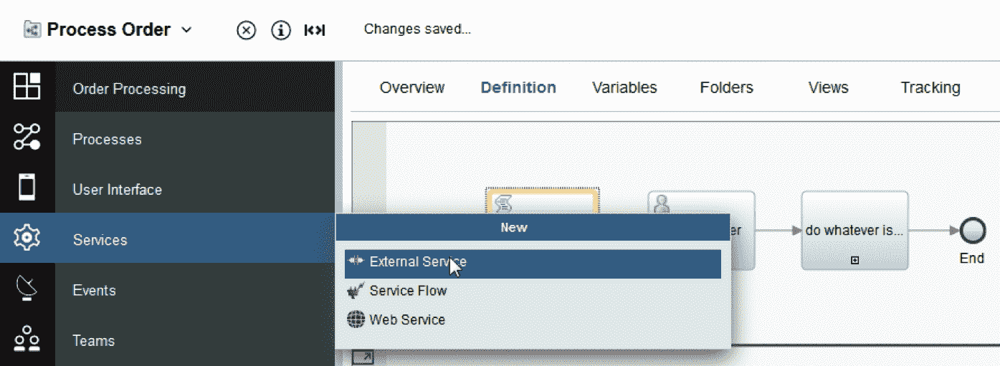

3.  选择 **Java**、**REST** 或 **Web service**。
4.  浏览以选择您在步骤 1 中下载的 swagger.json 文件，然后单击 **Next**。
5.  在显示生成的外部服务中所包含操作的面板上，取消选中除 Order、Vehicle 和 UpdateOrderStatus 以外的所有操作：

    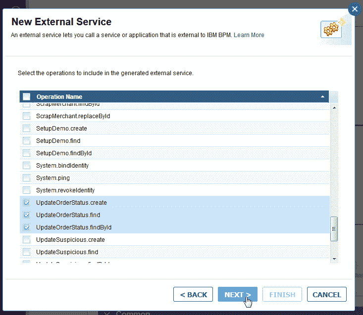

6.  创建一个新服务器。单击 **Finish**。

    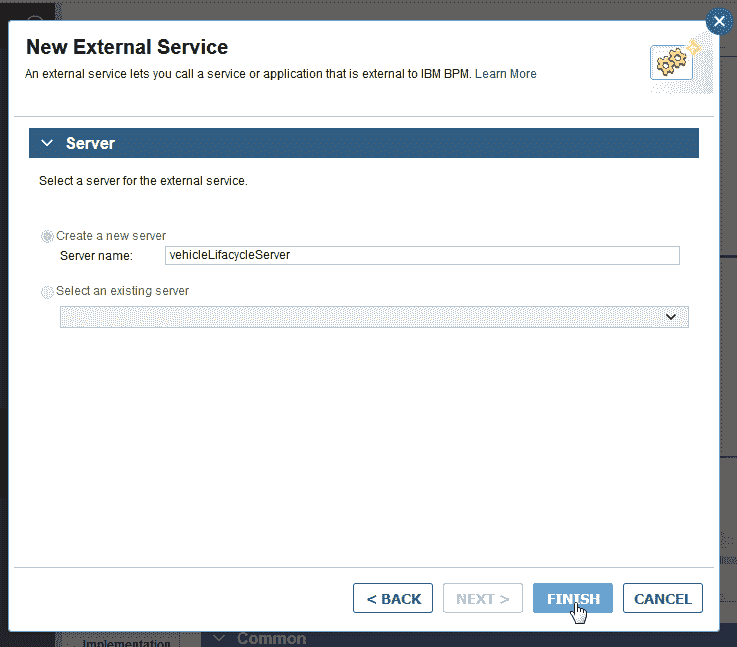

7.  浏览发现的业务对象：

    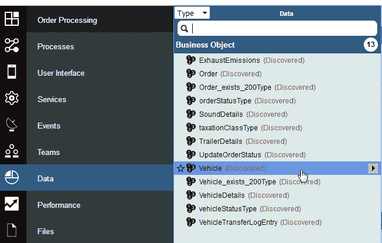

8.  浏览发现的操作：

    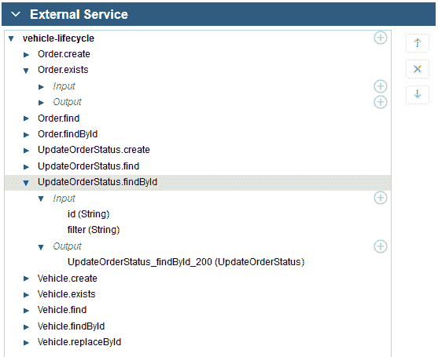

9.  浏览连接的流程应用，或查看此系列教程的[第 1 部分](https://www.ibm.com/developerworks/cn/middleware/library/mw-1705-auberger-bluemix/1705-auberger.html)，了解如何在流程中使用发现的数据类型和操作。

7

## 使用中间事件来响应区块链事件

您可以遵循相同的过程，并使用 IBM BPM 中的中间消息事件来响应区块链事件。*中间消息事件*允许在执行流程期间接收消息事件。对于此类型的事件，您还可以使用 UCA 来触发消息事件。在流程图中，使用“Intermediate message event”组件代替“Start event”。此外，要将事件消息传递到正确的流程实例，需要向 UCA 的输出值分配一个关联值。

遵循这些[中间消息事件定义步骤](https://www.ibm.com/support/knowledgecenter/en/SSFPJS_8.6.0/com.ibm.wbpm.wle.editor.doc/topics/modeling_message_events_B.html)来操作。

在此示例中，UCA 输出的参数名已分配给变量 `orderId`：


在 EventBridge.js 中，按如下方式定义请求中使用的 URL 以触发 UCA：

```
var urlcomplete = 'https://bpmserver:9443/rest/bpm/wle/v1/process?action=sendMessage&message=<eventmsg><event processApp="OP" ucaname="OrderProcessingUCA"></event><parameters><parameter><key>Input</key><value type="NameValuePair"><name>' + jsonString.orderId + '</name><value>' + encodeURIComponent(message.utf8Data) + '</value></value></parameter></parameters></eventmsg>'; 
```

在此样本中，将向流程实例传递含参数 `<name>9876</name>` 的事件消息，其中变量 `tw.local.oderId` 为 9876。

## 结论

在 Hyperledger Composer REST 服务器中可以很方便地公开区块链事件，以便连接的应用可以使用 WebSocket 协议订阅这些事件。在本教程中，您学习了如何实现 Event Bridge 以侦听由 Hyperledger Composer REST 服务器发出的事件，并在 IBM BPM 中调用相应的 Undercover Agent (UCA)。您还学习了如何配置由 Event Bridge 触发的 UCA 以响应事件，并启动流程实例以采取必要的操作。

您可以克隆以下 GitHub 存储库以使用 Event Bridge 样本：[`github.com/ibmbpm/bpm-blockchain-events/tree/master`](https://github.com/ibmbpm/bpm-blockchain-events/tree/master)。

我们渴望了解您在集成 IBM BPM 和区块链时的体验，以及任何进一步的需求。请在下方给出评论，要了解更多联系方式，请访问个人简介（[Larissa](https://developer.ibm.com/author/larissa3/) 和 [Matthias](https://developer.ibm.com/author/matthias.kloppmann/)）中的链接。

## 致谢

我们要感谢 Ute Tanneberger 和 Thomas Duerr 对本教程的仔细审查，以及他们提出的宝贵意见和更正。感谢 Thomas 和 Benjamin Wende 对代码的全面审查。同时还感谢 Helen O’Shea 和 Joshua Horton 提出的非常有用的意见和编辑建议。

本文翻译自：[Archived | Enable business processes to react to blockchain events](https://developer.ibm.com/tutorials/cl-enable-bpm-business-processes-to-react-to-blockchain-events/)（2017-01-01）