# 使用区块链管理企业内容存储库中存储的法律文档

> 原文：[`developer.ibm.com/zh/tutorials/cl-use-blockchain-bpm-manage-legal-documents-letter-of-credit/`](https://developer.ibm.com/zh/tutorials/cl-use-blockchain-bpm-manage-legal-documents-letter-of-credit/)

***注意：**IBM Blockchain Platform 现在使用 Hyperledger Fabric 进行端到端开发。用户可以根据自己的选择使用 Hyperledger Composer，但 IBM 不会为其提供支持。*

这是有关将区块链技术与 IBM Business Process Manager 配合使用的教程系列中的第 3 部分。区块链是一个不可改变的共享分类账，用于记录业务交易历史信息。它引入了新一代交易应用，可在交换物理或数字资产时建立信任、问责制和透明度。

[第 1 部分](https://www.ibm.com/developerworks/cn/middleware/library/mw-1705-auberger-bluemix/1705-auberger.html)显示了如何通过结合使用业务流程管理 (BPM) 和区块链技术来简化多个企业之间的分布式协作流程。所有参与者都使用一个共享分类账，并且通过智能合约来管理交易。不再将相关数据单独存储在个别信息系统中并在双方间双向同步，而是更新单个共享分类账实例，并且向所有参与者显示其信息（基于各自的授权）。


获取最佳免费工具、培训和社区资源的每月集萃，帮助您开始使用区块链。
**[最新一期](http://ibm.biz/blockchain-newsletter)** | **[订阅](http://ibm.biz/blockchain-newsletter-signup)**

在[第 2 部分](https://www.ibm.com/developerworks/cn/cloud/library/cl-enable-bpm-business-processes-to-react-to-blockchain-events/index.html?ca=drs-)，我们不仅谈到了通过区块链来共享数据，还探究了区块链的“主动行为”：它能够通过发送事件通知参与者已成功完成交易。

## 本教程概述

在本教程中，您将了解如何使用 IBM Business Process Manager 和 IBM Enterprise Content Manager，通过区块链网络使用物理合同来促进交易。我们将使用信用证交易来演示如何根据内容存储库中存储的合同文档来协调货物的付款。

*信用证*是一种支付方式，也是国际贸易的重要组成部分。买方和卖方都依赖银行的安全性来确保收到货款和提供货物。在信用证交易中，货物是按照开证行的指令进行托运的，这意味着直到买方已付款或承诺向银行支付单据，该银行才会放开对货物的控制权。有关信用证单据和区块链的更多背景信息，请观看此[短片](https://www.youtube.com/watch?v=mEzPqE7xcsg)。

## 信用证单据交易中的常见问题

如果此方案中不采用区块链技术，如图 1 所示，通常会出现以下问题：

*   不一致或无记录的流程
*   不必要的手动工作
*   有限且低效的工作流程和业务策略自动化
*   较差的端到端流程可视性
*   缓慢且低效的异常处理过程

##### 图 1\. *未采用区块链技术*的信用证交易

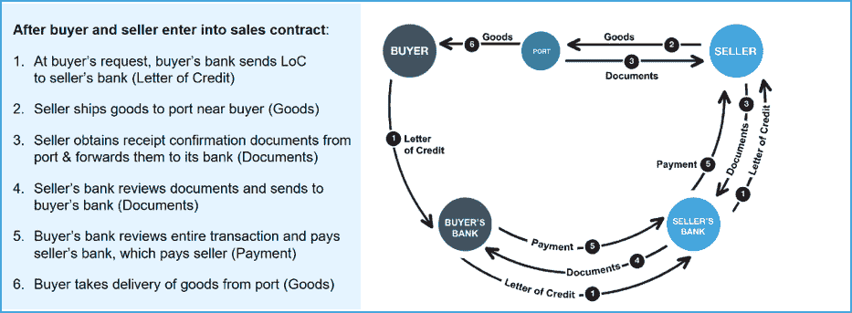

但是，如果在此方案中采用了区块链技术，通常就会缓解乃至完全解决这些问题，如图 2 所示。区块链引入了及时且准确的流程，提高了绩效。通过使用分布式账本作为基础记录系统，所有参与者都能实现重大的业务流程改进。

##### 图 2\. *采用区块链技术*的信用证交易

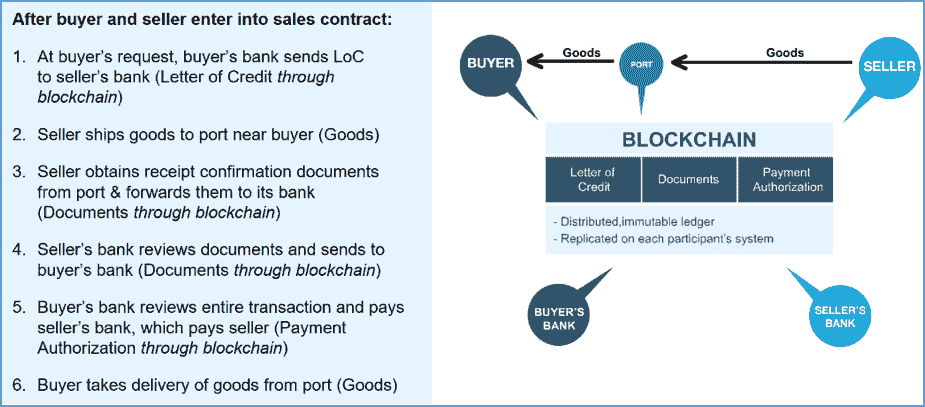

让我们来看看网络中使用共享分类账进行信用证单据交易的各方情况。四个参与者分别为：买方、卖方、买方银行和卖方银行。参与者检索单据并更新分类账上的信息，然后在其他人提交单据时对事件做出反应。在本教程中，我们将着重关注买方银行。买方银行会审查整个交易并向卖方银行付款，卖方银行则又向卖方付款（通过区块链的支付授权），如图 3 所示。

##### 图 3\. 网络中的参与者

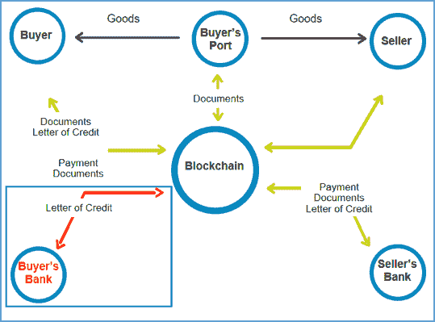

## 完美组合：IBM BPM、IBM ODM、IBM ECM 和 IBM Blockchain

我们的方案侧重于买方银行参与区块链网络并与之交互时该银行的内部业务流程。买方银行可以使用 **IBM BPM** 自动执行单据验证流程，而无需手动查看和验证各类单据。**IBM ODM** 决策服务使用区块链上存储的单据元数据，验证单据在区块链事务上下文中是否有效。如果验证失败，该流程将分配一个人（知识工作者）来手动审查单据。 此审查所使用的文档是从 **IBM ECM** 文档库检索到的

通过区块链事务来启动流程，如*采用区块链技术*的信用证交易中的步骤 4（卖方银行通过区块链来审查单据并将其提交给买方银行）所示。在此流程中，买方银行通过比较 ECM 中的单据相关信息与区块链中存储的单据元数据来验证单据（例如，使用单据散列值来确保单据尚未更新，或比较特定单据属性以确保它们与分类账中存储的信息一致）。另外，IBM ODM 决策服务还会验证这些单据在区块链事务上下文中是否有效。

##### 图 4\. 买方银行如何与区块链和 ECM 交互以验证单据

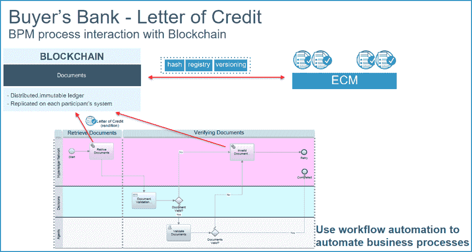

## 前提条件

### IBM Business Process Manager

**IBM Business Process Manager** 是一个业务流程管理 (BPM) 平台。它包括用于流程设计和执行的工具和运行时，以及用于监控和优化平台内所执行工作的功能。流程所有者和业务用户使用该平台能够直接参与业务流程改进工作。

### IBM Blockchain

**IBM Blockchain** 基于 Linux 基金会的 [Hyperledger Fabric](https://www.ibm.com/blockchain/hyperledger.html)。Hyperledger Fabric 是一个业务区块链框架，包含一个广泛的开放式开发工具集和框架，可帮助您开发用例并部署区块链解决方案。它可用于对业务网络进行建模，如图 5 所示。

##### 图 5\. 使用 Hyperledger Fabric 对业务网络进行建模

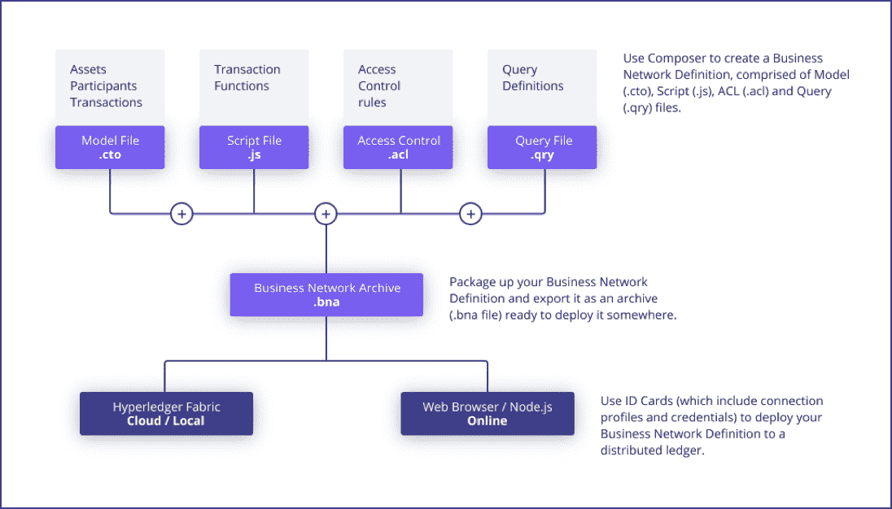

对于我们的信用证方案，您可以使用基于 Hyperledger Composer 的 IBM Blockchain Platform 开发人员工具来创建业务网络定义，该定义打包在 .bna（业务网络归档）文件中。开发人员环境支持将 .bna 文件部署到本地或基于云的区块链网络，以便进一步开发和共享。Hyperledger Composer 中的资源（如*资产*、*参与者*和*交易*）使用 Composer 建模语言来表达。参与者包括卖方、买方、卖方银行和买方银行。资产包括以事务形式存储或处理的贸易和单据。清单 1 中显示了样本信用证数据模型。

##### 清单 1\. 样本信用证数据模型（.bna 文件）

```
Trade
  {
    "$class":"com.ibm.bpm.blockchain.loc.Trade",
    "tradeId": "string",
    "term": "string",
    "state": "string",
    "docId": "string",
    "buyerId": "string",
    "sellerId": "string",
    "buyerBankId": "string",
    "sellerBankId": "string",
  }

Actor
  {
    "$class": "com.ibm.bpm.blockchain.loc.Actor",
    "actorId": "string",
    "name": "string",
    "role": "string",
  }

Document
  {
    "$class": "com.ibm.bpm.blockchain.loc.Document",
    "documentId": "string",
    "name": "string",
    "type": "string",
    "version": "string",
    "registry": "string",
    "hash": "string",
    "valid": true,
    "submittedBy": "string",
  } 
```

您可以从本教程末尾的可下载的资源部分下载样本信用证 .bna 文件 (letter_of_credit.bna)。模型文件包含用于执行交易的 JavaScript 逻辑（智能合约），包括验证交易 ID 是否正确，以及参与者是否获得适当授权以在信用证方案中执行交易。

##### 图 6\. 样本信用证智能合约

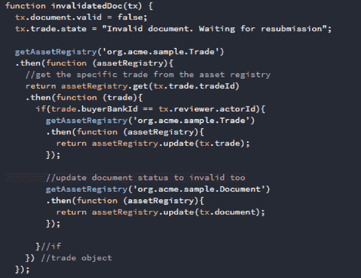

在 Hyperledger Composer 上部署业务网络后，您可以生成 REST API。

##### 图 7\. 样本信用证 REST API

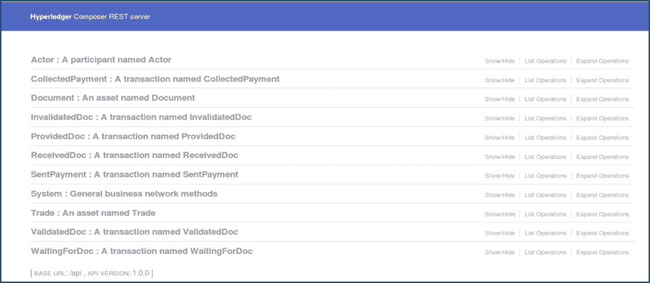

最后，您需要一个 Swagger 定义文件，用于从 IBM BPM 中发现服务。您可以从本教程末尾的可下载的资源部分下载该信用证 Swagger 文件 (letter_of_credit.json)。

### IBM Operational Decision Manager (ODM)

IBM Operational Decision Manager (ODM) 是一个数字流程自动化工具，用于捕获、自动执行和管理多次反复制定的业务决策。

##### 图 8\. IBM Operational Decision Manager (ODM) 功能

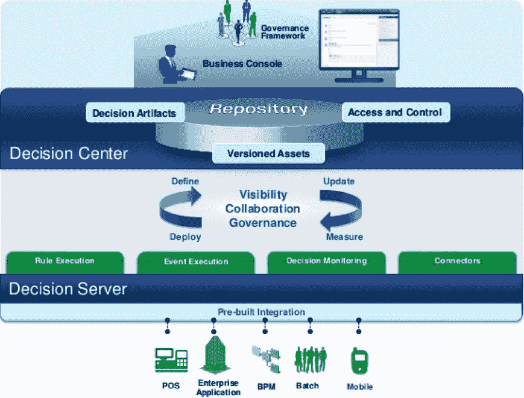

### IBM 企业内容管理 (ECM)

IBM 企业内容管理 (ECM) 提供可支持数字化转型的内容服务和解决方案，用于构建认知业务，并能够捕获、保护、激活、分析和操作内容，进一步完善洞察和措施。由卖方银行提交给 ECM 服务器的信用证单据进行了数字化和散列处理，以便确保原始性、安全性和可访问性。

## 实现

在我们的信用证方案中，卖方银行向业务网络提供单据后，买方银行与信用证网络进行交互。买方银行业务流程将从业务网络中检索贸易和单据属性。

### 业务规则

在流程的开始和结束之间，IBM Operational Decision Manager (ODM) 根据一组业务规则来验证单据，并通过执行交易来更新资产，如图 9 所示。ODM 业务规则包括：

*   通过散列键验证单据的原始有效性。
*   验证数字化单据格式的有效性。
*   验证单据中的所有可识别字段是否均已填充。
*   验证单据中所有日期时间和货币格式的有效性。
*   验证单据中出发和到达国家或地区和港口的有效性。

##### 图 9\. ODM 如何根据业务规则来验证单据和更新资产

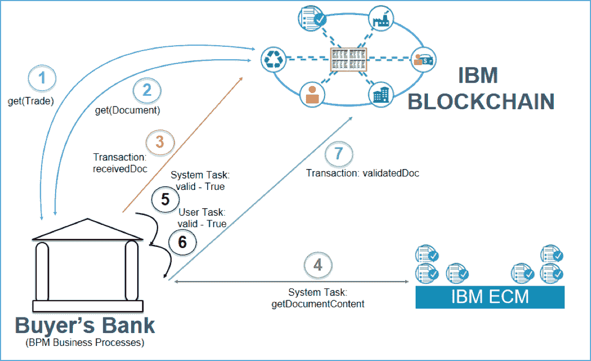

### Business Process Manager

在 BPM（如图 10 所示）中，我们方案的起始服务为 **检索贸易服务流**。

##### 图 10\. BPM 服务

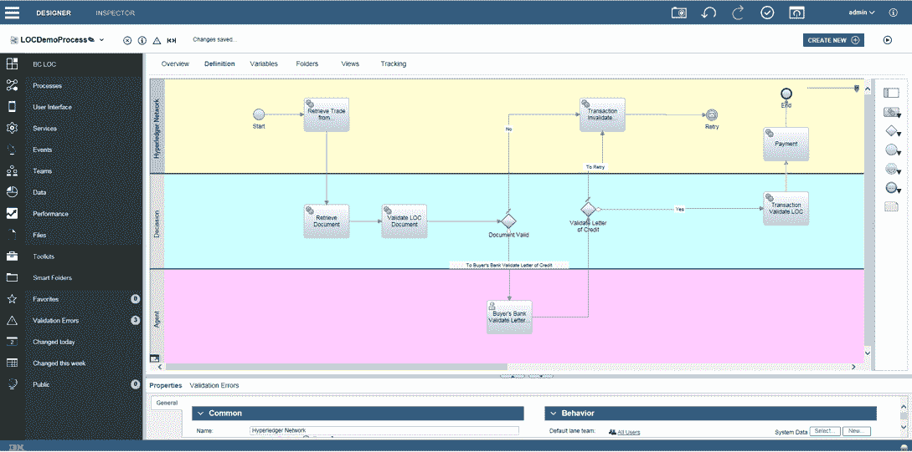

该服务基本上会检索有关信用证 `tradeId`、`docId`、此贸易中的所有参与者以及区块链内 `state` 的信息，如图 11 所示。

##### 图 11\. 要检索的信息

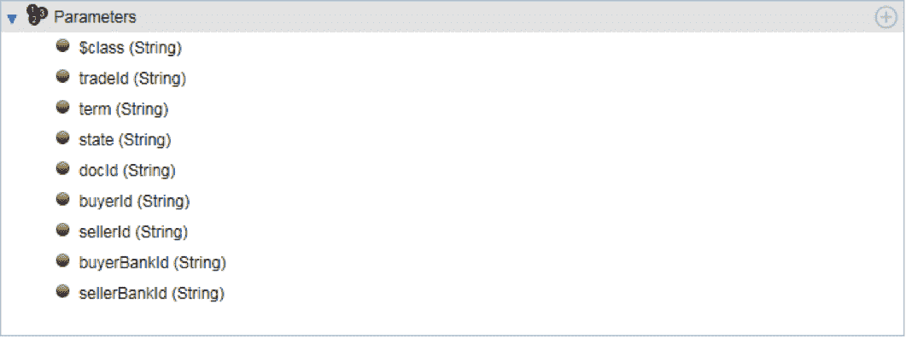

`docId` 被引导至 **检索单据服务流**。该服务流将调用区块链，根据 `docId` 利用名称值、Rendition 文件格式、版本控制、URL 注册表、散列代码和有效性来检索单据信息。当单据文件值正确匹配时，将引导至检索单据内容。活动任务是来自 ECM 服务器的内容集成任务，具有操作 `get document content`，用于返回内容。从 ECM 服务器返回的内容采用二进制格式，因此会通过清单 2 中所显示的脚本将其转换为文本字符串：

##### 清单 2\. 转换脚本（二进制转换为文本）

```
var str = tw.local.content;
var byteValue = Packages.java.lang.String(str).getBytes();
var content64 = Packages.org.apache.commons.codec.binary.Base64.decodeBase64(byteValue);
var value = new java.lang.String(content64, "UTF-8");
tw.local.outputContent = value; 
```

在该信用证单据示例中，采用图 12 中所示格式来存储样本数据：

##### 图 12\. 样本数据的存储方式


清单 3 中显示了用于从数据格式抽取值的样本脚本：

##### 清单 3\. 样本数据的存储方式

```
var str = tw.local.outputContent;
var content = str.split(",");

var shipped_date_value= content[0].split("=");
tw.local.shippedDate = shipped_date_value[1];

var processing_date_value= content[1].split{"=");
tw.local.processingDate = processing_date_value[1];

var amount_claim_value= content[2].split("=");
tw.local.claimAmountClaim = amount_claim_value[1];

var received_date_value= content[3].split("=");
tw.local.receivedDate = received_date_value[1]; 
```

输出内容可用于 **验证单据服务流**。该服务流会验证元数据代码，并通过业务规则调用 ODM 决策服务（先前所示）以验证单据状态。 如果状态验证无效，那么将流至 **无效的单据服务流**，这将向区块链发送事务且状态为“使单据失效”，并且将单据的有效状态设置为 `false`。如果状态验证有效，那么将流至 **验证信用证人员服务**，如图 13 所示：

##### 图 13\. 有效状态验证

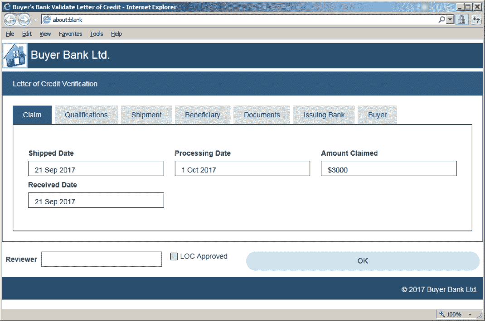

内容中的所有文本数据都将映射到用户界面中的相应字段，因此买方银行可以决定是否批准。如果未批准，那么将流至 **无效的服务流**。如果已获得批准，那么将流至 **事务：验证 LOC 服务流**，然后流至 **支付服务流** 以完成此流程。

## 结论

Business Process Manager 用户可以无缝地利用最新的区块链技术。您可以定义和实施自己的业务流程规则，并与区块链集成以管理资产。在该信用证方案中，我们使用了区块链来存储有关企业内容存储库中所存储的物理合法合同的有效性元数据，从而支持系统验证合同是否未被改动。

## 后续行动

准备好开发您自己的区块链用例了吗？

*   [在数分钟内为您的用例开发概念证明区块链网络](http://developer.ibm.com/blockchain/sandbox)
*   [查看样本区块链网络和应用的代码模式](https://developer.ibm.com/technologies/blockchain/patterns/)

本文翻译自：[Archived | Use blockchain to manage legal documents stored in an enterprise content repository](https://developer.ibm.com/tutorials/cl-use-blockchain-bpm-manage-legal-documents-letter-of-credit/)（2017-01-01）