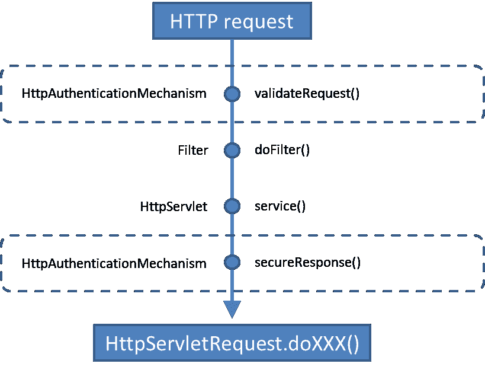

# 通过 HttpAuthenticationMechanism 执行 Web 身份验证

> 原文：[`developer.ibm.com/zh/tutorials/j-javaee8-security-api-2/`](https://developer.ibm.com/zh/tutorials/j-javaee8-security-api-2/)

**关于本系列**

期盼已久的新 [Java EE Security API (JSR 375)](https://jcp.org/en/jsr/detail?id=375) 推动 Java 企业安全性进入了云和微服务计算时代。本系列将展示新安全机制如何简化和标准化各种 Java EE 容器实现之间的安全处理，然后帮助您开始在受云支持的项目中使用它们。

[本系列的第 1 篇文章](https://www.ibm.com/developerworks/cn/java/j-javaee8-security-api-1/index.html) 概述了 [Java EE Security API (JSR 375)](https://jcp.org/en/jsr/detail?id=375) ，包括对新 `HttpAuthenticationMechanism` 、 `IdentityStore` 和 `SecurityContext` 接口的大体介绍。本文是 3 篇深入剖析文章的第一篇，您将学习如何使用 `HttpAuthenticationMechanism` 在一个示例 Java Web 应用程序中设置和配置用户身份验证。

`HttpAuthenticationMechanism` 接口是 Java™ EE 的新 HTTP 身份验证机制的核心。它提供了 3 个内置的启用了 CDI（上下文和依赖注入）的实现，这些实现自动被实例化并提供给 CDI 容器使用。这些内置的实现支持 Servlet 4.0 指定的 3 种经典身份验证方法：基本 HTTP 身份验证、基于表单的身份验证和基于表单的自定义身份验证。

除了内置的身份验证方法之外，您还可以选择使用 `HttpAuthenticationMechanism` 来开发自定义身份验证。如果您需要支持特定的协议和身份验证令牌，可以选择此选项。一些 servlet 容器可能也提供了自定义 `HttpAuthenticationMechanism` 实现。

本文将结合实践来介绍如何使用 `HttpAuthenticationMechanism` 接口和它的 3 种内置实现。我还将展示如何编写您自定义的 `HttpAuthenticationMechanism` 身份验证机制。

[获得代码](https://github.com/readlearncode/Java-EE-8-Sampler/tree/master/security-1-0)

## 安装 Soteria

我们将使用 Java EE 8 Security API 参考实现 [Soteria](https://github.com/javaee/security-soteria) 来探索可通过 `HttpAuthenticationMechanism` 访问的内置和自定义身份验证机制。您可以通过两种方式之一获取 Soteria。

### 1.在 POM 中显式指定 Soteria

使用以下 Maven 坐标在 POM 中指定 Soteria：

##### 清单 1\. Soteria 项目的 Maven 坐标

```
<dependency>
  <groupId>org.glassfish.soteria</groupId>
  <artifactId>javax.security.enterprise</artifactId>
  <version>1.0</version>
</dependency> 
```

### 2.使用内置的 Java EE 8 坐标

符合 Java EE 8 规范的服务器将拥有自己的新 Java EE 8 Security API 实现，否则它们会依靠 Sotoria 的实现。无论如何，您都只需要 Java EE 8 坐标：

##### 清单 2\. Java EE 8 Maven 坐标

```
 <dependency>
 <groupId>javax</groupId>
 <artifactId>javaee-api</artifactId>
 <version>8.0</version>
 <scope>provided</scope>
</dependency> 
```

## 内置身份验证机制

内置 HTTP 身份验证机制支持为 [Servlet 4.0（13.6 小节）](https://javaee.github.io/servlet-spec/downloads/servlet-4.0/servlet-4_0_FINAL.pdf) 指定的身份验证风格。在接下来的几节中，我将展示如何使用注解来启动这 3 种身份验证机制，以及如何在 Java Web 应用程序中设置和实现每种机制。

### @BasicAuthenticationMechanismDefinition

`@BasicAuthenticationMechanismDefinition` 注解触发 Servlet 4.0（13.6.1 小节）所定义的 HTTP 基本身份验证。它拥有一个可选参数 `realmName` ，该参数指定将通过 `WWW-Authenticate` 标头发送的范围名称。清单 3 展示了如何为范围名称 `user-realm` 触发 HTTP 基本身份验证。

##### 清单 3\. HTTP 基本身份验证机制

```
@BasicAuthenticationMechanismDefinition(realmName="user-realm")
@WebServlet("/user")
@DeclareRoles({ "admin", "user", "demo" })
@ServletSecurity(@HttpConstraint(rolesAllowed = "user"))
public class UserServlet extends HttpServlet {... } 
```

### @FormAuthenticationMechanismDefinition

`@FormAuthenticationMechanismDefinition` 注解触发 Servlet 4.0 规范（13.6.3 小节）所定义的基于表单的身份验证。它有一个必须设置的配置选项。 `loginToContinue` 选项接受一个已配置的 `@LoginToContinue` 注解，这使得应用程序能提供”登录并继续操作”的功能。您可以选择使用合理的默认设置，或者为此特性指定 4 种特征之一。

在清单 4 中，登录页指定为 URI `/login-servlet` 。如果身份验证失败，则将操作流传递给 `/login-servlet-fail` 。

##### 清单 4\. 基于表单的身份验证机制

```
@FormAuthenticationMechanismDefinition(
    loginToContinue = @LoginToContinue(
           loginPage = "/login-servlet",
           errorPage = "/login-servlet-fail"
           )
)
@ApplicationScoped
public class ApplicationConfig { ...} 
```

要设置到达登录页的方式，可以使用 `useForwardToLogin` 选项。要将此选项设置为”forward”或”redirect”，可以指定 `true` 或 `false` ，默认设置为 `true` 。也可以通过一个传递给该选项的 EL 表达式来设置该值： `useForwardToLoginExpression` 。

`@LoginToContinue` 拥有合理的默认设置。登录页被设置为 `/login` ，错误页被设置为 `/login-error` 。

### @CustomFormAuthenticationMechanismDefinition

`@CustomFormAuthenticationMechanismDefinition` 注解提供了配置一个自定义登录表单的选项。在清单 5 中，可以看到网站的登录页被标识为 `login.do` 。登录页被设置为 `loginPage` 参数的一个值，传递给 `@CustomFormAuthenticationMechanismDefinition` 注解的 `loginToContinue` 参数。请注意， `loginToContinue` 是唯一的参数，而且它是可选的。

##### 清单 5\. 自定义表单配置

```
@CustomFormAuthenticationMechanismDefinition(
   loginToContinue = @LoginToContinue(
       loginPage="/login.do"
   )
)
@WebServlet("/admin")
@DeclareRoles({ "admin", "user", "demo" })
@ServletSecurity(@HttpConstraint(rolesAllowed = "admin"))
public class AdminServlet extends HttpServlet { ...} 
```

`login.do` 登录页如清单 6 所示，而且是一个受登录后台 bean 支持的 JSF (JavaServer Pages) 页面，如清单 7 所示。

##### 清单 6\. login.do JSF 登录页

```
<form jsf:id="form">
   <p>
       <strong>Username</strong>
       <input jsf:id="username" type="text" jsf:value="#{loginBean.username}" />
   </p>
   <p>
       <strong>Password</strong>
       <input jsf:id="password" type="password" jsf:value="#{loginBean.password}" />
   </p>
   <p>
       <input type="submit" value="Login" jsf:action="#{loginBean.login}" />
   </p>
</form> 
```

登录后台 bean 使用一个 `SecurityContext` 实例来执行身份验证，如清单 7 所示。如果成功，用户可以访问该资源；否则，操作流会被传递给错误的页面。在这种情况下，系统会将用户转发到 `/login-error` 上的默认登录 URI。

##### 清单 7\. 登录后台 bean

```
@Named
@RequestScoped
public class LoginBean {

   @Inject
   private SecurityContext securityContext;

   @Inject
   private FacesContext facesContext;

   private String username, password;

   public void login() {

       Credential credential = new UsernamePasswordCredential(username, new Password(password));

       AuthenticationStatus status = securityContext.authenticate(
           getRequestFrom(facesContext),
           getResponseFrom(facesContext),
           withParams().credential(credential));

       if (status.equals(SEND_CONTINUE)) {
           facesContext.responseComplete();
       } else if (status.equals(SEND_FAILURE)) {
           addError(facesContext, "Authentication failed");
       }

   }
   // Some methods omitted for brevity
} 
```

## 编写自定义 HttpAuthenticationMechanism

在许多情况下，您会发现这 3 种内置实现就足以满足您的需求。在某些情况下，您可能更喜欢编写自己的 `HttpAuthenticationMechanism` 接口实现。在本节，我将介绍编写一个自定义 `HttpAuthenticationMechanism` 接口的流程。

为了确保它可用于您的 Java 应用程序，您需要通过 `@ApplicationScope` 将 `HttpAuthenticationMechanism` 接口实现为一个 CDI bean。该接口定义了以下 3 个方法：

*   `validateRequest()` 验证一个 HTTP 请求。
*   `secureResponse()` 获取 HTTP 响应消息。
*   `cleanSubject()` 清除所提供的主体和凭证的主题。

所有方法都接受相同的参数类型，它们是： `HttpServletRequest` 、 `HttpServletResponse` 和 `HttpMessageContext` 。这些参数对应于容器所提供的 [JASPIC Server Auth Module](https://github.com/trajano/server-auth-modules) 接口上定义的相应方法。当在 `Server Auth` 上调用一个 JASPIC 方法时，它会委托给您的自定义 `HttpAuthenticationMechanism` 的相应方法。

##### 清单 8\. 自定义 HttpAuthenticationMechanism 实现

```
@ApplicationScoped
public class CustomAuthenticationMechanism implements HttpAuthenticationMechanism {

   @Inject
   private IdentityStoreHandler idStoreHandler;

   @Override
   public AuthenticationStatus validateRequest(HttpServletRequest req,
                                                  HttpServletResponse res,
                                               HttpMessageContext msg) {
       // use idStoreHandler to authenticate and authorize access
       return msg.responseUnauthorized(); // other responses available
   }
} 
```

## HTTP 请求期间的方法执行

在一个 HTTP 请求期间，会在固定的时刻调用 `HttpAuthenticationMechanism` 实现上的方法。图 1 展示了何时调用与 `Filter` 和 `HttpServlet` 实例上的方法相关的每个方法。

##### 图 1\. 方法调用顺序



`validateRequest()` 方法在 `doFilter()` 或 `service()` 方法之前调用，而且会响应在 `HttpServletResponse` 实例上调用的 `authenticate()` 。此方法的目的是允许调用方执行身份验证。为了帮助完成此操作，该方法可以访问调用方的 `HttpRequest` 和 `HttpResponse` 实例。它可以使用这些实例来提取请求的身份验证信息。它还可以写入到 HTTP 响应中，以便将调用方重定向到 OAuth 提供程序。执行身份验证后，它可以使用 `HttpMessageContext` 实例来通知身份验证状态。

`secureResponse()` 方法在 `doFilter()` 或 `service()` 之后调用。它在一个 servlet 或过滤器生成的响应上提供后处理功能。加密是此方法的一种潜在用途。

`cleanSubject()` 方法在 `HttpServletRequest` 实例上调用 `logout()` 方法之后调用。此方法也可用于在发生注销事件后清除与用户相关的状态。

`HttpAuthenticationMechanism` 实例可以使用 `HttpMessageContext` 接口的一些方法来与调用它的 JASPIC `ServerAuthModule` 通信。

## 自定义示例：使用 cookie 的身份验证

前面已经提到过，您通常会编写一个自定义实现来提供内置选项所没有的功能。一个示例是在您的身份验证流中使用 cookie。

在类级别上，您可以使用可选的 `@RememberMe` 注解来有效地”记住”一次用户身份验证，并在每个请求中自动应用它。

##### 清单 9\. 在自定义 HttpAuthenticationMechanism 上使用 @RememberMe

```
@RememberMe(
       cookieMaxAgeSeconds = 3600
)
@ApplicationScoped
public class CustomAuthenticationMechanism implements HttpAuthenticationMechanism {... } 
```

此注解有 8 个配置选项，所有这些选项都包含合理的默认值，所以您不需要手动实现它们：

*   **`cookieMaxAgeSeconds`** 设置 “remember me” cookie 的寿命。
*   **`cookieMaxAgeSecondsExpression`** 是 cookieMaxAgeSeconds 的 EL 版本。
*   **`cookieSecureOnly`** 指定该 cookie 仅应通过安全方式 (HTTPS) 进行访问。
*   **`cookieSecureOnlyExpression`** 是 cookieSecureOnly 的 EL 版本。
*   **`cookieHttpOnly`** 表示该 cookie 应该仅通过 HTTP 请求进行发送。
*   **`cookieHttpOnlyExpression`** 是 cookieHttpOnly 的 EL 版本。
*   **`cookieName`** 设置 cookie 的名称。
*   **`isRememberMe`** 打开或关闭”remember me”。
*   **`isRememberMeExpression`** 是 isRememberMe 的 EL 版本。

`RememberMe` 功能被实现为 *拦截器绑定* 。该容器将拦截对 `validateRequest()` 和 `cleanSubject()` 方法的调用。在一个包含 `RememberMe` cookie 的实现上调用 `validateRequest()` 方法时，会尝试验证调用方。如果成功，则会告知 `HttpMessageConext` 发生了一个登录事件；否则会删除该 cookie。拦截 `cleanSubject()` 方法会删除该 cookie 并完成注销请求。

## 第 2 部分小结

新 `HttpAuthenticationMechanism` 接口是 Java EE 8 中的 Web 身份验证的核心。它的内置身份验证机制支持 Servlet 4.0 中指定的 3 种经典身份验证方法，而且它也很容易针对自定义实现来扩展该接口。在本教程中，您学习了如何使用注解来调用和配置 `HttpAuthenticationMechanism` 的内置机制，以及如何为特殊用例编写自定义机制。您可以通过下面的测验问题来测试所学的知识。

本文是 3 篇介绍新 Java EE 8 Security API 的主要组件的深度剖析文章中的第一篇。接下来的两篇文章将结合实践来介绍 `IdentityStore` 和 `SecurityContext` API。

## 测试您的知识

1.  3 种默认的 `HttpAuthenticationMechanism` 实现是哪些？

    1.  `@BasicFormAuthenticationMechanismDefinition`
    2.  `@FormAuthenticationMechanismDefinition`
    3.  `@LoginFormAuthenticationMechanismDefinition`
    4.  `@CustomFormAuthenticationMechanismDefinition`
    5.  `@BasicAuthenticationMechanismDefinition`
2.  以下哪两种注解会触发基于表单的身份验证？

    1.  `@BasicAuthenticationMechanismDefinition`
    2.  `@BasicFormAuthenticationMechanismDefinition`
    3.  `@FormAuthenticationMechanismDefinition`
    4.  `@FormBasedAuthenticationMechanismDefinition`
    5.  `@CustomFormAuthenticationMechanismDefinition`
3.  以下哪两种配置是基本身份验证的有效配置？

    1.  `@BasicAuthenticationMechanismDefinition(realmName="user-realm")`
    2.  `@BasicAuthenticationMechanismDefinition(userRealm="user-realm")`
    3.  `@BasicAuthenticationMechanismDefinition(loginToContinue = @LoginToContinue)`
    4.  `@BasicAuthenticationMechanismDefinition`
    5.  `@BasicAuthenticationMechanismDefinition(realm="user-realm")`
4.  以下哪三种配置是基于表单的身份验证的有效配置？

    1.  `@FormAuthenticationMechanismDefinition(loginToContinue = @LoginToContinue)`
    2.  `@FormAuthenticationMechanismDefinition`
    3.  `@FormBasedAuthenticationMechanismDefinition`
    4.  `@FormAuthenticationMechanismDefinition(loginToContinue = @LoginToContinue(useForwardToLoginExpression = "${appConfigs.forward}"))`
    5.  `@FormBasedAuthenticationMechanismDefinition(loginToContinue = @LoginToContinue)`
5.  在 HTTP 请求期间，应在 `HttpAuthenticationMechanism` 、 `Filter` 和 `HttpServlet` 实现上按何种顺序调用方法？

    1.  `doFilter()` 、 `validateRequest()` 、 `service()` 、 `secureResponse()`
    2.  `validateRequest()` 、 `doFilter()` 、 `secureResponse()` 、 `service()`
    3.  `validateRequest()` 、 `service()` 、 `doFilter()` 、 `secureResponse()`
    4.  `validateRequest()` 、 `doFilter()` 、 `service()` 、 `secureResponse()`
    5.  `service()` 、 `secureResponse()` 、 `doFilter()` 、 `validateRequest()`
6.  您如何设置 `RememberMe` cookie 的最大寿命？

    1.  `@RememberMe(cookieMaxAge = (units = SECONDS, value = 3600)`
    2.  `@RememberMe(maxAgeSeconds = 3600)`
    3.  `@RememberMe(cookieMaxAgeSeconds = 3600)`
    4.  `@RememberMe(cookieMaxAgeMilliseconds = 3600000)`
    5.  `@RememberMe(cookieMaxAgeSeconds = "3600")`

## 核对您的答案

1.  3 种默认的 `HttpAuthenticationMechanism` 实现是哪些？

    1.  `@BasicFormAuthenticationMechanismDefinition`
    2.  **`@FormAuthenticationMechanismDefinition`**
    3.  **`**@LoginFormAuthenticationMechanismDefinition`**
    4.  `@CustomFormAuthenticationMechanismDefinition`
    5.  **`@BasicAuthenticationMechanismDefinition`**
2.  以下哪两种注解会触发基于表单的身份验证？

    1.  `@BasicAuthenticationMechanismDefinition`
    2.  `@BasicFormAuthenticationMechanismDefinition`
    3.  **`@FormAuthenticationMechanismDefinition`**
    4.  `@FormBasedAuthenticationMechanismDefinition`
    5.  **`@CustomFormAuthenticationMechanismDefinition`**
3.  以下哪两种配置是基本身份验证的有效配置？

    1.  **`@BasicAuthenticationMechanismDefinition(realmName="user-realm")`**
    2.  `@BasicAuthenticationMechanismDefinition(userRealm="user-realm")`
    3.  `@BasicAuthenticationMechanismDefinition(loginToContinue = @LoginToContinue)`
    4.  **`@BasicAuthenticationMechanismDefinition`**
    5.  `@BasicAuthenticationMechanismDefinition(realm="user-realm")`
4.  以下哪三种配置是基于表单的身份验证的有效配置？

    1.  **`@FormAuthenticationMechanismDefinition(loginToContinue = @LoginToContinue)`**
    2.  **`@FormAuthenticationMechanismDefinition`**
    3.  `@FormBasedAuthenticationMechanismDefinition`
    4.  **`@FormAuthenticationMechanismDefinition(loginToContinue = @LoginToContinue(useForwardToLoginExpression = "${appConfigs.forward}"))`**
    5.  `@FormBasedAuthenticationMechanismDefinition(loginToContinue = @LoginToContinue)`
5.  在 HTTP 请求期间，应在 `HttpAuthenticationMechanism` 、 `Filter` 和 `HttpServlet` 实现上按何种顺序调用方法？

    1.  `doFilter()` 、 `validateRequest()` 、 `service()` 、 `secureResponse()`
    2.  `validateRequest()` 、 `doFilter()` 、 `secureResponse()` 、 `service()`
    3.  `validateRequest()` 、 `service()` 、 `doFilter()` 、 `secureResponse()`
    4.  **`validateRequest()` 、 `doFilter()` 、 `service()` 、 `secureResponse()`**
    5.  `service()` 、 `secureResponse()` 、 `doFilter()` 、 `validateRequest()`
6.  您如何设置 `RememberMe` cookie 的最大寿命？

    1.  `@RememberMe(cookieMaxAge = (units = SECONDS, value = 3600)`
    2.  `@RememberMe(maxAgeSeconds = 3600)`
    3.  **`@RememberMe(cookieMaxAgeSeconds = 3600)`**
    4.  `@RememberMe(cookieMaxAgeMilliseconds = 3600000)`
    5.  `@RememberMe(cookieMaxAgeSeconds = "3600")`

本文翻译自：[Web authentication with HttpAuthenticationMechanism](https://developer.ibm.com/tutorials/j-javaee8-security-api-2/)（2018-03-09）