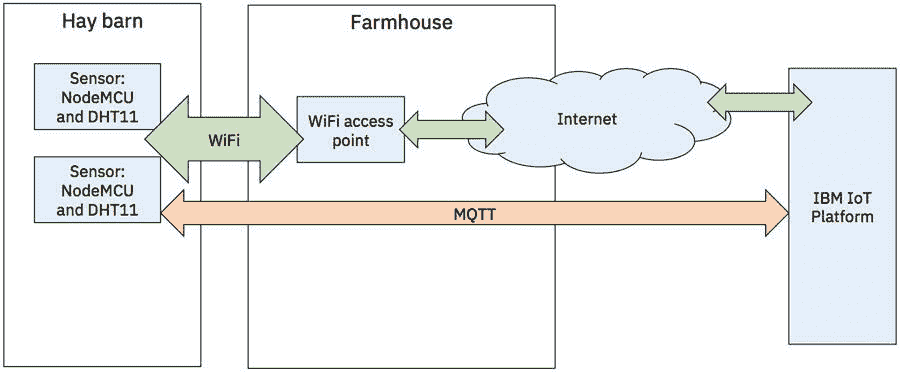
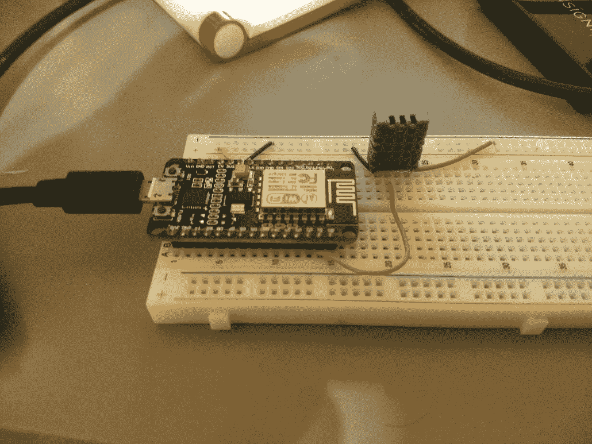
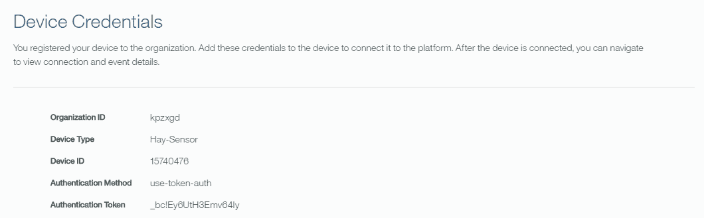
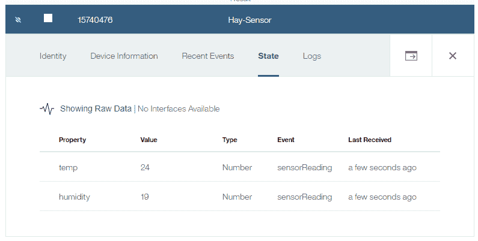
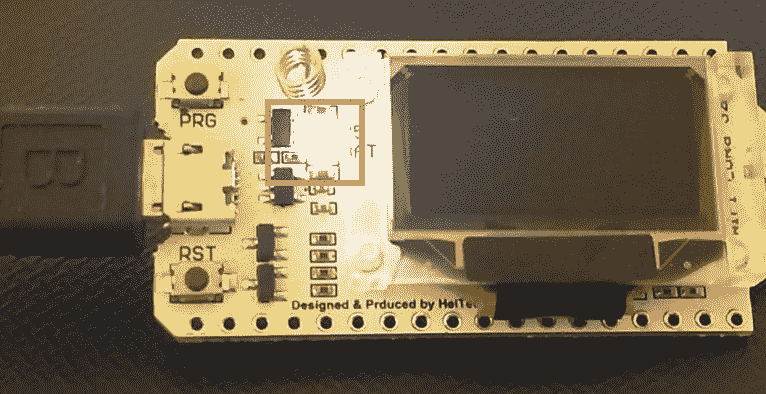
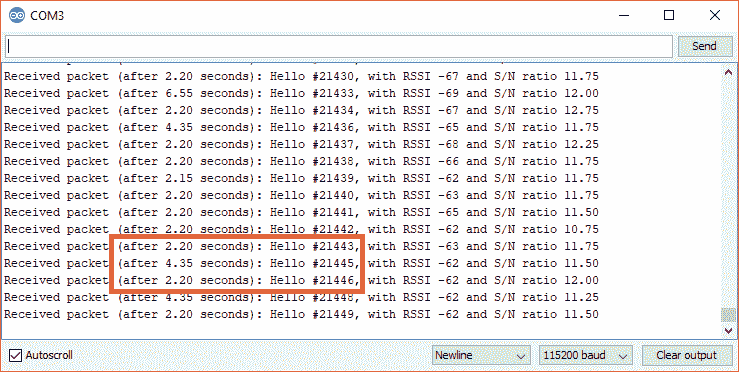
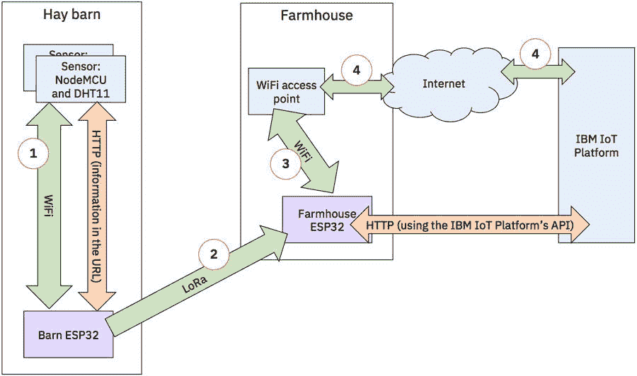
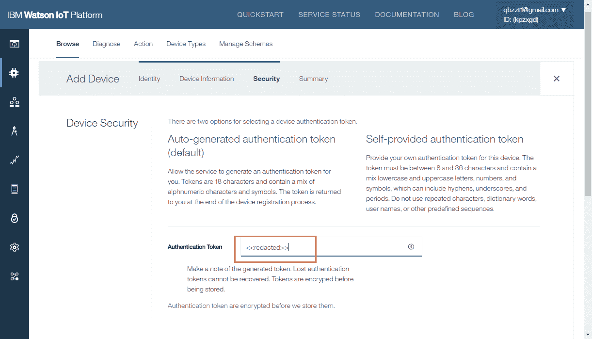

# 将 LPWAN 网络集成到 IoT 解决方案中

> 原文：[`developer.ibm.com/zh/tutorials/iot-lpwan-lora-nodemcu-dhtsensors/`](https://developer.ibm.com/zh/tutorials/iot-lpwan-lora-nodemcu-dhtsensors/)

许多大型 IoT 解决方案需要使用远程无线网络，以便在传感器、网关、云和任何组成 IoT 解决方案的 IoT 应用程序之间进行通信。在本文中，您将学习如何：

*   结合使用 NodeMCU 开发板与 DHT 传感器
*   实现 LPWAN（低功率广域网）网络（具体来讲[LoRa 协议](https://docs.wixstatic.com/ugd/eccc1a_ed71ea1cd969417493c74e4a13c55685.pdf)）
*   使用一个 IoT 平台监控温度和湿度传感器

具体的应用是监控装满干草堆的谷仓发生火灾的风险。干草可以用作动物饲料，对农业非常重要。但是，干草的存放可能很危险。如果干草没有保持非常低的湿度，就会滋生细菌。细菌之类的生物会产生热量。当干草变得足够热时，就会燃烧起来。

## 构建您的应用程序需要做的准备工作

**免费试用 IBM Cloud**

利用 [IBM Cloud Lite](https://cloud.ibm.com/registration?cm_sp=ibmdev-_-developer-tutorials-_-cloudreg) 快速轻松地构建您的下一个应用程序。您的免费帐户从不过期，而且您会获得 256 MB 的 Cloud Foundry 运行时内存和包含 Kubernetes 集群的 2 GB 存储空间。

*   一个免费 [IBM Cloud 帐户](https://cloud.ibm.com/?cm_sp=ibmdev-_-developer-tutorials-_-cloudreg)
*   [一个 NodeMCU 开发板](http://amzn.to/2DGwfg1)
*   一个 DHT11 传感器（DHT 代表数字湿度和温度）。此传感器不适合用作安全设备；这里仅将它用作示例，如果您真的有满满一谷仓的易燃干草，应该考虑采用其他传感器类型。
*   两个用来建立 LPWAN 网络的 [MakerFocus ESP32 开发板](http://amzn.to/2CMfCn0)[](http://amzn.to/2EqbaaT)
*   如果没有电路试验板，还需要提供一个电路试验板来创建电路
*   [一些电线](http://amzn.to/2q4tenA)
*   3 条 Micro-USB 线

[获得代码](https://github.com/qbzzt/IoT/tree/master/201801/Hay_Bale_Fire)

## 架构

在[这篇 IoT 网络技术指南](https://www.ibm.com/developerworks/cn/iot/library/iot-lp101-connectivity-network-protocols/index.html)中进一步了解 IoT 网络协议。

在本文中，我们将通过稍微不同的架构构建两种不同的配置。第一种架构是短程架构，它基于您在干草谷仓范围内有一个无线接入点的假设。第二种架构使用了远程网络，并添加启用了 LPWAN 的设备在干草谷仓与农舍之间进行通信。在两种情况下，传感器都是通过 WiFi 或 LPWAN 向 IBM Watson IoT Platform 发送信息的 NodeMCU 设备（与 NodeMCU 开发板相连的 DHT11 传感器）。

使用 WiFi 的短程架构显示了短程架构。这些传感器（由一个 NodeMCU 控制器和一个 DHT11 传感器元件制成）使用 WiFi 与农舍内的一个接入点进行通信。这个接入点连接到互联网并来回路由数据包。传感器使用 [MQTT](https://www.ibm.com/developerworks/cn/iot/library/iot-mqtt-why-good-for-iot/index.htmc) 将传感器读数（温度和湿度）发送给 Watson IoT Platform。然后可以使用 Watson IoT Platform 分析这些传感器读数。通过使用 Watson IoT Platform，可以识别湿度何时太高，需要通过降低来避免细菌滋生；或者温度何时太高，干草存在着火的风险。

##### 使用 WiFi 的短程架构



LoRa 是一种用于远程通信的物理层协议。它指定了如何将数据报从一个设备发送到另一个设备，大体上类似于以太网。LoRaWAN 是一种标准，指定了更高级的层、网关路由参数，以及如何修改 LoRa 配置来实现最佳性能和电池寿命。您可以在这篇来自 LoRa Alliance 的技术概述文档中[进一步了解 LoRa 和 LoRaWAN](https://docs.wixstatic.com/ugd/eccc1a_ed71ea1cd969417493c74e4a13c55685.pdf)。

为了简单起见，在本教程中，我们仅使用 LoRa 协议。

远程架构 展示了如何传输到更大的范围。关键在于添加了两个 ESP32 控制器（显示为紫色）。

谷仓 ESP32 充当传感器读数的网关。它是传感器使用的 WiFi 接入点，而且它使用 HTTP 通过 WiFi 接收读数。然后，它使用一种名为 [LoRa](https://www.lora-alliance.org/) 的 LPWAN 网络协议来传输这些读数。传输的读数能被一英里外的农舍 ESP32 收到。然后，农舍 ESP32 使用农舍 WiFi 接入点连接 Watson IoT Platform，并使用它的 HTTP API 来发送传感器读数。

##### 远程架构


## 源代码

我采用了[一种迭代式开发模型](https://www.ibm.com/developerworks/rational/library/may05/bittner-spence/)。在这个开发流程的末尾，我们需要 3 个程序：

*   一个供 NodeMCU 开发板运行传感器的 Lua 程序
*   一个供谷仓 ESP32 使用 LoRa 发送传感器读数的 C 程序
*   一个供农舍 ESP32 从 LoRa 接收传感器读数，并将它们发送到 IBM Watson IoT Platform 的 C 程序。

每个程序都将在本教程中分阶段进行开发。

### NodeMCU Lua 传感器程序

此程序有 3 个阶段，源代码包含在我的 [Hay_Bale_Fire GitHub 存储库](https://github.com/qbzzt/IoT/tree/master/201801/Hay_Bale_Fire)中：

1.  [01_readDHT11.lua](https://github.com/qbzzt/IoT/blob/master/201801/Hay_Bale_Fire/01_readDHT11.lua) 程序读取传感器并将结果写到串行端口。这个简单程序允许您验证您已正确连接电路。
2.  [02_Update_IoT.lua](https://github.com/qbzzt/IoT/blob/master/201801/Hay_Bale_Fire/02_Update_IoT.lua) 程序使用 MQTT 将传感器读数写到 IBM Watson IoT Platform。如果您将使用短程架构，可以使用 Lua 传感器程序的这个版本。
3.  [06_Final_Sensor.lua](https://github.com/qbzzt/IoT/blob/master/201801/Hay_Bale_Fire/06_Final_Sensor.lua) 程序使用 HTTP 连接到谷仓 ESP32。如果您将使用远程架构，可以使用 Lua 传感器程序的这个版本。

### 谷仓 ESP32 的 C 程序

此程序也有 3 个阶段，源代码包含在我的 [Hay_Bale_Fire GitHub 存储库](https://github.com/qbzzt/IoT/tree/master/201801/Hay_Bale_Fire)中：

1.  [03_ESP32_Blink_LED.ino](https://github.com/qbzzt/IoT/blob/master/201801/Hay_Bale_Fire/03_ESP32_Blink_LED.ino) 程序仅打开和关闭一个 LED 灯。它的用途是验证开发板和开发环境是按预期运行的。
2.  [04_LoRa_Send.ino](https://github.com/qbzzt/IoT/blob/master/201801/Hay_Bale_Fire/04_LoRa_Send.ino) 程序负责发送 LoRa 数据包。可以使用此程序（和 [05_LoRa_Receive.ino](https://github.com/qbzzt/IoT/blob/master/201801/Hay_Bale_Fire/05_LoRa_Receive.ino) 程序）来验证 LoRa 适合您在所需距离上连接的天线。
3.  [07_Final_Barn_ESP32.ino](https://github.com/qbzzt/IoT/blob/master/201801/Hay_Bale_Fire/07_Final_Barn_ESP32.ino) 程序是一个完整的程序，它从 NodeMCU 传感器接收读数并将它们发送到农舍 ESP32。

### 农舍 ESP32 的 C 程序

此程序有两个阶段，源代码包含在我的 [Hay_Bale_Fire GitHub 存储库](https://github.com/qbzzt/IoT/tree/master/201801/Hay_Bale_Fire)中。对于最初的“完整性检查”，可以使用用于谷仓 ESP32 的相同 [03_ESP32_Blink_LED.ino](https://github.com/qbzzt/IoT/blob/master/201801/Hay_Bale_Fire/03_ESP32_Blink_LED.ino) 程序。

1.  [05_LoRa_Receive.ino](https://github.com/qbzzt/IoT/blob/master/201801/Hay_Bale_Fire/05_LoRa_Receive.ino) 程序接收数据包并将它们写到串行端口。每个数据包都会让 LED 灯闪烁半秒，所以您可以带着 ESP32 开发板和一块 USB 电池，看看能够收到这些数据包的最远距离。
2.  [08_Final_Farmhouse_ESP32.ino](https://github.com/qbzzt/IoT/blob/master/201801/Hay_Bale_Fire/08_Final_Farmhouse_ESP32.ino) 程序是一个完整的程序，它通过 LoRa 从谷仓 ESP32 接收读数，通过互联网将它们发送到 IBM Watson IoT Platform。

1

## 配置仅包含 WiFi 网络的短程架构

我们将从较简单的架构开始介绍，使用一个互联网接入点来报告传感器的结果。

1a

### 配置传感器

1.  按照[这篇文章的第 1 小节](https://www.ibm.com/developerworks/cn/iot/library/iot-security-smartlock-isolated/index.html)中介绍的步骤来配置 NodeMCU。有两个区别：

    *   在第 2 步，除了其中指定的固件模块，还选择了 **DHT**。
    *   在第 4 步，下载了浮点版本。在本文中，我们需要处理连续值，所以最好不仅仅拥有整数。
2.  单击 **Chip ID** ，然后将该值粘贴到一个文本窗口中。稍后将需要使用此值。
3.  将 DHT11 传感器安装在电路试验板上。查看[该传感器的简介的第 3 页（将封面计算在内）](https://akizukidenshi.com/download/ds/aosong/DHT11.pdf)，可以看到引脚 #1 是电源，引脚 #2 是数据，引脚 #4 接地。在简介的第 2 页上，可以看到从包含孔洞的一侧查看时，引脚是按从左向右的方向编号的，所以最右侧的引脚将会连接电源，依此类推。恰当连接电线，如连接到一个 DHT11 传感器的 NodeMCU 开发板所示。我决定使用 D1 与 DHT11 模块通信。您可以使用其他引脚，但不能使用 D0。

    **连接到一个 DHT11 传感器的 NodeMCU 开发板** {: #连接到一个-dht11-传感器的-nodemcu-开发板}

    

4.  运行 [01_readDHT11.lua](https://github.com/qbzzt/IoT/blob/master/201801/Hay_Bale_Fire/01_readDHT11.lua) 程序，查看您所在位置的相对湿度和温度。

让我们分析一下 [01_readDHT11.lua](https://github.com/qbzzt/IoT/blob/master/201801/Hay_Bale_Fire/01_readDHT11.lua) 程序。

我们使用的库函数是 [`dht.read11`](https://nodemcu.readthedocs.io/en/master/en/modules/dht/#dhtread11)。它返回多个受 Lua 支持的值。第一个值是状态。当使用浮点固件时，温度和湿度分别是在第二和第三个值中提供的。

```
status, temp, humi = dht.read11(1) 
```

如果状态为 `dht.ERROR_TIMEOUT`(-2)，那么有可能存在连接错误。

```
if status == dht.ERROR_TIMEOUT then
   print("DHT timed out, is it connected correctly?")
else 
```

其他两个值是 `dht.ERROR_ CHECKSUM`(-1) 和 `dht. OK`(0)。虽然我不知道为什么会这样，但我经常在值完全有效的情况下得到校验和错误 – 所以我假设此结果不可靠。

```
 if status == dht.ERROR_CHECKSUM then
     print("Checksum error, results probably valid")
end 
```

Lua `string.format` 函数使用与 C 的 [`printf`](http://en.cppreference.com/w/cpp/io/c/fprintf) 相同的格式。此代码显示了一个浮点数的格式。

```
print(string.format("Relative humidify:%2.1f%%", humi)); 
```

DHT11 是一款中国产品，所以它使用了米制系统。我希望看到“旧式的”华氏温度结果，所以我执行了转换。

```
 print(string.format("Temp: %2.1fC = %3.1fF", temp, temp*9/5+32))
end 
```

1b

### 配置 Internet of Things Platform 服务

Internet of Things Platform 服务将是 IoT 应用程序的核心。

#### 在 IBM Cloud 中创建 IoT 服务

1.  登录到您的 [IBM Cloud 帐户](https://cloud.ibm.com/?cm_sp=ibmdev-_-developer-tutorials-_-cloudreg)。
2.  从[汉堡包形状的菜单](https://en.wikipedia.org/wiki/Hamburger_button) 中，单击 **Internet of Things**。
3.  单击 **Create resource**。
4.  选择 **Internet of Things Platform**。
5.  将该服务命名为 `Hay Bale Monitor` 并单击 **Create**。
6.  单击 **Launch**。IBM Watson IoT Platform 仪表板将会打开。

#### 添加您的设备类型和设备

1.  在 Watson IoT Platform 仪表板中，将鼠标悬停在左侧边栏上并单击 **DEVICES**。

    [鼠标悬停在左侧边栏上并单击 **DEVICES**](https://developer.ibm.com/developer/default/tutorials/iot-lpwan-lora-nodemcu-dhtsensors/images/image005.png)

2.  单击 **Device Types** 选项卡。
3.  单击 **Add Device Type**。
4.  将新设备类型命名为 Hay-Sensor。默认类型 **Device** 是正确的。
5.  单击 **Next**， 然后单击 **Done**。
6.  单击 **Register Devices** 注册您的传感器。
7.  在 Select Existing Device Type 字段中，选择设备类型 **Hay-Sensor**。
8.  键入 NodeMCU 的芯片 Id（您之前在设置硬件时获得的 ID）作为设备 ID，然后单击 **Next**。
9.  输入一个描述性位置，比如 `On my desk`，然后单击 **Next**。
10.  再次单击 **Next**，然后单击 **Done**。
11.  记下来自 Device Credentials 部分的身份验证令牌。稍后使用 MQTT 从传感器向 Watson IoT Platform 发送消息时需要此值。

    

#### 配置 IoT 应用程序的安全性

1.  在 Watson IoT Platform 仪表板中，将鼠标悬停在左侧边栏上并单击 **SECURITY**。

    [鼠标悬停在左侧边栏上并单击 **SECURITY*](https://developer.ibm.com/developer/default/tutorials/iot-lpwan-lora-nodemcu-dhtsensors/images/image007.png)

2.  单击 **Connection Security** 的铅笔图标。
3.  将默认范围的安全级别更改为 **TLS Optional**。在我们的用例中，我们不希望任何人尝试生成虚假结果。
4.  单击 **Save**。

1c

### 将传感器数据发送到 IoT Platform

配置了 Watson IoT Platform 之后，下一步是将传感器数据（湿度和温度读数）发送到该平台。

1.  编辑 [02_Update_IoT.lua](https://github.com/qbzzt/IoT/blob/master/201801/Hay_Bale_Fire/02_Update_IoT.lua) 程序，并使用您的 WiFi 和 Watson IoT Platform 设置更新它。
2.  返回到 Esplorer 用户界面，进入您设备上的 [02_Update_IoT.lua](https://github.com/qbzzt/IoT/blob/master/201801/Hay_Bale_Fire/02_Update_IoT.lua) 程序，以便开始将传感器读数发送到 Watson IoT Platform。
3.  运行该程序。
4.  稍等片刻，让开发板将其传感器数据发送到 Watson IoT Platform。
5.  在 Watson IoT Platform 仪表板中，在左侧边栏中单击 **DEVICES**，然后单击 **Browse** 选项卡。
6.  单击您的设备 ID，然后单击 **State**。结果应类似于 Watson IoT Platform 仪表板中的传感器结果。

##### Watson IoT Platform 仪表板中的传感器结果



让我们分析一下 [Update_IoT Lua 程序](https://github.com/qbzzt/IoT/blob/master/201801/Hay_Bale_Fire/02_Update_IoT.lua)。

NodeMCU 使用 [MQTT 协议](https://www.ibm.com/developerworks/cn/iot/iot-mqtt-why-good-for-iot/index.html)将信息发送到 Watson IoT Platform。此协议是非常轻量级的协议，而且是 IoT 设备的行业标准。

配置值位于程序顶部，以便能够轻松更改它们。WiFi 配置包含在第 5-9 行中：

```
-- WiFi configuration
wifiConf = {
    ssid = "Ori",
    passwd = "<<<redacted>>>"
} 
```

然后是 Watson IoT Platform 凭证的配置值。

```
-- IoT Platform coniguration
iotPlatformCred = {
    orgID = "kpzxgd",
    devType = "Hay-Sensor",
    devID = node.chipid(),
    authMethod = "use-token-auth",
    authToken = "<<<redacted>>>"
} 
```

根据这些配置值，我们可以创建供 MQTT 使用的值。 请注意，Lua 中使用了两个句点 (`..`) 来表示字符串串联。例如，我的实例的主机名为 `kpzxgd . messaging.internetofthings.ibmcloud.com`。

```
mqttConf = {
    hostname = iotPlatformCred.orgID ..".messaging.internetofthings.ibmcloud.com",
    port = 1883, 
```

对于各种设备（而不是应用程序或网关），标识符为

`d: <organization>:<type of device>:<device serial number>`。

```
devID = "d:".. iotPlatformCred.orgID ..":"..
    iotPlatformCred.devType ..":"..
    iotPlatformCred.devID,
userName = iotPlatformCred.authMethod,
password = iotPlatformCred.authToken, 
```

事件主题为 `iot-2/evt/<event type>/fmt/<format>`。此系统仅支持一种事件类型、一个传感器读数，并采用 [JSON 格式](https://www.json.org/)。

```
 eventTopic = "iot-2/evt/sensorReading/fmt/JSON"
} 
```

在此代码中，我们实际上连接到 WiFi 作为一个站点（而不是作为接入点）。可以在 [NodeMCU 文档](https://nodemcu.readthedocs.io/en/master/en/modules/wifi/#wifista-module)中进一步了解此流程。

```
-- Actually connect
wifi.setmode(wifi.STATION)
wifi.sta.config({
  ssid = wifiConf.ssid,
  pwd = wifiConf.passwd,
}) 
```

创建用于 MQTT 连接的客户端。

```
mqttClient = mqtt.Client(mqttConf.devID, 0,
    mqttConf.userName, mqttConf.password) 
```

此函数将一条字符串消息发送到 Watson IoT Platform。

```
function mqttSend(msg) 
```

第一步是尝试连接服务器。

```
mqttClient:connect(mqttConf.hostname, mqttConf.port, 
```

如果连接成功，则尝试发布消息。使用尽可能低的服务质量，因为这样丢失一条消息就不算是一个严重问题。温度和湿度水平不会变得那么快。

```
function(client)
    client:publish(mqttConf.eventTopic,
        msg, 0, 0, 
```

在发布消息后会调用此回调。不再需要连接，所以请关闭它。

```
 function(client)
            -- We do not need the connection anymore, remove it from the client
            mqttClient:close();
        end
    )    -- End of client:publish
end, 
```

如果 connect 方法失败，则调用此回调。它仅报告出现的问题。

```
 function(client, reason)
            print("MQTT client connection failed.Reason:"..
                reason)
        end)  -- end of mqttClient:connect
end 
```

此函数创建 JSON，然后发送它。

```
function sendResult(temp, humidity)
    jsonMsg = [[ {
        "temp": ]] .. temp ..[[,
        "humidity": ]] .. humidity ..[[
        } ]]
   mqttSend(jsonMsg)
end 
```

`readSensor` 函数读取传感器并发送结果（如果读取成功）。

```
function readSensor()
    status, temp, humidity = dht.read11(dht11pin)

    if (status ~= dht.ERROR_TIMEOUT) then
        sendResult(temp, humidity)
    end
end 
```

为了重复运行同一个函数，我们使用了 [NodeMCU 的 tmr (timer) 模块](https://nodemcu.readthedocs.io/en/master/en/modules/tmr/)。

```
sensorTimer = tmr.create()
sensorTimer:register(updateFreq * 1000, tmr.ALARM_AUTO,
    function() readSensor() end)
sensorTimer:start() 
```

2

## 为远程架构配置 LoRa 网络

我们目前拥有的设计非常适合办公室中的办公网络。但是，在真实世界里，很少有干草谷仓拥有 WiFi 接入点。解决方案是使用 LoRa 协议。通过使用本教程中的组件，我获得了约 200 米的连接距离（1/8 英里）。如果使用定向天线，可以获得远得多的连接距离。

我们使用的 NodeMCU 开发板上没有 LoRa 设备。 因此我们有两种选择：

1.  获取一个可传输和接收 LoRa 数据包的独立设备，从电子（用于开发板与设备之间的通信）和软件（编写设备驱动程序来发送和接收消息）方面将它集成到 NodeMCU 中。
2.  获取一个已集成了 LoRa 功能的更昂贵的开发板。

为了简单起见，我选择了第二个解决方案。 [MakerFocus ESP32 开发板](http://amzn.to/2CMfCn0)的成本约为 30 美元，大约是 NodeMCU 成本的 4 倍。但是，在生产中，此系统不需要很多的开发板。每个谷仓只需一个开发板，通过 WiFi 连接互联网的地方也需要一个。尽管每个干草谷仓只需要一个 ESP32 开发板，但干草谷仓中需要有多个传感器。理想情况下，通常会在水分聚集的干草堆之间放置多个传感器。

此开发板由 Heltec 制造。可以[在这篇博客文章中了解如何为它编程](https://robotzero.one/heltec-wifi-lora-32/)。

2a

### 配置网关

ESP32 开发板将被配置为网关。它们不是可以传递所有流量的成熟网关，而是仅传输传感器读数的非常专业的网关。

NodeMCU 开发板与这个 ESP32 开发板之间的一个重要区别在于电气接头。无需将引脚插入电路试验板中，它有一些孔洞可供您焊接电线，或者可以使用已包含的排针。我希望避免焊接，幸运的是本项目中不需要焊接。ESP32 开发板仅充当无线网络之间的网关。

获得开发板后，您需要连接天线。

1.  将天线的 [SMA 接头](https://en.wikipedia.org/wiki/SMA_connector)旋进电线的一端。
2.  将电线另一端上的接头推入开发板上的 [MMCX 接头](https://en.wikipedia.org/wiki/MMCX_connector)中。此接头无法旋紧。
3.  将 micro-USB 连接到 PC，就像对 NodeMCU 所做的那样。

不幸的是，与 ESP2866 （NodeMCU 在其中是一个成熟、值得信赖的平台）不同，ESP32 上的 Lua 生态系统发展得不太好。ESP32 开发板需要我们使用 C 作为替代。

1.  下载 [CP2102 USB 的设备驱动程序并将它安装到串行芯片上](https://www.silabs.com/products/development-tools/software/usb-to-uart-bridge-vcp-drivers)。
2.  下载 [Arduino IDE](https://www.arduino.cc/en/Main/Software)。如果您使用 Windows 10，可以从 Microsoft Store 安装它。
3.  [安装 ESP32 包](https://github.com/espressif/arduino-esp32/blob/master/docs/arduino-ide/windows.md)。记得运行 **get.exe**。最好从命令行运行它，这样就可以看到它是否运行失败。
4.  单击 **Tools > Board**，向下滚动并选择 **Heltec_WIFI_LoRa_32**。

在我们开始实际编程之前，应该运行“Hello, world”的 IoT 等效版本（一个闪烁的 LED 灯）来执行一次完整性检查。

1.  打开 Arduino IDE 并创建一个新“框架”（基本上讲，是一个程序）。将 [03_ESP32_Blink_LED.ino](https://github.com/qbzzt/IoT/blob/master/201801/Hay_Bale_Fire/03_ESP32_Blink_LED.ino) 程序复制到其中。
2.  单击上传图标（绿色的左向箭头）。
3.  完成框架的编译后，屏幕旁边的白色 LED 灯应会开启一秒，然后关闭半秒，随后重复该循环。可以在让内置的 LED 灯闪烁中看到此 LED 的位置。

##### 让内置的 LED 灯闪烁



让我们分析一下 [03_ESP32_Blink_LED.ino](https://github.com/qbzzt/IoT/blob/master/201801/Hay_Bale_Fire/03_ESP32_Blink_LED.ino) 程序。

第一行定义了一个名为 `builtInLED` 的固定不变的整数变量，并为它分配值 25。为了知道哪个引脚是将要使用的 25 号引脚，我查看了[开发板的引脚分配图](https://cdn.hackaday.io/files/269911154782944/Heltec_WIFI-LoRa-32_DiagramPinout.jpg)。在这个图中，可以看到 GPIO25 与 LED 灯采用了相同的连接。与 Lua 程序相反，在 C 中，必须声明每个变量的类型。

```
const int builtInLED = 25; 
```

Arduino C 程序有非常严谨的结构。有一个函数 `setup`，在激活设备时（或重置后）会调用它。另一个函数 `loop` 会在设备运行期间重复调用。两个函数都不会返回值，因此在它们前面加上了 `void` 关键字。

```
void setup() {
  // put your setup code here, to run once: 
```

只需将 LED 引脚设置为输出即可。

```
 pinMode(builtInLED, OUTPUT);

} 
```

在主循环中，我们打开 LED 灯，等待一秒，将其关闭，然后等待半秒。因为此代码是主循环，所以它会重复执行，直到设备关闭。

```
void loop() {
  // put your main code here, to run repeatedly:

  // On for a second
  digitalWrite(builtInLED, HIGH);
  delay(1000);

  // Off for half a second
  digitalWrite(builtInLED, LOW);
  delay(500);
} 
```

2b

### 配置 LoRa 连接性

现在我们已知道可以为 ESP32 开发板编程，是时候使用 LoRa 协议连接它们了。

#### 安装 LoRa 库

Arduino 没有提供连接我们的 ESP32 开发板上的 LoRa 芯片的库，所以我们需要安装一个。

1.  单击 **Sketch > Include Library > Manage Libraries**。
2.  选择 **LoRa by Sandeep Mistry** 库。单击 **Install，** 然后单击 **Close**。可以[在这个库的自述文件中进一步了解它](https://github.com/sandeepmistry/arduino-LoRa)。也可以阅读 [API 文档](https://github.com/sandeepmistry/arduino-LoRa/blob/master/API.md)。
3.  单击 **Close**。

这个库仅支持 LoRa 芯片（在我们的例子中是 [SX1276](https://www.semtech.com/products/wireless-rf/lora-transceivers/SX1276)），而不是整个 LoRaWAN 协议。但是，对于我们的应用程序，LoRaWAN 有些多余。我们只需要每分钟从每个传感器节点将一条简短的传感器数据消息转发给 Watson IoT Platform。甚至“每分钟”这个要求也可以协商，我选择这一速率只是从易于开发的角度进行考虑。每 10 或 20 分钟发送一个数据包可能同样也会有不错的效果，因为温度和湿度不会变得那么快。

#### 开发发送器和接收器程序

[发送器程序 (04_LoRa_Send.ino)](https://github.com/qbzzt/IoT/blob/master/201801/Hay_Bale_Fire/04_LoRa_Send.ino) 的 C 代码在位于干草谷仓中的 ESP32 开发板上运行。[接收器程序 (05_LoRa_Receive.ino)](https://github.com/qbzzt/IoT/blob/master/201801/Hay_Bale_Fire/05_LoRa_Receive.ino) 的 C 代码在位于具有 WiFi 连接的农舍的 ESP32 开发板上运行。

出于开发的目的，可以让两个开发板连接到同一台计算机，只要记得在将程序上传到每个开发板之前，单击 **Tools > Port** 并为它选择正确的串行端口。该端口在 Arduino IDE 的两个窗口中具有相同值，所以如果您同时处理两个开发板，需要在每次上传前修复此问题。

代码运行时，应该每隔几秒就会在发送器开发板上看到一次短暂闪烁（1/10 秒）。这次闪烁表示发送了一个数据包。在接收器一端，每次收到一个数据包时，都会看到更长的闪烁（半秒）。要查看更多信息，可以转到 Arduino IDE，选择接收器的端口并单击 **Tools > Serial Monitor**。结果类似于接收器的串行监控器（或许具有更低的序列号）。

##### 接收器的串行监控器



在串行监控器中，可以看到自发送上一个数据包以来经过的时间和两个无线电参数：[接收信号强度指示器 (RSSI)](https://en.wikipedia.org/wiki/Received_signal_strength_indication) 和[信噪比](https://en.wikipedia.org/wiki/Signal-to-noise_ratio)。数据包具有序列号，所以可以看到何时丢失了一个包。红框显示了这样一个示例。

这个 C 程序的一些部分等同于上面的闪烁 LED 灯程序的对应部分。让我们分析一下[发送器程序 (04_LoRa_Send.ino)](https://github.com/qbzzt/IoT/blob/master/201801/Hay_Bale_Fire/04_LoRa_Send.ino) 的新部分。

前几行使用 `#include` 指令声明了我们使用的库。在本例中，我们需要两个库：SPI 库（因为我们使用[串行外围接口总线](https://en.wikipedia.org/wiki/Serial_Peripheral_Interface_Bus)与 LoRa 设备进行通信）和 LoRa 库本身。

```
#include <SPI.h>
#include <LoRa.h> 
```

不同于现代编程语言，C 没有便捷的哈希表。它最初设计于内存非常昂贵的 20 世纪 70 年代。它允许定义包含字段的结构。 在编译程序后，这些字段被转换为距离结构起点的偏移量，所以不需要存储字段名。

在本例中，该结构包含用来与外围设备进行通信的 GPIO（通用输入/输出）引脚的编号。 从技术上讲，SPI 只需要 4 个引脚，但通常还有一个用于重置外围设备的引脚，以及另一个供设备发送一个中断来请求注意的引脚。

```
typedef struct spi_pins { 
```

前 4 个引脚是 SPI 本身使用的引脚。前 3 个是同步时钟、从主设备（ESP32、CPU）到从设备（SX1276、LoRa 设备）的通信，以及从从设备到主设备的通信。

```
int sck;
int miso;
int mosi; 
```

第 4 个引脚是从设备选择引脚（即客户端选择引脚）。这个引脚的用途是以每个设备一个引脚的额外代价与更多 SPI 设备进行通信，而且不要求 CPU 拥有多个 SPI 电路。

```
int ss; 
```

以下两个字段定义其实不是 SPI 标准的一部分，但在 SPI 设备中经常出现。第一个允许 CPU 重置设备。第二个代表中断请求，供设备用于请求 CPU 停止正在执行的操作并处理来自设备的请求。

```
 int rst;
  int irq;
}; 
```

接下来的几行定义了我们的开发板中连接到 SX1276 的引脚。如果您有不同的开发板，则需要查看它的引脚分配图来了解它在何处具有这些连接。

```
const spi_pins LORA_SPI_PINS =
    {.sck=5, .miso=19, .mosi=27, .ss=18, .rst=14, .irq=26};

const int MHz = 1000*1000;

void setup() { 
```

```
...... 
```

这些代码行告诉 SPI 和 LoRa 库使用哪些引脚。

```
 SPI.begin(LORA_SPI_PINS.sck, LORA_SPI_PINS.miso,
        LORA_SPI_PINS.mosi, LORA_SPI_PINS.ss);
  LoRa.setPins(LORA_SPI_PINS.ss, LORA_SPI_PINS.rst, LORA_SPI_PINS.irq); 
```

现在，启动 LoRa 网络。您需要提供以赫兹（每秒循环数）为单位的频率。[各个国家允许使用不同的频率](http://www.rfwireless-world.com/Tutorials/LoRa-frequency-bands.html)。如果此设置失败，那么设备将无法执行任何操作，因此只会进入一个无限循环。

```
// US Frequency, use 866*MHz in Europe
if (!LoRa.begin(915*MHz))
  while (1)
    ; 
```

网络配置：

```
 // Network configuration.Use the slowest speed and
  // highest redundancy.This gives us the maximum possible
  // range.
  LoRa.enableCrc();
  LoRa.setCodingRate4(8);
  LoRa.setSpreadingFactor(12);

  // The sync word determines which frequencies will be used
  // when.If it is a value that isn't in common use (the
  // common values are 0x12 and 0x34), it reduces the chance
  // of interference.
  LoRa.setSyncWord(0x24);
}

void loop() { 
```

在一个函数内定义的变量是局部变量，仅能在函数内访问。其中一种变量是[静态变量](https://en.wikipedia.org/wiki/Static_variable)。静态变量仅初始化一次，在对函数的各次调用间保持它们的值不变。此特性对提供数据包序列号的计数器很有用。

```
int sendSuccess;
static int counter = 0; 
```

开始编写数据包。可以使用 [printf](https://www.tutorialspoint.com/c_standard_library/c_function_printf.htm) 向数据包写入数据，在其中放置[一个格式字符串](https://en.wikipedia.org/wiki/Printf_format_string)和参数。

```
LoRa.beginPacket();
LoRa.printf("Hello #%d", counter++); 
```

`LoRa.endPacket` 函数发送数据包，它的返回值会告诉您是否发送成功。

```
sendSuccess = LoRa.endPacket(); 
```

如果数据包发送成功，我们会显示一个短暂的光脉冲（100 毫秒）。无论是否发送成功，请等待一秒后再次开始。

```
 if (sendSuccess) {
    // Short pulse to show the message was sent
    digitalWrite(builtInLED, HIGH);
    delay(100);
    digitalWrite(builtInLED, LOW);
    delay(900);
  } else
    delay(1000);
} 
```

现在让我们分析一下[接收器程序 (05_LoRa_Receive.ino)](https://github.com/qbzzt/IoT/blob/master/201801/Hay_Bale_Fire/05_LoRa_Receive.ino) 的新部分。

```
void setup() {
... 
```

接收器程序在串行端口上发出诊断信息，所以需要将它初始化。该值为串行端口的每秒位数。

```
// Initialize the serial device, wait until it is available
Serial.begin(115200); 
```

初始化串行端口之前，不要执行任何操作。

```
while (!Serial)
  ; 
```

初始化串行端口后发送一条消息。

```
 Serial.println("LoRa Receiver");

...
}

void loop() {
  int packetSize; 
```

为了测量连续包之间的间隔时间，我们使用了 `millis()` 函数。此函数提供自上次重置以来经历的毫秒数。

```
static unsigned long lastPacketTime = millis(); 
```

此函数是一个无符号字符（也即字节）数组。它比我们支持的最大包长度大 1，因为 C 中的字符串应该以 0 结尾。通过在字符串末尾添加一个字符，可以确保它以 0 结尾。

```
unsigned char packet[maxPacketLength+1];
int i; 
```

loop 函数只要结束就会再次被调用。所以，在没有数据包时，我们会以非常高的频率轮询，这可能让 SX1276 芯片感到迷惑。通过等待 1/20 秒，可以让设备更加稳定。

```
delay(50); 
```

`LoRa.parsePacket` 函数通过轮询来查看是否有可用的数据包，如果是，则返回该数据包的大小（以字节为单位）。

```
packetSize = LoRa.parsePacket();
if (packetSize) {   // If there's a packet 
```

也可以使用 `printf` 写入到串行端口。除数为 `1000.0`，因为如果在 C 中将一个整数除以另一个整数，结果是一个整数，小数部分将会被丢弃。 在本例中，我们想要获得比整秒数更准确的结果。

```
Serial.printf("Received packet (after %4.2f seconds): ",
  (millis()-lastPacketTime)/1000.0);

lastPacketTime = millis(); 
```

读取数据包时，确保不要超过所分配的长度。C 不会为您处理此问题。 `packet` 变量是一个 256 字节的数组，但是，如果我们尝试运行一个命令，比如 `packet[300]=0;`，C 编译器会心甘情愿地服从命令，覆盖 `packet` 变量开头往后的 300 字节信息。此问题会导致[一系列安全漏洞](https://en.wikipedia.org/wiki/Buffer_overflow)。

```
 // Read packet
   for(i=0; i<maxPacketLength && LoRa.available(); i++)
     packet[i] = LoRa.read();

   // Make sure the packet is zero terminated
   packet[i] = 0; 
```

当您在格式字符串中指定 `%s` 时，这意味着字符串会以 0 结尾。因此，确保数据包末尾有一个 0 很重要。

```
 // Print packet and data
    Serial.printf("%s, with RSSI %d and S/N ratio %4.2f\n",
      packet, LoRa.packetRssi(), LoRa.packetSnr());

    ...
  }
} 
```

您已建立了远程无线通信网络，它的覆盖范围是以英里而不是英尺作为衡量单位的。

2c

### 将传感器读数发送到 IoT Platform

现在我们已拥有所有组件，是时候将该系统完整连接起来了。远程架构的数据流显示了数据流：

1.  谷仓 ESP32 是一个 WiFi 接入点。传感器使用 WiFi 与接入点相连，通过 HTTP 隧道在它们应检索的页面的 URL 内发送实际数据。
2.  谷仓 ESP32 使用 LoRa 将一个包含传感器数据的数据包发送到农舍 ESP32。
3.  农舍 ESP32 使用 WiFi 作为站点（一种普通设备，而不是接入点）来访问互联网。
4.  农舍内的接入点与互联网相连，互联网与 IBM Watson IoT Platform 相连。我们使用了这个已存在的连接。

第 3 和第 4 步中的数据流是使用 IBM Watson IoT Platform API 通过 HTTP 实现的。

##### 远程架构的数据流



#### 将传感器数据从 NodeMCU 发送到谷仓 ESP32

在每个谷仓中，谷仓 ESP32 都充当一个具有 SSID 谷仓网络的 WiFi 接入点。为了节省带宽，我们在这里没有使用灵活的 MQTT 协议，该协议要求我们传输字段名和它们的内容。相反，NodeMCU 将该信息作为一个 HTTP 文件路径来提供。接入点的 IP 为 10.0.0.1，NodeMCU 尝试检索的 URL 为 [`10.0.0.1/`](http://10.0.0.1/)< *芯片 ID* >/< *温度* >/< *湿度* >。

从理论上讲，这种用例要求使用 UDP 协议，因为不需要重复传输。但是，我还是选择使用 HTTP，因为它简化了调试。如果存在一个问题，可以轻松地通过智能手机连接到谷仓网络，并访问一个测试 URL（比如 [`10.0.0.1/12/34`](http://10.0.0.1/12/34)）来查看发生了什么。

[Final Sensor Lua 程序 (06_Final_Sensor.lua)](https://github.com/qbzzt/IoT/blob/master/201801/Hay_Bale_Fire/06_Final_Sensor.lua) 非常类似于短程配置 Lua 程序。唯一的区别是 MQTT 不会直接向 IBM Watson IoT Platform 报告，它使用 HTTP 向谷仓 ESP32 报告。为此，它使用了 [`http.get`](http://nodemcu.readthedocs.io/en/master/en/modules/http/#httpget) 函数。出于调试目的，该程序也输出到串行端口。

```
function requestUrl(path)
  http.get("http://10.0.0.1/" .. path, nil,
  function(code, data)
    print("Got response to " .. path ..":".. data)
  end)
end 
```

#### 配置谷仓 ESP32

谷仓 ESP32 有 3 个任务：

1.  为 NodeMCU 传感器提供一个 WiFi 接入点
2.  充当 HTTP 服务器接收来自 NodeMCU 服务器的传感器读数
3.  使用 LoRa 将传感器读数发送到农舍 ESP32。

[控制谷仓 ESP32 的 C 程序 (07_Final_Barn_ESP32.ino) 的完整源代码](https://github.com/qbzzt/IoT/blob/master/201801/Hay_Bale_Fire/07_Final_Barn_ESP32.ino)基于您之前看到的发送器 C 代码。

#### 将谷仓 ESP32 配置为一个 WiFi 接入点

接入点代码主要包含在 `setup` 函数中。它的大部分内容都一目了然。要查看各个参数的含义，可以在使用 Arduino 时查看 ESP32 的 WiFi 库的头文件。 [Espressif 在 GitHub 上提供了该文件](https://github.com/espressif/arduino-esp32/blob/master/libraries/WiFi/src/WiFiAP.h)。

```
#include "WiFi.h"

...

void setup() {

...

  // Be an access point
  WiFi.mode(WIFI_AP);

  // SSID of barn-net, accept up to fifteen different stations
  WiFi.softAP("barn-net", NULL, 1, 0, 15);

  // Access point IP, default gateway IP, and net mask
  WiFi.softAPConfig(IPAddress(10,0,0,1), IPAddress(10,0,0,1), IPAddress(255,0,0,0));

...
} 
```

#### 将谷仓 ESP32 配置为 HTTP 服务器来接收传感器数据

我们使用的库没有 HTTP 服务器。但是，它有一个 TCP 服务器（[参见样本代码](https://github.com/espressif/arduino-esp32/blob/master/libraries/WiFi/examples/SimpleWiFiServer/SimpleWiFiServer.ino)）。

我们在 `server` 对象的构造函数中创建 HTTP 服务器（这个库实际上使用了 C++，C++ 是 C 的采用了面向对象编程的超集）。和您预期的一样，它在 TCP 端口 80 上进行监听。然后，在 `setup` 函数中，我们启动了该服务器。

```
// The HTTP server for messages
WiFiServer server(80);

void setup() {

  ...

  // Begin the HTTP server
  server.begin();
} 
```

此函数读取一个单词（空格前的字符）并将它作为一个 `String` 返回。

```
// Read a word from the client connection
String readWord(WiFiClient clientConn) { 
```

读取的字符被初始化为一个感叹号，所以它不是一个空格（这会立即停止单词读取）。

```
char ch = '!';
String retVal = ""; 
```

只要满足以下条件，就会持续读取：

1.  客户端保持连接
2.  有字符可供读取
3.  读取的最后一个字符不是空格

如果 HTTP 消息非常长，此检查将会失败。在这种情况下，当第一个数据包中的数据结束时，没有更多数据立即可用，所以消息将被截断。但是，我们没有遇到这个问题，因为最大预期消息长度非常短。 以下是预计字符长度的最坏情况估计：

| HTTP 消息元素 | 字符长度 |
| --- | --- |
| HTTP 动词 | 4（GET 加一个空格） |
| 斜杠 | 3 |
| 芯片 ID | 7 |
| 以摄氏度为单位的温度 | 3（适合低于 -9 的温度，在 100 摄氏度时，水会沸腾，我们的传感器也早已停止工作） |
| 相对湿度 | 3 |
| **总计** | **20** |

HTTP 通过 TCP 运行，TCP 本身通过 IP 运行。未必有人会对此系统使用 TCP 选项，但是即使他们使用了 TCP，[最长的 TCP 标头也只有 60 字节](https://en.wikipedia.org/wiki/Transmission_Control_Protocol#TCP_segment_structure)。在此之前是 IP 标头，最长的 IP 标头为 [36 字节](https://en.wikipedia.org/wiki/IPv4#Header)。所有元素相结合，最长为 116 字节。[WiFi 数据包的最大大小为 2304 字节，116 字节就足以满足我们的需求](http://chimera.labs.oreilly.com/books/1234000001739/ch03.html#section-mac-agg)。

```
while (clientConn.connected() && clientConn.available() && ch != ' ') { 
```

读取一个字符，除非它是一个空格，否则将它添加到返回值中。

```
 ch = clientConn.read();
    if (ch != ' ')
      retVal += ch;
  }

  return retVal;
} 
```

我们不需要解析消息，只需将它发送到农舍 ESP32。但是，如果消息是一个错误消息，我们不希望发送它。检查消息是否有效的最简单方法是使用 [`sscanf`](https://www.tutorialspoint.com/c_standard_library/c_function_sscanf.htm) 函数来解析它。

```
// Check if the reading you got is legitimate or an error
boolean checkReading(String reading) {
  int a, b, c;
  int results; 
```

`sscanf` 函数期望接收一个 C 样式字符串，这是一个字符串指针（也称为 `char *` 或 `char[]`）。但是，`String` 是一个 C++ 样式的字符串。`.c_str` 方法在两种字符串之间转换。`scanf` 系列函数期望以参数形式获取它们将填入值中的变量的指针。在 C 中，`& <variable>` 表示存储 `<variable>` 的地址。

```
// A legitimate reading is three decimal numbers, each preceded by a slash.
results = sscanf(reading.c_str(), "/%d/%d/%d", &a, &b, &c); 
```

返回值是填入了数据的变量数。如果所有操作都成功完成，将有 3 个变量。所以，如果结果为 3，则读数有效。

```
 return results == 3;
} 
```

此函数处理一个 HTTP 客户端连接，它将该连接作为一个参数进行接收。

```
void handleHTTP(WiFiClient clientConn) {
  String path;

  Serial.println("Got a client connection"); 
```

读取（并抛弃）第一个单词，该单词是 HTTP 动词（GET、POST 等）。

```
readWord(clientConn); 
```

读取第二个单词，该单词是路径。此单词是我们真正想要的。

```
path = readWord(clientConn); 
```

检查此值是否有效。如果它是一个正在浏览器上调试问题的用户，则报告此结果。

```
if (checkReading(path))
  clientConn.print("Good");
else
  clientConn.print("Bad"); 
```

如果我们立即关闭连接，响应可能不会传到客户端，所以我们需要等待一秒。

```
delay(1000);
clientConn.stop(); 
```

如果我们尝试在关闭客户端连接之前发送 LoRa 消息，它会超时。这对传感器无关紧要，但会使得通过浏览器执行故障排除变得不可靠。

```
 if (checkReading(path))
    sendLoRa(path);

}

void loop() { 
```

在主循环中，使用 `server.available` 检查是否有一个客户端连接。如果有一个，则让 `handleHTTP` 处理它。如果没有，则继续后面的操作（进行循环的下一次迭代，所以我们会继续不断地检查）。

```
 WiFiClient clientConn = server.available();

  if (clientConn)
    handleHTTP(clientConn);
} 
```

#### 将传感器数据从谷仓 ESP32 发送到农舍 ESP32

发送 LoRa 消息的代码非常类似于本文之前的 LoRa 发送器代码。唯一的真正区别在于，为了清楚起见，设置和消息发送现在都放在各自的函数中。

#### 配置农舍 ESP32

[农舍 ESP32 程序 (08_Final_Farmhouse_ESP32.ino)](https://github.com/qbzzt/IoT/blob/master/201801/Hay_Bale_Fire/08_Final_Farmhouse_ESP32.ino) 使用农舍中的 WiFi 作为站点（一种普通设备，而不是接入点）。它接收来自谷仓 ESP32 的 LoRa 消息，解析它们，将它们转换为 JSON，然后将它们发送到 IBM IoT Platform。

#### 将农舍 ESP32 配置为一个 WiFi 设备

要连接到 WiFi 接入点，只需要调用 `WiFi.begin` 函数一次。但是，可能等一段时间后才会进行连接。在连接之前，无法执行其他任何操作。

```
WiFi.begin(ssid.c_str(), password.c_str());
while (WiFi.status() != WL_CONNECTED) {
  delay(1000);
} 
```

#### 配置农舍 ESP32 来接收 LoRa 消息

此流程几乎等同于 [我们之前在 05_LoRa_Receive.ino 中执行的流程](https://github.com/qbzzt/IoT/blob/master/201801/Hay_Bale_Fire/05_LoRa_Receive.ino) 。只有两个区别：

1.  收到消息后，我们会解析它，然后发出它。

    ```
    // Parse the packet and send it onward.
    sscanf(packet, "/%d/%d/%d", &chipID, &temp, &humidity);
    sendMessage(chipID, temp, humidity); 
    ```

2.  我们使用 `millis` 函数确定处理每条消息花了多长时间，并在串行端口上报告该信息。 这一步很重要，因为我们这里使用的处理方法是阻塞。 如果我们在此期间收到两条 LoRa 消息，一条消息可能被丢弃。

    ```
    void processLoRaPacket(int packetSize) {
    ...
      int handlingTime = millis();
    ...
      Serial.printf("It took %d [msec] to relay this message\n", millis()-handlingTime);
    } 
    ```

#### 将事件发送到 IoT Platform

我本打算使用 MQTT 实现此目的，但在调查了一些 Arduino MQTT 库并注意到它们不起作用后，我决定使用 HTTP。[IBM IoT Platform 支持 HTTP 消息](https://docs.internetofthings.ibmcloud.com/apis/swagger/v0002/http-messaging.html)。

要发送 HTTP 消息，我们需要两个字符串：URL 和 JSON 消息。二者都必须在运行时创建。URL 编码了 NodeMCU 的芯片 ID，不同的传感器有不同的芯片 ID。JSON 包含温度和湿度，它们也各不相同。

为了创建这些字符串，我们使用了 [`snprintf`](https://linux.die.net/man/3/snprintf) 函数。它使用的格式字符串与 `printf` 相同，但写入到一个字符串而不是标准输出（或者对于 `Serial.printf`，不是写入到设备的串行端口）。有一个更简单的 `sprintf` 函数可实现此功能，但它很危险，因为它可能溢出缓冲区。在 C 中使用字符串时，必须非常小心地预防缓冲区溢出 – 尤其是在处理可能来自不安全来源（比如 LoRa）的信息时。

我们可以使用加号来[串联](https://en.wikipedia.org/wiki/Concatenation) `String` 对象，但这不适合 `char` 数组，这些数组是 C 中用于字符串的原始对象（`String` 是 C++ 的一部分，但不是所有函数都支持它）。

```
const String hostname = orgID + ".messaging.internetofthings.ibmcloud.com";

// The URL is a format string because the sensor's chip ID varies
const String urlFormatString = "http://"+ hostname +
    ":1883/api/v0002/device/types/Hay-Sensor/devices/%d/events/sensorReading";

...

  snprintf(url, maxPacketLength, urlFormatString.c_str(), chipID);
  snprintf(msg, maxPacketLength, "{\"temp\": %d, \"humidity\": %d}", temp, humidity); 
```

通过使用此信息，我们可以通过 POST 发布一条新消息。要使用 IBM IoT Platform 的 API，内容类型需要是 `application/json`，并使用用户名 `use-token-auth`，使用身份验证令牌作为密码。

```
 http.begin(url);

  Serial.printf("URL: %s\n", url);

  http.addHeader("Content-Type", "application/json");
  http.setAuthorization("use-token-auth", authToken);
  int httpCode = http.POST(msg); 
```

#### 配置 Watson IoT Platform 来接收传感器数据

IBM IoT Platform 中需要做的唯一更改是，确保所有设备都已注册，而且它们拥有相同的身份验证令牌 – 农舍 ESP32 程序中的相同令牌。

在在 IBM Watson IoT Platform 上创建设备时指定身份验证令牌中可以看到，您在向 IBM Watson IoT Platform 的仪表板添加设备时会指定身份验证令牌。

##### 在 IBM Watson IoT Platform 上创建设备时指定身份验证令牌



## 从原型过渡到生产

本文中介绍的系统是一个粗略原型。以下是您在过渡到生产之前希望添加的一些特性：

1.  在生产环境中（比如在实际的干草谷仓中）安装传感器时，您需要考虑两个环境问题：

    *   要测量湿度，必须将 DHT11 暴露在空气中。但为了避免传感器遭到破坏，应该将它们放在容器中。例如，可以使用一个浆果篮。推荐对干草堆内或之间的温度也进行监控，这些地方可能形成热气囊。出于此目的，您需要更加坚固的构造，例如[一根 PVC 管](http://amzn.to/2rcOFU1)。
    *   一些干草谷仓连接了电气设备来实现通风。如果您监控的谷仓属于这种情况，可以使用相同的电力设备为谷仓 ESP32 和未埋藏在干草堆之间的传感器供电。在不需要电气连接时，可以使用可充电的 USB 电池。[大多数干草堆火灾发生在堆放干草后的前 6 周内](http://articles.extension.org/pages/66577/preventing-fires-in-baled-hay-and-straw)，所以如果传感器在 6 周后耗尽了电池电量，不会引起问题。可以在需要使用干草堆之前将它们留在原地，在下次堆放之前再次给电池充电。
2.  开发系统时，每分钟获取一个新读数对调试很有用。但是，在现实生活中，温度和湿度不会变得这么快。可通过每 30 分钟获取一次测量数据来节省带宽和电池功率。[更改这个文件中的第 3 行](https://github.com/qbzzt/IoT/blob/master/201801/Hay_Bale_Fire/06_Final_Sensor.lua)。
3.  如果有多个传感器，而且要同时激活它们（例如，因为它们连接到同一个电源），可能存在导致数据包丢失的冲突。通常会缓存并重新传输这些数据包，但我们使用的系统中用于缓冲区的 RAM 非常小。LoRa 数据段根本不会进行重新传输。

    为了减少发生冲突的可能性，可向等待时间添加一个随机数。[在同一个文件中](https://github.com/qbzzt/IoT/blob/master/201801/Hay_Bale_Fire/06_Final_Sensor.lua)，将第 42 行更改为：

    ```
     sensorTimer:register((updateFreq + math.random(120))*1000, tmr.ALARM_AUTO, readSensor) 
    ```

4.  自动设备注册。当农舍 ESP32 获得 HTTP 响应代码 403 时（[在这里](https://github.com/qbzzt/IoT/blob/master/201801/Hay_Bale_Fire/08_Final_Farmhouse_ESP32.ino)位于第 105 行），[可以使用该 API 自动注册新的传感器](https://docs.internetofthings.ibmcloud.com/apis/swagger/v0002/org-admin.html?cm_mc_uid=04401564276114988551460&cm_mc_sid_50200000=1516048227#!/Device_Configuration/post_device_types_typeId_devices)。
5.  显然，您想要做的不仅仅是收集传感器数据读数。您希望在 Watson IoT Platform 中使用该信息。将它存储在一个数据库中，然后在湿度和温度太高时发出警报。另外，在没有来自传感器的新读数时指定一个较低优先级的警报，用于指示可能需要更换电池。

## 结束语

您现在应该能应用这些原理来运行其他类型的 IoT 传感器，就像在短程架构中所做的那样。您还应该能够通过使用 LoRa 传输传感器数据，在距离互联网接入点有一定距离的地方运行传感器。在本系列的[第 2 部分](https://www.ibm.com/developerworks/library/iot-edge2/)中，您将通过使用简单的边缘分析来激活安全设备，而不依赖于互联网。

本文翻译自：[Integrating LPWAN networking and edge computing into your IoT solutions](https://developer.ibm.com/tutorials/iot-lpwan-lora-nodemcu-dhtsensors/)（2018-02-25）