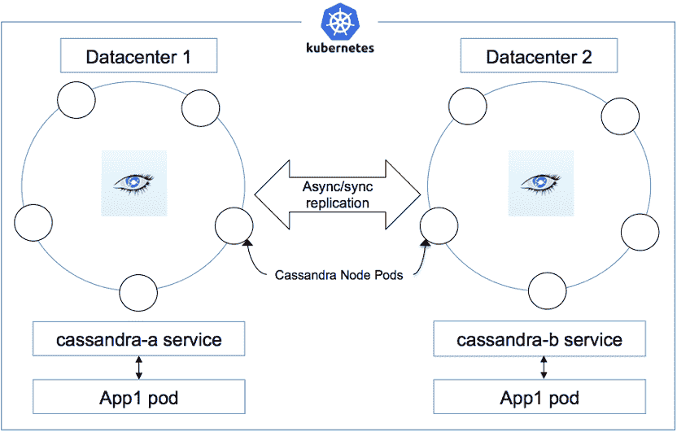

# 通过 10 个步骤在 Kubernetes 平台上设置一个多数据中心 Cassandra 集群

> 原文：[`developer.ibm.com/zh/tutorials/ba-multi-data-center-cassandra-cluster-kubernetes-platform/`](https://developer.ibm.com/zh/tutorials/ba-multi-data-center-cassandra-cluster-kubernetes-platform/)

Apache Cassandra 是一个已证实能够容错的、可扩展的和去中心化的 NoSQL 数据库，适用于如今的应用程序。您可以通过 Kubernetes 将 Cassandra 部署在 Docker 容器上或管理 Cassandra。

在本教程中，您将学习如何通过 Kubernetes 设置一个涵盖多个数据中心（彼此在地理位置上远隔千里）的 Cassandra 集群。这些数据中心可能位于不同国家或地区。使用此设置的一些理由包括：

*   执行实时备份，写入一个数据中心的数据会异步复制到其他数据中心。
*   不同位置（例如美国和印度）的用户连接各自位置或附近的数据中心，以确保获得更高的性能。
*   如果某个数据中心宕机，可以从其他数据中心提供 Cassandra 数据。
*   如果某个数据中心内的一些节点宕机，仍可以无中断地提供 Cassandra 数据。

可以通过开源 Kubernetes 平台所管理的 Docker 容器来实现此目标。

## 设置

为了完成本教程中的步骤，您将会使用 Kubernetes 概念 [pod](https://kubernetes.io/docs/concepts/workloads/pods/pod-overview/) 、 [StatefulSet](https://kubernetes.io/docs/concepts/workloads/controllers/statefulset/) 、 [无头服务](https://kubernetes.io/docs/concepts/services-networking/service/#headless-services) 和 [PersistentVolume](https://kubernetes.io/docs/concepts/storage/persistent-volumes/) 。以下是需要做的准备工作：

*   一个 Kubernetes 集群，其节点分布在至少两个不同的数据中心。确保 Kubernetes 为 V1.8.x 或更高版本
*   Kubernetes 可以将 pod 部署到每个数据中心的至少 3 个节点上

图 1 展示了在每个数据中心内包含 5 个节点的设置。每个 Kubernetes 节点都部署一个 Cassandra pod 来表示一个 Cassandra 节点。应用程序 pod 被部署在每个数据中心内，而且它们使用无头服务来访问数据中心本地的 Cassandra 节点。写入一个数据中心内任何节点的数据都会异步复制到其他数据中心内的节点。

##### 一个 Cassandra 集群涵盖两个数据中心，每个数据中心内有 5 个节点。



## 思路

创建两个 `StatefulSet` ，每个站点一个。 `StatefulSet` 管理一组 pod 的部署和扩展，并确保这些 pod 的顺序和唯一性。 `StatefulSet` 定义了节点关联性，以便将来自一个 `StatefulSet` 的 pod 仅部署在一个数据中心内的节点上。这是通过在每个节点上设置标签来实现的。为数据中心 1 中的所有节点添加标签 `dc=DC1` ，为数据中心 2 中的所有节点添加标签 `dc=DC2` 。每个数据中心都将有一个 Cassandra 种子节点，但是，如果您有 5 个节点，推荐使用两个种子节点。向 Kubernetes 节点添加合适的标签。

### 按数据中心对节点添加标签

```
kubectl label nodes nodea1 dc=DC1
kubectl label nodes nodea2 dc=DC1
kubectl label nodes nodea3 dc=DC1
kubectl label nodes nodeb1 dc=DC2
kubectl label nodes nodeb2 dc=DC2
kubectl label nodes nodeb3 dc=DC2 
```

## 操作

本教程中使用的所有代码均可在 [GitHub](https://github.com/ideagw/multi-dc-c7a-k8s) 上获得。从这里克隆存储库或复制 YAML 文件。

### 1.创建名称空间

首先，创建一个新名称空间，您将在其中执行所有工作。

```
kubectl create namespace c7a 
```

### 2\. 创建无头服务

```
kubectl -n c7a create -f service.yaml 
```

无头服务允许应用程序 pod 通过服务名称来连接 Cassandra pod。创建两个无头服务，分别用于来自不同数据中心的 Cassandra pod。部署在每个数据中心内的应用程序 pod 可使用环境变量来选择其数据中心本地的要连接的 Cassandra 服务。

### 3\. 创建持久卷

Cassandra 节点将数据存储在持久卷中。因为 Cassandra 更喜欢对其每个节点都使用本地存储，所以可以提前配备存储器。总共有 6 个节点。首先，在每个节点上都创建一个目录来存储 Cassandra 数据。例如 `/data/cass/` 。确保每个节点的这个目录中都有 10 GB 存储空间。在每个站点的 3 个节点中分别创建此目录。

然后使用 GitHub 中提供的 YAML 文件创建所有 6 个持久卷。您可以根据需要在此文件中修改该目录的容量和位置。

```
kubectl -n c7a create -f local_pvs.yaml 
```

### 4\. 创建 `StatefulSet`

`StatefulSet` 中定义的持久卷申请会使用这些持久卷。创建两个 `StatefulSet` （每个站点一个）。请记住，第一个数据中心上的每个节点都贴有 `dc=DC1` 标签，第二个数据中心上的每个节点都贴有 `dc=DC2` 标签。名为 cassandra-a 的 `StatefulSet` 中的节点关联规范可确保 pod 仅配备给 DC1 数据中心节点。类似地，cassandra-b `StatefulSet` 与 DC2 数据中心有关联性，所以所有使用该 `StatefulSet` 的 pod 都被部署到 DC2 数据中心。

```
spec:
  affinity:
    nodeAffinity:
      requiredDuringSchedulingIgnoredDuringExecution:
        nodeSelectorTerms:
        - matchExpressions:
          - key: dc
            operator: In
            values:
            - DC1 
```

`StatefulSet` 是 Kubernetes 中的一种强大结构。要了解 pod 部署和网络的工作原理，需要了解它的一些基本约定。

**Pod 名称**

`StatefulSet` 中的 pod 是按顺序创建的，从第一个开始以 StatefulSet 名命名并以 0 结尾。pod 名称遵循以下语法： `<statefulset name>-<ordinal index>` 。在本教程中，DC1 中的 pod 名为 cassandra-a-0、cassandra-a-1 和 cassandra-a-2；DC2 中的 pod 名为 cassandra-b-0，依此类推。

**网络地址**

`StatefulSet` 可以使用一个无头服务来控制其 pod 的域。这个服务所管理的域采用 `$(service name).$(namespace).svc.cluster.local` 格式，其中 `cluster.local` 是集群域。创建每个 pod 后，可获得一个匹配的 DNS 子域，这个子域采用 `$(podname).$(service name).$(namespace).svc.cluster.local` 格式。在本教程中，DC1 中的第一个 pod 名为 `cassandra-a-0.cassandra-a.c7a.svc.cluster.local` ，其他 pod 遵循相同的约定。

**卷申请（Volume claims）**

卷申请模板是在 `StatefulSet` 中通过名称 `cassandra-data` 指定的。这个 `StatefulSet` 生成的最终的持久卷申请将采用 `$(volumeClaimTemplate name)-$(pod name)` 格式来命名。对于这些持久卷，部署 `StatefulSet` 将会创建卷申请，比如 `cassandra-data-cassandra-a-0` 和 `cassandra-data-cassandra-b-0` 。卷申请与相应的 pod 匹配。因为采用了静态卷配备，所以声明会挑选它们想要的卷。

**Cassandra 配置**

在与通过特定 Cassandra Docker 映像公开的环境变量完成的 Cassandra 配置相关的 `StatefulSet` 中，有更多的细节。一个重要方面是 Cassandra 种子的规范。推荐至少在每个数据中心内指定一个种子节点。所以每个数据中心内的第一个 pod 都被指定为种子节点。请注意种子节点的完全限定节点名称。另一个明显的区别是数据中心规范； `StatefulSet` cassandra-a 位于 DC1 中， `StatefulSet` cassandra-b 位于 DC2 数据中心内。

现在是时候创建两个 `StatefulSet` 并确保它们成功创建了：

```
kubectl -n c7a create -f statefulset-a.yaml
kubectl -n c7a create -f statefulset-b.yaml
kubectl -n c7a get statefulsets 
```

### 5\. 验证 Cassandra 种子节点

在本教程中，在每个 `StatefulSet` 定义中都指定了一个副本，所以对于每个 `StatefulSet` ，都会仅在每个数据中心内创建一个 pod。这些 pod 将命名为 `cassandra-a-0` 和 `cassandra-b-0` 。为了确认这些操作，下面列出这些 pod：

```
kubectl -n c7a get pods -o wide

NAME           READY     STATUS    RESTARTS   AGE       IP           NODE
cassandra-a-0   1/1       Running   0          4m        10.244.0.6   iops15
cassandra-b-0   1/1       Running   2          3m        10.244.1.2   kube-vm1 
```

如果这些 pod 已成功创建并处于运行状态，可以检查 Cassandra 的 `nodetool` 状态。您会看到每个数据中心内的一个节点：

```
kubectl -n c7a exec -ti cassandra-a-0 -- nodetool status
Data center: DC1
===============
Status=Up/Down
|/ State=Normal/Leaving/Joining/Moving
--  Address      Load       Tokens       Owns (effective)  Host ID                               Rack
UN  10.244.2.22  127.33 KiB  256          100%             59b4e526-3a3c-4252-84b7-2c6c5de05e13  Rack1
Data center: DC2
===============
Status=Up/Down
|/ State=Normal/Leaving/Joining/Moving
--  Address      Load       Tokens       Owns (effective)  Host ID                               Rack
UN  10.244.5.6   108.63 KiB  256          100%             cb86a5e6-2666-445e-ba96-88640b0e7848  Rack1 
```

如果两个种子节点容器中的一个出错，可以检查日志来查找出错的地方。可以通过 `kubectl -n c7a logs cassandra-a-0` 获取 cassandra-a-0 日志。

### 6.使用 `StatefulSet` 进行扩展

目前为止，仅在每个数据中心内创建了一个 Cassandra 节点。现在是时候使用 `StatefulSet` 来扩展这些 pod 了。将每个 `StatefulSet` 的副本数量设置为 3：

```
kubectl -n c7a scale --replicas=3 statefulset/cassandra-a
kubectl -n c7a scale --replicas=3 statefulset/cassandra-b 
```

每个 `StatefulSet` 现在都被扩展为拥有 3 个副本。您可以拥有更多副本，但需要确保提前相应配置了持久卷。

### 7.验证其他 Cassandra 节点

在几分钟内，剩余的 pod 就会启动并运行，并加入 Cassandra 集群中。使用这个 `nodetool` 实用工具验证所有 Cassandra 节点的状态：

```
kubectl -n c7a exec -ti cassandra-a-0 -- nodetool status
Data center: DC1
===============
Status=Up/Down
|/ State=Normal/Leaving/Joining/Moving
--  Address      Load       Tokens       Owns (effective)  Host ID                               Rack
UN  10.244.2.22  127.33 KiB  256          29.7%             59b4e526-3a3c-4252-84b7-2c6c5de05e13  Rack1
UN  10.244.1.24  108.62 KiB  256          32.9%             7749be9d-4b66-4c9f-8afc-55d484d7404f  Rack1
UN  10.244.1.25  218.27 KiB  256          32.6%             bfd26111-21e3-42a9-bdf6-b2068c1bd1c5  Rack1
Data center: DC2
===============
Status=Up/Down
|/ State=Normal/Leaving/Joining/Moving
--  Address      Load       Tokens       Owns (effective)  Host ID                               Rack
UN  10.244.5.6   108.63 KiB  256          35.7%             cb86a5e6-2666-445e-ba96-88640b0e7848  Rack1
UN  10.244.5.7   196.67 KiB  256          33.8%             1a0b6ba5-a9fd-4d67-bb5f-9cdc97b5433e  Rack1
UN  10.244.5.8   127.42 KiB  256          35.4%             09fa301d-d057-4b2d-a44f-7ab57d7e5197  Rack1 
```

上述输出表明 6 个节点（每个数据中心内 3 个）都启动并运行。

### 8.使用复制配置创建一个 Cassandra 密钥空间

现在创建一个 `keyspace` 并指定每个数据中心需要多少个副本。每个数据中心内有多个副本可以帮助解决本地节点故障，因为如果一个节点发生了故障，仍可以从一个副本提供数据。

```
kubectl -n c7a exec -ti cassandra-a-0 -- cqlsh
    Connected to Cassandra at 127.0.0.1:9042.
[cqlsh 5.0.1 | Cassandra 3.11.1 | CQL spec 3.4.4 | Native protocol v4]
Use HELP for help.
cqlsh> create keyspace hr_keyspace with replication ={'class' : 'NetworkTopologyStrategy', 'DC1':2, 'DC2':2}; 
```

上述代码表明在 cassandra-a-0 节点上启动了一个 Cassandra shell 会话 (`cqlsh`)。然后创建了一个名为 `hr_keyspace` 的 `keyspace` 。创建 `keyspace` 时，需要指定复制策略。当涉及到多个数据中心时，通常会使用复制策略 `NetworkTopologyStrategy` 。有一个指定每个数据中心内需要多少副本的选项。在上面的示例中，为数据中心 DC1 指定了两个副本，为数据中心 DC2 也指定了两个副本。

接下来，创建一个表并添加一些数据：

```
cqlsh> use hr_keyspace;
cqlsh> CREATE TABLE employee( emp_id int PRIMARY KEY, emp_name text, emp_city text, emp_sal varint, emp_phone varint);
#For asynchronous writes to other data center, set the #consistency level to LOCAL_QUORUM
cqlsh:hr_keyspace> consistency LOCAL_QUORUM
Consistency level set to LOCAL_QUORUM.
cqlsh:hr_keyspace> INSERT INTO employee (emp_id, emp_name, emp_city,emp_sal,emp_phone) VALUES(1,'David', 'San Francisco', 50000, 983210987);
cqlsh:hr_keyspace> INSERT INTO employee (emp_id, emp_name, emp_city,emp_sal,emp_phone) VALUES(2,'Robin', 'San Jose', 55000, 9848022339);
cqlsh:hr_keyspace> INSERT INTO employee (emp_id, emp_name, emp_city,emp_sal,emp_phone) VALUES(3,'Bob', 'Austin', 45000, 9848022330);
cqlsh:hr_keyspace> INSERT INTO employee (emp_id, emp_name, emp_city,emp_sal,emp_phone) VALUES(4, 'Monica','San Jose', 55000, 9458022330); 
```

注意 `LOCAL_QUORUM` 的一致性级别。它可以确保首先将数据写入本地节点，并异步复制到远程数据中心节点。这很重要，因为这会告诉 Cassandra 将数据异步复制到一个远程数据中心。

现在尝试从任何节点检索该数据。

```
cqlsh:hr_keyspace> select * from employee;

 emp_id | emp_city      | emp_name | emp_phone  | emp_sal
--------+---------------+----------+------------+---------
      1 | San Francisco |    David |  983210987 |   50000
      2 |      San Jose |    Robin | 9848022339 |   55000
      4 |      San Jose |   Monica | 9458022330 |   55000
      3 |        Austin |      Bob | 9848022330 |   45000

cqlsh:hr_keyspace> quit; 
```

### 9\. 模拟一次站点故障

如果来自某个数据中心的所有 Cassandra pod 均不可用，您可以模拟一次站点故障。为此，删除一个 `StatefulSet` 。 如果删除一个 `StatefulSet` ，来自该数据中心的 3 个 pod 将消失，这样就可以模拟一次站点故障。如果出现这种情况，仍可以从其他站点检索数据。

```
kubectl -n c7a delete statefulset cassandra-a
statefulset "cassandra-a" deleted

kubectl -n c7a get pods -o wide 
```

这会删除 `StatefulSet cassandra-a` 及其所有 pod。现在，仅剩余 3 个 Cassandra pod，它们都来自数据中心 DC2。 连接到这些 pod 中的任一个并尝试检索数据：

```
kubectl -n c7a exec -ti cassandra-b-1 – cqlsh
    Connected to Cassandra at 127.0.0.1:9042.
[cqlsh 5.0.1 | Cassandra 3.11.1 | CQL spec 3.4.4 | Native protocol v4]
Use HELP for help.
cqlsh> use hr_keyspace;
cqlsh:hr_keyspace> select * from employee;

 emp_id | emp_city      | emp_name  | emp_phone   | emp_sal
--------+---------------+-----------+-------------+---------
      1 | San Francisco |    David  |  983210987  |   50000
      2 |      San Jose |    Robin  | 9848022339  |   55000
      4 |      San Jose |   Monica  | 9458022330  |   55000
      3 |        Austin |      Bob  | 9848022330  |   45000

(4 rows)
cqlsh:hr_keyspace> quit; 
```

这表明仍可从其他数据中心节点获取数据。 请注意，上面的示例显示了一个与 Cassandra 节点的直接连接。但事实上，使用 Cassandra 的应用程序将通过为它创建的无头服务来连接该节点，如图 1 所示。

### 10\. 清理

要删除 c7a 名称空间中的 Kubernetes 集群中的所有内容，可以使用此命令：

```
kubectl –n c7a delete statefulset,pvc,pv,svc -l app=cassandra 
```

## 结束语

在本教程中，您了解了如何在 Kubernetes 平台上设置一个多数据中心 Cassandra 集群。此设置对执行实时备份和预防站点或数据中心故障很有用。对 Cassandra 集群的站点位置感知访问也可减少读写延迟。

本文翻译自：[10 steps to set up a multi-data center Cassandra cluster on a Kubernetes platform](https://www.ibm.com/developerworks/library/ba-multi-data-center-cassandra-cluster-kubernetes-platform/) （2018-03-21）