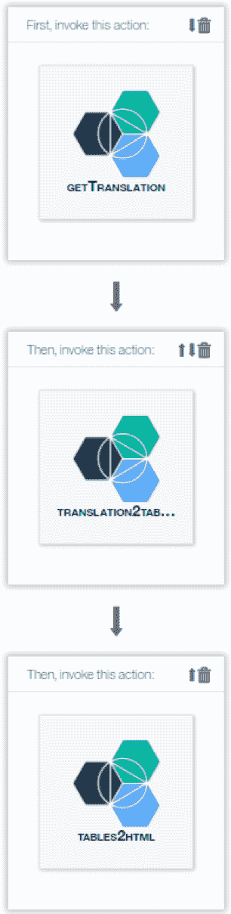
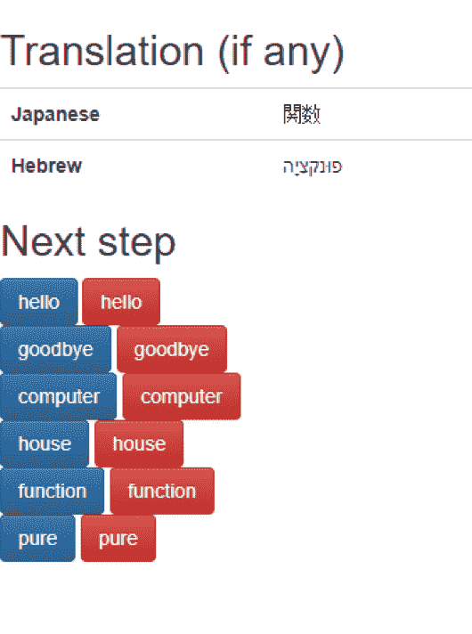
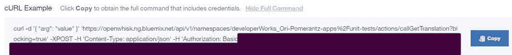
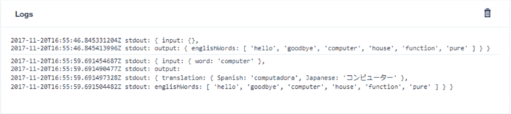
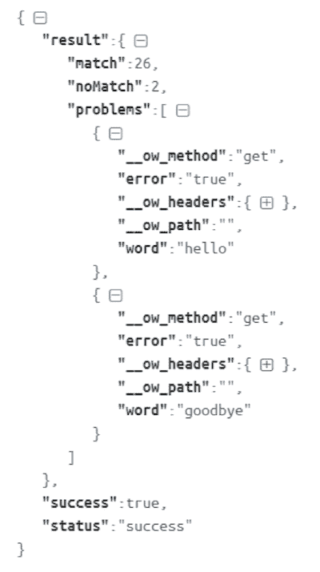

# 为纯 OpenWhisk 操作创建单元测试

> 原文：[`developer.ibm.com/zh/tutorials/cl-unit-tests-pure-openwhisk-actions/`](https://developer.ibm.com/zh/tutorials/cl-unit-tests-pure-openwhisk-actions/)

OpenWhisk 应用程序的模块化性质，使得为纯函数式 — 这意味着没有任何副作用，也不依赖于外部状态的操作创建单元测试变得很容易。在本教程中，将学习如何半自动地创建单元测试，以及如何运行这些测试来验证代码更改没有造成任何破坏。

纯函数是满足以下两个条件的函数：

1.  函数的结果仅依赖于输入参数。任何时候使用相同的输入参数调用该函数，都会产生相同的结果。
2.  该函数没有任何副作用；获得返回值是运行该函数的唯一效果。

使用诸如 OpenWhisk 之类的函数即服务 (FaaS) 框架时，对于任何作为纯函数的操作，都可以使用您在本文中学到的方法来应用自动 QA。

**免费试用 IBM Cloud**

利用 [IBM Cloud Lite](https://cloud.ibm.com/registration?cm_sp=ibmdev-_-developer-tutorials-_-cloudreg) 快速轻松地构建您的下一个应用程序。您的免费帐户从不过期，而且您会获得 256 MB 的 Cloud Foundry 运行时内存和包含 Kubernetes 集群的 2 GB 存储空间。

## 构建您的应用程序需要做的准备工作

*   OpenWhisk 和 JavaScript 的基本知识
*   一个免费 IBM Cloud 帐户

[运行应用程序](https://service.us.apiconnect.ibmcloud.com/gws/apigateway/api/ec74d9ee76d47d2a5f9c4dbae2510b0b8ae5912b542df3e2d6c8308843e70d59/UnitTestsApp/translate)

[获得代码](https://github.com/qbzzt/bluemix/tree/master/openwhisk/201711/unit_tests)

## 单元测试

一个实用的应用程序可能由多个模块组成，每个模块都执行一个特定操作。除了对应用程序进行整体测试之外，单独测试每个模块也很有用。这种测试类型称为单元测试，该测试使您能够识别 bug 的位置，并相对容易地修复它们。

单元测试的一个挑战是，您需要识别每个模块的可能输入和与其匹配的输出。如果模块很简单，此过程可能很容易 — 但是模块越复杂，此过程可能越困难。对于深度嵌入在应用程序中且人类不可读的输入或输出的模块，尤其如此。

对于充当纯函数的操作，可以在使用应用程序时通过查看如何调用输入和输出，来自动识别这些输入和输出。然后，当程序员更改模块时，您可以使用相同的输入重新运行它，以查看更改是否造成了任何破坏。

## 样本应用程序

本教程的目的是展示 QA 技术，所以样本应用程序非常简单：一个词典应用程序，允许用户选择一个英文单词，然后提供其他语言的等效词汇。

### 创建应用程序序列

要了解如何在 OpenWhisk 中编写一个面向用户的应用程序，请阅读我的教程“[为一个联网环境构建一个智能锁](https://www.ibm.com/developerworks/cn/iot/library/iot-security-smartlock-connected/index.html)”（第 1、2 和 5 小节）。与该应用程序对应，本教程中的应用程序由 3 个操作组成：

1.  [`getTranslation`](https://github.com/qbzzt/bluemix/blob/master/openwhisk/201711/unit_tests/appTested/getTranslation.js)
2.  [`translation2tables`](https://github.com/qbzzt/bluemix/blob/master/openwhisk/201711/unit_tests/appTested/translation2tables.js)
3.  [`tables2html`](https://github.com/qbzzt/bluemix/blob/master/openwhisk/201711/unit_tests/appTested/tables2html.js)

您将在 OpenWhisk 中创建所有这 3 个操作，它们通常是纯操作，但是当 `getTranslation` 在 `error` 参数中获得了一个值时，它可能变得不纯。

创建这些操作后，按以下方式将它们组合到一个序列中，并让该序列可从浏览器访问：

1.  单击左侧边栏中的 **Develop**。
2.  在 MY ACTIONS 下，选择序列中的第一个操作 **getTranslation**。
3.  单击 **Link into a Sequence**。
4.  单击 **MY ACTIONS** 磁贴，选择第二个操作 **translation2tables**，然后单击 **Add to Sequence**。
5.  单击 **Extend**，并重复上一步来添加第三个操作（也是最后一个操作）**tables2html**。
6.  单击 **This Looks Good**。
7.  将新序列命名为 `UnitTestsApp`。单击 **Save Action Sequence**，然后单击 **Done**。

该序列应该类似于下图：

##### 应用程序序列



### 让该序列可从互联网访问

执行以下步骤让该序列可从互联网访问：

1.  单击左侧边栏中的 **APIs**。
2.  单击 **Create Managed API**。
3.  将该 API 命名为 `UnitTestsApp`。输入基本路径 `/UnitTestsApp`。
4.  单击 **Create Operation**，并使用以下参数创建一个操作：

| 参数 | 值 |
| --- | --- |
| Path | `/translate` |
| Verb | `GET` |
| Package containing action | `Default` |
| Action | `UnitTestsApp` |
| Response content type | `text/html` |

1.  向下滚动，确保选择了 **Enable CORS**，并单击 **Save & expose**。
2.  复制该路径，将它粘贴到浏览器窗口中，在末尾处输入 `/translate`，并浏览到该 URL（我的 URL 为 `https://service.us.apiconnect.ibmcloud.com/gws/apigateway/api/ec74d9ee76d47d2a5f9c4dbae2510b0b8ae5912b542df3e2d6c8308843e70d59/UnitTestsApp/translate`）。
3.  确保在单击应用程序中的蓝色按钮时，您会获得译文。单击应用程序中的红色按钮时，您可能获得译文或错误消息。

##### 样本译文



## 捕获（输入、输出）对

要创建单元测试，需要获取输入和与其匹配的输出。为此，最简单的方法是编辑该序列，将现有操作替换为一个包装器，该包装器会调用原始操作并存储其输入和输出。

### 将操作替换为包装器

要将操作替换为包装器，首先需要能够远程调用该操作。可以将它添加到 API 或使其成为一个 Web 操作，但使用下面的方法更容易更安全：

1.  单击左侧边栏上的 **Develop** 并打开操作 **(getTranslation)**。
2.  单击 **View REST Endpoint**。
3.  向下滚动到 cUrl 命令并单击 **Show Full Command**。将该命令复制到文本文件中。
4.  使用 base64 解码器（[比如这个解码器](https://www.base64decode.org/)）解码验证信息（Basic 后面的部分），如下面的插图所示（该值已编校）。这个值是您的 API 密钥。

##### 验证信息



1.  使用[此文件](https://github.com/qbzzt/bluemix/blob/master/openwhisk/201711/unit_tests/proxy/callGetTranslationV1.js)的内容创建一个名为 `callGetTranslation` 的新操作（确保在第 4 行上的 `api_key` 和第 11 行上的 `name` 中放入了您自己的值）。
2.  运行该操作，可以观察到，它在功能上等效于 `getTranslation`。

那么它的工作原理是什么？

这些代码行使用 [OpenWhisk NPM 库](https://www.npmjs.com/package/openwhisk)来构造一个与服务器的连接。该连接需要主机名和 API 密钥（您需要提供这些信息 — 我没有告诉您我的信息，否则您无需我的允许就能执行我的所有 OpenWhisk 操作）。

从计算机角度讲，调用另一个 OpenWhisk 操作可能要花很长时间，所需时间甚至可能长达一秒。为了避免为整个过程付费，您需要创建并返回[一个 `Promise` 对象](https://developers.google.com/web/fundamentals/primers/promises)。对象构造函数有一个参数，那就是您为了获得结果而运行的函数。此函数接收两个参数 — 一个是在成功时调用的函数，另一个是在失败时调用的函数。

```
return new Promise((success, failure) => { 
```

在调用 `Promise` 函数时，它调用 `ow.actions.invoke` 来运行原始 OpenWhisk 操作。`name` 参数是原始操作的路径（您需要将它替换为自己的值）。如果调用 invocation 时没有 `阻塞`，将会立即返回一个 ID，您稍后可以使用该 ID 来查询结果 — 但对于本用例，最好在您获得答案之前阻塞。

```
var invocation = ow.actions.invoke({
     name: '/developerWorks_Ori-Pomerantz-apps/unit-tests/getTranslation',
     blocking: true,
     params: params
 }); 
```

`invocation` 变量包含一个 `Promise` 对象。`then` 方法将会获取 `Promise` 内调用的函数，然后使用结果来调用参数函数。

```
invocation.then((resVal) => { 
```

创建并记录（为了显示值）一个包含输入和输出的变量：

```
var logMe = {
    input: params,
    output: resVal.response.result
};
console.log(logMe); 
```

将结果返回给调用原始 `Promise` 对象的 OpenWhisk 基础架构。

```
 success(resVal.response.result);
        });
  });
} 
```

在图 4 中，可以看到来自两个不同调用的日志，一个调用的输入是空的，另一个调用的输入中包含一个单词。

##### 两个调用日志



### 将（输入、输出）对写入 Cloudant

单元测试数据要变得有用，需要保留在一个 Cloudant 数据库中。首先，按照[这篇文章第 4a 小节](https://www.ibm.com/developerworks/cn/iot/library/iot-security-smartlock-connected/index.html)中的介绍，创建这样一个数据库（命名为 `expected`）（服务的名称无关紧要）。然后将 `callGetTranslation` 的代码替换为[这个文件的内容](https://github.com/qbzzt/bluemix/blob/master/openwhisk/201711/unit_tests/proxy/callGetTranslation.js)。请记得更改第 4 行（OpenWhisk API 密钥）、9-13 行（Cloudant 凭证）和 26 行（操作的路径）中的相关参数。

我仅在这里解释一下与数据库相关的新的部分。

Cloudant 数据库条目（称为文档）可使用字符串进行访问。您将使用的索引是输入参数。

```
var dbKey = JSON.stringify(params); 
```

在将一个条目写入数据库之前，应该检查一下之前是否看到过这个输入。

```
// Did we already see this input?
mydb.get(dbKey, (err, body) => { 
```

如果尝试获得一个文档并失败，您会获得一个包含状态代码 404 的错误。在这种情况下，可以将输入值写入该数据库，然后调用回调函数。

```
// No, write it.
 if (err != null && err.statusCode == 404)     {
     mydb.insert(
         {"_id": JSON.stringify(params), data: logMe},
         () => {
             success(resVal.response.result);
         });   // end of mydb.insert call
 }  // End of "this value has not been found"
 else {  // Assume value has been found, for the sake of simplicity 
```

如果此输入值已在数据库中，可以将当前输出与数据库中的输出进行比较。如果它们是相同的，则没有问题。如果它们是不同的，则存在一个问题。该操作没有作为一个纯函数运行，可能是因为存在一个 bug，也可能是因为它一开始就不是纯函数。

此样本代码仅将问题报告给控制台。在更真实的实现中，代码会将问题记录到[问题跟踪系统](https://www.ibm.com/blogs/bluemix/2017/05/introducing-git-repos-issue-tracking/)，用于开发和 QA。

```
// We found this before, but the output was different then
if (JSON.stringify(body.data) !== JSON.stringify(logMe)) {
    console.log("This action isn't a pure function.");
    console.log("For input:"+ JSON.stringify(params));
    console.log("Old output:"+ JSON.stringify(body.data.output));
    console.log("New output:"+ JSON.stringify(logMe.output));
} 
```

无论产生其他任何结果，都需要返回输出值。

```
 // Regardless, return the value.
        success(resVal.response.result);
    }  // End of "this value has been found, not new"
}); // end of mydb.get call 
```

### 与应用程序集成

最后，编辑应用程序的序列，以便将旧操作 `getTranslation` 替换为新操作 `callGetTranslation`。然后运行该应用程序，选择不同的选项来获得足够的输入和对应的输出。

请注意，如果查看该数据库，可能看到大量未曾料到的输入参数。这是因为序列中的第一个操作获取了关于 HTTP 请求的信息，这是我们在本示例中跟踪的操作。这些额外的参数不会导致任何问题。

## 使用单元测试

在数据库中拥有信息后，就可以使用它来运行单元测试了。使用[此内容](https://github.com/qbzzt/bluemix/blob/master/openwhisk/201711/unit_tests/runTests.js)创建一个新操作。在第 4、13 和 38 行放入正确的标识符。运行此操作时，会返回以下字段：

*   **match** — 操作返回了预期输出的测试案例的数量
*   **noMatch** — 操作返回了不同值的测试案例的数量
*   **problems** — 检测出问题的输入值列表

此操作的大部分内容都使用了本文中之前使用的组件。`async.map` 调用是一个例外。此函数接收 3 个参数：一个列表和两个函数。然后，它为列表中的每一项单独调用第一个函数 (iteratee)，就像函数式编程中的普通映射一样。不同之处在于调用的函数可以是异步的。它获取两个参数：来自列表的项和一个在该异步过程完成时调用的回调函数。这使您能将该映射用于异步函数 — 例如调用一个不同的 OpenWhisk 操作。第三个参数（可选参数，但这里已使用）是一个在映射完成后调用的函数。

```
 async.map(body.rows,
                (obj, callback) => {
   ...
                        callback();
                    });
                }, // end of the iteratable, which is called for every item
                (err, results) => {
    ,,,
                }  // end of the post map callback
            );  // end of async.map 
```

信息被收集到一些变量中，这些变量在对 iteratee 的不同调用之间被共享。在一些环境中，这要求您考虑线程安全性，但 Node.js 的单线程性质可以确保不会有两个线程同时尝试更改一个变量。

这是在 JSON 格式化器中显示的样本结果（以便最小化不相关的 HTTP 标头）：

##### 样本结果



## 结束语

在本教程中，您开发了一个原型来确定纯函数的操作（使用相同的输入始终生成相同的输出，而且没有副作用）是否实际上应该至少拥有一个纯属性。不幸的是，您不能检查诸如 OpenWhisk 操作之类的黑盒来了解副作用。我简化了这个原型，以便尽可能清楚地解释相关概念。如果您想实际使用它，则需要添加其他一些特性。

*   优雅地失败。目前为止，此代码假设没有出现错误。这有点过于乐观。
*   不要仅调用被测试的操作一次，而是应该多次调用它。 这样，才更有可能检测出问题。
*   将正被调用的操作的名称添加到数据库键中（它目前只是输入参数）。这样就可以对多个操作使用同一个数据库。

这 3 个特性相对容易实现，但仍需要将 OpenWhisk 操作作为黑盒对待。一个更具挑战的特性是为操作与其他系统（比如 Cloudant）之间的连接建立代理，来将不是纯函数的操作转换为纯函数；为此，您可以在前一次使用相同输入执行调用来提供状态后，从其他系统提供相同的状态信息，消除该操作尝试创建的任何副作用。

本文翻译自：[Create unit tests for pure OpenWhisk actions](https://developer.ibm.com/tutorials/cl-unit-tests-pure-openwhisk-actions/)（2018-01-03）