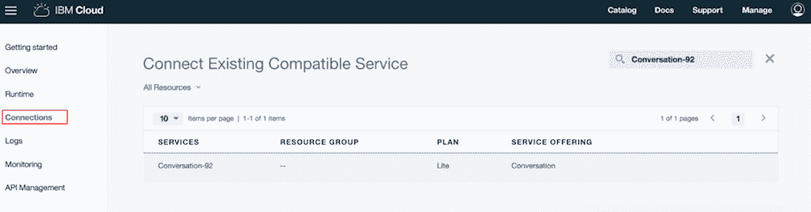
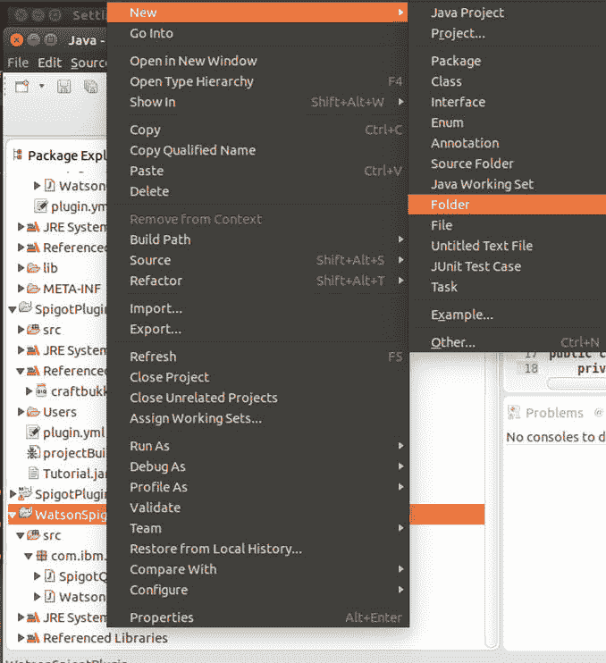

# Archived | 在 IBM Cloud 上将 Watson 集成到 Minecraft 中

> 原文：[`developer.ibm.com/zh/tutorials/minecraft-and-ibm-cloud-part-4/`](https://developer.ibm.com/zh/tutorials/minecraft-and-ibm-cloud-part-4/)

**本文已归档**

**归档日期：:** 2019-12-09

此内容不再被更新或维护。 内容是按“原样”提供。鉴于技术的快速发展，某些内容，步骤或插图可能已经改变。

*Watson Conversation 现在更名为 Watson Assistant。尽管本教程中的一些图示可能将该服务显示为 Watson Conversation，但步骤和流程仍将适用。*

##### 关于本 Minecraft 和 IBM Cloud 系列

**[第 1 部分](https://developer.ibm.com/zh/tutorials/minecraft-and-ibm-cloud-part-1/)**：设置本地 Minecraft 和 Docker 开发环境，然后在您自己的服务器上玩 Minecraft。

**[第 2 部分](https://developer.ibm.com/zh/tutorials/minecraft-and-ibm-cloud-part-2/)**：设置本地 Eclipse 开发环境，然后开发和构建您自己的服务器端 Minecraft 插件，并将其导出到本地 Docker 镜像。

**[第 3 部分](https://developer.ibm.com/zh/tutorials/minecraft-and-ibm-cloud-part-3/)**：将 Docker 镜像部署到 IBM Cloud，然后以可通过云访问的 Docker 容器形式运行这些镜像。

**第 4 部分**：利用在 IBM Cloud 上采用 Watson 认知服务的插件来扩展 Spigot 服务器，为游戏增添科学趣味。

在[第 1 部分](https://developer.ibm.com/zh/tutorials/minecraft-and-ibm-cloud-part-1/)、第 2 部分和[第 3 部分](https://developer.ibm.com/zh/tutorials/minecraft-and-ibm-cloud-part-3/)中，您了解了如何在 Docker 容器中启动自己的 Minecraft 服务器：先在本地启动，然后在 IBM Cloud 中的容器内启动。您还学习了如何为 Minecraft 构建服务器端插件，并将这些插件添加到 Docker 中运行的 Minecraft 服务器。

这些都是本教程的序曲，本系列的最后一部分则向您展示如何在插件开发中使用 IBM Cloud 环境的强大功能，同时也为您的 Minecraft 游戏增添科学趣味。在本教程中，您将学习如何通过使用 Watson 认知服务的插件来扩展 Spigot 服务器。

IBM 在 IBM Cloud 上提供了几个 Watson 服务，您可以使用这些服务构建认知解决方案。这些服务包括 Watson Assistant Service、Personality Insights、Natural Language Classifier、Visual Recognition 等等。浏览 [Watson 服务](https://www.ibm.com/watson/products-services/)的完整列表。

在本教程中，您将学习如何构建一个插件，该插件使用 Watson Assistant 服务回答有关疾病的问题，然后学习如何将该插件与另一个第三方 Minecraft 插件结合起来，后一个插件则可以将传染病添加到您的 Minecraft 村庄中。如果将这两个插件结合使用，玩家就有理由在游戏中了解某些疾病，以及如何诊断和治疗这些疾病。这种概念证明集成展示了如何将第三方插件与自己的插件结合起来，进而利用 Watson 和 IBM Cloud 的强大功能。

## 创建 IBM Cloud 应用并获取 Watson Assistant 服务凭证

让我们开始吧。首先，我们需要获得 Watson Assistant 服务的一个实例，并从该服务实例中获取一些凭证，以便在新插件中使用这些凭证。然后，我们将构建插件并将其安装到 Docker 中，再推送到 IBM 容器中。

为获得用于访问 IBM Cloud Watson Assistant 服务的相关凭证，我们必须遵循一个迂回过程。如果您使用某个 Cloud Foundry 运行时来编写应用程序，就可以创建一个服务，然后将该服务绑定到您的运行时，以便获取该服务的凭证，这些凭证通过一组环境变量自动流至运行时。但是，对于 Docker 容器，相同的绑定过程还不能无缝工作，因此我们必须引入一个“虚拟”应用程序，将该应用程序绑定到 Watson Assistant 服务，以便获得正确的凭证。为此，需遵循以下过程：

1.  使用您的 IBM ID 和密码[登录 IBM Cloud](https://cloud.ibm.com?cm_sp=ibmdev-_-developer-tutorials-_-cloudreg)。（如果您没有 IBM ID，可以在注册[免费 IBM Cloud 试用帐户](https://cloud.ibm.com?cm_sp=ibmdev-_-developer-tutorials-_-cloudreg)时获得一个。）
2.  创建 Watson Assistant 服务的实例：选择 **Catalog** 链接，导航到目录的 **Platform > Watson** 部分，然后从目录的这一部分选择 **Watson Assistant** 链接。
3.  在随后显示的 Watson Assistant 创建屏幕中保留默认值，然后单击 **Create** 按钮来创建 Watson Assistant 服务的实例。记下您刚刚创建的 Watson Assistant 服务的名称。在左下角，您可以单击 **View Docs** 链接，详细了解该服务和用于访问该服务的 REST API。
4.  创建一个新应用：选择 **Catalog** 链接，导航到目录的 **Cloud Foundry Apps** 部分，然后从目录的这一部分选择 **SDK for Node.js** 链接。在显示的 Create a Cloud Foundry App 表单中，指定一个唯一的应用名称（在示例中，我们使用 WatsonSpigotApp）。保留其他默认值，然后单击 **Create** 按钮。此操作将创建并启动 Node.js Cloud Foundry 应用的实例。通过单击为 Node.js 应用新创建的 SDK 左侧列中的 **Connections**，导航到 Connections 页面。
5.  通过单击 **Create Connection** 按钮将 Watson 服务添加到您刚刚创建的应用中，搜索您在上一步中创建的 Watson Assistant 服务的名称，然后单击 **Connect** 按钮。此操作将绑定 Watson Assistant 服务并重新载入应用。
6.  要检索新创建的 Watson Assistant 服务的凭证，请在右侧展开下拉菜单，然后单击 **View Credentials** 菜单项。这将打开一个对话框，其中显示端点 URL、用户名和密码。
7.  保存这些凭证（特别是 URL、用户名和密码），因为稍后您将需要它们来连接到该 Watson Assistant 服务。您的凭证将是唯一的，此样本只显示它们采用的表单：

    ```
     "url": "https://gateway.watsonplatform.net/conversation/api",
    "username": "some‑long‑hyphenated‑set‑of‑characters",
    "password": "AVeryL0ngSer1esOfCharact3rs" 
    ```

## 创建一个包含意图、实体和对话框的对话工作空间

在 Watson Assistant 服务中，工作空间是对话工件（即意图、实体和对话框）的命名容器，并具有与其关联的可选描述和语言。意图是指具有表示用户输入意图的同义词的单词和字符串，实体是指与意图相关的对象，对话框表示包含意图和实体的对话流。可以通过 JSON 导出工作空间以及将其导入 JSON，大小的上限为 10MB。可以通过 REST API 或 Watson Assistant Web 仪表板界面来创建和管理工作空间。在开发和维护对话服务时，也可以与互相配合的团队成员共享工作空间。

如前所述，意图用来捕获用户输入的目的或目标。在规划意图时，请考虑您可能希望向用户提供哪些功能。然后，尽可能多地捕获真实用户输入或问题以及表示相同输入的备选内容。将类似的问题分组以创建意图，然后可以提供这些问题作为意图的示例。意图始终以“#”字符作为前缀。可以将意图导出至外部逗号分隔值文件，也可以从该文件导入意图。一旦创建了意图，Watson Assistant 工作空间就会接受训练来处理这些事件。本教程附带的样本对话包含一个名为“#information-on-diseases”的单一意图，以及该意图的几个示例，如：

*   列出可用的疾病
*   什么是糖尿病？
*   您掌握了哪些疾病的信息？

请参阅 [Watson Assistant 服务在线文档](https://cloud.ibm.com/docs/services/conversation/intents.html#defining-intents)以详细了解意图。

实体是指与意图相关的术语或对象。对于样本意图“#information-on-diseases”，相关术语或对象可能是疾病类型、症状、治疗方法等等。实体的名称始终使用 @ 字符作为前缀。实体具有与它们相关联的值，而这些值则可以具有与它们相关联的同义词或模式。与意图一样，可以从外部逗号分隔值文件导入实体，也可以将其导出至该文件。本教程附带的样本对话包含一个名为“@disease”的单一意图和实体的几个值，如糖尿病、麻疹和流感，其中包含感冒、咳嗽和流感之类的示例。Watson Assistant 服务还提供了可以应用于任何对话的系统实体的列表，比如 @sys-date 和 @sys-time。参阅 [Watson Assistant 服务在线文档](https://cloud.ibm.com/docs/services/conversation/intents.html#defining-intents)以详细了解实体。

对话框表示对话流程，这些对话通过响应对意图和实体做出回应。它表示为一组根据流程连接的对话框节点。每个节点至少包含一个条件和一个响应。条件表示满足特定标准的输入，例如，提供响应的对话框节点的匹配意图或实体。响应可以是问题的答案，也可以是要执行的操作，具体取决于目的。当意图或实体中提供的信息不足以响应用户的请求时，可以将对话框构造为请求附加信息。可以捕获对话的上下文并存储在上下文变量中。在对话框中，将从上到下对节点求值。对话框节点可以包含子节点。如果已经触发了包含子节点的某个节点，那么将根据其子节点来评估对话，遍历对话树的深度，并评估路径上的每个节点。当遇到无法识别或不支持的意图或实体时，也可以使用默认处理。可以通过 Watson Assistant Web 用户界面控制台或使用 REST API 来创建和管理对话框。请参阅 [Watson Assistant 服务在线文档](https://cloud.ibm.com/docs/services/conversation/dialog-build.html#dialog-build)以详细了解如何创建对话框。

在本教程中，在 GitHub 上提供了一个 Watson Assistant 工作空间样本，其中包含一个带有意图和实体的对话框。通过执行 curl 命令来调用 Watson Assistant REST API，提供工作空间 JSON 作为输入（本教程后面会详细介绍），将会创建一个带有对话框的工作空间，如下图所示。可以根据需要修改这个对话框，也可以创建一个新的对话框。您可以检查 Watson 工作空间 JSON（即 WatsonConversationTest.json），也可以在工作空间中浏览，并在创建对话后从 Watson Assistant Web 仪表板修改该对话。在扩展对话样本或创建新样本时，您将需要添加更多的意图。须注意，可以使用 Watson Assistant Web 控制台或通过 Watson Assistant REST API 来创建和管理工作空间以及意图、实体和对话框。要详细了解 Watson Assistant 服务、意图、实体、对话框和对话，请参阅 IBM Cloud 中提供的 [Watson Assistant 文档](https://cloud.ibm.com/docs/services/conversation/getting-started.html#gettingstarted)。


在本教程中，将通过 `curl` 命令使用[创建工作空间](https://www.ibm.com/watson/developercloud/conversation/api/v1/?curl#create_workspace) API 来创建带有意图、实体和对话框的 Watson Assistant 工作空间。API 的输入是一个名为 WatsonConversationTest.json 的 JSON 文件，该文件已经创建并且位于 spigot-plugin-watson/input/ 目录中。

将目录切换到 minecraft-project：

```
 cd ~/minecraft project 
```

输入 `curl` 命令，如下所示。如果要从网页复制该命令，确保双引号格式正确：

```
 curl ‑X POST ‑u "bxxxx69b‑6xx1‑45xx‑axx9‑03xxxxxxx925":"35533rrNN" ‑H "Content‑Type: application/json" ‑d@./spigot‑plugin‑watson/input/WatsonConversation.json https://gateway.watsonplatform.net/conversation/api/v1/workspaces?version=2017‑05‑26 
```

您应该会看到以下结果：

```
 {"name":"WatsonMinecraftSpigotConversation","created":"2018‑01‑01T01:54:14.997Z","updated":"2018‑01‑01T01:54:14.997Z","language":"en","metadata":{"api_version":{"major_version":"v1","minor_version":"2017‑05‑26"}},"description":"","workspace_id":"c704xxx‑32e5‑42fc‑a89e‑d907xxxx667","learning_opt_out":false} 
```

记下已创建的 `workspace_id`。通过单击 Watson Assistant 服务链接，您可以导航到 Watson Assistant 服务 Web 控制台，该链接位于您在上一部分的第 4 步中创建的 WatsonSpigotApp 的 Connections 选项卡中。成功启动并登录到 Watson Assistant 服务实例后，您将注意到刚刚使用 `curl` 命令创建的新对话工作空间。您可以浏览该工作空间，查看创建的意图、实体和对话框，并对该工作空间进行修改，以便在需要的情况下使用其他意图和实体创建更完整的对话。


## 构建 Spigot 插件以使用 Watson Assistant 服务

既然您已有了正确的凭证，我们现在就可以构建 Spigot 插件了。

**注意**：本教程系列中引用的所有代码都可以在 GitHub 中获得，位于您在[第 1 部分](http://www.ibm.com/developerworks/cn/cloud/library/cl-bluemix-minecraft-docker-trs-1)中克隆的同一个项目下面。如果您还没有这样做（假设您直接跳到本教程），那么从 GitHub 克隆以下项目：

```
 git clone  https://github.com/kgb1001001/minecraft‑project.git 
```

minecraft-project/spigot-plugin-watson/ 目录包含样本源代码、库和相关工件，用于创建本教程其余部分中引用的 Eclipse 项目。

在您的 Ubuntu 或其他环境中（您已在第 1、2 和 3 部分中使用）：

1.  将以下 jar 文件下载到 $HOME/reflibs 目录。在后续步骤中，您将需要这些文件：
    *   [`mvnrepository.com/artifact/commons-codec/commons-codec/1.10`](https://mvnrepository.com/artifact/commons-codec/commons-codec/1.10)
        (**commons-codec-1.10.jar**)
    *   [`mvnrepository.com/artifact/org.codehaus.jackson/jackson-core-asl/1.9.13`](https://mvnrepository.com/artifact/org.codehaus.jackson/jackson-core-asl/1.9.13)
        (**jackson-core-asl-1.9.13.jar**)
    *   [`mvnrepository.com/artifact/org.codehaus.jackson/jackson-mapper-asl/1.9.13`](https://mvnrepository.com/artifact/org.codehaus.jackson/jackson-mapper-asl/1.9.13)
        (**jackson-mapper-asl-1.9.13.jar**)
2.  从 [`github.com/watson-developer-cloud/java-sdk/releases/download/java-sdk-4.2.0/java-sdk-4.2.1-jar-with-dependencies.jar`](https://github.com/watson-developer-cloud/java-sdk/releases/download/java-sdk-4.2.0/java-sdk-4.2.1-jar-with-dependencies.jar) 下载 Watson Java SDK。可以在 [GitHub](https://github.com/watson-developer-cloud/java-sdk) 中找到有关 SDK 和示例的更多信息。
3.  执行以下步骤来构建 craftbukkit-1.8.8.jar：
    *   `cd $HOME/reflibs`
    *   `mkdir minecraft`
    *   `wget "https://hub.spigotmc.org/jenkins/job/BuildTools/lastSuccessfulBuild/artifact/target/BuildTools.jar" -O minecraft/BuildTools.jar`
    *   `git config --global core.autocrlf input`
    *   `java -jar minecraft/BuildTools.jar` 在完成这些步骤后，您的目录中应包含 craftbukkit-1.8.8.jar 文件。
4.  启动 Eclipse。在 Ubuntu 中，运行：
    `./eclipse/eclipse` （在其他平台上，命令可能有所不同。） 选择工作空间目录。（Eclipse 会将其文件写入到该目录中。）
    **注意：**如果 Eclipse 启动时未显示 File 菜单，那么终止 Eclipse，然后使用以下命令重新启动：
    `UBUNTU_MENUPROXY=0 ./eclipse/eclipse`
5.  通过选择 **File > New > Java Project**，创建一个新项目。 将名称指定为 **WatsonSpigotPlugin**。 单击 **Next**，然后在 Libraries 下单击 **Add External Jars…**。 导航到 $HOME/reflibs，然后选择 **craftbukkit-1.8.8.jar**。 单击 **OK**，然后在下一个屏幕上单击 **Finish**。此时将在您的 Eclipse 工作空间中创建一个名为 WatsonSpigotPlugin 的新项目。
6.  然后，我们需要添加一些必需的依赖 jar 文件。 在 WatsonSpigotPlugin 项目下创建一个新文件夹，然后将其命名为 lib。 将以下四个 jar 文件从 $HOME/reflibs 目录复制到您刚刚创建的 lib 目录中：
    *   commons-codec-1.10.jar
    *   jackson-core-asl-1.9.13.jar
    *   jackson-mapper-asl-1.9.13.jar
    *   java-sdk-4.2.1-jar-with-dependencies.jar
7.  将这些 jar 文件添加到项目的构建路径中：在 Eclipse 中选择这些文件，右键单击，然后选择 **Build Path > Add to Build Path**。
8.  创建一个新软件包，将其命名为 com.ibm.minecraft.spigotplugin。在 com.ibm.minecraft.spigotplugin 软件包下面，创建一个新的 Java 类，然后将其命名为 WatsonDialog。这样会创建新类，然后在 Eclipse 中加载文件。
9.  将以下代码添加到 WatsonDialog.java 中：

    ```
     package com.ibm.minecraft.spigotplugin;

    import java.io.IOException;
    import java.io.InputStream;
    import java.util.List;
    import java.util.Properties;

    import org.bukkit.command.Command;
    import org.bukkit.command.CommandSender;
    import org.bukkit.plugin.java.JavaPlugin;

    import com.ibm.watson.developer_cloud.conversation.v1.Conversation;
    import com.ibm.watson.developer_cloud.conversation.v1.model.Context;
    import com.ibm.watson.developer_cloud.conversation.v1.model.InputData;
    import com.ibm.watson.developer_cloud.conversation.v1.model.MessageOptions;
    import com.ibm.watson.developer_cloud.conversation.v1.model.MessageResponse;

    public class WatsonConversation extends JavaPlugin {
        Conversation conversationService = null;
        Context context = null;

        static String USER_ID = null;
        static String USER_PASS = null;
        static String SERVICE_ENDPOINT = null;
        static String WORKSPACE_ID = null;

        static {
            System.out.println("NEW INSTANCE");
            try (InputStream is = WatsonConversation.class.getResourceAsStream("conversationservice.properties")) {
                Properties properties = new Properties();
                properties.load(is);
                USER_ID = properties.getProperty("userid", "");
                USER_PASS = properties.getProperty("userpass", "");
                SERVICE_ENDPOINT = properties.getProperty("service_endpoint", "");
                WORKSPACE_ID = properties.getProperty("workspace_id", "");
            } catch (IOException e) {
                throw new RuntimeException(e);
            }
        }

        // Fired when plugin is first enabled
        @Override
        public void onEnable() {
            // getLogger().info("WatsonSpigotPlugin");
            conversationService = setupConversationService();
        }

        // Fired when plugin is disabled
        @Override
        public void onDisable() {}

        public boolean onCommand(CommandSender sender, Command cmd, String label, String[] args) {
            // getLogger().info("command: " + cmd.getName());
            // getServer().dispatchCommand(getServer().getConsoleSender(), cmd.getName());
            if (cmd.getName().equalsIgnoreCase("hello")) {
                sender.sendMessage("Welcome to Watson");
            }
            if (cmd.getName().equalsIgnoreCase("watson")) {
                if (args.length == 0) {
                    sender.sendMessage("WATSON Rocks!!");
                    return true;
                }
                if (args.length >= 1) {
                    StringBuilder str = new StringBuilder();
                    for (int i = 0; i < args.length; i++) {
                        str.append(args[i]);
                        if (i < args.length ‑ 1) {
                            str.append(" ");
                        }
                    }
                    String input = str.toString();

                    //getLogger().info(input);
                    String response = getResponse(input, conversationService, this.context);
                    //getLogger().info(response);
                    sender.sendMessage("Watson response: " + response );

                    return true;
                }
            }
            return false;
        }

        public Conversation setupConversationService() {
            Conversation service = new Conversation(Conversation.VERSION_DATE_2017_05_26);
            // the user name and password from the VCAP_SERVICES env variable of the Conversation service instance
            service.setUsernameAndPassword(USER_ID, USER_PASS);
            service.setEndPoint(SERVICE_ENDPOINT);

            return service;
        }

        public String getResponse(String input, Conversation service, Context context) {
            // Create conversation
            if (context == null) {
                context = new Context();
                System.out.println("NEW CONTEXT");
            }
            InputData inputData = new InputData.Builder(input).build();
            MessageOptions options = new MessageOptions.Builder(WORKSPACE_ID)
                    .context(context)
                    .input(inputData)
                    .build();

            // Ask question
            MessageResponse response = service.message(options).execute();
            this.context = response.getContext();
            System.out.println("CONTEXT " + context.getConversationId());

            List<String> responseList = response.getOutput().getText();
            String resposeString = "";
            for (String string : responseList) {
                resposeString = resposeString + System.lineSeparator() + string;
            }

            return resposeString;
        }
    } 
    ```

    WatsonConversation.java 中的样本代码类似于使用 Spigot 服务器的插件开发的样本代码。
10.  要为服务器提供有关 Watson 插件的信息，请通过选择 **src > New > File** 在 src 目录中添加一个新文件，然后将文件命名为 plugin.yml。
11.  向 plugin.yml 中添加以下行：

    ```
     name: WatsonConversationPlugin
    main: com.ibm.minecraft.spigotplugin.WatsonConversation
    version: 1.0

    commands:
      hello:
        description: A new command
      watson:
        description: watson initial command 
    ```

12.  要向服务器提供有关 Watson 插件的信息，我们需要在 WatsonConversation.java 下添加一个 conversationservice.properties 文件。为此，请右键单击 **WatsonSpigotPlugin** > **New** > **File**，然后遍历 <watson conversation="conversation" spigot="spigot" 主目录="主目录">/src/com/ibm/minecraft/spigotplugin 路径。输入 conversationservice.properties 作为文件名，然后单击 **Finish**，如下所示： 然后使用从对话框服务的 IBM Cloud Credentials 集合部分捕获的信息编辑该文件。填写必要信息，如下所示：</watson>

    *   **userid**=ef06ad46-xxxx-43c3-xxxx-7727fe766f11
    *   **userpass**=GVxxxxEWqs
    *   **service_endpoint**=[`gateway.watsonplatform.net/conversation/api`](https://gateway.watsonplatform.net/conversation/api)
    *   **workspace_id**=(Follow the steps below to retrieve this information.)

    需要填写的 **workspace_id** 属性与您使用 CURL 命令获取的属性相同。最终的 conversationservice.properties 文件将如下所示：

    *   userid=ef06ad46-xxxx-43c3-xxxx-7727fxxx6f11
    *   userpass=GVxxxxEWqs
    *   service_endpoint=[`gateway.watsonplatform.net/conversation/api`](https://gateway.watsonplatform.net/conversation/api)
    *   workspace_id = c704xxx-32e5-42fc-a89e-d907xxxx667

    关于 WatsonConversation.json 的注释：WatsonConversation.json 文件是基本控制文件，用于创建在该项目中使用的对话框场景。可以在[在线文档](https://cloud.ibm.com/docs/services/conversation/configure-workspace.html#configuring-a-conversation-workspace)中找到有关 WatsonConversation.json 的配置以及有关如何定义意图、实体和对话框及管理工作空间的其他信息。

13.  定义 MANIFEST.MF 来引用插件的依赖 jar 文件。在 WatsonSpigotPlugin 项目下，创建一个新文件夹，将其命名为 META-INF。在 META-INF 文件夹中，创建一个新文件，将其命名为 MANIFEST.MF。
14.  向 MANIFEST.MF 中添加以下行。确保文件中的最后一行是换行符（回车）。

    ```
     Manifest‑Version: 1.0
    Main‑Class: com.ibm.minecraft.spigotplugin.WatsonConversation
    Class‑Path: lib/jackson‑core‑asl‑1.9.13.jar lib/commons‑codec‑1.10.jar lib/jackson‑mapperasl‑1.9.13.jar lib/java‑sdk‑4.2.1‑jar‑with‑dependencies.jar 
    ```

15.  在终端窗口中，创建一个目录，您将从该目录中使用 Watson Spigot 插件运行 Spigot 服务器：

    ```
     mkdir  $HOME/watsonspigot 
    ```

16.  在 Eclipse 中，将 WatsonSpigotPlugin 项目导出到 JAR 文件，如下所示：
    1.  单击 **File > Export**。
    2.  在 Java 下面，选择 **JAR File**，然后单击 **Next**。
    3.  在 Resources to Export 下面，选择 **WatsonSpigotPlugin**，取消选中 .classpath 和 .project，然后将 JAR 文件的目标指定为在其中启动 Spigot 服务器的目录 ($HOME/watsonspigot)，并将其命名为 watsonqa.jar ($HOME/watsonspigot/watsonqa.jar)。
    4.  单击 **Next**（暂且不要单击 Finish）。
    5.  再次单击 **Next**。
    6.  在 JAR Manifest Specification 页面上，确保选中 **use existing manifest from workspace** 选项。
    7.  单击 **Finish**。 如果您看到警告：“JAR export finished with warnings”，那么您可能使用了不同版本的依赖 jar 文件。
17.  运行 Docker 以使用 WatsonSpigotPlugin 插件创建一个新镜像。对于本步骤，我们将使用 cd 命令转到 $HOME/watsonspigot 目录，该需要以下文件：
    *   Dockerfile
    *   watsonqa.jar
18.  切换到 $HOME/watsonspigot/ 目录，然后创建一个包含以下行的 Dockerfile：

    ```
     #Version 0.0.4
    #This version builds a spigot server
    #using the recommended build strategy for spigot
    #This is advantageous in that it's better for plugin development
    #and fits well with the Docker approach
    #it also adds a first Minecraft plugin into the bare spigot server
    #
    FROM ubuntu:16.04
    MAINTAINER Kyle Brown “brownkyl@us.ibm.com”
    RUN apt‑get update &&\
        apt‑get install ‑y git &&\
        apt‑get install ‑y default‑jdk &&\
        apt‑get install ‑y wget &&\
        mkdir minecraft &&\
        wget "https://hub.spigotmc.org//jenkins/job/BuildTools/lastSuccessfulBuild/artifact/target/BuildTools.jar" ‑O minecraft/BuildTools.jar &&\
        git config ‑‑global core.autocrlf input &&\
        java ‑jar minecraft/BuildTools.jar ‑‑rev 1.12.2 &&\
        apt‑get purge ‑y ‑‑autoremove git wget
    RUN echo "eula=true" > eula.txt &&\
        mkdir plugins
    ADD watsonqa.jar /plugins/watsonqa.jar
    #Install unzip
    RUN apt‑get install ‑y unzip
    RUN unzip ‑uo /plugins/watsonqa.jar ‑d /plugins/
    CMD java ‑Xms512m ‑Xmx1024m ‑jar spigot‑1.12.2.jar nogui
    EXPOSE 25565 
    ```

    上述代码清单中突出显示的行是与您在前面的教程中看到的其他 Dockerfile 的主要区别。实际上，这些行将在 $HOME/watsonspigot 下创建一个名为 plugins 的新目录。将 watsonqa.jar 复制到 plugins 目录，然后将该 jar 文件解压缩到 plugins 目录，接着运行 Spigot 服务器。为了确保插件能够访问在 Eclipse 项目中 lib 目录下复制并在前述 MANIFEST.MF 文件中引用的所有必需依赖 JAR 文件，必须执行以上操作。 文件夹现在应该类似如下：
19.  构建一个新的 Docker 镜像，如下所示（用您的登录名替换 parallels）：

    ```
     docker build ‑t="<repository name>/watsonspigotplugin" . 
    ```

20.  使用 Watson Assistant 插件运行 Spigot 服务器：

    ```
     docker run ‑i ‑t ‑p=25565:25565 <repository name>/watsonspigotplugin 
    ```

    如果您看到以下行，则表明包含 Watson 插件的 Spigot 服务器已经成功启动：

    ```
     [00:04:07 INFO]: [WatsonSpigotPlugin] Enabling WatsonSpigotPlugin v1.0
    [00:04:07 INFO]: [WatsonSpigotPlugin] WatsonSpigotPlugin
    [00:04:07 INFO]: Done (12.659s)! 要获取帮助，请输入“help”或“?” 
    ```

21.  将您的 Minecraft 客户端连接到服务器（如本系列先前教程中所述）。
22.  在连接后，向 Watson 提出一个问题，比如 /Watson “What is diabetes”。问题文本将传递到 Watson Assistant 实例，并且将响应提供给玩家。本教程随附的 Watson Assistant 样本可以提供对简单的欢迎和告别消息的响应，以及对什么是糖尿病、麻疹和流感之类问题的回答。

## 在 IBM Cloud 上使用 Watson Assistant 和 Disease 插件托管 Spigot 服务器

到目前为止，我们已经通过 Docker 容器中本地使用的 Watson 插件验证了 Spiget 服务器的功能。接下来，我们在 IBM Cloud 上使用 Watson Assistant 和 Disease 插件托管 Spigot 服务器。

1.  在终端中，创建一个新目录 $HOME/watsonspigotbluemix：

    ```
     mkdir $HOME/watsonspigotbluemix 
    ```

2.  将我们抽取的 watsonqa.jar 复制到 $HOME/watsonspigot：

    ```
     cp $HOME/watsonspigot/watsonqa.jar $HOME/watsonspigotbluemix/ 
    ```

3.  在上一节的步骤 18 中，我们创建了一个 Docker 文件，并包含了创建的 Watson Assistant 插件。在本节中，我们将介绍一个第三方插件，即 Disease 插件，它允许玩家将对传染病的恐惧带到 Minecraft 城镇。随着这些疾病的传播，您可以利用 Doctor Watson，通过我们前面描述的插件，了解这些疾病的定义和症状，以及最佳的治疗方案。 为添加 Disease 插件，我们将需要向之前用于创建 Watson 插件的 Dockerfile 添加一个步骤。也就是说，我们需要下载 Disease 插件的 JAR 文件，并将其添加到 plugins 目录中。作为参考，我们需要编辑 Dockerfile（下面包含一个副本），并添加突出显示的一行（列表底部附近）。

    ```
     #Version 0.0.4
    #This version builds a spigot server
    #using the recommended build strategy for spigot
    #This is advantageous in that it’s better for plugin development
    #and fits well with the Docker approach
    #it also adds a first Minecraft plugin into the bare spigot server
    #
    FROM ubuntu:16.04
    MAINTAINER Kyle Brown “brownkyl@us.ibm.com”
    RUN apt‑get update &&\
        apt‑get install ‑y git &&\
        apt‑get install ‑y default‑jdk &&\
        apt‑get install ‑y wget &&\
        mkdir minecraft &&\
        wget "https://hub.spigotmc.org//jenkins/job/BuildTools/lastSuccessfulBuild/artifact/target/BuildTools.jar" ‑O minecraft/BuildTools.jar &&\
        git config ‑‑global core.autocrlf input &&\
        java ‑jar minecraft/BuildTools.jar ‑‑rev 1.12.2 &&\
        apt‑get purge ‑y ‑‑autoremove git wget
    RUN echo "eula=true" > eula.txt &&\
        mkdir plugins
    ADD watsonqa.jar /plugins/watsonqa.jar
    #Install unzip
    RUN apt‑get install ‑y unzip
    RUN unzip ‑uo /plugins/watsonqa.jar ‑d /plugins/
    RUN apt‑get install ‑y wget &&\
        wget "https://dev.bukkit.org/projects/byte‑disease/files/latest" ‑O /plugins/Disease.jar &&\
        apt‑get purge ‑y ‑‑autoremove wget
    CMD java ‑Xms512m ‑Xmx1024m ‑jar spigot‑1.12.2.jar nogui
    EXPOSE 25565 
    ```

    给定这个 Dockerfile 后，您需要执行前面运行的相同步骤来构建 Docker 镜像并运行。
4.  首先，打开一个终端，然后输入以下命令：

    ```
     bx login ‑a api.ng.bluemix.net 
    ```

    您应该已经在[第 3 部分](http://www.ibm.com/developerworks/cn/cloud/library/cl-bluemix-minecraft-spigot-trs-3)中创建了一个名称空间。检查您的名称空间类型：

    ```
     sudo bx cr namespaces 
    ```

5.  切换到包含 Docker 文件和插件的目录。然后，在命令行中执行以下命令以构建一个 Docker 镜像，与之前一样，不要忘记结尾的句点（“.”）！

    ```
     sudo docker build ‑t registry.ng.bluemix.net/<yourname>/watsonspigot . 
    ```

6.  现在您的镜像已经构建完成，您需要将该镜像上传或推送到 IBM Cloud 容器注册表。使用 docker push 命令来执行此操作，如下所示：

    ```
     sudo docker push registry.ng.bluemix.net/<yourname>/watsonspigot 
    ```

    执行此命令可能需要几分钟，具体取决于您的网速。要验证是否已成功推送镜像，可使用以下命令，并在列表中查找新镜像名称：

    ```
     bx cr image‑list 
    ```

7.  在[第 3 部分](http://www.ibm.com/developerworks/cn/cloud/library/cl-bluemix-minecraft-spigot-trs-3)中，您创建了名为 deploy.yml 的 Kubernetes 配置文件。按下面突出显示的方式将配置文件更改为指向已创建并推送到 IBM Cloud 的新 Docker 镜像，然后将更改的文件保存在 `watsonspigotbluemix` 目录中。

    ```
     apiVersion: extensions/v1beta1
    kind: Deployment
    metadata:
      name: spigot
    spec:
      replicas: 1
      template:
        metadata:
          labels:
            app: spigot
        spec:
          containers:
          ‑ name: spigot
            image: registry.ng.bluemix.net/<yourname>//watsonspigot
    ‑‑‑
    apiVersion: v1
    kind: Service
    metadata:
      name: spigot‑service
      labels:
        run: spigot
    spec:
      selector:
        app: spigot
      type: NodePort
      ports:
       ‑ protocol: TCP
         port: 25565 
    ```

8.  在从 Kubernetes 集群命令行接口运行任何命令之前，确保已经导出了 KUBECONFIG 环境变量，并指向 Kubernetes 集群配置文件：

    ```
     echo $KUBECONFIG
    /home/kylebrown/.bluemix/plugins/container‑service/clusters/Minecraft/kube‑config‑hou02‑Minecraft.yml 
    ```

    参阅[第 3 部分](http://www.ibm.com/developerworks/cn/cloud/library/cl-bluemix-minecraft-spigot-trs-3)中的“创建集群”章节，了解如何下载集群配置文件。现在运行刚才编辑的部署配置，以便使用 kubectl 中的 `create` 命令创建部署，类似于您在第 3 部分中的操作。

    ```
     kubectl create ‑f deploy.yml 
    ```

    如果部署失败，可以使用 `kubectl delete` 命令清理部署，然后再次运行 `create` 命令。
9.  最后，您需要获取容器服务的公共 IP 地址和端口号。遵循[第 3 部分](http://www.ibm.com/developerworks/cn/cloud/library/cl-bluemix-minecraft-spigot-trs-3)的“测试服务器”章节中所列说明，了解如何获取此信息。
10.  使用公共 IP 地址和端口号将 Minecraft 客户端连接到服务器上，就像在[第 3 部分](http://www.ibm.com/developerworks/cn/cloud/library/cl-bluemix-minecraft-spigot-trs-3)的“测试服务器”章节中所做的操作一样。一旦连接到服务器，就可以发出 `/watson` 命令和 `/disease` 命令，前者使用 Watson Assistant 插件，后者使用已经添加的 Disease 插件。 Watson 命令以 `/watson` 作为前缀，并支持与疾病相关的一系列有限的问题。这些疾病是由本教程先前创建和导入的 `WatsonConversation.json` 对话框文件中定义的样本对话所定义的。简单 Watson Assistant 命令示例如下：

    ```
     /watson what is diabetes 
    ```

     类似地，您可以浏览 Disease 插件和相关命令，如：
    1.  `/disease help`
    2.  `/disease list`
    3.  `/disease check`
    4.  `/disease infect <player> <disease>`

    查看完整的[命令列表](https://dev.bukkit.org/projects/byte-disease)。（有些命令需要管理员权限。）既然您已经能够通过插件访问用于医疗保健领域的 Watson Assistant，您就可以向 Doctor Watson 发送任何与疾病有关的问题。例如，发出以下命令向 Watson 提出有关疾病的问题：

    ```
     /watson what is measles 
    ```

     我们将把增强 Watson Assistant 的任务留给读者作为练习。您现在已经知道如何将包括 Watson 服务在内的多个插件组合到 Minecraft 服务器中，以创建更吸引人的游戏体验。

## 结束语

现在，您已经了解了如何将 Watson Assistant 服务集成到 Spigot 服务器中，并将其托管在 IBM Cloud 上的 Docker 容器中。虽然我们重点关注了 Watson Assistant 服务，但是您也可以通过使用其他一种或多种 Watson 服务来使用相同的方法打造更吸引人的游戏，例如 Personality Insights（考虑组建玩家团队）、Natural Language Classifier（考虑通过玩家的问题了解其意图）和 Visual Recognition（考虑通过图像识别疾病症状）。

本教程系列至此结束。为您日臻丰富的 Minecraft 经验而干杯！

本文翻译自：[Integrating Watson into Minecraft on IBM Cloud](https://developer.ibm.com/tutorials/minecraft-and-ibm-cloud-part-4/)（2018-03-19）