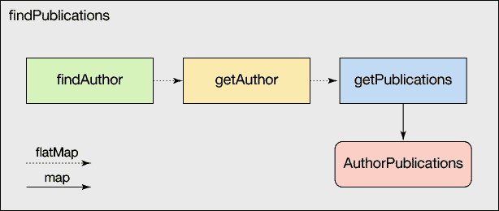

# 通过 Scala 和 Cats 实现模型优先的微服务

> 原文：[`developer.ibm.com/zh/tutorials/cl-model-first-microservices-scala-cats/`](https://developer.ibm.com/zh/tutorials/cl-model-first-microservices-scala-cats/)

基于微服务的架构近年来越来越受欢迎。根据[最近的一项调查](https://jaxenter.com/microservices-trends-2017-survey-133265.html)，将大型系统分解为独立可部署单元的能力是开发人员引证的最大优势之一。但这是有代价的：频繁遍历网络边界需要抽象化，一方面可以方便地处理高度的并发性，另一方面可以容错和进行错误处理。

> Scala 可组合的 Future 类型可用于将微服务调用缝合在一起，并且它的一些缺点可以通过 Cats（一个 Scala 库，可提供支持类型化、函数式编程样式的抽象化）得到解决。

本教程概述了 Scala 强大的类型系统及函数式编程功能如何提供一个出色的画布，以处理微服务组合及其产生的问题。我们还将重点讲述模型驱动的开发样式。微服务通常实施一个[有界上下文](https://martinfowler.com/bliki/BoundedContext.html)，这是来自域驱动的设计概念，它将映射域模型的一个专门子集。重要的是确保域概念继续保持清晰并在并发和错误处理例程情况下不会受到影响。

为了保持实用性，我们将首先介绍一个简化的问题域“文章搜索服务”，并向您演示如何使用熟悉的 Scala 类型进行细分。然后，您将了解 Scala 的可组合 `Future` 类型如何用于将微服务调用缝合在一起，并且它的一些缺点如何通过 Cats（一个 Scala 库，可提供支持类型化、函数式编程样式的抽象化）得到解决。然后，我们将转向错误处理，并尝试使用 Scala 的 `Either[A, B]` 类型和 Cats 为其提供的扩展来解决操作错误中的域错误。我们将通过向您演示 Cats 的 monad 转换程序（组合嵌套效果类型的强大方式），帮助您了解此过程是如何失去某些便利性的。

## 设置场景：文章搜索服务

**免费试用 IBM Cloud**

利用 [IBM Cloud Lite](https://cloud.ibm.com/registration?cm_sp=ibmdev-_-developer-tutorials-_-cloudreg) 快速轻松地构建您的下一个应用程序。您的免费帐户从不过期，而且您会获得 256 MB 的 Cloud Foundry 运行时内存和包含 Kubernetes 集群的 2 GB 存储空间。

在深入研究之前，您需要构建一个服务，在此例中为可以搜索文章库（如 IBM Developer 的文章）的服务。为了保持可管理性，我们将把重点放在该问题域的小的、简化子集上。以下是我们想要实施的服务：

*给定一个搜索查询（可以通过请求参数提供），您就可以按照如下运行搜索：*

仔细研究该需求，存在四个可映射到服务的有界上下文（参见图 1）：

*   **AuthorPublications：**将在这里概述总体服务；给定一个搜索词，将返回匹配的作者属性以及所有发布内容及其各自的属性
*   **AuthorSearch：**将搜索词映射到作者标识的作者发现服务
*   **AuthorMetadata：**将作者标识映射到一组属性的作者查找服务
*   **PublicationMetadata：**将作者标识映射到一组发布内容属性的发布内容查找服务

##### 图 1\. 文章搜索域


让我们看看可对此进行建模的合适类型集。就域驱动的设计而言，您可能会发现有两个关键实体 `Author` 和 `Publication`：

```
case class Author(id: Long, name: String)

case class Publication(id: Long, authorId: Long, title:String) 
```

您还需要一个将作者及其发布内容绑定在一起的聚集：

```
case class AuthorPublications(author: Author, publications: List[Publication]) 
```

这相当简单。现在，看看域逻辑并了解可以如何描述您需要在 `AuthorPublications` 上下文中执行的步骤。要求提供名称作为搜索查询，您需要将查询解析为第一个匹配的作者实体。在实际服务中，该调用很可能会在 `AuthorSearch` 子域中查询搜索索引，向您返回实体标识：

```
def findAuthor(query: String): Future[Long] 
```

该函数签名通过返回 `Future[Long]` 而非 `Long` 来指示可能会以并发方式运行该调用。此处您不需要关心实际实现，但可以假设此功能（及以下功能）将涉及网络 I/O，因此应与应用程序的主执行线程以并发方式运行。

给定作者标识，现在需要将其解析到 `Author` 实体。这个功能在 `AuthorMetadata` 子域中被抽象出来，并且可能公开一个如下的接口：

```
def getAuthor(id: Long): Future[Author] 
```

在实际系统中，此函数可能是[存储库](https://martinfowler.com/eaaCatalog/repository.html)的一部分，将异步查询数据存储库或元数据服务以定位实体。

最后，给定作者标识，您需要在 `PublicationMetadata` 子域中根据给定的作者来查找所有发布内容：

```
def getPublications(authorId: Long): Future[List[Publication]] 
```

让我们回顾一下：您定义了主要域对象 `Article`、`Author` 和 `AuthorPublications`。您还提供了函数（`findAuthor`、`getAuthor` 和 `getPublications`），允许您使用 Scala 的 `Future` 类型从上游服务调用返回这些类型的实例。 现在我们将向您展示如何将这些调用拼接在一起来构建有意义的功能。

## 使用 Future 构成服务

有了这些函数，您可以将其组合在 for-comprehension 中，以生成 `AuthorPublications` 的实例，聚集对象：

```
def findPublications(query: String): Future[AuthorPublications] =
  for {
    authorId <- findAuthor(query)
    author <- getAuthor(authorId)
    pubs <- getPublications(authorId)
  } yield AuthorPublications(author, pubs) 
```

给定可能在请求参数中向您提供的搜索查询，然后您可以按照如下运行搜索：

```
val query = "matthias k"
val search: Future[Unit] = findPublications(query) map { authorPubs =>
  renderResponse(200, s"Found $authorPubs")
}

Await.result(search, Duration.Inf) 
```

这些都是标准的 Scala，但此处有两个值得强调的事项：

1.  尽管每个服务调用可能在不同的线程上执行，但都不会将此复杂性包含在您的代码中，且您的逻辑将清晰地突显。`Future` 类型的组合方面是关键：Scala 将 for-comprehensions 提取到对 `flatMap` 和 `map` 的调用中，它们充当延续，为您执行必需的函数组合。您将获得新函数 `findPublications`，它将返回新的 `Future` 以及该组合链的结果。对您处理效果（并发）的唯一迹象是在返回类型中进行编码。
2.  考虑到上述情况，很显然，直至您实际等待结果的那一刻，您一直在构写函数；您并没有停下来等待中间结果，而是一直依赖 `Future` 组合。这是函数式编程工作方式的主要示例：诸如由于并发而延迟到达值的效果将推送至系统边界。这也是通常进行错误处理的位置，您很快就会看到。

暂不谈优势，此示例存在问题。在 `findPublications` 中，后续服务调用在先前的服务调用返回后才会开始执行，因此您会失去一些重要的东西：并行化选项。这是因为 for-comprehension 中的每一行可以被认为是对先前结果执行操作的回调，如图 2 所示。

##### 图 2\. findPublications



正如您可能已注意到的那样，`getAuthor` 和 `getPublications` 都是在第一步中访存的 `authorId` 基础上工作的。因此，`getPublications` 不需要等待 `getAuthor` 完成，而可以并行执行这两个操作，如图 3 所示。

##### 图 3\. 并行执行


不幸的是，从 Scala 2.12 开始，您没有办法明确地表达这个意图，而必须借助于[一些不直观的做法](http://viktorklang.com/blog/Futures-in-Scala-protips-2.html)，才能使这些调用实际上同时运行。

那么这是否意味着我们在表达并发性方面已经达到了 Scala 内置功能的限制？事实证明，Cats（用于函数式编程的 Scala 库）可以回答此问题；可让您连接两个 Future，有效地并行运行它们。

## Future 倍增：Cats 和 Semigroupal 类型

Cats 不是指猫咪；而是 categories 的缩写，是对研究数学本身中结构的数学分支的称谓。类别理论关注的是在使用强类型语言时非常有用的抽象。具体而言，类别理论采用经过验证为“正确”的*合法*方式，为类型的遍历、转换和组合提供了*蓝图*或*配方*。

其中一种类型是 [Semigroupal](https://typelevel.github.io/cats/api/cats/Semigroupal.html)（先前称为“Cartesian”），允许您使用其 `product` 函数加入 Future。如果您在 SQL 中编写过连接两张表的代码，那么表示您已熟悉[笛卡尔乘积](http://www.dictionary.com/browse/cartesian-product)。SQL 连接需要一组元组（即您所连接的表的行），并产生一个新的集合，每个元素都是一个由所有源表中的值组成的元组。这将有效地使源表倍增。您可以将此想法传达到类型系统：每一种类型表示该类型的一组可能的值（就类别理论而言，是指具有类型作为对象的类别），因此如果您将 A 和 B 两种类型“相乘”，您会收到一个新的类型 (A, B)，其值是来自 A 和 B 的值对。

将此应用于我们的示例，您现在可以说：给定 `Future[Author]` 和 `Future[List[Publication]]`，将两者“相乘”以生成元组化的 `Future[(Author, List[Publication])]`（参见图 4）。

##### 图 4\. 元组化的 future


与前面章节中两个 Future 返回函数 f 和 g 链接在一起（即使 g 根本不依赖于 f 的输出）不同的是，元组类型会更好地表明您的意图：只有当所有值都已生成时，值的元组才能存在，但是允许以任何顺序发生（您可能知道这个规则的名字：交换性）。换句话说，作者还是发布内容先到达并不重要，现在可以并行运行它们：

```
def findPublications(query: String): Future[AuthorPublications] =
  for {
    authorId <- findAuthor(query)
    (author, pubs) <- getAuthor(authorId) product getPublications(authorId)
  } yield AuthorPublications(author, pubs) 
```

将 `getAuthor` 和 `getPublications` 与 `product` 函数组合将同时触发两个 Future，并在两个 Future 成功后立即生成包含两个值的元组，或者在其中任一项失败时生成错误。这不仅是针对您的问题的好解决方案，而且也更清晰地表达了 `getAuthor` 和 `getPublications` 中的域逻辑不彼此依赖。

在我们查看 Cats 的其他优势之前，让我们回头看看早前提及但未完全解决的另一个问题：如何有效地处理文章搜索中出现的错误。

## 处理服务失败

Future 随附内置的错误处理功能。它们使用 Scala 的 [Try 类型](http://www.scala-lang.org/api/2.12.3/scala/util/Try.html)捕获其计算的结果，可以是成功（携带 A 的值）或失败（携带异常）。异常非常适合处理诸如 I/O 故障、运行时平台错误以及未满足的系统期望等操作问题，因此 Try 似乎是捕获 Future 内部状态的合适选择。

您可以尝试完全依赖该机制，但是当涉及到在问题域中表示失败时，应该避免异常。这是因为应用程序中的逻辑失败最好由您可以在返回类型中传递的合适值来表示，而不应将其视为异常。例如，在文章搜索引擎中未能找到作者并非一个异常的失败，但确实是一个失败。想一想：如果您浏览至指向缺失资源的 URL，您会期望浏览器失控吗？当然不期望！您会希望它返回 404 页面，这实际上只是您原来想要的页面的一个替代值。我们来看看如何在 Scala 中实现这一点。

## 密封的类型层次结构

密封的类型层次结构是在 Scala 中编码失败值的一种简便方法。由于密封层次结构不能扩展到其词法范围以外，因此它们允许编译器检查针对其案例的模式匹配是否全面。如果您忘记处理特定故障（可能会强制您处理所有可能的情况），这可以防止您在运行时崩溃。下面演示了如何使用此功能来表示文章搜索服务中的失败：

```
sealed trait ServiceError
case object InvalidQuery extends ServiceError
case object NotFound extends ServiceError 
```

请注意，这些都是[值对象](https://martinfowler.com/bliki/ValueObject.html)，由于它们的类型作用于它们自己，因此您可以通过函数返回它们，而不必使用像抛出异常这样的令人讨厌的方法。您现在可能会问：我如何通过服务函数调用来返回 `ServiceError` 或该调用的实际结果？您自己说过：使用 `Either`。

## Either 类型

`Either[L, R]` 是在 Scala 中表示互斥选择两个值的规范方式：将使用 L（“左”）或 R（“右”），但不会同时使用二者。从 Scala 2.12（也使用早期版本的类路径上的 Cats）开始，`Either` 类型是所谓“right-biased”的右偏 monad，“right”意味着您可以使用 `map` 和 `flatMap` 对其进行转变以遵循正确的路径。这使得它成为表示任何种类计算（包括服务调用）的结果的绝佳选择，其中左分支将替换为错误类型，右分支将替换为成功类型。因此，如您在 `Future` 中看到的那样，右偏将变为成功偏向。让我们实现 `findAuthor` 函数来说明可能会生成 `ServiceError` 而不是作者标识的事实：

```
def findAuthor(query: String): Future[Either[ServiceError, Long]] =
  Future.successful(
    if (query == "matthias k") 42L.asRight
    else if (query.isEmpty) InvalidQuery.asLeft
    else NotFound.asLeft
  ) 
```

当然，这不是一个非常有用的搜索实现，但它的确说明了使用返回类型来表示失败和成功案例。虽然这个实现是明确的（方法合约在签名中清晰可见），它有点冗长。以此方式嵌套效果意味着您现在具有两个级别的体系 `Future` 和 `Either`，必须分别处理。这可能会让您很难获得您寻找的值，因为您需要先映射 `Future` 以抽取 `Either`，然后映射 `Either` 以获取正确的值，或者在代码中：

```
findAuthor("matthias k") map { idOrError => idOrError map { id => ...}  } 
```

图 5 显示了使用包含隐喻的这个效果堆叠：

##### 图 5\. 包含隐喻


使用堆叠效果也将破坏 for-comprehensions 的便利性，因为无法一次遍历两个效果。 理想情况下，您需要一个将两个效果合二为一的抽象：如果 `Future` 成功并且 `Either` 包含正确的结果，那么映射结果。事实证明，Cats 就提供这样一个抽象：monad 转换程序。

## 将效果堆叠与 monad 转换程序合并

Monad 转换程序允许您堆叠效果如“异步运行”(`Future`) 和“多个结果”(`Either`)，并将其视为一体。换句话说，您可以兼得鱼和熊掌！Cats 为一些现有的效果类型（如 `Option` 和 `Either`）提供 monad 转换程序，对于 `Either`，称为 `EitherT`。让我们使用它定义定制 `Result` 类型，该类型将表示服务中搜索结果的输出：

```
 // bind Future and SearchError together while leaving the inner result type unbound
  type Result[A] = EitherT[Future, SearchError, A]

  // this allows you to invoke the companion object as "Result"
  val Result = EitherT 
```

通过该方便的类型定义，您可以紧凑且可读的方式重新定义服务功能，并且不失去您通过使用 `Either` 获得的任何实用程序：

```
def findAuthor(query: String): Result[Long] =
  if (query == "matthias k") Result.rightT(42L)
  else if (query.isEmpty) Result.leftT(InvalidQuery)
  else Result.leftT(NotFound) 
```

此处，`leftT` 和 `rightT` 是助手函数，会将给定的值提升到用于实例化 `EitherT`（在此例中为 `Future`）的效果类型中，然后针对 `Either`，分别转入左侧（错误）和右侧（成功）情况中。就 `Result[Long]` 而言，重新编写该函数可解决上面提及的嵌套映射问题，如图 6 所示。

##### 图 6\. 解决嵌套映射


可以对 `getAuthor` 和 `getPublications` 执行同样的操作：

```
 def getAuthor(id: Long): Result[Author] =
    Result.rightT(Author(id, "Matthias Käppler"))

   def getPublications(authorId: Long): Result[List[Publication]] =
    Result.rightT(List(
      Publication(1L, authorId, "Model-First Microservices with Scala & Cats")
    )) 
```

由于 `EitherT` 本身是简单堆叠 `Future` 和 `Either` 的 monad，因此构成这些功能的文章搜索程序基本保持不变：

```
def findPublications(query: String): Result[AuthorPublications] =
  for {
    authorId <- findAuthor(query)
    result <- getAuthor(authorId) product getPublications(authorId)
    (author, pubs) = result
  } yield AuthorPublications(author, pubs) 
```

唯一的变化是由于 Scala 编译器中的特点，您不再能够直接生成 `(author, pubs)` 元组，而是必须先在临时结果中捕获乘积，然后在一个单独的步骤中执行抽取。这是一点小代价。

您现在准备运行包含各种功能的文章搜索：

```
val query = "matthias k"
val search: Result[Unit] = findPublications(query) map { authorPubs =>
  renderResponse(200, s"Found $authorPubs")
} recover {
  case InvalidQuery => renderResponse(400, s"Not a valid query: '$query'")
  case NotFound => renderResponse(404, s"No results found for '$query'")
}

Await.result(search.value, Duration.Inf) 
```

在您早前定义的成功路径之上，您还将使用定制处理程序调用 `recover`，会将您可能遇到的错误映射到相应的服务响应。由于 `search` 不再是 `Future` 而是 `Result`，因此您必须调用其值方法以获取底层的 `Future`，之后才可以等待其结果。

## 结束语

本教程首先承认微服务组合很容易出错，要高效执行，必须进行并行化处理，然后说明了可组合的 Future 如何成为以函数方式对并发服务调用进行建模的强大工具。您也看到了并行组合的有限能力，这可以通过 Cats 扩充 Future 来解决；这使您能够生成结果元组。然后，我们向您展示了如何使用密封层次结构表示域错误，以及如何使用 `Either` 编写可以返回错误和值的服务函数。但是，使用此不同效果的堆栈可能会非常麻烦，因此我们通过解释如何让 monad 转换程序工作来为您的代码带来清晰性、可读性和便利性来解决问题。整合后，所有一切都在说明具有强大类型系统的函数式编程样式可以如何生成富有表达力的微服务，这些微服务会将模型放在第一位，而不会影响其背后往往高级且复杂的机制。

本文翻译自：[Model-first microservices with Scala and Cats](https://developer.ibm.com/tutorials/cl-model-first-microservices-scala-cats/)（2017-12-18）