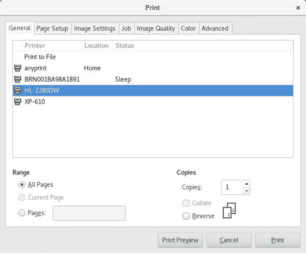
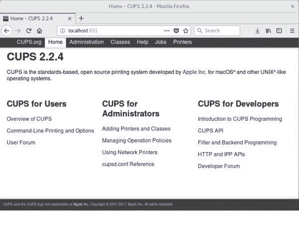
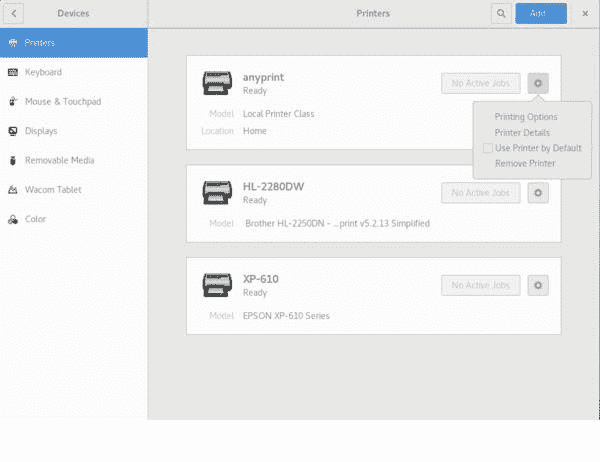

# 管理打印机和打印

> 原文：[`developer.ibm.com/zh/tutorials/l-lpic1-108-4/`](https://developer.ibm.com/zh/tutorials/l-lpic1-108-4/)

## 概述

在本教程中，将学习如何：

*   管理打印队列
*   管理用户打印作业
*   使用 CUPS
*   使用 LPD 兼容性命令
*   诊断打印问题

## 在 Linux 中打印内容

虽然当今的许多通信均采用无纸化电子方式，但对于从计算机打印资料仍有庞大的需求。我们仍需要打印银行对账单、公用事业账单、财务报表及其他各种报表以及福利声明等等，简直不胜枚举。本教程介绍了如何在 Linux 中使用 CUPS 进行打印。

##### 关于本系列

本系列教程将帮助您学习 Linux 系统管理任务。对于 [Linux Professional Institute 的 LPIC-1：Linux 服务器专业认证考试](http://www.lpi.org)，您还可以使用这些教程中的资料来备考。

请参阅”[*学习 Linux，101*：LPIC-1 学习路线图](https://developer.ibm.com/tutorials/l-lpic1-101-3/)”，获得本系列中各教程的描述和链接。这个路线图正在完善中，反映了 2015 年 4 月 15 日更新的 LPIC-1 V4.0 考试目标。在教程完成后，会将它们添加到路线图中。

CUPS 原先为通用 UNIX 打印系统 (Common UNIX Printing System) 的首字母缩写，是 Linux 的打印机和打印作业管理器。早期的计算机打印机通常以特定字符集和字体大小来打印文本行。当今的图形打印机则能够打印各种大小和字体的图形与文本。尽管如此，您当今使用的部分命令仍然可以追溯至更早的行式打印机守护程序 (LPD) 技术。

本教程将帮助您为 Linux Server Professional (LPIC-1) 考试 102 的主题 108 中的目标 108.4 做好应考准备。该目标的权重为 2。

### 前提条件

要想最充分地利用本系列教程，您应该掌握 Linux 的基本知识，还应该有一个正常工作的 Linux 系统，您可以在这个系统上实践本教程中涵盖的命令。您应熟悉 GNU 和 UNIX® 命令。有时候，程序的不同版本将获得不同的输出格式，所以您的结果可能并不总是与这里显示的列表完全相同。

在本教程中，我以 Fedora 27 为例。

## 关于打印的部分历史背景

这一简要历史背景信息并不在 LPI 目标范畴内，但可能会有助于您对此目标的来龙去脉有个大致的认识。

早期计算机大都使用 *行式打印机* 。这些属于击打式打印机，使用等宽字符和单一字体每次打印一行文本。为加速整体系统性能，早期的大型计算机会将读卡器、打卡机和行式打印机等慢速外围设备的工作与其他工作交错进行。因此诞生了 *外部设备联机并行操作* ，也称为 *假脱机* ，在谈及计算机打印时，通常仍会使用这一术语。

在 UNIX 和 Linux 系统中，打印最初使用的是 Berkeley Software Distribution (BSD) 打印子系统，其中包含作为服务器运行的行式打印机守护程序 (lpd)，以及客户端命令（例如，用于提交打印作业的 `lpr` ）。此协议后来由 IETF 实现了标准化，作为 RFC 1179 中所述的 **行式打印机守护程序协议** 。

System 也有一个打印守护程序。它的功能类似于 Berkeley LPD，但采用不同的命令集。您将会经常看到两种具有不同选项但完成相同任务的命令。例如，来自 Berkeley 实施的 `lpr` 和来自 System V 实施的 `lp` 都可打印文件。

随着打印机技术的发展，人们能够在同一页面上混用不同字体以及打印图像和文字。可变宽度字体和更先进的打印技术（例如，字距调整和连字）现已成为标准。对基本 lpd/lpr 打印方法也进行了若干改进，例如，LPRng、下一代 LPR 和 CUPS。

许多支持图形打印的打印机最初使用的都是 Adobe PostScript 语言。PostScript 打印机具有一个引擎，用于解释打印作业中的命令，并通过这些命令生成完成的页面。PostScript 通常用作一种中间格式，介于原始文件（例如，文本文件或图像文件）与适合不具有 PostScript 功能的特定打印机的最终格式之间。将打印作业（例如，ASCII 文本文件或 JPEG 图像）转换为 PostScript，以及从 PostScript 转换为非 PostScript 打印机所需的最终光栅格式，都是使用 *过滤器* 完成的。

如今，基于 PostScript 的可移植文档格式 (PDF) 已在很大程度上替换了原始 PostScript。PDF 旨在独立于硬件和软件，并封装要打印页面的完整描述。您可以查看 PDF 文件，也可以打印这些文件。

## 管理打印队列

用户将打印作业指向称为 *打印队列* 的逻辑实体。在单用户系统中，打印队列和打印机通常是等同的。但是，CUPS 允许未连接打印机的系统对打印作业排队，以便最终在远程系统上进行打印，并且通过使用 *类* ，允许指向某个类的打印作业在该类的首个可用打印机上进行打印。

您可以检验和操作打印队列。执行此操作时用到的部分命令对 CUPS 而言是新命令。其他命令为兼容性命令，源自于 LPD 命令，但是当前选项通常只占原始 LPD 打印系统选项的有限的一小部分。

您可以使用 CUPS `lpstat` 命令来检查系统已知的队列。 lpstat 的选项 中显示了部分常用选项。

##### lpstat 的选项

| 选项 | 用途 |
| --- | --- |
| -a | 显示打印机的接受状态。 |
| -c | 显示打印类。 |
| -p | 显示打印状态：已启用或已禁用。 |
| -s | 显示默认的一个或多个打印机和类。等效于 `-d` 、 `-c 和 -v` 。请注意，必须将多个选项隔开，因为可为许多选项指定值。 |
| -s | 显示打印机及其设备。 |

您还可以将 /usr/sbin 中找到的 LPD `lpc` 命令与 `status` 选项一起使用。如果未指定打印机名称，那么将列出所有队列。 显示可用打印队列 显示两种命令的部分示例。

##### 显示可用打印队列

```
[ian@atticf27 ~]$ lpstat -d
system default destination: HL-2280DW
[ian@atticf27 ~]$ lpstat -v HL-2280DW
device for HL-2280DW: dnssd://Brother%20HL-2280DW._pdl-datastream._tcp.local/
[ian@atticf27 ~]$ lpstat -s
system default destination: HL-2280DW
members of class anyprint:
    HL-2280DW
    XP-610
device for anyprint: ///dev/null
device for HL-2280DW: dnssd://Brother%20HL-2280DW._pdl-datastream._tcp.local/
device for XP-610: dnssd://EPSON%20XP-610%20Series._ipp._tcp.local/?uuid=cfe92100-67c4-11d4-a45f-ac18266c48aa
[ian@atticf27 ~]$ lpstat -a XP-610
XP-610 accepting requests since Thu 27 Apr 2017 05:53:59 PM EDT
[ian@atticf27 ~]$ /usr/sbin/lpc status HL-2280DW
HL-2280DW:
    printer is on device 'dnssd' speed -1
    queuing is disabled
    printing is enabled
    no entries
    daemon present 
```

此示例显示了两台打印机（HL-2280DW 和 XP-610）以及一个类 `anyprint` ，此类允许将打印作业指向这两台打印机中最先可用的打印机。

此示例中，在 HL-2280DW 上，虽然已启用打印，但是当前禁止对打印作业排队，这可能是为了在打印机脱机进行维护之前耗尽队列。可通过 `cupsaccept` 和 `cupsreject` 命令控制是启用还是禁用排队。以前使用的是 `accept` 和 `reject` 命令，但现在您可能会发现，/usr/sbin 中的这两条命令只是指向更新命令的链接。同样，可通过 `cupsenable` 和 `cupsdisable` 命令控制是启用还是禁用打印。在先前版本的 CUPS 中，它们被称为 `enable` 和 `disable` ，这会与内置的 bash shell `enable` 相混淆。 启用排队和禁用打印 显示在打印机 HL-2280DW 上禁用打印时如何启用排队功能。若干 CUPS 命令都支持使用 `-r` 选项来提供操作原因。使用 `lpstat` 时可显示此原因，但使用 `lpc` 时则不显示。

##### 启用排队和禁用打印

```
[ian@atticf27 ~]$ lpstat -a -p HL-2280DW
anyprint accepting requests since Mon 29 Jan 2018 01:17:09 PM EST
HL-2280DW not accepting requests since Thu 27 Apr 2017 05:52:27 PM EDT -
    Maintenance scheduled
XP-610 accepting requests since Thu 27 Apr 2017 05:53:59 PM EDT
printer HL-2280DW is idle.  enabled since Thu 27 Apr 2017 05:52:27 PM EDT
    Maintenance scheduled
[ian@atticf27 ~]$ accept HL-2280DW
[ian@atticf27 ~]$ cupsdisable -r "waiting for toner delivery" HL-2280DW
[ian@atticf27 ~]$ lpstat -p -a
printer anyprint is idle.  enabled since Mon 29 Jan 2018 01:17:09 PM EST
printer HL-2280DW disabled since Mon 29 Jan 2018 04:03:50 PM EST -
    waiting for toner delivery
printer XP-610 is idle.  enabled since Thu 27 Apr 2017 05:53:59 PM EDT
anyprint accepting requests since Mon 29 Jan 2018 01:17:09 PM EST
HL-2280DW accepting requests since Mon 29 Jan 2018 04:03:50 PM EST
XP-610 accepting requests since Thu 27 Apr 2017 05:53:59 PM EDT 
```

请注意，必须由授权用户执行这些任务。这可能是 root 用户或其他授权用户。请参阅 /etc/cups/cups-files.conf 中的 SystemGroup 条目以及 cups-files.conf 的联机帮助页，获取有关授权用户组的更多信息。

## 管理用户打印作业

既然您已大致了解了如何检查打印队列和类，接下来我将向您展示如何管理打印机队列上的作业。首先，您可能需要查明是针对特定打印机还是所有打印机将任何作业排队。您将使用 `lpq` 命令来执行此操作。如果未指定任何选项， `lpq` 会显示默认打印机的队列。将 `-P` 选项与打印机名称结合使用来指定特定打印机，或者使用 `-a` 选项来指定所有打印机，如 使用 lpq 检查打印队列 中所示。

##### 使用 lpq 检查打印队列

```
[pat@atticf27 ~]$ # As user pat (non-administrator)
[pat@atticf27 ~]$ lpq
HL-2280DW is not ready
Rank    Owner   Job     File(s)                         Total Size
1st     unknown 4       unknown                         6144 bytes
2nd     pat     6       bitlib.h                        6144 bytes
3rd     pat     7       bitlib.C                        6144 bytes
4th     unknown 8       unknown                         1024 bytes
5th     unknown 9       unknown                         1024 bytes

[ian@atticf27 ~]$ # As user ian (administrator)
[ian@atticf27 ~]$ lpq -P xp-610
xp-610 is ready
no entries
[ian@atticf27 ~]$ lpq -a
Rank    Owner   Job     File(s)                         Total Size
1st     ian     4       permutation.C                   6144 bytes
2nd     pat     6       bitlib.h                        6144 bytes
3rd     pat     7       bitlib.C                        6144 bytes
4th     ian     8       .bashrc                         1024 bytes
5th     ian     9       .bashrc                         1024 bytes 
```

在此示例中，针对名为 HL-2280DW 的打印机有五个作业（4、6、7、8 和 9）在排队，而针对 XP-610 则没有作业在排队。在此情况下，使用 `-P` 选项仅显示打印机已就绪，但没有排队的作业。请注意，CUPS 打印机名称不区分大小写。另请注意，用户 ian 已将某一项作业提交了两次，这是作业首次未打印时用户通常会采取的操作。

总而言之，您可以查看或操作自己的打印作业，但要操作其他用户的作业，通常就需要 root 用户或其他授权用户。大部分 CUPS 命令还会使用 `-E` 选项，对 CUPS 客户端命令与 CUPS 服务器之间的通信进行加密

使用 `lprm` 命令可从队列中除去某个 .bashrc 作业。如果没有任何选项，将除去当前作业。使用 `-` 选项，将会除去所有作业。否则，请指定要除去的作业列表，如 使用 lprm 删除打印作业 中所示。

##### 使用 lprm 删除打印作业

```
[[pat@atticf27 ~]$ # As user pat (non-administrator)
[pat@atticf27 ~]$ lprm
lprm: Forbidden

[ian@atticf27 ~]$ # As user ian (administrator)
[ian@atticf27 ~]$ lprm 8
[ian@atticf27 ~]$ lpq
HL-2280DW is not ready
Rank    Owner   Job     File(s)                         Total Size
1st     ian     4       permutation.C                   6144 bytes
2nd     pat     6       bitlib.h                        6144 bytes
3rd     pat     7       bitlib.C                        6144 bytes
4th     ian     9       .bashrc                         1024 bytes 
```

请注意，用户 pat 无法除去队列上的首个作业，因为它属于用户 ian。但是，ian 可以除去自己的编号为 8 的作业。

另一条可用于操作打印队列上的作业的命令是 `lp` 命令。可使用它来更改作业属性，例如，副本优先级或数量。假定用户 ian 希望先打印自己的作业 9，然后再打印用户 pat 的作业，而且他确实需要这份作业的两份副本。作业优先级的范围从最低优先级 1 到最高优先级 100，默认为 50。用户 ian 可使用 `-i` 、 `-n` 和 `-q` 选项来指定要更改的作业以及新的副本数量和优先级，如 使用 lp 更改副本数量和优先级 中所示。请注意，使用 `lpq` 命令的 `-l` 选项可提供更详细的输出。

##### 使用 lp 更改副本数量和优先级

```
[ian@atticf27 ~]$ lpq
HL-2280DW is not ready
Rank    Owner   Job     File(s)                         Total Size
1st     ian     4       permutation.C                   6144 bytes
2nd     pat     6       bitlib.h                        6144 bytes
3rd     pat     7       bitlib.C                        6144 bytes
4th     ian     9       .bashrc                         1024 bytes
[ian@atticf27 ~]$ lp -i 9 -q 60 -n 2
[ian@atticf27 ~]$ lpq
HL-2280DW is not ready
Rank    Owner   Job     File(s)                         Total Size
1st     ian     9       .bashrc                         1024 bytes
2nd     ian     4       permutation.C                   6144 bytes
3rd     pat     6       bitlib.h                        6144 bytes
4th     pat     7       bitlib.C                        6144 bytes 
```

最后， `lpmove` 命令可用于将作业从一个队列移至另一个队列。例如，由于打印机 HL-2280DW 当前未在打印，我们可能想要执行此操作。您可以仅指定一个作业编号（例如，9），也可以使用队列名称和连字符来加以限定，例如，HL-2280DW-0。只有授权用户才能使用 `lpmove` 命令。 使用 lpmove 将作业移至另一个打印队列 显示了如何将这些作业移至另一个队列，首先通过打印机和作业 ID 来指定，然后指定了给定打印机的所有作业。当我们再次检查队列时，其中一个作业已在打印。

##### 使用 lpmove 将作业移至另一个打印队列

```
[ian@atticf27 ~]$ lpmove HL-2280DW-9 anyprint
[ian@atticf27 ~]$ lpmove HL-2280DW xp-610
[ian@atticf27 ~]$ lpq -a
Rank    Owner   Job     File(s)                         Total Size
active  ian     9       .bashrc                         1024 bytes
1st     ian     4       permutation.C                   6144 bytes
2nd     pat     6       bitlib.h                        6144 bytes
3rd     pat     7       bitlib.C                        6144 bytes
[ian@atticf27 ~]$ # A few minutes later
[ian@atticf27 ~]$ lpq -a
Rank    Owner   Job     File(s)                         Total Size
active  pat     6       bitlib.h                        6144 bytes
1st     pat     7       bitlib.C                        6144 bytes 
```

如果您使用的打印服务器碰巧不是 CUPS（例如，LPD 或 LPRng），那么许多队列管理功能都是以 `lpc` 命令的子命令形式来处理的。例如，可以使用 `lpc topq` 将作业移至队列顶部。其他 `lpc` 子命令包括 `disable` 、 `down` 、 `enable` 、 `hold` 、 `move` 、 `redirect` 、 `release` 和 `start` 。这些子命令并不在 CUPS `lpc` 兼容性命令中实现。

### 打印文件

如何建立打印作业？许多图形程序均提供打印方法，通常位于 **File** 菜单选项下。这些程序提供了多个图形工具，用于选择打印机、边距大小、彩色或黑白打印、副本数量、奇偶页并排打印（每张纸打印两页，通常用于宣传资料）等等。以下显示了用于控制此类功能的命令行工具和图形实现方式，以作比较。

打印任何文件的最简单方法就是使用 `lpr` 命令并提供文件名。这样可在默认打印机上打印文件。 `lp` 命令可打印文件和修改打印作业。 使用 lpr 和 lp 进行打印 显示了使用这两条命令的简单示例。请注意， `lpr` 会以静默方式实现作业假脱机，而 `lp` 则会显示假脱机作业的编号。

##### 使用 lpr 和 lp 进行打印

```
[ian@atticf27 ~]$ echo "Print this text" > printexample.txt
[ian@atticf27 ~]$ lpr printexample.txt
[ian@atticf27 ~]$ lp printexample.txt
request id is HL-2280DW-12 (1 file(s)) 
```

lpr 的选项 显示了您可配合 `lpr` 使用的部分选项。请注意， `lp` 具有与 `lpr` 相似的选项，但名称可能不同；例如， `lpr` 上的 `-#` 与 `lp` 上的 `-n` 等效。请参阅联机帮助页了解更多信息。

##### lpr 的选项

| 选项 | 用途 |
| --- | --- |
| -C、-J 或 -T | 设置作业名。 |
| -P | 选择特定打印机。 |
| -# | 指定副本数量。请注意，这与您在 `lp` 命令中看到的 -n 选项不同。 |
| -m | 作业完成时发送电子邮件。 |
| -l | 指示已设置打印文件的格式以进行打印。与 `-o raw` 等效。 |
| -o | 设置作业选项。 |
| -p | 使用阴影标题设置文本文件格式。与 `-o prettyprint` 等效。 |
| -q | 使作业暂挂（或排队），以便稍后打印。 |
| -r | 实现文件假脱机以进行打印后，移除此文件。 |

使用 lpr 进行打印 显示了其中部分选项的实际运用。我请求在打印后发送确认电子邮件、暂挂作业和打印后删除文件。

##### 使用 lpr 进行打印

```
[ian@atticf27 ~]$ lpr -P HL-2280DW -J "Ian's text file" -#2 -m -p -q -r printexample.txt
[[ian@atticf27 ~]$ lpq -l
HL-2280DW is ready

ian: 1st                               [job 13 localhost]
        2 copies of Ian's text file             1024 bytes
[ian@atticf27 ~]$ ls printexample.txt
ls: cannot access 'printexample.txt': No such file or directory 
```

现在，HL-2280DW 打印队列中有一个暂挂作业。接下来该怎么办？ `lp` 命令具有可用于暂挂和释放作业的选项，可将各种值与 `-H` 选项结合使用。 恢复暂挂打印作业的打印操作 显示了如何释放暂挂的作业。检查 `lp` 联机帮助页，获取有关其他选项的信息。

##### 恢复暂挂打印作业的打印操作

```
[ian@atticf27 ~]$ lp -i 13 -H resume 
```

并非所有可用打印机都支持同一组选项。使用 `lpoptions` 命令可查看为打印机设置的常规选项。添加 `-l` 选项可显示特定于打印机的选项。 检查打印机选项 显示了两个示例。许多常用的选项都涉及纵向/横向打印、页面尺寸和页面上输出内容的布局。请参阅联机帮助页了解详细信息。

##### 检查打印机选项

```
[ian@atticf27 ~]$ lpoptions -p HL-2280DW
copies=1 device-uri=dnssd://Brother%20HL-2280DW._pdl-datastream._tcp.local/
finishings=3 job-cancel-after=10800 job-hold-until=no-hold job-priority=50
job-sheets=none,none marker-change-time=1517325288 marker-colors=#000000,#000000
marker-levels=-1,92 marker-names='Black\ Toner\ Cartridge,Drum\ Unit'
marker-types=toner,opc number-up=1 printer-commands=none
printer-info='Brother HL-2280DW' printer-is-accepting-jobs=true
printer-is-shared=true printer-is-temporary=false printer-location
printer-make-and-model='Brother HL-2250DN - CUPS+Gutenprint v5.2.13 Simplified'
printer-state=3 printer-state-change-time=1517325288 printer-state-reasons=none
printer-type=135188 printer-uri-supported=ipp://localhost/printers/HL-2280DW
sides=one-sided

[ian@atticf27 ~]$ lpoptions -l -p xp-610
PageSize/Media Size: *Letter Legal Executive Statement A4
ColorModel/Color Model: *Gray Black
InputSlot/Media Source: *Standard ManualAdj Manual MultiPurposeAdj MultiPurpose
UpperAdj Upper LowerAdj Lower LargeCapacityAdj LargeCapacity
StpQuality/Print Quality: None Draft *Standard High
Resolution/Resolution: *301x300dpi 150dpi 300dpi 600dpi
Duplex/2-Sided Printing: *None DuplexNoTumble DuplexTumble
StpiShrinkOutput/Shrink Page If Necessary to Fit Borders: *Shrink Crop Expand
StpColorCorrection/Color Correction: *None Accurate Bright Hue Uncorrected
Desaturated Threshold Density Raw Predithered
StpBrightness/Brightness: 0 100 200 300 400 500 600 700 800 900 *None 1100
1200 1300 1400 1500 1600 1700 1800 1900 2000 Custom.REAL
StpContrast/Contrast: 0 100 200 300 400 500 600 700 800 900 *None 1100 1200
1300 1400 1500 1600 1700 1800 1900 2000 2100 2200 2300 2400 2500 2600 2700
2800 2900 3000 3100 3200 3300 3400 3500 3600 3700 3800 3900 4000 Custom.REAL
StpImageType/Image Type: None Text Graphics *TextGraphics Photo LineArt 
```

大部分 GUI 应用都具有打印对话框，通常使用 **File>Print** 菜单选项。 从 GIMP 打印 显示了图像操作程序 GIMP 中的示例。

##### 从 GIMP 打印



到目前为止，我们的所有命令都已隐式指向本地 CUPS 打印服务器。您还可以通过指定 `-h` 选项和端口号（如果端口号不是 CUPS 默认端口号 631），将大部分命令指向其他系统上的服务器。

## CUPS 和 CUPS 服务器

CUPS 打印系统的核心是作为守护进程运行的 `cupsd` 打印服务器。CUPS 配置文件通常位于 /etc/cups/cupsd.conf 中。/etc/cups 目录还包含与 CUPS 相关的其他配置文件。CUPS 通常在系统初始化期间启动，但可根据您的发行版通过位于 /etc/rc.d/init.d 或 /etc/init.d 中的 CUPS 脚本来进行控制。对于使用 systemd 初始化的较新系统，CUPS 服务脚本可能位于 /usr/lib/systemd/system/cups.service 中。就像大部分此类脚本一样，您可以停止、启动或重新启动守护程序。请参阅我们的教程”[学习 Linux，101：运行级别、引导目标、关机和重新引导](https://developer.ibm.com/tutorials/l-lpic1-101-3/) ”，获取有关使用初始化脚本的更多信息。

配置文件 /etc/cups/cupsd.conf 包含的参数可控制对打印系统的访问、是否允许远程打印、假脱机文件的位置等等。在某些系统上，会有第二个部分用于描述个别打印队列，这部分通常是由配置工具自动生成的。 默认 /etc/cups/cupsd.conf 文件的部分内容 显示了默认 cupsd.conf 文件的部分条目。请注意，注释以 # 字符开头。默认值通常显示为注释，在默认值基础上更改的条目已删除前置＃字符。

##### 默认 /etc/cups/cupsd.conf 文件的部分内容

```
# Only listen for connections from the local machine.
Listen localhost:631
Listen /var/run/cups/cups.sock

# Show shared printers on the local network.
Browsing On
BrowseLocalProtocols dnssd

# Default authentication type, when authentication is required...
DefaultAuthType Basic

# Web interface setting...
WebInterface Yes

# Set the default printer/job policies...
<Policy default>
  # Job/subscription privacy...
  JobPrivateAccess default
  JobPrivateValues default
  SubscriptionPrivateAccess default
  SubscriptionPrivateValues default

  # Job-related operations must be done by the owner or an administrator...
  <Limit Create-Job Print-Job Print-URI Validate-Job>
    Order deny,allow
  </Limit> 
```

原先 cupsd.conf 中允许的文件、目录和用户配置指令，现在改为存储在 cups-files.conf 中。这样可防止某些类型的特权升级攻击。 默认 /etc/cups/cups-files.conf 的部分内容 显示了 cups-files.conf 中的部分条目。请注意，根据文件系统层次结构标准 (FHS)，假脱机文件默认情况下存储在 /var/spool 文件系统中。请参阅 cupsd.conf 和 cups-files.conf 的联机帮助页，获取有关这些配置文件的更多详细信息。

##### 默认 /etc/cups/cups-files.conf 的部分内容

```
# Location of the file listing all of the local printers...
#Printcap /etc/printcap

# Format of the Printcap file...
#PrintcapFormat bsd
#PrintcapFormat plist
#PrintcapFormat solaris

# Location of all spool files...
#RequestRoot /var/spool/cups

# Location of helper programs...
#ServerBin /usr/lib/cups

# SSL/TLS keychain for the scheduler...
#ServerKeychain ssl

# Location of other configuration files...
#ServerRoot /etc/cups 
```

默认 /etc/cups/cups-files.conf 的部分内容 表示 /etc/printcap 文件。这是 LPD 打印服务器的配置文件名称，部分应用仍使用它来确定可用的打印机及其属性。这通常会在 CUPS 系统中自动生成，因此您可能无法自行修改。但是，在诊断用户打印问题时，您可能需要检查此文件。 自动生成的 /etc/printcap 显示了一个示例。

##### 自动生成的 /etc/printcap

```
# This file was automatically generated by cupsd(8) from the
# /etc/cups/printers.conf file.  All changes to this file
# will be lost.
HL-2280DW|Brother HL-2280DW:rm=atticf27:rp=HL-2280DW:
anyprint|Any available printer:rm=atticf27:rp=anyprint:
XP-610|EPSON XP-610 Series:rm=atticf27:rp=XP-610: 
```

这里的每一行都包含了一个打印机名称和打印机描述，以及远程机器 (rm) 的名称和此机器上的远程打印机 (rp)。较早的 /etc/printcap 文件同样也描述了打印机功能。

### 文件转换过滤器

您可以使用 CUPS 打印多种类型的文件，包括纯文本、PDF、PostScript 和各种图像格式，而无需告知 `lpr` 或 `lp` 命令除文件名以外的任何其他信息。这种魔法般的功能是通过使用 *过滤器* 来实现的。名为 *magicfilter* 的过滤器确实已流行多年。

CUPS 使用多用途互联网邮件扩展 (MIME) 类型来确定打印文件时相应的转换过滤器。其他打印程序包可能使用 `file` 命令所使用的 *魔法编号* 机制。请参阅 `file` 或 `magic` 的联机帮助页，获取更多详细信息。

使用过滤器将输入文件转换为中间光栅格式或 PostScript 格式。添加作业信息，例如，副本数量。最后，将数据通过后端发送至目标打印机。可以使用一些过滤器（例如， `a2ps` 或 `dvips` ）来手动过滤输入。您可执行此操作以获取特殊格式的结果，或者处理 CUPS 本机不支持的文件格式。

### 添加打印机

CUPS 支持各种打印机，包括：

*   本地连接的并行打印机和 USB 打印机
*   互联网打印协议 (IPP) 打印机
*   远程 LPD 打印机
*   使用 SAMBA 的 Microsoft® Windows® 打印机
*   使用 NCP 的 Novell 打印机
*   HP Jetdirect 连接的打印机

如今的大部分系统都会尝试在系统启动或连接设备时，自动检测和自动配置本地硬件。同样，也可以自动检测许多网络打印机。使用 CUPS Web 管理工具（[`localhost:631`](http://localhost:631) 或 [`127.0.0.1:631）来搜索或添加打印机。许多分发版都包含自己的配置工具，例如，SUSE`](http://127.0.0.1:631）来搜索或添加打印机。许多分发版都包含自己的配置工具，例如，SUSE) 系统上的 YaST。 使用 CUPS Web 界面 显示了使用 localhost:631 的 CUPS 界面， 使用 Fedora 27 上的打印机设置 则显示了 Fedora 27 上的 GNOME 打印机设置对话框。

##### 使用 CUPS Web 界面



##### 使用 Fedora 27 上的打印机设置



您还可以从命令行配置打印机。在配置打印机之前，您需要获得有关打印机及其连接方式的一些基本信息。如果远程系统需要用户 ID 或密码，那么您也需要此信息。

您需要了解用于打印机的驱动程序。Linux 并非完全支持所有打印机，有些打印机可能根本无法工作或者只能在受限情况下工作。请访问 OpenPrinting.org（参阅 相关主题 ），查看是否有用于您的特定打印机的驱动程序。 `lpinfo` 命令还可帮助您识别可用设备类型和驱动程序。使用 `-v` 选项可列出受支持的设备， `-m` 选项可列出驱动程序，如 可用打印机驱动程序 中所示。

##### 可用打印机驱动程序

```
[ian@atticf27 ~]$ lpinfo -m | grep -i xp-610
lsb/usr/Epson/epson-inkjet-printer-escpr/Epson-XP-610_Series-epson-escpr-en.ppd.gz
EPSON XP-610 Series, Epson Inkjet Printer Driver (ESC/P-R) for Linux
[ian@atticf27 ~]$ locate "Epson-XP-610_Series-epson-escpr-en.ppd.gz"
/usr/share/ppd/Epson/epson-inkjet-printer-escpr/Epson-XP-610_Series-epson-escpr-en.ppd.gz
[ian@atticf27 ~]$ lpinfo -v
network socket
network ipps
network lpd
network beh
network ipp
network http
network https
direct hp
serial serial:/dev/ttyS0?baud=115200
direct parallel:/dev/lp0
network smb
direct hpfax
network dnssd://Brother%20HL-2280DW._pdl-datastream._tcp.local/
network dnssd://EPSON%20XP-610%20Series._ipp._tcp.local/?uuid=cfe92100-67c4-11d4-a45f-ac18266c48aa
network lpd://BRN001BA98A1891/BINARY_P1
network lpd://192.168.1.38:515/PASSTHRU 
```

Epson-XP-610_Series-epson-escpr-en.ppd.gz 驱动程序位于我的系统上的 /usr/share/ppd/Epson/epson-inkjet-printer-escpr/ 目录中。

如果您未找到驱动程序，请访问打印机制造商网站，查看是否提供了专有驱动程序。例如，在编写本文时，Brother 有一个用于 HL-2280DW 打印机的驱动程序，但此驱动程序并未在 OpenPrinting.org 中列出。

掌握了基本信息后，您就可以使用 `lpadmin` 命令来配置打印机，如 配置打印机 中所示。为此，我将创建 HL-2280DW 打印机的另一个实例，用于进行双面打印。

##### 配置打印机

```
[ian@atticf27 ~]$ lpinfo -m | grep -i "hl.*2280"
HL2280DW.ppd Brother HL2280DW for CUPS
lsb/usr/HL2280DW.ppd Brother HL2280DW for CUPS
[ian@atticf27 ~]$ lpadmin -p HL-2280DW-duplex -E -m HL2280DW.ppd  \
> -v dnssd://Brother%20HL-2280DW._pdl-datastream._tcp.local/ \
> -D "Brother 1" -o sides=two-sided-long-edge
[ian@atticf27 ~]$ lpstat -a
anyprint accepting requests since Mon 29 Jan 2018 01:17:09 PM EST
HL-2280DW accepting requests since Tue 30 Jan 2018 10:56:10 AM EST
HL-2280DW-duplex accepting requests since Wed 31 Jan 2018 11:41:16 AM EST
HXP-610 accepting requests since Mon 29 Jan 2018 10:34:49 PM EST 
```

您可以将 `lpadmin` 与 `-c` 选项结合使用，只为双面打印创建新类，而不是为双面打印创建一个打印机副本。

如果需要移除打印机，请将 `lpadmin` 与 `-x` 选项结合使用。

移除打印机并创建一个类 显示了如何移除打印机并改为创建一个类。

##### 移除打印机并创建一个类

```
[ian@atticf27 ~]$ lpadmin -x HL-2280DW-duplex
[ian@atticf27 ~]$ lpadmin -p HL-2280DW -c duplex -E -D "Duplex printing" -o sides=two-sided-long-edge
[ian@atticf27 ~]$ cupsenable duplex
[ian@atticf27 ~]$ cupsaccept duplex
[ian@atticf27 ~]$ lpstat -a
anyprint accepting requests since Mon 29 Jan 2018 01:17:09 PM EST
duplex accepting requests since Wed 31 Jan 2018 12:12:05 PM EST
HL-2280DW accepting requests since Wed 31 Jan 2018 11:51:16 AM EST
XP-610 accepting requests since Mon 29 Jan 2018 10:34:49 PM EST 
```

您还可以使用 `lpadmin` 或 `lpoptions` 命令设置各种打印机选项。请参阅联机帮助页，了解更多详细信息。

## 故障排除

如果打印时遇到问题，请尝试以下建议：

*   确保 CUPS 服务器正在运行。您可以使用 `lpstat` 命令，此命令若无法连接到 cupsd 守护程序，就会报告错误。或者也可以使用 `ps -ef` 命令，并在输出中查找是否列出了 cupsd。
*   如果您尝试将作业排队等待打印，但收到错误消息，表明打印机未接受作业，请使用 `lpstat -a` 或 `lpc status` 来检查该打印机是否正在接受作业。
*   如果排队的作业未打印，请使用 `lpstat -p` 或 `lpc status` 来检查该打印机是否正在接受作业。如上文所述，您可能需要将作业移至其他打印机。
*   如果打印机为远程打印机，请检查该打印机是否仍存在于远程系统上，以及是否在运行。
*   检查配置文件，确保允许特定用户或远程系统在该打印机上打印。
*   确保您的防火墙允许远程打印请求：从其他系统到您的系统的请求，或者从您的系统到其他系统的请求，具体视情况而定。
*   验证您是否具有正确的驱动程序。

如您所见，打印过程离不开若干系统组件的正常运行，可能也会牵涉到网络。由于本教程篇幅有限，我们只能介绍故障诊断方面的一些基础知识。大部分 CUPS 系统还提供了图形界面来执行此处讨论的命令行功能。通常，可使用浏览器指向 631 端口从本地主机访问此界面（[`localhost:631`](http://localhost:631) 或 [`127.0.0.1:631），如先前`](http://127.0.0.1:631），如先前) 使用 CUPS Web 界面 中所示。

您可以通过在前台而不是作为守护进程来运行 CUPS，对它进行调试。您还可以根据需要测试替代配置文件。运行 `cupsd -h` 以获取更多信息或参阅联机帮助页。

CUPS 还保留访问日志和错误日志。您可以在 cupsd.conf 中使用 LogLevel 语句更改日志记录级别。默认情况下，日志存储在 /var/log/cups 目录中。可从浏览器界面 ([`localhost:631`](http://localhost:631)) 上的 **Administration** 选项卡中查看这些日志。使用不带任何选项的 `cupsctl` 命令可显示日志记录选项。编辑 cupsd.conf 或使用 `cupsctl` 来调整各种日志记录参数。请参阅 `cupsctl` 联机帮助页，了解更多详细信息。

Ubuntu Wiki 还提供了一个很有用的页面，介绍了有关 [调试打印问题](https://wiki.ubuntu.com/DebuggingPrintingProblems) 的信息。

以上即是打印和 CUPS 的相关介绍。

本文翻译自：[Learn Linux, 101: Manage printers and printing](https://developer.ibm.com/tutorials/l-lpic1-108-4/)（2018-03-14）