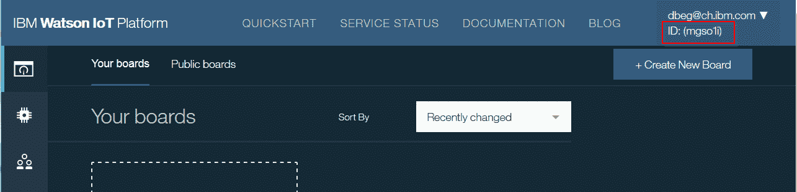
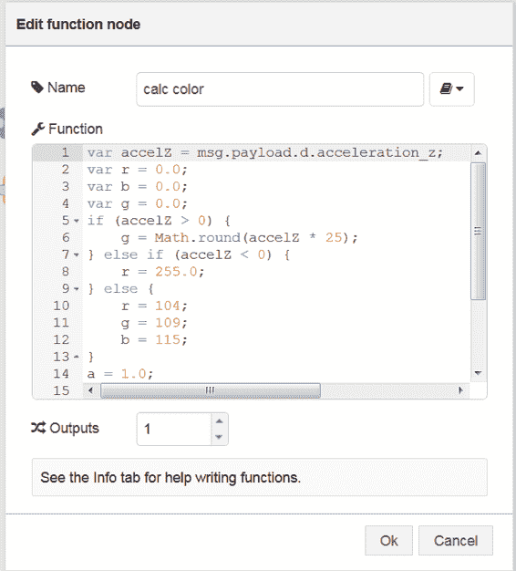

# 将您的智能手机转变为 IoT 设备

> 原文：[`developer.ibm.com/zh/tutorials/iot-mobile-phone-iot-device-bluemix-apps-trs/`](https://developer.ibm.com/zh/tutorials/iot-mobile-phone-iot-device-bluemix-apps-trs/)

本教程将介绍如何将智能手机生成的传感器数据发送至 IBM Watson IoT Platform 云托管服务，然后在 IBM Cloud 上创建 Cloud Foundry 应用来处理、可视化和存储数据。最后，将说明如何为智能手机创建 Android 应用。

以下是架构概述：


**免费试用 IBM Cloud**

利用 [IBM Cloud Lite](https://cloud.ibm.com/registration?cm_sp=ibmdev-_-developer-tutorials-_-cloudreg) 快速轻松地构建您的下一个应用程序。您的免费帐户从不过期，而且您会获得 256 MB 的 Cloud Foundry 运行时内存和包含 Kubernetes 集群的 2 GB 存储空间。

## 构建您的应用需要做的准备工作

*   一个 IBM Cloud 帐户；如果您还没有 IBM Cloud 帐户，可以先注册一个[免费试用](https://cloud.ibm.com/registration?cm_sp=ibmdev-_-developer-tutorials-_-cloudreg)帐户。
*   下载并安装 [Cloud Foundry 命令行接口](https://cloud.ibm.com/docs/starters?topic=starters-download-modify-and-redeploy-your-cloud-foundry-app-with-the-command-line-interface)。
*   智能手机（Android 或 iOS 设备）

1

## 在 IBM Cloud 中创建一个 IoT 应用

Internet of Things Platform Starter 样板包含一个 Node-RED 引擎，稍后将使用它来处理 IoT 消息。现在，您将创建 Internet of Things 服务，以将 MQTT 消息发送至 IBM Watson IoT Platform 以及接收来自 IBM Watson IoT Platform 的 MQTT 消息。

1.  登录至您的 [IBM Cloud 帐户](https://cloud.ibm.com/?cm_sp=ibmdev-_-developer-tutorials-_-cloudreg)。
2.  单击 **Create Resource**。
3.  在 Catalog 中的 Platform 下，单击 **Internet of Things Platform Starter**。
4.  为您的应用输入一个名称。由于该名称也用作主机名称，因此它在 IBM Cloud 中必须是唯一的，如“iot ”。举例来说，我可能会使用 `iottutorialdaniel`。

    

5.  单击 **Create**。
6.  创建应用之后，在左侧窗格中单击 **Overview**。请注意，您的应用包含两个连接，一个连接至 Cloudant NoSQL 数据库，另一个连接至 Internet of Things Platform 服务。

2

## 添加用于将 MQTT 消息发送至 Watson IoT Platform 的设备

1.  在应用的 Overview 视图中的 Connections 下，单击名称类似 `iot< _your name_ >-iotf-service` 的 Internet of Things Platform 服务。

    

2.  单击 **Launch** 以打开 Watson IoT Platform 仪表板。

    

    这样会显示 IBM Watson IoT Platform 仪表板，这是独立于 IBM Cloud 的一项服务。向您的应用分配组织 ID，稍后在开发移动应用时将需要此 ID。在下图中，组织 ID 为 `mgso1i`，显示在仪表板右上角的登录信息下。

    

3.  在悬停鼠标时弹出的左侧菜单上，单击 **Devices**。然后单击 **Add a device type**。在您的组织中，可以具有多种设备类型，每种类型都包含多个设备。*设备类型*是一组具有相同特征的设备；例如，它们可能提供相同的传感器数据。在我们的例子中，设备类型名称*必须*是“`Android`”（您稍后将使用的应用需要该设备类型名称）。

    

4.  单击 **Next**。这样会显示一个页面，您可以在其中输入有关设备类型（如序列号或型号）的元数据。您无需为该演示指定此信息。只需单击 **Done**。
5.  单击 **Register Devices**。输入设备 ID。例如，*设备 ID* 可以是智能手机的 MAC 地址。但是，它在您的组织中只能是唯一的。因此，您可能会像我一样，输入类似于“112233445566”这样的内容。
6.  单击 **Next**。这样会显示一个页面，您可以在其中输入有关设备的元数据。将其留空，然后单击 **Next**。
7.  为认证令牌提供一个值。记住该值供以后使用。然后单击 **Next**。

    

8.  单击 **Done**。
9.  单击 **Back**。

现在，您就可以将 MQTT 消息从设备发送至 IBM Watson IoT Platform。

3

## 安装并配置 Android 应用

如果您具有 iPhone 或 iPad，那么可以使用 [IoT Starter for iOS](https://github.com/ibm-watson-iot/iot-starter-for-ios)。本文并未涵盖在 iPhone 上的安装信息，但如果您自行在 iPhone 上安装，可以对本教程的剩余部分使用 iOS 应用。

您将使用 IoT Starter for Android 应用在智能手机上读取和发送传感器数据。应用的源代码和文档位于 [`iot-starter-for-android` GitHub 项目](https://github.com/ibm-watson-iot/iot-starter-for-android)中。

如果您拥有 Android 开发经验，可以从 GitHub [下载代码](https://github.com/ibm-watson-iot/iot-starter-for-android)，将它导入 Android 开发环境，然后构建 apk 文件。否则，要快速安装并运行该应用，请执行以下步骤。

**注：**.apk 文件是为 Android V5.0.1 编译的，但在 Android 6 上也经过了测试并且可有效运行。如果您安装了此应用的较早版本，那么必须先将其卸载才能安装此版本。

[获得代码](https://github.com/ibm-watson-iot/iot-starter-for-android)

1.  在您的手机上，转至 **Settings** > **Security**。在 Device Administration 下，启用 **Unknown sources**。现在，您可以从 Google Play 外部安装 .apk 文件。
2.  在手机上打开浏览器，然后输入以下 URL：

    `https://github.com/deveops/iot-starter-for-android/releases`

    

3.  搜索 **`iotstarter-v2.1.0.apk`** 链接，然后单击该链接以下载 .apk 文件。
4.  单击下载的文件，并确认您要安装此应用。

    

    IoT Starter 应用现在已安装在您的 Android 设备上。

接下来，就需要配置 Android 应用。

1.  启动 IoT Starter 应用。
2.  单击 **Skip tutorial**。
3.  输入以下参数：

    *   **Organization**：显示在 IBM IoT 服务器上的组织 ID（位于“添加用于将 MQTT 消息发送至 Watson IoT Platform 的设备”的开头部分）。例如，在本教程中为 `mgso1i`。
    *   **Device ID**：您配置的设备 ID（位于“添加用于将 MQTT 消息发送至 Watson IoT Platform 的设备”的结尾部分）。例如，在本教程中为“`112233445566`”。
    *   **Auth Token**：您在“添加用于将 MQTT 消息发送至 Watson IoT Platform 的设备”中指定的授权令牌。
    *   选中 **Use SSL**。

    

4.  单击 **Activate Sensor**。现在，应用可从智能手机中的加速传感器收集数据，并将数据发送至 IBM IoT 服务器。应用将显示加速计数据以及发布或接收的消息数。

    

4

## 验证是否正在将消息从智能手机发送至 Watson IoT Platform

1.  返回到您的计算机，重新打开您组织的 IBM Watson IoT Platform 页面（请查看“添加用于将 MQTT 消息发送至 Watson IoT Platform 的设备”的开头部分）。
2.  在左侧菜单中，单击 **Devices**。这样会显示您的 Android 设备。

    

3.  单击 Device ID，然后转至 Recent Events 选项卡。您应该会看到来自智能手机的事件。
4.  单击其中一个事件。从智能手机发送的消息采用 JSON 格式。它们包含加速和位置数据。

    

现在，您就可以在 IBM Cloud 上使用消息数据。

5

## 在 Node-RED 流中处理消息

Node-RED 是一个可视化工具，可以轻松连接和处理 Internet of Things 消息。您可以在“[Node-RED 简介](https://developer.ibm.com/tv/an-introduction-to-node-red/)”这一 IoT 实践视频中了解有关 Node-RED 的更多信息。

在此部分中，您将使用 Node-RED 流处理来自智能手机的消息，从而增强 IBM Cloud IoT 应用的功能，然后将消息发送回智能手机。手机将通过在应用中更改背景色对这些消息做出反应。

[运行应用](http://iotdemodaniel4.mybluemix.net/)

1.  打开 IBM Cloud 仪表板（转至 cloud.ibm.com，然后单击 **Dashboard**。
2.  在您的 IBM Cloud 仪表板中，验证第 1 步中创建的 IBM Cloud IoT 应用是否已启动并正在运行。
3.  在浏览器中，打开 *<yourappname></yourappname>*.mybluemix.net，其中 *<yourappname></yourappname>*是您的 IoT 应用的名称。遵循向导步骤，为 Node-RED 编辑器设置用户名和密码。
4.  在 IoT 应用的 Node-RED 页面上，单击 **Go to your Node-RED flow editor**。这样会打开编辑器，其中包含样本流。

    

5.  通过使用此编辑器的拖放功能，您可以组合一个消息流。虽然您可以在此处创建自己的流，但我们仍将导入下面的代码。不过，首先会选择所有现有节点，并通过按 Delete 键来将其删除。
6.  从 [**GitHub**](https://github.com/deveops/iot-starter-for-android/releases/download/2.1.0/nodeRedCode.txt) 以文本文件 (`nodeRedCode.txt`) 形式下载以下代码（一长串单行代码）。
7.  在文本编辑器中打开该文件。确保所有代码都位于一行上。除去任何换行符。复制代码行。
8.  在 Node-RED 编辑器中，按 **Ctrl-I** 打开 Import Nodes 对话框。粘贴代码，然后单击 **OK**。

    

9.  现在，您需要根据特定参数来调整流。唯一相关的参数是设备 ID。双击节点 **IBM IoT App out**。在弹出窗口中，输入您先前使用的设备 ID（例如，`112233445566`），然后单击 **Import**。
10.  在流编辑器中单击 **Deploy**。这样就会部署流，并且应该会立即处于活动状态。
11.  移动您的智能手机，使之翻转并倾斜。手机上应用的背景色现在应该已改变颜色，这取决于 z 轴的方向。
12.  在 Node-RED 编辑器中，单击 **msg.payload** 节点旁边的矩形，然后单击 **debug** 选项卡以启用调试功能。您应该会看到从手机发送的消息。数据采用 JSON 格式。

    

13.  检查流。双击 **calc color** 节点。它会根据入局的 z 加速值来计算红色、绿色和蓝色值，并以 JSON 数据形式传递这些值。

    

现在，您的智能手机与第一个 IBM Cloud IoT 应用之间存在双向通信。

6

## 创建 IBM Cloud 应用来可视化传感器数据

**备注**：[有关 Internet of Things Platform 服务的 IBM Cloud 文档](https://cloud.ibm.com/docs/services/IoT?topic=iot-platform-getting-started#visualizingdata_data)中记录了该应用。

在此步骤中，您会在 IBM Cloud 中创建另一个应用，用于接收来自智能手机（现在是一个 IoT 设备）的消息，并可视化该数据。

[获得代码](https://github.com/ibm-watson-iot/rickshaw4iot)

1.  从有关 IoT 可视化的 [rickshaw4iot](https://github.com/ibm-watson-iot/rickshaw4iot) Github 项目下载 [rickshaw4iot-0.2.0.zip](https://codeload.github.com/ibm-watson-iot/rickshaw4iot/zip/v0.2.0) 文件。将文件解压到本地目录。或者，您可以克隆或下载 [Github 存储库](https://github.com/ibm-watson-iot/rickshaw4iot)。
2.  从您将 rickshaw4iot-0.2.0.zip 文件解压至的文件夹，在文本编辑器中打开 manifest.yml 文件。将 **host** 和 **name** 参数更改为唯一名称。同样，它在 IBM Cloud 中必须是唯一的，因为它将用作主机名称。例如，使用 `iot<your name>visualize`。保存该文件。

    

3.  打开命令或终端窗口，然后切换至将 rickshaw4iot-0.2.0.zip 文件解压至的目录。
4.  输入以下 Cloud Foundry 命令：

    `cf api https://api.ng.bluemix.net cf login -u _<your_bluemix_login_id>`

    只有首次使用 Cloud Foundry 命令行工具时，才需要 `cf login` 命令。您可能还需要输入 IBM Cloud 密码。如果您具有多个 IBM Cloud 组织（非缺省情况），那么会要求您选择其中之一。

    上述命令将登录至美国南部地区。您的帐户可能位于另一个地区：

    ```
    cf login -a https://api.eu-gb.bluemix.net   // United Kingdom
    cf login -a https://api.eu-de.bluemix.net   // Germany
    cf login -a https://api.au-syd.bluemix.net  // Sydney 
    ```

5.  通过输入以下命令将应用部署到 IBM Cloud：

    `cf push _<your_application_name>`

    该命令将查找 manifest.yml 文件，并使用该文件中的参数。然后，会将代码上传至 IBM Cloud。一段时间过后，您应该会看到类似如下的消息：

    `OK`

    `App _<your app name>_ was started using this command 'node app.js'`。

6.  在 IBM Cloud 中，单击 **Dashboard**。您应该会看到刚才部署的应用。单击它以查看详细信息。

    

7.  单击 **Create connection**。选择在第 1 步中定义的 Internet of Things 服务，然后单击 **Connect**。

    

8.  单击 **Restage** 以重新载入应用。现在，应用就可以接收来自 Watson IoT Platform 的消息了。
9.  要验证可视化器应用，请在浏览器中打开 http://.mybluemix.net
10.  在 **Device** 下拉框中，选择您的设备 ID。
11.  移动您的智能手机。您应该会看到图表中加速值的变化。

    

## 结束语

在本教程中，您已了解了如何轻松地将智能手机转变为传感器设备，将其连接到 IBM Watson IoT Platform，并发送和接收数据。您还了解了如何在 IBM Cloud 上处理和可视化设备数据。通过这两个应用，您可以认识到 IBM Cloud 对于物联网的价值，而您所需要的仅仅是自己的智能手机。

本文翻译自：[Turn your smartphone into an IoT device](https://developer.ibm.com/tutorials/iot-mobile-phone-iot-device-bluemix-apps-trs/)（2017-12-18）