# 通过开发一个健康习惯跟踪器来培养 IoT 开发技能

> 原文：[`developer.ibm.com/zh/tutorials/iot-lp201-build-skills-iot-health-app/`](https://developer.ibm.com/zh/tutorials/iot-lp201-build-skills-iot-health-app/)

##### IoT 201: 培养 IoT 开发技能

本文是 [IoT 201 学习路径](https://www.ibm.com/developerworks/cn/iot/library/iot-lp201-next-steps-guide-iot-developers/index.html)的一部分，这是物联网的下一步开发指南。

*   [更深入地了解物联网的发展](https://developer.ibm.com/dwblog/2017/dive-deeper-iot-development/)
*   [通过新的和现有的 IoT 技术构建互联城市](https://www.ibm.com/developerworks/cn/iot/library/iot-lp201-iot-connected-cities/index.html)
*   课程：开发一个健康习惯跟踪器 (本教程)

## 总览

谈到保持健康，我时常需要一些额外的动力。我决定构建一个智能设备（一个 IoT 设备），通过我的家庭运动程序帮助我追踪运动情况。我的 IoT 设备是一个健康习惯跟踪器，它具有可爱的宠物外形（我在整个教程和视频中将它称为健康习惯小宠物）。我需要我的小宠物在我工作时鼓励和提醒我养成定期休息的习惯，并完成来自家庭运动程序的运动。

健康习惯小宠物使用 LED 灯和一个蜂鸣器来吸引我注意，以温和的方式提醒我进行运动（参见我的健康习惯小宠物）。我可以拍打小宠物，让它向一个服务发送通知，该服务将跟踪我何时完成运动，以便使用数据来协调我为了养成习惯而需要提醒的频率。

##### 我的健康习惯小宠物


您可以使用这个健康习惯小宠物来监控您想养成的任何定期习惯，无论是每天记得吃药，还是提醒孩子刷牙。

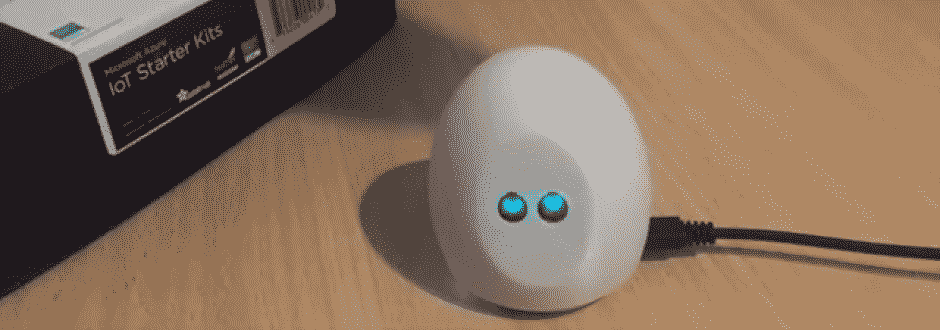NoneNone

在本教程中，我将逐步介绍我是如何构建我的健康习惯跟踪系统的，包括如何构建 IoT 设备，如何通过开发程序，使用 IBM Watson IoT Platform 上的 MQTT 与一个云应用程序进行通信。

## 构建此 IoT 解决方案需要做的准备工作

要构建这个 IoT 解决方案，您需要熟悉 Python 和 [MQTT](https://developer.ibm.com/zh/articles/iot-mqtt-why-good-for-iot/) 的基本知识。还需要熟悉如何使用 [IBM Cloud](https://cognitiveclass.ai/courses/ibm-cloud-essentials/) 仪表板。

我使用 MacBook Pro 作为开发环境，但是任何拥有标准 USB 端口、Wifi 和等效软件的 Linux 或 Windows PC 应该都适用。我使用了以下软件和硬件来构建我的健康习惯跟踪器系统。

### 硬件

*   来自 [AdaFruit Feather Huzzah IoT starter 工具包](https://www.adafruit.com/product/3032) 的 AdaFruit Feather Huzzah ESP8266。

    *   我决定使用一个 ESP8266 来构建此设备，因为它成本低、体积小（能装进较小的封箱中）、功率要求低（尤其是在使用睡眠模式时），而且内置了 wifi 连接，非常适合家中或办公室中使用的低预算个人 IoT 设备。
    *   我选择 Feather Huzzah ESP8266 是因为它有一个内置的锂聚合物电池充电器，因此我可以选择接入一块小型可充电电池让设备变得便携，只要将设备插入 USB 电源中，就可以给这块电池充电。
    *   我想要使用这个特定的开发板还因为它受到了 MicroPython 的良好支持，而且它还可以使用其他语言进行编程，其中包括 C++（使用 [Arduino IDE](https://www.arduino.cc/en/Main/Software)）、Lua（使用 [NodeMCU](http://nodemcu.com/index_en.html) 固件）或 JavaScript（使用 [Espruino](https://www.espruino.com/)）。
*   Micro-USB 数据线（包含在 starter 工具包中）
*   用于连接各个元件的插线排引脚和跳线（包含在 starter 工具包中，还需要额外的 [Female-Female 跳线](https://www.adafruit.com/product/1950)）
*   触觉开关（即按钮）（包含在 starter 工具包中）
*   压电式蜂鸣器（包含在 starter 工具包中）
*   12 像素 [Neopixel 环](https://www.adafruit.com/product/1643)
*   单色 128×64 I2C [OLED 显示屏](https://www.adafruit.com/product/938)

##### 我的健康习惯小宠物的硬件元件

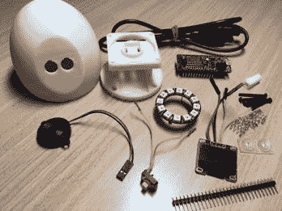

### 封箱

*   使用 3D 打印机打印这些部件。如果无法使用 3D 打印机，可以使用纸箱制作一个封箱。
*   6 个直径 8 毫米的透明橡胶家具缓冲垫（或底座），可以在当地五金店买到
*   4 个直径 2.5 毫米或更小的螺丝，这些也可以在当地五金店买到
*   4 个小弹簧（可选），可用于实现“按钮按压”操作

### 工具

*   小型飞利浦螺丝刀
*   烙铁
*   Hobby 刀具
*   镊子

### 软件

在开发时，我使用了笔记本电脑上安装的以下软件：

*   终端模拟器（例如 Mac 上的 Screen，或者 Windows 上的 TeraTerm 或 Putty）
*   Python（带 pip）
*   文本编辑器或 IDE
*   Web 浏览器（比如 Chrome 或 Firefox）
*   安装了 [IBM Eclipse Tools for IBM Cloud](https://developer.ibm.com/wasdev/downloads/#asset/tools-IBM_Eclipse_Tools_for_Bluemix) 的 Eclipse
*   [IBM Cloud CLI](https://cloud.ibm.com/docs/cli?topic=cloud-cli-ibmcloud-cli#cli)
*   [Maven](https://maven.apache.org/)

1

## 组装设备

我为本项目选择了一个 [IoT 开发工具包](https://developer.ibm.com/articles/5-popular-iot-developer-kits-help-speed-iot-development/) – [AdaFruit Feather Huzzah IoT starter 工具包](https://www.adafruit.com/product/3032)。该 starter 工具包包含跳线、插线排引脚，以及按钮和蜂鸣器元件，我还添加了一个额外的 Neopixel 环来为通知添上一些彩灯，并添加了 OLED 显示屏来照亮小宠物的眼睛。

这个开发工具包中包含的微控制器是 Feather Huzzah ESP8266。它包含板载 Wifi、4MB 闪存、一个 80MHz 处理器和一个内置的 100mA LiPo 充电器。开发板上有 9 个数字 I/O 引脚和 1 个模拟 I/O 引脚。请参阅 Feather Huzzah ESP8266 引脚输出。（来源：https://learn.adafruit.com/adafruit-feather-huzzah-esp8266/pinouts）了解这些引脚的位置。这些引脚在 3.3V 的逻辑电压上运行，支持使用 I2C 和 SPI 连接外围元件。

##### Feather Huzzah ESP8266 引脚输出。（来源：[`learn.adafruit.com/adafruit-feather-huzzah-esp8266/pinouts）`](https://learn.adafruit.com/adafruit-feather-huzzah-esp8266/pinouts）)

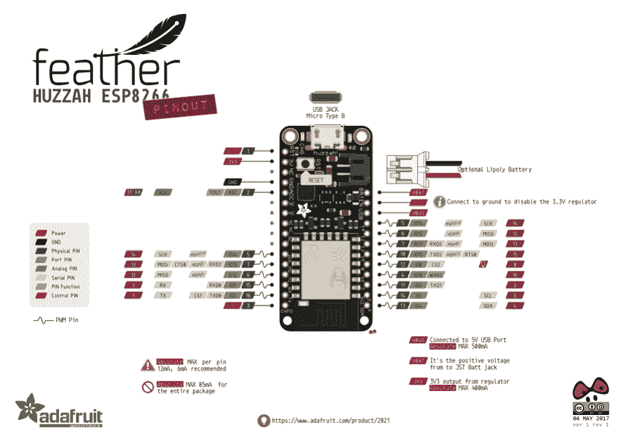

1a

### 将元件插入封箱中

按照这个视频中的步骤，将 Feather Huzzah ESP8266 和其他元件插入封箱中。

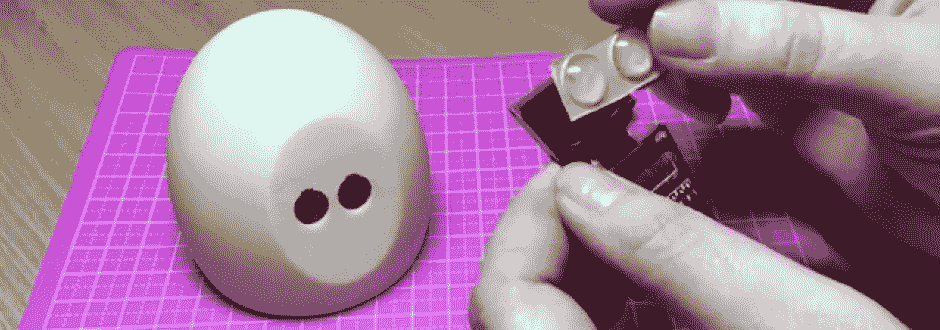NoneNone

我使用 [Meshmixer](http://www.meshmixer.com/) 为我的设备设计了一个可 3D 打印的定制封箱，并使用 ABS 打印了各个部件。我在 [Thingiverse](https://www.thingiverse.com/thing:2482597) 上发布了这些 3D 模型，如果您能使用 3D 打印机（比如通过当地的创客空间），您就能打印自己的宠物。我使用了来自当地五金店的两个直径 8 毫米的透明家具缓冲垫作为眼睛，并使用 4 个直径 2.5 毫米的螺丝将外壳固定住。可以为这些螺丝添加一些小弹簧，让按钮按压操作更加顺畅。

如果您无法使用 3D 打印机，可以将元件安装在一个小塑料容器或纸箱中，使用 hobby 刀具切割出眼睛、按钮和 USB 线的小孔，使用双面胶或热熔胶将元件安装在盒子内，类似于我为[智能门铃](https://developer.ibm.com/zh/tutorials/iot-lp101-get-started-develop-iot-home-automation/)制作封箱的方式，并在容器的盖子上切出一个小孔供 PIR 传感器使用。如果使用纸箱，可以切掉箱子的一边，将其替换为玻璃纸、纸张或薄布，以充当 Neopixel 的光线扩散器。这些元件可以安装在几乎任何中空的外壳中，那么为什么不制作一个有创意的封箱？可以使用中空的塑料玩具，使用一个 dremel 工具或 hobby 刀具来制作用于按钮、屏幕和 USB 线的小孔。

在设计原型时，我使用了来自 starter 工具包的电路试验板和跳线，让组装电路和测试代码变得很容易。但是，在 3D 打印的外壳内部，没有足够的空间来容纳常规的电路试验板。我剪掉了一些 female-female 跳线，将一些短线焊接在蜂鸣器、按钮、OLED 屏幕和 neopixel 环上，以便连接到微控制器上的引脚。我也可以使用细的实心[安装线](https://www.adafruit.com/product/1311)（比如 22 – 30 号），并将它们直接焊接到微控制器的引脚上。我还关闭了 5 个插线排引脚，将它们焊接在一起，以便连接来自每个外围元件的地线，使它们都能连接到微控制器上的单个接地引脚，我用另一组 3.3V 的插线排引脚给 OLED 屏幕和 neopixel 环供电。

尽管我的 OLED 屏幕和 neopixel 环上的电源引脚标为“5V”，但它们也可以在 3.3V 电压下正常运行。在一些屏幕和 neopixel 元件上，一些制造商会将这些引脚标为 VCC。如果您不确定，请检查您将使用的元件的规格表，并确保仅选择了兼容 3.3V 的元件。

1b

### 连接元件并组装 IoT 设备

跟随这个视频，根据电路中的元件直接连接到控制器开发板（参见“致谢”）致谢中的电路，将按钮、蜂鸣器、neopixel 环和 OLED 屏幕连接到微控制器，然后将小宠物组装到封箱中。

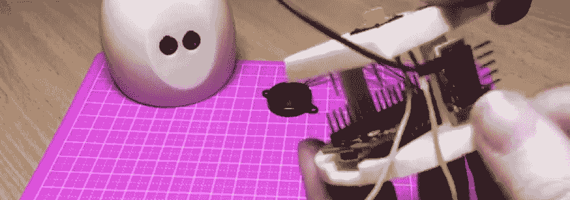

NoneNone

我已根据电路中的元件直接连接到控制器开发板（参见“致谢”）致谢中的电路，将元件连接到 Feather Huzzah ESP8266。

*   按钮连接到 GND 和 14 号引脚
*   蜂鸣器连接到 GND 和 12 号引脚
*   Neopixel 环连接到 GND、3.3V 和 2 号引脚
*   OLED 屏幕连接到 GND、3.3V 和 I2C 引脚（4 号引脚上为 SCA，5 号引脚上为 SCL）

##### 电路中的元件直接连接到控制器开发板（参见“致谢”致谢

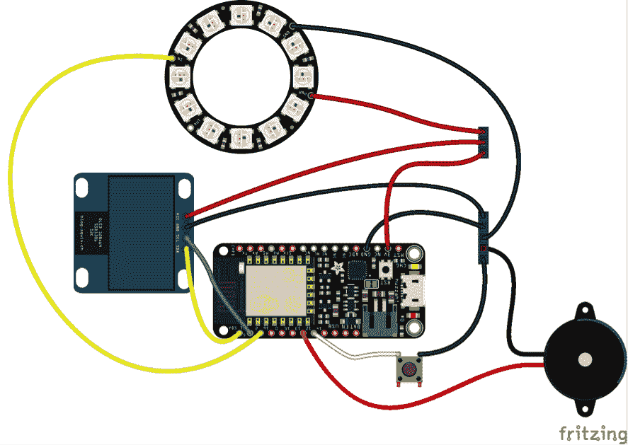

2

## 准备微控制器

我使用了 [MicroPython](http://micropython.org/) 为健康习惯小宠物开发程序。MicroPython 是一个开源的 Python 3 编译器和运行时，可以在包括 ESP8266 在内的微控制器上运行。MicroPython 实现了标准 Cpython 和核心 Python 库的一部分，以及其他一些库，比如用于 GPIO 的机器库和用于 MQTT 通信的 mqtt 库。它还实现了一个 Read, Eval, Print, Loop (REPL) 环境，该环境非常适合交互式原型设计。

我将 MicroPython 固件加载到与微控制器相连的开发板上，然后上传自定义 Python 程序来处理与微控制器相连的按钮、neopixel、蜂鸣器和屏幕。按照下面的指南准备您的设备，包括将 MicroPython 闪存到要使用的设备上，连接设备，配置 Wifi，并开发程序来使用该设备。

2a

### 将 MicroPython 闪存到设备上

观看这个视频，了解如何将 MicroPython 固件闪存到开发板上。

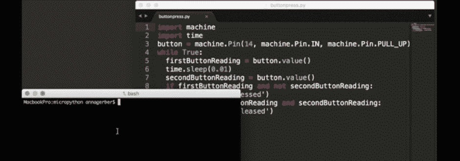

NoneNone

如果您是第一次使用 Feather Huzzah ESP8266，可能需要安装 [Silicon Labs CP210x USB 串口驱动程序](https://www.silabs.com/products/development-tools/software/usb-to-uart-bridge-vcp-drivers)，以便允许您的计算机通过 USB 与开发板进行通信。安装该驱动程序后，在使用 USB 连接到开发板时，您会看到出现了一个设备。在我的 Mac 上，此设备显示为 /dev/tty.SLAB_USBtoUART，在 Windows 机器上，您会看到一个 COM 端口（例如 COM4）。

为了将 MicroPython 固件闪存到开发板，我使用了一个基于 Python 的工具 [*esptool*](https://github.com/espressif/esptool)。可以使用 Python 的 pip 包管理器来安装该工具：

```
 pip install esptool 
```

在上传固件前完全擦除微控制器的闪存是一个好主意。从命令行，使用 erase_flash 命令运行 esptool 实用工具，将端口以参数形式提供给此命令。 例如，在 MacOS 计算机上发出此命令：

```
 esptool.py --port /dev/tty.SLAB_USBtoUART erase_flash 
```

或者在 Windows 计算机上发出此命令：

```
 esptool.py --port COM4 erase_flash 
```

您将需要下载 MicroPython。GitHub 上提供了每个 MicroPython 版本的二进制 (.bin) 文件： [`github.com/micropython/micropython/releases`](https://github.com/micropython/micropython/releases) 。下载最新的稳定的 .bin 文件，并使用 esptool 将固件文件上传到使用 write_flash 命令的开发板。此命令接受端口、波特率和闪存大小作为参数：

```
 esptool.py --port /dev/tty.SLAB_USBtoUART --baud 460800 write_flash --flash_size=detect 0 ./esp8266-20170612-v1.9.1.bin 
```

2b

### 连接设备

MicroPython 在设备上运行后，您需要通过 UART 串行端口、USB 线连接设备来访问 REPL。默认的波特率（或者，向微控制器发射信息的速率）为 115200 位每秒。使用终端模拟器连接到开发板。如果您在 Mac 上，那么可以从命令行使用 GNU 屏幕程序：

```
 screen /dev/tty.SLAB_USBtoUART 115200 
```

在 Linux 上，可以使用 screen 或 picocom；在 Windows 上，可以使用 TeraTerm 或 Putty 等终端模拟器。

连接到微控制器后，按 Enter 键来查看 REPL 提示符。您可以直接输入命令，或者按 control-e 进入粘贴模式，这样就可以粘贴完整的程序（按 control-d 可以退出粘贴模式）。

2c

### 配置 Wifi

默认情况下，ESP8266 设置为使用默认密码 micropythoN（包含大写字母 N）创建一个专用无线网络。要将您的设备连接到现有的无线网络，可以配置 main.py 文件中的设置，该文件会在设备启动后运行。 使用文本编辑器或 IDE 创建一个名为 main.py 的文件，该文件包含以下内容（更改 <essid>和 <password>，使它们与您的本地无线网络配置相匹配）：</password></essid>

```
 import network
    # disable access point mode
    ap_if=network.WLAN(network.AP_IF)
    ap_if.active(False)
    # configure connection to wireless network
    sta_if = network.WLAN(network.STA_IF)
    if not sta_if.isconnected():
      sta_if.active(True)
      sta_if.connect('<essid>', '<password>')
      while not sta_if.isconnected():
        pass 
```

2d

### 使用 MicroPython 开发程序并将它们上传到设备

健康习惯小宠物代码已发布在[我的 healthy-habits-pet GitHub 存储库](https://github.com/AnnaGerber/healthy-habits-pet)中的 micropython 目录中。这个 GitHub 存储库包含上一节的 main.py 文件和控制灯光、声音、LED 显示屏（需要额外的库）的程序，并使用 MQTT 将数据发送到 Watson IoT Platform 的程序。

[获得代码](https://github.com/AnnaGerber/healthy-habits-pet)

按照下面这个视频中的步骤，将库和程序上传到您的设备。

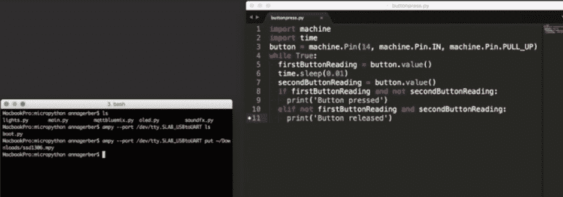NoneNone

可以使用 MicroPython REPL 逐行输入程序语句，或者上传完整的 Python 程序文件，这些文件可以读取传感器数据或控制与微控制器上引脚相连的输出设备。

要上传文件，可以从命令行使用 ampy ([`github.com/adafruit/ampy`](https://github.com/adafruit/ampy))

```
 ampy --port /dev/tty.SLAB_USBtoUART put main.py 
```

这些设置会在下次启动微控制器时生效。

以下几节将介绍 Python 程序中的一些代码。

#### OLED 屏幕

MicroPython 可以使用许多第三方库来支持专业元件。用作我的宠物设备的眼睛的 OLED 显示屏可以使用 SSD1306 库进行编程： [`github.com/adafruit/micropython-adafruit-ssd1306`](https://github.com/adafruit/micropython-adafruit-ssd1306)

要使用该库，请下载 mpy 文件（可以在 GitHub 页面上的 releases 选项卡下找到它），从命令行使用 ampy 将它上传到开发板。

```
 ampy --port /dev/tty.SLAB_USBtoUART put ssd1306.mpy 
```

我使用了来自该库的 drawPixel 函数绘制了一幅图，该图存储为字节数组（通过迭代各个数组来确定是否绘制一个像素）。healthy-habits-pet git 存储库中的 [oled.py](https://github.com/AnnaGerber/healthy-habits-pet/blob/master/micropython/oled.py) 程序包含一些示例图像，其中包括成功完成运动后用于制作眼睛动画的爱心，以及宠物在一段时间未激活时显示的昏昏欲睡的眼睛。

#### 按钮

要从连接到 14 号引脚的按钮读取数据，可以使用 Pin 类将该引脚设置为输入模式，然后将按钮值读取到一个变量中：

```
 from machine import Pin
    button = Pin(14, Pin.IN, Pin.PULL_UP)
    pressed = button.value() 
```

要检测按压操作，可以轮询按钮状态（比如在一个循环中）。healthy-habits-pet git 存储库中的 [mqttbluemix.py](https://github.com/AnnaGerber/healthy-habits-pet/blob/master/micropython/mqttbluemix.py) 程序给出了响应按钮按压的示例（通过发布 MQTT 事件）。

#### 压电式蜂鸣器

压电式蜂鸣器可以使用脉冲宽度调制 ([PWM](https://www.arduino.cc/en/Tutorial/PWM)) 输出来生成不同频率的音调。要让压电式蜂鸣器以 440 的频率鸣叫（中央 C 上方的 A 音符），可以在 12 号引脚上的输出模式中创建一个 Pin 类实例，并使用 pin 对象创建一个 PWM 类实例来控制 PWM 频率和工作周期。最后，取消初始化该对象来停止鸣叫：

```
 from machine import Pin, PWM
    import time
    piezo = PWM(Pin(12, Pin.OUT), freq=440, duty=512)
    piezo.freq(440)
    time.sleep(0.5)
    piezo.deinit() 
```

也可以直接向 pin 写入命令来控制压电式蜂鸣器。healthy-habits-pet git 存储库中的 [soundfx.py](https://github.com/AnnaGerber/healthy-habits-pet/blob/master/micropython/soundfx.py) 程序包含的示例使用了数学函数来控制交替写入的高低信号之间的延迟，以生成有趣的声音（手动创建一个类似 PWM 的信号）。

```
 def soundFX(amplitude=1000.0, period=1000.0, repeat=100):
      for i in range(1,repeat):
        uDelay = math.floor(1.5 + amplitude + amplitude * math.sin(utime.ticks_ms() / period))
        p.value(1)
        utime.sleep_us(uDelay)
        p.value(0)
        utime.sleep_us(uDelay) 
```

请参阅 healthy-habits-pet git 存储库中的 [soundfx.py](https://github.com/AnnaGerber/healthy-habits-pet/blob/master/micropython/soundfx.py) 程序来查看使用此函数的示例。

#### Neopixel（LED 灯）

Neopixel 类已内置到 MicroPython 中。您可以借助该类，使用一个由红、绿和蓝色值（分别介于 0 到 255 之间）构成的元组，单独将灯环中的像素设置为不同颜色。例如，要将与 2 号引脚相连的环中的所有像素设置为红色，可以迭代这些像素，将它们设置为 (255, 0, 0)。最后使用 write 方法来更新 LED 灯。

```
from machine import Pin
from neopixel import NeoPixel
np = NeoPixel(Pin(2,  Pin.OUT), 12)
for i in range(np.n):
    np[i] = (255,0,0)
np.write() 
```

可以在 healthy-habits-pet git 存储库中的 [lights.py](https://github.com/AnnaGerber/healthy-habits-pet/blob/master/micropython/lights.py) 程序中找到使用 Neopixel 类的更多示例。

3

## 将设备连接到 IBM Watson IoT Platform

该设备使用 MQTT 将习惯事件（已在按下按钮时记录）发布到 IBM Watson IoT Platform，事件存储在该平台上的一个 Cloudant NoSQL 数据库中。一个云应用程序会读取数据，然后向设备发送更新事件来触发小宠物执行提醒操作（使用灯光和声音）。我使用 [MQTT](https://developer.ibm.com/zh/articles/iot-mqtt-why-good-for-iot/) 在设备与云应用程序之间建立双向通信，因为它是一种非常轻量型的协议，而且受到 MicroPython 中的内置 mqtt 库的支持。（可以在[我的网络指南](https://developer.ibm.com/zh/articles/iot-lp101-connectivity-network-protocols/)中进一步了解包括 MQTT 在内的网络协议。）MQTT 需要一个代理，所以我将使用一个在 IBM Watson IoT Platform 上运行的代理。健康习惯跟踪器系统架构显示了我的 IoT 应用程序的架构。

##### 健康习惯跟踪器系统架构

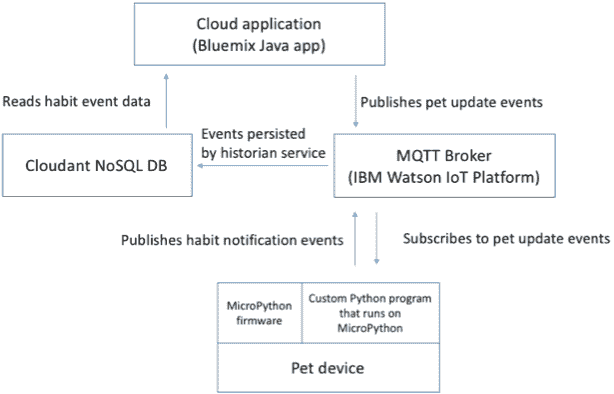

要通过设置将 MQTT 用于 IBM Watson IoT Platform，请完成以下步骤：

*   创建并配置一个 IoT 服务和一个 Cloudant DB 服务 注册一种新的设备类型（在我们的例子中为 ESP8266）
*   注册设备

跟随下面的视频在 IBM Cloud 中设置 Cloudant 数据库和 IoT Platform 服务，然后注册该设备，以便它能通过使用 MQTT 发送和接收数据。以下各节将详细介绍如何完成这些步骤。

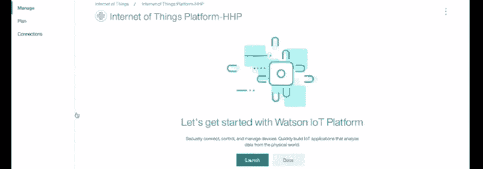NoneNone

3a

### 创建并配置一个 IoT Platform 服务

登录到 IBM Cloud。

要配置一个新的 IoT Platform 服务，可以从 IBM Cloud 仪表板中打开目录，并从屏幕右侧边栏中选择 Internet of Things，然后选择 Internet of Things Platform。输入服务名称，选择地区和计划，然后按 Create 按钮创建该服务。

3b

### 创建和配置一个 Cloudant NoSQL DB 服务

从 IBM Cloud 目录的边栏中选择 Data & Analytics，然后选择 Cloudant NoSQL DB，创建 Cloudant DB。为 Cloudant 服务输入一个名称，选择地区和计划，然后按 Create 按钮。

为了持久保存设备数据，我将 Cloudant DB 设置为历史服务。参阅关于“[连接和配置历史服务](https://cloud.ibm.com/docs/services/IoT?topic=iot-platform-getting-started#cloudant_main)”的 IBM Cloud 文档。双击 IBM Cloud 仪表板中显示的 Internet of Things Platform 服务，然后单击 **Launch** 按钮查看服务细节。在 IoT Platform 仪表板的中，从边栏中选择 **Extensions**，按下 Extensions 屏幕上的 **Historical Data Storage** 项下的 **Setup** 按钮。您需要启用弹窗。配置历史服务的方式如下：选择一个 bucket、时区和数据库名称，然后单击 **Done** 完成服务的配置。

配置历史服务后，单击出现的弹窗中的 **Confirm**。

3c

### 注册一个设备类型并注册设备

要注册设备类型 (ESP8266) 和我们的健康习惯小宠物，可以执行“[如何在 IBM Watson IoT Platform 中注册设备](https://developer.ibm.com/recipes/tutorials/how-to-register-devices-in-ibm-iot-foundation/)” recipe 中的步骤。此外，请参阅关于“[连接设备](https://cloud.ibm.com/docs/services/IoT?topic=iot-platform-getting-started#iotplatform_task)”的 IBM Cloud 文档。

如果我想使用多个健康习惯小宠物，例如在办公桌上放一个设备来提醒我停下来运动一下，在厨房放另一个设备来记录我何时记得吃维生素。我需要重复最后一步来注册每个设备。然后，云应用程序可以根据设备 ID 或设备元数据来区分这些设备，或者我可以创建多种设备类型，而不是一个通用的 ESP8266 设备类型；例如，我可以有一个 vitamin-tracking-pet 类型和一个 exercise-tracking-pet 类型。

3d

### 在 MicroPython 程序中配置连接

注册设备后，您需要使用以下信息（在注册设备时从最后一个屏幕复制）来配置要在设备上运行的 [mqttbluemix.py](https://github.com/AnnaGerber/healthy-habits-pet/blob/master/micropython/mqttbluemix.py) MicroPython 程序中的连接：

*   组织 ID（6 字符标识符）
*   设备类型（在我的例子中为 ESP8266）
*   特定设备的设备 ID（例如我使用了 pet1）
*   身份验证令牌

您应该使用 TLS 安全地连接到 MQTT 代理。要建立从 MicroPython 到 MQTT 代理的安全连接，可以在初始化 MQTTClient 时将 ssl 参数设置为 True，并将端口设置为 8883。将下面的 <orgid>值更改为在设置 IoT 服务时创建的 6 字符标识符。 <device_type>应是您注册的类型 (ESP8266)， <device_id>将是您注册的设备的 ID。将 <token>更改为您注册设备时设置的身份验证令牌。</token></device_id></device_type></orgid>

```
server = "<orgid>.messaging.internetofthings.ibmcloud.com"
clientId = "d:<orgid>:<device_type>:<device_id>"
client = MQTTClient(clientId, server, port = 8883, ssl = True,
                user="use-token-auth", password=<token>) 
```

根据约定，应用程序的 MQTT 主题应采用此格式：

`iot-2/type/<device type>/id/<device id>/evt/<event type>/fmt/<format type>`

对于设备，MQTT 主题应采用此格式：

`iot-2/evt/<event type>/fmt/<format type>`

对于命令，约定格式为：

`iot-2/cmd/<command type>/fmt/<format type>`

因此，只要按下按钮，小宠物就会在 *iot-2/evt/habit/fmt/json* 主题上发布信息，以注册所跟踪的习惯的成功完成情况。它会订阅 *iot-2/cmd/update-tracker/fmt/json* 主题，以便从云应用程序接收更新命令，这些命令会更新将在小宠物上显示的状态（显示在小宠物的眼睛中）以及用于（使用 LED 灯和蜂鸣器）触发提醒的状态。

要发布一个事件，请使用 client.publish 方法：

```
client.publish(b"iot-2/evt/habit/fmt/json", b"{\"responded\":\"true\"}") 
```

参见 IBM Watson IoT Platform 仪表板上的小宠物设备细节了解我们的健康习惯小宠物的细节，包括最新事件。

##### IBM Watson IoT Platform 仪表板上的小宠物设备细节

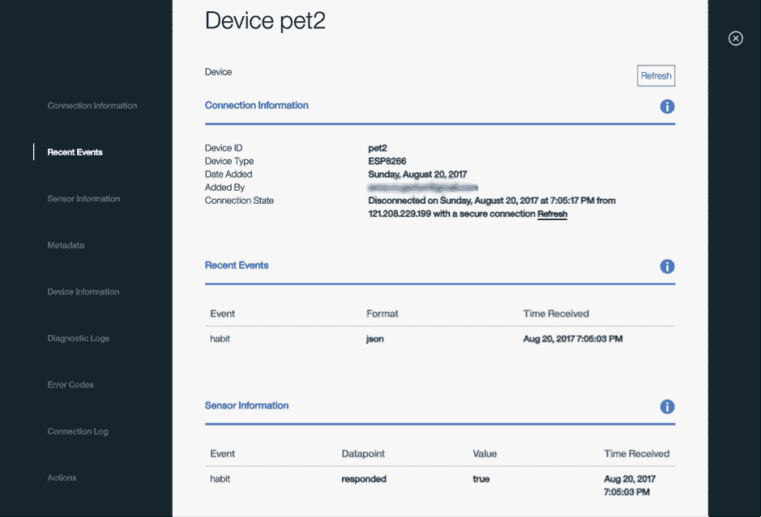

设备发布的最新事件是通过 IoT 仪表板显示的，所以可以使用此仪表板验证消息已从设备发出。另外，可以查看连接日志或诊断日志来排除任何问题。设备事件还会存储在您设置的 Cloudant 数据库中，如 Cloudant DB 中存储的示例设备数据所示。

##### Cloudant DB 中存储的示例设备数据

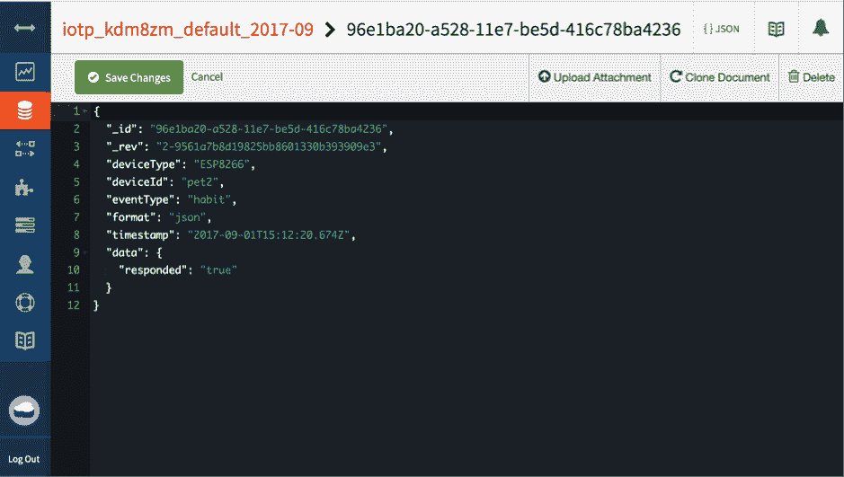

3e

### 连接 IBM Cloud 服务

完成部署过程后，您可以从 IBM Cloud Foundry Apps 页面 查看和管理该应用程序（请确保在仪表板右上角选择了您将该应用程序部署到的地区，我的地区为 US South）。双击应用程序名称来查看部署的应用程序的细节。

##### 部署的应用程序的细节

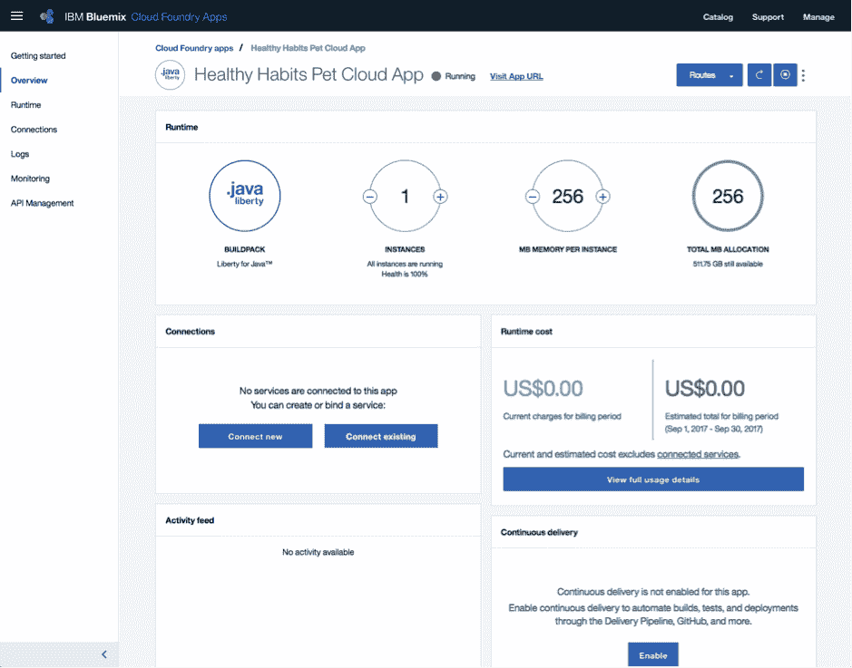

要使用之前设置的 Cloudant DB 和 MQTT 服务，需要将这些服务连接到该应用程序。按照以下步骤将 Cloudant DB 连接到该应用程序：

1.  在 Cloud Foundry Apps 页面上双击该应用程序以查看应用程序细节，然后单击 **Connections** 下的 **Connect existing**。
2.  选择之前创建的 Cloudant NoSQL DB 服务。
3.  系统会提示您重新载入（并重新启动）该应用程序。IBM Cloud 将使用 [VCAP_SERVICES](https://cloud.ibm.com/docs/services/watson?topic=watson-vcapServices#vcapServices) 环境变量向该应用程序提供数据库凭证。

按照相同步骤将该应用程序与 IoT Platform 服务相连。与两个服务都建立连接后，从左侧边栏中选择 **Connections** 时会看到它们。

##### 连接的服务

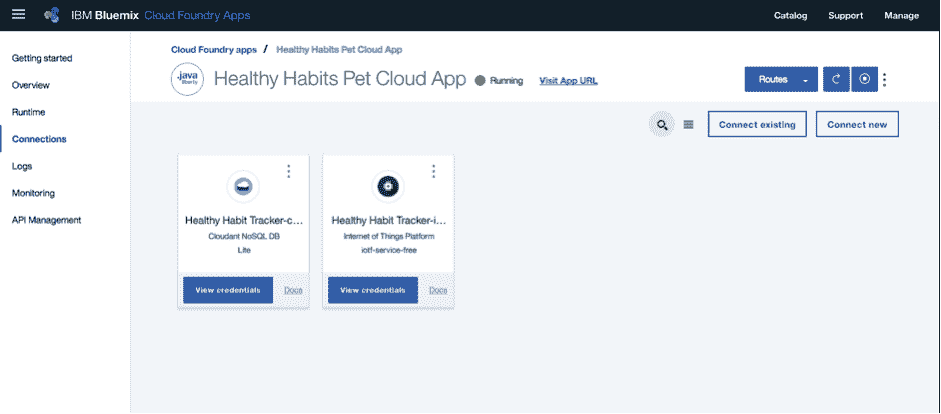

VCAP_SERVICES 环境变量仅在应用程序在 IBM Cloud 上运行时可用。如果您想在本地运行该应用程序时连接这些服务，可以通过将凭证存储在一个属性文件中，更新本地代码来执行这些服务，例如：

*   在 IBM Cloud 仪表板中，转到 **Connections -> Cloudant -> View Credentials**。
*   编辑文件 `src/main/resources/cloudant.properties`。将凭证中的 url 字段复制到属性文件中的 cloudant_url 字段。

4

## 运行云应用程序

云应用程序是一个 Java Cloud Foundry 应用程序。为了开发云应用程序，我使用了 Eclipse。该应用程序的源代码已发布在 [healthy-habits-pet GitHub 存储库](https://github.com/AnnaGerber/healthy-habits-pet)中，在 cloud-app 目录下。

观看视频，了解该设备如何与云应用程序进行交互，以及如何使用 Maven 在本地运行云应用程序，如何使用命令行在 IBM Cloud 上运行该应用程序，或者如何使用 Eclipse 在 IBM Cloud 上运行该应用程序。

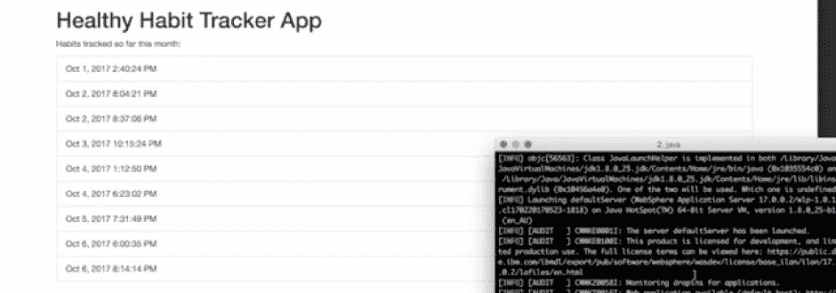NoneNone

4a

### 在本地（从命令行）使用 Maven 运行应用程序

可以在本地运行该应用程序。从 GitHub 克隆该应用程序后，使用 Maven 下载依赖项并构建 .war 文件：

```
mvn clean install 
```

然后，使用 liberty:run-server 命令在本地运行该应用程序。

```
mvn install liberty:run-server 
```

可以通过以下 URL 访问该应用程序：[`localhost:9080/HealthyHabitsBackend`](http://localhost:9080/HealthyHabitsBackend)

4b

### 在 IBM Cloud 上（从命令行）运行该应用程序

要在 IBM Cloud 上运行该应用程序，可以使用 IBM Cloud CLI 工具选择要部署到的地区的 IBM Cloud API URL（例如，US South 的 URL 为 [`api.ng.bluemix.net)`](https://api.ng.bluemix.net))：

```
 bluemix api https://api.ng.bluemix.net 
```

然后，使用您的 IBM ID 登录到 IBM Cloud：

```
 bluemix login -u <your username> -o <your Bluemix org name>-s dev 
```

如果您使用了联合 ID，可以使用单点登录选项：

```
 bluemix login -o <your org> -s dev –sso 
```

manifest.yml 包含该应用程序的配置，包括名称和位置，如何为每个实例分配内存，以及要创建多少个实例。可以编辑这些值来自定义如何部署您的应用程序。请参阅关于“[部署应用程序](https://cloud.ibm.com/docs/apps?topic=creating-apps-deploying-apps&locale=zh-CN)”的 IBM Cloud 文档，了解应用程序清单的细节。使用 IBM Cloud CLI 将该应用程序推送到 IBM Cloud，这会创建一个新的 Cloud Foundry 应用程序。

```
 bluemix app push "Healthy Habits Pet Backend" 
```

4c

### 在 IBM Cloud 上运行该应用程序（使用 Eclipse）

如果您喜欢的话，可以从 Eclipse 而不是从命令行部署该应用程序。[IBM Eclipse Tools for IBM Cloud](https://developer.ibm.com/wasdev/downloads/#asset/tools-IBM_Eclipse_Tools_for_Bluemix) 提供了远程调试和增量更新等特性。

通过从菜单中选择 **File -> Import -> Maven**，然后选择 **Existing Maven Projects**，将应用程序导入 Eclipse 中。

您需要创建一个 IBM Cloud 服务器定义：

*   从 Servers 视图（要查看此视图，请转到 **Window -> Show View -> Other -> Servers**），添加一个新服务器。
*   选择 **IBM -> IBM Cloud**，按照向导步骤进行操作。

然后，您可以在 IBM Cloud 上运行您的应用程序：

*   右键单击该应用程序，并选择 **Run As -> Run on Server**。
*   搜索并选择您创建的 IBM Cloud 服务器，并单击 Finish。
*   向导将引导您登录到 IBM Cloud 并部署该应用程序。

## 结束语和应用程序扩展

我逐步介绍了如何设计我的习惯跟踪设备，将它连接到 IBM Watson IoT Platform，以便在 NoSQL 数据库和云应用程序之间发送和接收数据。我介绍了如何在 IBM Cloud 上配置一个 Cloudant NoSQL DB 服务和一个 IoT Platform 服务，这提供了一个 MQTT 代理来向习惯跟踪 IoT 设备发送数据并从该设备接收数据，还提供了一个数据历史服务来自动将 MQTT 消息持久保存到 Cloudant DB。我还逐步介绍了如何将这些服务部署并连接到用 Java 开发的云应用程序。

我概述了如何使用 MicroPython 开发习惯跟踪 IoT 设备软件，还介绍了如何使用 Feather Huzzah ESP8266 IoT 开发工具包构建该设备。使用开发工具包不但简化了设备的开发，还提供了开发基本设备行为所需的电子元件（按钮用于触发 MQTT 事件的发送，压电式蜂鸣器用于通知）。使用该工具包节省了获取各个元件的时间，消除了元件是否与微控制器兼容和它们是否适合使用 MicroPython 的问题。我还介绍了如何添加 OLED 屏幕和 Neopixel 环来扩展开发工具包的功能，这些元件都受 MicroPython 库的支持。

本教程中特意将跟踪器的功能降至最少，仅专注于对按钮操作的响应，以及如何使用 LED 灯、压电式蜂鸣器和屏幕发送通知，但是，您也可以通过以下这些方法扩展此应用程序：

*   **电源管理**：这使小宠物能依靠电池电源高效运行，要实现电源管理，可以将 GPIO 的 16 号引脚连接到 Feather Huzzah ESP8266 上的 RST 引脚，然后使用 MicroPython 机器库的实时时钟扩展设备程序来添加[深度睡眠支持](https://docs.micropython.org/en/latest/esp8266/esp8266/quickref.html#deep-sleep-mode)，让小宠物能按设定的时长定期睡眠来节省电源，然后在醒来时重新建立连接。

*   **分析**：对于本教程，云应用程序在决定何时发送提醒方面不是很聪明。使用 IBM Watson IoT Platform 来可视化从设备收集的数据并执行分析，这可以改进该应用程序，从而确定最佳次数，基于过去执行习惯操作的频率来调节提醒频率，并通过 [Workload Scheduler](https://cloud.ibm.com/docs/services/WorkloadScheduler?topic=containers-gettingstarted#gettingstarted) 服务使用这些洞察来计划定期提醒。

*   **自动设备注册**：为了保持简单，我使用了 IBM Watson IoT Platform 仪表板来手动注册我的习惯跟踪小宠物设备。为了扩展该应用程序来支持许多用户拥有的许多设备，需要以编程方式注册这些小宠物设备。实现此目的的一种方法是，用户通过一个自定义 Web 应用程序注册设备或通过 REST API 批量注册设备。您可以进一步了解如何[使用 REST 批量注册设备](https://developer.ibm.com/recipes/tutorials/bulk-register-devices-to-the-ibm-watson-iot-platform-using-rest/)或如何使用 [Java 客户端库注册设备](https://developer.ibm.com/recipes/tutorials/multiple-iot-device-simulation-using-java-client-library/)。这个使用 Java 客户端库的 recipe 还介绍了如何模拟多个设备，以获得连续的事件流，以供开发和测试时使用。

*   **移动应用程序**：另一项改进是升级为基于 ESP32 的微控制器（ESP8266 的换代产品)，通过一个运行自定义移动应用程序的手机，使用低功耗蓝牙 (BLE) 来连接 IoT 设备，该应用程序将负责设备注册并允许协调多个设备。其他许多个人健康和健身相关设备已采用了这种方法，包括健身/活动跟踪器和无线称重设备。要跟踪多个用户的多个设备，还可以在以后扩展云应用程序，以便管理用户帐户并将设备与每个用户相关联。

*   **网关设备**：扩展此应用程序的另一个选项是在架构中添加网关设备。此解决方案适合更大规模或数据密集型的应用程序，例如在[互联城市](https://developer.ibm.com/zh/articles/iot-lp201-iot-connected-cities/)中，或者连接数千个设备的社区级应用程序中，或者其中的设备包含大量生物计量或活动相关传感器的健康应用中，在这些应用中会应用边缘计算技术来过滤和预处理设备收集的大量数据。

### 致谢

本教程中，我使用了来自以下 Fritzing 元件的电路图来创建自己的电路图：

*   AdaFruit 库：

    [`github.com/adafruit/Fritzing-Library/`](https://github.com/adafruit/Fritzing-Library/)

*   OLED Frtizing 元件：

    [`blog.squix.org/`](https://blog.squix.org/)

本文翻译自：[Build your skills in IoT development by developing a Healthy Habits Tracker](https://developer.ibm.com/tutorials/iot-lp201-build-skills-iot-health-app/)（2018-01-03）