# 构建闭环全栈认知 IoT 应用程序时吸取的经验教训

> 原文：[`developer.ibm.com/zh/tutorials/iot-lessons-learned-02/`](https://developer.ibm.com/zh/tutorials/iot-lessons-learned-02/)

几个月前，我加入了 IBM 新组建的一支团队 — 新兴技术和领先创新团队。该团队当时正在开发使用新技术（其中最值得注意的就是 Linux 容器和 Raspberry Pi 计算机）的新功能，为处理传感器数据提供边缘计算能力。我在容器和 Raspberry Pi 设备方面毫无经验。于是，我非常热切地参与到早期迭代中，从中迅速学到了这些技术的许多基础知识。

在掌握了这些基础知识后，我开始推测我们可能会构建的应用程序类型。该团队已经构建了概念验证 (PoC)，即 BlueHorizon。BlueHorizon 可收集气象数据、无线电信号和网络连接信息，并在显示附近各种参与设备和任何飞行器的交互式地图中提供这些数据（请参阅 BlueHorizon 地图和用户界面 (http://bluehorizon.network/map)）。

BlueHorizon 地图和用户界面

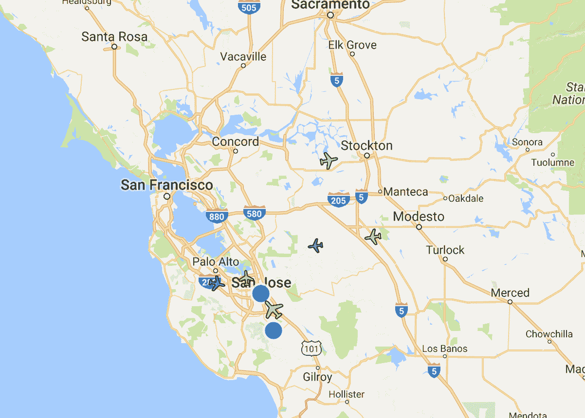

我想要构建另一个 PoC。

在 IBM 产品服务组合中，该团队尚未利用 Watson 认知服务这一块，因此，我开始搜索潜在的传感器数据收集空间，以便包含认知组件。鉴于项目的前提是将传感器数据转变为信息（例如，将飞行器 ADS-B 广播频率信号转变为结构化飞行数据），“在边缘地带”使用认知算法对于 PoC 产品服务组合而言既是一项挑战，也是一种贡献。

本文介绍了我构建认知 IoT 解决方案过程中所吸取的经验教训。我得到的第一个经验教训就是应限制对任何认知系统的期望，并需要为特定场景和用例进行相应的训练。第二个经验教训就是在构建认知系统时了解相关环境非常重要。第三个经验教训是：你一无所知的内容至少与你实际掌握的内容同等重要。概括地说，认知解决方案就是各种实验，在这些实验中，用户既是实验对象，也是真实情况的仲裁者，因此也会判定实验成功与否。

## 电脑高手必须学会“破旧立新”

这部分故事介绍了我的身份，以及我在自己的人生中是如何走到这一步的。简而言之，我一辈子沉迷于计算机技术，也是业余的医疗保健爱好者，对各种技术都有所涉猎。在这些举措中，反复出现的一个主题就是我希望一切都变得更简单，让我和我的家人更愉快。具体地说，我希望利用技术来重复自动执行各种任务。随着年龄的增长，希望不再为各种鸡毛蒜皮的小事而困扰的愿望越来越强烈，如今，我认识到自己在未来几年里（甚至是现在）可能会需要获得他人的帮助。

我还非常喜欢研究视频 — 从最初因分析铁路轨道接触到实时视频处理开始，如今我已对无线监视和家庭影院异常痴迷。我们家住在硅谷郊区，靠近加利福尼亚州圣何塞市西南角新阿尔马登的历史悠久的汞矿区村庄。我们的生活主要围绕着狗（和我们的孩子）在转，我在几年内已经安装了多个无线监视摄像头，这样在狗突然乱叫时，就可以回答我妻子提出的“*外面发生了什么？*”这样的问题。从最初只在狗屋里安装了一个摄像头，逐渐发展为 21 个摄像头，用于观察生活中的方方面面，从狗到厨房一个不落。通过各种简单的技巧和购买 iOS 应用程序，现在我能够随时查看所有摄像头（请参阅连接我的所有视频摄像头的 Web 界面），而不必从沙发上起身！

##### 连接我的所有视频摄像头的 Web 界面

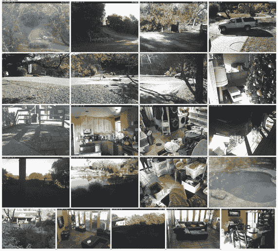

但这么多摄像头也在某种程度上让我不堪重负。每个摄像头都会以电子邮件附件形式发送一段 5 秒钟的视频，其中包含每个运动检测事件；我每天会收到超过 1000 封电子邮件。即使是直接删除电子邮件而根本不检查视频，也几乎让我招架不住。为了解决这个问题，我起初尝试降低摄像头的运动检测算法的灵敏度和缩小边界框。通过明智的实验，在发出大量咒骂之后，我终于能够将收到的电子邮件数量压缩到可控范围内，但还是会收到许多电子邮件。我采取的第二项措施就是消灭个人电子邮件。通过电子邮件代理汇总小短片，并将其作为每日视频发布至我的 Plex 家庭影院（请参阅用于播放每日影片的 Plex 用户界面）。这样一来，我便能够通过电视机、智能手机或笔记本电脑来查看每天的画面剪辑（包括高达 32 倍速回放），这是一大进步。

##### 用于播放每日影片的 Plex 用户界面

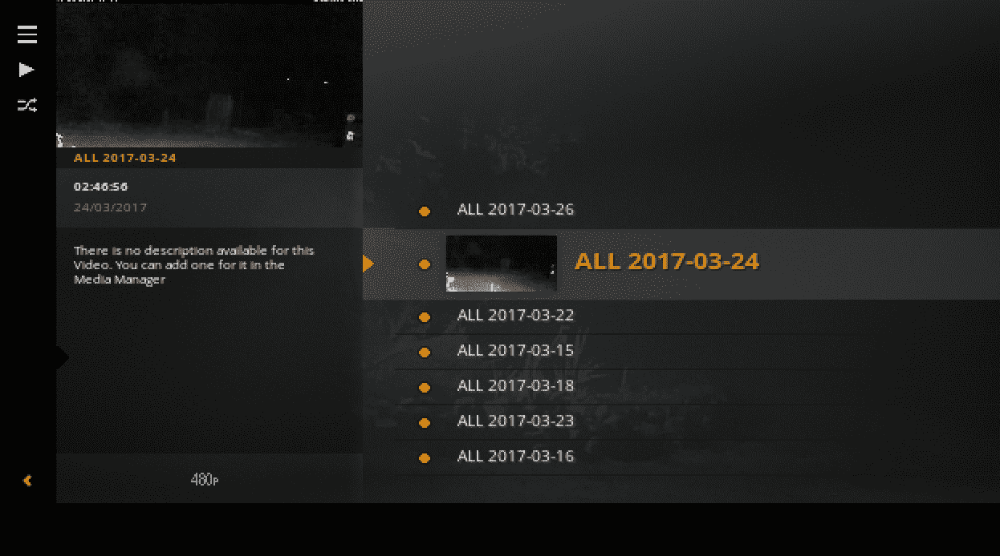

但我仍未感到满足。该解决方案仍需人类介入（即我的介入），在每天的视频中查找值得注意的事物。每个视频很容易就超过 30 分钟（360 起事件）。坦白说，无法真正以超过 4 倍速来回放视频，这需要占用我长达 10 分钟的宝贵时间。

当我疲惫不堪，躺在沙发上休息时，我看到了 IBM Watson 的广告。虽然记不清具体细节，但它确实让我想起了之前我在图像处理方面取得的成就，我想知道 Watson Visual Recognition 服务能否自动处理我的视频，仅在发生异常状况时才通知我。当然，随后我想起了家里养的好多只狗（还有我们的四个小孩），我想，不寻常的状况对于我们而言几乎就是家常便饭。但是我的父母独自居住在伊利诺斯州芝加哥市的一幢大房子里，离我家有几千英里远，身边*没有*小孩，也*没有*狗。

也许我可以找到一个用例，适用于那些仍然留守在自己家中、与子女相距甚远的父母。灵感、辛苦的汗水和强烈的愿望由此交织在一起。我父亲很早就使用了 Amazon Echo（带 Alexa）设备，并对它的功能着迷。我想，可以观察他们日常行为的设备，应该也可以作为进行监视和保持联系的一种手段。

## 居家养老 – 融合新兴技术

我开始着手确定一个新项目，我把它称之为“居家养老”(Age-at-Home)。在 PoC 项目中，我将使用 Linux Docker 容器、Raspberry Pi 设备、IBM Watson 服务和 IBM Cloud 服务，帮助老年人实现在自己家里“[就地养老](https://en.wikipedia.org/wiki/Aging_in_place)”。我另外还进行了一些研究，发现了 IBM 在意大利博尔扎诺市开展的一个研究项目，它使用无源二氧化碳 (CO2) 传感器来跟踪老年人在其居所中的行踪和活动。

通过阅读[这篇 IBM 物联网博客文章](https://www.ibm.com/blogs/internet-of-things/iot-oap-new-technology-ageing-population/)了解更多信息。或者观看以下视频：”[针对老年人的解决方案](https://www.youtube.com/watch?v=kDvW8R4BL0I)”。

我还发现了其他一些研究，它们使用个人仪器（例如，让人们佩戴蓝牙手表或吊坠）以及超出 CO2 检测范围的环境检测仪器，包括与橱柜、水槽、冰箱、厕所和其他设备连接的传感器。我原先在处理老年人和平板电脑事宜上积累的经验（包括与检测具体内容相关的成本）告诉我，无源传感更便宜，也更可靠。（不要问我有多少平板电脑不幸掉落在厕所里）。

我最初的设想很宏大，但博尔扎诺市的实验表明，监控行踪和活动富有价值。因此，复制这项传感功能和添加简单的响应方法足以表明这一项目“首战告捷”。因此，我将最小可行产品 (MVP) 定义为：当老年人在特定时间段（例如，比正常高 2 个标准差）内未起床（即，出现在厨房）时发送通知。请参阅 Age-at-Home 应用程序的 MVP 架构。

##### Age-at-Home 应用程序的 MVP 架构

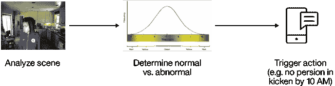

为了构建最小可行产品，我需要寻找一种方法来检测某个人是否出现，最好是某个特定的人，并且至少还需要寻找一种方法来确保能够分辨出人与动物（如宠物狗）。原先使用运动检测视频摄像头的经验为我提供了一个不错的机会，让我既能够使用 IBM Watson Visual Recognition 服务，还可以凸显两个重要方面：这种分类的延迟和分类图像的隐私性。此外，图像分类研究领域的最新发展也为在低成本设备上进行图像分类提供了方法和机会。

初始配置相对简单易懂。在我调查了适合连接到 Raspberry Pi 计算机的摄像头选项后，我发现用于 Linux 的 [*Motion* 软件包](https://github.com/Motion-Project/motion)似乎功能强大，它既支持 Raspberry Pi，也支持用于 Playstation3 的便宜的 USB 摄像头。该软件的安装很简单，只需为 [Motion 软件包](http://github.com/kfei/dockmotion) (github.com/kfei/dockmotion) 建立一个 Linux 容器定义分支，并将该[Linux 容器](https://resin.io/) (resin.io) 部署到 Raspberry Pi 即可。当某些活动（例如，检测到运动事件并捕获到图像）发生时，Motion 软件包会调用指定的 Linux 可执行文件，并提供相应的活动数据。以 JPEG 图像编码的数据与软件定义的无线电提供的频率信号数据相似，可因“边缘”分析而获益。但我仍需要确定 Raspberry Pi 上可用的分析类型。

其他调查表明，Raspberry Pi 支持许多 Linux 图像分析软件包（例如，imagemagick、ffmpeg 和其他软件包）。面部检测示例（例如，“魔镜”）同样也在本机运行。最后，我还发现了一些有关将深度学习神经网络（即，[SqueezeNet](https://arxiv.org/abs/1602.07360)）部署到 Pi 的研究。此外，Raspberry Pi 中使用的 ARM 处理器设计也被 nVidia 用于其 Tegra 平台中，尤其是 TX1；因此，高级 GPU 功能在不远的将来同样也可能用于“边缘地带”。请参阅 Age-at-Home 应用程序的 MVP 架构图，了解 Age-At-Home 应用程序的 MVP 的所有组件的架构图。

##### Age-at-Home 应用程序的 MVP 架构图

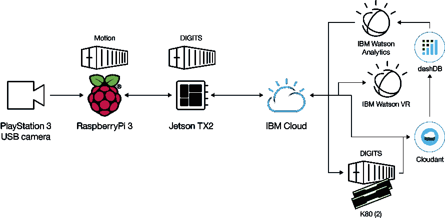

虽然边缘分析最初不包含图像分类，但当前活动统计信息的计算和生成的条件分析可在本地执行，然后使用电子消息传递提供所需的通知。在所有检测到的实体之间，将在云端基于整个事件历史记录来计算汇总的统计信息。即，每年 53 周、每周 7 天、每天 96 个时间段（15 分钟），总计超过 330 个检测到的不同实体，例如，人、狗和其他事物。生成的*模型*将通过 Raspberry Pi 下载，用于将当前活动与历史活动进行比较，并在适当情况下激活通知。

1

## 认知 IoT 应用程序必须是学习系统

现在，您可能仍在等待那些经验教训，以下就是经验教训 1：认知 IoT 应用程序必须是学习系统。

我所犯的第一个错误就是，认为厨房中是否有人是发送通知时机的可行决定因素。除了检测到人以外，还需要考量其他传感输入方面的因素，例如，开灯和摄像头传感器检测到的信息过多而导致无法处理。虽然人员检测可能是初始假设，但应将其作为假设来处理，应用程序应准备好根据替代信号采取行动。

无线电发展早期就是一个很好的例子，当时，多名工程师被要求调整频率、天线和其他电子组件以获取清晰的无线电信号。工程师也是其中的组成部分，作为将信号解释为数据的接收者和传输者。记录人员或抄录人员则负责将数据作为条理清楚的消息来传达。当然还有为整个流程提供支持的基础架构。只有这样专业化的团队才能充分利用当时才刚出现的无线电技术。但那只是当时的情况。现如今，我们的车载无线电、移动设备和许多其他设备都具有自动调谐功能。我们必须预见到，在我们的学习系统提供的信号处理方面同样也会实现这样的进步。

这种类型的自动信号检测和鉴别在学术论文中被称为“主动学习”。这些流程使用一种“智库”（人类或非人类），就所监督学习算法生成的信号质量给予反馈。例如，在我的 Age-at-Home 环境中，为任何图像预测的分类通常为从最高到最低依次排列的序列。这些预测通常被称为“排名前 n”，例如，排名前 5。等级最高的实体通常被称为排名第 1，它被视为“正确的”分类。而排名前二或前三实体的等级值（或“评分”）可能非常接近，这些图像也可能成为智库的候选审查对象。随后，此智库会提供裁决，并且此示例会成为下一次训练迭代中该类的一部分。

通过使用 resin.io ([`www.resin.io)`](http://www.resin.io)) ，我能够将一个 Linux Docker 容器部署到运行开源软件包 ([motion](http://lavrsen.dk/foswiki/bin/view/Motion/WebHome)) 的 Raspberry Pi 中，用于捕获图像。通过添加简单的 Linux shell 脚本，我可以将图像发送至 Watson Visual Recognition 服务，并接收分类评分。Watson 返回的图像分类和评分的定义应考量所使用的分类器。*默认*分类器会指示各种实体和活动，从“火炉”到各种“动静”。我扩展了脚本，以便将来自 Watson Visual Recognition 服务的 JSON 结果存储到非关系型存储库 [IBM Cloudant](https://www.ibm.com/cloud/cloudant)中，该存储库可在本机理解 JSON 数据（请参阅生成的 JSON 示例的选定详细信息）。

##### 生成的 JSON 示例的选定详细信息

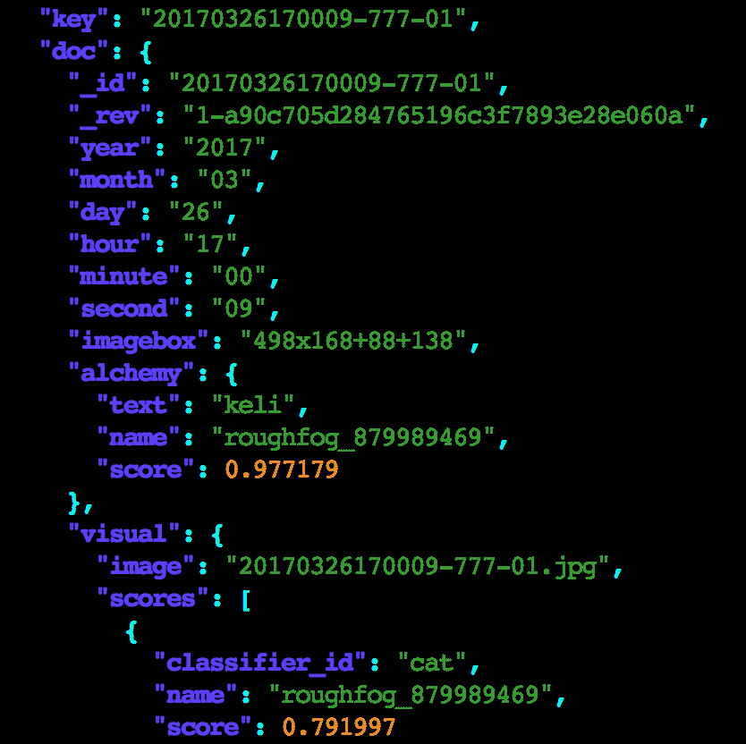

随后，我便可以开始汇总和分析图像识别的结果。在经过一些广泛的 shell 脚本编程后，我为各种分类生成了 CSV（逗号分隔值）和 JSON 统计信息，例如，按某一天的时间间隔及一周中的某一天划分的火炉图像计数（请参阅第 1 天火炉统计信息的 REST API 查询，时间间隔为 10（周日凌晨 1:30））。生成的多维立方体包含了分类器和评分的计数、最大值、平均值和标准差。在这一点上，显然需要更强大的分析工具。

##### 第 1 天火炉统计信息的 REST API 查询，时间间隔为 10（周日凌晨 1:30）

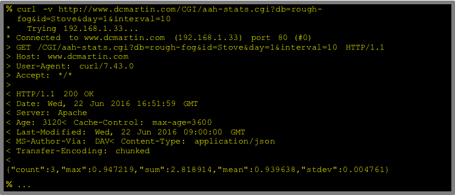

### 利用 Watson Analytics 自动开展学习

我下一步就是使用 IBM 分析服务目录，从最新的服务之一 Watson Analytics 着手。Watson Analytics 提供了直观且易于使用的数据访问、优化和探索方法。在我了解了将 JSON 扁平化为 SQL 表时所涉及的一些略微复杂的问题，并且花了一点时间来提升我的 SQL 技能之后，我能够以稀疏数据透视表形式提供 Age-at-Home 图像分类结果，该表适合在 Watson Analytics 中使用。

通过使用 Watson Analytics，实体和活动时间序列快速而简便地直观呈现在我面前，但是要想分享结果或查询却并不容易。无法分享结果也无法实现输入的参数化，导致难以通过任何自动化方式来纳入 Watson Analytics。

Watson Analytics 通过使用预定义的可视模板目录（例如，热图），并使用各种方法来关联自动发现的实际情况、维度和度量，提供了探索和直观显示数据的功能。经过一次极其快速的探索和少量试错操作，我从分析中获得了两个简单明了的洞察要点。

Watson Visual Recognition 结果的 Watson Analytics 热图 是 Watson Analytics 从默认识别模型返回的分类器的热图，方框的大小表明识别出某一事物的次数，方框的颜色则表明识别的平均置信度。Watson Analytics 用户体验提供了交互式的方法来排除选定的类，支持识别相关类，例如，我所举例子中的“Adult”类。随后可进一步对其子集（例如，识别出“Adult”的所有事件）进行分析，例如，按一天中的某一时间或一周中的某一天来分析。

##### Watson Visual Recognition 结果的 Watson Analytics 热图

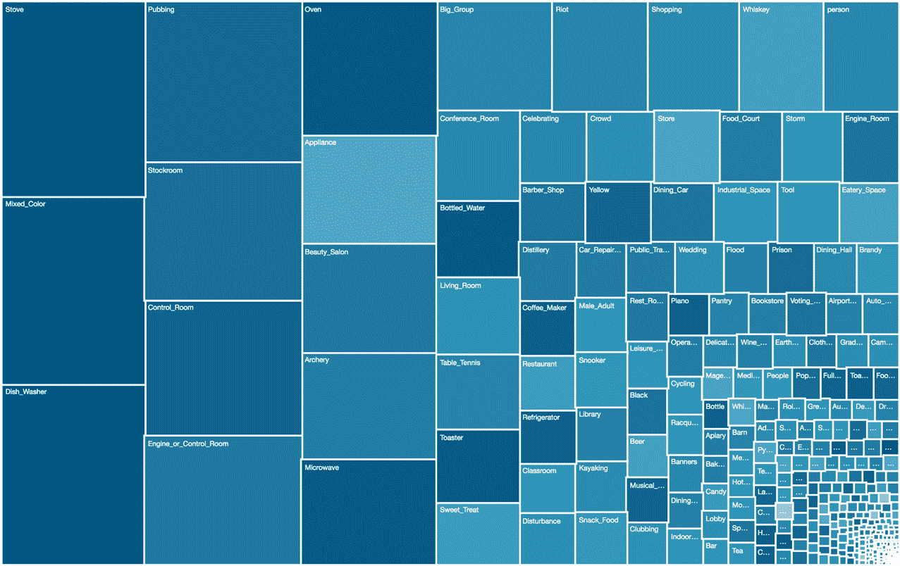

通过检查 Watson Analytics 中的分类结果，我确实发现了一些值得关注的潜在信号，包括识别我厨房里的“动静”。但是，要想在所有噪音中检测到我要搜索的信号，也就是有人出现的信号，实属不易。

使用来自*默认*分类器的信号频谱子集面临巨大的挑战。结果集中通常并不包含*人*；也就是说，未检测到人。这种类型的故障称为*漏报*。漏报的反面是*误报*，在这种情况下检测到实体，但实际上不存在此实体。这两类故障都会影响用户接收（或拒绝）异常活动相关通知时的体验。同样，这里也需要更高水平的分析能力。最值得注意的是，我需要识别出总体和特定示例中的漏报现象，以便后续检查。

Watson Analytics 时间序列分析 中第二个直观显示的结果是一个时间序列，其中按评分顺序显示了当天各时间段的总体情况。为直观显示这一结果，必须对数据加以优化，按某个时间间隔、一周中的某一天（周日、……、周六）和一年中的某一周 (1- 53) 对平均分类器评分进行汇总，以便未来进行季节性调整。这些结果表明，通过使用传统方法来清理、汇总和分析数据，极有可能成功推断出规范化行为的模式。通过抛弃明显无关的分类，仅聚焦于表示人的那些分类，我似乎找到了一条捷径。对这组代表性分类器的分布进行快速分析，似乎提供了一个规范化模型。Watson Analytics 时间序列分析显示“人”是最右侧的五列。

##### Watson Analytics 时间序列分析

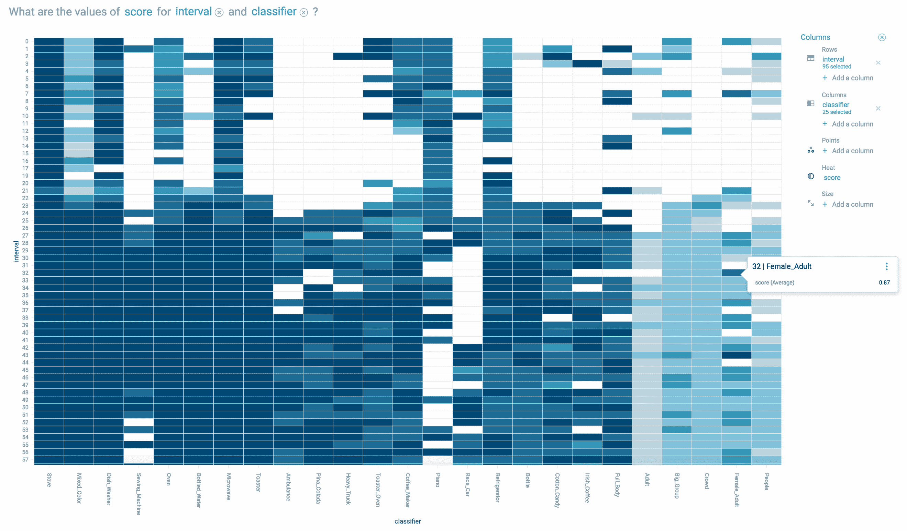

### 利用 Db2 Warehouse on Cloud 和 Looker 来加强学习

令人欣慰的是，IBM 非关系型 JSON 存储库 ([Cloudant](https://cloud.ibm.com/catalog/services/cloudant?cm_sp=ibmdev-_-developer-tutorials-_-cloudreg)) 提供了自动复制到 IBM 关系型数据库服务 ([Db2 Warehouse on Cloud](https://cloud.ibm.com/catalog/services/dashdb?cm_sp=ibmdev-_-developer-tutorials-_-cloudreg)) 的功能，该服务支持使用现成的分析软件包通过行业标准 SQL 进行数据发现和报告。另外，Looker 还支持对复杂数据进行查询和分析，以便用于展示和分享。（IBM 与 Looker 为技术合作伙伴。）

为实现参数化输入和可使用的输出，最好选择标准方法，尤其是在具有可提供这些功能的工具的情况下。像 SQL 这样的通用查询语言正是输入规范的不二选择。不仅如此，表格形式的输出（如逗号分隔值文件，此类文件始终是首选）或结构化形式（如 JSON，此形式逐渐受人青睐）的输出几乎可供其他任何组件使用。

虽然在源存储库中维护 SQL 查询是管理输入规范时的一种选择，但此流程还需要额外执行编码才能实现自动化。幸好 Looker 提供了一种方法，既可以存储和执行 SQL，又可以为 Db2 Warehouse on Cloud 生成 SQL。此外，SQL 模板（称为“外观”）可作为 URL 进行保存、分享和供外部使用，包括 JSON 和 CSV 文件格式的输出。

通过一天的训练，再加上常驻 Looker 的 Db2 Warehouse on Cloud 专家给予的一些帮助，随时间推移所检测到实体的分布情况清晰可见（请参阅 Looker.com 图表选定的 Watson Visual Recognition 结果 ）。通过用户界面快速消除漏报显示了预期的活动分布，但个别特定时间段不足以充分检测到某个人。

##### Looker.com 图表选定的 Watson Visual Recognition 结果

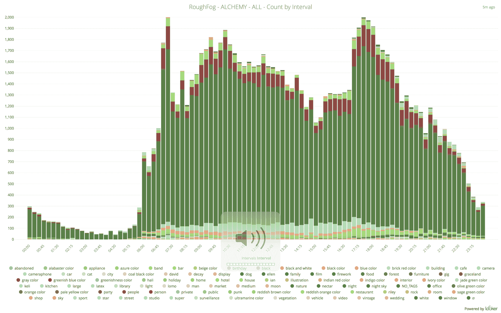

显而易见，来自视觉识别算法的信号数据中包含了过多的无关信息（即，我没有兴趣了解的实体或者几乎始终存在的实体）。此外，误报和漏报对日常活动的计算产生了不利影响 — 要么是未能看到厨房里有人（漏报，很大程度上依赖于数据），要么就是根本无人却显示有人（误报）。

此应用程序需要减少信号中的噪音，才能提供高质量的通知服务。要判定哪些是噪音，哪些是有用信号，就需要具备某种类型的智库来加以鉴别。在许多方面，这就像是一台收音机同时播放它可在整个频谱中接收到的所有电台一样。无线电操作员（智库）需要对此应用程序进行“调频”，因此有机会按个人喜好对产生的“电台”进行“命名”， 或者调到新电台。

接下来就该采取下一步行动，了解如何利用厨房中所选地点的摄像头的示例对 Watson Visual Recognition 服务进行训练。

2

## 环境定义成功

着手训练 Watson 带来了大量问题，但最重要的问题促使我们获得了第二个经验教训：环境定义成功。第二个经验教训从一个简单的前提开始，即训练 Watson 需要定义作为家中活动指标的“事物”。例如，住在家里的人和动物。最初的这组 `{ People, Animals }` 定义了 Watson 的学习环境，换言之，可训练 Watson 识别图像中的哪些对象。

Watson 通过使用默认分类模型可以看到许多事物。为了解人类活动，需要对默认事物集合加以精简，表明我着力分析的行为类型，例如，某个人首次进入厨房。若要将摄像头的数字信号转化为表示厨房中人类活动的事件，就需要预先指定某些参数。某些参数表示操作能力，例如，检测到运动和捕获图像之间的时间量。另一些参数则限制了传感器的灵敏度，例如，图像捕获之间的时间间隔。最后一点同样也是最重要的，某些参数定义了与可用图像分类相关的环境（即，Watson 能看到什么？）。

### 环境发现：通过训练来学习

要在不具备完整知识的情况下继续前进，就需要确定一系列可用于对 Watson 进行训练的事物，先从一个简单的集合开始：`{ person, dog, cat }`。为构建 Watson Visual Recognition 模型，就必须为漏报示例（空无一人的厨房）和误报示例（厨房中[只有]人、狗或猫）收集训练图像。要收集图像并将其组织为*训练集合*，认知 IoT 系统的用户需要从捕获的图像中选择范例（即，只有人、没有猫也没有狗的图片）, 并跳过包含多个实体的图片或者存在隐私性质的图片。

##### 用于收集示例的初始用户界面

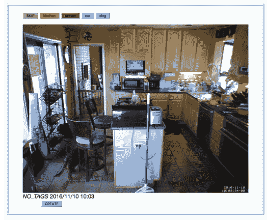

这个流程的第一步是通过 Raspberry Pi 收集图像。每个设备都有一张 64 GB 的 micro-SD 卡，但在软件更新期间可擦除图像。由于图像可能存在隐私问题，所以为专用 LAN 配置了仅限本地的检索服务 (FTP)，同时收集了图像，并将其存储在本地分层存储库中，此存储库对应于评分最高的分类类型。

最初，针对厨房的类集合被定义为 `{ person, dog, cat }`。但在用户体验测试期间（请参阅通过构建模型提供环境），显然该类集合需要扩展并进行动态定义。通过添加创建功能，我可以将特定家庭成员添加到标记选项，但这也带来了一些混乱。在花费几个夜晚为训练集合标记图像之后，我最终获得了足够数量的图像（约 800 张图像：一个漏报类和七个误报类），从而能够开始构建定制分类器。（顺便说一句，[Watson Visual Recognition 服务文档](https://cloud.ibm.com/docs/services/visual-recognition?topic=visual-recognition-customizing#guidelines-for-training-classifiers)建议每个类至少有 50 张图像。）

### 通过构建模型提供环境

Watson Visual Recognition 服务要求每个类都有经过压缩的结构化图像有效内容（例如，.zip 文件），每次 API 调用每个类限制为 100 MB，总大小限制为 256 MB。同时还必须遵循其他约束和准则，包括类的命名、整合漏报类，遵循图像处理的数量和质量的最低和最高要求。

既然已了解了 API，并且也确定了限制，我开始通过 Linux 命令行分别执行这些步骤来构建定制分类器。我修改并扩展了分类器，直至生成了合适的输出为止。当一系列步骤成功完成之后，我将它们添加到一个内容不断增加的脚本文件中，并将此文件参数化以自动执行该流程。

每次训练的大小限制 (256 MB) 和每个类的大小限制 (100 MB) 表明需要多次调用训练 API。通过将此流程分为多个不同的阶段（例如，先构建，然后训练对应的测试集合），我在整个流程的某些临时节点处定义了多份快照。

运行的多次训练处理了 50% 的图像，外加一张样本图像，并使用剩余超过 49% 的图像根据已知示例来检验预测结果。通常，来自整个集合的随机选择可用于拆分群体，并采用替代百分比形式 (90/10)；但是，这些方法还尚未实施。

##### 用于评估模型质量的混淆矩阵

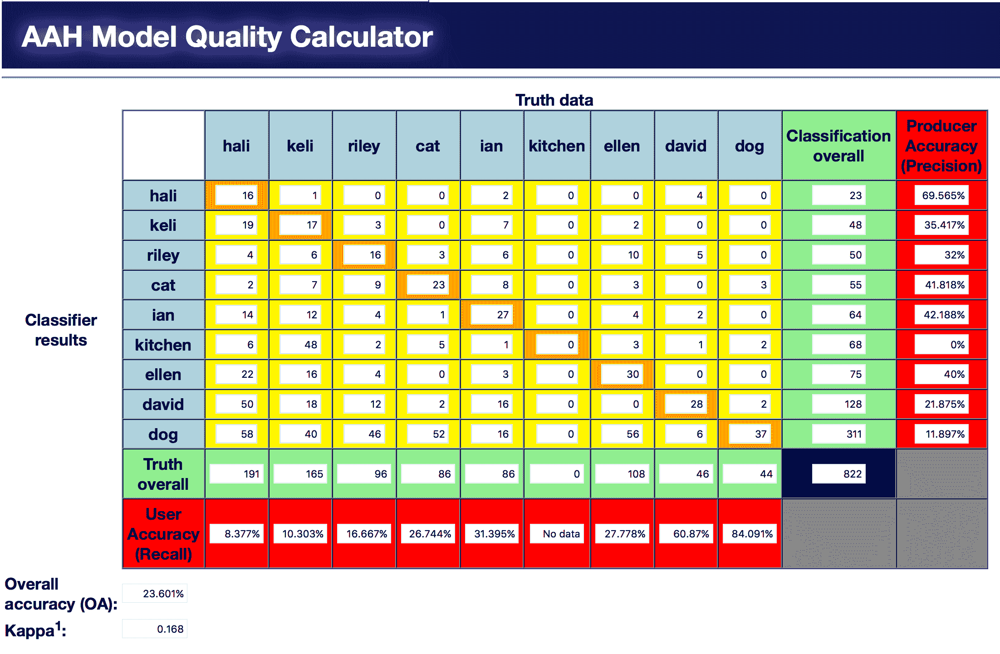

既然已对一半示例集合完成了训练，就需要对所生成模型的质量进行检验。使用来自已整理集合的剩余示例，重复调用此定制分类器，捕获生成的结果，并将其列在按排名排序的类和评分列表中，评分范围是零 (`0`) 到一 (`1`)。如果评分最高的类与经整理的类（例如，“David”）相匹配，那么预测被视为正确。

Age-at-Home 项目的逻辑和分析需要区分*人*与非*人*，所有*人*的并集显然不同于逆反命题。

### 投入使用：观察它在实际应用中的行为

在应用环境中引入定制分类器时，我需要在针对 Watson Visual Recognition 服务的 API 调用中为每个设备指定模型标识，并将结果整合到事件构造中。定制分类器标识是在 resin.io 仪表板中，作为每个设备的 Linux 应用环境变量进行指定的。指定默认分类器和定制分类器后，会对图像应用这两种分类器。

定制分类器的结果以分类器名称来标记（例如，_roughfog__XXXXX）。默认分类器的结果以来自实体层次结构的分类器类型命名（例如，“/vehicle/truck”），或者针对 Watson Visual Recognition 中定义的实体集合命名为“default”。层次结构和实体集合均不发布，这两种结果都必须动态处理。在分层和平面名称空间拓扑中，必须对默认分类器返回的实体进行收集、编目和枚举。实体存在状态的计算必须加以量化，对于识别为噪音的实体，必须将其从结果集中移除。

JSON 编码事件包含返回的时间、模型指示符以及分类器和评分。所有分类器中评分最高的类将被复制为事件的主类。

通过提供新模型标识作为 Raspberry Pi 容器的环境变量，并且添加了包含新定制分类器的逻辑，在每个设备的非关系型存储库中记录了新事件。

厨房摄像头的平均图像和摄像区域 (FOV) 是安装厨房摄像头的图示，名为“rough-fog”。右侧窗格中指示了摄像头的位置；黄色区域指明了摄像区域 (FOV)。左侧对应图像是空无一人的厨房的“平均”图像，是从 Watson Visual Recognition 的定制分类器训练集合计算得到的。

##### 厨房摄像头的平均图像和摄像区域 (FOV)

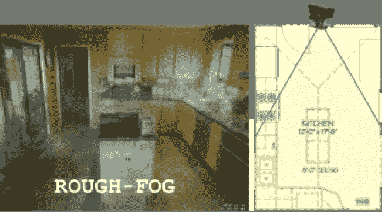

利用厨房中的摄像头和浴室中的摄像头，并通过经训练可识别家庭成员和宠物的定制分类器，即可开始信号分析。与默认分类器的结果相比，定制分类器的结果所呈现的日常活动模式更为有趣。

在厨房里，每周活动直方图（请参阅居住者每日厨房活动的 Looker.com 图表（包括宠物））表明了我女儿 Hali 出现在那里，而她当时正在学校里。此外，通过检验个别事件发现，在我和我大儿子 Lan（他不会在早上 8 点前起床）之间发生多起混淆情况。

##### 居住者每日厨房活动的 Looker.com 图表（包括宠物）

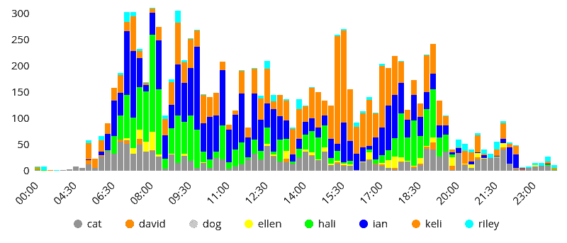

对于浴室，每周直方图表明我妻子 Keli 在这里花了大量的时间，尤其是相比于她待在厨房里的时间。此外，它显示我女儿 Ellen 在白天从学校瞬间移动到家中，并使用了浴室。显然，识别准确性还需要进一步改进。

最后，在撰写本文期间，我添加了第三个安装位置，用来观察我家屋外的道路（名为“quiet-water”）。我在 6 英寸 x 6 英寸的塑料电箱中安装了 Raspberry Pi 和 Playstation3 Eye 摄像头，在外盖上钻了一个 1.5 英寸的孔；摄像头倒置，摄像区域从正常的 75 度缩减到 56 度，这样观察的距离也就更长（请参阅道路摄像头的平均图片和摄像区域 (FOV)）。Motion 软件包提供了反转图像的选项，我为 quiet-water 安装新增了这一具体要求。

##### 道路摄像头的平均图片和摄像区域 (FOV)

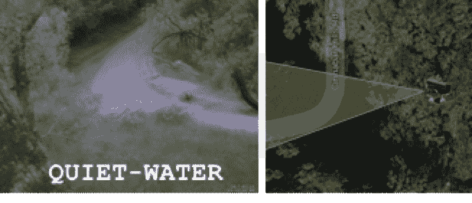

可通过[这个维基百科条目](https://en.wikipedia.org/wiki/PlayStation_Eye)了解有关 PlayStation Eye 数字摄像头设备的更多信息。

此安装提供了我家下方道路的视图，这条路的尽头就是我家的前门，我的家人与另外三家人都会走这条路。通过使用为室内场所开发且精心管理的用户体验，构建了一个定制模型来识别可能看到的任何事物。同样，起初部署了默认分类器，其结果与厨房和浴室中提供的结果相似，无关紧要的一般用途实体占据了大多数。由于进行了全帧分析，这些实体有了一定的意义，例如“斜坡”或“山坡”。但默认分类器还识别了一些令人感兴趣的实体，例如“车辆”。此外，由于新的 Watson Visual Recognition 默认分类器包含分层实体规范，因此可执行其他有趣的分析，例如，看到的动物的直方图（请参阅根据 Db2 Warehouse on Cloud 中的 Watson Visual Recognition 结果，按一天中的不同时间绘制的 Looker.com 动物图表）。显然，除非我住在动物园里，否则出现这么多动物的可能性是很低的（例如，“鳄鱼”）。

##### 根据 Db2 Warehouse on Cloud 中的 Watson Visual Recognition 结果，按一天中的不同时间绘制的 Looker.com 动物图表

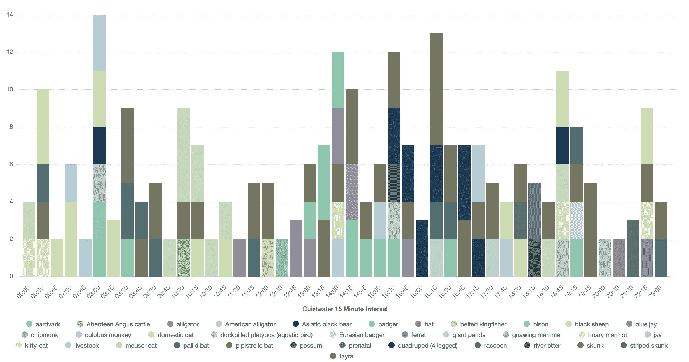

随后对 quiet-water（道路）设备进行了训练，在查找画面中仅有一辆车的图像和决定所见实体的名称这两方面都遇到了困难。捕获的图像中包含了大量车辆；部分是已知的，但还有许多是未知的。我并没有尝试定义所有车辆类型和对应制造商、年份或车型的分类体系，只需车辆所有者和类型即可提供足够的信息背景。

为我拥有的车辆（martin_c70、martin_c30、martin_suburban）以及邻居拥有的车辆（neighbor_hybrid、neighbor_fordflex、neighbor_pickup）快速创建了多个类。同时也轻松区分和定义了有关邮政 (USPS)、包裹 (UPS) 和丙烷运输车辆的类。但是，考虑到其分析环境，其他类更难以区分和定义。到底该将它们定义为“unknown”、“whitepickup”或“car_at_night”，还是应建立层次结构？显然，区分和定义新示例的流程将是一个持续性的过程。我需要使用支持版本控制、分支、推送和拉取功能的共享存储库。随着分类体系的不断发展，就这些定义和示例而言，关联模型也将需要受到控制。

3

## 人们无法清楚地认识到自己在哪些方面一无所知

在经过这一漫长而又曲折的过程之后，我总结了第 3 条经验教训：人们无法清楚地认识到自己在哪些方面一无所知。Watson Visual Recognition 实体分类体系定义了自己的成功理念：从服务使用者（比如我自己）的角度来看，分类体系中*未*包含的任何实体都代表着一种失败。换言之，Watson Visual Recognition 并不知道有些实体是它所未曾察觉的。同样，我的家庭成员、宠物和车辆的分类也受到了我的经验（即，人 X 或车辆 Y 的充足图片) 以及我创建的分类体系的限制，因此在我 **发现** 新事物时，就需要动态添加新的定制类。这将需要持续管理分类体系（包括涉及训练、测试和使用的版本管理） — 实现起来可能非常困难。

由这条经验教训得出了第一个结论：**内容的综合处理影响最终成果**。虽然大部分开发人员在计算机编程中都知道“垃圾进，垃圾出”这一格言，但在认知领域，这条格言是一条铁律。促使示例变成“真正事实”的方法、设备、流程和判定会对结果产生直接的影响。分类错误（比如，图片中没有猫）和缺乏事先提供的证据（比如，没有关于猫的图片）将会直接影响认知服务的质量和能力。

除了实体及其示例数据的分类体系之外，还有一个潜在的成功执行主要功能的问题，也就是当老年人出现不正常状况时通知其子孙辈。起初根据检测人的存在而推定的正常模式并非无效，但几乎让感官超负荷的潜在实体以及有待商榷的相关预测性质，令我不禁怀疑自己能否通过编程方式定义合适的通知条件。

而我妻子的一席话则令我豁然开朗。当她查看厨房中检测到的“人”的 Excel 图形时，她说：“为什么不在周日划定上午 10 点这条界限呢？他们那时应该都起床了。”显然，人类智慧和活动背景知识应该也必将在某个节点涵盖在内，我由她的话而推断出，成功的衡量标准是恰当的通知，而不是在 IoT 设备上使用图像分类对个人进行跟踪的能力。

也就是说，第二个结论是：**从上至下优化目标功能**。换言之，基于效用和用户期望（即，通知满意度）来聚焦收集、综合处理和其他流程。附属组件（如活动分析、实体分类、运动检测、时间间隔等）均可用实验方法加以控制，而不会受到人类先前编程知识（即，人的每日活动是作为行动依据的相关信号）的限制。

第三个结论直接来自于这种实验方法：**启用动态子系统控制**（例如，捕获和处理图像的频率）。这些控制措施应根据您开展的实验执行不同的操作，并且还应随实验输出一起加以记录。例如，如果图像捕获频率为每分钟一次，由此对被检测实体进行的基于时间的分析将取决于任何历史或未来比较分析的频率。成功与否的计算方式应考量所有这些实验控制措施。

最后，历史绩效并不能保证未来绩效，对任何认知服务的绩效进行持续性分析至关重要。

## 实际使用

既然已通过使用 Watson Visual Recognition 的定制分类器并利用历史分析依据相关条件发送警报，建立了 MVP 的基本操作功能，按照我对于边缘地带低延迟、隐私性、反应灵敏且快速响应的认知 IoT 应用程序的期望，该解决方案已接近完成。虽然 Watson Visual Recognition 低于 2 秒的延迟可以接受，但它还不够快。此外，隐私问题仍然存在，我需要避免将图像发送至 IBM Cloud 进行分类。

如先前所述，nVidia 提供了全新的 IoT 设备 [Jetson](http://www.nvidia.com/object/jetson-tk1-embedded-dev-kit.html)，其中包含一个 ARM 处理器（如 Raspberry Pi）和最新的 nVidia GPU 芯片。Jetson 可与 Raspberry Pi 实现二进制兼容，同时还提供了一种使用 GPU 来运行深度学习软件的方法。下一步是将 Jetson 整合到 Age-at-Home 解决方案中，同时提供在本地对图像进行分类的方法，并且进一步降低延迟。

幸好 nVidia 提供了一个开源软件包 [DIGITS](https://developer.nvidia.com/digits)，它具有图形用户界面，用于在包括图像分类等众多领域对深度学习框架进行训练。此外，利用 DIGITS，还能够下载和导入使用此界面构建的图像分类模型。该软件包完美地融合了两种功能，不仅能够使用 Jetson 在边缘近乎实时地进行推理，还能使用含多个 nVidia GPU 的 IBM Cloud 裸机服务器长时间对模型运行批量训练与测试。

nVidia DIGITS 软件支持众多深度学习框架，包括 U.C.Berkeley (BVLC) [Caffe](http://caffe.berkeleyvision.org/)。但遗憾的是，开源软件并不包含默认图像分类器，因此需要构建基础图像分类。幸好开源社区提供了 [ImageNet](http://www.image-net.org/)，此集合包含 100 万张图片，且将这些图片归入 1000 个类别，另外，该社区还提供了 `{AlexNet/GoogLeNet}` 示例深度学习神经网络，它可学习如何对图像进行分类。

我在云端和本地系统中都使用了 nVidia DIGITS 开源软件。该云系统根据开源范例和社区提供范例的基本语料库（例如，厨房里猫的图片）构建模型。

## 结束语

发现认知 IoT 应用程序需要学习，是在此次 PoC 过程中得出的重要成果。从图像分类到日常活动分析，任何训练集合的广度和深度都不足以反映实际使用情况。训练务必要包含用户对成功和失败的评估。

这体现出了一种崭新的模式，即，应尽可能降低预先存在的偏差，并构建通过噪音传感器观测到的实体、属性和活动的数据集，然后根据用户体验反馈通过机器学习弱化这些传感器的效用。需要重复使用这种模式，才能构建任何面向使用者且运用认知处理技术的成功应用程序。必须为任何认知服务的专业化和*就地*训练启用这种闭环反馈机制。

应进一步明确定义本体，为这些实体、属性、价值和关系确立事实依据，并综合处理语料库以提高准确度和精密度。此外，还必须采用起源和关联的供应链技术“对管理者进行综合处理”，并建立认证机制和可信度 — 包括人类和认知代理两方面。

在所有这些工作中，必须为输入、输出和绩效建立额外的透明度，才能成功使用并准确表达这些认知服务已知和未知的事物。如果代理无法透明地展现其学习基础及其业已证明的非凡能力，所有认知服务使用者在选择时都应该慎重再慎重。

最后，用户是任何应用程序成功与否的最终裁判，他们关于事物本质的定义决定了认知代理是否能够创造价值。这不只是以明显的专业化方式来处理家庭成员、其宠物和邻里车辆，更重要的是，根据这些底层信号来实现后续认知论证或推理，例如，向子女或看护人员发送通知。误报（即一切都正常的情况下发送通知）将会惹恼接收方和祖父母辈；漏报（即情况不正常时未发送通知）则后果更糟。

认知 IoT 应用程序开发者必须收集这些误报和漏报的真实结果，并整合到其训练集合中，包括作为代理训练依据的决定性和潜在随机输入、输出以及本体和真实情况。后续训练迭代可以通过此信息来了解更多事物，并通过更多更好的示例来改善实际表现情况。

本文翻译自：[Lessons learned while building a closed-loop, full-stack cognitive IoT application](https://developer.ibm.com/tutorials/iot-lessons-learned-02/)（2018-01-16）