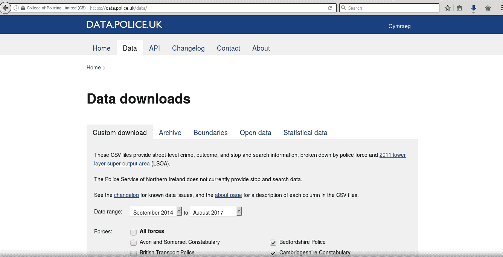
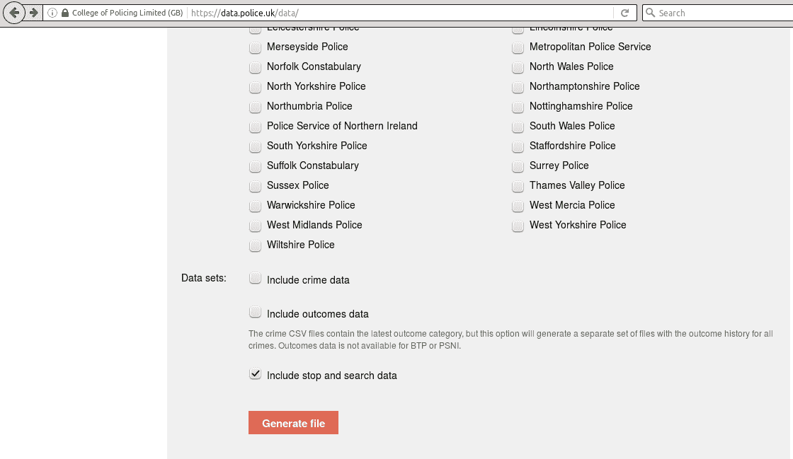
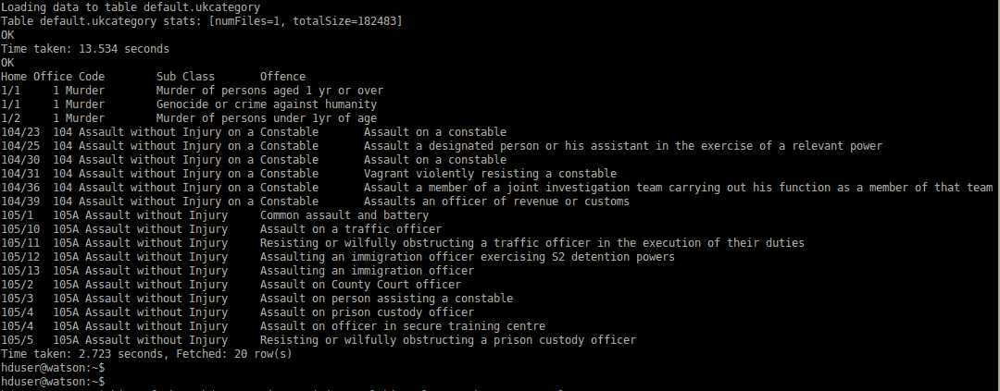

# 了解有关提取、转换和加载 (ETL) 的信息

> 原文：[`developer.ibm.com/zh/tutorials/ba-spark-hive-etl1/`](https://developer.ibm.com/zh/tutorials/ba-spark-hive-etl1/)

本教程将介绍对英国犯罪数据进行分析的全过程：从一开始直到获取最终结果。跟随本教程了解数据下载、数据转换、将数据加载至分布式数据仓库 Apache Hive 中，以及使用 Apache Spark 进行后续分析。本系列的第 1 部分介绍了提取、转换和加载 (ETL) 活动，第 2 部分将探索所执行的分析。

## 替代传统 ETL 工具的 Spark 和 Hive

ETL 工具有许多，但这些工具通常要求编程人员熟悉专属架构和语言。Apache Hive 是基于云的数据仓库，可提供基于 SQL 的工具，将结构化数据和半结构化数据转换为基于模式的云数据仓库。Hive 和 Spark 都适用于处理 Hadoop 生态系统和 Hadoop 分布式文件系统 (HDFS) 内的数据。Spark 和 SparkSQL 组件同样适合在数据仓库内快速转换数据。考虑到 SparkSQL 相比于 MapReduce 的卓越性能，SparkSQL 相较于传统 ETL 工具，速度已得到提升。

##### 英国犯罪数据下载



## 从英国警方数据库中提取数据

这里选中了英国犯罪数据库来证明对 Hive 数据仓库使用 Spark 进行分析所具有的速度和易用性。 [GitHub](https://github.com/alanbrown98/spark-hive-crime) 上提供了本教程的程序代码和脚本。

从英国犯罪数据库检索数据的方法不止一种。API 下载仅适用于分析地方数据。对于本教程，使用 [CSV 文件下载](https://data.police.uk/data/) 来分析全国数据。由此，您也能够在数据加载期间充分利用 Hive 的卓越功能。

下图显示了从英国犯罪数据集下载数据的过程。我将仅选中伦敦来演示数据路由，但您也可以按自己意愿选择任意数量的地区。我选择的是伦敦都会区警察局 2014 年 9 月到 2017 年 8 月间的数据。

在定制下载选项卡上：

*   选择 2014 年 9 月到 2017 年 8 月的日期范围。
*   选择 **Cambridgeshire Constabulary and Metropolitan Police** 。您可以选择任意数量的地方警局，但为了便于在本教程中进行演示，此处仅使用了两个地方警局。向下滚动并选中 **Include stop and search** 复选框。
*   单击 **Generate file** 选项。这需要几秒钟时间来生成文件。
*   完成后，单击 **Download now** 以下载数据文件。

针对街头犯罪复选框和结果复选框重复此流程。这样将生成三个文件，分别包含全部街头犯罪、结果以及搜查数据。下图显示了可供下载的三个可用数据集复选框。

##### 英国犯罪数据下载



下载完成后，您可以在自己的 Download 文件夹中找到此文件。双击此文件，打开计算机上的标准解压缩实用程序。创建一个文件夹来保存解压后的文件，并将其命名为 `UK-Crime` 。

下一步是清理数据，然后将数据加载至 Hive。创建一个文件夹，并将其命名为 `staging` 。此文件夹用于将经过清理的数据加载至 Apache Hive。

## 数据清理

最初下载的数据经过解压后，会生成一个目录层次结构，文件存储在多个不同的子目录中。Hive 具有实用的数据加载功能，当给定目录中的每个文件都具有相同结构（例如，相同的列类型）时，可获取其中的每个文件。但是，由英国警方提供的数据文件在目录层次结构中使用多种文件类型，按年月以及地区划分。因此，第一步是为每种不同的文件类型创建一个暂存文件夹（staging folder）。

为简化此流程，我创建了一个 Java™ 程序，用于解析目录层次结构，并将每种给定类型的文件移至此文件类型的定制暂存区（staging folder）。这个简单的 Java 实用程序会遍历已解压数据文件的文件夹层次结构，并将给定类型的所有文件都移至我创建的暂存区文件夹。此程序可处理英国警方对目录层次结构逐步实施的小幅变更。暂存区文件夹中的所有文件只需通过一个步骤即可加载至 Apache Hive 数据仓库。

```
public class MoveFilesUtility {

    public static void main(String[] args) {
       //String mypath = "/home/hduser/zdata/uk-crime/crime-stop-search";
       String mypath = "/home/hduser/zdata/uk-crime/crime-street-crime";

       MoveFilesUtility o1 = new MoveFilesUtility();

       o1.listFilesAndFilesSubDirectories(mypath);
    }
     public void listFilesAndFilesSubDirectories(String directoryName){

        String dest_dir = "/home/hduser/zdata/uk-crime/spark-lake/staging/";
        File directory = new File(directoryName);
        //get all the files from a directory
        File[] fList = directory.listFiles();
        for (File file : fList){
            if (file.isFile()){
                System.out.println(file.getAbsolutePath());
                moveUkCrimeFilesToDir( dest_dir, file.getAbsolutePath());
            } else if (file.isDirectory()){
                listFilesAndFilesSubDirectories(file.getAbsolutePath());
            }
        }
    }
    /**
     * Copy uk crime file to another directory ( for hive data load
     * @param directoryNameDestination to be listed
     */
    public void moveUkCrimeFilesToDir(String directoryNameDestination, String mypath){
        try{
           File afile =new File(mypath);
           if(!afile.isFile()) return;
           if(afile.renameTo(new File(directoryNameDestination + afile.getName()))){
            System.out.println("File move successful!");
           }else{
            System.out.println("File  failed to move!  " + afile.getName() );
           }
        }catch(Exception e){
            e.printStackTrace();
        }
    }
} 
```

您可从以上列表复制粘帖 Java 代码，也可以从 [GitHub](https://github.com/alanbrown98/spark-hive-crime) 提取此代码。

## Apache Hive 和 ETL

Apache Hive 是分布式数据仓库系统，专为在 Hadoop 上运行而构建。它用于查询和管理驻留在 HDFS 存储空间内的大型数据集。Hive 提供了一种机制，用于将结构投射到 Hadoop 和 HDFS 中的数据，并使用称为 HiveQL (HQL) 的类 SQL 语言来查询此数据。由于 Hive 提供基于 SQL 的工具来实现轻松的数据提取、转换和加载，因此使用 HQL 脚本将数据加载至 Hive 是合理的。

### 将数据加载至 Apache Hive

通过利用 Hive，只要给定目录中的文件具有相同的数据结构，就可以加载所有这些文件。对于街头犯罪数据，创建名为 staging_area 的子目录。记录计算机上的路径，并将此路径用于 Hive 脚本。

### 定义 Hive 表

以下 Hive HQL 文件会创建 Hive 数据表，并将 staging_area 目录中的所有数据文件都加载至该表中。

为便于后续分析，需要了解警方犯罪数据集的性质及数据的收集方式。每月提供的文件包括：

*   犯罪和反社会行为 (ASB) 或街头犯罪文件 — 包含街头犯罪，例如，抢劫、袭击和刑事损害等。
*   警方处理结果文件 — 调查通常持续数月，此文件将包含过去数月乃至数年内有关事件的数据和更新信息。
*   法庭审判结果 — 将提交给政府的警方数据与司法部法庭听证结果进行比对。随着调查的深入，可能会对部分犯罪行为重新分类；对于其他犯罪行为，经纬度数据可能不一定精确，例如，受害者无法准确说出犯罪发生地点。为保护受害者的身份，准确犯罪地点为大致的地点。通常，这是从距离犯罪地点最近的 750,000 个参考点列表中进行选择的。

### 常见数据集成问题

对于从接处警服务、刑事诉讼服务到法庭审判过程的犯罪行为，并不存在唯一标识。警方使用模糊匹配处理来匹配这些犯罪行为。上传的数据为时间快照；经过调查后，这些犯罪行为通常被重新分类为不同的类型，或者被确认为是虚假报道。以下是系统的输出文件和文件格式。

##### 街头犯罪文件

| 字段 | 描述 |
| --- | --- |
| Reported by | 提供数据的警队 |
| Falls within | 提供数据的警队 |
| Latitude | 犯罪发生地点的纬度 |
| Longitude | 犯罪发生地点的经度 |
| LSOA code | 低层超级输出区域 (Lower Layer Super Output Area) 代码 |
| LSOA name | 低层超级输出区域名称 |
| Crime type | 标准犯罪行为分类 |
| Last_Outcome_category | 对最近所发生犯罪行为的任何相关结果的参照 |

##### 搜查文件

| 字段 | 描述 |
| --- | --- |
| Reported by | 提供数据的警队 |
| Falls within | 提供数据的警队 |
| Latitude | 犯罪发生地点的纬度 |
| Longitude | 犯罪发生地点的经度 |
| LSOA code | 低层超级输出区域 (Lower Layer Super Output Area) 代码 |
| LSOA name | 低层超级输出区域名称 |
| Crime type | 标准犯罪行为分类 |
| Last_Outcome_category | 对最近所发生犯罪行为的任何相关结果的参照 |

此文件包含上个月内报告的结果数据。犯罪行为可能发生于数月之前。

##### 结果文件

| 字段 | 描述 |
| --- | --- |
| Offense Reference | 参考标识 |
| Outcome Date | 确定结果的日期 |
| Outcome Category | 结果所属的类别 |

## 运行 Hive SQL 脚本并显示结果

Hive SQL (HQL) 脚本只是一系列 Hive 查询语言命令。这些命令通常与您在 Hive shell 中使用的命令相同。此脚本文件将包含外部 HQL 脚本中的 Hive 命令和返回的值。

```
load_master_stop_and_search2.sql:
create table if not exists stop_and_search (
searchType STRING, searchDate STRING, part_police_operation STRING, police_operation STRING, latitude DOUBLE, longitude DOUBLE, gender STRING, age_range STRING, self_define_ethnicity STRING, officer_defined_ethnicity STRING, legislation STRING, object_of_search STRING, outcome STRING, outcome_linked_to_object STRING, removal_clothing STRING
)
row format delimited fields terminated by ','
stored as textfile;
load data local inpath '/home/hduser/zdata/uk-crime/spark-lake/staging/' into table stop_and_search; 
```

最好将一组 Hive 命令输入到一个文件中。这样就能够复用常用的命令，这些命令的定义通常较长。此文件包含 Hive 表定义，后跟将数据文件加载至 Hive 表的指令。通过在 bash 命令行中的 bash 提示符处输入以下命令来调用 Hive SQL 脚本文件：

`$hive -f load_master_stop_and_search2.sql` 。

以上脚本将 1601 个文件加载至 Hive 中。可在 [GitHub](https://github.com/alanbrown98/spark-hive-crime) 上获取此文件。在 GitHub 上为结果数据和街头犯罪数据提供了类似的脚本。接下来，使用 SparkSQL 对数据进行组织和编目，并按从最大到最小的顺序对生成的集合进行排序。SparkSQL 程序是通过 Spark Java API 用 Java 编程语言编写的。代码是使用 Maven 构建的。可在 [GitHub](https://github.com/alanbrown98/spark-hive-crime) 上获取 Maven Project Object Model (POM) 文件。通过 bash 命令行使用 spark-submit 调用此程序：

```
$mvn package
$usr/local/spark/bin/spark-submit –class "DemoHive” --master local[4] target/demo-hive-1.0.jar 
```

第一条命令 (`mvn package`) 构建 Java 程序并自动集成 Spark 和 Hive API 函数。这样会生成一个 Java JAR 文件作为输出。第二条命令将会运行程序，该程序查询 Hive 数据仓库、执行计算，并显示结果。下面显示了运行输出示例。

##### Java SparkAPI 程序输出



## 小结

在本教程中，我们首先显示了数据加载过程，随后在仓库内通过转换来集成异构数据源。这为数据变更提供了更高的可追溯性，也仍然是确保数据质量的关键要素。如果无法确保数据质量和可追溯性，就无法信任后续分析的准确性。

用于分析的数据库文件的设计是在从不同数据源加载不同 CSV 文件数据后进行的，并且在检查初始数据加载过程中加载的数据后做出了一些决策。这些检查是以迭代方式在数据仓库内部执行的。

本文翻译自：[Learn about Extract, Transform, and Load (ETL)](https://developer.ibm.com/tutorials/ba-spark-hive-etl1/)（2018-03-07）

Alan Brown