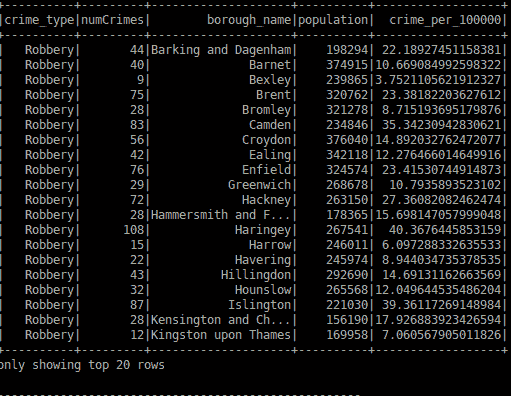
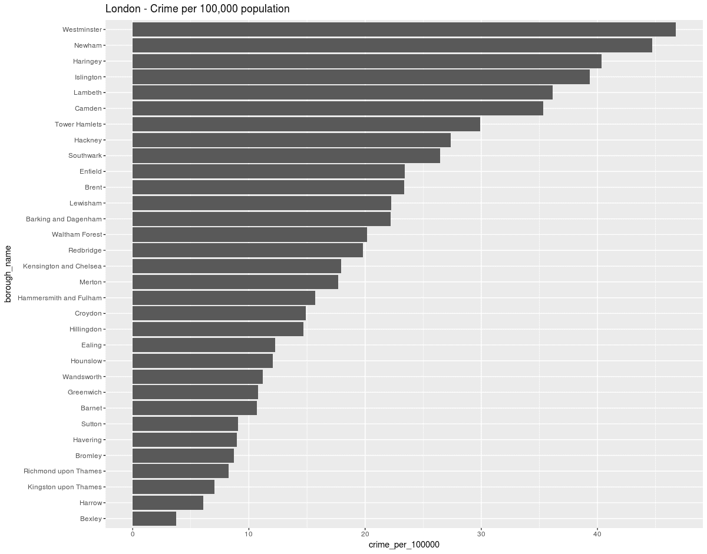

# 探索分析方法

> 原文：[`developer.ibm.com/zh/tutorials/ba-spark-hive-etl2/`](https://developer.ibm.com/zh/tutorials/ba-spark-hive-etl2/)

本教程系列将介绍对英国犯罪数据进行分析的全过程：从开始到最终结果。跟随本系列了解数据下载、数据转换、将数据加载到分布式数据仓库中、Apache Hive，以及使用 Apache Spark 的后续分析。本系列的第 1 部分介绍了提取、转换和加载 (ETL) 活动，第 2 部分将探索所执行的分析。

在本系列的第 2 部分中，您将了解如何分析犯罪数据，这为数据分析提供了基础。在跟随操作的过程中，您会遇到现代大数据系统中的一个标准问题：集成不同来源的数据。不同政府部门通常对其数据产品有不同的标准，甚至对基本数据类型往往也有不同的定义。数据科学家经常管理这些不同的定义，而且必须协调它们来获得良好的结果。

大部分数据科学家喜欢将数据加载到数据仓库中，并保留已导入数据的准确副本。然后，通过在数据仓库自身内执行转换，会产生一些包含经过协调的数据定义的新表。这会在数据仓库内保留原始导入数据的副本作为审计跟踪线索，还会保留执行转换的代码。

## 关键思路

为数据湖保留一种中央项目架构，并将外部数据提供者映射到内部标准。摄入的数据的原始副本保留在一组数据表中，并应用转换来创建一组包含经过协调的数据定义的数据表。这在数据湖自身内提供了数据转换的审计跟踪线索。

## 将数据规范化

要比较各郡县的犯罪率，标准化犯罪数据会有所帮助。比较克利登和布罗姆利之间的整体犯罪数据会得到歪曲的事实，因为克利登有更多的人口，所以无论如何都会产生更多的犯罪数据。巴尼特的人口为克利登的一半，自然拥有更低的犯罪率。要实现犯罪率的直接比较，需要将数据规范化。通常，您希望引用每 100,000 人中的犯罪数量。这有助于直接比较人口数据相差较大的地区间的犯罪数据。我们立刻就会发现每 100,000 人中的犯罪数量之间存在巨大差异，然后可以执行进一步分析来确认根源。

警察数据没有引用人口数据，所以我们需要从英国人口普查数据集中获得人口数据。为此，您需要下载 [伦敦人口普查数据](https://data.london.gov.uk/dataset/super-output-area-population-lsoa-msoa-london) 。伦敦人口普查数据集包含在一个标准 Excel 文件中。该文件有两个选项卡，一个包含人口的 LSOA 数据，另一个包含每一岁的人口分类数据。LSOA 是人口普查团队定义的一个较小的地理区域，通常涵盖 1,500 人。将每个选项卡的数据文件保存为 CSV 格式。第二个选项卡包含按每一岁分解为不同年龄段的数据。在本教程中，您将看到这些表中的第一个表，该表被用于计算人口数据。在未来的使用中，您已获得了每个年龄段的人口，而且可以分析每个年龄组的犯罪率。

## 将人口普查数据导入 Hive 中

下面给出了导入伦敦普查数据的源代码。该代码也可以在 GitHub 上获得。和之前一样，该代码存储在一个 Hive SQL 文件中。然后，从 bash 命令行调用这个源文件，如下所示：

`$ hive -f import_census.hql` 。

下面的代码显示了 Spark-Hive SQL 数据导入实用工具文件。

```
create table if not exists lsoa_borough ( xblank string, area_code string, year INT, lsoa_name string,  borough_name string, male INT, female INT, population INT)
row format delimited fields terminated by ','
stored as textfile;

load data local inpath '/home/hduser/zdata/uk-crime/spark-lake/census/' into table lsoa_borough;
select year, area_code, lsoa_name, borough_name from lsoa_borough where year=2014 limit 20; 
```

GitHub 上提供了通过聚合 LSOA 上提供的人口数据来计算人口的算法。

## 犯罪数据和人口普查数据集概述

在检查数据下载信息时，会立刻发现这样一个事实： 没有人口数据，我们执行任何犯罪比较都需要人口数据。英国人口普查数据包含在一个 Excel 文件中，而且提供了详细的人口数据。但是，我们需要集成来自不同提供者的数据，这意味着您需要处理此数据。这些数据集提供了人口数量的详细视图。

在这里，数据不是按郡县提供的，而是按低层超级输出区域 (Lower Layer Super Output Area, LSOA) 提供的。这是一个约 1,500 人的小地理区域。 幸运的是，警察还提供了基于人口普查 LSOA 的犯罪数据，所以我们可以将犯罪数据集数据表直接与人口普查数据合并。数据科学家喜欢实现分析结果的轻松比较，而且他们喜欢计算每 100,000 人中的犯罪数量。这有助于在具有不同人口的郡县之间轻松执行比较。您将把犯罪数据聚合到伦敦的一个市镇等级，将来自小 LSOA 数据的人口数量聚合到更熟悉的市镇区域中。

## 英国犯罪数据集

英国犯罪数据集汇编了来自英格兰和威尔士的 43 个地方警察机构、英国交通警察局和北爱尔兰警察局所发送的报告。此外，司法部通过法庭审判结果数据对犯罪报告提供了补充。地区警察机构每月都会整理和提交此数据。

每月，地区警察机构都会汇编一个犯罪和反社会行为 (ASB) 报告文件，并将该文件提交给中央政府。然后，司法部会添加来自其档案的法庭审判结果，并尽可能地在警察数据中参考此数据。所有数据在发布前都是不具名的。

## 警察机构 IT 系统概述

警察机构 IT 系统通常是为满足警方自己的需求而在内部开发的。一些机构采购了第三方软件，但各个系统不尽相同。警察 IT 系统分为 4 个主要类别：

*   **指挥控制和事故管理** — 用于处理警察机构转交的所有事故。犯罪报告、道路交通事故 ASB。
*   **犯罪管理** — 一旦确认某个事故是犯罪事故，就会使用犯罪管理系统来记录持续调查的所有步骤。
*   **保管文件系统** — 记录在犯罪调查期间执行的任何逮捕细节。
*   **案件管理** — 此系统管理案件以准备进行法庭审判，还会管理一些警察机关的审判结果。

在一些警察机关中，这 4 个系统是紧密相连的，而在其他警察机关中，它们是不同的孤岛，无法相连。由于所有警察机关的系统之间的差异，创建协调一致的报告的准确步骤也各不相同。

## 人口普查和犯罪数据分析

接下来，我们将使用 Spark-SQL 执行计算。Spark-SQL 程序是通过 Spark Java API 用 Java™ 编程语言编写的。该代码是用行业标准的构建工具 Maven 构建的。Maven Project Object Model (POM) 文件可从 GitHub 获得。该程序可通过以下 bash 命令行来调用：

```
 $mvn package
$usr/local/spark/bin/spark-submit –class "DemoHive" --master local[4]
target/demo-hive-1.0.jar 
```

第一个命令 `mvn package` 构建 Java 程序并自动集成 Spark 和 Hive API 函数。这会得到一个 Java JAR 文件作为输出。第二个命令将会运行程序，该程序查询 Hive 数据仓库，执行计算，并显示结果。

该程序首先查询人口普查人口数据表，聚合一个市镇等级（约一个镇那么大）的人口数量。第二步是 Hive 右外联接，计算犯罪数据并聚合人口数据。第三步计算犯罪率，将犯罪数量除以 100,000 人，并显示结果表。

下面给出了用于访问 Hive 数据湖的 Spark Java 代码。

```
public class DemoHive {
  public static void main(String[] args) throws Exception {

// warehouseLocation points to the default location for managed databases and tables
String warehouseLocation = "file:"+ System.getProperty("user.dir") + "/" + "spark-warehouse";
    System.out.println("----------------------------------------------------");
    System.out.println("user-dir= " + System.getProperty("user.dir"));
    System.out.println(warehouseLocation);
    System.out.println("----------------------------------------------------");
SparkSession spark = SparkSession
  .builder()
  .appName("Java Spark Hive Example")
  .config("spark.sql.warehouse.dir", warehouseLocation)
  .enableHiveSupport()
  .getOrCreate();
//---------------------------
    Dataset<Row> sqlboroDF =  spark.sql("select  sc.crime_type,  count(*) as numCrimes, l.borough_name FROM test_street_crime sc LEFT JOIN lsoa_borough l ON (sc.lsoaname = l.lsoa_name) WHERE sc.crime_type='Robbery' GROUP BY l.borough_name, sc.crime_type  ORDER BY borough_name ");
    // Register the DataFrame as a temporary view
    sqlboroDF.createOrReplaceTempView("sqlborodf1");

    Dataset<Row> sqlDF = spark.sql("select borough_name, sum(population) as bpopulation FROM lsoa_borough GROUP BY borough_name");
    sqlDF.show();
    // Register the DataFrame as a temporary view
    sqlDF.createOrReplaceTempView("sqldf1");

    spark.sql("select b.crime_type, numCrimes, b.borough_name, bpopulation as population, numCrimes / (bpopulation / 100000 ) as crime_per_100000 from sqlborodf1 b, sqldf1 p where b.borough_name = p.borough_name").show();

  }
} 
```

#### 来自 Java Spark Hive RDD 的输出

##### Figure 1\. U.K. crime data download



在此计算过程中，您会看到 2014 年的一个月内 32 个伦敦市镇提交的抢劫犯罪数量。第二列显示了实际犯罪数量，第五列显示了每 100,000 人中的犯罪数量。多个区域拥有少于 10 的较低抢劫犯罪率，金斯敦的每 100,000 人中仅有 7.06 起犯罪，而其他区域拥有约 40 起犯罪的较高抢劫犯罪率。这表明最高犯罪率地区的抢劫风险是最低犯罪率地区的 10 倍。

## R 直方图

这里使用了 R 直方图并导入了上面的 SparkSQL 步骤所导出的 csv 文件。该直方图按每 100,000 人中的犯罪数量的顺序显示了每个伦敦市镇的犯罪率。

##### Figure 2\. R histogram



每 100,000 人中的犯罪率有助于直接比较犯罪情况。显然，比较犯罪总数是对成为受害者的几率的一种糟糕测量方式，因为每个市镇的人口数量可能有非常大的差距。现在，我们已经拥有了规范化的犯罪率数据，为更高级的分析提供了分析基础。

## 结束语

本教程展示了英国犯罪数据与英国人口普查数据的集成。演示了对来自不同来源的数据的集成，这是一个典型的数据管理问题。随后，您了解了对犯罪率的标准化统计数据的计算，这有助于轻松比较不同地区的犯罪率。

本文翻译自：[Explore the analyses](https://developer.ibm.com/tutorials/ba-spark-hive-etl2/)（2018-03-07）