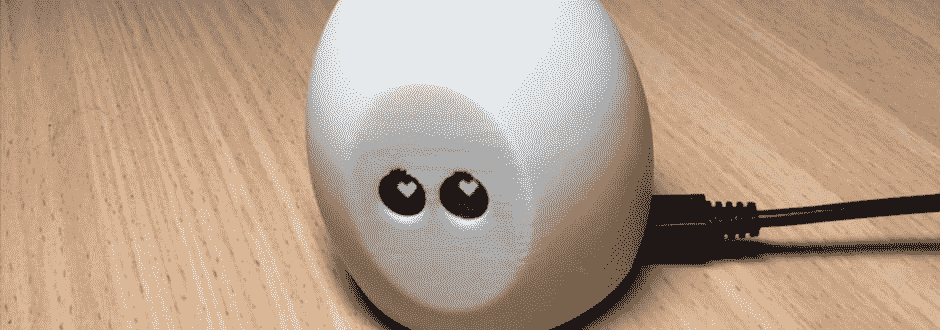

# 通过扩展 IoT 系统来掌握您的 IoT 开发技能

> 原文：[`developer.ibm.com/zh/tutorials/iot-lp301-mastering-skills-extend-iot-health-app/`](https://developer.ibm.com/zh/tutorials/iot-lp301-mastering-skills-extend-iot-health-app/)

##### 物联网 301：掌握物联网开发

本文是 IoT 301 学习路径的一部分，是 IoT 的高级开发人员指南。

*   [物联网安全挑战](https://developer.ibm.com/zh/articles/iot-top-10-iot-security-challenges/)
*   [物联网设备管理](https://developer.ibm.com/zh/tutorials/iot-lp301-iot-device-management/)
*   [物联网数据分析](https://developer.ibm.com/zh/tutorials/iot-lp301-iot-manage-data/)
*   教程：扩展物联网系统（本教程）

## 总览

在教程“[通过开发一个健康习惯跟踪程序培养您的 IoT 开发技能](https://developer.ibm.com/zh/tutorials/iot-lp201-build-skills-iot-health-app/)”中，我演示了如何构建一个习惯跟踪 IoT 设备 – 健康习惯宠物，它鼓励我定期离开计算机进行锻炼。健康习惯宠物使用 MQTT 来发送和接收数据。它从云应用程序接收消息，定期激活设备的 LED 和压电蜂鸣器进行通知。并且只要我点击宠物就会发布 MQTT 事件，表示我已完成锻炼。

本教程以该项目为基础，介绍了如何扩展设备的 MicroPython 程序以使设备能够由 IoT 平台管理，如何使用 IBM Watson IoT Platform 仪表板中的设备数据来设置基本的可视化，以及如何配置规则来触发操作，激励我继续保持锻炼习惯。请观看以下视频，我在其中介绍了该项目。



[点击查看视频演示](http://v.youku.com/v_show/id_XMzQxNjAxNzgyOA==.html)

图 1 中显示了扩展应用程序的架构。

##### 图 1\. 扩展健康习惯跟踪应用程序的架构


## 需要做的准备工作

您需要先前教程[通过开发一个健康习惯跟踪程序培养您的 IoT 开发技能](https://www.ibm.com/developerworks/cn/iot/library/iot-lp201-build-skills-iot-health-app/index.html?ca=drs-)的所有必备硬件、程序和帐户。当然，您需要完成该教程以开发自己的健康习惯宠物。

## 扩展设备的 MicroPython 程序

可以在 [managed-healthy-habits-pet](https://github.com/AnnaGerber/managed-healthy-habits-pet) git 存储库中找到更新的设备程序。

[获得代码](https://github.com/AnnaGerber/managed-healthy-habits-pet)

我通过添加额外的属性、受管设备支持和深度睡眠支持来扩展设备程序。

### 添加属性

设备通过 MQTT 将我添加的额外属性发送到 Watson IoT Platform 的数据有效内容中。该属性用于表示我的精力充沛程度，这是根据我锻炼时，记录我按住按钮的时间长短来确定的。如果我快速轻触设备，则表示我很累；如果我按下按钮较长时间，则表示我精力充沛。这是一个记录我精力水平的简单方法，它不会中断我的日常工作，也不必向设备添加任何额外的传感器。但是，结果并不准确 – 我只是简单地发送按下按钮的毫秒数作为该属性的原始数据，因此它只可用作一个粗略的指标。

我使用内置于 MicroPython 中的 utime 模块，来获取检测到按下按钮事件时的毫秒数，然后计算松开按钮时的时间差，结果稍后通过 MQTT 发送，添加到有效内容中：

```
if firstButtonReading and not secondButtonReading:
  buttonPressStarted = utime.ticks_ms()
elif not firstButtonReading and secondButtonReading:
  duration = utime.ticks_diff(utime.ticks_ms(), buttonPressStarted)
  payload['energy'] = duration 
```

### 添加受管设备支持

您可以使用 IBM Watson IoT Platform 设备管理协议将 IoT 设备配置为[受管设备](https://cloud.ibm.com/docs/services/IoT?topic=iot-platform-getting-started#index)，这将允许重启设备、重置为出厂缺省值，或远程下载或升级固件。

虽然我先前向 Watson IoT Platform 注册了我的健康习惯宠物设备，但它不是受管设备，因此在设备详细信息页面的底部，没有可用的设备操作。


受管设备将实施基于 MQTT 的[设备管理协议](https://cloud.ibm.com/docs/services/IoT?topic=iot-platform-getting-started)。

要将我的健康习惯宠物配置为受管设备，设备需要将其支持的操作信息通过 MQTT 消息（受管数据请求）发布到 `iotdevice-1/mgmt/manage` 主题。支持的操作可以是固件操作（用于更新和下载设备程序或固件）或设备操作（用于重启设备和更新设备设置）。让我们向管理主题发布数据，来扩展健康习惯宠物设备的 MicroPython 程序以包含设置操作支持：

```
deviceData = {'d': {'lifetime': 0, 'supports': {'deviceActions': True}}}
client.publish(b"iotdevice-1/mgmt/manage", ujson.dumps(deviceData)) 
```

`supports` 属性列出支持的操作类型（在本例中，仅支持 deviceActions），并且有效内容中的 `lifetime` 属性指示经过多少秒后会将设备视为处于休眠状态。如果尚未发送更新的受管设备消息，那么 0 值表示从不会将设备视为处于休眠状态。

设备还必须预订 `iotdm-1/device/update` 主题以接收消息来触发这些操作并实现功能。设备也可以预订 `iotdm-1/response` 主题接收 Watson IoT Platform 发送的响应，以响应受管数据请求。在 MicroPython 中使用 client.subscribe 函数来预订这些主题：

```
client.subscribe(b"iotdm-1/response")
client.subscribe(b"iotdm-1/device/update") 
```

我实现了两个设备管理函数。我使用 MicroPython machine.reset 函数定义了重启函数，以便能够重启我的健康习惯宠物设备；定义的另一个出厂重置函数可将健康习惯宠物设备的状态重置为 good。

```
def rebootDevice():
  # trigger device to hard reset
  machine.reset()

def factoryReset():
  # reset device to 'good'
  global currentStatus
  currentStatus = 'good'
  updateEyes(currentStatus) 
```

在本视频中，我演示了如何向受管设备添加设备操作。


[点击查看视频演示](http://v.youku.com/v_show/id_XMzQyOTUyMzcyMA==.html)

发送 MQTT 消息将我的健康习惯宠物设备注册为受管设备之后，Watson IoT Platform 仪表板中设备详细信息页面上的 Device Actions 部分将自动更新，以包含可用于触发这些设备操作的按钮。


此外，在仪表板中 Devices 页面上的 Action 选项卡中可看到已应用的设备操作日志，您也可以使用该页面上的 Initiate Action 按钮来触发操作。这些操作可应用于单个设备，或同时应用于给定类型的所有设备。


### 实施深度睡眠

我为此项目选择 AdaFruit Feather Huzzah ESP8266 微控制器的动机之一，是该板包含一个 LiPo 连接器和充电电路，因此我的设备可以关闭电池电源。但是，随着设备不断连接和检查新 MQTT 消息，电池电源无法确保健康习惯宠物运行太长时间。

查看存储在 Cloudant 数据库中的有关习惯事件的频率和时间戳记后，可以发现我通常每隔数小时才锻炼一次。因此，从电源管理角度看，有必要在执行锻炼后立即使设备睡眠。为了达到这个目的，我将线从 GPIO 16 连接到了微控制器上的 RST 引脚。（查看[先前教程内的步骤 1](https://developer.ibm.com/zh/tutorials/iot-lp201-build-skills-iot-health-app/) 中的视频以了解如何添加此连线。）

使设备从 MicroPython 程序进入睡眠状态，需要设置实时闹钟（将在一段时间后唤醒设备），然后调用 deepsleep 函数：

rtc = machine.RTC()

rtc.irq(trigger=rtc.ALARM0, wake=machine.DEEPSLEEP)

```
# sleep for twenty minutes
rtc.alarm(rtc.ALARM0, 1200000)
machine.deepsleep() 
```

我将在发送锻炼事件后立即调用此函数，但也可以作为一种实现远程电源管理的方法，在 MQTT 消息的响应中触发此函数。

### 增加设备、数据和应用程序安全性

在使用 IoT 数据时，数据必须与生成和使用它的设备和应用程序一样安全。

您还可以在[设计和构建安全的 IoT 解决方案系列的第 2 部分中了解有关保护 IoT 数据](https://developer.ibm.com/zh/articles/iot-trs-secure-iot-solutions2/)的更多信息。

AdaFruit Feather Huzzah ESP8266 是一个受限设备，因此建议您确保将健康习惯宠物设备与网络的其他部分分开，并在部署设备时使用防火墙。

设备授权和认证确保所存储的数据是由已知设备生成的，有助于保护正在存储的数据。使用 IBM Watson IoT Platform 设备管理器意味着在此应用程序中已考虑到这一点；在我注册设备时，已生成认证令牌，设备将使用该认证令牌进行所有 MQTT 通信。我可以从 Watson IoT Platform 仪表板的 Devices 部分中删除设备（这将除去令牌）来撤销设备的访问权限。但是，将设备重置为出厂设置时要小心，因为如果令牌丢失，将需要重新注册设备（不能找回令牌）。

安全通信对于确保数据隐私也很重要。将 MQTT 客户机连接到平台时，首选使用 TLS 或 SSL。但是目前在 ESP8266 设备上，通过 TLS 连接使用 MicroPython 以非阻塞方式检查新 MQTT 消息时存在已知限制，即在设备等待接收预订的消息时无法发送按下按钮事件。要解决该问题，我的设备需要在不使用 TLS 的情况下连接到 MQTT，以便能够预订和接收 MQTT 事件，同时还能够轮询按钮状态以检测按下按钮事件，并触发通过 MQTT 发送数据。

可以通过 Watson IoT Platform 仪表板中的 Security 菜单项来访问连接安全设置。缺省规则是使用带有令牌认证的 TLS；但是，也可以选择要求客户机证书认证（或同时使用两者），也可以配置特定设备类型的规则。


我已设置其中一个定制规则，使 TLS 仅适用于我的 ESP8266 设备类型。考虑到设备的当前限制，这使得我的设备可以发送和接收 MQTT 设备。


您还需要保护 Java 应用程序。应用程序通过 TLS 安全地连接到 MQTT 代理以发布提醒通知，并使用 API 密钥和令牌认证向 Watson IoT Platform 进行认证。应用程序还使用凭证 URL 向 Cloudant NoSQL 数据库进行认证。由于此应用程序中的数据并不特别敏感，因此我尚未实施用户认证，但可以使用 [Java 认证和授权服务 (JAAS) 框架](https://www.ibm.com/developerworks/library/se-use-a-liberty-jaas-login-module-for-bluemix-single-sign-on-app/index.html) 以使用现有的社交登录进行认证。

## 使设备数据可视化

在此学习文章的先前文章”[了解 IoT 数据](https://developer.ibm.com/zh/tutorials/iot-lp301-iot-manage-data/)”中，我描述了用于分析 IoT 数据的一些工具和方法。对于此应用程序，我将使用 IBM Watson IoT Platform 内置的分析功能。健康习惯宠物设备通过 MQTT 发送到平台的数据，将使用[历史数据存储扩展](https://developer.ibm.com/recipes/tutorials/cloudant-nosql-db-as-historian-data-storage-for-ibm-watson-iot-parti/)按月分类存储在 Cloudant NoSQL 数据库中：


仪表板卡可以使用这些数据作为源数据来实现可视化，包括最新值、折线图、条形图或仪表。也可以创建[定制卡](https://cloud.ibm.com/docs/services/IoT/custom_cards?topic=iot-platform-getting-started)来支持其他种类的可视化。

以下视频演示设备数据如何持久存储到云存储器中，如何使用 Watson IoT Platform 仪表板中的数据来设置可视化卡，以及如何配置设备模式。


[点击查看视频演示](http://v.youku.com/v_show/id_XMzQyOTUyNDc2MA==.html)

### 添加可视化卡

存储在一个或多个 Cloudant NoSQL 数据库中的设备数据能够可视化或显示在卡中的仪表板上。要配置卡以使设备数据可视化，请选择要显示卡的板，然后：

1.  单击 **Add new card**。
2.  从可用选项中选择卡类型，例如，选择 **Devices** 下的 **Line chart**。

    

3.  选择将提供数据以在卡中显示的设备。某些卡类型提供选项，可使用另一张卡作为显示数据集的数据源。这允许选择另一张卡上的值来过滤从属卡上显示的数据，例如，可以从设备列表卡中选择要显示的设备来过滤包含在可视化卡中的值。
4.  连接数据集。如果尚未配置设备模式，那么需要选择事件类型（习惯），选择数据类型并输入一个值范围来配置属性，然后单击 **Next**。或者，如果您已经配置过设备模式，那么可以从模式中选择一个属性来节省时间。

    

5.  输入卡的大小、颜色和标题来配置卡的外观，然后单击 **Submit** 将卡添加到板。

    

### 创建设备模式

该平台支持配置设备模式以描述可在分析中使用的属性，或可用于配置[规则和操作](https://developer.ibm.com/recipes/tutorials/using-rules-and-actions-with-ibm-watson-iot-platform-cloud-analytics/)的属性。

要配置设备模式，请执行以下步骤：

1.  从左侧边栏中选择 **Devices**，然后选择 **Manage schemas**。
2.  单击 **Create a schema**，然后选择设备类型（在此例中为 ESP8266）。
3.  单击 **Add a property** 链接，然后从设备的 JSON 有效内容中添加与 `d` 属性对应的属性，属性数据类型为 `Parent`。您需要输入属性的 `Name` 字段，这是人类可读名称，将帮助您标识属性，例如，我使用名称 `data` 作为 `d` 属性的人类可读名称。

    

4.  单击显示在 `d` 属性最右侧的 **create child** 按钮以添加新的子属性：

    

5.  输入 `energy` 属性的详细信息，即指定人类可读名称 (`Energy`)，然后从设备 JSON (`energy`) 中选择 `Integer` 数据类型并输入对应的属性：

    

6.  在您保存模式之后，在该模式中定义的属性将在卡可视化和规则中可用。

## 设置规则和操作

之前，我的健康习惯宠物仅根据简单的触发器来显示行为。在我按下按钮表示做完一些锻炼之后，它会播放一段快乐的声效并在眼睛中显示心形动画，并且会显示不同的眼部动画，以响应在基于 Java 的云应用程序中生成的定期提醒。我已设置一些规则和操作来扩展此行为。

我在云应用程序中已扩展 REST API（在[我的 GitHub 存储库](https://github.com/AnnaGerber/healthy-habits-pet/tree/master/cloud-app)中可找到），以便将状态的参数作为提醒的一部分发送，而不是之前的硬编码”good”状态：

```
 @GET
      @Path("/remind/{status}")
      public String remind(@PathParam("status") String status) {
          reminderPublisher.remind(status);
          return "OK";
      } 
```

我正在使用该 API 端点作为 Web hook，因此我可以根据规则触发的条件（如当我的 energy 属性跌至特定阈值以下时）来触发不同类型的通知（困倦、开心等）。

以下视频演示如何设置规则以触发 Web hook 和发送电子邮件。


[点击查看视频演示](http://v.youku.com/v_show/id_XMzQyOTUyNzQ3Ng==.html)

要设置规则，请从 Watson IoT Platform 仪表板侧边栏中选择”Rules”，然后单击 **Create Cloud Rule** 按钮以设置新规则。

1.  输入新规则的名称、描述和设备类型：

    

2.  在规则编辑器的左面板中添加一个或多个条件。例如，我已配置此规则以在 energy 属性的值大于或等于 1000 时触发。

    

3.  这将在满足规则条件时生成警报。可以使用编辑器中的下拉菜单来设置警报的优先级（例如 Low）。可以将操作配置为每当激活规则时应用。
4.  要添加操作，请单击 **New action** 按钮，然后选择现有的操作，或添加新操作（即在发送电子邮件、与 IFTTT 集成、触发 Node-RED 进程或触发 Web hook 操作之间进行选择）。最后，遵循提示来设置操作。

    

5.  缺省情况下，规则将设置为在每次满足条件时触发。但是，您可以单击触发器并选择可用的频率选项来定制规则的频率需求，如下图所示：

    

## 摘要和总结

我希望您喜欢扩展和增强健康习惯跟踪程序，并且学习到更多关于 IoT Platform（本例中为 IBM Watson IoT Platform）的丰富功能可用于充实您自己的 IoT 解决方案。从设备管理到数据可视化，再到根据您定义的规则触发操作，您已学会（甚至掌握了）一些更高级的 IoT 开发技能。

本文翻译自：[Master your IoT development skills by extending an IoT system](https://developer.ibm.com/tutorials/iot-lp301-mastering-skills-extend-iot-health-app/)（2018-01-03）