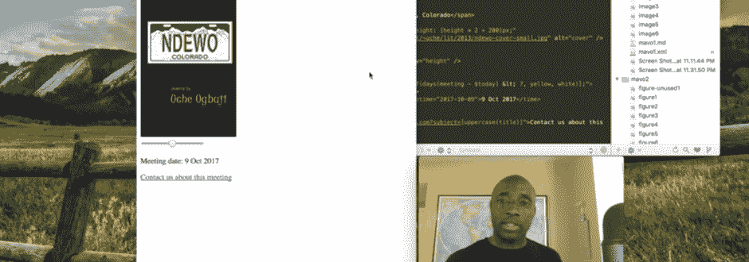
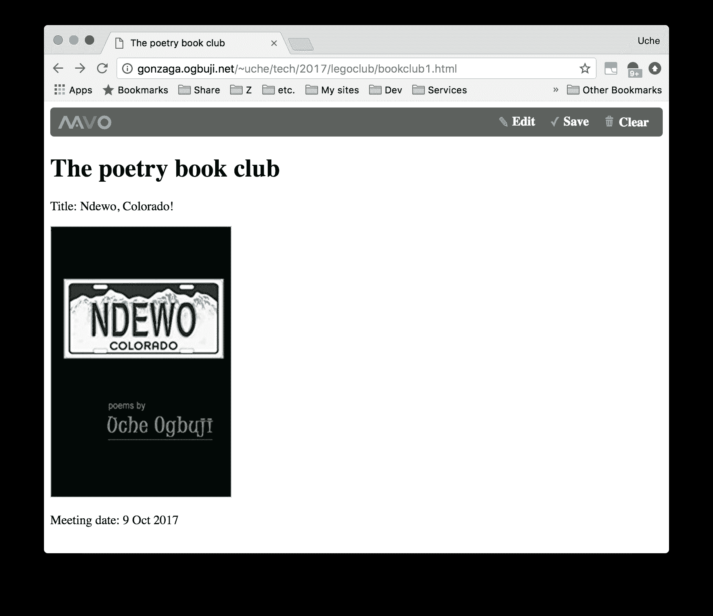
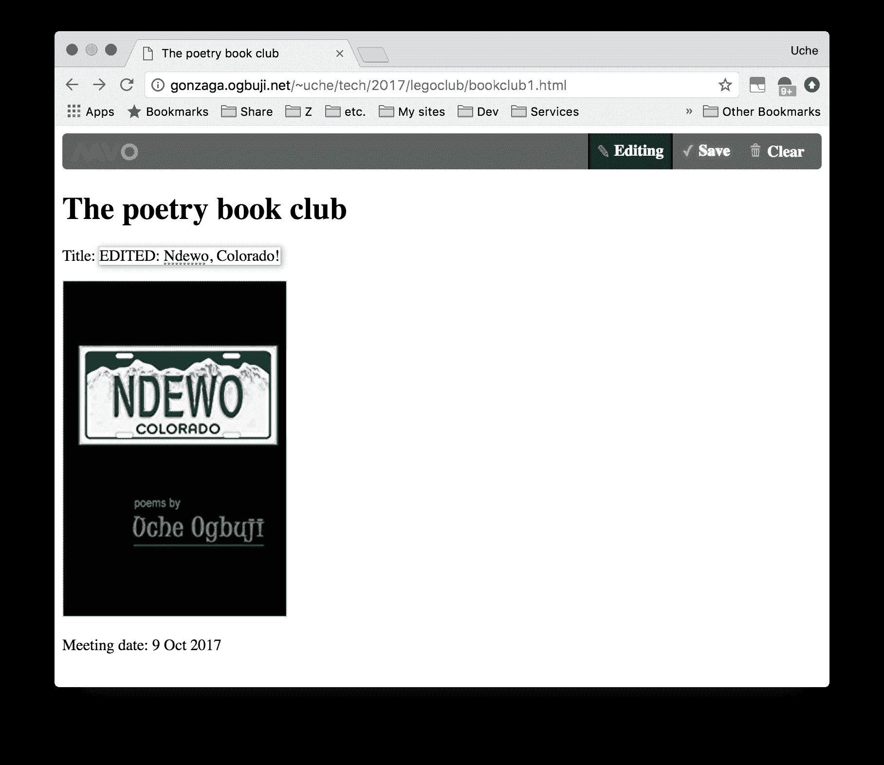
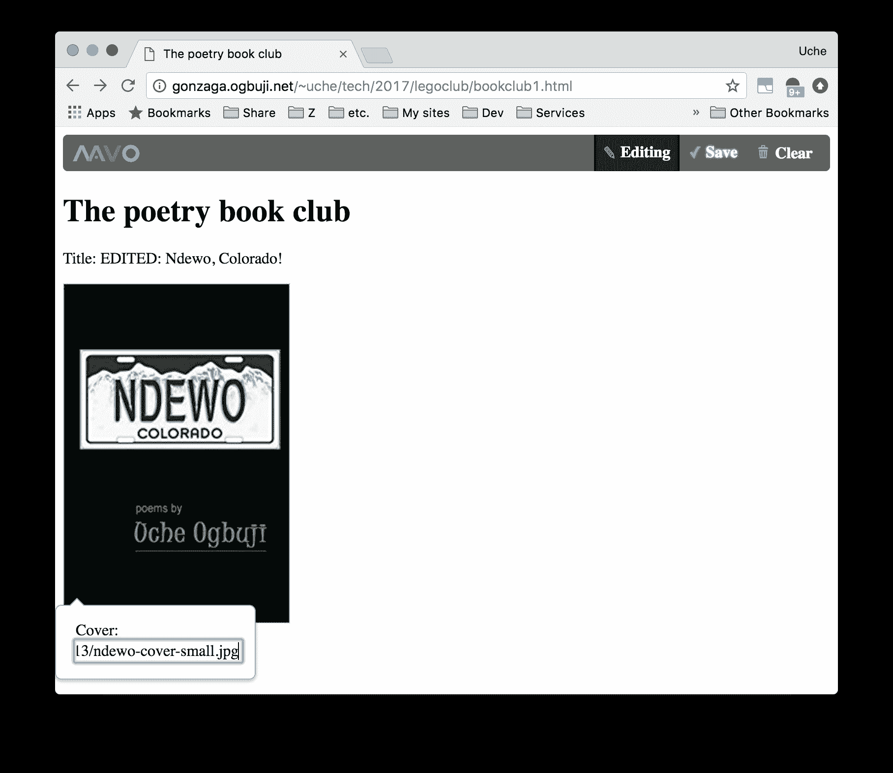
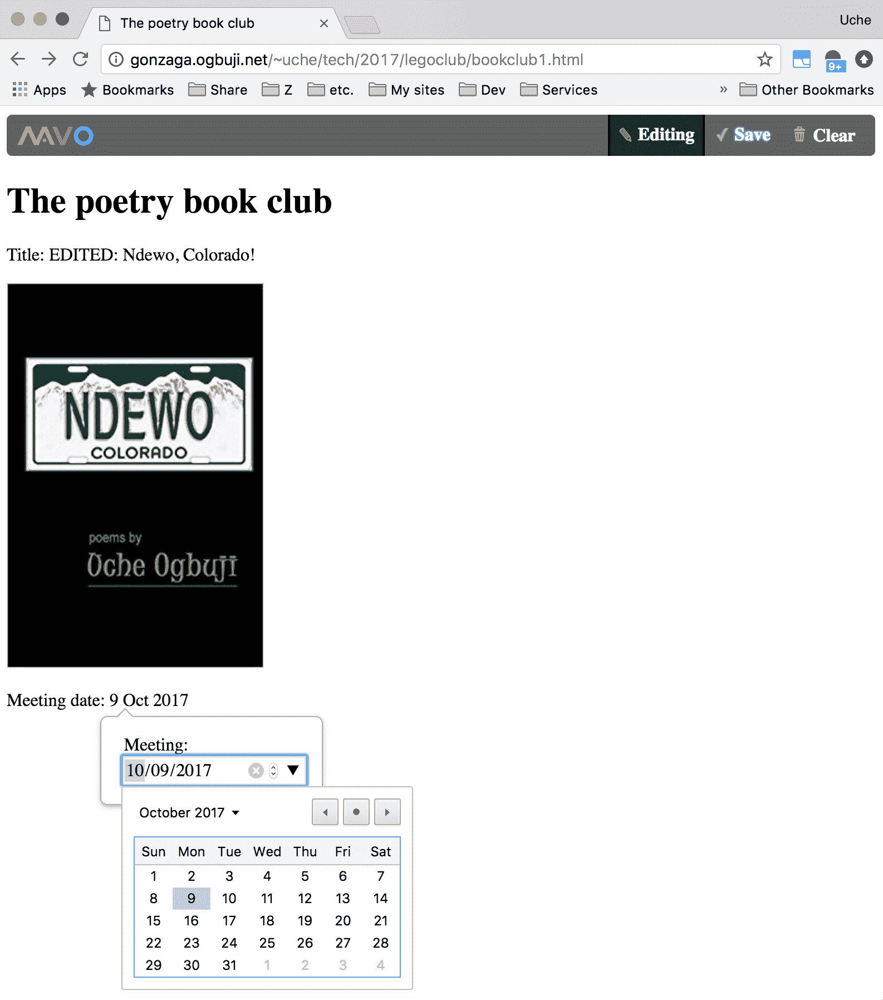
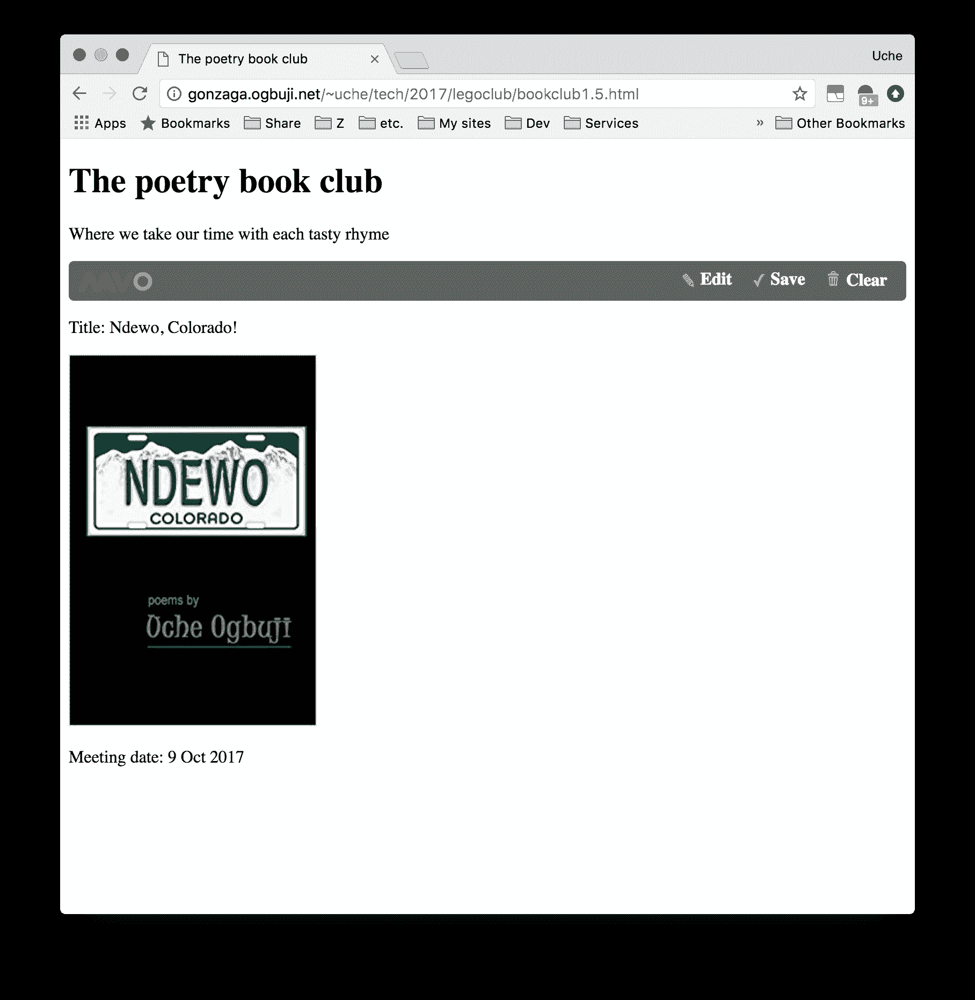
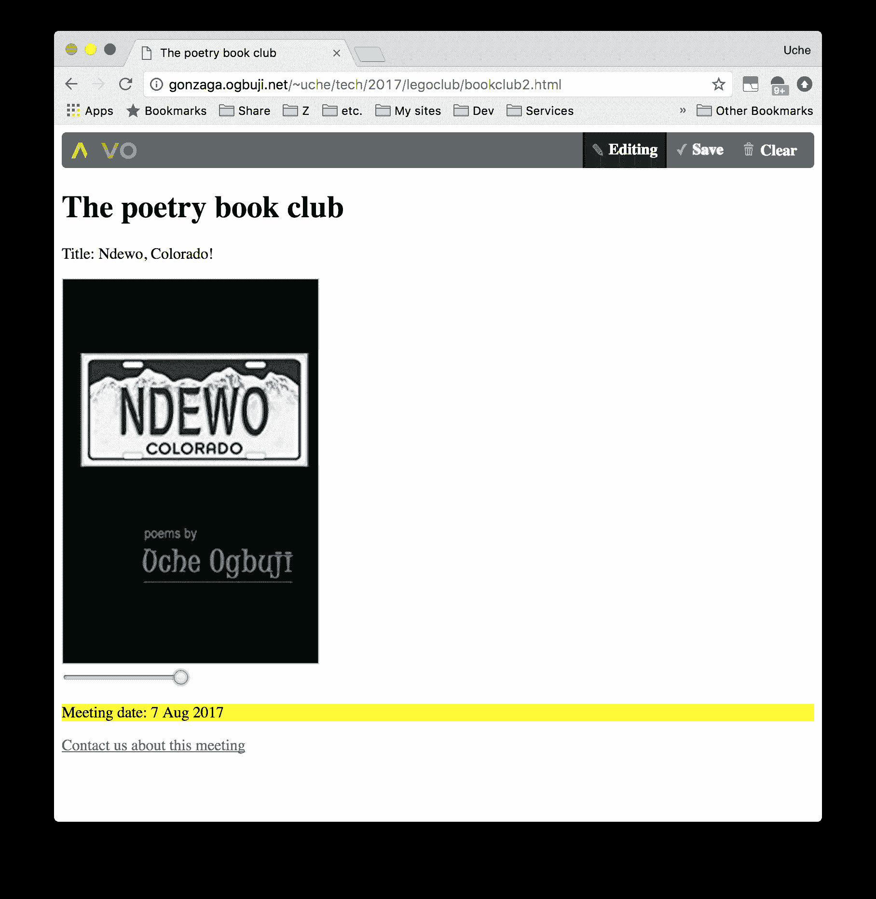

# 开源 Web 应用程序框架 Mavo 入门

> 原文：[`developer.ibm.com/zh/tutorials/wa-rapid-application-development-mavo-1/`](https://developer.ibm.com/zh/tutorials/wa-rapid-application-development-mavo-1/)

您是否在使用 HTML 时得心应手，但却对 JavaScript 有些生疏？您是否缺乏对 Web 应用程序的数据库后端进行编程的相关技能？在本教程中，您将了解如何利用开源 Web 应用程序框架 [Mavo](https://mavo.io/) 来创建 Web 应用程序，而不必编写编程代码或配置服务器后端。

Mavo 是由麻省理工学院计算机科学和人工智能实验室的 Haystack 团队创建的。该团队由 Lea Verou 领导。该项目于 2017 年 5 月推出，已提供了良好的文档记录且经过了 Beta 测试。

Mavo 为更广泛的创建者群体（特别是 HTML 用户）打开了数据驱动的 Web 应用程序开发之门。该框架扩展了 HTML，可通过直观的构造支持数据定义和操作。通过易于使用的用户界面，可编辑各种数据类型，包括数字、日期、图像、简单文本和富文本、列表等等。它的表达式语言 MavoScript 是通过研究和用户测试而精心创建的，可确保不熟悉 JavaScript 的人员能够启用 Web 应用程序中常见的数据操作。

最终，大多数 Mavo 应用程序只是 HTML 文件，您可以基于任何您喜欢的设计模板，只要它们有两个必需的 Mavo 声明行和一些样式表即可。这使得部署 Mavo 应用程序并在之后的时间里进行更改变得非常容易。只需将一些文件复制到您的 Web 主机，便可立即开始使用。

Mavo 无法替代所有应用程序开发。相反，由于该项目还不够成熟，所能处理的范围也是有限的。然而，在快速建立原型或构建简单应用程序方面，这仍不失为一种令人感到愉快且有用的方法。Mavo 易于学习和试验，因此，判断它是否满足您需求的最佳方法就是查看一些示例。

## Mavo 概述

Mavo 简要概述



[点击查看视频演示](http://v.youku.com/v_show/id_XMzQyOTUyOTY3Mg==.html)[查看抄本](https://www.ibm.com/developerworks/cn/web/wa-rapid-application-development-mavo-1/mavo1-transcript.txt)

## 编写您的第一个 Mavo 应用程序

为了让您熟悉 Mavo，我们先来看看如何在简单的页面上创建一个应用程序。首先，您需要就如何设置应用程序开发做出一些决定。

*   您是否要将 Mavo 文件下载到站点或直接通过 Mavo 站点包含这些文件？
*   您希望使用何种后端系统来存储应用程序中的任何数据更改？
*   您为应用程序选择什么标识？

### 确定在何处包含 Mavo 文件

每个 Mavo 应用程序页面都要求您使用两个特定的 Mavo 文件：一个 CSS 文件和一个 JavaScript 文件。您可以直接通过 Mavo 项目使用最新版本，如以下片段中所示：

```
<link rel="stylesheet" href="https://get.mavo.io/mavo.css"/>
          <script src="https://get.mavo.io/mavo.js"></script> 
```

也可以通过自己的站点包含这些文件：

```
<link rel="stylesheet" href="assets/style/mavo.css"/>
          <script src="assets/script/mavo.js"></script> 
```

直接从 Mavo 加载文件可确保您的应用程序始终使用最新版本，包括任何安全热修复补丁。但缺点在于，如果 Mavo 项目引入了任何不兼容项或错误，您的应用程序就可能会中断运行而不发出警告。如果您所处的环境限制您托管这两个文件，那么可能就需要直接从 Mavo 加载。

如果您不确定选择哪个选项，请直接链接到 [mavo.io](https://mavo.io/) 上的 Mavo 文件。

### 决定数据存储

您必须就数据存储位置制定计划，明确是要本地存储在浏览器上、存储在数据或代码存储库（如 Dropbox 或 GitHub）中，还是存储在数据库中。

最佳选择可能是使用外部存储，如 GitHub 或 Dropbox 存储。在您创建帐户时，请注意帐户类型在存储方面的任何限制。尽管 GitHub 通常是更注重技术的工具，但 Mavo 会摒弃细节，从而便于使用它来进行存储。

如果将数据本地存储在浏览器上，请注意，其他用户将无法查看您的更改，并且在您关闭浏览器后，所有更改都将丢失。通常，将数据存储在浏览器的本地存储中仅适用于沙箱应用程序，在这种情况下，其他用户无需查看您的更改，而且如果您的数据在会话结束时重置也无关紧要。

尽管浏览器存储空间有限，但我将在本文中使用它来向您说明 Mavo 的基础知识。在下一篇文章中，我将谈论 GitHub 存储。

掌握了 JavaScript 技能的高级开发人员也可以创建自己的存储插件，比如，数据库插件。

### 创建应用程序标识

您需要为应用程序分配一个标识，该标识将用于自动工作方式的若干细节。如果您未分配自己的标识，Mavo 将为您提供一个缺省标识，缺省标识在以后可能会使流程复杂化。

要创建标识，首先要为应用程序指定一个简短、易记的名称，然后除去字母和数字以外的任何字符，并将空格替换为下划线，最后确保得到的标识以字母或下划线开头。以下样本应用程序中的标识为”poetryclub”。

## 样本应用程序

在本文中，我将通过向您说明如何构建 Poetry Book Club 通知页面来介绍 Mavo 的基本功能。

### Mavo 应用程序元素

Poetry Book Club 应用程序代码的核心是 HTML `body` 中的 `main` 元素。 `main` 元素是内容的重要主体的容器。在此例中，它也是 Mavo 应用程序的容器结构。这由其 `mv-app` 属性来指示，该属性的值是所选的应用程序标识。完整的开始标签看起来如下所示：

`<main mv-app="poetryclub" mv-storage="local">`

这被称为 Mavo 应用程序元素或声明，可以将其放置在任何 HTML 块元素上，不仅可放置在 `main` 元素上，甚至还可放置在 `article` 或 `div` 元素上。Mavo 引入了前缀为 `mv-` 的专用属性。 `mv-storage` 属性指示应用程序所处理数据的存储位置。如果它的值为 `none` 或者该属性完全被忽略，那么将不会存储任何内容。如果如上所示，它的值为 `local` ，那么数据将存储在浏览器的本地存储中。

### Mavo 属性

在 Mavo 应用程序元素中，具有 `property` 属性的任何元素都会变成可操作且可保存的数据项。思考以下片段：

```
<p>
  <label>Title: </label>
  <span property="title">Ndewo, Colorado</span>
</p>

<p>
  <label>Meeting date: </label>
  <time property="meeting" datetime="2017-10-09">9 Oct 2017</time>
</p> 
```

在顶部 `p` 元素中， `span` 将声明和管理名为 `title` 的 Mavo 数据属性。通过 Mavo，任何 HTML 5 元素都可以管理一个属性，并且 Mavo 将根据每个元素类型的语义确定有意义的用户编辑行为。例如，在此例中，编辑模式为单行文本输入。如果一个属性改为由块元素（如 `p` ）管理，那么编辑模式将为多行文本输入。

`cover` 和 `meeting` 属性也位于上述片段中。 `img` 元素管理 `cover` ，并且编辑模式为替换图像 URL 的输入。 `time` 元素将管理 `meeting` ，并且编辑模式为日历窗口小部件。

### 完整的 Poetry Book Club 示例 1

清单 1 中显示的 bookclub1.html 是从中获取上述片段的整个 HTML 文件。

##### 清单 1\. 简单的 Poetry Book Club 通知页面

```
<!DOCTYPE html>
  <html lang="en">
  <head>
    <meta charset="utf-8">
    <title>The poetry book club</title>

    <link rel="stylesheet" href="https://get.mavo.io/mavo.css"/>
    <script src="https://get.mavo.io/mavo.js"></script>
  </head>
  <body>
    <main mv-app="poetryclub" mv-storage="local">
      <h1>The poetry book club</h1>

      <p>
        <label>Title: </label>
        <span property="title">Ndewo, Colorado</span>
      </p>
      
      <p>
        <label>Meeting date: </label>
        <time property="meeting" datetime="2017-10-09">9 Oct 2017</time>
      </p>

    </main>
  </body>
  </html> 
```

### Mavo 实际运用

在将 bookclub1.html 文件加载到浏览器中时，会显示简单的 Poetry Book Club 通知页面，如图 1 所示：

##### 图 1\. 简单的 Poetry Book Club 通知页面



请注意页面顶部的 Mavo 操作栏。在单击”Edit”按钮后，会显示编辑功能。

图 2 显示了单击”Edit”并开始更改标题字段后的页面。请注意，该按钮现已更改为”Editing”。 如果我再次单击此按钮，页面将恢复其正常查看状态，而不存在特殊编辑行为。

##### 图 2\. 用户编辑模式下的 Poetry Book Club 通知页面



在单击该图像后，会弹出一个字段，可以在其中替换 URL 和上传新图像。顺便提一下，Mavo 会要求您为每个使用属性声明的图像都提供一个 `alt` 属性。当然，这是您应该做的。

##### 图 3\. 在 Mavo 中编辑图像



在单击会议日期时，会显示一个日历窗口小部件，如图 4 所示：

##### 图 4\. 在 Mavo 中编辑日期



使用”Clear”按钮，您可以撤销在编辑会话中进行的所有更改。

如果您仔细观察，就会看到 Mavo 在编辑工具中以各种方式使用属性名称。例如，如果单击以编辑图像，那么可输入新 URL 的字段的标签即为”Cover:”，这取自属性名称。

## Mavo 表达式

既然我已向您说明了如何声明和操作数据项，下面让我们来谈谈自动化。大多数应用程序都在代码中内置了自动操作。您可以使用 Mavo 的表达式语言 MavoScript 来启用此自动化。

在本示例中，我想添加指向 Poetry Book Club 页面的链接，用于向组织者发送电子邮件并且主题行包含当前书籍的名称。为启用此自动化，我会在 Mavo 应用程序的 `main` 元素中添加以下片段。

```
<a href="mailto:poclub@example.com?subject=[title]">Contact us about this meeting</a> 
```

`[title]` 部分是 Mavo 的缺省表达式语法，您可以在 HTML 中将其替换为 `title` 数据项的值。 Mavo 的表达式十分灵活。例如，如果希望电子邮件的主题始终为大写，那么可以使用以下代码：

```
<a href="mailto:poclub@example.com?subject=[uppercase(title)]">Contact us about this meeting</a> 
```

此处， `uppercase(title)` 是 Mavo 表达式函数，用于对 `title` 的值进行操作，并将其全部转换为大写。 在此示例中，将标题”Ndewo, Colorado”转换为了”NDEWO, COLORADO”。Mavo 表达式函数有许多，它们分别可用于操作文本字符串、列表、日期和时间以及用于数学运算。 [MavoScript 上的 Mavo 文档页面提供了这些函数的完整列表。](http://mavo.io/docs/mavoscript) 您也可以使用习惯符号来表示大多数算术运算，具体如下所示。您通常需要编写可操作 HTML 文档对象模型 (DOM) 的 JavaScript 来启用这样一个功能，Mavo 因此可以立即简化开发人员的工作。

### 放置 Mavo 应用程序

无需在最外层的元素上声明 Mavo 应用程序。清单 2 是 bookclub1.5.html，这是 清单 1 的变体。此处，在 `div` 元素上声明 Mavo 应用程序，该元素位于主标题和一些附加描述性文本之后。

##### 清单 2\. 浏览器中的 Poetry Book Club 通知页面，包含备用的 Mavo 应用程序位置

```
<!DOCTYPE html>
<html lang="en">
<head>
  <meta charset="utf-8">
  <title>The poetry book club</title>

  <link rel="stylesheet" href="https://get.mavo.io/mavo.css"/>
  <script src="https://get.mavo.io/mavo.js"></script>
</head>
<body>
  <main>
    <h1>The poetry book club</h1>

    <p>Where we take our time with each tasty rhyme</p>

    <div mv-app="poetryclub" mv-storage="local">
      <p>
        <label>Title: </label>
        <span property="title">Ndewo, Colorado</span>
      </p>
      
      <p>
        <label>Meeting date: </label>
        <time property="meeting" datetime="2017-10-09">9 Oct 2017</time>
      </p>
    </div>

  </main>
</body>
</html> 
```

图 5 显示了浏览器中首次加载的 bookclub1.5.html。请注意 Mavo 应用程序栏相对于声明该应用程序时所用元素的位置。

##### 图 5\. 备用 Mavo 应用程序位置



## 数字和日期表达式及样式

让我们重新审视 Mavo 图像属性，看看如何使用 Mavo 表达式对图像执行有趣的操作。您可以将任何图像上传至 Poetry Book Club 页面。为了添加定制的图像大小，我将 `img` 元素替换为以下片段：

```


 <div>
   <input type="range" property="height" />
 </div> 
```

我在此处引入了 `height` 属性，将该属性声明为 HTML 滑块输入。Mavo 将此解释为一个控件，用于在用户滑动时设置从 0 到 100 的值。 `img` 现在具有新的 `style` 属性，用于根据 Mavo 表达式通过 CSS 声明来设置图像的高度。该表达式是基于高度的简单数学公式： `[height * 2 + 200]` 。在此例中，图像范围为 200（输入滑块处于最低设置）到 400（输入滑块处于最高设置）。

### Mavo 中的条件表达式

当距离开会时间不足一周时，我想用黄色突出显示会议日期以引起注意。为此，我将当前的日期部分替换为以下片段。

```
<p style="background-color: [if(days(meeting - $today) < 7, yellow, white)];">
  <label>Meeting date: </label>
  <time property="meeting" datetime="2017-10-09">9 Oct 2017</time>
</p> 
```

`if()` 函数使用了两到三个自变量。第一个自变量是一个条件表达式。

*   如果其值为 true 或非零，那么会将第二个自变量设置为结果值。
*   如果条件为 false 或零，并且有第三个自变量，那么该第三个自变量就用作结果值。

在此例中，条件为 `if(days(meeting - $today) < 7` 。如您所见， `meeting` 属性是会议的可编辑日期。 `$today` 是 Mavo 自动提供的多个属性之一，它始终设置为 Web 浏览器确定的当前日期。

两个日期值相减会生成相差的秒数， `days()` 函数将使用该秒数，并计算等同的天数。如果结果小于 7 天（请注意，标准的 HTML 需要将 `<` 转义为 `<` ），那么条件为 true，并且会将第二个自变量 `yellow` 设置为结果。否则，结果为 `white` 。在此例中，将页面背景样式设置为白色是一个好主意，但这是一个细节问题。

颜色自变量看起来像是属性名称。当 Mavo 发现看似属性名称的内容时，会将其替换为属性的值（如果存在这样的属性）。否则，它会逐字处理文本。如果想要确保将可能看似属性的内容处理为字面文本，您可以用引号把它引起来。以下条件采用相同的方式运行： `[if(days(meeting - $today) < 7, 'yellow', 'white')]` 。

### 完整的 Poetry Book Club 示例 2

清单 3 是 bookclub2.html，这是从中获取上述片段的整个 HTML 文件。它基于 清单 1 ，但增加了对 MavoScript 的使用。

##### 清单 3\. 使用 Mavo 表达式的 Poetry Book Club 通知页面

```
 <!DOCTYPE html>
  <html lang="en">
  <head>
    <meta charset="utf-8">
    <title>The poetry book club</title>

    <link rel="stylesheet" href="https://get.mavo.io/mavo.css"/>
    <script src="https://get.mavo.io/mavo.js"></script>
  </head>
  <body>
    <main mv-app="poetryclub" mv-storage="local">
      <h1>The poetry book club</h1>

      <p>
        <label>Title: </label>
        <span property="title">Ndewo, Colorado</span>
      </p>
      

       <div>
         <input type="range" property="height" />
       </div>

      <p style="background-color: [if(days(meeting - $today) < 7, yellow, white)];">
        <label>Meeting date: </label>
        <time property="meeting" datetime="2017-10-09">9 Oct 2017</time>
      </p>

      <a href="mailto:poclub@example.com?subject=[uppercase(title)]">Contact us about this meeting</a>

    </main>
  </body>
  </html> 
```

### 包含动态更改的 Mavo 实际运用

Web 浏览器将动态计算并应用样式更改。您可以通过 MavoScript 输入一些简洁的动态响应，这通常需要使用 JavaScript。图 6 显示了将会议日期调整为距当前日期 7 天以内并将图像大小滑块拉到最大值时页面的外观。

##### 图 6\. 使用 Mavo 表达式的 Poetry Club 通知



## Mavo 的局限性

虽然 Mavo 不会减少对程序员的需求，但它仍是一个很棒的工具，可用于创建完全在一个网页中工作的紧凑型应用程序。它的表达式语言 MavoScript 十分周密，但无法扩展 JavaScript 提供的所有功能，包括创建极其复杂的应用程序，这些应用程序需要跨网页序列维护仔细协调的用户会话。Mavo 简化服务器端存储的方法虽然很明智，但绝不适用于大多数应用程序。

### 存储的实际情况

我在本文中的示例仅使用了浏览器的本地存储，这在实践中并不十分有用。在此系列的第 2 部分中，我将向您说明如何将 GitHub 存储后端与 Mavo 配合使用。Mavo 最适用于这种”分块存储”，用户可以在此更新多组内容，然后提交所有更新进行批准。

除此之外，Web 应用程序领域还使用了其他许多存储方法。例如，在线事务数据库（如在电子商务中使用的数据库）可以处理大量用户同时进行的细粒度更改。理论上讲，您可以为 Mavo 编写数据库后端来支持这样一种模型。但在实践中，由于代码十分复杂，且需要为大多数用例调整 Mavo 内置模型的行为，这类存储因此变得过于复杂，而无法与 Mavo 一起使用。

## 让 Mavo 伴您前行

了解 Mavo 的局限性很重要，但不要让这些局限性阻碍您使用这个非常有前途的项目。Mavo 的创建团队通过细致的研究为非编程 Web 专业人员简化编程概念，着力打造令人愉快的用户体验。

Mavo 易于扩展，并且可以与 JavaScript 的全部功能充分交互。这些功能对于 Web 设计人员快速设计原型十分有用，并且可以加快部署分块存储模型非常适用的成熟应用程序。

本文翻译自：[Get started with Mavo, an open source web application framework](https://developer.ibm.com/tutorials/wa-rapid-application-development-mavo-1/)（2017-11-01）