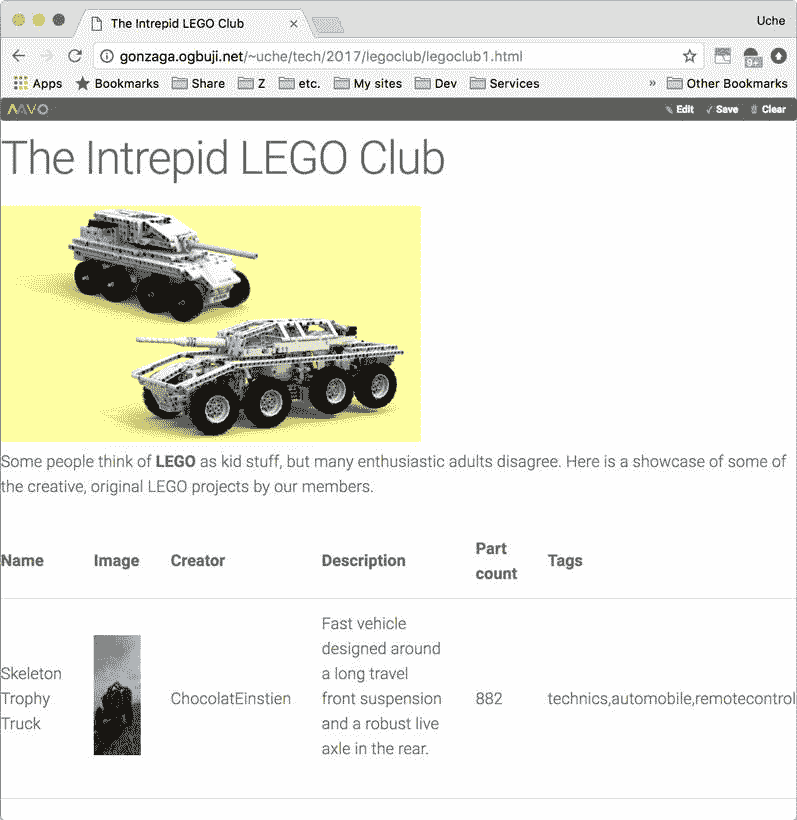

# 使用 Mavo 处理多个属性、插件和 GitHub 存储

> 原文：[`developer.ibm.com/zh/tutorials/wa-rapid-application-development-mavo-2/`](https://developer.ibm.com/zh/tutorials/wa-rapid-application-development-mavo-2/)

在此系列的第 1 部分，我介绍了用于开发数据驱动 Web 应用程序的开源框架 [Mavo](https://mavo.io/) 。Mavo 是为熟悉 HTML 但不是程序员的人而创建。借助该框架，您可以使用特殊的 HTML 属性声明数据属性，并根据底层 HTML 元素的语义通过用户编辑功能解释这些属性。同时，应用程序还能够使用简化的表达式语言来操作数据。

在本文中，我将向您说明如何：

*   使用插件扩展 Mavo 的功能。
*   创建属于项列表的属性。
*   使用 GitHub 存储 Mavo 应用程序的更新。

## 使用插件扩展 Mavo 的功能

在本文中，我使用一个乐高爱好者俱乐部网站示例来演示 Mavo 的功能。该俱乐部需要这样一个网站：成员可以在此展示他们的作品和收藏，也可以编辑俱乐部的描述。

以下视频介绍了我在创建此应用程序时采取的步骤。


[点击查看视频演示](http://v.youku.com/v_show/id_XMzQyOTUzMzUzMg==.html)[查看抄本](https://www.ibm.com/developerworks/cn/web/wa-rapid-application-development-mavo-2/mavo2-transcript.txt)

### 声明插件

以下片段截取自托管 Mavo 应用程序的 `main` 元素的顶端部分。尽管与先前文章中的示例类似，但该片段包含新属性： `mv-plugins="tinymce"`.

```
<main mv-app="legoclub" mv-storage="local" mv-plugins="tinymce">
  <header>
    <h1>The Intrepid LEGO Club</h1>
    
  </header>

  <p property="summary" class="tinymce">
    Some people think of <strong>LEGO</strong> as kid stuff, but many enthusiastic
    adults disagree.Here is a showcase of some of the creative, original LEGO
    projects by our members.
  </p> 
```

[Mavo 插件](https://plugins.mavo.io/) 扩展了 Mavo Web 应用程序框架的功能。您可以使用这些插件简化应用程序开发，若您更精通技术，也可以自行构建插件。Mavo 包含的插件之一提供了流行的富文本编辑器 TinyMCE，可供用户编辑 Mavo 属性的内容。

在上述片段中第一个突出显示的行上，包含 `mv-app` 声明的元素（在此例中为 `main` ）上存在 `mv-plugins="tinymce"` 属性。由于 Mavo 库已知该插件，因此您只需在属性中使用其名称。您可以按插件名称列出多个插件，中间用空格隔开。例如， `mv-plugins="tinymce markdown php"` 就是列出多个插件的一种方式。

### 使用插件

可以采用不同的方式使用各个插件。以 TinyMCE 插件为例，您可以使用一个 TinyMCE 类声明 Mavo 属性，在编辑模式下，此类会向用户提供富文本编辑器。在此情况下，您可以编辑 Lego Club 的摘要描述，包括添加您自己的 HTML 标记。

在图 1 的底部，您可以看到 TinyMCE 的实际运用。您可以看到针对标记的一些控件，如粗体或斜体，或者添加图像、超链接、列表等。这些全都在 Mavo 属性元素中转变为 HTML。此处，我已进入编辑模式，并且单击了摘要属性的段落。

##### 图 1\. TinyMCE 实际运用


## 多个属性

截止目前，我们仅查看了每个名称具有一个值的属性。现实世界信息更为复杂。Mavo 支持多个属性，当您具有列表中的多个项、表中的一组行或一些其他集合时，可以使用多个属性。

LEGO Club 的页面包含数据集合，每个数据都是其中的一名成员搭建的作品。以下片段显示了存储这样一个集合的 HTML 表的代码。

```
<tbody>
  <tr mv-multiple>
    <td><span property="name">Skeleton Trophy Truck</span></td>
    <td></td>
    <td><span property="creator">ChocolatEinstien</span></td>
    <td><p property="description" class="tinymce">
      Fast vehicle designed around a long travel front suspension and a robust
      live axle in the rear.</p></td>
    <td><span property="partcount">882</span></td>
    <td><span property="tags">technics,automobile,remotecontrol</span></td>
  </tr>
</tbody> 
```

请注意第 2 行中的新属性 `mv-multiple` 。该声明指示 Mavo 将该元素视为用户可以多次使用的元素。您可以将该元素的初始表单用作模板，由此创建其他项。该模板元素中的属性可供用户对其他各个项进行编辑。父元素（在此例中为 `tbody` ）将成为集合中所有项的容器。

另外，还请注意第 8 行上对 `tinymce` 类的使用。这意味着可以将 `description` 属性作为每个项的富文本进行编辑，并且可以将其作为 HTML 内容进行存储。

### LEGO Club

以下是 `legoclub1.html` 中的 HTML 头部信息。

```
<head>
  <meta charset="utf-8">
  <title>The Intrepid LEGO Club</title>

  <link rel="stylesheet" href="https://get.mavo.io/mavo.css"/>
  <script src="https://get.mavo.io/mavo.js"></script>

  <link rel="stylesheet" href="https://fonts.googleapis.com/css?family=Roboto:300,300italic,700,700italic">
  <link rel="stylesheet" href="https://cdnjs.cloudflare.com/ajax/libs/normalize/5.0.0/normalize.css">
  <link rel="stylesheet" href="https://cdnjs.cloudflare.com/ajax/libs/milligram/1.3.0/milligram.min.css">
  <link rel="stylesheet" href="legoclub.css">
</head> 
```

从强大的 HTML 可以看出，Mavo 可以与其他页面设计框架配合使用。请注意，现在这里有来自极简主义 [milligram](http://milligram.io/) 框架的 CSS 声明。您也可以看到托管乐高作品集合的整个表结构，包括头部信息。

## 集合编辑实际运用

将 `legoclub1.html` 以及来自本文 [代码库](https://github.com/uogbuji/ibmdw/tree/master/mavo) 的 `legoclub.css` 部署到您选择的 Web 主机，在浏览器中加载该 HTML 文件时，您应该会看到类似图 2 的内容。

##### 图 2\. LEGO Club 页面 – legoclub1.html 的浏览器视图



首先，引导模板项是表的唯一内容。在您单击 Edit 按钮后，您首先将会注意到位于表底部的”Add Collection”按钮，如图 3 所示。

##### 图 3\. 用户正在编辑模式下添加集合


在您单击此按钮后，就会添加一个空表行，具有基于字段名称的占位符，以便指导您进行编辑，如图 4 所示。

##### 图 4\. 用户准备好添加集合项


在您填写详细信息后，单击 Save，然后单击”Editing”按钮以切换。集合中有两个项，如图 5 所示。

##### 图 5\. 包含已添加集合项的 LEGO Club 页面


## 玩转条件语句

Mavo 的妙招之一就是通过特殊属性使 URL 查询参数可用于表达式。在此功能的众多可能用途中，您可以创建一个超级简单的搜索功能。

假设您已将 LEGO Club 部署到以下 URL： `http://example.org/legoclub/legoclub.html` 。您可能希望仅根据集合项的标签来显示集合项。例如，您可以使用以下 URL 来仅显示标记为”military”的项： `http://example.org/legoclub/legoclub.html?tag=military` 。

组件 `?tag=military` 是一个查询参数，Mavo 使其以 `$url.tag` 形式用于表达式。

`$url` 是一个始终保存 URL 的特殊属性，该 URL 指向包含 Mavo 应用程序的页面。它还可以与句点以及任何查询参数的名称（如 `tag` ）一起使用。

如果您按照如下所示更改 HTML 源文件中的表（摘录自本文代码中的 `legoclub2.html` ），那么可以让应用程序仅显示包含所提供标签的集合项。

```
<tbody>
  <tr mv-multiple class="[if($url.tag and search(tags, $url.tag) = -1, hidden)]">
    <td><span property="name">Skeleton Trophy Truck</span></td>
    <td></td>
    <td><span property="creator">ChocolatEinstien</span></td>
    <td><p property="description" class="tinymce">
      Fast vehicle designed around a long travel front suspension and a robust
      live axle in the rear.</p></td>
    <td><span property="partcount">882</span></td>
    <td><span property="tags">technics,automobile,remotecontrol</span></td>
  </tr>
</tbody> 
```

### If this, then that

第 2 行中添加的 `class` 属性使用了 Mavo 表达式 `[if($url.tag and search(tags, $url.tag) = -1, hidden)]` 。该条件首先检查是否已提供 `tag` 查询参数。如果已提供，就会使用 `search` 函数在该项的完整 `tags` 属性中搜索 `tag` 查询参数值。请记住，`tr` 元素会充当集合中每个项的模板。此条件适用于每个项。

用于集合的 `tags` 属性值为最后包含的属性中的值，这也在上文中进行了突出强调。Mavo 在查找使用它的表达式的最接近属性值方面非常聪明，即使存在多个都具有该属性的项，也仍然如此。

`search` 函数使用两个自变量。它将返回第二个自变量显示在第一个自变量字符串中的位置。如果在第一个字符串中未找到第二个字符串，那么将返回 -1。如果已编辑页面来添加第二个项，如 图 2 所示，`tags` 属性值为 `technics,automobile,military,remotecontrol` ，那么将在查询参数中找到标签 `military` 。`search` 函数结果不会为 -1，因此不满足条件，结果类属性将为空。

在初始项例子中 `tags` 属性值为 `technics,automobile,remotecontrol` ，此时不会找到字符串 `military` ， `search` 函数结果 **将** 为 -1，因此 **可以** 满足条件，并且结果类属性将为 `hidden` 。

为了能够最终完成，legoclub.css 包含以下片段。

```
.hidden{
  display: none;
} 
```

这可确保如果该条件导致类名为 `hidden` ，将不会显示相关项的表行。

## GitHub 存储

到目前为止，在本文和前一篇文章中，我已向您展示了使用浏览器的本地存储的示例。大多数现实世界应用程序都需要可共享且持续时间比单次会话时间要长的多用户存储。利用 Mavo，您能够通过类似 GitHub 和 Dropbox 这样的数据存储库来访问该长期存储。让我们来看看如何将 Mavo 与 GitHub 存储一起使用。

首先，您需要创建一个免费的 [GitHub 帐户](https://github.com/) 。GitHub 是一个主要供程序员使用的工具，看起来有点复杂，但不要害怕。您只需要了解一些有关如何使用此 Mavo 功能的基础知识。

请注意，希望在您的 Mavo 应用程序中更新数据的任何人，也都需要一个 GitHub 帐户。最好不要共享 GitHub 登录信息，因为这将难于跟踪更改和管理工作流程。

### 更新 LEGO Club 应用程序

为了让 LEGO Club 应用程序使用我的 GitHub 存储，我更改了 Mavo 声明元素。以下片段摘自本文代码库中的 `legoclub-gh.html` 。

```
<main mv-app="legoclub" mv-storage="https://github.com/uogbuji/ibmdw/mavo/legoclub"
      mv-plugins="tinymce"> 
```

`mv-storage` 属性现在是完整的 URL，以服务 `https://github.com` 开头，然后指定我的帐户 `uogbuji` 。将我的帐户名称替换为您自己的帐户名称或组织的帐户，这是 GitHub 提供的一个功能。

该 URL 的下一部分是存储库 `ibmdw` 。这是一致管理的代码或数据的集合。您可以在存储库中具有多个文件夹。在此例中，我具有包含 `legoclub` 文件夹的 `mavo` 文件夹。鉴于这种 URL 模式，Mavo 会在指定的文件夹中将数据保存为 JSON，并采用 `APPNAME.json` 格式。因此，这里的应用程序数据会存储在 `https://github.com/uogbuji/ibmdw/mavo/legoclub/legoclub.json` 中。

### GitHub 存储实际运用

当您或您的任何用户首次使用具有 GitHub 存储 Mavo 声明（如上所述）的应用程序时，将会看到一个”Login”按钮。单击”Login”可启动将 Mavo 应用程序连接到您的 GitHub 帐户的过程。此过程的第一步是作为一个整体向 Mavo 框架授予 GitHub 集成权限。您只需对第一个 Mavo 应用程序执行此操作。

图 6 是生成的弹出窗口的示例。

##### 图 6\. Mavo 框架和 GitHub 集成弹出窗口


在完成此操作后，每个 Mavo 应用程序都需要对每个用户执行单独的附加认证步骤。图 7 是该弹出窗口的示例。

##### 图 7\. Mavo 应用程序和 GitHub 集成弹出窗口


在您登录后，将重新显示三个 Mavo 按钮，后跟”Logout”按钮。Mavo 栏还会指示已链接到 Mavo 应用程序的 GitHub 用户帐户。图 8 显示此状态下的 Mavo 栏。

##### 图 8\. GitHub 登录后的 Mavo 栏


您的应用程序用户现在可以进行编辑，如添加新的集合项。在他们单击”Save”后，将会弹出一个窗口，表明所做更改将保存至各自的概要文件中，其他人无法查看这些更改。如果想让其他人看到所做更改，用户可以单击”Send edit suggestion”，提名将其编辑纳入应用程序中。图 9 显示了此步骤。

##### 图 9\. 将 Mavo 编辑保存为应用程序所有者建议的对话框


用户通常会通过自己的 GitHub 帐户来修改应用程序。为了管理来自用户建议的工作流程，Mavo 使用 GitHub 的”拉取请求”功能。拉取请求包含用户希望进行的数据更改的详细信息。应用程序所有者或对 GitHub 存储库具有写访问权的其他任何人都可以查看拉取请求中的更改，并选择将这些更改纳入共享的公共应用程序数据中。在启动此过程后，用户将看到一条通知，如图 10 所示。

##### 图 10\. 给所有者的将 Mavo 编辑另存为应用程序的确认信息


在 GitHub 上进行其余更改过程。应用程序所有者或具有写访问权的任何人都将收到包含建议更改的通知。他们可以单击以进行浏览、复查提议的更改，如果需要，还可以通过评论与用户交谈。所有者可以批准更改，或者关闭请求而不予以批准，后者将拒绝该请求。图 11 是一个 GitHub 页面，显示了提出更改建议的用户（贡献者）与存储库所有者之间的互动。

##### 图 11\. 用于 Mavo 更改的 GitHub 拉取请求功能


请注意用于预览更改的链接。如果结果看起来正确，您可以单击”Merge pull request”来接受更改。

如果您超出了 Mavo 所提供的预览范围，GitHub 拉取请求可能会十分复杂。这些复杂问题在实践中更容易处理。

## 揭开数据的神秘面纱

缺省情况下，Mavo 会将应用程序数据存储为 JSON 格式。与 Mavo 的许多方面一样，这完全可以定制。Mavo 还支持 CSV 和纯文本格式，但有一些限制。通过插件可使用其他数据格式。您不必了解 JSON 即可使用 Mavo，但如果您最终要充分使用 Mavo，那么了解此格式会十分有用。

以下代码片段显示了最初在 legoclub.html 中设置的数据的 Mavo 表示：

```
{
    "collection": [
        {
            "name": "Skeleton Trophy Truck",
            "image": "https://m.rebrickable.com/media/cache/f7/f4/f7f4d3add5ada3b2e65e177aefb4dd4c.jpg",
            "creator": "ChocolatEinstien",
            "description": "Fast vehicle designed around a long travel front suspension and a robust live axle in the rear.",
            "partcount": "882",
            "tags": "technics,automobile,remotecontrol"
        }
    ]
} 
```

如果向 LEGO 表添加第二行，数据看起来将如下所示：

```
{
    "collection": [
        {
            "name": "Skeleton Trophy Truck",
            "image": "https://m.rebrickable.com/media/cache/f7/f4/f7f4d3add5ada3b2e65e177aefb4dd4c.jpg",
            "creator": "ChocolatEinstien",
            "description": "Fast vehicle designed around a long travel front suspension and a robust live axle in the rear.",
            "partcount": "882",
            "tags": "technics,automobile,remotecontrol"
        },
        {
            "name": "Rooikat XL",
            "image": "http://gonzaga.ogbuji.net/~osi/elements/rooikatxl.png",
            "creator": "ChocolatEinstein",
            "description": "Rooikat XL has all four rear wheels powered, either with differential for max speed, or without for max South African Veldt fun.",
            "partcount": "1157",
            "tags": "technics,automobile,military,remotecontrol"
        }
    ]
} 
```

当用户通过 Mavo GitHub 存储发送编辑建议时，请求会将第一个数据集更改为第二个数据集，但 Mavo 预览功能会尝试保护您，使您不必直接处理此事宜。

## 结束语

GitHub 的编辑批准流程可能会令一些用户感到不安。 我将 Mavo 的适用性描述为适用于具有”分块”存储模式的应用程序，其中，用户有时会进行一批更改，这些更改可同时纳入程序。虽然可以使用插件对更细粒度的存储进行编码，但目前，这是 Mavo 作为应用程序框架所存在的一大限制。

由于 Mavo 的基本理念适用面非常之广，它的发展变化令我激动不已。在这些文章中，我向您说明了如何使用 Mavo 的简单声明将任何 HTML 元素转变为数据操作窗口小部件，包括如何表示具有多个项的集合。希望您已了解如何使用 MavoScript 构造额外的操作，以及如何对多用户应用程序使用 GitHub 存储后端。既然您已亲眼看到使用 Mavo 是多么容易，我希望下次您需要快速实践 Web 应用程序构想时，会考虑使用 Mavo。

本文翻译自：[Handle multiple properties, plugins, and GitHub storage with Mavo](https://developer.ibm.com/tutorials/wa-rapid-application-development-mavo-2/)（2017-11-01）