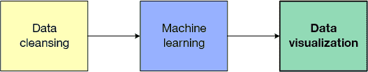
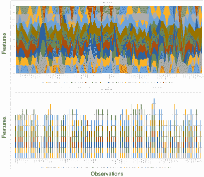
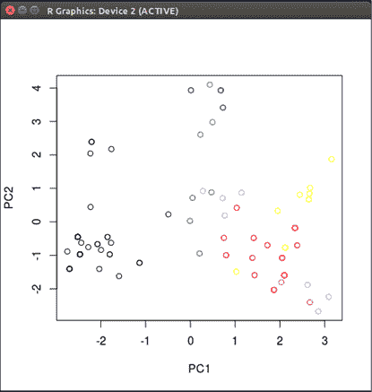
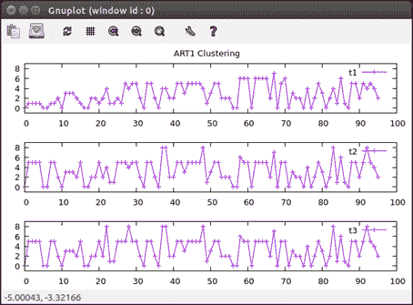
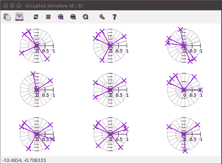
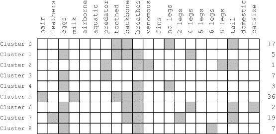
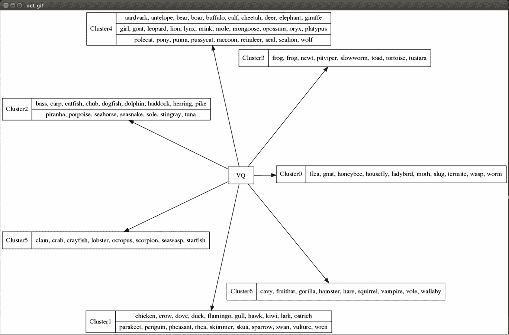

# 可视化数据

> 原文：[`developer.ibm.com/zh/tutorials/ba-cleanse-process-visualize-data-set-3/`](https://developer.ibm.com/zh/tutorials/ba-cleanse-process-visualize-data-set-3/)

一位智者曾说过：“一图胜千言”。的确如此，因为：与浏览一个庞大的数据表相比，一张图片或一个图表可以在较短的时间里揭示大量信息。在本教程中，我将探索一些可用来实现数据可视化的方法，包括 R 编程环境、gnuplot 和 Graphviz。

本系列的上一篇教程探索了用于实现数据聚类的机器学习算法。本教程是该系列的第 3 部分，将重点介绍数据可视化（参见 图 1）。

##### 图 1.数据处理管道



在第 2 部分中，我使用了两个算法对一个已清理的数据集进行聚类：矢量量化和自适应共振理论。对结果集群数据执行可视化的方法有许多，但可供可视化的原始数据也有许多，比如实现聚类的运算过程。

数据可视化一半是艺术，一半是科学。它不仅仅关乎绘图样式或色彩模式；还关乎如何艺术性地将数据汇集起来，以传达信息或某种洞察。可视化数据的选项有很多，从标准的线图、条形图、饼图和面积图到更复杂的雷达图、极点图、弦图和树图。但是，无论您选择哪种可视化类型，您想要可视化的数据都必须与所选方法相匹配，这样观察者才能理解或获取洞察。换句话说，询问一个问题，然后让可视化图形来回答这个问题。

考虑可视化图形的受众也很重要。这种考虑应该超出您的受众的技术背景，以包含受众可能存在的任何限制。例如，全球约 1/12 的男性和 1/200 的女性患有某种形式的色盲症。色彩很有用且用途广泛，但通过色彩可视化数据并不适用于所有人。 可视化原始数据集

在本系列的第 1 部分和第 2 部分中，我使用了动物园数据集作为通过机器学习算法来执行数据清理和聚类的例子。动物园数据集包含 101 个特征矢量，每个矢量包含 18 个特征（动物名称、类、腿数和 15 个二进制特征）。与生产数据集相比，该数据集虽然非常小，但无法轻松可视化。图 2 （使用 Microsoft® Excel 描绘）通过两种格式显示了整个数据集：堆栈面积图和堆栈条形图。水平轴显示了（每个动物的）观察值，垂直轴表示特征。除了动物拥有多样化特征这一事实之外，您无法从此可视化图形获得太多信息。

##### 图 2\. 可视化整个动物园数据集



可视化高维数据的一种通用方法是减少数据集的维数。实现降维的一种方法称为主成份分析 (PCA)。PCA 是一个统计过程，它通过对一组观察值或相互关联的变量应用正交变换，将该数据转换为一组线性无关的值（称为主成份），以便创建一个低维可视化图形（包含 2 个或 3 个维度）。

在本示例中，我使用了 R 编程语言，这是一种用于实现统计计算和可视化的环境。如 清单 1 所示，我从其源代码中读取数据帧并表明它是一个逗号分隔的值数据集。键入数据帧的名称就会显示被读取和解析的数据集。我使用 factor 命令从数据集中提取类（数据集的最后一列），然后创建一个仅包含每个观察值的特征的特征帧（该帧然后会显示出来，该显示省略了名称和类）。

##### 清单 1\. 结合使用 R 和 PCA 来减少维数

```
> zooDataset <- read.table("https://archive.ics.uci.edu/ml/machine-learning-databases/zoo/zoo.data", sep="," )
> zooDataset
          V1 V2 V3 V4 V5 V6 V7 V8 V9 V10 V11 V12 V13 V14 V15 V16 V17 V18
1   aardvark  1  0  0  1  0  0  1  1   1   1   0   0   4   0   0   1   1
2   antelope  1  0  0  1  0  0  0  1   1   1   0   0   4   1   0   1   1
3       bass  0  0  1  0  0  1  1  1   1   0   0   1   0   1   0   0   4
4       bear  1  0  0  1  0  0  1  1   1   1   0   0   4   0   0   1   1
...
99      wolf  1  0  0  1  0  0  1  1   1   1   0   0   4   1   0   1   1
100     worm  0  0  1  0  0  0  0  0   0   1   0   0   0   0   0   0   7
101     wren  0  1  1  0  1  0  0  0   1   1   0   0   2   1   0   0   2
> zooClasses <- factor(zooDataset$V18)
> zooFeatures <- zooDataset[c(2:17)]
> zooFeatures
    V2 V3 V4 V5 V6 V7 V8 V9 V10 V11 V12 V13 V14 V15 V16 V17
1    1  0  0  1  0  0  1  1   1   1   0   0   4   0   0   1
2    1  0  0  1  0  0  0  1   1   1   0   0   4   1   0   1
3    0  0  1  0  0  1  1  1   1   0   0   1   0   1   0   0
4    1  0  0  1  0  0  1  1   1   1   0   0   4   0   0   1
...
99   1  0  0  1  0  0  1  1   1   1   0   0   4   1   0   1
100  0  0  1  0  0  0  0  0   0   1   0   0   0   0   0   0
101  0  1  1  0  1  0  0  0   1   1   0   0   2   1   0   0
> zooPCA <- prcomp( scale( zooFeatures[,-1] ) )
> plot(zooPCA$x[,1:2], col=zooClasses)
> 
```

清单 1 中的最后两步是 PCA 的核心部分。我使用 prcomp 命令在给定数据上执行 PCA，该数据是我使用 scale 命令从我的特征数据帧扩展得到的。然后，我使用 zooClasses 帧定义的类来描绘来自 PCA 对象的前两个特征矢量，以便实现彩色化。得到的二维 (2D) 图如 图 3 所示。

##### 图 3\. 使用 PCA 从两个维度描绘动物园数据集



请注意，通过 PCA 减少维数时会丢失数据，所以您不能使用结果图来实现聚类。但是，该图保留了数据中最重要的差异，因此对此用途很有用。其他降维方法包括内核 PCA 和线性判别分析。

## 可视化运算过程

查看机器学习算法的元数据可能很有帮助。例如，可以查看该算法在算法迭代中为每个观察值选择的类。图 4 中的堆栈线图显示了在 ART1 聚类过程的 3 次迭代中的观察值（水平轴）和类（垂直轴）。

##### 图 4\. ART1 聚类数据（各次迭代中的类成员）



回想一下上一篇文章，ART1 最初没有集群，并允许在发现无法放入现有集群的新观察值时创建集群。在第一次迭代中（参见 图 4 顶部的图），可以看到第一个观察值被放在集群 0 中；然后，接下来 4 个观察值被放在集群 1 中。警戒参数可用作创建新集群的界线，将 9 个观察值的集群数量控制到 2 个。在 图 4 的最后一个线图中，可以看到观察值已移到了新集群中，因为在本例中存在 4 个集群（已在上一次迭代中创建）。随着第一次迭代继续，您可以看到，创建新集群的界线慢慢被抑制，在第 70 个观察值之前，创建了 8 个集群。

图 4 中的堆栈图将您的注意力吸引到每次迭代之间的差异上。在第一次迭代中，可以看到在遇到观察值时创建了集群。在第二次迭代（中间图）中，针对原型矢量计算了所有观察值，并做了较大的移动。到最后一次迭代时，只有少数观察值移到新类中。

图 4 是在 gnuplot 中创建的，gnuplot 是一个可移植、命令行驱动的实用绘图工具。清单 2 中的示例表明请求了一个 multiplot（也就是说，在一张图中绘制多个图），其中包含 3 个 linespoints 类型的图（也就是说，在线条之间包含点）。末尾的 pause 命令在屏幕上显示该图，直到我解除该命令。每个数据文件的每行 (t*.dat) 都是一个样本，其中的样本表示观察值的类。

##### 清单 2\. ART 聚类进度的堆栈线图

```
set multiplot layout 3,1 title "ART1 Clustering"
set yrange [-1:9]
plot 't1.dat' with linespoints title 't1'
plot 't2.dat' with linespoints title 't2'
plot 't3.dat' with linespoints title 't3'
unset multiplot
pause -1 
```

ART1 算法中的重要元数据的另一个来源是原型矢量本身。回想一下，原型矢量是集群的“质心”，如果一个观察值满足 ART1 成员条件，那么它就是该集群的一部分。因为 ART1 仅处理二进制数据，所以每个原型矢量都是一个包含 21 个二进制特征的一维矢量，如果其中的某个特征与该集群相关，就会设置该特征。图 5 使用通过 gnuplot 描绘的 multiplot 雷达图提供了这些原型矢量的可视化结果。对于 9 个现有的集群，这些雷达图显示了组成原型矢量的特征。这个图没有具体指定每个集群的特征矢量，而是演示了集群使用的特征的多样性（在一些情况下，相同的特征被多个集群使用；在另一些情况下，该特征仅被一个集群使用）。

##### 图 5\. ART1 原型矢量的雷达（或蜘蛛）图



清单 3 中所示的 gnuplot 脚本生成了 图 5 中的图。这个图使用 multiplot 生成 9 个图和极坐标。每个数据文件都包含给定集群的原型特征矢量，每个特征对应一行（第一个参数是以 17.14 为增量的度数；第二个参数是特征二进制值）。

##### 清单 3\. gnuplot 中的雷达图脚本

```
unset border
set polar
set angles degrees

set style line 10 lt 1 lc 0 lw 0.3

set grid polar 17.14
set grid ls 10

set xtics axis format "" scale 0
set ytics axis format ""

set size square

set style line 11 lt 1 lw 2 pt 2 ps 2

set multiplot layout 3,3

plot 'cluster1.txt' using 1:2 t "" w lp ls 11
plot 'cluster2.txt' using 1:2 t "" w lp ls 11
plot 'cluster3.txt' using 1:2 t "" w lp ls 11
plot 'cluster4.txt' using 1:2 t "" w lp ls 11
plot 'cluster5.txt' using 1:2 t "" w lp ls 11
plot 'cluster6.txt' using 1:2 t "" w lp ls 11
plot 'cluster7.txt' using 1:2 t "" w lp ls 11
plot 'cluster8.txt' using 1:2 t "" w lp ls 11
plot 'cluster9.txt' using 1:2 t "" w lp ls 11

unset multiplot

pause -1 
```

但是，有时候越简单越好。构造一种简单的可视化图形，它能够提供一种更简单的视图和一种比较集群的方法，来生成更多信息。考虑 图 6 中的可视化图形：该图形显示了来自 图 5 的原型矢量，但这些矢量被一起可视化，这样可以进行更简单的比较。您可以看到一些从未使用的特征（空气传播、水生、鳍、5 条腿），以及常用的特征（产卵数量和呼吸方式）。

##### 图 6\. ART1 的原型矢量



该图的右侧是集群的观察值数量。在一种情况下，一个观察值（“scorpion”）形成了一个集群。它的特征矢量非常独特，以至于 ART1 将它隔离到自己独有的集群中（这是一种错误做法，因为蝎子是一种无脊椎动物，因此是包含其他 9 个观察值的该类的成员之一）。集群 5 表示哺乳动物，但有 5 个观察值被归为别的类型。

## 可视化集群

在最终的可视化图形中，我考虑采用构造一种数据表示的非传统方法。在这个可视化图形中，我使用 Graphviz 包生成了一个图，该图表示了矢量量化算法生成的集群（参见图 7）。

##### 图 7\. 通过 Graphviz 可视化集群



在图 7 中，可以看到一个中心（被定义为算法 VQ），以及形成了 7 个集群的算法。每个集群都被定义为一条记录，包含集群编号和组成该集群的动物。作为一种图形语言，您可以了解如何使用图形语义构造该图形。VQ 被定义为一个节点，-> 运算符被用于在 VQ 节点与 Cluster_0 节点之间绘制一条边。每个集群都是根据记录来构造的，这样就可以对多个元素进行分组。清单 4 给出了相关代码。

##### 清单 4\. 用于构造图 7 中的图形的 Graphviz dot 文件 (vq.dot)

```
digraph G {
size="16,16";
overlap=scale;
fontsize=8;
VQ [shape=box center=true];
node [shape=record];
VQ -> Cluster_0
Cluster_0 [ label = "Cluster0 | { flea, gnat, honeybee, housefly, ladybird,
                                  moth, slug, termite, wasp, worm } " ]
VQ -> Cluster_1
Cluster_1 [ label = "Cluster1 | { { chicken, crow, dove, duck, flamingo,
                                    gull, hawk, kiwi, lark, ostrich } |                                
                                  { parakeet, penguin, pheasant, rhea,
                                    skimmer, skua, sparrow, swan, vulture,
                                    wren } }" ]
VQ -> Cluster_2
Cluster_2 [ label = "Cluster2 | { { bass, carp, catfish, chub, dogfish,
                                    dolphin, haddock, herring, pike } |
                                  { piranha, porpoise, seahorse, sea snake,
                                    sole, stingray, tuna } }" ]
VQ -> Cluster_3
Cluster_3 [ label = "Cluster3 | frog, frog, newt, pit viper, slowworm, toad,
                                tortoise, tuatara" ]
VQ -> Cluster_4
Cluster_4 [ label = "Cluster4 | { { aardvark, antelope, bear, boar, buffalo,
                                    calf, cheetah, deer, elephant, giraffe} |     
                                  { girl, goat, leopard, lion, lynx, mink,
                                    mole, mongoose, opossum, oryx, platypus} |                                 
                                  { polecat, pony, puma, pussycat, raccoon,
                                    reindeer, seal, sea lion, wolf } }" ]
VQ -> Cluster_5
Cluster_5 [ label = "Cluster5 | clam, crab, crayfish, lobster, octopus,
                                scorpion, sea wasp, starfish" ]
VQ -> Cluster_6
Cluster_6 [ label = "Cluster6 | cavy, fruit bat, gorilla, hamster, hare,
                                squirrel, vampire, vole, wallaby" ]
} 
```

为了生成 图 7 中的图，Graphviz 调用了以下命令：

```
$ neato -Tgif -o out.gif vq.dot 
```

dot 命令生成有向图的分层结构，但 neato 更适合使用弹簧模型布局的无向图（其中的边对应于弹簧，顶点对应于受到同等控制的主体）。这两个实用工具都包含在 Graphviz 包中。

## 结束语

本教程探索了可视化数据的一些更有用的应用，以及一些可用来生成这种可视化图形的方法。R 编程语言是一种处理和可视化数据的得到广泛应用的流行解决方案，也是数据科学家工具箱中的常见工具。Gnuplot 是另一个流行的可视化应用程序，它提供了各种各样的绘图选项。最后，Graphviz 是以图形形式生成数据的理想解决方案。

本文翻译自：[Visualizing data](https://www.ibm.com/developerworks/opensource/library/ba-cleanse-process-visualize-data-set-3/index.html)（2018-01-17）