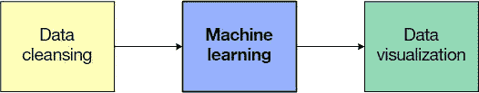
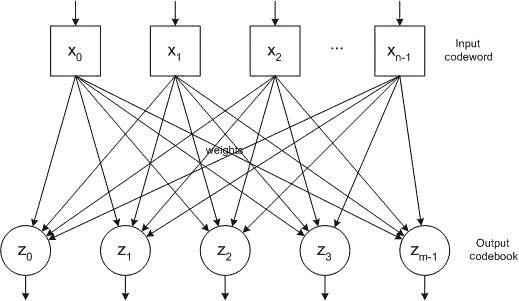
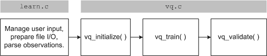
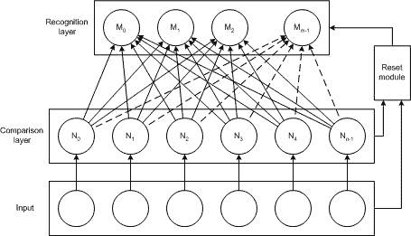
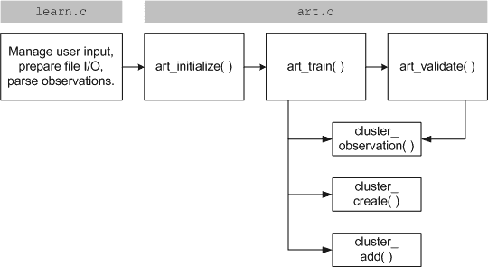
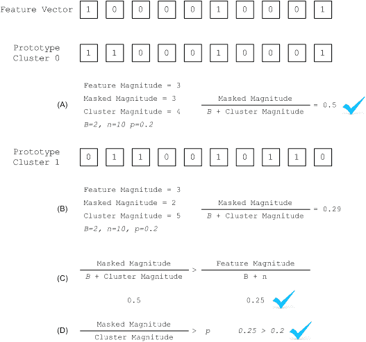

# 从干净的数据集中获取宝贵洞察

> 原文：[`developer.ibm.com/zh/tutorials/ba-cleanse-process-visualize-data-set-2/`](https://developer.ibm.com/zh/tutorials/ba-cleanse-process-visualize-data-set-2/)

数据是有价的，但来自数据的洞察是无价的。当您得到一个数据集时，如何理解该数据并利用它来获取知识呢？为了帮助您实现此目标，我将向您展示两种处理已清理数据集的方法。

本系列包含 3 部分，本教程是第 2 部分，将继续讨论我在 [第 1 部分](https://developer.ibm.com/zh/tutorials/ba-cleanse-process-visualize-data-set-1/) 中发起的关于散乱数据的讨论，展示如何对已清理的数据集应用机器学习方法。第 3 部分将继续探讨数据可视化方法。

##### 图 1.数据处理管道



回想 [第 1 部分](http://www.ibm.com/developerworks/library/ba-cleanse-process-visualize-data-set-1/index.html) ，我清理了一个包含动物特征的数据集，以便可以使用该数据集进行聚类。现在，我将使用两种无监督学习算法为此数据进行聚类。第一种算法名为 *矢量量化* (VQ)，最初被开发为一种基于分组编码原理的数据压缩算法（尽管您也可以用它来解决聚类问题）。第二种算法名为 *自适应共振理论* (ART)，是利用 *内存模板* 的概念开发的，后者可应用于具有相似性的特征。ART 还包含一个重要功能，那就是动态调节所使用的聚类次数，这个特性在聚类领域具有独特的优势。

## 矢量量化

VQ 最初在信号处理中被作为一种压缩数据的方法，它对要传输的数据进行分段，以便最小化将要传输的数据量。通过将类似数据聚类到各个分组中，可以传输集群标识符而不是特征数据，从而最小化传输的数据量。因为可以将不同的特征聚集到一起，所以该方法是有损的，在传输中会丢失一些信息。但是，通过将类似的特征矢量分组到一起，可以实现典型的聚类。

VQ 的结构如图 2 所示。您可以将要编码（即压缩）的 *码字* 或数据作为输入应用于网络。该算法计算整个网络的输出（或 *码书* ）的方式是，将特征矢量输入乘以与每个输出节点相关的权重，然后选择具有最小值的输出节点作为最接近的集群。最后，该算法对权重稍作调节，让 VQ 质心向输入方向移动。VQ 以这种方式按照给定迭代次数对网络应用整个码字集（或者直到没有码字更改输出码书的成员关系）。

##### 图 2.一种矢量量化网络



经过训练后，您可以对网络应用新的码字来标识它们的码书（即它们的成员集群）。在数据压缩上下文中，此方法将一个高维特征空间映射到一个低维子空间。

此方法还被应用于数据更正，方法是将损坏的码字应用于网络，然后选择的输出码书表明了该分组的质心，以便重建输入。

## 实现 VQ

通过 VQ 进行聚类可简单定义为：使用一个无标签的数据集来训练网络。在生产环境中，您可以对网络应用新的观察值，并采用胜者全得的方法从输出节点中识别结果集群。我在 GitHub 上提供了一个 [VQ 实现样本](https://github.com/mtimjones/dataprocessing) 。此实现被拆分为两个源文件，但其中一个在各种机器学习算法中是通用的。如图 3 所示，文件 learn.c 实现了 VQ 和 ART 都在使用的通用元素，包括解析来自命令行的用户选项，打开和关闭文件，并解析来自输入文件的观察值。文件 vq.c 包含拆分为初始化、训练和验证的 VQ 实现。

##### 图 3.VQ 实现样本的高级流程图



后续讨论将专注于 VQ 实现的细节。

首先，注意所需的结构和符号的集合，如下所示。我定义了输出节点（码书）的数量；学习率；输出计算数组；权重（涵盖指向输出的特征矢量的二维权重，如上面图 2 所示）；以及网络的输入矢量。

##### 清单 1.VQ 的关键结构和符号

```
#define OUTPUTS            7
#define MAX_FEATURES      21

#define RATE            0.01

static double  outputs[ OUTPUTS ];
static double  weights[ OUTPUTS ][ MAX_FEATURES ];
static int     input_feature_vector[ MAX_FEATURES ]; 
```

`vq_initialize` 函数初始化输出数组和权重数组。

`vq_train` 函数实现了网络的训练循环（参见 训练 VQ 网络的 vq_train 函数 ）。需要向此函数传递要在训练中执行的测试数据文件和迭代次数。该算法首先分配前 *n* 个观察值作为类原型（但也可以随机分配观察值）。 `get_observation` 函数从输入文件中获取一个新观察值， `vq_set_input_vector` 将这个观察值转换为输入矢量。 `vq_updateweights` 函数更新输出节点（类）的权重，以便向输入特征方向移动（提供一个较小的学习率来最大程度地减少更改）。

然后，我对训练循环执行了指定的迭代次数。此循环获取一个新观察值（而且如果循环到达文件末尾，则回到起点重新开始），然后在观察值上执行一个类似的训练周期。该观察值被馈送到网络的输入矢量中（通过 `vq_set_input_vector` ），然后在网络中对输入进行前馈处理以识别最近的类（通过 `vq_feedforward` ）。然后，这一步返回了最近的类，我使用该类更新此输出节点的权重。

##### 清单 2.训练 VQ 网络的 vq_train 函数

```
void vq_train( FILE *fptr, long iterations )
{
   int result;
   observation obs;
   long iteration = 0;

   // Initialize the first N observations to the N classes.
   for ( int class = 0 ; class < OUTPUTS ; class++ )
   {
      result = get_observation( fptr, &obs );
      vq_set_input_vector( &obs );
      vq_updateweights( class );
   }

   while ( iteration < iterations )
   {
      result = get_observation( fptr, &obs );

      if ( !result )
      {
         // Reset the file position to the beginning.
         fseek( fptr, 0L, SEEK_SET );
         iteration++;
      }
      else
      {
         vq_set_input_vector( &obs );
         int class = vq_feedforward( );
         vq_updateweights( class );
      }
   }

   return;
} 
```

清单 3 提供了 `vq_feedforward` 函数，该函数执行网络，并识别代表离观察值最近的类的获胜输出节点。为此，该函数会迭代每个输出节点，并计算来自输入矢量的权重的欧氏距离之和。该结果会为每个输出节点的权重提供输入特征矢量的类似指标，其中最小的数字表示最近的集群。该函数的后半部分将跟踪最佳的输出节点，然后将其返回给调用方。

##### 清单 3.执行 VQ 网络的 vq_feedforward 函数

```
int vq_feedforward( void )
{
   int best;
   double best_value;

   // Given the current input feature vector, compute each output node.
   for ( int output = 0 ; output < OUTPUTS ; output++ )
   {
      outputs[ output ] = 0.0;
      for ( int feature = 0 ; feature < MAX_FEATURES ; feature++ )
      {
         outputs[ output ] +=
            distance( NORMALIZE( weights[ output ][ feature ] ),
                      input_feature_vector[ feature ] );
      }

      // Keep track of the best activation
      if ( output == 0 )
      {
         best = 0;
         best_value = outputs[ output ];
      }
      else
      {
         if ( outputs[ output ] < best_value )
         {
            best = output;
            best_value = outputs[ output ];
         }
      }
   }
   return best;
} 
```

清单 4 中所示的 `vq_updateweights` 函数实现了 VQ 的学习部分。一旦找到离输入矢量最近的输出节点，就可以更新此输出节点的权重，以便将它们朝新特征方向移动。为此，我采用了一个学习率来调节每个权重，调节幅度为特征矢量值与（获胜输出节点的）此特征权重的差值，以便减少观察值的总体变化。

##### 清单 4.学习最新特征矢量的 vq_updateweights 函数

```
void vq_updateweights( int class )
{
   for ( int feature = 0 ; feature < MAX_FEATURES ; feature++ )
   {
      weights[ class ][ feature ] += RATE *
         ( ( double ) NORMALIZE( input_feature_vector[ feature ] ) -
                      weights[ class ][ feature ] );
   }

   return;
} 
```

验证函数（ `vq_validate` ，未具体展示）用于测试新观察值，但不包括新的学习，所以无法验证将网络推广到未见过的观察值的效果。在来自我的测试数据文件的观察值集中，此函数识别每个观察值的获胜节点（或类）。

## 通过 VQ 进行聚类

现在，我需要针对该数据集来测试我的 VQ 实现。首先，使用 `cleanse` 命令清理该数据集，以便删除所有错误的观察值。我指定了输入数据集文件 (`zoo.dat`)、输出文件前缀 (`output`) 和模式。我没有请求拆分该数据集，所以整个数据集将包含在一个文件中。

```
./cleanse -i zoo.dat -o output -c "sddddddddddddddddd" 
```

结果是一个包含我已清理的数据集的 output.dat 文件。我将这个已清理的新文件传递给我的 `learn` 可执行程序，后者实现了机器学习算法。我指定了测试数据文件 (`output.dat`)、输出文件 (`out`)、要运行的迭代次数，以及要使用的算法（ `vq` ，表示矢量量化）。

```
./learn -t output.dat -o out -i 100000 -a vq 
```

结果是一个包含动物名称和它所属的集群的文件。

##### 清单 5.VQ 聚类算法的输出格式

```
aardvark,4
antelope,4
bass,2
bear,4
boar,4
... 
```

我在下面对该数据进行了后期处理，以显示动物的所有集群和已发现出错的地方。请注意，通过 VQ 对动物园数据集进行分类的准确率为 84%，考虑到此方法的有损性质，这个结果是合理的。我在 Class 1 中重载了原始数据的两个类 ，而且 3 个类可以准确划分它们的特征。请注意，通过一个冷却时间表（随时间降低学习率，从而随时间最小化权重变化），可以实现更高的准确率。

##### 清单 6.使用 VQ 得到的来自动物园数据集的最终动物集群

```
****Class 1
aardvark, antelope, bear, boar, buffalo, calf, cavy,
cheetah, deer, dolphin, duck, elephant, flamingo, fruitbat,
giraffe, girl, goat, gorilla, hamster, hare, leopard, lion,
lynx, mink, mole, mongoose, opossum, oryx, platypus,
polecat, pony, porpoise, puma, pussycat, raccoon, reindeer,
seal, sealion, squirrel, vampire, vole, wallaby, wolf.

****Class 2
chicken, crow, dove, gull, hawk, kiwi, lark, ostrich,
parakeet, penguin, pheasant, rhea, skimmer, skua, sparrow,
swan, wren, vulture.

****Class 3
pitviper, seasnake, slowworm, tortoise, tuatara,

****Class 4
bass, carp, catfish, chub, crayfish, dogfish, haddock,
herring, pike, piranha, seahorse, sole, stingray, tuna.

****Class 5
frog, frog, newt, toad.

****Class 6
flea, gnat, honeybee, housefly, ladybird, moth, termite,
wasp.

****Class 7
clam, crab, lobster, octopus, scorpion, seawasp, slug,
starfish, worm. 
```

尽管 VQ 的聚类结果不是 100% 准确，但它取得了 84% 的合理成绩。现在我将介绍另一种聚类方法 – 一种具有独特优势的方法。

## 自适应共振理论

ART 是一个算法系列，灵感来源于大脑处理信息的方式。ART 实现了 *增量学习* 的概念，使大脑能够在存储新记忆的同时保留旧记忆（解决了所谓的”可塑性/稳定性”窘境）。该理论的思路是：学习模型需要可塑性来整合新知识，但需要稳定性来保留旧知识。随着新样本的出现，经过向后传播训练的网络可能会丢失信息。

图 4 显示了用于无监督学习的 ART 模型的基本架构。输入被应用于一个比较层，进而通过一组权重应用于一个识别层。如果输入与识别层中的某个神经元足够相似，就会针对新观察值来更新权重。相似性测试基于某个警戒参数，该参数可以将观察值应用到一个新的、不活动的神经元上。此参数允许 ART 根据输入来调节输出类的数量，将观察值推送到新神经元（实现了旧神经元和它拥有的信息的稳定性，以及新神经元合并新知识的可塑性）。

##### 图 4.ART1 无监督学习架构



警戒参数是 ART 模型的一个重要部分：较高的警戒参数将会生成详细的记忆，较低的警戒参数将会产生更为笼统的记忆。警戒参数为 1.0 时，会强制输出神经元等于它们的输入。

## 实现 ART

从前面的描述很容易看出，ART 实现了矢量分类（ART1 特别关注二进制值数据）。输入特征矢量类似于已存储的现有知识时，就会针对该观察值强化分类输出节点。如果观察值与任何活动的输出神经元都不相似（给定警戒值），可以形成一个新神经元对此模式进行分类。

查看 [ART1](https://github.com/mtimjones/dataprocessing) 的一个样本实现。此实现的基本高级流程如下图所示。与 VQ 一样，文件 learn.c 实现了通用元素，而 art.c 实现了 ART 算法。初始化后， `art_train` 实现了 ART1 学习，能够将观察值划分到一个类似输出，或者为观察值创建一个新集群。 `art_validation` 函数能够确定新观察值的输出节点（集群），但不会对模型执行任何新训练。

##### 图 5.ART 实现的高级流程图



下面，我最多支持 9 个集群（或可供该算法创建的原型矢量）。 *矢量* 是一种用作观察值（特征矢量）和集群本身的多用途结构，包括观察值信息（名称、特征）、集群和以前定义的类。对于集群， **count** 字段表明了集群中包含多少个特征矢量。

##### 清单 7.ART1 类型和符号

```
#define CLUSTERS           9

#define BETA             ( double )7.0
#define RHO              ( double )0.55

typedef struct vector
{
   char name[ MAX_NAME ];
   int  features[ MAX_FEATURES ];
   int  count;    // Prototype cluster count
   int  cluster;  // Feature vector cluster
   int  actual_class;
} vector;

// In-memory observations (feature vectors)
vector feature_vectors[ MAX_FEAT_VECS ];
int    max_feature_vectors;

// Prototype feature vectors
vector clusters[ CLUSTERS ]; 
```

清单 8 提供了 ART 算法的主循环。尽管任何特征矢量都可以更改类，但我将继续通过该算法执行整个数据集。我迭代每个观察值，并调用 `cluster_observation` 来查看它属于何处。如果没有找到类似的集群，该代码会尝试创建一个新集群；否则，它会将该观察值添加（或移动）到识别出的集群。

##### 清单 8.ART 主循环

```
void art_train( FILE *fptr )
{
   int changes = 1;
   int cluster;

   while ( changes )
   {
      changes = 0;

      for (int feature = 0 ; feature < max_feature_vectors ; feature++)
      {
         cluster = cluster_observation( feature );

         if ( cluster == CLUSTERS )
         {
            cluster_create( feature );
            changes++;
         }
         else
         {
            // If this feature vector has moved, move it.
            if ( feature_vectors[ feature ].cluster != cluster )
            {
               cluster_add( cluster, feature );
               changes++;
            }
         }
      }
   }

   emit_clusters( fptr );

   return;
} 
```

ART 算法可在清单 9 中的 `cluster_observation` 中找到。此函数确定了某个观察值与原型矢量集的相似性，或者确定是否要创建一个新原型矢量（集群）来支持该观察值。此函数依赖于 *矢量幅值* ，矢量幅值被定义为一个矢量中包含的 1 的数量。此函数拆分为两部分：第一部分查找与特征矢量最相似的原型集群，第二部分确定该集群的相似程度是否足以将观察值放入该集群中。否则，可以创建一个新集群。

##### 清单 9.在 ART1 中对观察值进行聚类

```
int cluster_observation( int feature )
{
   vector result;
   double best_max = 0.0;
   int best_cluster = CLUSTERS;

   double featureMag = ( double )vMagnitude( &feature_vectors[ feature ] );

   for ( int cluster = 0 ; cluster < CLUSTERS ; cluster++ )
   {
      // If a cluster has no members, skip it.
      if ( clusters[ cluster ].count == 0 ) continue;

      vAnd( &result, &feature_vectors[ feature ], &clusters[ cluster ] );
      double resultMag = ( double )vMagnitude( &result );
      double clusterMag = ( double )vMagnitude( &clusters[ cluster ] );
      double maximum = resultMag / ( BETA + clusterMag );

      if ( maximum > best_max )
      {
         best_max = maximum;
         best_cluster = cluster;
      }

   }

   if ( best_cluster != CLUSTERS )
   {
      vAnd( &result, &feature_vectors[ feature ], &clusters[best_cluster] );
      double resultMag = ( double )vMagnitude( &result );
      double clusterMag = ( double )vMagnitude( &clusters[ best_cluster ] );
      double maximum    = resultMag / ( BETA + clusterMag );
      double similarity = featureMag / ( BETA + ( double ) MAX_FEATURES );

      // See if the feature vector is similar to the cluster
      if ( maximum > similarity )
      {
         if ( ( resultMag / clusterMag ) >= RHO )
         {
            return best_cluster;
         }
      }
   }

   return CLUSTERS;
} 
```

在一个示例的上下文中查看来自清单 9 的等式。 ART 相似性等式图示 演示了对一个特征矢量和两个原型矢量进行聚类的过程。回想一下，集群的幅度是该矢量中包含的 1 的数量，矢量 `AND` 运算类似于按位 `AND` 。值 *n* 是我的特征矢量和集群的维度。

在部分 A 和部分 B 中，可以注意到原型矢量 0 最大化了所显示的等式。然后，部分 C 和部分 D 将测试在满足我的阈值 `RHO` 的前提下，特征矢量是否与所选的原型矢量足够相似。所以，在这种情况下，特征矢量被添加到原型矢量 0 所表示的集群中。

##### 图 6.ART 相似性等式图示



清单 10 提供了集群管理函数。第一个函数 `cluster_create` 找到一个空集群，并将特征矢量作为其原型加载到其中。它将成员数设置为 1，然后表明该特征矢量包含在该集群中。在 `cluster_add` 中，我首先检查该特征矢量目前是否包含在某个集群中。如果是，则从该集群删除它，然后重新计算该集群的原型矢量。然后，将该特征添加到新集群并重新计算它的原型矢量。

##### 清单 10.创建特征或向现有集群添加特征的函数

```
void cluster_create( int feature )
{
   int cluster = find_empty_cluster( );

   if ( cluster != CLUSTERS )
   {
      for ( int i = 0 ; i < MAX_FEATURES ; i++ )
      {
         clusters[ cluster ].features[ i ] =
            feature_vectors[ feature ].features[ i ];
      }
      clusters[ cluster ].count = 1;
      feature_vectors[ feature ].cluster = cluster;
   }

   return;
}

void cluster_add( int cluster, int vector )
{
   // If the current feature vector has been classified, pull it out.
   if ( feature_vectors[ vector ].cluster != CLUSTERS )
   {
      int prior_cluster = feature_vectors[ vector ].cluster;
      feature_vectors[ vector ].cluster = CLUSTERS;
      clusters[ prior_cluster ].count--;
      recalculate_cluster( prior_cluster );
   }

   // Add the feature vector to the new cluster.
   feature_vectors[ vector ].cluster = cluster;
   clusters[ cluster ].count++;
   recalculate_cluster( cluster );

   return;
} 
```

这个 ART 演示中的最后一个函数是 `recalculate_cluster` （参见清单 11）。此函数将迭代特征矢量，并找到包含在该集群中的那些特征矢量。将找到的第一个特征矢量直接载入集群的原型矢量中，在该矢量中，后续特征矢量都被屏蔽（以便该原型矢量是与该集群有关的所有特征成员的按位 `AND` 运算结果）。

##### 清单 11.重新计算集群的原型矢量

```
void recalculate_cluster( int cluster )
{
   int first = 0;

   for ( int vec = 0 ; vec < max_feature_vectors ; vec++ )
   {
      if ( feature_vectors[ vec ].cluster == cluster )
      {
         if ( !first )
         {
            first = 1;

            // Set the cluster to the first feature vector.
            for (int feature = 0 ; feature < MAX_FEATURES ; feature++ )
            {
               clusters[ cluster ].features[ feature ] =
                  feature_vectors[ vec ].features[ feature ];
            }
         }
         else
         {
            // Boolean AND the next feature vectors into the cluster.
            for (int feature = 0 ; feature < MAX_FEATURES ; feature++ )
            {
               clusters[ cluster ].features[ feature ] &=
                  feature_vectors[ vec ].features[ feature ];
            }
         }
      }
   }

   return;
} 
```

代码比矢量量化的代码多一些，但 ART 可能比 VQ 更稳健。接下来，我将展示该算法的实际应用。

## 通过 ART 进行聚类

例如，我将参照动物园数据集来测试我的 ART 实现。首先指定我之前创建的已清理的数据集。指定已清理的数据集文件、一个输出文件和 ART 算法。在本例中，我指定我的验证数据来检查该算法对它从训练数据集学到的模型的推广效果。

##### 清单 12.来自 ART 训练示例的输出

```
$ ./learn -t output.dat -v output.tst -o out -a art
Cluster 0: Count  17 : [ 0 0 0 0 0 0 0 1 1 0 0 0 1 0 0 0 0 0 1 0 0 ]
Cluster 1: Count   5 : [ 0 0 1 0 0 0 0 1 1 1 0 0 0 0 1 0 0 0 0 0 0 ]
Cluster 2: Count   1 : [ 0 0 0 0 0 0 1 0 0 1 1 0 0 0 0 0 0 1 1 0 0 ]
Cluster 3: Count   7 : [ 0 0 1 0 0 0 1 0 0 0 0 0 0 0 0 0 0 0 0 0 0 ]
Cluster 4: Count   3 : [ 0 0 1 0 0 0 0 0 0 1 0 0 1 0 0 0 0 0 0 0 0 ]
Cluster 5: Count  36 : [ 1 0 0 1 0 0 0 1 1 1 0 0 0 0 0 0 0 0 0 0 0 ]
Cluster 6: Count   2 : [ 0 0 1 0 0 0 0 0 1 1 0 0 0 0 1 0 0 0 1 0 1 ]
Cluster 7: Count  19 : [ 0 1 1 0 0 0 0 0 1 1 0 0 0 1 0 0 0 0 1 0 0 ]
Cluster 8: Count   7 : [ 0 0 1 0 0 0 0 0 0 1 0 0 0 0 0 0 1 0 0 0 0 ]
$ 
```

清单 13 显示了输出文件这个文件显示了实际的聚类结果，在我检查它时，可以看到动物名称、动物园数据集所定义的原始集群、ART 所识别的集群，以及验证数据集。

##### 清单 13.ART 输出文件中生成的输出

```
bass,0,4
carp,0,4
catfish,0,4
chub,0,4
dogfish,0,4
dolphin,0,1
haddock,0,4
...
wasp,8,6

Validation:
Validation:
aardvark (1) -> Cluster 5
ladybird (6) -> Cluster 8
parakeet (2) -> Cluster 2
piranha (4) -> Cluster 0
antelope (1) -> Cluster 5 
```

在这个示例中，可以看到 ART 采用了所有 9 个集群，即使仅需要其中的 7 个。训练和验证集的整体准确率为 89%。ART 的优势在于，它可以扩展 `RHO` 所确定的集群数量，但它可能得到基于旧数据集的误分类结果。随机抽取数据集可以改善结果。

## 结束语

本教程探索了如何为一个已清理的数据集构造两种无监督学习模型。VQ 是一个可以快速高效地对数据集进行聚类的简单算法；ART 稍微复杂一点，但可以根据数据集及其配置参数来调节聚类次数。在本系列的最后一篇教程中，我将探索多个数据可视化方法，以增进对它的理解。

本文翻译自：[Gaining invaluable insight from clean data sets](https://www.ibm.com/developerworks/library/ba-cleanse-process-visualize-data-set-2/)（2018-02-14）