# 探索 MQTT 和物联网服务

> 原文：[`developer.ibm.com/zh/tutorials/cl-mqtt-bluemix-iot-node-red-app/`](https://developer.ibm.com/zh/tutorials/cl-mqtt-bluemix-iot-node-red-app/)

IBM Watson IoT Platform 可提供简单却强大的服务，能够使全球范围内不同种类的设备和应用程序互联互通。这是如何实现的？Watson IoT Platform 背后的秘密武器就是 MQTT，即消息队列遥测传输 (Message Queue Telemetry Transport)，这是一种灵活的轻量级网络协议。在本教程中，您将了解 MQTT 的工作原理，以及如何使用 IoT 服务轻松构建应用程序。

一般来讲，Watson IoT Platform 充当 MQTT 代理，因此负责将消息分发至已连接的客户端（设备和应用程序）。*设备*包括发布所检测到信息的机器，*应用程序*是使用从这些设备接收到的信息的程序。设备和应用程序使用 MQTT 协议与 MQTT 代理通信，如 IBM Cloud 服务和 MQTT 客户端所示。

##### IBM Cloud 服务和 MQTT 客户端

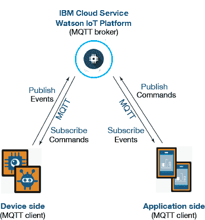

使用 Watson IoT Platform 的应用程序通常由三个部分组成：

*   Watson IoT Platform 服务配置（设备和应用程序注册）
*   设备端编程
*   应用程序端编程

做好试用准备了吗？

## 构建您的应用程序所需的准备工作

*   一个 IBM Cloud 帐户。（[从这里免费开始使用](https://cloud.ibm.com/?cm_sp=ibmdev-_-developer-tutorials-_-cloudreg)。）
*   熟悉 Java 编程语言。
*   熟悉 [MQTT](http://mqtt.org/)。在[此处](https://www.ibm.com/developerworks/library/iot-mqtt-why-good-for-iot/index.html)了解有关 MQTT 的更多信息。

1

## 设置 Watson IoT Platform 服务

在此步骤中，您将向 Watson IoT Platform 注册设备和应用程序。在连接设备和使用数据之前，请先注册一个 IBM Cloud 帐户，然后在 IBM Cloud 组织中创建一个 Watson IoT Platform 服务实例。

### 在 IBM Cloud 仪表板上创建一个应用程序

1.  登录 [IBM Cloud](https://cloud.ibm.com/?cm_sp=ibmdev-_-developer-tutorials-_-cloudreg)。
2.  在顶部菜单中，单击 **Catalog**。
3.  要创建新服务，请在 **Platform** 类别下单击 **Internet of Things**，然后单击 **Internet of Things Platform** 服务磁贴。

    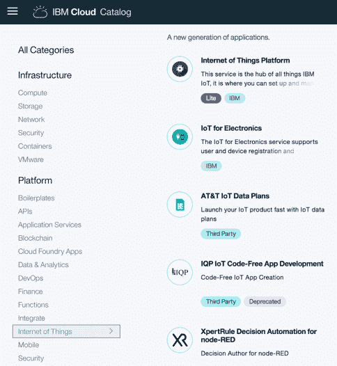

4.  在 **Service name** 字段中，为服务指定唯一名称。对于本教程，我使用的名称为 `IoT-article-demo`。

    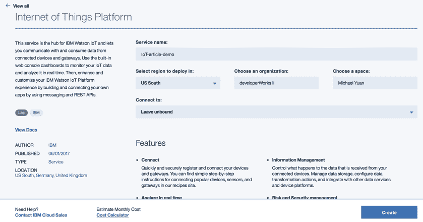

5.  单击 **Create**。

### 启动 IoT 服务控制台

通过仪表板设置并配置 Watson IoT Platform 服务。

1.  在 IoT-article-demo 服务页面上，单击 **Launch**。

    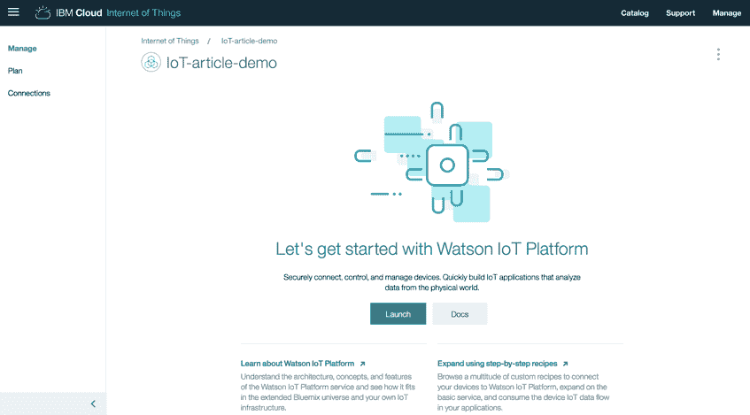

    这样会打开仪表板。该仪表板应类似于下图。

    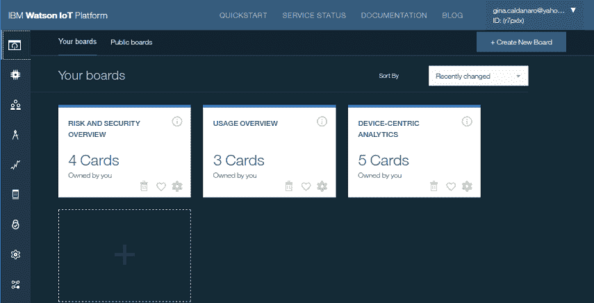

2.  使用左侧菜单窗格来浏览此服务。

    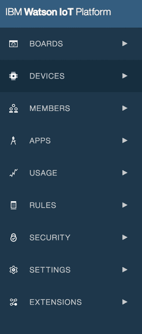

**注：**在创建服务控制台后，可以从 [Watson IoT Platform 网站](http://internetofthings.ibmcloud.com/)直接访问此控制台。登录后，可以从窗口右上角的下拉菜单中查看您创建的所有服务控制台。

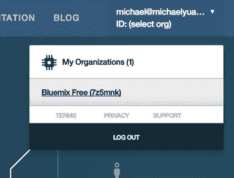

### 注册设备

连接到 Watson IoT Platform 的每台设备都必须与设备类型相关联。设备类型即具有共同特征的设备分组。向 Watson IoT Platform 服务中添加首台设备时， **Device type** 菜单中没有任何设备类型可用。您必须先创建一个设备类型。

1.  单击 **Devices**，然后单击 **Device Types** 选项卡。

    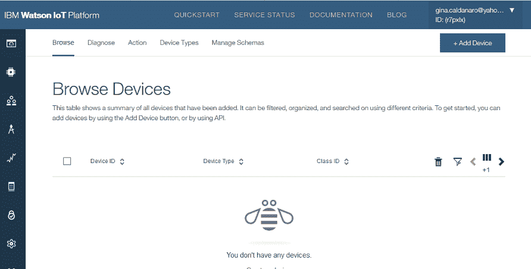

2.  单击 **Add Device Type**。

    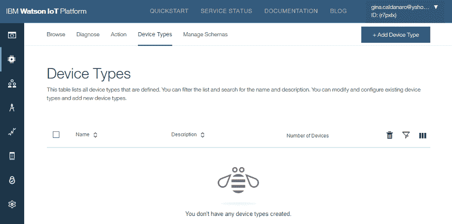

3.  对于设备的 **Name**，请使用 `Java_Client`。

    **注：**您可以使用想要的任何值。

    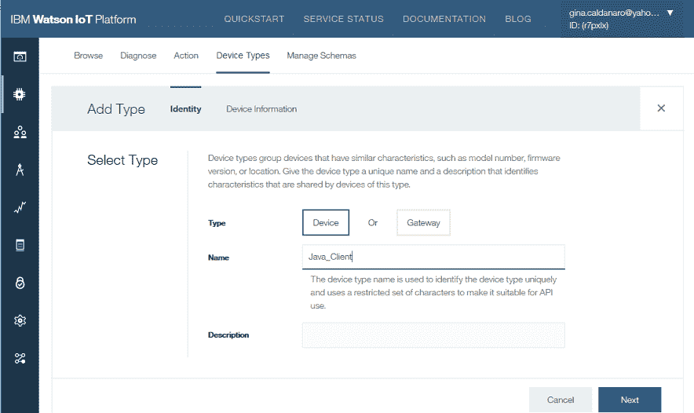

4.  依次单击 **Next**、**Done** 和 **Cancel**。
5.  单击 **Browse** 选项卡，然后单击 **Add Device**。

    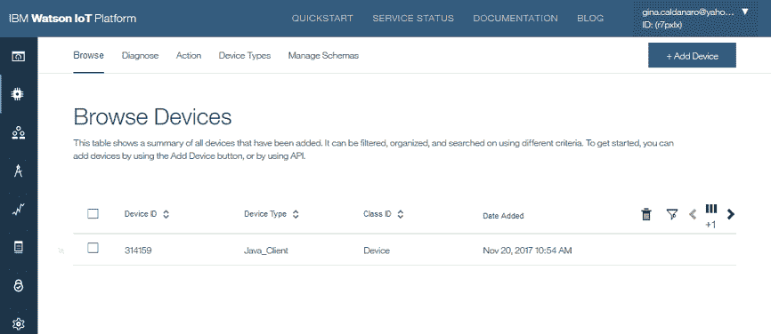

6.  对于 **Select Existing Device Type** 字段，请选择您创建的设备类型：`Java_Client`。

    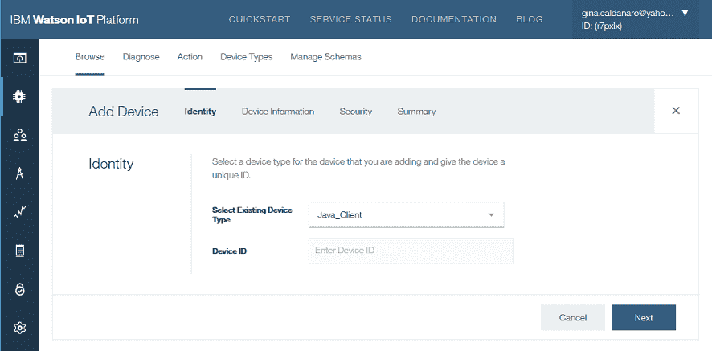

7.  在 **Device ID** 字段中输入唯一 ID，例如，`314159`。您可以输入自己的标识符。
8.  单击 **Next**。
9.  单击 **Security** 选项卡。自动生成安全凭证。单击 **Next**，然后单击 **Done**。

    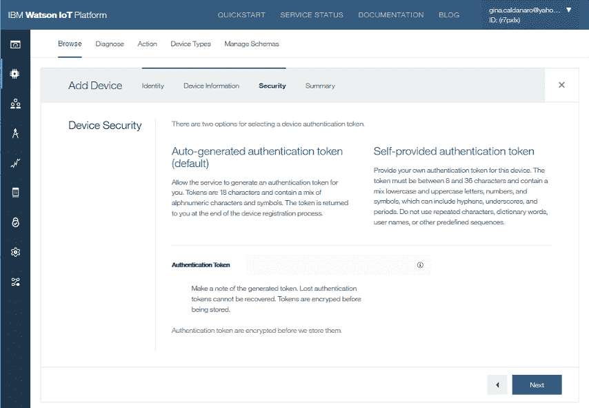

10.  写下 **Authentication Token**，或者将其复制并粘贴到文本编辑器以供将来使用。

    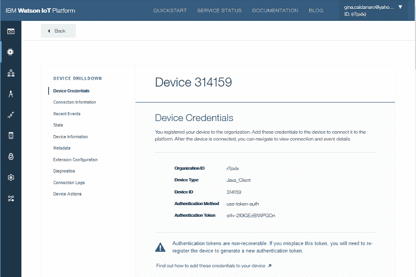

重复步骤 5 至 10，以添加所有设备。您可以在 **Devices** 仪表板上看到这些设备。


向 Watson IoT Platform 注册设备后，您可以使用注册信息来连接此设备，并开始接收设备数据。

### 注册应用程序

要将应用程序连接到 Watson IoT Platform，必须使用 API 密钥和令牌进行连接，或者在 IBM Cloud 中将您的应用程序直接绑定到 Watson IoT Platform。您可以使用访问仪表板来授予访问权。

1.  在 Watson IoT Platform 仪表板的左侧菜单窗格中，单击 **Apps**，然后单击 **Generate API Key**。

    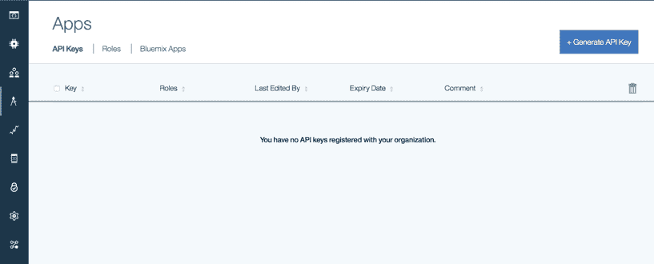

2.  复制 **API Key** 和 **Authentication Token** 信息，并将其保存至文本编辑器中以供将来使用。

    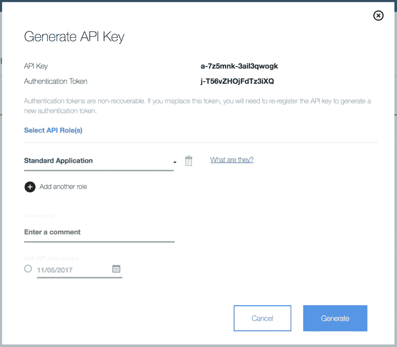

3.  单击 **Generate**。

    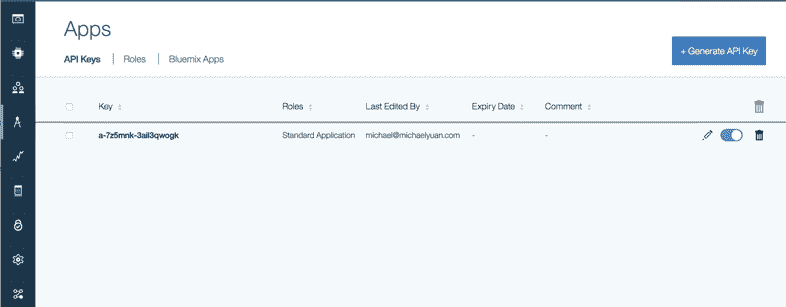

如果需要，请重复上述步骤以注册其他应用程序。

2

## 创建设备端程序

设备端编程包含三个部分：

*   连接到 IoT 服务（MQTT 代理）。
*   将事件推送至应用程序。
*   从应用程序订阅命令。

在本部分中，您将使用 [ibm-watson-iot GitHub 存储库中的 Java 客户端库](https://github.com/ibm-watson-iot/iot-java)构建一个简单的设备端程序。有关更多信息，请参阅[源代码](https://github.com/juntao/mqtt-watson-iot-platform-sample)。

[获得代码](https://github.com/juntao/mqtt-watson-iot-platform-sample/tree/master/java/device)

### 连接至 IoT 服务

此处的代码显示了 MQTT 设备端程序的主要线程。它连接到我们在仪表板中创建的 Watson IoT Platform 设备之一。使用命令行传入连接参数来执行程序。这使我们能够运行多个设备实例，每个实例都对应于 Watson IoT Platform 中注册的一个设备。但在现实世界中，物理传感器设备会使用自己的 SDK 来实现自己的 MQTT 程序。

```
public static void main(String[] args) throws Exception {
  Properties options = new Properties();
  options.put("org", args[0]);
  options.put("type", args[1]);
  options.put("id", args[2]);
  options.setProperty("auth-method", "token");
  options.setProperty("auth-token", args[3]);

  try {
    myClient = new DeviceClient(options);
  } catch (Exception e) {
    e.printStackTrace();
  }

  // More code to handle commands from apps
  myClient.connect();

  // More code to send events to apps
} 
```

样本设备的命令行自变量如下所示。

*   args[0] 是组织参数：7z5mnk
*   args[1] 是设备类型：Java_Client
*   args[2] 是设备 ID：314159
*   args[3] 是设备的访问令牌（密钥）： jiw0cK1j84*e_dDjWd

### 发布事件

我们设备的主要功能是启动计数，并每隔 5 秒将当前计数作为一个事件发送至 Watson IoT Platform。Watson IoT Platform 负责将该事件广播至侦听设备事件的所有应用程序。

```
// More code to send events to apps
Runnable countRunnable = new Runnable() {
  public void run() {
    JsonObject event = new JsonObject();
    event.addProperty("count", count);
    myClient.publishEvent("status", event);
    count++;
  }
};
ScheduledExecutorService executor = Executors.newScheduledThreadPool(1);
executor.scheduleAtFixedRate(countRunnable, 0, 5, TimeUnit.SECONDS); 
```

### 订阅命令

连接到 Watson IoT Platform 上的设备后，我们的设备现已准备就绪，可接收来自相同 Watson IoT Platform 服务（即我们之前创建的 `IoT-article-demo` 服务）中所注册应用程序的命令。

您需要实现 `Command Callback` 接口，并向您创建的 `Device Client` 注册回调。在回调实现中，我们将命令推送至队列，然后使用单独的线程来读取和处理来自该队列的命令。此设计可防止命令处理程序线程遭阻止，并允许按接收到命令的顺序来处理所有命令。

在命令处理程序线程中，设备会解析来自该应用程序的命令。如果命令为 `restart-counter`，那么该设备将重新启动自己的计数器。

```
public static void main(String[] args) throws Exception {
  // ......

  // More code to handle commands from apps
  AppCommandHandler handler = new AppCommandHandler();
  myClient.setCommandCallback(handler);
  myClient.connect();

  // Run the event processing thread
  Thread thread = new Thread(handler);
  thread.start();
}

class AppCommandHandler implements CommandCallback, Runnable {

  // A queue to hold and process the Events
  // for smooth handling of MQTT messages
  // as some commands may take a long time to process
  private BlockingQueue<Command> cmdQueue = new LinkedBlockingQueue<Command>();

  @Override
  public void processCommand(Command c) {
    try {
      cmdQueue.put(c);
    } catch (InterruptedException e1) {
      e1.printStackTrace();
    }
  }

  @Override
  public void run() {
    while(true) {
      Command c = null;
      try {
        c = cmdQueue.take();

        JsonParser jsonParser = new JsonParser();
        JsonElement ele = jsonParser.parse(c.getPayload());

        if ("restart-counter".equalsIgnoreCase(ele.getAsJsonObject().get("name").getAsString())) {
          SampleDevice.count = 0;
        }
      } catch (InterruptedException e1) {
        continue;
      }
    }
  }
} 
```

**备注**：设备端程序是以 Java 编写的，仅用于演示目的。您的设备需要完整的 JVM 才能运行该程序。 您始终可以使用自己的笔记本电脑作为*设备*，但支持完整 JVM 的计算机并不是真实的 IoT 设备（如 [NodeMCU 开发板](https://www.ibm.com/developerworks/library/iot-mqtt-nodemcu-monitor-air-quality/)，我在先前的 developerWorks 教程中就使用了此设备，它使用来自 Watson IoT Platform 的 MQTT）。要编写传感器设备中嵌入的实际设备端程序，您可以使用相应的 [ibm-watson-iot 客户端库](https://github.com/ibm-watson-iot)之一（例如，嵌入式 C++）。

3

## 创建应用程序端程序

与设备端编程一样，应用程序端编程也包含三个部分：

*   连接到 IoT 服务（MQTT 代理）。
*   从设备或者 MQTT 代理订阅事件。
*   将命令发布至设备。

在本部分中，您将使用 [ibm-watson-iot Java 客户端库](https://github.com/ibm-watson-iot/iot-java)构建一个简单的应用程序端程序。有关更多信息，请参阅[源代码](https://github.com/juntao/mqtt-watson-iot-platform-sample)。

[获得代码](https://github.com/juntao/mqtt-watson-iot-platform-sample/tree/master/java/application)

### 连接至 IoT 服务

此处的代码显示了 MQTT 应用程序的主要线程。它连接到我们在仪表板中创建的 Watson IoT Platform 应用程序。使用命令行传入连接参数来执行应用程序。

```
public static void main(String[] args) throws Exception {
  Properties options = new Properties();
  options.put("org", args[0]);
  options.put("id", args[1]);
  options.put("Authentication-Method","apikey");
  options.put("API-Key", args[2]);
  options.put("Authentication-Token", args[3]);

  ApplicationClient myClient = new ApplicationClient(options);
  myClient.connect();

  // More code to handle events from devices
} 
```

样本项目的命令行自变量如下所示。

*   args[0] 是组织参数：7z5mnk
*   args[1] 是应用程序的 ID 参数：dw-sample-app
*   args[2] 是应用程序的 API 密钥：a-7z5mnk-3ail3qwogk
*   args[3] 是应用程序的 API 令牌（密钥）：j-T56vZHOjFdTz3iXQ

### 订阅事件

连接到 Watson IoT Platform 上的应用程序后，我们的应用程序现已准备就绪，可接收来自相同 Watson IoT Platform 服务（即我们之前创建的 `IoT-article-demo` 服务）中所注册设备的事件。

您需要实现 `EventCallback` 接口，并向您创建的 `ApplicationClient` 注册回调。在回调实现中，我们将事件推送至队列，然后使用单独的线程来读取来自该队列的事件。此设计可防止事件处理程序线程遭阻止，并允许按接收到事件的顺序来处理所有事件。

在事件处理程序线程中，该应用程序会解析来自设备事件的计数值。如果该值大于 4，那么应用程序会向设备发回一条命令以重新开始计数。

```
public static void main(String[] args) throws Exception {
  // ......

  ApplicationClient myClient = new ApplicationClient(options);
  myClient.connect();

  DeviceEventHandler handler = new DeviceEventHandler();
  handler.setClient(myClient);

  myClient.setEventCallback(handler);
  myClient.subscribeToDeviceEvents();

  // Run the event processing thread
  Thread thread = new Thread(handler);
  thread.start();
}

class DeviceEventHandler implements EventCallback, Runnable {

  private ApplicationClient client;

  // A queue to hold and process the Events
  // for smooth handling of MQTT messages
  // as some events may take a long time to process
  private BlockingQueue<Event> evtQueue = new LinkedBlockingQueue<Event>();

  public void processEvent(Event e) {
    try {
      evtQueue.put(e);
    } catch (InterruptedException e1) {
      e1.printStackTrace();
    }

  }

  @Override
  public void processCommand(Command cmd) {
    System.out.println("Command received:: " + cmd);
  }

  @Override
  public void run() {
    while(true) {
      Event e = null;
      try {
        e = evtQueue.take();

        // Check count value
        JsonParser jsonParser = new JsonParser();
        JsonElement ele = jsonParser.parse(e.getPayload());

        int count = ele.getAsJsonObject().get("count").getAsInt();

        if (count >= 4) {
          // Send "restart" command back to this device
          // ......
        }
      } catch (InterruptedException e1) {
        continue;
      }
    }
  }

  public ApplicationClient getClient() {
    return client;
  }
  public void setClient(ApplicationClient client) {
    this.client = client;
  }
} 
```

### 发布命令

为了向设备发回重新开始计数命令，我们将使用 `publishCommand` 方法，并传入设备信息和一条 JSON 消息。

```
if (count >= 4) {
  // Send "restart" command back to this device
  JsonObject data = new JsonObject();
  data.addProperty("name", "restart-counter");
  data.addProperty("time", new SimpleDateFormat("yyyy-MM-dd HH:mm:ss").format(new Date()));
  client.publishCommand(e.getDeviceType(), e.getDeviceId(), "restart", data);
} 
```

4

## 运行应用程序

设备端程序和应用程序端程序均作为 Java 应用程序来构建。我们将样本源代码项目设置为 Maven 项目，并且配置了 Maven 以构建可执行 JAR 文件。这样，您便可在构建后直接从命令行运行这些程序。

### 构建项目

要构建项目，请在设备目录和应用程序目录中运行以下命令。

```
$ mvn clean package 
```

此命令会在目标目录中创建 application-1.0.jar 和 device-1.0.jar 文件。

### 运行应用程序端程序

您可以根据以下方法运行应用程序端程序。

```
$ java -jar target/application-1.0.jar 7z5mnk dw-sample-app a-7z5mnk-3ail3qwogk j-T56vZHOjFdTz3iXQ
Nov 05, 2017 2:26:34 AM com.ibm.iotf.client.AbstractClient createClient
INFO: main: Org ID    = 7z5mnk
         Client ID    = a:7z5mnk:dw-sample-app
Nov 05, 2017 2:26:35 AM com.ibm.iotf.client.AbstractClient connect
INFO: main: Initiating Token based authentication
Nov 05, 2017 2:26:35 AM com.ibm.iotf.client.AbstractClient connect
INFO: main: Connecting client a:7z5mnk:dw-sample-app to ssl://7z5mnk.messaging.internetofthings.ibmcloud.com:8883 (attempt #1)...
Nov 05, 2017 2:26:35 AM com.ibm.iotf.client.AbstractClient connect
INFO: main: Successfully connected to the IBM Watson IoT Platform 
```

现在，此程序正在等待来自设备的事件。

### 运行设备端程序

启动设备端程序后，它会开始每隔 5 秒向 Watson IoT Platform 发送一次计数事件。您可以看到此程序在计数达到 4 之后重新启动计数器，以便响应来自应用程序端程序的 `restart-counter` 命令。

同样，请注意，此处演示的设备端程序只是在完整的 JVM 设备上运行的一个例证。要在嵌入式设备上运行应用程序，需要为该设备使用不同的 [Watson IoT Platform 客户端库](https://github.com/ibm-watson-iot)。

```
$ java -jar target/device-1.0.jar 7z5mnk Java_Client  314159  jiw0cK1j84*e_dDjWd
Starting IoT device
Nov 05, 2017 2:26:46 AM com.ibm.iotf.client.AbstractClient createClient
INFO: main: Org ID    = 7z5mnk
         Client ID    = d:7z5mnk:Java_Client:314159
Nov 05, 2017 2:26:46 AM com.ibm.iotf.client.AbstractClient connect
INFO: main: Initiating Token based authentication
Nov 05, 2017 2:26:46 AM com.ibm.iotf.client.AbstractClient connect
INFO: main: Connecting client d:7z5mnk:Java_Client:314159 to ssl://7z5mnk.messaging.internetofthings.ibmcloud.com:8883 (attempt #1)...
Nov 05, 2017 2:26:47 AM com.ibm.iotf.client.AbstractClient connect
INFO: main: Successfully connected to the IBM Watson IoT Platform
Posted event {"count":0}
Posted event {"count":1}
Posted event {"count":2}
Posted event {"count":3}
Posted event {"count":4}
Command:: restart:{"name":"restart-counter","time":"2017-11-05 02:27:07"}
Posted event {"count":0}
Posted event {"count":1}
Posted event {"count":2}
Posted event {"count":3} 
```

设备端程序启动后，您还可以看到来自应用程序端程序控制台的输出。

```
Event received:: Event [2017-11-05T02:26:47.438-06:00] Java_Client:314159 - status: {"count":0}
Event received:: Event [2017-11-05T02:26:52.374-06:00] Java_Client:314159 - status: {"count":1}
Event received:: Event [2017-11-05T02:26:57.377-06:00] Java_Client:314159 - status: {"count":2}
Event received:: Event [2017-11-05T02:27:02.374-06:00] Java_Client:314159 - status: {"count":3}
Event received:: Event [2017-11-05T02:27:07.377-06:00] Java_Client:314159 - status: {"count":4}
Event received:: Event [2017-11-05T02:27:12.376-06:00] Java_Client:314159 - status: {"count":0}
Event received:: Event [2017-11-05T02:27:17.372-06:00] Java_Client:314159 - status: {"count":1}
Event received:: Event [2017-11-05T02:27:22.371-06:00] Java_Client:314159 - status: {"count":2}
Event received:: Event [2017-11-05T02:27:27.375-06:00] Java_Client:314159 - status: {"count":3} 
```

### 检查运行的应用程序

在 Watson IoT Platform 控制台中，您还可以查看各设备的事件日志。这便于进行调试。

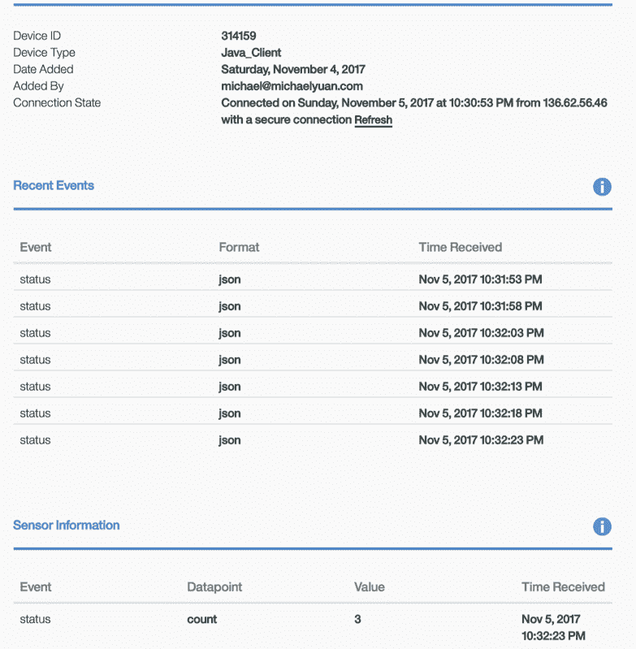

## 结论及后续步骤

通过遵循以上步骤，您可以借助 Watson IoT Platform 服务使用 MQTT 协议来构建应用程序。如果您熟悉 MQTT 客户端编程，可能会发现其中并没有显著的差异，只是在使用 Watson IoT Platform 服务时，MQTT 连接选项、发布和订阅主题表单等属性必须遵循正确的格式。

使用 Watson IoT Platform 服务，可以轻松构建基于现有 MQTT 客户端库的解决方案。令人欣慰的是，目前有很多适用于不同平台的[开源 MQTT 客户端库](https://github.com/mqtt/mqtt.github.io/wiki/libraries)，例如，C、C++、Java、JavaScript、Ruby、Go 等。此外，还有些[特定于 Watson IoT Platform 的客户端库](https://github.com/ibm-watson-iot)，如我们在本教程中使用的 Java 库。

Watson IoT Platform 服务支持各种互连智能设备，例如， Arduino Uno、Raspberry Pi 等。在 [Web 门户网站的文档部分](https://cloud.ibm.com/docs/services/IoT?topic=iot-platform-getting-started)中包含了一些可供您学习的样本代码项目。先前讨论的 MQTT 机制应可帮助您理解和修改源代码。如果样本代码中未涉及您的设备，无须担心。就像我们在此样本应用程序中使用 Java 来实现设备端程序一样，您可以使用 MQTT 客户端库轻松构建自己的程序。

我们使用 Java 实现了此应用程序端程序，但您可以选择其他编程语言，例如，Node.js 或 Ruby。为简化应用程序端编程，您可以使用基于浏览器的流编辑器 [Node-RED](https://nodered.org/)，而不是在本地进行编码。无论您是自行构建还是使用 Node-RED，Watson IoT Platform 服务下 MQTT 流的工作方式都是相同的。

## 致谢

本文最初是由 Chun Bin Tang 撰写的，发布于 2015 年 2 月 18 日。

本文翻译自：[Explore MQTT and the Internet of Things service](https://developer.ibm.com/tutorials/cl-mqtt-bluemix-iot-node-red-app/)（2018-02-08）