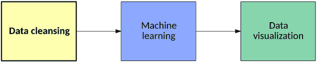
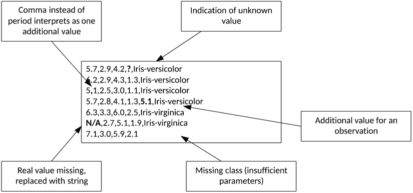
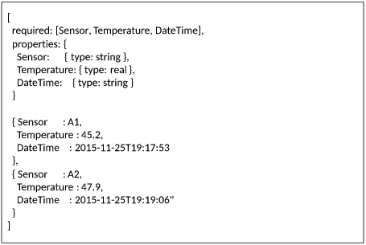
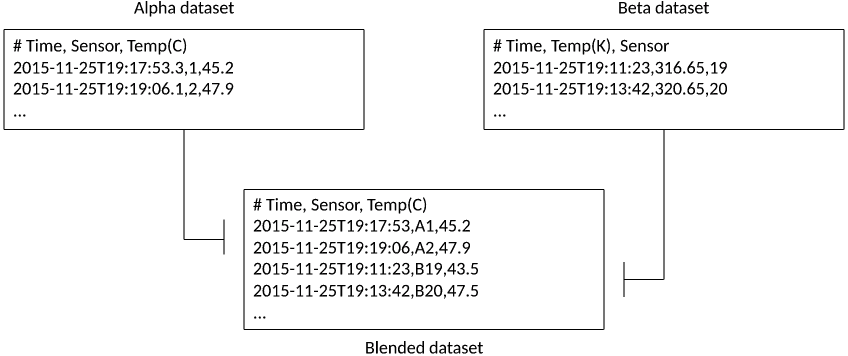
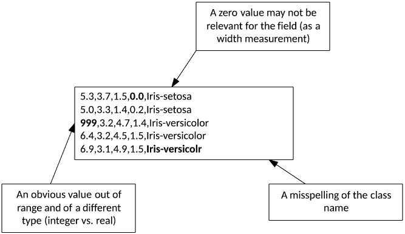
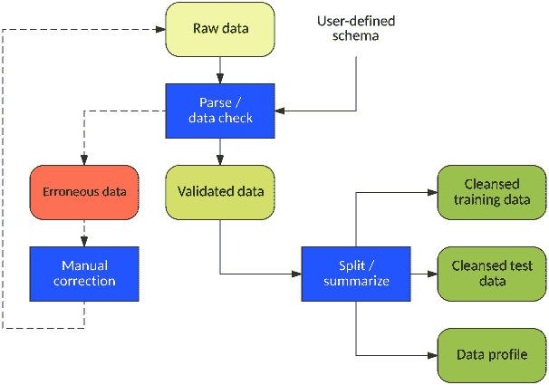
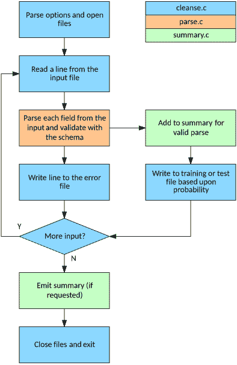
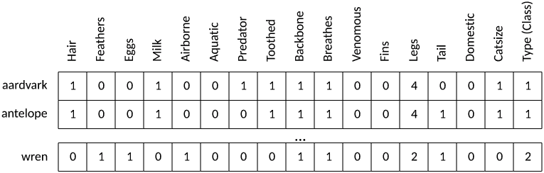

# 处理散乱数据

> 原文：[`developer.ibm.com/zh/tutorials/ba-cleanse-process-visualize-data-set-1/`](https://developer.ibm.com/zh/tutorials/ba-cleanse-process-visualize-data-set-1/)

数据具有许多形式，数据散乱无章。无论我们谈论的是缺失数据、非结构化数据还是缺乏常规结构的数据，都需要采用某些方法对数据执行清理，然后才能处理数据以改进数据质量。本教程探索处理实际数据的一些重要问题，以及可以应用的方法。

本系列包含 3 部分，本文是第 1 部分，该部分探索散乱数据的问题和可用来提高数据集质量的方法（参见图 1）。第 2 和 3 部分将继续介绍使用机器学习和数据可视化执行数据分析。

##### 从清理到学习和可视化的数据处理流程



数据科学及其算法简洁且精确，但它们处理的数据来自真实世界，这意味着这些数据是散乱的，需要一定的预处理才能有效地使用。从数据获取的洞察的质量取决于数据的有效性，所以必须执行一定的预处理。

数据清理在数据库中有着悠久的历史，是 *提取、转换、加载* (ETL) 过程中的关键一步。ETL 通常用在数据仓库中，这里的数据提取自一个或多个来源；转换为适当的格式和结构，包括执行数据清理；最后加载到最终目标位置，比如一个数据库或文件。

我们首先讨论拥有散乱数据意味着什么，然后深入剖析一些解决散乱的方法。

## 散乱数据是什么？

无论大小，数据集很少可以直接使用。如图 2 所示，我的简单的逗号分隔值 (CSV) 数据集存在各种各样的问题，包括无效字段、缺失和多余值，以及其他问题，这些问题导致我尝试解析此文件来供机器学习算法使用时出错。

##### 一个简单的散乱数据集示例



这个示例很简单，但任何处理过公共数据集的人都会理解这些问题，明白预处理数据以使其可供使用的必要性。存在这些明显错误的数据集，会导致处理后的数据的结果不可靠。包含错误的观察值会导致数据不完整，或者无效的观察值会导致结果错误。因此，清理数据是数据处理流程中的关键一步。

数据也可能来自多个来源。尽管每个单独的来源可能是有效的，但将数据汇集在一起可能需要执行一致性和统一性处理。例如，一个数据集可能为不同给定字段采用了不同度量单位，这就需要对它们执行规范化。

数据有效性的一个关键因素是表示数据的格式。接下来讲讲此因素。

## 数据格式和模式

数据集可能有许多形式，但大部分都存储为分隔文本文件。如前面的示例所示，这些数据集使用一个字符（通常是一个逗号）来分隔它们的字段，但在其他情况下可能通过空白（空格、制表符等）来分隔。这些原始数据集特别容易出错，因为它们缺乏任何表明结构的信息，所以需要数据科学家对数据集进行人工解释。

所称的”自描述格式”能显著提高我们正确维护数据的能力。这些格式包括 XML 和 JSON。这些数据格式允许将数据嵌入在元数据中，让它可在单个文件内充分地自我描述。它们还支持复杂的数据格式，这些格式更难通过简单的纯文本文件来描述（比如数据的变量数组或数据内的关系）。

图 3 展示了如何使用 JSON 格式表示温度数据。如图所示，数据带有标签，标签已经过预定义，以便摄取工具能理解需要何种数据。

##### 使用 JSON 格式对一个数据集进行自描述



在这个示例中，使用自描述格式的缺点显露无遗。与自描述格式相比，在简单纯文本文件中，数据更小。尽管如此，确实存在能通过少得多的开销来实现自描述的二进制格式，但是 CSV 或其他纯文件文本格式的简单性占据了优势，这得益于它们在解析上的简单性。可以为纯文件文本数据集定义模式，如示例应用程序所示。

## 数据混合或融合

通过 *数据混合* 流程，可从两个或多个独立数据集构造一个数据集。混合数据可能不是一次性流程；它可以基于机器学习用例而按需执行。

混合数据存在目前讨论的所有问题 — 也就是说有清理多个数据源的必要性。但是，在每个来源中的数据表示上，融合多个数据集还存在其他问题（比如一个数据集使用摄氏度，另一个数据集使用开尔文，如下图所示）。各个来源中的数据可能不一致，可能需要转换并重新排序数据字段，以便能够正确使用融合的数据。

##### 混合并转换两个数据集



## 数据清理方法

数据清理始于 *数据解析* ，也即从数据文件获取每个观察值并提取每个独立元素。如果记录相似（元素数量相同、类型相似等），则可以轻松地确定解析方法。

给定一个 *模式* — 也即数据观察值的一种高级表示 — 的定义，可以对观察值执行类型检查，确保它与模式及用户对后续数据分析的期望相符。例如，假如您打算对给定字段执行数字运算，请确保该位置包含一个数字而不是字符串。模式也可以告诉您，是否为每个观察值表示了正确数量的字段（如果不是，您就会认识到数据集可能存在缺陷）。

一些数据清理应用程序允许通过函数构造规则，以允许更复杂的数据转换 — 例如，查询字段以基于它们的内容来创建或修改其他字段。规则还可以验证观察值的一致性（如果可能），以便删除无效数据或转换数据来提高准确性 — 例如，将美国邮政编码从 5 位数修改为增强的 9 位数。

也可以识别重复，但已有一些处理数据集中的重复观察值的应用程序，所以消除重复并不总是必需或必要的。

当一个数据集的语法正确时，就可以应用各种方法来确保数据的语义也正确。接下来我们将探索执行这一步的一种方法。

## 数据概要分析

当数据整洁时，作为清理过程中的辅助步骤，下一步是对数据执行概要分析。 *概要分析* 指的是分析数据以确保它是一致的。通过概要分析，可以剖析数据来查看各个字段的分布，以便查找异常值和其他与这个通用数据集不匹配的数据。

例如，图 5 演示了这一流程。在第 1 行，假定实数值表示物理测量值，那么 0 值可能表示此观察值存在的某个问题。在第 3 行，可以看到此处的测量值范围明显与此字段的其他测量值的范围不同（而且字段类型也不同）。最后，在第 5 行，可以注意到类名拼写错了。

##### 通过数据概要分析揭示数据集错误



在一些情况下，这些问题可通过概要分析自动检测出来。您可以指示所有测量值应大于 0，以便捕获第一种问题。通过统计分析，可以识别出第二个测量值异常。最后一个问题可通过捕获唯一类名来识别，通过它们出现的频率，可以理解这个特定的类名是一个异常值（可能仅出现了一次）。

可以在操作流的上下文中验证时序数据，确保按给定时间戳的正确顺序处理数据。否则，结果的有效性可能值得怀疑。可以通过移动数据窗口来将异常值（或 *峰值* ）修改为窗口中间值（通过应用 Hampel 过滤器）。

数据概要分析可以手动执行，我将通过构造一个数据清理工具来演示这一过程。

## 构建一个数据清理工具

构建通用的数据清理工具相对比较简单。我将演示构造一个简单的 CSV 数据清理工具来实现一组重要特性，包括：

*   通过用户定义的模式来检查字段类型
*   验证观察值的字段是否太少或太多
*   自动提取错误数据供用户检查
*   使用用户定义的概率来生成训练和测试数据集
*   汇总数据以执行简单的数据概要分析

首先简要讨论一下此工具的操作流程。图 6 演示了工作流程和得到的数据。

##### 一个数据清理和概要分析工具的操作流程



首先是一个格式化为逗号分隔文本文件的原始数据集。用户以字符串形式提供模式，识别每个字段的类型，以用于解析和验证每个观察值的每个字段。将没有通过类型检查（或包含太少或太多字段）的观察值写入一个错误文件（我可以手动修复该文件并重新应用于原始数据集）。通过初始检查的观察值被视为有效，然后前进到数据集拆分和汇总步骤。我可以（基于用户定义的概率）将每个新样本发送到一个训练或测试数据集，每个字段按特定于类型的方式进行汇总。例如，对字符串执行聚合（最多 10 个），分析整数和实数值中的最小值、最大值和平均值。

可以在 GitHub 上找到这个 [简单清理工具](https://github.com/mtimjones/dataprocessing) 的源代码，如下文所示。这个存储库包含 3 个源文件，分别实现输入文件管理、行解析和汇总。源代码将功能拆分为处理循环 (`cleanse.c`)、字段解析 (`parse.c`) 和汇总 (`summary.c`)。处理循环解析来自命令行的选项，打开（和关闭）所有相关文件，迭代式读取输入文件中的行。这些行传递到解析器，解析器然后解析各行中的每个字段，并使用所提供的模式验证这些字段。摘要在一个单独文件中管理，以维护给定字段的唯一字符串列表或对数字数据进行概要分析。

##### 演示数据清理和概要分析工具的流程图



现在看看如何实际使用该工具。

我使用了 Richard Forsyth 创建的一个称为 [动物园数据库](https://archive.ics.uci.edu/ml/machine-learning-databases/zoo/) 的旧数据集，其中包含 15 个描述动物及其名称和类（称为 *类型* ）的二进制值属性，以及一个表示动物的腿数量的非二进制属性。模式和样本如图 8 所示，此数据集中包含了（7 个可能类的）101 个总观察值中的 3 个。

##### 动物园数据集演示（模式和 3 个观察值）



源代码包含一个 `Makefile` ，通过使用它，我可以在标准 Linux 命令行上输入 `make` 来构建该工具：

```
$ make
gcc -o cleanse cleanse.c parse.c summary.c -I. -g -std=c99 -Wall
$ 
```

得到的可执行文件名为 `cleanse` 。我通过指定输入文件（ `-i` 选项）、输出文件（ `-o` 选项）和模式（ `-c` 选项）来调用此工具。 为数据中的每个逗号分隔字段使用单个字符来表示模式（ `d` 表示整数， `s` 表示字符串， `g` 表示浮点数或双精度浮点数）。

```
$ ./cleanse -i zoo.dat -o output -c "sddddddddddddddddd"
$ 
```

如果检查错误文件，可以看到没有正确解析并因此被存储为错误的记录。请注意，还生成了注释来表明第一个错误位于给定观察值中的何处。如下面的代码中所示，第一个错误在一个二进制值的位置找到一个问号 (`?`)，第二个错误识别出一个缺失值。最后一个错误没有任何数据。对于存在明显问题的数据，我可以在原始数据集中修复它。

```
$ cat output.err
# Error in field 4
cat,1,0,0,?,0,0,1,1,1,1,0,0,4,1,1,1,1
# Error in field 4
dog,1,0,0,,0,0,1,1,1,1,0,0,4,1,1,1,1
# Error in field 0
,,,,,,,,,,,,,,,,,
$ 
```

输出文件（名为 *output.dat* ）包含该工具已验证的观察值：

```
$ more output.dat
aardvark,1,0,0,1,0,0,1,1,1,1,0,0,4,0,0,1,1
antelope,1,0,0,1,0,0,0,1,1,1,0,0,4,1,0,1,1
bass,0,0,1,0,0,1,1,1,1,0,0,1,0,1,0,0,4
...
worm,0,0,1,0,0,0,0,0,0,1,0,0,0,0,0,0,7
wren,0,1,1,0,1,0,0,0,1,1,0,0,2,1,0,0,2
$ 
```

通过使用有效的数据集，然后我可以通过指定 `-p` 选项来查看数据的概况。下面给出了此输出的一部分，字符串数据的摘要（省略号 [`...`] 表明有 10 个或更多唯一字符串）和 3 个数字字段。例如，从此数据可以看到，有一些观察值包含 `feathers` 。

```
$ ./cleanse -i output.dat -o output2 -c "sddddddddddddddddd" -p
Data Profile:

Field 0: (STRING)
     aardvark
     antelope
     bass
     bear
     boar
     buffalo
     calf
     carp
     catfish
     cavy
     ...

Field 1: (INT)
     Min: 0
     Max: 1
     Avg: 0.425743

Field 2: (INT)
     Min: 0
     Max: 1
     Avg: 0.19802
...
Field 17: (INT)
     Min: 1
     Max: 7
     Avg: 2.83168

$ 
```

这个简单数据清理工具的最后一个特性是能够将数据集拆分为两部分：一部分用于训练，另一部分用于测试。我可以通过 `-s` 选项（表示 *拆分* 数据集）来实现此目的。 为了演示此功能，我为数据指定 90/10 的拆分比例（为训练数据使用概率 0.9），然后查看每个输出文件的行长度（使用 `wc` 或 *字数统计* 实用程序，以及 `-l` 或 *line* 选项），以查看训练数据和测试数据是否按 90/10 的大体比例拆分。 最后，我给出一个 12 行的测试数据文件，以查看测试观察值的分布。

```
$ ./cleanse -i zoo.dat -o output -c "sddddddddddddddddd" -s 0.9
$ wc -l output.dat
89 output.dat
$ wc -l output.tst
12 output.tst
$ cat output.tst
carp,0,0,1,0,0,1,0,1,1,0,0,1,0,1,1,0,4
cheetah,1,0,0,1,0,0,1,1,1,1,0,0,4,1,0,1,1
clam,0,0,1,0,0,0,1,0,0,0,0,0,0,0,0,0,7
crayfish,0,0,1,0,0,1,1,0,0,0,0,0,6,0,0,0,7
flea,0,0,1,0,0,0,0,0,0,1,0,0,6,0,0,0,6
frog,0,0,1,0,0,1,1,1,1,1,0,0,4,0,0,0,5
gorilla,1,0,0,1,0,0,0,1,1,1,0,0,2,0,0,1,1
haddock,0,0,1,0,0,1,0,1,1,0,0,1,0,1,0,0,4
mole,1,0,0,1,0,0,1,1,1,1,0,0,4,1,0,0,1
ostrich,0,1,1,0,0,0,0,0,1,1,0,0,2,1,0,1,2
raccoon,1,0,0,1,0,0,1,1,1,1,0,0,4,1,0,1,1
reindeer,1,0,0,1,0,0,0,1,1,1,0,0,4,1,1,1,1
$ 
```

我现在可以将训练数据文件 (output.dat) 和测试数据文件 (output.tst) 应用于一个机器学习算法，下一篇教程将探索该主题，介绍两种独特的分类方法。

## 开源数据清理工具

可以在开源领域找到许多数据清理工具。一个有趣的示例是 *[Drake](https://github.com/Factual/drake)* ，它使用一种工作流方法来对基于文本的数据执行数据清理，该方法自动处理可用数据中的依赖关系并运行命令来清理它们。它支持多个输入和输出文件，而且有一个与 `make` 实用程序类似的操作（在管理依赖关系的上下文中）。

[DataCleaner 工具](https://github.com/datacleaner/DataCleaner) 是一个框架兼数据概要分析引擎，它公开了一个 API，而且允许使用用户定义的扩展进行数据清理。DataCleaner 支持多种输入和输出格式，能够为数据创建数据质量规则。

## 结束语

本教程探索了清理数据的问题和解决方案，讨论了如何开发一个能够执行数据验证和概要分析的简单实用程序。在第 2 部分，我将利用这些经过清理的数据，构建两种模型（基于自适应共振理论和矢量量化）来分类数据，以及量化每种模型的准确性。在第 3 部分，我将探索使用各种开源工具对此数据进行可视化的一些方式。

本文翻译自：[Working with messy data](https://www.ibm.com/developerworks/library/ba-cleanse-process-visualize-data-set-1/)（2018-01-31）