# 使用 Apache SystemML 执行异常检测

> 原文：[`developer.ibm.com/zh/tutorials/iot-deep-learning-anomaly-detection-4/`](https://developer.ibm.com/zh/tutorials/iot-deep-learning-anomaly-detection-4/)

在本系列文章中，目前我已[介绍了深度学习和长短期记忆 (LSTM) 网络](https://www.ibm.com/developerworks/analytics/library/iot-deep-learning-anomaly-detection-1/index.html?ca=drs-)，展示了[如何生成用于异常检测的数据](https://www.ibm.com/developerworks/analytics/library/iot-deep-learning-anomaly-detection-2/index.html)，还介绍了[如何使用 Deeplearning4j](https://www.ibm.com/developerworks/analytics/library/iot-deep-learning-anomaly-detection-3/index.html) 工具包。在第 4 篇文章中，我将介绍 Apache SystemML。

提醒一下，我们的任务是检测一个轴承中的振动（加速计）传感器数据中的异常，如轴承上的加速计传感器记录了 3 个几何轴 x、y 和 z 上的振动。所示。

##### 轴承上的加速计传感器记录了 3 个几何轴 x、y 和 z 上的振动。

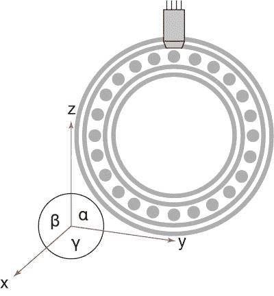

谈到深度学习，许多人会谈论诸如 Caffe、TensorFlow 和 PyTorch 之类的库。这些库都是不错的工具，但在您熟悉 Apache Spark 后（我很喜欢 Apache Spark 在大型集群上的扩展效率），您需要问自己是否有一个更好的工具在 Apache Spark 上执行深度学习。我已经介绍了 DeepLearning4J 工具包及其集成运行时模块和 ND4J 库，现在，我将介绍 Apache SystemML。

## 构建您的应用程序需要做的准备工作

*   一个 IBM Cloud 帐户。（您可以[在这里申请一个免费试用帐户](https://cloud.ibm.com/registration?cm_sp=ibmdev-_-developer-tutorials-_-cloudreg)，可在以后将它转换为免费增值帐户。）
*   一个 Data Science Experience 帐户。可以使用您在注册 IBM Cloud 帐户时创建的 IBM ID。

*   打开 [`www.ibm.com/cloud/watson-studio`](https://www.ibm.com/cloud/watson-studio)。

*   单击 **Sign up**。
*   单击 **Sign in with your IBM ID**。
*   单击 **Sign up for DSX**。
*   在 Create Organization and Space 页面上，单击 **Continue**。
*   等待环境初始化，并在完成初始化后单击 **Get Started**。

## 设置开发环境

在讨论深度学习用例之前，让我们花点时间来设置一下开发环境。我们使用了在 IBM Data Science Experience 内运行的 Jupyter Notebook。我们需要使用以下不同的 notebook：

*   第一个 notebook 用于在 DSX 中设置 Apache SystemML。运行该 notebook 一次。**备注：**V0.15（已预先构建到 DSX 中）不适合本教程。安装最新的快照。
*   第二个 notebook 用于解释如何结合使用前馈神经网络和 Python 基础版（也就是说，不在 Apache Spark 上运行）。
*   第三个 notebook 使用了 Apache SystemML，并与 Watson IoT Platform 相集成。

我们不会从对象存储访问数据，而是使用 Watson IoT Platform 从 MQTT 直接实时访问它。

1.  登录到 [`www.ibm.com/cloud/watson-studio`](https://www.ibm.com/cloud/watson-studio)。
2.  要使用正确的 Apache SystemML 版本，可安装一个 notebook：

    1.  单击 **Tools > Notebook**。
    2.  单击 **From URL**，在 **Name** 字段中添加一个名称，在 **Notebook URL** 字段中粘贴以下 URL：

        [`raw.githubusercontent.com/romeokienzler/developerWorks/master/systemml/SetupSystemML.ipynb`](https://raw.githubusercontent.com/romeokienzler/developerWorks/master/systemml/SetupSystemML.ipynb)

    3.  单击 **Create Notebook**。
    4.  单击 **Cell > Run All**。
3.  要理解如何结合使用前馈神经网络与 Python 基础版，可导入一个 notebook。

    1.  单击 **Tools > Notebook**。
    2.  单击 **From URL**，在 **Name** 字段中添加一个名称，在 **Notebook URL** 字段中粘贴以下 URL：[`raw.githubusercontent.com/romeokienzler/developerWorks/master/systemml/PythonFeedforward.ipynb`](https://raw.githubusercontent.com/romeokienzler/developerWorks/master/systemml/PythonFeedforward.ipynb)
    3.  单击 **Create Notebook**。

        **备注：** 现在不要运行此 notebook。在本文后面练习使用 Python 训练一个小型神经网络时，将引用它。

4.  要使用 Apache SystemML 和 Watson IoT Platform，可导入一个 notebook。

    1.  单击 **Tools > Notebook**。
    2.  单击 **From URL**，在 **Name** 字段中添加一个名称，在 **Notebook URL** 字段中粘贴以下 URL：[`raw.githubusercontent.com/romeokienzler/developerWorks/master/systemml/WatsonIoTPlatformSystemMLLSTM.ipynb`](https://raw.githubusercontent.com/romeokienzler/developerWorks/master/systemml/WatsonIoTPlatformSystemMLLSTM.ipynb)
    3.  单击 **Create Notebook**。

**备注：**现在不要运行此 notebook。我们会在本文后面引用它 – 练习在 Python 中训练一个小型神经网络的时候，以及我们实现一种梯度下降算法来最大限度减少函数使用数量的时候。

## Apache SystemML 是什么？

Apache SystemML 作为一个研究项目，开始于 2007 年在加利福尼亚的 IBM 阿尔马登研究实验室；它的历史比 Apache Spark 更久远。该项目的意图是改进数据科学家的工作流，特别是希望改进现有机器学习算法和 向其中增添功能的数据科学家。SystemML 分为 3 个核心组件：

*   **运行时** 组件在 Apache Spark 上透明地分发工作。
*   **声明式机器学习 (DML) 语言** （一种类似 R 的语法）能表达高级机器学习和深度学习中使用的线性代数和控制结构。
*   **基于成本的优化器** 决定了哪些线性代数运算应该以 SIMD 指令在集群扩展的多个 CPU 或 GPU（或同时使用 CPU 和 GPU）上以多线程运行。

### 透明的、分布式的运行时简化了处理

在 Apache Spark 上运行 Apache SystemML，解决了数据处理和机器学习中的数据并行化挑战。不同于其他框架，SystemML 是透明运行的。诸如 TensorFlow 之类的其他深度学习框架附带了自己的分布式计算环境，需要花费更多精力来完成操作。

### 声明式机器学习语言实现了线性代数

自 Apache SystemML 诞生以来，它经历了几次重构，现在它是全球最快的机器学习库之一。最近它添加了深度学习支持。这很容易做到，因为实现此支持所需的所有线性代数运算都是使用 SystemML DML 语言实现的。

10 年前，研究人员认识到，开箱即用的机器学习算法在大型数据集上的表现堪忧。数据分析管道演示了一个数据分析管道，在 MATLAB（矩阵实验室）、R 或 Python 中设计出它的小型版本的原型后，需要对它进行调优。

##### 数据分析管道

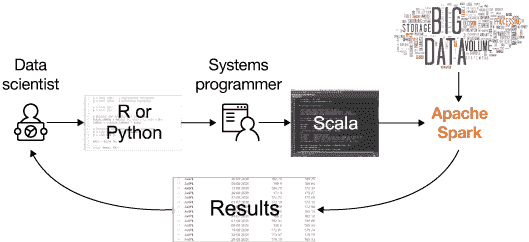

##### 并行神经网络训练

要理解如何在 Apache Spark 上使用 SystemML 并行训练神经网络，首先要尝试理解通常如何训练神经网络。

我们需要了解神经网络的核心工作原理。[观看这些神经网络揭秘视频](https://www.youtube.com/watch?v=bxe2T-V8XRs&list=PLiaHhY2iBX9hdHaRr6b7XevZtgZRa1PoU)。您可能需要多观看几次才能理解所有概念。

**备注：**这些视频没有解释用于最大限度减少函数使用数量的”梯度下降”算法。而是使用了一种无法并行化的算法。因为我们需要了解并行神经网络训练，所以我们需要了解梯度下降，这是一个非常重要的任务。请观看[我的视频](https://developer.ibm.com/tv/parallelization-strategies-of-deeplearning-neural-networks/)了解更多信息。

### 基于成本的优化器改进了机器学习算法的处理

Apache SystemML 上的关键组件是基于成本的优化器。SystemML 在最低级别上支持并行神经网络训练 – 在线性代数中。这个优化器把采用特定于领域的语言 (DSL) 对算法的高阶描述转换为 Apache Spark 上高度优化的物理执行。

SystemML 优化器的工作原理究竟是什么？该引擎做的第一件事是 DSL 上的一个编译步骤：执行语法检查，执行实时变量分析来确定哪些中间结果仍然是必需的，并执行语义检查。

编译步骤通过后，生成一个使用高级运算符 (HOP) 的执行计划。HOP 是通过 DSL 的抽象语法树 (AST) 来构造的。在该阶段会执行以下重要的优化步骤：

*   **静态重写**

    DSL 提供了丰富的语法和语义特性，使得某个实现变得很容易理解，但可能导致执行效率欠佳。SystemML 检测 AST 中效率欠佳的表达式，将它们重写为更高性能的表达式（当然会保持语义等效性）。

*   **动态重写**

    动态重写类似于静态重写，但会考虑表达式中使用的数据大小。

加权除法矩阵乘法 HOP（高级运算符）的静态重写演示了一种重写，在该重写中，实际上重写了一个 HOP 有向非循环图 (DAG) 中的一个完整表达式，以便使用一个名为 **wdivmm** （加权除法矩阵乘法，weighted divide matrix multiplication）的融合运算符。 **wdivmm** 运算符通过利用权值矩阵 `W` 的稀疏性，避免非常大、非常稠密的中间值，并节省计算资源。

##### 加权除法矩阵乘法 HOP（高级运算符）的静态重写

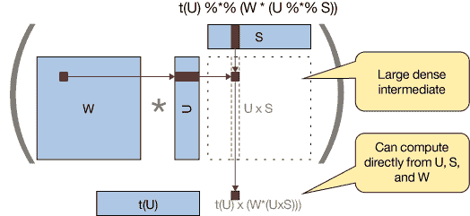

让我们看看如何选择和优化低级运算符 (LOP)。我们仍然使用加权除法矩阵乘法 HOP（高级运算符）的静态重写中所示的加权除法矩阵乘法示例。请记住，这个 HOP 是在 HOP 优化过程中选中的。现在的问题是：在 Apache Spark 工作者节点上使用相应 LOP 的并行版本是否有意义，或者采用本地执行版本是否更可取？基于估算的输入、中间值和输出矩阵大小的低级运算符执行类型表明，Apache SystemML 决定了整个计算过程（包括输入、中间值和输出）在驱动程序节点的主内存中执行，因此它选择了本地运算符 **wdivmm** 而不是分布式运算符 **mapwdivmm**。

##### 基于估算的输入、中间值和输出矩阵大小的低级运算符执行类型

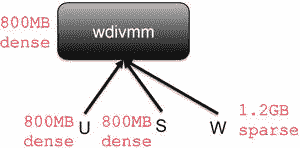

所有这些基于成本的优化工作是否值得？让我们看看运行时性能比较 – 此图已获得 Creative Commons Attribution-NonCommercial-NoDerivatives 4.0 International License 许可。要查看此许可的副本，请访问 [`creativecommons.org/licenses/by-nc-nd/4.0/`](http://creativecommons.org/licenses/by-nc-nd/4.0/)。中对本地 R 脚本、MLLib 和 SystemML 执行的一些性能比较。

##### 运行时性能比较 – 此图已获得 Creative Commons Attribution-NonCommercial-NoDerivatives 4.0 International License 许可。要查看此许可的副本，请访问 [`creativecommons.org/licenses/by-nc-nd/4.0/`](http://creativecommons.org/licenses/by-nc-nd/4.0/)。

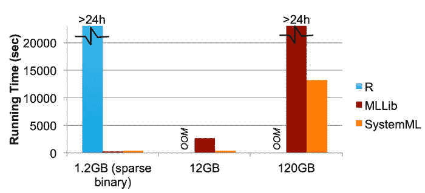

在包含 1.2 GB、12 GB 和 120 GB 数据的不同数据集上使用 R、MLLib 和 SystemML 运行了 ALS 算法（或交替最小二乘法，这是推荐器系统中通常使用的矩阵因式分解算法）。我们可以清楚地看到，即使在最小的数据集上，R 也不是可行的解决方案，因为它花费的时间超过 24 小时，而且我们不确定它是否会完成运行。在 12 GB 数据集上，我们注意到 SystemML 的运行速度明显比 MLLib 快得多。最后，在 120 GB 数据集上，MLLib 的 ALS 实现没有在一天内完成，我们放弃了该实现。明显的获胜者是 SystemML，它的运行时性能适合生产用途。

## 练习在 Python 中训练一个小型神经网络

现在您已经了解了 SystemML 的功能，我想展示一下如何创建神经网络。在开始处理我们的 IoT 时序数据之前，先来看看我们导入 PythonFeedforward Notebook 中的这个 Python 示例。您可以使用在设置开发环境时导入的 notebook 来跟随操作。

1.  登录到 [`www.ibm.com/cloud/watson-studio。`](https://www.ibm.com/cloud/watson-studio。)
2.  单击 **Default Project**。
3.  要编辑该 notebook，请单击该 notebook 附近的铅笔符号。
4.  要运行该 notebook，请单击运行符号。

首先，我们实现了一个包含单个隐藏层的前馈神经网络。接下来，我们通过梯度下降（一种最大限度减少函数使用数量的算法）来增强它。通过使用 SystemML 并行运行所有线性代数运算，我们显著提升了性能。最后，我们利用 Apache SystemML 中的深度神经网络库来简化代数运算。

### 实现一个包含单个隐藏层的前馈神经网络

考虑下面这个 Python 类。此代码实现了一个包含单个隐藏层的前馈神经网络。它不仅实现了正向通道，还实现了反向传播通道。这个通道被实现为实际的反向传播函数的一阶导数，该导数获取一个方向的梯度，我们需要沿该方向调节权值矩阵 `W1` 和 `W2`，让网络适应我们的数据。

```
import numpy as np

class Neural_Network(object):
    def __init__(self):
        #Define Hyperparameters
        self.inputLayerSize = 2
        self.outputLayerSize = 1
        self.hiddenLayerSize = 3

        #Weights (parameters)
        self.W1 = np.random.randn(self.inputLayerSize, self.hiddenLayerSize)
        self.W2 = np.random.randn(self.hiddenLayerSize, self.outputLayerSize)

    def forward(self, X):
        #Propagate inputs though network
        self.z2 = np.dot(X, self.W1)
        self.a2 = self.sigmoid(self.z2)
        self.z3 = np.dot(self.a2, self.W2)
        yHat = self.sigmoid(self.z3)
        return yHat

    def sigmoid(self, z):
        #Apply sigmoid activation function to scalar, vector, or matrix
        return 1/(1+np.exp(-z))

    def costFunction(self, X, y):
        #Compute cost for given X,y, use weights already stored in class.
        self.yHat = self.forward(X)
        #print y
        #print self.yHat
        J = 0.5*sum((y-self.yHat)**2)
        return J

    def sigmoidPrime(self,z):
        #Gradient of sigmoid
        return np.exp(-z)/((1+np.exp(-z))**2)

    def tanh(self,x):
        return np.tanh(x)

    def tanh_deriv(self,x):
        return 1.0 - np.tanh(x)**2

    def logistic(x):
        return 1/(1 + np.exp(-x))

    def logistic_derivative(x):
        return logistic(x)*(1-logistic(x))

    def costFunctionPrime(self, X, y):
        #Compute derivative with respect to W and W2 for a given X and y:
        self.yHat = self.forward(X)

        delta3 = np.multiply(-(y-self.yHat), self.sigmoidPrime(self.z3))
        #delta3 = np.multiply(-(y-self.yHat), self.z3)
        dJdW2 = np.dot(self.a2.T, delta3)

        delta2 = np.dot(delta3, self.W2.T)*self.sigmoidPrime(self.z2)
        dJdW1 = np.dot(X.T, delta2)

        return dJdW1, dJdW2 
```

### 实现梯度下降来最大限度减少函数使用数量

接下来，我们将实现一个梯度下降来最大限度减少函数使用数量计算梯度 `dJdW1` 和 `dJdW2`。通过使用以下更新函数 `NN.W - learningRate * dJdW`，我们朝正确方向逐步推送权值矩阵 `W1` 和 `W2`。但是，请注意此代码完全没有并行运行。

```
NN = Neural_Network()
max_iterations = 10000
iter = 0
learningRate = 0.01
while iter < max_iterations:
      dJdW1, dJdW2 = NN.costFunctionPrime(X,y)

      #update
      NN.W1 = NN.W1 - learningRate * dJdW1
      NN.W2 = NN.W2 - learningRate * dJdW2

      if iter % 1000 == 0:
            print NN.costFunction(X,y)

      iter = iter + 1 
```

Apache SystemML 能并行化和分发这些线性代数和深度学习运算。我们如何在 Apache Spark 上轻松并行化此代码？利用 SystemML。

让我们从这个缓慢的单线程实现切换到 SystemML。 要跟随操作此代码，可以打开并使用您在设置开发环境时导入 Data Science Experience 中的 WatsonIoTPlatformSystemMLLSTM Notebook。此代码非常类似于之前的 Python 代码，但该代码是使用 SystemML DML 语言实现的。

```
sigmoid = function(matrix[double] z) return (matrix[double] z) {
    z = 1/(1+exp(-z))
}

sigmoidPrime = function(matrix[double] z) return (matrix[double] z) {
        #Gradient of sigmoid
        z = exp(-z)/(1+exp(-z))
}

inputLayerSize = 2
outputLayerSize = 1
hiddenLayerSize = 3

W1 = rand(rows=inputLayerSize,cols=hiddenLayerSize)
W2 = rand(rows=hiddenLayerSize,cols=outputLayerSize)
feedForward = function (matrix[double] X,
                        matrix[double] W1,
                        matrix[double] W2) return (matrix[double] z2,matrix[double] a2,matrix[double] z3,matrix[double] Y) {
    z2 =  X %*% W1
    a2 =  sigmoid(z2)
    z3 = (a2 %*% W2)
    Y = sigmoid(z3)
}

gradient = function(matrix[double] X,
                        matrix[double] W1,
                        matrix[double] W2,
                        matrix[double] Y) return (matrix[double] dJdW1,matrix[double] dJdW2) {
    #Compute derivative with respect to W and W2 for a given X and y:
    [z2,a2,z3,Yhat] = feedForward(X,W1,W2)

    smpz3 =  sigmoidPrime(z3)
    delta3 = -(Y-Yhat) * smpz3
    dJdW2 = t(a2) %*% delta3

    smpz2 = sigmoidPrime(z2)
    delta2 = (delta3 %*% t(W2))*smpz2
    dJdW1 = t(X) %*% delta2
}

upd_W1 = matrix(0, rows=nrow(W1), cols=ncol(W1))
upd_W2 = matrix(0, rows=nrow(W2), cols=ncol(W2))
mu = 0.9

max_iterations = 10000
iter = 0
learningRate = 0.001

[z2,a2,z3,YhatBefore] = feedForward(X,W1,W2)

while( iter < max_iterations ){
      [dJdW1, dJdW2] = gradient(X,W1,W2,y)

      #update
      lrdJdW1 = learningRate * dJdW1
      lrdJdW2 = learningRate * dJdW2
      W1 = W1 - lrdJdW1
      W2 = W2 - lrdJdW2

     iter = iter + 1
}

[z2,a2,z3,YhatAfter] = feedForward(X,W1,W2) 
```

### 通过 SystemML 深度神经网络库简化线性代数

编写所有这些线性代数代码可能很费劲。因此，SystemML 提供了一个深度神经网络库。考虑下面这段代码，它使用该库重新实现了我们的示例。

这段代码看起来简单得多，对吧？我们没有使用基本的线性代数运算，而是调用了 SystemML 的深度神经网络库的正向和反向函数。

```
source("nn/layers/affine.dml") as affine
source("nn/layers/conv2d_builtin.dml") as conv2d
source("nn/layers/cross_entropy_loss.dml") as cross_entropy_loss
source("nn/layers/dropout.dml") as dropout
source("nn/layers/l2_reg.dml") as l2_reg
source("nn/layers/max_pool2d_builtin.dml") as max_pool2d
source("nn/layers/relu.dml") as relu
source("nn/layers/softmax.dml") as softmax
source("nn/layers/sigmoid.dml") as sigmoid
source("nn/optim/sgd_nesterov.dml") as sgd_nesterov
#
inputLayerSize = 2
outputLayerSize = 1
hiddenLayerSize = 3

[W1, b1] = affine::init(inputLayerSize, hiddenLayerSize)
[W2, b2] = affine::init(hiddenLayerSize, outputLayerSize)

sigmoidPrime = function(matrix[double] z) return (matrix[double] z) {
        #Gradient of sigmoid
        z = exp(-z)/(1+exp(-z))
}

#W1 = rand(rows=inputLayerSize,cols=hiddenLayerSize)
#W2 = rand(rows=hiddenLayerSize,cols=outputLayerSize)

feedForward = function (matrix[double] X,
                        matrix[double] b1,
                        matrix[double] b2,
                        matrix[double] W1,
                        matrix[double] W2) return (matrix[double] z2,matrix[double] a2,matrix[double] z3,matrix[double] Y) {
    z2 = affine::forward(X, W1, b1)
    a2 = sigmoid::forward(z2)
    z3 = affine::forward(a2, W2, b2)
    Y = sigmoid::forward(z3)
}
gradient = function(matrix[double] X,
                        matrix[double] b1,
                        matrix[double] b2,
                        matrix[double] W1,
                        matrix[double] W2,
                        matrix[double] Y) return (matrix[double] dJdW1,matrix[double] dJdW2) {
    #Compute derivative with respect to W and W2 for a given X and y:
    [z2,a2,z3,Yhat] = feedForward(X,b1,b2,W1,W2)
    loss = cross_entropy_loss::backward(Yhat, Y)

    smpz3 =  sigmoid::backward(loss,z3)
    [delta2,dJdW2,db2] = affine::backward(smpz3,a2,W2,b2)

    smpz2 =  sigmoid::backward(delta2,z2)
    [delta2,dJdW1,db1] = affine::backward(smpz2,X,W1,b1)
}

upd_W1 = matrix(0, rows=nrow(W1), cols=ncol(W1))
upd_W2 = matrix(0, rows=nrow(W2), cols=ncol(W2))
mu = 0.9

max_iterations = 10000
iter = 0
learningRate = 0.001

[z2,a2,z3,YhatBefore] = feedForward(X,b1,b2,W1,W2)

while( iter < max_iterations ){
      smy = sigmoid::forward(y)
      [dJdW1, dJdW2] = gradient(X,b1,b2,W1,W2,smy)

      #update
      lrdJdW1 = learningRate * dJdW1
      lrdJdW2 = learningRate * dJdW2
      W1 = W1 - lrdJdW1
      W2 = W2 - lrdJdW2

     iter = iter + 1
}

[z2,a2,z3,YhatAfter] = feedForward(X,b1,b2,W1,W2) 
```

## 创建一个 SystemML 神经网络来执行异常检测

在 Python 中训练神经网络很容易掌握，但现在我们需要使用一个已生成的数据集，通过 Apache SystemML 和它的深度学习库在 Apache Spark 上构建一些有用的功能。（请记住，我们使用了一个 Lorenz Attractor 模型来获取轴承中模拟的实时振动传感器数据。我们需要将该数据传输到 IBM Cloud 平台。 请参阅关于 [如何生成用于异常检测的数据](https://www.ibm.com/developerworks/analytics/library/iot-deep-learning-anomaly-detection-2/index.html) 的教程。）我们在设置开发环境时导入了 WatsonIoTPlatformSystemMLLSTM Notebook，现在将分析它。

### 训练一个用于无监督机器学习的前馈神经网络

要将 3 维时序数据馈送到前馈神经网络中，明智之举是添加一个称为“[特征工程](https://en.wikipedia.org/wiki/Feature_engineering) ”的步骤。我们将使用 DFT（离散傅立叶变换）从时域变换为频域。参见时域中处于健康状态的数据，了解前 3,000 个处于健康状态的样本在时域中的数据形式。

##### 时域中处于健康状态的数据

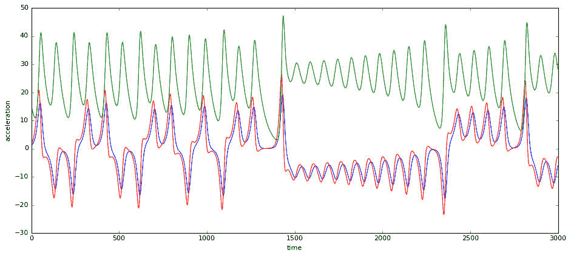

请注意，尽管此系统在两个半稳定状态之间游移，但很难识别出任何有规律的模式。

查看 时域中处于损坏状态的数据 中的相同图表，其中我们已将测试数据生成器切换到损坏状态。

##### 时域中处于损坏状态的数据

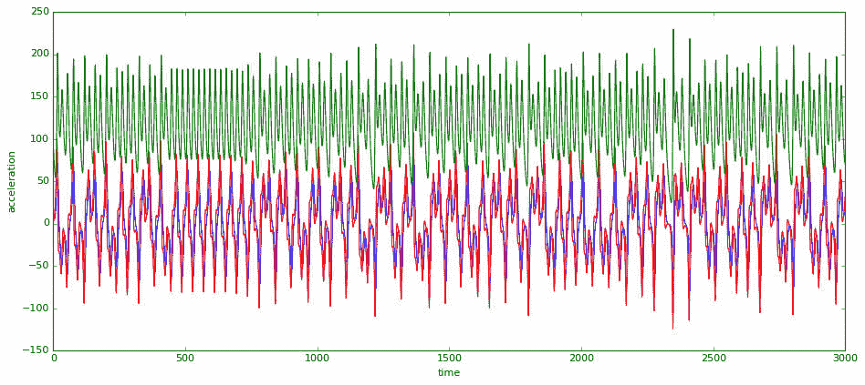

结果很明显，我们在系统中看到了高得多的能量。峰值超过了 200，而在健康状态下从未超过 50。此外，在我看来，第二个信号的频率含量更高。

让我们通过将信号从时域变换频域，确认第二个信号的频率。 频域中处于健康状态的数据 中的图表包含健康信号的频率。

##### 频域中处于健康状态的数据

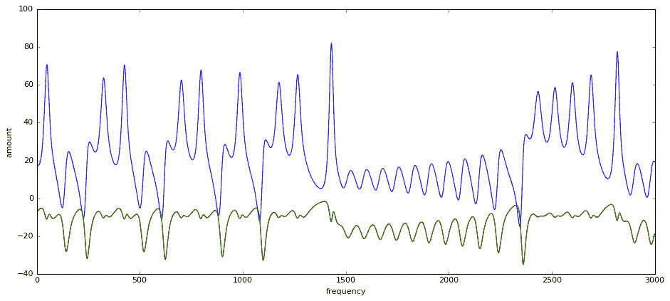

现在将此结果与 频域中处于损坏状态的数据 中的损坏信号进行比较。

##### 频域中处于损坏状态的数据

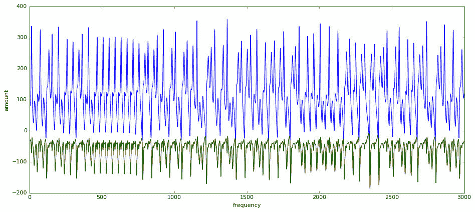

跟预期一样，损坏信号中出现了多得多的频率。

我们有足够的证据来构造一个基于*监督式*机器学习的异常检测器（采用一种类似梯度提升树的最先进模型）。但是我们想要使用*无监督*机器学习，因为我们不知道信号的哪些部分是正常的，哪些部分是不正常的。

一种简单的无监督机器学习方法是馈送这 3,000 个频带（请记住，DFT 返回的频带数与信号中的样本数一样多，而且因为我们以 100 Hz 频率在物理模型中进行了 30 秒的采样，所以这也是频带数量）。

借助此方法，我们将三维输入数据（我们度量的 3 个加速计轴）转换为了一个 9,000 维数据集（每个加速计轴 3,000 个频带）。这是我们的新的 9,000 维输入特征空间。我们可以使用这个 9,000 维输入空间训练一个前馈神经网络。我们在前馈神经网络中的隐藏层只有 100 个神经元（而在输入和输出层中有 9,000 个神经元）。这称为一个*瓶颈*，而且这将我们的神经网络转换成了一个[自动编码器](https://en.wikipedia.org/wiki/Autoencoder)。我们通过将这些输入分配到输入和输出层上来训练神经网络。该神经网络将学习在输出上重新构造输入。但是该神经网络需要知道重构需要经历 100 个神经元隐藏层瓶颈。这样，我们就可以预防神经网络学习任何噪声或不相关数据。我们导入到 Notebook 中的 Apache SystemML 代码定义了这样一个神经网络。

```
script = """
source("nn/layers/affine.dml") as affine
source("nn/layers/conv2d_builtin.dml") as conv2d
source("nn/layers/cross_entropy_loss.dml") as cross_entropy_loss
source("nn/layers/l2_loss.dml") as l2_loss
source("nn/layers/dropout.dml") as dropout
source("nn/layers/l2_reg.dml") as l2_reg
source("nn/layers/max_pool2d_builtin.dml") as max_pool2d
source("nn/layers/relu.dml") as relu
source("nn/layers/softmax.dml") as softmax
source("nn/layers/sigmoid.dml") as sigmoid
source("nn/optim/sgd_nesterov.dml") as sgd_nesterov
source("nn/optim/rmsprop.dml") as rmsprop
#
inputLayerSize = 3000
outputLayerSize = 3000
hiddenLayer1Size = 100

Xt = t(X)

n = nrow(Xt)
means = colSums(Xt)/n
stds = sqrt((colSums(Xt²)/n - means*means)*n/(n-1)) + 1e-17
Xt = (Xt - means)/stds

Xt = 1/(1+exp(-Xt))

y = Xt

[W1, b1] = affine::init(inputLayerSize, hiddenLayer1Size)
[W2, b2] = affine::init(hiddenLayer1Size, outputLayerSize)
if (pushWeights) {
    W1 = W1push
    W2 = W2push
}

feedForward = function (matrix[double] X,
                        matrix[double] b1,
                        matrix[double] b2,
                        #matrix[double] b3,
                        matrix[double] W1,
                        matrix[double] W2
                        #matrix[double] W3
                        )
                        return (matrix[double] z2,
                        matrix[double] a2,
                        matrix[double] z3,
                        #matrix[double] a3,
                        #matrix[double] z4,
                        matrix[double] Y) {
    z2 = affine::forward(X, W1, b1)
    a2 = sigmoid::forward(z2)
    z3 = affine::forward(a2, W2, b2)
    Y = sigmoid::forward(z3)
}

gradient = function(matrix[double] X,
                        matrix[double] b1,
                        matrix[double] b2,
                        #matrix[double] b3,
                        matrix[double] W1,
                        matrix[double] W2,
                        #matrix[double] W3,
                        matrix[double] Y) #{
                        return (matrix[double] dJdW1,
                        matrix[double] dJdW2
                        #matrix[double] dJdW3
                        ) {
    #Compute derivative with respect to W and W2 for a given X and y:
    [z2,a2,z3,Yhat] = feedForward(X,b1,b2,W1,W2)

    loss = l2_loss::backward(Yhat, Y)

    smpz3 =  sigmoid::backward(loss,z3)
    [delta2,dJdW2,db2] = affine::backward(smpz3,a2,W2,b2)

    smpz2 =  sigmoid::backward(delta2,z2)
    [delta2,dJdW1,db1] = affine::backward(smpz2,X,W1,b1)
}
upd_W1 = matrix(0, rows=nrow(W1), cols=ncol(W1))
upd_W2 = matrix(0, rows=nrow(W2), cols=ncol(W2))

max_iterations = 10000
iter = 0
learningRate = 0.001

while( iter < max_iterations ){
      [dJdW1, dJdW2] = gradient(Xt,b1,b2,W1,W2,y)

      #update
      lrdJdW1 = learningRate * dJdW1
      lrdJdW2 = learningRate * dJdW2
      W1 = W1 - lrdJdW1
      W2 = W2 - lrdJdW2

      iter = iter + 1
      if (iter %% 100 == 0) {
          #[z2,a2,z3,a3,z4,Yhat] = feedForward(Xt,b1,b2,b3,W1,W2,W3)
          [z2,a2,z3,Yhat] = feedForward(Xt,b1,b2,W1,W2)
          sse = sqrt(sum((Xt-Yhat)²))
          print(sse)
      }
}
""" 
```

让我们分析一下此代码。首先，我们定义了每层的神经元数量。输入层需要 3,000 个神经元，因为在应用 FFT（快速傅立叶变换）后，我们的 3,000 个输入样本的频域有 3,000 个维度。然后，由于我们使用了自动编码器，所以输出需要相同数量的神经元。（请记住，我们正在尝试在输出上重新构造输入信号。）最后，隐藏层将我们的神经瓶颈定义为 100 个神经元。因此，无关数据和噪声数据无法被学习。自动编码器仅学习对重新构造该信号绝对必要的数据。

```
inputLayerSize = 3000
outputLayerSize = 3000
hiddenLayer1Size = 100 
```

标准化数据始终是一种最佳实践，所以我们将减去均值并除以标准偏差。

```
means = colSums(Xt)/n
stds = sqrt((colSums(Xt²)/n - means*means)*n/(n-1)) + 1e-17
Xt = (Xt - means)/stds 
```

接下来，初始化每层的权值矩阵。

```
[W1, b1] = affine::init(inputLayerSize, hiddenLayer1Size)
[W2, b2] = affine::init(hiddenLayer1Size, outputLayerSize) 
```

此代码通过按顺序计算每层和激活函数，计算神经网络的正向通道。

```
z2 = affine::forward(X, W1, b1)
a2 = sigmoid::forward(z2)
z3 = affine::forward(a2, W2, b2)
Y = sigmoid::forward(z3) 
```

当然，我们还需要计算反向传播通道。

**备注：**我们已计算了 SystemML 深度学习库中的反向传播通道的一阶导数，所以不要混淆。

```
[z2,a2,z3,Yhat] = feedForward(X,b1,b2,W1,W2)

loss = l2_loss::backward(Yhat, Y)

smpz3 =  sigmoid::backward(loss,z3)
[delta2,dJdW2,db2] = affine::backward(smpz3,a2,W2,b2)

smpz2 =  sigmoid::backward(delta2,z2)
[delta2,dJdW1,db1] = affine::backward(smpz2,X,W1,b1) 
```

最后，我们得出了某种梯度下降，即每迭代 100 次便输出一次损耗。

```
max_iterations = 10000
iter = 0
learningRate = 0.001

while( iter < max_iterations ){
      [dJdW1, dJdW2] = gradient(Xt,b1,b2,W1,W2,y)

      #update
      lrdJdW1 = learningRate * dJdW1
      lrdJdW2 = learningRate * dJdW2
      W1 = W1 - lrdJdW1
      W2 = W2 - lrdJdW2

      iter = iter + 1
      if (iter %% 100 == 0) {
          [z2,a2,z3,Yhat] = feedForward(Xt,b1,b2,W1,W2)
          sse = sqrt(sum((Xt-Yhat)²))
          print(sse)
      }
} 
```

### 使用健康和损坏的数据训练神经网络

我们现在使用 Python 代码，通过健康数据训练此神经网络两次，通过损坏数据训练一次。

```
dummyMatrix = np.array([[1],[1]])
with jvm_stdout(True):
    prog = dml(script).input(X=data_healthy_fft).input(pushWeights=False).input(W1push=dummyMatrix).input(W2push=dummyMatrix)
    result = ml.execute(prog)
    [W1,W2] = result.get("W1","W2")
    prog = dml(script).input(X=data_healthy_fft).input(pushWeights=True).input(W1push=W1).input(W2push=W2)
    result = ml.execute(prog)
    [W1,W2] = result.get("W1","W2")
    prog = dml(script).input(X=data_broken_fft).input(pushWeights=True).input(W1push=W1).input(W2push=W2)
    result = ml.execute(prog) 
```

如果描绘训练迭代中的损耗，就会得到使用健康和损坏数据的训练迭代。

##### 使用健康和损坏数据的训练迭代

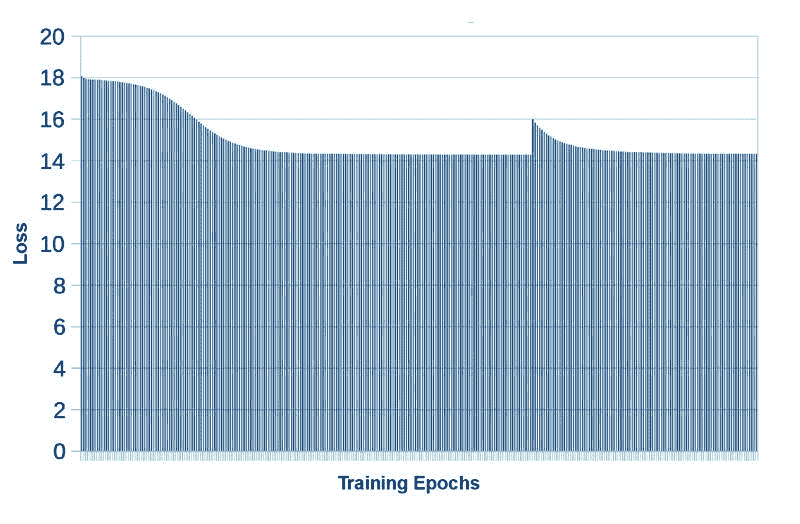

可以看到，使用健康数据的训练很快将损耗降低到 14 左右。如果训练更长时间，损耗不会再降低。但是也可以看到，向神经网络展示损坏数据后，损耗出现了峰值。

**备注：**这是我们的简单异常检测器。它采用了无监督机器学习。不需要提前知道神经网络是在健康数据还是损坏数据上训练的！

### 通过添加 LSTM 层来改进异常检测

Andrej Karpathy 编写的[递归神经网络难以置信的有效性](http://karpathy.github.io/2015/05/21/rnn-effectiveness/)是对 LSTM 网络的最佳介绍之一。

通过使用长短期记忆 (LSTM) 网络，我们可以超越最先进的时序异常检测算法和前馈神经网络。

考虑不同学习模型的结果中的信息，该表来自 Enzo Busseti、Ian Osband 和 Scott Wong 于 2012 年在斯坦福发表的[*用于时序建模的深度学习*](http://cs229.stanford.edu/proj2012/BussetiOsbandWong-DeepLearningForTimeSeriesModeling.pdf)。

##### 不同学习模型的结果

| 学习方法 | RMSE | % RMSE |
| --- | --- | --- |
| 内核回归 (Kernelized Regression) | 1,540 | 8.3% |
| 频率神经网络 | 1,251 | 6.7% |
| 深度前馈神经网络 | 1,103 | 5.9% |
| 深度递归神经网络 | 530 | 2.8% |

可以看到，FFT 和前馈神经网络的组合（表 1 中的第 2 行）优于最先进的内核回归（RMSE 分别为 6.7% 和 8.3%，RMSE 表示均方根误差，是对预测性能的一种度量）。我们将跳过对深度前馈神经网络的试验，直接跳到对一个深度递归神经网络的试验，因为它使用了 LSTM 层。使用 LSTM 层是一种向神经网络引入记忆的方式，使它们成为分析时序和序列数据的理想选择。

在下面的代码中，将 SystemML 中实现的前馈神经网络迁移到一个 LSTM 网络。

```
source("nn/layers/cross_entropy_loss.dml") as cross_entropy_loss
source("nn/layers/l2_loss.dml") as l2_loss

source("nn/layers/lstm.dml") as lstm
source("nn/layers/sigmoid.dml") as sigmoid

source("nn/optim/sgd_nesterov.dml") as sgd_nesterov
source("nn/optim/rmsprop.dml") as rmsprop

in_TS = 70 #in_TS
out_TS = 30 #out_TS
N = nrow(X) / (in_TS + out_TS)
M = out_TS

idx_mat = outer(seq(0,N-1,1), t(seq(0,in_TS+out_TS-1,1)), "+") + 1

idx_col = matrix(idx_mat, rows=nrow(idx_mat)*ncol(idx_mat), cols=1)
rordrd_X = table(seq(1, nrow(idx_col), 1), idx_col, nrow(idx_col), nrow(idx_col)) %*% X

X = matrix(rordrd_X, rows=nrow(idx_mat), cols=ncol(idx_mat))
#print(toString(X))

Y = X[,in_TS+1:in_TS+out_TS]
X = X[,1:in_TS]

max_iterations = 1000
iter = 0
learningRate = 0.01
decayRate = 0.95

[W, b, out0, c0] = lstm::init(N,1,M)

if (pushWeights) {
    W = Wpush
}

rmspropCache = rmsprop::init(W)

while( iter < max_iterations ){
    [a1, c, c_out, c_c, c_ifog] = lstm::forward(X, W, b, in_TS, 1, FALSE, out0, c0)
    loss = l2_loss::forward(a1, Y)

    if(iter %% 100 == 0) print("iter=" + iter + " loss=" + loss)

    loss_grad = l2_loss::backward(a1, Y)
    [dX, dW, db, dout0, dc0] = lstm::backward(loss_grad, c0, X, W, b, in_TS, 1, FALSE, out0, c0, c_out, c_c, c_ifog)

    [W, rmspropCache] = rmsprop::update(W, dW, learningRate, decayRate, 1e-6, rmspropCache)

    iter = iter + 1
} 
```

让我们分析一下此代码。我们注意到的第一件事是，我们从库中导入了另一个名为 `LSTM` 的层类型：

```
source("nn/layers/lstm.dml") as lstm 
```

**备注：**SystemML 上的深度学习框架是完全在 SystemML 的线性代数 DSL 中实现的。因此，它可以利用这个神奇的引擎的性能优化阶段。

因为我们现在是根据过去的时间步长 (time-step) 预测未来的时阶，所以我们指定了用作输入和输出的时阶数量。

```
in_TS = 70 #in_TS
out_TS = 30 #out_TS 
```

我们的时序长度超出了该神经网络考虑的时间步长总数（`in_TS` 和 `out_TS` 之和）。例如，如果您想预测一个 10 Hz 正弦波，并且使用在 44.1 kHz 上采样的一秒数据来训练该神经网络，那么您最终会获得包含 10 个震荡周期的 44,100 个时间步长。您想做的是将信号切分为 `in_TS + out_TS` 个时间步长组成的块。

```
idx_mat = outer(seq(0,N-1,1), t(seq(0,in_TS+out_TS-1,1)), "+") + 1

idx_col = matrix(idx_mat, rows=nrow(idx_mat)*ncol(idx_mat), cols=1)
rordrd_X = table(seq(1, nrow(idx_col), 1), idx_col, nrow(idx_col), nrow(idx_col)) %*% X

X = matrix(rordrd_X, rows=nrow(idx_mat), cols=ncol(idx_mat))
Y = X[,in_TS+1:in_TS+out_TS]
X = X[,1:in_TS] 
```

为了讲清楚发生了什么，请考虑以下方面：

*   最初，`X` 是一个包含 44,100 个度量值的向量。
*   然后，`X` 变换为一个包含 441 行，每行 100 个时间步长的矩阵。
*   最后，该矩阵拆分为 `X` 和 `Y`，其中 X 被用作训练的输入，包含 441 行，每行 70 个时间步长；Y 被用作目标矩阵，包含 441 行，每行 30 个时间步长。LSTM 网络需要重新构造 Y。

如果我们采用神经网络训练中的常见步骤，首先应该初始化梯度下降所需的参数。

```
max_iterations = 1000
iter = 0
learningRate = 0.01
decayRate = 0.95

[W, b, out0, c0] = lstm::init(N,1,M) 
```

然后，引入一种方式来保留 SystemML 引擎的中间状态之间的经过训练的权重。

```
if (pushWeights) {
    W = Wpush
} 
```

在 Sebastian Ruder 的博客中的[此处](http://ruder.io/optimizing-gradient-descent/index.html#rmsprop)，非常清楚（且直观）地概述了 SGD、Momentum、NAG、Adagrad、Adadelta 和 RMSPROP 等不同的梯度下降参数更新策略。我们使用了 RMSPROP，因为要在 LSTM 神经网络训练期间得到很好的损耗收敛，RMSPROP 是一个不错的选择。

LSTM 网络富有挑战性，所以训练会复杂一些（这意味着我们需要找到一个损耗收敛到局部最低值的超参数集）。因此，我们需要执行的一种更改是，对梯度下降使用另一个名为 RMSPROP 的参数更新函数，它包含我们需要初始化的一个状态。

```
rmspropCache = rmsprop::init(W) 
```

最终我们获得了常见的梯度下降循环。

```
while( iter < max_iterations ){
    [a1, c, c_out, c_c, c_ifog] = lstm::forward(X, W, b, in_TS, 1, FALSE, out0, c0)
    loss = l2_loss::forward(a1, Y)

    if(iter %% 100 == 0) print("iter=" + iter + " loss=" + loss)
    loss_grad = l2_loss::backward(a1, Y)
    [dX, dW, db, dout0, dc0] = lstm::backward(loss_grad, c0, X, W, b, in_TS, 1, FALSE, out0, c0, c_out, c_c, c_ifog)

    [W, rmspropCache] = rmsprop::update(W, dW, learningRate, decayRate, 1e-6, rmspropCache)

    iter = iter + 1
} 
```

**备注：**我们再次使用了在 SystemML DSL 中为 RMSPROP 更新编写的 SystemML 深度学习库。

更新了 RMSPROP 实现的参数矩阵 `W` 和内部状态表示 `rmspropCache`。

```
[W, rmspropCache] = rmsprop::update(W, dW, learningRate, decayRate, 1e-6, rmspropCache) 
```

### 在 Python 中再次运行该网络

再次切换回 Python 来运行此网络 3 次：两次使用健康数据，一次使用损坏数据（采用我们对简单前馈方法使用的相同模式）。再次打开 Data Science Experience 中的 WatsonIoTPlatformSystemMLLSTM Notebook，找到包含以下内容的单元并运行它（但要确保您已经运行了之前的所有单元，否则不会初始化必要的上下文变量）。

```
import numpy as np
dummyW = np.array([[1],[1]])
with jvm_stdout(True):
    prog = dml(script).input(X=np.transpose(np.array([data_healthy[:,1]]))).input(pushWeights=False).input(Wpush=dummyW)
    result = ml.execute(prog)
    W = result.get("W")
    prog = dml(script).input(X=np.transpose(np.array([data_healthy[:,1]]))).input(pushWeights=True).input(Wpush=W)
    result = ml.execute(prog)
    W = result.get("W")
    prog = dml(script).input(X=np.transpose(np.array([data_broken[:,1]]))).input(pushWeights=True).input(Wpush=W)
    result = ml.execute(prog) 
```

查看训练期间的损耗中在训练期间的损耗。

##### 训练期间的损耗

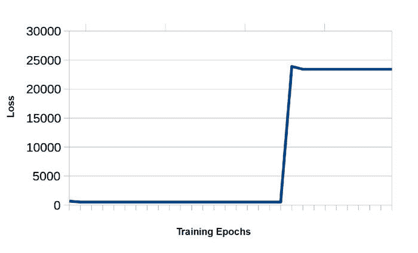

尽管训练期间的损耗没有显示明确的粒度级别，但在运行该 notebook 时可以看到准确的值。这里有两点很重要：

*   最初，在时间步长 0 处，我们看到损耗值为 695。这是由于对参数矩阵 `W` 的随机初始化。但是该损耗很快收敛到 530，且不再随训练时间增加而继续改变。
*   切换到损坏数据后，损耗上升到 23,901，高了近两个数量级！更有趣的是，它很快收敛到 23,427 且永远不再变化。

### 通过 IBM Watson IoT Platform 使用 MQTT 实时分析该数据

最后一步是使用 MQTT 将这个异常检测器连接到 IBM Watson IoT Platform，以便实时分析数据。将我们的神经网络连接到该平台很简单。IBM Cloud 应用程序凭证突出显示了您需要的 `org`、`apiKey` 和 `apiToken` 值。这些凭证是在您使用 [Internet of Things Platform Starter](https://cloud.ibm.com/catalog/starters/internet-of-things-platform-starter?env_id=ibm:yp:us-south&cm_sp=ibmdev-_-developer-tutorials-_-cloudreg) 创建 IBM Cloud 应用程序时生成的。

**备注：**请参阅[生成用于异常检测的数据](https://www.ibm.com/developerworks/analytics/library/iot-deep-learning-anomaly-detection-2/index.html?ca=drs-)一文，了解此过程的细节。

##### IBM Cloud 应用程序凭证

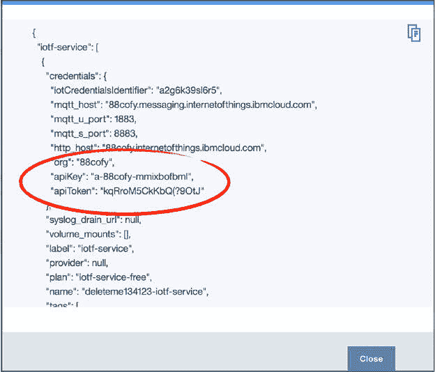

```
import ibmiotf.application
options = {"org": "rwyrty", "id": "anything", "auth-method": "apikey", "auth-key": "a-rwyrty-f95d3ji16n", "auth-token": "ZHd1&O)_J1&TI4XP3z"}
client = ibmiotf.application.Client(options)
client.connect()

from Queue import Queue
q = Queue(7000)

def myEventCallback(event):
    q.put(event.data)

client.deviceEventCallback = myEventCallback
client.subscribeToDeviceEvents("0.16.2", "lorenz", "osc") 
```

### 通过创建一个基于计数的翻转窗口来执行流分析

现在我们需要将一个基于翻转次数的传感器数据窗口传递给一个回调函数。分析的核心是利用 IoT 平台在窗口中的何处抓取数据，然后分批传递给神经网络。

```
import numpy as np
global firstCall
firstCall = True
global W
W = np.array([[1],[1]])
def doNN(data):
    with jvm_stdout(True):
        global firstCall
        global W
        notFirstCall = not firstCall
        prog = dml(script).input(X=np.transpose(np.array([data[:,1]]))).input(pushWeights=notFirstCall).input(Wpush=W)
        result = ml.execute(prog)
        W = result.get("W")
        firstCall = False 
```

**备注：**我们在每次迭代中从 Apache SystemML 引擎读取权值矩阵 `W` 以维持“学习”现状，在后续的每次调用中，我们不再从头学习，而是从上次迭代结束的地方开始学习。

### 创建一个持续的应用程序训练循环

最后，我们在传入的数据上创建一个无限循环，只要我们的翻转窗口被填充，我们就将它传递给神经网络。这个循环的基本过程为：从平台抓取数据，平台等待窗口填满，将窗口传递给神经网络进行训练；该循环反复不断地启动。

```
import numpy as np
while True:
    while not q.empty():
        sample = q.get()
        point = [sample["x"], sample["y"],sample["z"]]
        try:
            data
        except NameError:
            data = np.array(point)
        else:
            data = np.append(data,point)
        if data.size>=9000:
            data = np.reshape(data,(3000,3))
            print data
            doNN(data)
            del data 
```

损耗随时间的变化 显示了损耗随时间的变化。可以看到，对于前两批（前两个窗口的）健康数据，LSTM 网络明显很好地学会了内在模式。在看到损坏数据后，我们再次看到具有一倍差距的明显峰值。

##### 损耗随时间的变化

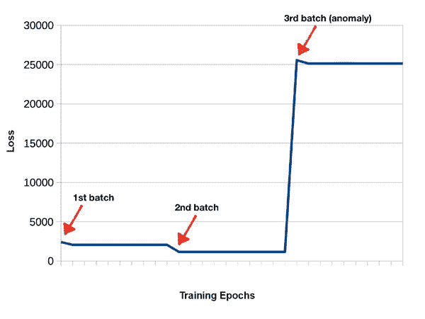

## 结束语

我们的第二篇针对 IoT 时序数据的深度学习教程到此就结束了。我们了解了 Apache SystemML 如何通过动态地优化执行并利用 Apache Spark 作为运行时引擎，帮助执行线性代数运算。

我们了解了完全使用 Apache SystemML DSL 编写的深度学习库的优势，在该学习库中，在神经网络训练和评分期间执行的所有运算都得到了优化并由 Apache Spark 执行。

最后，我们展示了在时序传感器数据（或任何类型的一般序列数据）上，即使非常简单的单层 LSTM 网络的性能也优于最先进的异常检测算法。

在上一篇文章中，我们处理了所生成的相同的测试数据，但使用了一个不同的深度学习框架：Deeplearning4j。在下一篇文章中，我们将使用 TensorFlow (TensorSpark)。

### 致谢

感谢 IBM 阿尔马登研究院和 IBM Spark 技术中心的以下同事的不断支持，本教程才得以完成：

Berthold Reinwald，技术主管 – 大规模分析，IBM 阿尔马登研究院。

[观看对 Berthold 的访谈](https://developer.ibm.com/tv/interview-with-berthold-reinwald-the-brain-behind-apachesystemml/) 。

Prithviraj Sen，机器学习研究员，IBM 阿尔马登研究院。

[观看对 Prithvi 的访谈](https://www.youtube.com/watch?v=cKq-_8gp9Yo%20TODO%20point%20to%20dwTV%20channel%20once%20up) 。

Mike Dusenberry，机器学习和深度学习工程师，IBM Spark 旧金山技术中心。

本文翻译自：[Using Apache SystemML for anomaly detection](https://developer.ibm.com/tutorials/iot-deep-learning-anomaly-detection-4/)（2017-11-22）