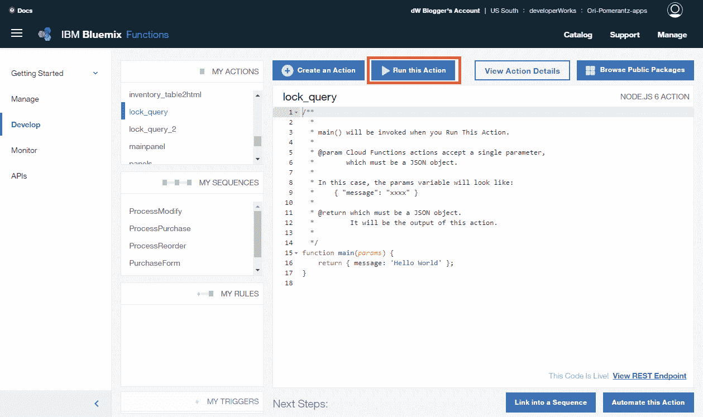
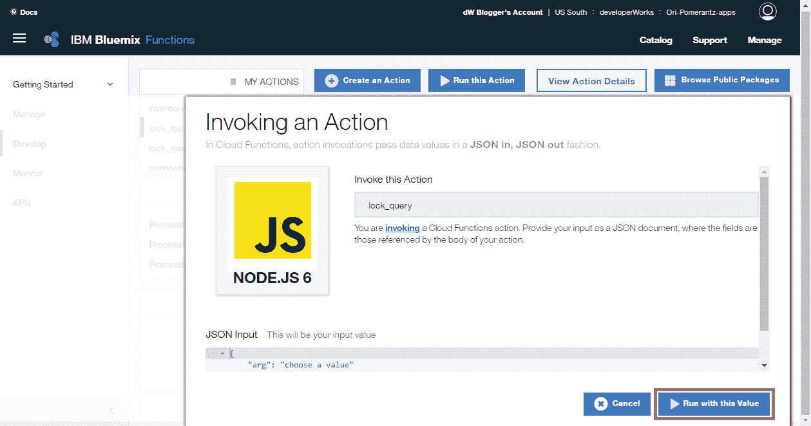
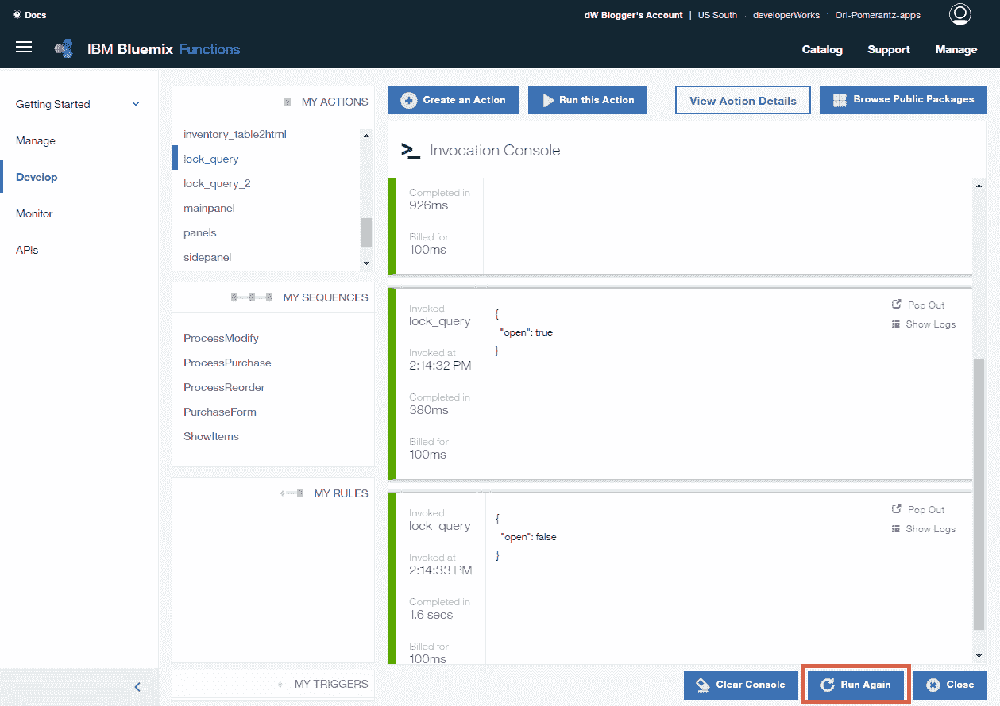
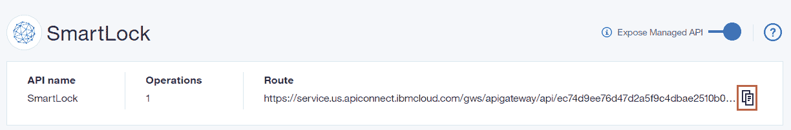
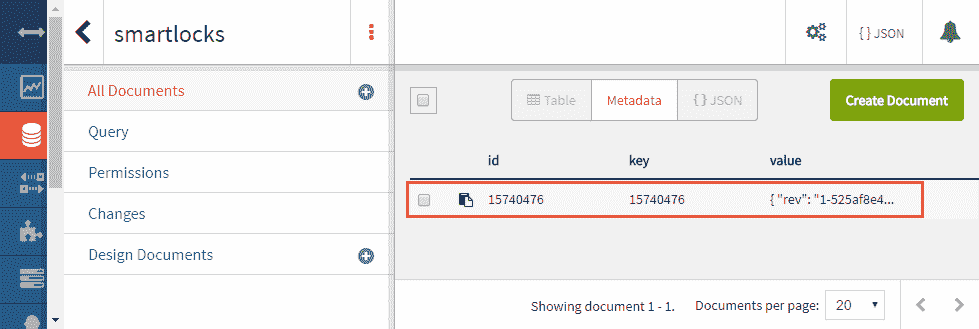
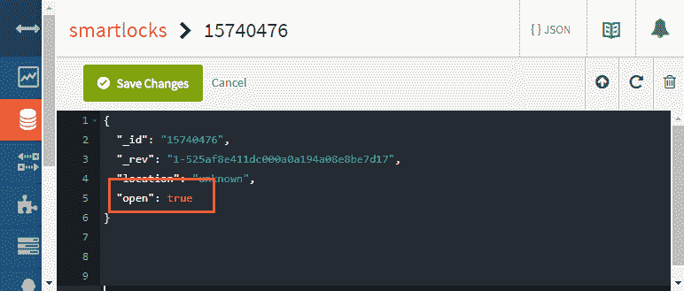
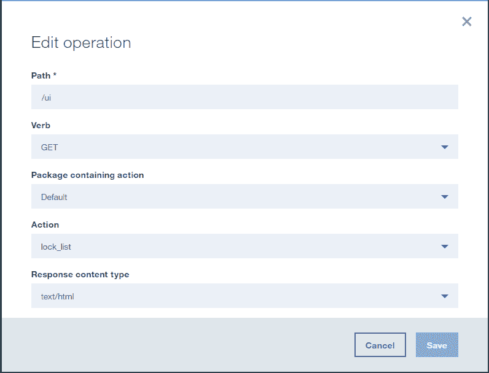

# 为一个联网环境构建一个智能锁

> 原文：[`developer.ibm.com/zh/tutorials/iot-security-smartlock-connected/`](https://developer.ibm.com/zh/tutorials/iot-security-smartlock-connected/)

在[上一篇文章](http://www.ibm.com/developerworks/cn/iot/library/iot-security-smartlock-isolated/index.html)中，您学习了如何构建一个在未联网环境中使用的智能锁，在该环境中，锁本身无法与互联网进行通信，用户需要使用一次性密码执行身份验证，才能打开智能锁。

在本文中，我将介绍如何使用相同的硬件在 *联网* 环境中实现智能锁，在该环境中，中央服务器可以确定人们何时有权打开锁。您需要完成上一篇文章中的步骤来设置 NodeMCU 开发板，配置该开发板，并搭建电路。

## 构建这个智能锁需要做的准备工作

*   来自[上一篇教程](http://www.ibm.com/developerworks/cn/iot/library/iot-security-smartlock-isolated/index.html)的硬件：一个电力控制锁、一个 9V 电池、一个电池连接器，以及一个数字继电器。您还需要 NodeMCU 开发板、一个搭建电路的电路试验板，以及一些连接所有元件的电线。

要进一步了解 NodeMCU 开发板，请查阅“[了解 NodeMCU 和它的 DEVKIT 开发板](http://www.ibm.com/developerworks/cn/iot/library/iot-nodemcu-open-why-use/index.html)”。

*   按照[上一篇教程](http://www.ibm.com/developerworks/cn/iot/library/iot-security-smartlock-isolated/index.html)中的描述设置 NodeMCU 开发板。为该开发板构建固件时，请选择以下模块：**crypto**、**file**、**GPIO**、**HTTP**、**net**、**node**、**SJSON**、**timer** 和 **WiFi**。因为这个智能锁要连接到互联网，所以请确保包含了 **TLS/SSL** 支持。同样地，您可以获取整数版本。最后，将 NodeMCU 闪存到您构建的固件中。

*   IBM 云平台 IBM Cloud 上的一个帐户。

[获得代码](https://github.com/qbzzt/IoT/tree/master/201708/Smart Connected Lock)[运行程序](https://service.us.apiconnect.ibmcloud.com/gws/apigateway/api/ec74d9ee76d47d2a5f9c4dbae2510b0b8ae5912b542df3e2d6c8308843e70d59/smartlock/ui)

## 创建一个打开或关闭该智能锁的简单 IBM Cloud Functions 操作。

[IBM Cloud Functions](https://cloud.ibm.com/openwhisk/?cm_sp=ibmdev-_-developer-tutorials-_-cloudreg)（基于 Apache OpenWhisk）是一个功能即服务 (FaaS) 平台。它支持以非常低的成本在互联网上运行持续可用的服务（因为没有持续运行应用程序的资源需求，所以功能仅在需要时激活，并在随后的几分钟内运行）。

在这个应用程序中，IBM Cloud Functions 为锁提供了需要打开还是关闭的决定权。第一步是编写一个随机打开或关闭该锁的非常简单的操作。

1.  转到 [IBM Cloud 控制台](https://cloud.ibm.com/?cm_sp=ibmdev-_-developer-tutorials-_-cloudreg)。
2.  从汉堡包形状的菜单中，选择 **Functions**。
3.  单击 **Start Creating**。
4.  单击左侧边栏中的 **Develop**。
5.  单击 **Create an Action**。
6.  将该操作命名为 `lock_query`，保留默认执行运行时 (Node.js)，并单击 **Create Action**。
7.  将 main 函数替换为此代码：

    ```
     function main(params) {
            return { open : Math.random()
            > 0.5 };
        } 
    ```

8.  单击 **Run this Action**。

    备注：如果没有看到 **Run this Action** 按钮，请拉大您的浏览器窗口。

    

9.  单击 **Run with this Value**。如果您修改了一个现有操作，则需要先单击 **Make It Live**。请注意，输入无关紧要，可以在这里放入任何 JSON 结构。

    

10.  在调用控制台打开时，可以多次单击 **Run Again** 来查看结果的变化。

    

11.  单击 **Close** 离开调用控制台。

## 以 API 形式对外提供该操作

您已经能从 IBM Cloud 外部访问该操作（在 Develop 视图中，单击 **View REST Endpoint，** 下滚到 cURL 示例，单击 **Show Full Example ）**，但是将该操作用作对外 API 的一部分会更简单、更灵活。

1.  单击左侧边栏上的 **APIs**（假设您仍在 [IBM Cloud Functions](https://cloud.ibm.com/login?state=%2Fopenwhisk%2Fapimanagement&cm_sp=ibmdev-_-developer-tutorials-_-cloudreg) 中）。
2.  单击 **Create Managed API**。
3.  将该 API 命名为 `SmartLock`，并指定基础路径 `/smartlock`。
4.  单击 **Create operation，** 使用以下参数创建一个操作：

| 参数 | 值 |
| --- | --- |
| 路径 | /lock_query |
| 动词 | GET |
| 包含操作的包 | 默认值 |
| 操作 | lock_query |
| 响应内容类型 | application/json |

1.  单击 **Save**。然后，向下滚动并单击 **Save & expose**。
2.  单击该图标来复制路径：

    

3.  将该路径作为 URL 粘贴到浏览器窗口中，在 URL 末尾输入 `/lock_query`。重新加载几次，以了解您获得的两种响应。

## 编写 Lua 程序来锁住或打开智能锁

该操作返回的值（open 或 locked）是没有意义的，除非该锁的 NodeMCU 会检索它并执行相应的操作。我编写了一个实现此操作的 Lua 程序。

1.  运行 esplorer.bat，您已在上一篇文章中安装它。
2.  复制[此代码](https://github.com/qbzzt/IoT/blob/master/201708/Smart%20Connected%20Lock/02_lock_software.lua)，将它粘贴到 ESPlorer 上的左侧文本区域。
3.  修改 Lua 程序顶部的参数：SSID、wifi 密码和 API 的 URL。
4.  单击 **Send to ESP** 按钮。

让我们看看为该锁运行的 Lua 代码。您可以看到，配置参数位于顶部，这使得它们很容易管理。

```
-- Configuration parameters
-- change these values for your environment
ssid =
        "<<redacted>>"
wifi_pwd =
        "<<redacted>>"
openwhisk_url =
        "https://service.us.apiconnect.ibmcloud.com/gws/apigateway/api/ec74d9ee76d47d2a5f9c4dbae2510b0b8ae5912b542df3e2d6c8308843e70d59/smartlock/lock_query"
lock_pin = 2   -- The GPIO pin connected to the lock
wait_time = 1  -- How long to wait until
                     -- we ask OpenWhisk again 
```

我无法让 [NodeMCU http.get 函数](http://nodemcu.readthedocs.io/en/master/en/modules/http/#httpget)兼容 HTTPS，所以我编写了自己的函数。这个函数有两个参数 – 要获取的 URL 和一个在获取它后运行的回调函数。

```
-- Get an HTTPS response.
-- According to the docs, http.get should support https
-- URLs.However, I couldn't get that working.

function getHttpsResponse(url, cb) 
```

Lua 函数可以有[多个返回值](https://www.lua.org/pil/5.1.html)。[string.match 函数](https://www.lua.org/pil/20.1.html)为模式中的每个括号返回一个值。在本例中，第一个括号是主机名，以一个斜杠结尾。第二个括号是路径，包含任何查询字符串。

```
host, path = string.match(url, "https://([^/]+)/(.+)") 
```

此连接需要是 TLS 连接，而不是普通的 TCP 连接。

```
conn = tls.createConnection() 
```

IBM Cloud Functions 与 NodeMCU 之间的通信受到 HTTPS 的保护。通常，这足以让人信任服务器的身份。但是，因为 NodeMCU 的资源非常受限，所以它没有 CA 证书，这意味着如果黑客能控制 DNS 服务器，他们就能将该服务器 (`service.us.apiconnect.ibmcloud.com`) 重定向到自己的服务器并打开锁。

NodeMCU 有一个针对此问题的解决方案。[`tls.cert.verify()`](http://nodemcu.readthedocs.io/en/master/en/modules/tls/#tlscertverify) 函数允许存储一个 CA 证书并要求证书经过该 CA 签名。要获取证书，请在浏览器中访问 [`service.us.apiconnect.ibmcloud.com（忽略`](https://service.us.apiconnect.ibmcloud.com（忽略) 404 错误）。对于不同浏览器，从此站点获取该文件的过程可能有所不同。

如果不想通告某个锁已打开或关闭的事实，可以在该锁发送到 IBM Cloud Functions 操作的请求中包含一个共享密钥作为身份验证字符串。

我们建立连接后，发送该请求。请注意，这里对包含换行符的字符串使用了 `[[<string>]]`，这种语法比 `"\r\n"` 更清晰。不幸的是，此语法无法识别空行 – 而 HTTP 协议需要这些行。

```
-- Don't send the request before we are connected
conn:on("connection", function(sck, c)
  req = "GET /" .. path ..[[ HTTP/1.1
    Host: ]] .. host .."\r\n" ..[[
    Connection: close
    Accept: */*]] .."\r\n\r\n"
  sck:send(req)
end)  -- of conn:on("connection") callback 
```

收到应答后，使用 `string.match` 忽略标头字段（两个换行符之前的所有内容），保留实际的响应。此代码假设会将响应放在一个包中，所以应合理地考虑来自操作的响应长度。

```
conn:on("receive", function(sck, c)
  resp = string.match(c, ".+\r\n\r\n(.+)") 
```

使用 [`sjson 包`](http://nodemcu.readthedocs.io/en/master/en/modules/sjson/)解码从操作中收到的 JSON 结构。

```
decoder = sjson.decoder({})
decoder:write(resp) 
```

使用该结果来调用回调函数。

```
 cb(decoder:result())
end)   -- coon:on("receive") callback 
```

到此刻，我们已添加了两个我们需要的事件处理函数（用于连接和接收响应）。现在可以实际连接到服务器了。

```
 conn:connect(443,host);
end   -- of getHttpsResponse 
```

此函数调用了 IBM Cloud Functions 上的操作，使用响应，然后设置一个要再次运行的计时器。

```
-- Call the action, and open or close the lock
-- based on the response

function openOrCloseLock()
  getHttpsResponse(openwhisk_url, 
```

回调函数执行了大部分工作。

```
 function(t)
        print(t.open)
        if (t.open)
        then
          gpio.write(lock_pin, 1)
        else
          gpio.write(lock_pin, 0)
        end   -- if then else

        -- Call again in wait_time seconds
        tmr.create():alarm(wait_time*1000,
            tmr.ALARM_SINGLE,
        openOrCloseLock)
      end)   -- getHttpsResponce callback
end -- openOrCloseLock 
```

请注意，这个方法的效率很低，每隔几秒就会检查一次服务器上的锁的状态。NodeMCU 上需要的额外处理能力实际上是免费的（毕竟 NodeMCU 没有执行任何操作），但是网络带宽和服务器级处理不是免费的。让锁仅在用户要求它们打开时询问自己的状态，这样做会更高效。可以使用一个按钮或 Web 界面实现此特性。

要使用按钮，请将它连接在 NodeMCU 上的一个未用的数据引脚（D0、D1、D3 等）与接地引脚之间。将它配置为生成一个调用 `openOrCloseLock` 的中断：

```
pin = 1
gpio.mode(pin, gpio.INT, gpio.PULLUP)

gpio.trig(pin, "down",
    function(level, time)
        openOrCloseLock()
    end
) 
```

要使用 Web 界面，可以对为智能锁提供其 IP 地址的接入点进行配置，每次都为它提供相同的 IP 地址，并放置一个可供用户从智能手机使用的 HTTP 服务器。它们需要访问一个 URL（在下面的代码中，它是该服务器上的任何 URL）。准确的路径和响应无关紧要。

```
httpServer = net.createServer(net.TCP)
httpServer:listen(80, function(conn)
   conn:on("receive", function(conn, payload)
      print(payload)
      conn:send("Querying the server about the lock")
      openOrCloseLock()
   end)  -- of the conn:on function
end)   -- of the httpServer:listen function 
```

如果锁处于打开状态，`openOrCloseLock` 函数需要定期检查它是否能再次关闭。如果锁处于关闭状态，那么在用户请求之前不需要检查它。将该函数的结尾处的代码替换为此代码：

```
 -- If the lock is open, call again in
       -- wait_time seconds
        if (t.open) then
            tmr.create():alarm(wait_time*1000,
                tmr.ALARM_SINGLE, openOrCloseLock)
        end   -- if t.open
      end)   -- getHttpsResponce callback
end -- openOrCloseLock 
```

在 NodeMCU 启动时，无法立即使用互联网。首先需要与一个接入点关联，然后获取一个 IP 地址。[`wifi.eventmon.register` 函数](http://nodemcu.readthedocs.io/en/master/en/modules/wifi/#wifieventmonregister)允许我们在获取该 IP 地址时运行一个函数，并可以开始使用互联网。

```
-- There's no point doing anything until we get an
-- IP address from the access point
wifi.eventmon.register(wifi.eventmon.STA_GOT_IP, function(t)
  openOrCloseLock()
end)   -- wifi connected function 
```

只要设备启动，就会执行此代码（将程序写入 init.lua 后）。它会设置 wifi 模式、连接，然后设置控制锁的引脚的模式。

```
-- Actually connect
wifi.setmode(wifi.STATION)
wifi.sta.config({
  ssid = ssid,
  pwd = wifi_pwd
})

gpio.mode(lock_pin, gpio.OUTPUT) 
```

如果我们在多个位置都拥有智能锁，那么区分它们来避免开错门就很重要。IBM Cloud Functions 有一个简单的解决方案。如果我们将查询字符串附加到该 API 的 URL，该操作会在其输入结构中获得查询字符串值。

为了在我们的程序中添加此特性，我们修改了 URL 参数：

```
openwhisk_url = "https://service.us.apiconnect.ibmcloud."..
   "com/gws/apigateway/api/ec74d9ee76d47d2a5f9c4dbae2510" ..
   "b0b8ae5912b542df3e2d6c8308843e70d59" ..
   "/smartlock/lock_query_2?chip=" .. node.chipid() 
```

该定义中唯一的新的部分是 `node.chipid()` 调用。此调用提供了一个唯一的芯片标识符。

可以[在这里看到针对 NodeMCU 的完整程序](https://github.com/qbzzt/IoT/blob/master/201708/Smart%20Connected%20Lock/03_lock_software.lua)。将它保存为 init.lua，让它在设备启动后自动运行。

## 使用 Cloudant 存储智能锁信息

随机打开和关闭的锁并没有用。下一步是建立一个 Cloudant 数据库来存储锁、锁的位置和状态。

### 创建 Cloudant 数据库来存储锁信息

1.  在 IBM Cloud 控制台中，从汉堡包形状的菜单中，单击 **Data & Analytics**。
2.  单击 **Create Data & Analytics service，** 并选择 **Cloudant NoSQL DB**。
3.  将该服务命名为 `SmartLock-System` 并单击 **Create**。
4.  创建该服务后，打开它。然后单击 **Service credentials 。 单击 New credential** 按钮。
5.  将新凭证命名为 `SmartLockAction` ，并单击 **Add**。
6.  单击 **View credentials，** 并单击复制图标将凭证复制到一个文本文件中。
7.  在左侧边栏中，单击 **Manage。** 然后单击 **LAUNCH** 按钮。
8.  在左侧边栏中单击 Databases 菜单。

    [在左侧边栏中单击 Databases 菜单](https://developer.ibm.com/developer/default/tutorials/iot-security-smartlock-connected/images/image005.png)

    然后，单击右上角的 **Create Database**。

9.  将该数据库命名为 `smartlocks`。
10.  不要创建任何文档。我们的操作会自动创建它们来支持注册。

### 配置该操作来使用 Cloudant

除非 IBM Cloud Functions 实际使用 Cloudant 数据库，否则该数据库对我们没有任何用。创建一个新操作，或者将现有的 `query_lock` 操作替换为[此代码](https://github.com/qbzzt/IoT/blob/master/201708/Smart%20Connected%20Lock/04_cloudant_lock_query.js)。记得将 Cloudant 凭证替换为您的值，如果您创建了一个新操作，请记得将它添加到 API 中，并修改 Lua 代码来访问新操作。

此刻，您应该能通过更改 Cloudant 数据库来开门和关门（在智能锁第一次连接时，Cloudant 数据库会获得该锁的一个文档）：

1.  从控制台的汉堡包形状的菜单中，单击 **Data & Analytics**。
2.  单击 **SmartLock-System，** 然后单击 **LAUNCH**。该数据库将在一个单独的选项卡中打开。
3.  单击 **smartlocks** 数据库。
4.  从列表中选择您的锁（它应该是唯一的列表项）。

    

5.  将 open 值从 false 更改为 true，并单击 **Save Changes**。

    

6.  可以看到该锁打开了。可以再次更改该值来关闭它。

让我们看看这段与 Cloudant 进行通信的操作代码。它首先包含数据库凭证。它复制了完整的凭证，因为这样更容易且存储很便宜，但从技术上讲，您只需要 URL 字段：

```
var cloudantCred = {
  "username": "<<redacted>>",
.
.
.
  "url":
        "https://<<user name redacted>>:<<password
        redacted>>@4d1cded5-56a3-4ad9-a59a-9c68c192995c-bluemix.cloudant.com"
}; 
```

此操作非常简单，可以放在一个 JavaScript 函数中。

```
function main(params) { 
```

以下行连接到凭证 URL（其中包含用户名和密码）上的 `smartlocks` Cloudant 数据库。

```
var cloudant = require("cloudant")(cloudantCred.url);
var mydb = cloudant.db.use("smartlocks"); 
```

数据库查找是一个异步过程，所以该操作无法立即返回结果。如果遇到这种情况，系统会返回一个 Promise 对象来指定如何操作。对象构造函数有一个参数 – 为了获得结果而要运行的函数。此函数接收两个参数，一个是要在成功时调用的函数，另一个是要在失败时调用的函数。

```
return new Promise(function(success, failure) { 
```

第一步是搜索数据库，使用芯片 IP 作为键来查找是否有一个针对该锁的文档。

```
mydb.get(params.chip, function(err, body) { 
```

如果没有文档，那么这是第一次注册。在这种情况下，`err.statusCode` 为 404。但是，我们不能假设 `err` 实际存在。如果没有错误，它将为 `null`。

```
 // If there is no document, this is a new
    // smartlock to register
    if (err != null
&& err.statusCode == 404) { 
```

创建新智能锁的文档，并通过芯片 ID 进行索引。默认位置是未知的，该锁的默认状态是关闭的。

```
 mydb.insert(
            {
              "_id": params.chip,
              location: "unknown",
              open: false
            },
            function()
{ 
```

创建智能锁的条目后，返回它的当前状态（关闭）。

```
 success({open: false});
});   // mydb.insert call 
```

上面的函数调用是异步的。它发出一个请求，然后将一个条目添加到一个将在响应到达时调用的表中。然后，此函数将继续运行，但是运行它的剩余部分没有意义 – `return` 可以让我们在此刻结束运行该函数。

```
 return ;
}    // end of a new smartlock to register 
```

如果文档已存在，则返回其中的值。

```
 // Return the read value
            success({open: body.open});
        });    // mydb.get call
    });   // new Promise call
} 
```

## 构建一个用户界面，供锁管理员用于锁住或打开该智能锁

[锁系统的用户界面](https://service.us.apiconnect.ibmcloud.com/gws/apigateway/api/ec74d9ee76d47d2a5f9c4dbae2510b0b8ae5912b542df3e2d6c8308843e70d59/smartlock/ui)使管理员能够指定新注册的锁的位置，并查看和修改现有锁的状态。可以在[我的 Smart Connected Lock GitHub 存储库中查看它的源代码](https://github.com/qbzzt/IoT/blob/master/201708/Smart%20Connected%20Lock/05_lock_list.js)。

创建该操作后，通过路径 `/ui` 将它添加到 API 中。确保将响应内容类型设置为 **text/html**，以便浏览器将它作为网页处理。



让我们看看如何实现此操作。`main` 函数将会检查是否有要执行的操作。如果没有，则会返回一个 Promise 对象，该对象调用 `returnHtml` 来创建要返回给用户的 HTML。

```
// If we get here, there is no action to do,
// just return the HTML

return new Promise(function(success, failure) {
    returnHtml(success);
    });   // new Promise object 
```

如果有一个操作（打开锁、关闭锁或设置锁的位置），则返回一个 `Promise` 对象来指定新字段值，并调用 `modifyEntry`。该函数会修改合适的条目，然后调用 `returnHtml`。

```
if (params.action == "closeLock")
    return new Promise(function(success, failure) {
        modifyEntry(params.id, {open: false}, success);
    }); 
```

`modifyEntry` 函数首先从 Cloudant 获取该锁的现有条目的一个副本。

```
var modifyEntry = function(id, newVals, success) {
    mydb.get(id, function(err, res) { 
```

接下来，它会迭代新值并创建或替换现有结果中的值。

```
 Object.keys(newVals).forEach(
        function(key) {res[key]=newVals[key];}); 
```

我们需要保留时间戳，原因会在下一步中进行解释。

```
res.lastChange = Date.now(); 
```

我们将把修改后的版本插回数据库中，然后返回 HTML，与没有要执行的操作时一样。

```
 mydb.insert(res, function(err, body) {
            returnHtml(success);
        });    // mydb.insert callback
    });   // mydb.get callback
};   // end of modifyEntry 
```

`returnHTML` 函数会检索整个 Cloudant 数据库。

```
var returnHtml = function(callback) {
    mydb.list({include_docs:true}, function(err, res) { 
```

该数据库包含内部信息，所以我们使用一个 `map` 函数来仅保留我们需要的信息。[`map` 函数](https://developer.mozilla.org/en-US/docs/Web/JavaScript/Reference/Global_Objects/Array/map)在每个列表项上运行它作为参数接收的函数（在本例中为 `res.rows`，表示数据库中的所有行），并在一个列表中返回结果。[箭头函数 (=>)](https://developer.mozilla.org/en-US/docs/Web/JavaScript/Reference/Functions/Arrow_functions) 是定义一个函数的更简短的表示法。

```
var data = res.rows.map((entry) => {
    return {
        id: entry.id,
        location: entry.doc.location,
        open: entry.doc.open
    };
}); 
```

下一步是将锁条目按类型进行拆分：具有已知位置的锁（可从界面打开或关闭的锁）和具有未知位置的锁（需要在处理前为其分配一个位置）。该程序使用 [`filter` 函数](https://developer.mozilla.org/en-US/docs/Web/JavaScript/Reference/Global_Objects/Array/filter) 来拆分这些条目。该函数返回一个列表，其中仅包含原始列表中该参数函数为其返回 true 的项。

```
var unknownLoc = data.filter(
  (entry) => {return entry.location == "unknown";});
var knownLoc = data.filter(
  (entry) => {return entry.location != "unknown";}); 
```

接下来，我们再次使用 `map`，然后使用 [`reduce`](https://developer.mozilla.org/en-US/docs/Web/JavaScript/Reference/Global_Objects/Array/reduce?v=b) 将条目列表转换为一个 HTML 表的内容。我们为该 HTML 使用了一个[模板字面变量](https://developer.mozilla.org/en-US/docs/Web/JavaScript/Reference/Template_literals)，所以会计算 `${<expression>}` 并将它放在字符串中的该位置。例如，`${entry.location}` 被当前条目中的 location 字段取代。

```
 var knownLocRows = knownLoc.map((entry) => {
           return `<tr>
                        <td>
                            ${entry.id}
                        </td>
                        <td>
                            ${entry.location}
                        </td>
                        <td>
${entry.open ? "Open" : "Locked"}
<button class="btn ${entry.open ?
        "btn-danger" : "btn-success"}" type="button"

onClick="window.location.href='ui?id=${entry.id}&action=${
entry.open ? "close" : "open"}Lock'">

${entry.open ? "Lock" : "Unlock"}
                            </button>
                        </td>
                    </tr>`;
        });

        var knownLocTable = "";
        if (knownLocRows.length > 0)
            knownLocTable =
               knownLocRows.reduce((a,b) => {return a+b;}); 
```

最后，将表内容嵌入到 HTML 表中（一个表用于具有未知位置的锁，另一个用于其他所有锁）。为了能使用 location 字段的内容，该 HTML 使用了 [Angular 库](https://docs.angularjs.org/api)。

请注意，对于这个样本应用程序，我没有添加身份验证，但实际的应用程序需要它，或许可以使用 API 定义中指定的 OAuth 来实现此操作。

## 创建一个处理自动重新锁定的 IBM Cloud Functions 操作。

如果一扇门在需要打开时被锁住，人们将无法完成工作。用户将呼叫锁管理员来纠正这种情形。但是当一扇门意外地一直处于打开状态，这可能是一种长期未纠正的静默故障（安全问题）。

要解决此问题，可以使用[此代码](https://github.com/qbzzt/IoT/blob/master/201708/Smart%20Connected%20Lock/06_lock_relock.js)创建一个操作。它寻找目前已打开且其条目上次修改超过 5 分钟的锁，然后关闭它们。我假设 5 分钟时间对开一扇门已足够用；如果不够，您可以增加该时间。

要每隔 5 分钟运行此操作一次，可以执行以下步骤：

1.  在 **Develop** 视图中打开该操作，然后单击 **Automate this Action**。
2.  单击 **PERIODIC** 磁贴，然后单击 **NEW ALARM**。
3.  单击 **:MM**，以便每隔几分钟运行该操作一次，并输入 `5`。将该触发器命名为 `every-five-min`，并单击 **Create Periodic Trigger**。
4.  单击 **Next**，然后单击 **This Looks Good** 和 **Save Rule**。
5.  尝试将一个锁保持打开 10 分钟，看看它是否会自动锁住。如果重新加载浏览器页面，请记得删除查询（URL 中从问号到结尾部分）。

此操作中的大部分代码都与用户界面中使用的代码类似。但是，可能需要在一次调用中锁住多个锁。只有到达所有数据库修改的回调时，我们才应该运行 success 函数，它会报告我们已完成的工作。

我们将使用全局变量 `leftToLock` 和要修改的剩余锁的数量。如果从 `mydb.list` 回调中获取它的值，该值为修改列表的大小。

```
var leftToLock;
...
function main(params) {
    return new Promise(function(success, failure) {
        mydb.list({include_docs:true}, function(err, res) {
...
            // We only care about entries that haven't
            // been changed in the last five minutes
            var now = Date.now();
            data = data.filter((entry) =>
                {return now-entry.lastChange > 5*60*1000;});

            // We only care about those entries that
            // have an open lock
            data = data.filter((entry) =>
                 {return entry.open});

            // Lock the entries in data.
            leftToLock = data.length;
            data.map((entry) => {lock(entry.id, success)});
        });  // mydb.list
    });    // new Promise
}    // main 
```

`lock` 函数的每次调用都有一个对 `leftToLock` 执行递减的回调。当递减到 0 时，最终的 `lock` 函数调用回调将会调用 success 函数。

```
var lock = function(id, success) {
    mydb.get(id, function(err, res) {
        res.open = false;
        res.lastChange = Date.now();

        mydb.insert(res, function(err, body) {
            leftToLock --;

            if (leftToLock == 0) {   // We're done
                success({});
            } // leftToLock == 0
        });    // mydb.insert
    });   // mydb.get
};   // end of
        lock 
```

请注意，当 5 分钟时间不足以修改 Cloudant 数据库中所有需要重新锁住的锁时，此算法将失败。但这种情况几乎不可能出现。

## 结束语

在本文中，您学习了如何使用 IBM Cloud Functions 实现一个连接到互联网的智能锁。除了这个用例之外，您现在应该能够：

1.  使用 NodeMCU 作为 HTTPS 客户端，包括解析服务器响应
2.  创建 IBM Cloud Functions
3.  创建 API 来访问这些 IBM Cloud Functions
4.  使用 Cloudant 数据库来存储信息
5.  从 IBM Cloud Functions 访问并修改 Cloudant 数据库中的信息
6.  创建一个用户界面作为 IBM Cloud Function
7.  定期运行一个 IBM Cloud Function 来执行各种维护操作

希望您在未来开发自己的 IoT 产品和应用程序时，这些技能会派上用场。

本文翻译自：[Build a smart lock for a connected environment](https://developer.ibm.com/tutorials/iot-security-smartlock-connected/)（2017-09-18）