# 使用 UrbanCode 将微服务部署到 IBM Cloud 上

> 原文：[`developer.ibm.com/zh/tutorials/cl-urbancode-deploy-microservices-cloud/`](https://developer.ibm.com/zh/tutorials/cl-urbancode-deploy-microservices-cloud/)

IBM UrbanCode Deploy 是一个工具，可帮助您实现整个云环境中的应用程序部署的自动化。它旨在让敏捷开发中的快速反馈和持续交付变得相对容易，同时提供生产级系统中所需的审计追踪、版本控制和审批路径。

UrbanCode Deploy 提供了：

*   自动化、一致的应用程序部署和回滚
*   自动化的云环境配备、更新和取消配备
*   编排跨服务器、层和组件的更改
*   环境间的配置和安全差异
*   明确显示哪个组件部署在何处和谁更改了哪些组件
*   集成中间件、配备和服务虚拟化功能

**免费试用 IBM Cloud**

利用 [IBM Cloud Lite](https://cloud.ibm.com/registration?cm_sp=ibmdev-_-developer-tutorials-_-cloudreg) 快速轻松地构建您的下一个应用程序。您的免费帐户从不过期，而且您会获得 256 MB 的 Cloud Foundry 运行时内存和包含 Kubernetes 集群的 2 GB 存储空间。

在本教程中，我将介绍微服务的构建和部署工具链，首先从您需要的标准工具开始介绍：

*   JIRA 用于创建和分配任务，报告错误，以及管理版本
*   GitLab 用于管理源代码
*   Jenkins 用于构建编排器
*   UrbanCode Deploy 是部署工具

我将主要介绍 UrbanCode Deploy。

首先分析一下典型的微服务架构。

## 架构和管道

通常，在微服务架构中，多个微服务分别执行一个工作单元，而一个 Web 组件将使用这些微服务提供的所有数据，并将它们展示给用户。每个微服务都有自己的构建管道，可以自动构建并部署到开发环境中。

让我们更详细地分析一下这个架构。

### 微服务架构

在此方案中，一个通用的数据库和缓存服务保存着各种微服务间的通用数据。

##### 图 1\. 一种典型微服务架构

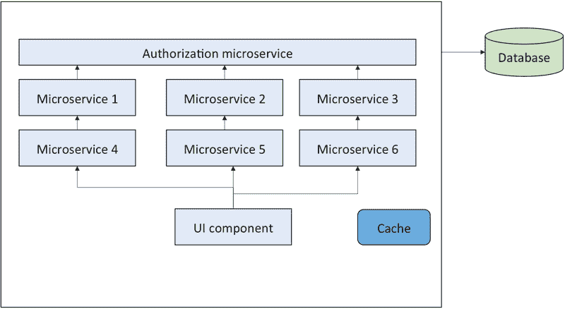

本文的目标是介绍如何配置 UrbanCode Deploy 来将这些微服务部署到混合云环境中。

每个微服务都将有自己的构建管道，接下来让我们分析一下这个管道。

### 构建和部署管道

根据分支策略，将代码部署到目标环境中。我将使用一个 GitLab 存储库来实现此部署，其中配置了 webhook，以便在 Jenkins 中自动触发构建。

配置 Jenkins 作业来构建一个 Java™ 或 Node 应用程序，使用 SonarQube（持续检查代码质量的开源平台）执行代码质量检查，并将工件存储到 IBM UrbanCode Deploy 中。

生成的工件版本用 Jenkins 内部版本号标记，以便跟踪创建该工件的 Jenkins 构建版本。在 UrbanCode Deploy 中创建快照时，这个版本号很有用。

接下来，我将演示如何配置 Jenkins 进行自动构建。

## 为 Jenkins 配置自动构建

在推送代码后立即运行构建至关重要，因为这使您能快速检测问题并更轻松地找到它们。为了自动运行构建，Jenkins 会监听一个 Hook URL 上的 POST 请求。

在 Jenkins 中，可以启用在将更改推送到 GitLab 存储库后执行构建的选项，如下所示：

##### 图 2\. Build Triggers

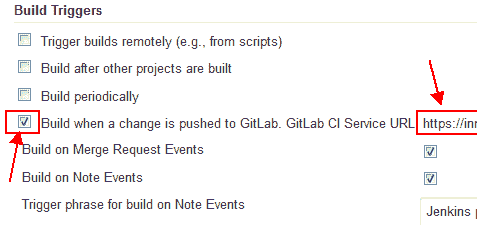

复制 GitLab CI Service URL，转到相应的 GitLab Project，单击 **Settings > Webhooks**，然后将该 URL 粘贴到字段中。单击 **Add Webhook** 并测试它，如下图所示：

##### 图 3\. GitLab 配置

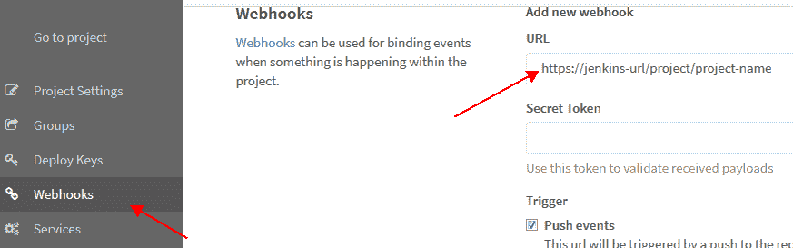

配置 GitLab 系统，以便在代码推送到某个分支时执行构建。在 Jenkins 中添加相同的过滤器。

## 配置 UrbanCode Deploy

本节将展示如何创建一个部署模式，其中涉及到：

*   定义组件模板
*   创建组件、应用程序、环境和特定于环境的变量
*   生成清单文件
*   定义应用程序流程

本示例中的所有微服务都有相同的构建和部署流程。如果您想在创建新微服务时自动创建构建和部署管道，这种做法很有帮助。从部署角度讲，要实现此目的，可创建一个将被所有部署到 IBM Cloud 的微服务使用的组件模板。

### 定义组件模板

为 IBM Cloud 部署创建一个名为 BluemixDeployTemplate 的组件模板：

##### 图 4\. UrbanCode Deploy 组件

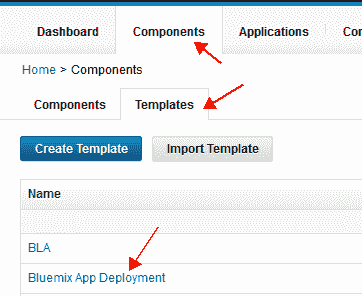

只要需要执行一次新微服务部署，就会使用此模板创建一个组件。该模板将定义以下 4 个流程：

*   **BluemixPush** 将应用程序部署到云
*   **ApplicationStart** 启动一个 IBM Cloud 应用程序
*   **ApplicationStop** 停止该应用程序
*   **ApplicationDelete** 删除该应用程序

您需要为组件定义以下环境变量。按照以下步骤来创建它们：

1.  在 Configuration 选项卡下，单击 **Environment Property Definition**。
2.  单击 **Add Property**（如图 5 所示）并定义环境变量。
3.  提供环境变量的名称、标签和默认值（如果有），并单击 **Save**。

##### 图 5\. 定义环境变量

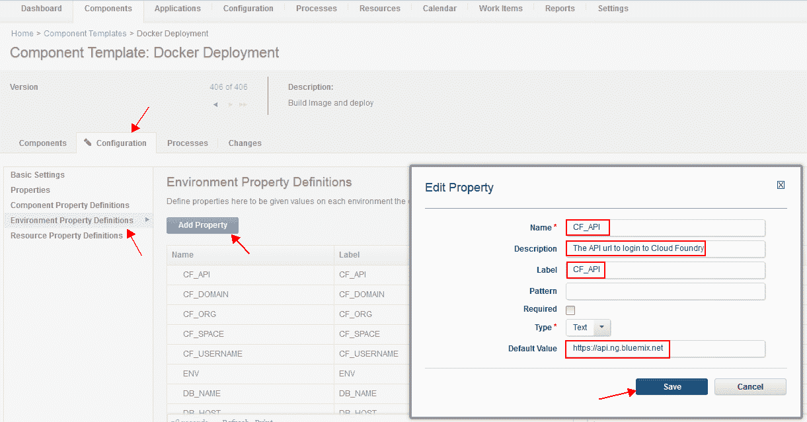

创建下面这组环境变量，流程执行过程中将会使用它们：

*   **CF_API** — 要连接到的 Cloud Foundry
*   **CF_ORG** — 将会在此 IBM Cloud 组织中执行部署
*   **CF_SPACE** — 将会在此 IBM Cloud 空间中执行部署
*   **CF_USER** — 将会通过此用户 ID 执行部署
*   **CF_DOMAIN** — 将会在此 IBM Cloud 域中执行部署
*   **ENV** — 将会在此环境中执行部署

所有这些变量都应定义为组件环境变量。

您还需要定义以下特定于组件的变量（如图 6 所示）：

*   **MEMORY** — 组件需要的内存
*   **INSTANCE** — 实例数量

特定于组件的变量被限制在一个组件中，而且会在各个环境中保持相同。要创建组件变量，请执行以下操作：

1.  单击 Configuration 选项卡并选择 **Properties** 链接。
2.  单击 **Add Property**，就像在之前的步骤中所做的一样。
3.  保存属性定义

##### 图 6\. 组件属性

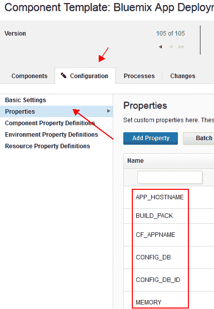

通过 Slack 集成来部署典型 Liberty 应用程序的样本流程如图 7 所示。如您所见，我们下载了应用程序工件，生成了自定义的 server.xml，然后将应用程序推送到 IBM Cloud。Slack 通道会被告知该流程是成功还是失败。可以使用以下步骤作为参考，但基于您的架构和自定义选项，每个微服务的部署步骤可能有所不同。

##### 图 7\. UrbanCode Deploy 组件流程

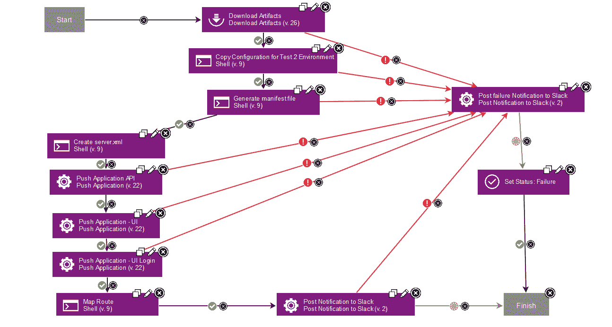

### 创建组件

对于每个微服务，您将在 UrbanCode Deploy 中创建一个独立组件，在创建期间，您将选择之前创建的组件模板。

##### 图 8\. 创建组件

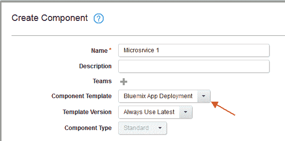

每个组件均可默认使用组件模板属性值。有时，您可能需要在组件级别上覆盖这些值 — 例如，如果模板为应用程序分配的内存设置为 1GB，而您的一个微服务需要 4GB 的内存。在这种情况下，可以在 UrbanCode Deploy 组件级别上将该模板值覆盖为 4GB。

### 创建一个应用程序

创建组件后，需要创建一个应用程序，其中包含许多具有不同部署模型的混合组件。要在 UrbanCode Deploy 中创建一个应用程序，请执行以下操作：

1.  单击 Application 选项卡。
2.  单击 **Create Application**，一个弹出窗口将会出现。
3.  填入应用程序名称、团队和通知模式（如果已定义）。
4.  在填入这些细节后单击 **Save**。

##### 图 9\. 创建一个应用程序

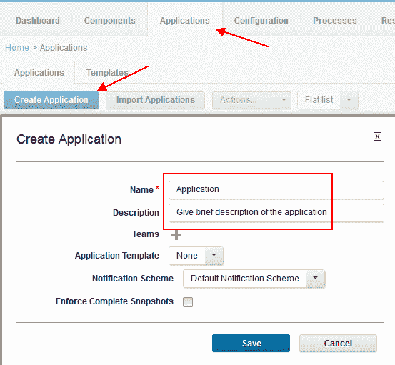

创建应用程序后，开始按以下方式添加组件：

1.  转到应用程序内的 Components 选项卡。
2.  单击 **Add Component**，一个弹出窗口将会出现。
3.  开始搜索现有组件，选择它，并单击 **Save**。
4.  对每个应用程序组件重复这些步骤，而且每次都单击 **Save**。

##### 图 10\. 添加组件

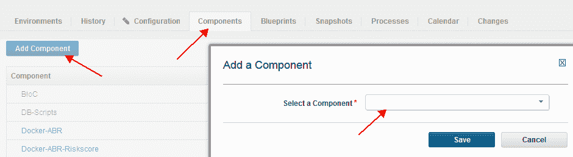

### 创建环境

现在，让我们根据项目需求来创建多个环境（参见图 11）：

1.  单击 Environments 选项卡下的 **Create Environment**，一个新的弹出窗口将会出现。
2.  填入环境的名称并提供一段简短描述。
3.  如果您有一个环境的现有蓝图，请选择它。
4.  如果部署到给定环境需要审批工作流程，请选择 **Require Approval** 选项。
5.  选择一种颜色来标识该环境，并单击 **Save**。

这将创建一个新环境。

##### 图 11\. 创建环境

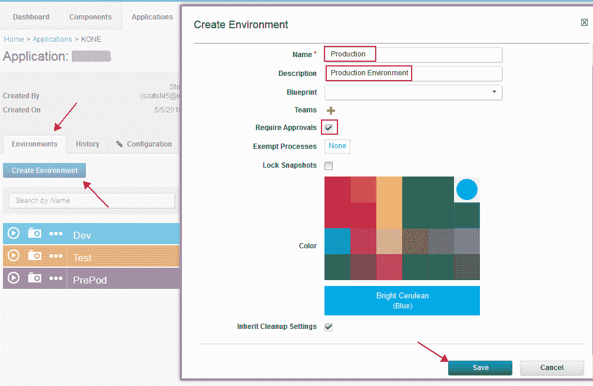

创建一个环境后，必须根据需要部署到的环境来关联资源（代理）。

接下来，将向环境中添加资源。如果需要将应用程序组件部署到多个服务器，那么您需要小心地配置资源映射。

1.  单击主要标题上的 **Resource** 选项卡并单击 **Create Top-Level Group**。（创建此项目需要管理权限。）
2.  提供组的名称：作为一种最佳实践，可以提供 UrbanCode Deploy 应用程序的名称作为组资源名称
3.  如果有多次环境部署，而且在每个环境中安装了代理，可单击创建的顶级资源下的 **Actions -> Add Group**。例如，如果您将一个数据库部署到一个数据库服务器，并将一个应用程序部署到 IBM Cloud，那么您将创建两个组。
4.  在每个组下，单击 **Actions > Add Agent** 向该组添加相应的 UrbanCode Deploy 代理。
5.  在 Agent 下，单击 **Actions > Add** 将组件映射到 UrbanCode Deploy 代理，以部署组件。
6.  将应用程序的所有组件映射到 UrbanCode Deploy 代理后，转到您的应用程序并选择您创建的环境。
7.  单击 **Add Base Resources**，并添加您刚才在这些步骤中创建的资源。
8.  对您为应用程序创建的每个环境重复这些步骤。

现在，UrbanCode Deploy 知道每个环境的组件与服务器映射。

##### 图 12\. 添加资源

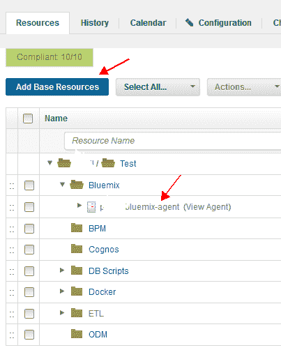

### 创建特定于环境的变量

创建环境并映射资源后，可以开始将组件模板中定义的环境变量添加到环境中了。如果有未包含在组件模板中，但应该可供所有组件访问的环境变量，您应该定义这些环境变量。

要创建环境变量，请执行以下操作：

1.  单击您的应用程序并单击您需要在其中创建该变量的环境。
2.  单击 Configuration 选项卡并选择 **Environment Properties**。
3.  单击 **Add Property**（一个新的弹出窗口将会出现）。
4.  填入以下细节：

    1.  添加变量名称。
    2.  一行描述：当您将鼠标悬停在 List 环境窗口中的帮助图标上时，将会显示此消息。
    3.  如果您存储了诸如密码的敏感信息，可以选择 **Secure** 选项；UrbanCode Deploy 将加密该数据，您将无法在部署日志中看到此值。
    4.  Value 表示环境变量的值。
    5.  单击 **Save**。

这些变量将列出来，如图 13 所示。

##### 图 13\. 创建环境变量

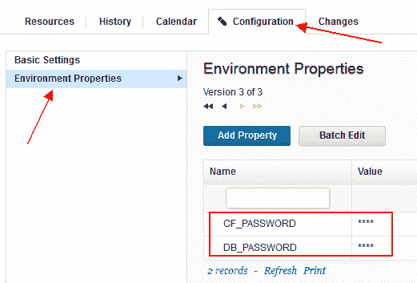

### 根据环境生成清单文件

清单文件是一个包含键名称和值的模板文件，UrbanCode Deploy 流程会在部署期间动态填充该键名称和值。

例如，对于不同环境，应用程序的路径应该有所不同。如果要遵循的模式是 `<ENV>-<APPNAME>.mybluemix.net`，那么应该从特定于环境的变量中选择 `<ENV>` 的值，而且应该从 UrbanCode Deploy 中特定于组件的名称中选择 `<APPNAME>`。

### 定义应用程序流程

定义一个应用程序，创建环境并建立资源映射后，您需要创建应用程序流程来定义应用程序中的多个组件的部署顺序。

##### 图 14\. 创建一个应用程序流程

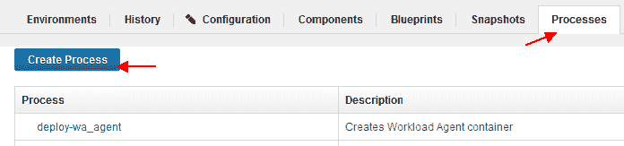

为每个单独组件创建一个整体应用程序流程是个好主意 — 这个流程会一次性部署所有组件。

## 集成 UrbanCode Deploy 与 Jenkins

许多开发团队使用 Jenkins 进行持续集成，但也需要通过环境来协调构建版本的部署，所有它们使用 Jenkins 创建这些构建版本，然后将新构建版本传递给 UrbanCode Deploy 进行部署。UrbanCode Deploy 为 Jenkins 提供了一个插件，以便 Jenkins 能够调用 UrbanCode Deploy 作为一个构建后操作，该操作可以触发部署。（参阅“[集成 Jenkins 与 IBM UrbanCode Deploy](https://developer.ibm.com/urbancode/docs/integrating-jenkins-ibm-urbancode-deploy/)”，查看激活此插件的完整操作说明。）

安装该插件后，您会看到一个用于将工件发布到 UrbanCode Deploy 的新的构建后操作。选择这一步骤并配置相关值，如图 15 所示：

##### 图 15\. 创建版本号的 Jenkins 构建后步骤

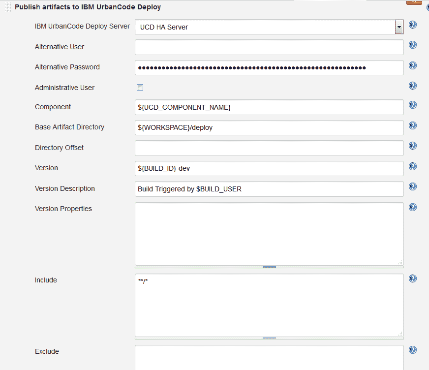

提供组件名称和版本号。这一步将 Base Artifact Directory 字段中提供的工件复制到 UrbanCode Deploy，并使用 Version 字段中提供的编号作为其版本号。

如果您需要部署此版本的工件，请添加以下详细信息：

##### 图 16\. 用于部署的 Jenkins 构建后步骤

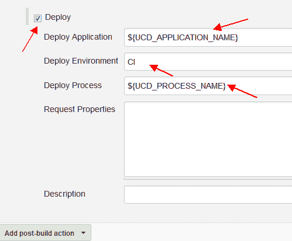

提供上一步中创建的 UrbanCode Deploy 应用程序名称。提供上一节中的环境和应用程序流程信息，以便部署到相应的环境。

## 部署微服务

大部分开发项目都遵循“一次构建，多次部署”的方法，本示例也不例外。

成功执行 Jenkins 作业后，微服务的可部署版本将存储在 UrbanCode Deploy 中。可以使用相同版本的工件，并在更低级的环境（开发和测试环境）中成功测试它后，将它部署到更高级的环境（比如预生产和生产环境）中。为此，请选择 UrbanCode Deploy 中的应用程序并单击运行按钮（环境旁边的箭头按钮）。

##### 图 17\. 重新部署应用程序

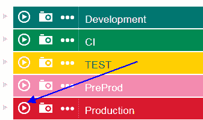

接下来，从下拉菜单中选择您想要使用的应用程序流程。如果需要一次部署多个微服务，可以在 UrbanCode Deploy 中创建包含经过测试的微服务版本的快照，并一次性部署它们。

##### 图 18\. 部署多个微服务

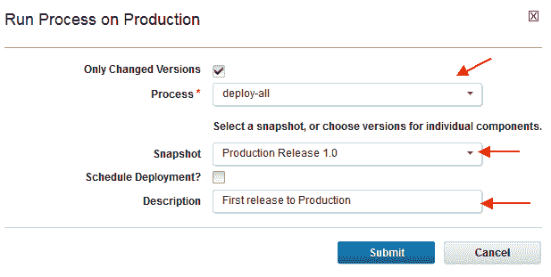

## 结束语

在本教程中，您学习了如何创建一个 UrbanCode Deploy 组件模板和应用程序，以及如何添加组件。您还学习了如何集成 Jenkins 与 UrbanCode Deploy，并从 Jenkins 和 UrbanCode Deploy 触发多次微服务部署。有关激活这个 UrbanCode Deploy/Jenkins 插件的操作说明，请参阅“[集成 Jenkins 与 IBM UrbanCode Deploy](https://developer.ibm.com/urbancode/docs/integrating-jenkins-ibm-urbancode-deploy/)”。

本文翻译自：[Use UrbanCode to deploy microservices on IBM Cloud](https://developer.ibm.com/tutorials/cl-urbancode-deploy-microservices-cloud/)（2017-12-01）