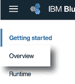
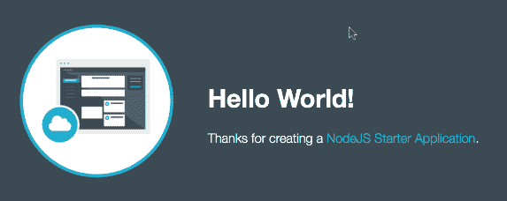

# 在 IBM Cloud 中使用克隆的 git 存储库

> 原文：[`developer.ibm.com/zh/tutorials/cl-cloned-git-repos-in-ibm-cloud/`](https://developer.ibm.com/zh/tutorials/cl-cloned-git-repos-in-ibm-cloud/)

**视频：在 IBM Cloud 中使用克隆的 git 存储库**

[点击查看视频演示](http://v.youku.com/v_show/id_XMzI5MDAzOTc0OA==.html)[查看抄本](http://www.ibm.com/developerworks/cn/cloud/library/cl-cloned-git-repos-in-ibm-cloud/Mailbag-Working-with-git-clones.txt)

**免费试用 IBM Cloud**

利用 [IBM Cloud Lite](https://cloud.ibm.com/registration?cm_sp=ibmdev-_-developer-tutorials-_-cloudreg) 快速轻松地构建您的下一个应用程序。您的免费帐户从不过期，而且您会获得 256 MB 的 Cloud Foundry 运行时内存和包含 Kubernetes 集群的 2 GB 存储空间。

IBM Developer Code Patterns 是包含 git 存储库的完整项目，可以帮助您开始使用各种技术。本教程将展示如何获取克隆的 git 存储库，将它连接到您自己的在 IBM Cloud 上运行的应用程序的交付管道。我们将演练一个完整的示例，从一个新的 Cloud Foundry 应用程序开始，然后克隆一个 git 存储库。接下来，我们将配置克隆的存储库来使用新的应用程序，最后确保从克隆的存储库推送到云的任何更改都会自动触发应用程序的交付管道。

## 创建一个 Cloud Foundry 应用程序

我们首先在 IBM Cloud 控制台上设置一个新应用程序。转到控制台，单击 **Create** 按钮创建一个 Cloud Foundry 应用程序：

在目录出现时，单击左侧列表中的 **Cloud Foundry Apps**：

我们的示例应用程序是一个 Node 应用程序，所以请单击屏幕中间的 **SDK for Node.js**：

为您的应用程序提供一个名称：

接下来，单击屏幕右下角的 **Create** 按钮。同平常一样，您的应用程序名称在 IBM Cloud 中必须是唯一的。如果您选择的名称已存在，您会收到一条错误消息。

在一两分钟内，您就会看到 Getting Started 页面：

请注意，右上方的单词“Starting”旁边有一个旋转的圆圈。**Visit App URL** 链接暂时已禁用。当您的应用程序部署成功时，您会看到一个绿色实线圆圈、状态“Running”，而且 **Visit App URL** 链接是激活的。

## 添加一个持续交付工具链

这是您创建新应用程序需要做的所有准备工作。现在是时候为应用程序设置一个 git 存储库了。这需要一个持续交付工具链——接下来的任务。

首先，单击左侧的 **Overview** 选项卡：

向下滚动到底部并单击 Continuous delivery 框中的 **Enable** 按钮：

在持续交付工具链页面上，向下滚动到底部。*确保您指定的是一个新存储库*：

接受剩余所有设置的默认值，单击 **Create**，云端将设置完毕。您会看到 Toolchain 页面：

要将您的本地存储库连接到云，需要获取刚创建的存储库的 URL。在一个新浏览器选项卡中打开 Toolchain 页面中间的 Code / Git 框：

在打开的选项卡中，您会看到该存储库的细节：

在页面中间，复制存储库的 HTTPS URL。（您需要单击左侧的下拉列表来选择 HTTPS 而不是 SSL。）当该 URL 出现时，单击 Copy 图标：

要查看一切是否正常，请打开用于演示的交付管道页面。在以后执行 `git push` 时，随着您的更新代码经历构建和部署阶段，交付管道页面会显示发生的事情。单击 **Delivery Pipeline** 磁贴打开该页面：

您会看到构建和部署阶段的状态：

最后，回到 Getting Started 页面并单击顶部的 **Visit App URL**：

您将看到这个有趣的页面：

离开云之前，目前的进展如下：

*   您有一个正常运行的新 Cloud Foundry 应用程序。它显示了一个简单的网页。
*   您有一个 git 存储库和一个与您的 Cloud Foundry 应用程序有关联的持续交付管道。
*   您在一个浏览器选项卡中打开了该交付管道，所以可以观察到只要您对存储库执行 `git push`，就会运行构建和部署阶段。

## 克隆存储库

让我们返回到本地机器来开始克隆该存储库。在本示例中，克隆 `https://github.com/DougTidwell/dWSimpleApp`：

**备注：**当您克隆此存储库时，一定要阅读自述文件中的所有条款和条件。

克隆存储库并更改到包含已克隆的代码的目录：

## 将存储库连接到 Cloud Foundry 应用程序

现在，您需要让克隆的存储库指向您的 IBM Cloud 帐户中的应用程序。否则，您尝试推送的所有更改都将返回到原始存储库中。命令如下：

*   `git remote remove origin`
*   `git remote add origin` [后跟您在云中的存储库的 URL，*而不是*原始存储库的 URL]
*   `git push -u origin --all`
*   最后执行 `git push -u origin --tags`

您的结果应类似于下图：

**备注：**如果您克隆的 git 存储库没有任何标签，则没有必要执行最后一条命令，包含它只是为了保持完整性。如果您没有任何标签，运行此命令没有任何意义。

## 测试一下

现在，所有设置均已完成。要确保一切正常，可以编辑您的机器上的克隆存储库中的 index.html 文件。为了让进展一目了然，可以更改页面上的标题：

保存更新的文件后，执行平常的 `git add`、`git commit` 和 `git push` 序列：

在执行 `git push` 的几秒内，应该会在浏览器中运行交付管道的构建阶段：

请注意，来自 `git commit` 命令的注释将会显示在 UI 中。如果构建阶段成功完成，工具链会前进到部署阶段：

在完成部署时，可以单击该应用程序的 URL 并查看您的更改：

## 结束语

我们在 IBM Developer 上提供的所有样本代码的目标都是帮助您构建下一个优秀的应用程序。Git 存储库是打包代码的好方法，但默认情况下，在您克隆它们时，它们会保持与其原始源代码的连接。使用本文中的技术，您可以克隆您喜欢的任何 git 存储库，并将其连接到在 IBM Cloud 中运行的应用程序的持续交付工具链。

本文翻译自：[Work with cloned git repos in IBM Cloud](https://developer.ibm.com/tutorials/cl-cloned-git-repos-in-ibm-cloud/)（2017-11-20）