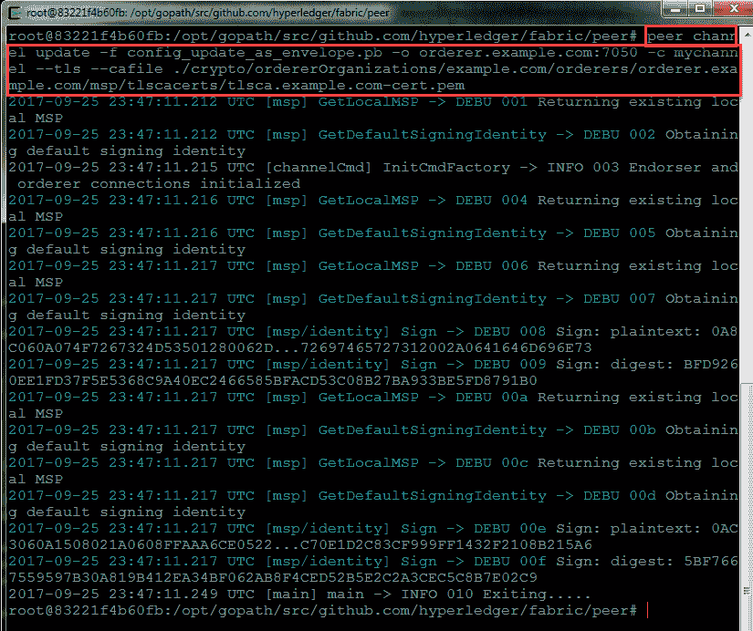

# 使用一个简单工具向现有的 Hyperledger Fabric 区块链网络添加一个组织

> 原文：[`developer.ibm.com/zh/tutorials/cl-add-an-organization-to-your-hyperledger-fabric-blockchain/`](https://developer.ibm.com/zh/tutorials/cl-add-an-organization-to-your-hyperledger-fabric-blockchain/)


获取最佳免费工具、培训和社区资源的每月集萃，帮助您开始使用区块链。
**[最新一期](http://ibm.biz/blockchain-newsletter)** | **[订阅](http://ibm.biz/blockchain-newsletter-signup)**

Hyperledger Fabric [**first-network 示例**](https://github.com/hyperledger/fabric-samples/tree/release/first-network)（也被称为“Build Your First Network”示例和“e2e_cli”示例）展示了一个基础区块链用例教程样例的完全脚本化且端到端自动化的示例。该示例配备一个 Hyperledger Fabric 区块链网络，将一个智能合约 (chaincode-Example02) 应用程序部署到这个运行的网络，然后针对部署的链代码运行交易。

配备的 Hyperledger Fabric 区块链网络包含*两个组织*、每个组织两个对等节点，以及一个 Solo 订购服务。该网络支持自动配备对等节点和订购者组织的加密材料，自动配备渠道工件，以及邀请组织对等节点加入渠道。

##### 在区块链术语方面需要帮助？

在 [区块链基础：术语表和用例](http://www.ibm.com/developerworks/cn/cloud/library/cl-blockchain-basics-glossary-bluemix-trs/index.html) 中适当了解，然后在 [Hyperledger Fabric 术语表](http://fabrictestdocs.readthedocs.io/en/latest/glossary.html) 中更深入钻研。

在本教程中，我们将展示如何将*第三个组织*添加到一个应用程序渠道，将它自己的对等节点添加到一个已在运行的 Hyperledger Fabric 区块链网络，然后将它加入该渠道。

## configtxlator 工具简介

**configtxlator 工具** 提供了一个与 SDK 独立的真正无状态的 REST API，以简化 Hyperledger Fabric 区块链网络中的配置任务。该工具能够在不同的等效数据表示/格式之间轻松转换。例如，在工具操作的一种模式中，该工具在二进制 protobuf 格式与人类可读的 JSON 文本格式间来回转换。此外，该工具可以基于两组不同的配置交易之间的区别来计算配置更新。

## 设置您的环境

##### 希望使用您自己的证书颁发机构？

请参阅如何使用从知名外部证书颁发机构获得的[自定义配置的加密资料](https://www.ibm.com/developerworks/cloud/library/cl-build-blockchain-network-with-custom-cryptographic-material-from-your-certificate-authority/index.html)来配置，测试和验证 Hyperledger Fabric”first-network”样本以获取根证书和中间证书。

对于命令行配置更新，确保您至少安装了 [Hyperledger Fabric 的 1.1.0 预览版](https://github.com/hyperledger/fabric/tree/v1.1.0-preview)。（此版本引入了对等节点渠道 `signconfigtx` 命令，以在提交配置更新之前收集多个签名。它还修复了 v1.0.4 中未解决的 configtxlator 工具中的错误。）其他选项包括手动收集签名或让客户端应用程序借助 NodeSDK 支持以编程方式收集需要的签名。

验证您使用的是针对所选平台的 V1.1.0 版本级别的对等节点二进制文件，如图 1 所示。

##### 图 1\. 验证对等节点平台二进制可执行文件的版本号


本教程使用开源的 [jq](https://stedolan.github.io/jq/) 工具来通过脚本处理与 configtxlator 返回的 JSON 的交互。这些 JSON 操作也可以手动或通过其他 JSON 工具执行。在 Ubuntu 平台上使用以下命令将 jq 工具安装到容器中，如图 2 所示。

```
apt-get -y -qq update && \
apt-get install -y -qq curl && \
apt-get clean
curl -o /usr/local/bin/jq http://stedolan.github.io/jq/download/linux64/jq && \ 
```

##### 图 2\. 安装和验证 jq 工具


在后台启动 configtxlator 工具，验证该工具已正确启动来接收传入的客户端请求，如图 3 所示。

```
configtxlator start & 
```

##### 图 3\. 在容器内成功启动和验证 configtxlator 工具


添加第三个组织的一般步骤（本教程将会介绍）包括：

1.  检索当前配置。
2.  使用 configtxlator 将该配置解码为 JSON 配置的人类可读版本。
3.  提取 config 节。
4.  在提取的 config 节上执行自动或手动编辑，以创建新配置。
5.  使用 configtxlator 对更新后的和原始的配置进行编码。
6.  将它们发送到 configtxlator 以计算配置更新增量，也就是对配置的更改。
7.  对配置更新进行解码并将它包装在一个配置更新信封中。
8.  创建新配置交易。
9.  提交新的已签名配置交易来更新渠道。

## 检索当前配置

执行以下命令来检索应用程序渠道 *mychannel* 上的当前配置块。因为订购者端点受 TLS 保护，所以以参数形式提供证书颁发机构身份。

```
peer channel fetch config config_block.pb -o orderer.example.com:7050 -c mychannel --tls --cafile
./crypto/ordererOrganizations/example.com/orderers/orderer.example.com/msp/tlscacerts/tlsca.example.com-cert.pem 
```

图 4 显示已成功抓取和验证应用程序渠道 *mychannel* 的渠道配置块。抓取的二进制配置数据块上的 `file` 命令表明，像预期的一样，`config_block.pb` 包含一条二进制 protobuf 消息。

##### 图 4\. 抓取和验证应用程序渠道的渠道配置 – 客户端视图


图 5 中的控制台日志的订购者（服务器）端视图显示已成功抓取应用程序渠道 *mychannel* 的渠道配置。

##### 图 5\. 抓取和验证应用程序渠道的渠道配置 – 服务器视图


## 使用 configtxlator 将配置解码为 JSON 配置的人类可读版本

使用 configtxlator 工具将二进制 protobuf 渠道配置块信息解码为人类可读的文本 JSON 格式。使用 *file* 命令验证 JSON 文件的已解码内容，看看是否已成功解码，如图 6 所示。

```
curl -X POST --data-binary @config_block.pb http://127.0.0.1:7059/protolator/decode/common.Block > config_block.json 
```

##### 图 6\. 对已抓取的应用程序渠道的渠道配置块进行解码


## 提取配置节

从应用程序渠道 *mychannel* 的已解码渠道配置块中提取数据的载荷数据节的配置节，然后验证是否已正确且成功地提取，如图 7 和 8 所示。

```
jq .data.data[0].payload.data.config config_block.json > config.json 
```

##### 图 7\. 对已抓取的应用程序渠道的渠道配置块进行解码


##### 图 8\. 验证为应用程序渠道的渠道配置块创建的工件


## 对提取的配置节进行编辑，以创建新配置

修改应用程序渠道 *mychannel* 的渠道配置。 具体来讲，添加 Org3MSP，如图 9 所示。

##### 图 9\. 应用程序渠道 *mychannel* 的已修改渠道配置 – 添加了 Org3MSP


## 使用 configtxlator 编码原始的和修改后的配置。

使用该工具将应用程序渠道 *mychannel* 的*原始*渠道配置编码为 protobuf，然后验证是否已正确编码，如图 10 所示。

```
curl -X POST --data-binary @config.json http://127.0.0.1:7059/protolator/encode/common.Config > config.pb 
```

##### 图 10\. 编码应用程序渠道 *mychannel* 的原始渠道配置块


使用该工具将应用程序渠道 *mychannel* 的*修改后的*渠道配置编码为 protobuf，然后验证是否已正确编码，如图 11 所示。

```
curl -X POST --data-binary @updated_config.json http://127.0.0.1:7059/protolator/encode/common.Config > updated_config.pb 
```

##### 图 11\. 编码应用程序渠道 *mychannel* 的修改后的渠道配置块


## 将它们发送到 configtxlator 来计算配置更新增量

执行以下命令来计算配置更新，它们是使用该工具在应用程序渠道 *mychannel* 的原始和修改后的渠道配置间的过渡。验证计算的配置更新是否正确，如图 12 所示。

```
curl -X POST -F original=@config.pb -F updated=@updated_config.pb http://127.0.0.1:7059/configtxlator/compute/update-from-configs -F
                channel=mychannel > config_update.pb 
```

##### 图 12\. 计算对应用程序渠道 *mychannel* 的渠道配置的更改


## 解码配置更新并将它包装在一个配置更新信封中

将配置更新解码为 JSON 格式并验证解码操作，如图 13 所示。

```
curl -X POST --data-binary @config_update.pb
http://127.0.0.1:7059/protolator/decode/common.ConfigUpdate > config_update.json 
```

##### 图 13\. 解码已计算的对应用程序渠道的渠道配置的更改


采用 JSON 格式为配置更新消息创建一个信封，验证信封创建步骤是否已成功完成，如图 14 所示。

```
echo '{"payload":{"header":{"channel_header":{"channel_id":"mychannel",
                "type":2}},"data":{"config_update":'$(cat config_update.json)'}}}' >
                config_update_as_envelope.json 
```

##### 图 14\. 采用 JSON 格式为配置更新块消息创建一个信封


## 创建新配置交易

将配置更新消息编码为 protobuf 格式，验证编码操作是否已成功完成，如图 15 所示。

```
curl -X POST --data-binary @config_update_as_envelope.json
                http://127.0.0.1:7059/protolator/encode/common.Envelope >
                config_update_as_envelope.pb 
```

##### 图 15\. 将配置更新消息编码为 protobuf 格式并执行验证


通过拥有管理特权的用户将环境设置为 Org1MSP，以准备对配置更新交易进行签名，如图 16 所示。

```
CORE_PEER_TLS_ROOTCERT_FILE=/opt/gopath/src/github.com/hyperledger/fabric/peer/crypto/peerOrganizations/org1.example.com/peers/peer0.org1.example.com/tls/ca.crt
CORE_PEER_TLS_KEY_FILE=/opt/gopath/src/github.com/hyperledger/fabric/peer/crypto/peerOrganizations/org1.example.com/peers/peer0.org1.example.com/tls/server.key
CORE_PEER_LOCALMSPID=Org1MSP
CORE_PEER_TLS_CERT_FILE=/opt/gopath/src/github.com/hyperledger/fabric/peer/crypto/peerOrganizations/org1.example.com/peers/peer0.org1.example.com/tls/server.crt
CORE_PEER_TLS_ENABLED=true
CORE_PEER_MSPCONFIGPATH=/opt/gopath/src/github.com/hyperledger/fabric/peer/crypto/peerOrganizations/org1.example.com/users/Admin@org1.example.com/msp 
```

##### 图 16\. 置环境，以准备对配置更新交易进行签名 – Org1MSP/Admin


## 提交新的已签名配置交易来更新渠道

执行以下命令来对配置更新交易进行签名。 参见图 17 和 18 来从客户端（CLI 容器）和服务器（订购者）端成功执行该命令。此命令将该交易的一个签名添加到文件系统中的合适位置。

```
peer channel signconfigtx -f config_update_as_envelope.pb -o
                orderer.example.com:7050 --tls --cafile
                ./crypto/ordererOrganizations/example.com/orderers/orderer.example.com/msp/tlscacerts/tlsca.example.com-cert.pem 
```

##### 图 17\. 成功执行渠道配置交易签名命令 – 客户端视图


##### 图 18\. 成功执行渠道配置交易签名命令 – 服务器视图


通过拥有管理特权的用户将环境设置为 Org2MSP，以准备签名并提交更新交易，如图 19 所示。

```
CORE_PEER_TLS_ROOTCERT_FILE=/opt/gopath/src/github.com/hyperledger/fabric/peer/crypto/peerOrganizations/org2.example.com/peers/peer0.org2.example.com/tls/ca.crt
CORE_PEER_TLS_KEY_FILE=/opt/gopath/src/github.com/hyperledger/fabric/peer/crypto/peerOrganizations/org2.example.com/peers/peer0.org2.example.com/tls/server.key
CORE_PEER_LOCALMSPID=Org2MSP
CORE_PEER_TLS_CERT_FILE=/opt/gopath/src/github.com/hyperledger/fabric/peer/crypto/peerOrganizations/org2.example.com/peers/peer0.org2.example.com/tls/server.crt
CORE_PEER_TLS_ENABLED=true
CORE_PEER_MSPCONFIGPATH=/opt/gopath/src/github.com/hyperledger/fabric/peer/crypto/peerOrganizations/org2.example.com/users/Admin@org2.example.com/msp 
```

##### 图 19\. 设置环境，以准备提交配置更新交易 – Org2MSP/Admin


执行以下命令来提交配置更新交易。在将配置更新提交到订购者之前，`update` 命令自动将用户的签名添加到配置更新上（所以不需要第二次使用 signconfigtx）。参见图 20 和 21 来从客户端（CLI 容器）和服务器（订购者）端成功执行该命令。

```
peer channel update -f config_update_as_envelope.pb -o
                orderer.example.com:7050 -c mychannel --tls --cafile
                ./crypto/ordererOrganizations/example.com/orderers/orderer.example.com/msp/tlscacerts/tlsca.example.com-cert.pem 
```

##### 图 20\. 成功执行渠道配置交易提交命令 – 客户端视图



执行以下命令来抓取更新的当前配置。 参见图 21 和 22 来从客户端和服务器端成功执行该命令。

```
peer channel fetch config config_block_Org3MSP.pb -o
                orderer.example.com:7050 -c mychannel --tls --cafile
                ./crypto/ordererOrganizations/example.com/orderers/orderer.example.com/msp/tlscacerts/tlsca.example.com-cert.pem 
```

##### 图 21\. 成功执行更新的当前渠道配置 – 客户端视图


##### 图 22\. 成功执行更新的当前渠道配置 – 服务器视图


执行以下命令来解码成功更新的当前渠道配置，然后验证更新操作，如图 23 所示。

```
curl -X POST --data-binary @config_block_Org3MSP.pb
                http://127.0.0.1:7059/protolator/decode/common.Block >
                config_block_Org3MSP.json 
```

##### 图 23\. 解码和验证已更新的当前渠道配置


图 24 展示了对使用 configtxlator 工具生成的所有工件执行正确性验证的端到端过程。

##### 图 24\. 在一个端到端过程中验证 configtxlator 工具生成的工件


运行以下命令来确定容器日志的位置。 检查它们，确保您的配置更新流程中的每个步骤都正确完成，如图 25 所示。

```
docker inspect --format='{{.LogPath}}' orderer.example.com 
```

##### 图 25\. 用于检查和验证的容器日志文件


## 结束语

恭喜您！您已成功使用 configtxlator 工具的编码和解码特性，将第三个组织和它自己的对等节点添加到一个已在运行的 Hyperledger Fabric 区块链网络的应用程序渠道中。您已验证已将这个新组织成功添加到您的渠道配置中。

## 致谢

衷心感谢 IBM Blockchain 研发专业人员 Gari Singh、Bobbie Cochrane 和 Yacov Manevich 提供经过深思熟虑的建议。

衷心感谢和感激我们当前/最新的客户/合作伙伴互动团队通力合作，帮助本教程撰写完成，该团队由管理和技术专业人员组成，主要包括 Balaji Balaraman、Harish Naik、Andras Ferenczi、Dallas Gale、Nilesh Jadhav、Alejandro Vences 和 Jai Kiran。

还要感谢评审人员和经理提供建设性的反馈和鼓励。

本文翻译自：[Add an organization to your existing Hyperledger Fabric blockchain network using an easy tool](https://developer.ibm.com/tutorials/cl-add-an-organization-to-your-hyperledger-fabric-blockchain/)（2017-11-07）