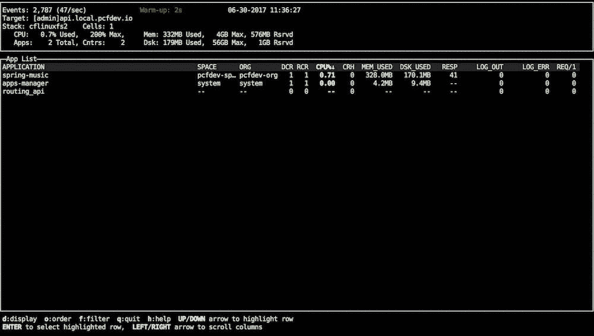
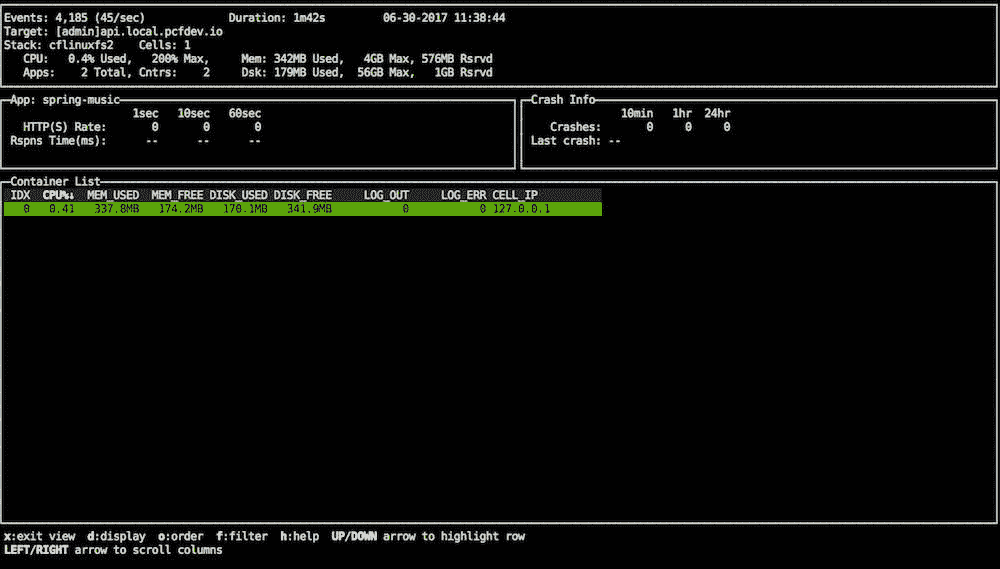

# 通过 5 个 Cloud Foundry 插件提高生产力

> 原文：[`developer.ibm.com/zh/tutorials/cl-cloud-foundry-plugins/`](https://developer.ibm.com/zh/tutorials/cl-cloud-foundry-plugins/)

Cloud Foundry 是一个用于开发和部署企业云应用程序的行业标准的开源云应用程序平台，如果使用 Cloud Foundry 命令行接口 (CLI)，可以安装插件来提高生产力，这些插件使您能：

*   在本地开发云应用程序
*   显示 Cloud Foundry 发行版的实时统计数据
*   节省复制粘贴云应用程序 URL 通常所需的时间
*   显示应用程序用户信息
*   显示云环境中目前存在的问题的列表

> 尽管 cf CLI 本身已经是一个非常强大的工具，但插件可以让开发人员的工作变得更轻松……您还可以编写自己的插件，将它们托管在内部或添加到 CF 社区。

在本文中，我将演示如何使用这些 Cloud Foundry 插件执行上面列出的任务：

*   [PCF Dev](https://github.com/pivotal-cf/pcfdev)，一个专为在开发人员的笔记本电脑或工作站上运行而设计的 Cloud Foundry 发行版
*   [top](https://github.com/ECSTeam/cloudfoundry-top-plugin)，一个显示最重要的统计数据的交互式界面，类似于 UNIX `top` 命令
*   [Open](https://github.com/cloudfoundry-community/cf-plugin-open)，用于在浏览器中打开应用程序 URL
*   [whoami](https://github.com/jtuchscherer/whoami-plugin)，显示目前已登录用户的姓名
*   [doctor](https://github.com/emirozer/cf-doctor-plugin)，扫描已部署的应用程序、路径和服务中的异常并报告所有问题

可以在 [Cloud Foundry 社区的 cf CLI 插件页面](https://plugins.cloudfoundry.org/)上找到其他许多插件，或者创建自己的插件，完全摆脱任何供应商锁定问题。

在开始安装 CLI 之前，让我们快速了解一下 Cloud Foundry 平台。

## 关于 Cloud Foundry

Cloud Foundry（与语言和基础架构无关）在整个生命周期中自动化、扩展和管理云应用程序。您可以使用几乎任何语言和您选择的任何云提供商来开发应用程序。

该项目于 2009 年启动，并于 2015 年通过创建 Cloud Foundry Foundation 而开放源码。Cloud Foundry 支持 Ruby、Java、Python、PHP、Golang 和 Node；这涵盖了大部分主要的语言和框架，这也是它在开发人员中如此受欢迎的原因之一。因为 Cloud Foundry 是开源的，而且能部署在多个云平台上，比如 AWS、Azure，甚至是 OpenStack 上，这避免了让许多开发人员和初创公司望而生畏的供应商锁定问题。

**免费试用 IBM Cloud**

利用 [IBM Cloud Lite](https://cloud.ibm.com/registration?cm_sp=ibmdev-_-developer-tutorials-_-cloudreg) 快速轻松地构建您的下一个应用程序。您的免费帐户从不过期，而且您会获得 256 MB 的 Cloud Foundry 运行时内存和包含 Kubernetes 集群的 2 GB 存储空间。

开发人员还可以选择将应用程序部署在托管的 Cloud Foundry 解决方案和经过认证的平台上，比如 IBM Cloud、Atos Cloud Foundry、Pivotal Cloud Foundry、SAP Cloud Platform、Huawei FusionStage 和 Swisscom Application Cloud。Cloud Foundry 的一些替代方案包括 Heroku、OpenShift 和 Google App Engine。

如果您完全不熟悉 Cloud Foundry，请参阅本文的“相关主题”部分，获取有关如何上手使用该平台的教程。

接下来我将介绍如何安装 CLI。

## CLI，生产力的关键

Cloud Foundry CLI 是一个经过认证的命令行客户端，它使开发人员能与该平台及其服务交互。它由 Cloud Foundry Foundation 维护。

您可以[下载](https://github.com/cloudfoundry/cli) Cloud Foundry CLI 并将它安装在 Linux、Mac OSX 和 Windows 平台上。

尽管 Cloud Foundry 有一个不错的管理仪表板，但在生产力和自动化方面，没有什么能与命令行相媲美。许多最较真的用户更喜欢 CLI 而不是 GUI 应用程序。

### 安装 CLI

需要安装 Cloud Foundry CLI 才能使用这些插件，所以请安装它们。最简单的方法是通过包管理器进行安装：

```
# For Mac OSX
$ brew install cloudfoundry/tap/cf-cli

# For Ubuntu and other Debian-based distros

$ wget -q -O -
https://packages.cloudfoundry.org/debian/cli.cloudfoundry.org.key | sudo
apt-key add -
$ echo "deb http://packages.cloudfoundry.org/debian stable main" | sudo
tee /etc/apt/sources.list.d/cloudfoundry-cli.list
# ...then, update your local package index, then finally install the cf
CLI
$ sudo apt-get update
$ sudo apt-get install cf-cli

# For Fedora and other RedHat based systems

# Configure the Cloud Foundry Foundation package repository
sudo wget -O /etc/yum.repos.d/cloudfoundry-cli.repo
https://packages.cloudfoundry.org/fedora/cloudfoundry-cli.repo
# ...then, install the cf CLI (which will also download and add the
public key to your system)
sudo yum install cf-cli 
```

您也可以[下载适合您的操作系统的二进制文件](https://github.com/cloudfoundry/cli#downloads)。

## 插件，舞台上的明星

**轮到您了**
了解如何[将插件提交到 Cloud Foundry 社区](https://github.com/cloudfoundry-incubator/cli-plugin-repo)。

Cloud Foundry 命令行接口 (cf CLI) 包含一些插件功能，使开发人员能向 cf CLI 添加自定义命令。

现在我将详细介绍插件 — 如何安装并使用它们。

### PCF Dev

PCF Dev 是 Pivotal 团队提供的一个小巧的发行版，专为在本地机器上的单个虚拟机内运行而设计，在一个易于安装的包中提供了完整的 Cloud Foundry 体验和全功能的开发环境。

换言之，它允许在本地开发云应用程序。PCF Dev 也是一种评估和学习 Cloud Foundry 的好方法。

对于所有实际用途，PCF Dev 的行为就像一个插件。例如，要卸载它，请使用命令 `cf uninstall-plugin pcfdev`。

要运行 PCF Dev，机器上必须拥有至少 4GB 内存和 20GB 空闲磁盘空间。本文中的所有示例都适用于 PCF Dev。

#### 安装该插件

下载适合您的操作系统的插件二进制文件：

*   [GitHub](https://github.com/pivotal-cf/pcfdev) 允许构建 PCF Dev 的一个仅包含 Elastic Runtime 和 CF MySQL Broker 的开源版本。
*   [Pivotal Network](https://network.pivotal.io/products/pcfdev#/releases/4905) 允许构建一个包含其他 PCF 组件（比如 Redis 和 RabbitMQ）的版本。

要获得完整版本，在下载该插件前可能需要进行登录。

拥有插件的 .zip 文件后，将它解压到一个文件夹并执行其中包含的二进制文件。我已经下载了该插件的 Mac OSX 版本，当然您应该下载与您的操作系统相对应的版本。

```
kn330@local-osx $ ls
pcfdev-v0.26.0+PCF1.10.0-osx.zip

kn330@local-osx $ unzip pcfdev-v0.26.0+PCF1.10.0-osx.zip
Archive:  pcfdev-v0.26.0+PCF1.10.0-osx.zip
inflating: pcfdev-v0.26.0+PCF1.10.0-osx

kn330@local-osx $ ./pcfdev-v0.26.0+PCF1.10.0-osx
Plugin successfully upgraded.Current version: 0.26.0.For more info
run: cf dev help 
```

如果成功安装该插件，就会在输出中看到成功消息。

如果使用 Linux，那么您可能没有预先安装 unzip 实用程序。可以下载该实用程序，并使用以下命令安装它：

```
$ sudo apt-get install unzip 
```

#### 使用该插件

PCF Dev 是在 Cloud Foundry 上建立一个本地发行版的最简单方法，您可以使用 `cf dev start` 命令完成此任务：

```
kn330@local-osx $ cf dev start
Downloading VM...
Progress: |====================>| 100%
VM downloaded
Importing VM...
Starting VM...
Provisioning VM...
Waiting for services to start...
40 out of 40 running
______ _____ ______    ______   ______ _   __
|       ||       ||       |  |      | |       ||  | |  |
|    _  ||       ||    ___|  |  _    ||    ___||  |_|  |
|   |_| ||       ||   |___   | | |   ||   |___ |       |
|    ___||      _||    ___|  | |_|   ||    ___||       |
|   |    |     |_ |   |      |       ||   |___  |     |
|___|    |_______||___|      |______| |_______|  |___|
is now running.
To begin using PCF Dev, please run:
cf login -a https://api.local.pcfdev.io --skip-ssl-validation
Admin user => Email: admin / Password: admin
Regular user => Email: user / Password: pass 
```

可能需要花几分钟时间，PCF Dev 机器和服务才能启动。

输出还会回显可用来登录到 Cloud Foundry Dev 的凭证。

可以使用 `cf dev status` 命令验证开发环境的状态：

```
kn330@local-osx $ cf dev status
Running
CLI Login: cf login -a https://api.local.pcfdev.io --skip-ssl-validation
Apps Manager URL: https://local.pcfdev.io
Admin user => Email: admin / Password: admin
Regular user => Email: user / Password: pass 
```

现在，在本地 Cloud Foundry 环境中运行一个演示应用程序。

首先，克隆演示 spring-music 应用程序，该应用程序是在 Spring Framework 上使用 Java™ 编写的。

```
kn330@local-osx $ git clone https://github.com/cloudfoundry-
samples/spring-music 
```

使用 gradle 汇编该应用程序：

```
kn330@local-osx $ cd ./spring-music
kn330@local-osx $ ./gradlew assemble 
```

使用用户名 **admin** 和密码 **admin** 登录到 PCF Dev：

```
kn330@local-osx $ cf login -a api.local.pcfdev.io --skip-ssl-validation
API endpoint: api.local.pcfdev.io
...
API endpoint:   https://api.local.pcfdev.io (API version: 2.75.0)
User:           admin
Org:            pcfdev-org
Space:          pcfdev-space 
```

推送该应用程序：

```
kn330@local-osx $ cf push --hostname spring-music
Using manifest file /../spring-music/manifest.yml
...
0 of 1 instances running, 1 starting
0 of 1 instances running, 1 starting
1 of 1 instances running
...
requested state: started
instances: 1/1
usage: 1G x 1 instances
urls: spring-music.local.pcfdev.io 
```

可以通过浏览器访问 URL [`spring-music.local.pcfdev.io`](http://spring-music.local.pcfdev.io) 来验证已部署的应用程序。

本地 PCF Dev 环境的管理面板可通过 [`apps.local.pcf.dev`](http://apps.local.pcf.dev) 进行访问。如果是第一次访问，还必须运行命令 `cf dev trust`。您必须这么做，因为管理仪表板在 https 上运行，而且 PCF Dev 使用了一个自签名证书，该证书需要添加到本地机器的受信任密钥链中。

要进一步了解 PCF Dev，请输入 `cf dev help`。

### top

top 插件是一个交互式的 Cloud Foundry CLI 工具，用于显示 Cloud Foundry 发行版的实时统计数据，包括应用程序和路径指标、每个应用程序的系统资源利用率，以及其他重要值。可以将 top 视为 Linux `top` 命令的 Cloud Foundry 替代方案。top 插件通常使用的信息主要是通过监视 Cloud Foundry Firehose 插件获得的。

根据向用户授予的权限，top 插件在特权或非特权模式下运行。

#### 安装该插件

可以使用以下命令轻松安装该插件：

```
kn330@local-osx $ cf install-plugin -r CF-Community "top" 
```

#### 使用该插件

要开始使用该插件，只需输入以下命令：

```
kn330@local-osx $ cf top 
```

在图 1 中可以看到，在 PCF Dev 环境中部署的 spring-music 应用程序与另外两个系统应用程序是一起显示的。

##### 图 1\. 使用 top 插件获取 Cloud Foundry 实时统计数据



可以看到系统应用程序是因为我们是以管理员身份登录的。 要获得某个应用程序的更多信息，可以使用箭头键选择该应用程序并按下 **Enter**。

##### 图 2\. 使用 top 插件获取应用程序细节



### Open

这是我最喜欢的插件之一，因为它为我节省了复制粘贴应用程序 URL 通常所需的大量时间。安装此插件后，可以使用命令 `cf open app-name` 打开任何应用程序。

#### 安装该插件

```
kn330@local-osx $ cf install-plugin -r CF-Community "Open"
Searching CF-Community for plugin Open...
Plugin Open 1.1.0 found in: CF-Community
7.63 MiB / 7.63 MiB [===================================] 100.00% 6s
Plugin open 1.1.0 successfully installed. 
```

#### 使用该插件

这将在浏览器中打开 spring-music 应用程序。

```
cf open spring-music 
```

### whoami

从 whoami 插件的名称就能看出它的作用是 — 显示用户的信息。如果有多个 Cloud Foundry 发行版，而且需要不断在它们之间切换，那么此插件非常方便。

#### 安装该插件

```
kn330@local-osx $ cf install-plugin -r CF-Community "whoami-plugin"
Searching CF-Community for plugin whoami-plugin...
Plugin whoami-plugin 0.2.0 found in: CF-Community
9.22 MiB / 9.22 MiB [===========================================]
100.00% 7s
Plugin Whoami Plugin 0.2.0 successfully installed. 
```

#### 使用该插件

```
kn330@local-osx $ cf whoami
You are logged in as admin at https://api.local.pcfdev.io
You are targeting the pcfdev-space space in the pcfdev-org org 
```

### doctor

doctor 插件的灵感来源于 `brew doctor`，它将显示环境中目前存在的问题的列表。Homebrew 是一个适用于 Mac OS X 的开源包管理器。如果您是一名 Ubuntu 用户，就会发现 `brew doctor` 类似于命令 `apt-get -f install`。

#### 安装该插件

```
kn330@local-osx $ cf install-plugin -r CF-Community "doctor" 
```

#### 使用该插件

想象您有一个没有与任何应用程序相关联的悬空路径：

```
kn330@local-osx $ cf doctor

doctor: time to triage cloudfoundry

Following routes do not have any app bound to them:
Host: springer2 <--->  Domain: local.pcfdev.io

Total Number of Apps: 1
Total Number of Running Apps: 1 
```

要修复此问题，可以使用以下命令删除该路径：

```
kn330@local-osx $ cf delete-route local.pcfdev.io --hostname springer2

Really delete the route springer2.local.pcfdev.io?> y
Deleting route springer2.local.pcfdev.io... 
```

现在，如果再次运行 `cf doctor`，应该一切正常。

```
kn330@local-osx $ cf doctor

doctor: time to triage cloudfoundry

doctor: Everything looks OK! 
```

## 结束语

尽管 cf CLI 本身已经是一个非常强大的工具，但插件可以让开发人员的工作变得更轻松。其他社区插件提供了以下功能：

*   获取一个堆转储或线程转储
*   使用单个命令在 CF 环境间切换
*   检查、转储和还原 MySQL 数据库
*   管理应用程序网络策略
*   将应用程序和服务复制到另一个 CF 目标
*   将一个本地文件夹同步到远程文件夹，以便动态执行更改
*   显示哪些应用程序正在使用一个已安装的 buildpack
*   在一个空间、组织和全局范围内的所有应用程序上运行同一个命令

功能不胜枚举。

您也可以编写自己的插件，内部托管它们，或者将它们添加到 CF 社区。

不要在云应用程序开发生产力竞赛中落后于其他程序员。 立即开始对 Cloud Foundry 使用插件！

本文翻译自：[Increase productivity with five Cloud Foundry plugins](https://developer.ibm.com/tutorials/cl-cloud-foundry-plugins/)（2017-10-24）