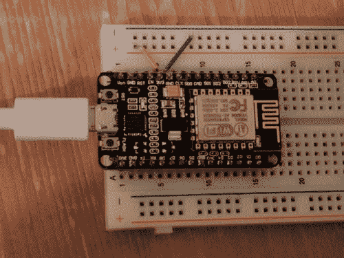
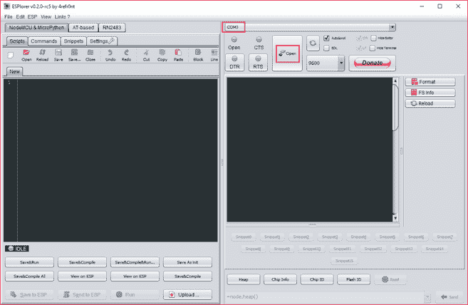
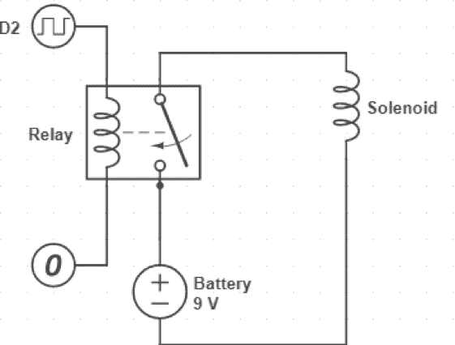
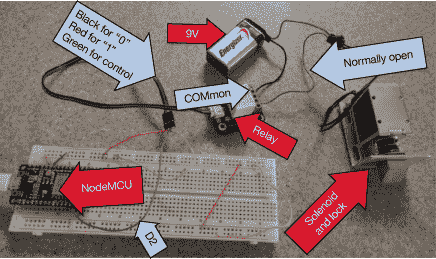

# 为一个未联网的环境构建智能锁

> 原文：[`developer.ibm.com/zh/tutorials/iot-security-smartlock-isolated/`](https://developer.ibm.com/zh/tutorials/iot-security-smartlock-isolated/)

IoT 的一个有趣用例是与未联网环境的一部分建立连接。例如，许多公司都有一个主要办公场所和多个远程办公场所，远程办公场所不一定拥有移动连接或互联网连接。出于各种安全目的（比如只有某些人才知道如何维护的专业设备），这些远程办公场所的一些房间通常是锁住的。

您可以实现一个智能锁（一个连接到电子锁的 IoT 设备），使用一次性密码来授权访问远程办公场所的这些已锁住的房间。为了节省人机接口设备的费用，可通过智能手机输入一次性密码。一次性密码的列表（以及对已锁住房间的访问）可从一个中央位置进行控制。

## 构建这个智能锁需要做的准备工作

*   一个电力控制的锁。我使用了 [uxcell 12v solenoid](http://amzn.to/2tBlWc6)。
*   一个 9v 的电池。从技术上讲，solenoid 需要 12v 的电池，但 9v 的电池也有效。
*   一个电池连接器，比如一个 [T 形夹连接器](http://amzn.to/2tvQMCx)。
*   一个数字继电器，比如 [CQRobot](https://www.amazon.com/s?k=CQRobot&ref=nb_sb_noss_2) 继电器。NodeMCU 硬件使用 3.3v 的电池，这足以驱动该锁。数字继电器允许使用 3.3v 设备来控制更高的电压。
*   一个 NodeMCU [开发板](http://amzn.to/2tmfwgA)。例如，我使用了不到 10 美元价格从 Amazon.com 购买的开发板。以这个价格，您可以获得安装软件及其配置文件的内部闪存，以及可用作连接站（连接到 wifi 接入点的设备）或 wifi 接入点的 wifi 电路。要进一步了解 NodeMCU 开发板，请参阅”[了解 NodeMCU 和它的 DEVKIT 开发板](http://www.ibm.com/developerworks/cn/iot/library/iot-nodemcu-open-why-use/index.html)”。
*   一个用于搭建电路的[电路试验板](http://amzn.to/2trhKLR)。
*   一些用于连接各个元件的[电线](http://amzn.to/2ukJUo6)。

[获得代码](https://github.com/qbzzt/IoT/tree/master/201707/Smart%20Lock)

## 设置 NodeMCU 开发板

将 NodeMCU 开发板连接到电路试验板，在每端留出一行可接入的空插孔。在电路试验板中，每列 5 个插孔是相连的。在顶部和底部，有两行用于连接到电源。标为蓝色和一个减号的一行用于低电压和接地。标为红色和一个加号的一行用于高电压，在本例中为 3.3v。

您可以从 NodeMCU 开发板本身获得此电源。它有一些标为 GND 的接地引脚。使用一跟短的电线将一个 GND 引脚连接到蓝线（就像已连接到电路试验板的 NodeMCU 开发板 中的绿线一样。NodeMCU 开发板也有一些标为 3V3 的引脚用于连接 3.3v 电源。将一个 3V3 引脚连接到红线（像已连接到电路试验板的 NodeMCU 开发板中的橙色线一样）。

##### 已连接到电路试验板的 NodeMCU 开发板



作为名为 ESP8266 的单芯片系统的一部分，NodeMCU 附带了一个操作系统和一个开发环境。它的固件包含 Lua 脚本语言。另外，NodeMCU 允许自定义该固件，以便仅包含您的 IoT 项目所需的模块。

**备注：**我选择使用 NodeMCU Lua 固件，因为它易于使用，而且很安全。如果您想使用其他能在 NodeMCU 硬件上运行的操作系统，请检查 Web 接口是否包含一个远程过程调用，从而允许用户完全控制硬件（例如，更改输出引脚的状态来开锁）。另外，检查能否禁用该功能。如果不能禁用此功能，或者如果禁用此功能会使开发变得更加困难，您或许不应使用该操作系统。

按照以下步骤创建并安装您的 NodeMCU 开发板的固件：

1.  将[最新的 Python 3 版本](https://www.python.org/downloads/)下载并安装到您的台式机或笔记本电脑上。确保将它添加到 PATH。
2.  访问 [`nodemcu-build.com`](https://nodemcu-build.com) 并创建一个固件。确保使用了 **master** 分支，并选择以下模块： **crypto**、**file**、**GPIO**、**HTTP**、**MQTT**、**net** **node**、**timer** 和 **WiFi**。另外选择 **TLS/SSL support**。
3.  启动一个新命令行接口（使它拥有包含 Python 的更新 PATH），并运行此命令来安装固件闪存器：

    `pip install esptool`

4.  等待接收表明固件已准备就绪的电子邮件，然后下载整数版本（本文不需要浮点）。
5.  运行此命令（全部放入一行中）来将新固件闪存到 NodeMCU 开发板中：

    ```
    esptool.py --port=<serial port> write_flash -fm=dio -fs=4MB 0 <firmware
    file> 
    ```

6.  下载 [ESPlorer](https://esp8266.ru/esplorer/)，并将 .zip 文件解压到一个目录中。然后运行 ESPlorer.bat。您可能需要[先安装或升级 Java](https://www.java.com)。 如果需要这样做，一定不要允许 Java 安装程序更改您的浏览器设置。
7.  选择串行端口，然后单击 **Open**。如果有多个串行端口，可按顺序试用它们，直到找到有效的端口。

    

8.  单击 **FS Info**。如果连接有效，您会在右侧文本区域中看到结果。

## 编写您的第一个 NodeMCU 程序来验证您的配置

此刻，我们可以编写一个小程序来查看一切是否正常。此程序告诉我们 D1 的状态何时发生了更改。

1.  复制[此代码](https://github.com/qbzzt/IoT/blob/master/201707/Smart%20Lock/01_interrupts.lua)，将它粘贴到 ESPlorer 上的左侧文本区域。

    ```
    pin = 1
    gpio.mode(pin, gpio.INT)
    gpio.trig(pin, "both",
            function(level, time)
            print(level)
        end
        )

    print("Connect D" .. pin .." to one and then zero") 
    ```

2.  单击 **Send to ESP** 按钮。
3.  通过一根电线连接 D1 引脚和红色的正极电源线 (“1”)。然后，通过同一根电线连接 D1 引脚和蓝色的负极电源线 (“0”)。确保每次连接都得到不同的电压水平，您都会在右侧文本区域获得相关文本。

让我们分析一下此代码，看看它的工作原理。首先，声明一个变量并为它赋值。

```
pin = 1 
```

接下来，使用 NodeMCU 固件中的 [GPIO（通用输入输出）模块](https://nodemcu.readthedocs.io/en/master/en/modules/gpio)将 D1 引脚设置为中断模式。

```
gpio.mode(pin, gpio.INT) 
```

这个代码行为 D1 设置了一个中断处理函数。在本例中，我们希望只要 D1 的值发生更改，就会发生一次中断。

```
gpio.trig(pin, "both", 
```

此函数就是中断处理函数。Lua 中的函数定义以 `end` 关键字结尾。引脚的电压水平和发生中断的时间都以参数形式提供。

```
function(level, time)print(level) end 
```

最后，输出一些指令让用户知道如何操作。两点 (`..`) 运算符是 Lua 中串联两个字符串的方式。

```
print("Connect D"  .. pin
        .." to one and then zero") 
```

## 搭建电路

现在，我们需要将电力控制的锁、它的电池和继电器连接到 NodeMCU 开发板。

使用智能锁的电路图中的电路图，我在 [Circuit Lab](https://www.circuitlab.com) 上创建了该电路图。

##### 智能锁的电路图



继电器有一个控制连接器，它连接到电源线（GND 和 3V3）和一个控制继电器连接的引脚。在电源端，它有 4 个螺旋式连接器。一个是通用的 **(** COM **)** 连接器；一个是常闭 (NC) 连接器，常闭连接器通常（在控制引脚上没有“1”信号时）连接到通用连接器；一个是常开 (NO) 连接器，常开连接器通常会在控制引脚具有“1”信号时断开连接并连接到通用连接器。第 4 个连接器未使用。

在 NO 连接器与 COM 连接器之间，我们放入了电池和控制锁的 [solenoid（电磁铁）](https://en.wikipedia.org/wiki/Solenoid)。顺序和极性无关紧要。在控制引脚为“1”时，您需要一个连接电池和 solenoid 的闭合电路。参见智能锁的已连接组件的照片。

##### 智能锁的已连接组件的照片



要测试该电路，[可使用此程序](https://github.com/qbzzt/IoT/blob/master/201707/Smart%20Lock/02_open_n_close.lua)。该锁将打开 1 秒，关闭 1 秒，然后再重复此周期 4 次。

我们分析一下此程序中的脚本。在这里，我们将数据写入一个引脚，所以模式为 output。

```
gpio.mode(pin, gpio.OUTPUT) 
```

为了每秒执行某种操作，我们使用了[计时器模块](http://nodemcu.readthedocs.io/en/master/en/modules/tmr/)。此模块是面向对象的；所以我们首先应创建一个计时器对象。

```
timer = tmr.create() 
```

接下来，注册一个计时器（对象方法的 Lua 语法为 `<object>:<method>`）。第一个参数是以毫秒为单位的时间。第二个是类型。计时器可以运行一次并自动注销 (`tmr.ALARM_ SINGLE`)、运行一次并可供未来使用 (`tmr.ALARM_ SEMI`)，或者一直运行到停止 (`tmr.ALARM_AUTO`)。

```
timer:register(1000,
        tmr.ALARM_AUTO, 
```

处理函数（本身是 `timer:register` 的一个参数）接收该计时器作为参数。

```
function (t) 
```

该函数做的第一件事是向引脚写入它的新值。

```
gpio.write(pin, pinVal) 
```

然后，这行在 0 和 1 之间切换 `pinVal` 并递增计数器。请注意分号 (`;`)。这是将多个 Lua 命令放入一行的一种方法。

```
pinVal = 1-pinVal; counter = counter + 1 
```

这是一个 if 语句的语法。请注意，相等性检查使用了两个等号，就像 C 及其派生语言（C++、Java、C#、JavaScript 等）中一样。计数器达到 10 时，计时器（该函数的参数）就会停止，然后被注销。

```
if counter == 10 then t:stop(); t:unregister() end 
```

最后，启动计时器。

```
timer:start() 
```

## 通过智能手机控制智能锁

要通过智能手机控制该锁，需要配置两个元素：

1.  将该设备转换为 wifi 接入点来建立连接
2.  配置一个智能手机可以访问的 HTTP 服务器

### 将 NodeMCU 设备转换为 wifi 接入点

将[此代码](https://github.com/qbzzt/IoT/blob/master/201707/Smart%20Lock/03_access_point.lua)复制到 ESPlorer，将它发送到 NodeMCU 来配置一个接入点。此配置使用了 [wifi 模块](https://nodemcu.readthedocs.io/en/master/en/modules/wifi/)。让我们分析一下此代码。

首先，我们需要设置 wifi 模式。NodeMCU 可以是一个通过接入点连接的连接站和/或接入点本身。因为我们处理的是未联网的锁，所以我们将使用 NodeMCU 作为接入点来与智能手机进行通信。

```
wifi.setmode(wifi.SOFTAP) 
```

接下来，需要配置接入点。`wifi.ap.config` 函数获取一个表作为其参数（[哈希表是 Lua 中的主要数据结构](https://www.lua.org/pil/2.5.html)）。Lua 中的表的文字内容类似于 JavaScript 表，但键与值之间的分隔符是等号 (`=`) 而不是冒号 (`:`)。表的格式为：`{key1 = val1, key2 = val2,... keyLast = valLast}`。在本例中，只有一个键 `ssid`。

```
result = wifi.ap.config({
    ssid = "Smartlock"
}) 
```

wifi 设置函数返回一个布尔值 – 如果成功则返回 true，否则返回 false。如果某个函数失败，则没有必要执行它后面的函数，所以我们将会仅发出一条消息并跳过它们。

```
if (result == false) then
        print("wifi.ap.config failed") end 
```

`wifi.ap.setip` 函数设置了 IP 地址配置。

```
if result then
    result =
        wifi.ap.setip({
        ip =
        "172.31.0.1",
        netmask =
        "255.255.0.0"
    })
    if (result == false)
        then print("wifi.ap.setip failed") end
end 
```

最后，我们需要启动 DHCP 服务器。DHCP 服务器自动提供与接入点 IP 兼容的 IP 地址。

```
if result then
    result =
        wifi.ap.dhcp.start()
    if (result == false)
        then
        print("wifi.ap.dhcp.start failed")
    end
end 
```

运行该代码后，使用一个 wifi 设备连接到您刚配置的 **Smartlock** 网络，您会看到您不需要密码。虽然我们确实可以保护该网络，但对于我们的用例（一次性密码），没必要这么做。

### 配置一个可供智能手机访问的 HTTP 服务器

接入点的唯一工作是运行一个 HTTP 服务器。要运行一个简单的 HTTP 服务器，请使这个 Lua 程序 **Smartlock** wifi 网络的设备访问 [`172.31.0.1。您可以在`](http://172.31.0.1。您可以在) [`172.31.0.1/on`](http://172.31.0.1/on) 上打开该锁，在 [`172.31.0.1/off`](http://172.31.0.1/off) 上关闭它。

您已经知道如何打开和关闭该锁，以及如何配置接入点。

我们分析一下实现这个 HTTP (web) 服务器的代码。

该函数接收一个路径，处理请求，然后返回一个响应。

```
function httpResponse(path)
  if path == "/on"
        then
    gpio.write(pin,
        1)
    return "Turn
        on"
  end

  if path == "/off"
        then
    gpio.write(pin,
        0)
    return "Turn
        off"
  end

  return
        "Confused"
end 
```

NodeMCU 网络 API 非常类似于 Node.js 中的 API。但是，它没有与 [Express 库](https://expressjs.com/)等效的库。我们需要指定一个服务器的创建，然后指定它监听端口 80。只要一个客户端连接到此服务器，就会调用作为 `httpServer:listen` 函数的参数的函数。

```
httpServer =
        net.createServer(net.TCP)
httpServer:listen(80,
        function(conn) 
```

NodeMCU 中的 `conn:on` 将会注册通过字符串标识事件的事件处理函数。在这里，事件是从客户端收到信息的时间。

```
conn:on("receive", function(conn, payload) 
```

在 HTTP 报头中，我们唯一需要关注的部分是路径，也就是第二个单词（第一个是动词，第三个是 HTTP 版本）。为了获取路径，我们使用了 [`string.match`](http://lua-users.org/wiki/PatternsTutorial) 函数。此函数接受一个字符串和一个模式，返回与括号的字符串部分匹配的文本。

在 Lua 中，模式 `%s` 表示一个空格。添加一个加号表示添加 1 个或多个空格。将 `% <letter>` 更改为大写表示否定，所以 `% S` 表示除空格外的每个字符。空格之间的第一个非空格字符串是第二个单词。返回值仅是括号中的部分，也就是路径（包括查询参数）。

```
path = string.match(payload, "%s+(%S+)%s+")
resp = httpResponse(path) 
```

在从服务器获得没有内容类型的文本时，一些浏览器可能无法理解这些文本。通过将响应放在 `h1` 标签中，我们明确表明该响应为 HTML。

```
conn:send("<h1>" .. resp .."</h1>") 
```

Lua 使用两个连字符 (–) 来表明该行的剩余部分是注释。

```
end)  -- of the conn:on function
end)   -- of the httpServer:listen function 
```

## 配置一次性密码来允许远程访问

接下来，我们需要实现一次性密码。我们可以生成一些这样的密码并将它们存储在 NodeMCU 的闪存上，但这意味着拥有 NodeMCU 的读访问权的任何人都能输入密码。

一种更安全的解决方案是使用 [S/Key 协议](https://en.wikipedia.org/wiki/S/KEY)。此协议基于一个[密码哈希函数](https://en.wikipedia.org/wiki/Cryptographic_hash_function)。实际上，这是一个不可逆的函数。您可以计算它，但不能倒推出哪个值生成了某个特定结果。

### 生成密钥

要生成密钥，首先需要提供一个密钥值，然后多次对它运行哈希算法。中间值用于身份验证，最后的值存储在设备上以确认身份验证。

可以[在这里看到实现密钥生成过程的 Lua 代码](https://github.com/qbzzt/IoT/blob/master/201707/Smart%20Lock/05_keygen.lua)。我们分析一些重要部分。

Lua 中执行简单的 for 循环的语法为 `for <var>=<from>,<until> do <commands> end`。可以在等号后添加第三个值，以将变量更改为与 1 不同的值。

```
for i=1,keyNum do 
```

这行使用了来自 [`crypto`](https://nodemcu.readthedocs.io/en/master/en/modules/crypto/) 模块的 2 个函数。首先，[`crypto.hash`](https://nodemcu.readthedocs.io/en/master/en/modules/crypto/#cryptohash) 将会计算密码哈希函数。我选择使用 SHA-1 算法，但还有其他许多算法可供选择。然后，[`crypto.toHex`](http://nodemcu.readthedocs.io/en/master/en/modules/crypto/#cryptotohex) 将二进制值转换为可轻松显示或复制到 Web 表单中的十六进制值。还有另一个函数使用 base 64，但它使用的一些字符会在 Web 表单中提交时转义，而且不需要通过取消转义它们让程序变复杂。

```
 key = crypto.toHex(crypto.hash("sha1", key))
   print ("Key #" .. i .." is " .. key)
end 
```

目前，我们的所有数据都存储在 RAM 中。但是，身份验证信息需要保留到重新启动后。为了将数据写入闪存，我们使用了 [`file`](https://nodemcu.readthedocs.io/en/master/en/modules/file/) 模块。我们需要保存两个值：身份验证密钥和我们需要的下一个密钥的编号。执行此操作的最简单方法是使用两个单独的文件。`file` 模块非常类似于通用操作系统上的文件工作方式：您打开文件，使用它（读或写），然后关闭它。

```
storeMe = crypto.toHex(crypto.hash("sha1",
        key))

fd = file.open("authkey", "w+")
fd:write(storeMe)
fd:close()

fd = file.open("keynum", "w+")
fd:write(keyNum)
 fd:close 
```

### 检查身份验证结果

要检查身份验证结果，可读取存储在 `authkey` 中的值，将它与从用户收到的密钥的哈希值进行比较。如果这些值不匹配，则身份验证失败。如果这些值匹配，则该密钥是正确的密钥。将密钥数量递减，并将 `authkey` 替换为新值。当密钥数量变为 0 时，我们需要新的 S/Key 密钥。对于本用例，我假设在出现这种情况时会替换该设备。

[可以在这里查阅代码](https://github.com/qbzzt/IoT/blob/master/201707/Smart%20Lock/06_auth.lua)。下面解释一下新的部分：

`local` 关键字用于将变量定义为函数（或者就此而言，任何其他代码块的）的局部变量，而不是全局变量。

```
function auth(newKey)
  local oldKey
  local keyNum 
```

以前，我们仅将数据写入到文件中。在这里，我们需要从文件中读取数据。

```
fd = file.open("authkey", "r"); oldKey = fd:read(); fd:close()
fd = file.open("keynum", "r"); keyNum = fd:read(); fd:close() 
```

在这个用例中，所有远程办公场所的一次性密钥列表均由一个中央权威机构保存。当一个远程办公场所的员工需要访问某个锁时，该中央权威机构会通过电子邮件发送该办公场所的下一个一次性密码。然后，员工可以访问该锁，将电话与 NodeMCU 的接入点配对，然后将该一次性密码粘贴到一个 Web 表单中来打开门锁。

## 尝试结合使用所有技术

可以在[这里](https://github.com/qbzzt/IoT/blob/master/201707/Smart%20Lock/07_full_program.lua)看到一个包含所有功能（除了密钥生成，该工作不需要“在现场”完成）的程序。将此程序粘贴到 ESPlorer 中后，单击 **Save** ，并输入文件名 `init.lua`（该文件作为引导过程的一部分运行）。然后，单击 **Save to ESP**。

将 init.lua 保存到 ESP 时，可能会获得内存不足的错误。可以安全地忽略此消息。单击 **Reset** 按钮。

要测试此系统，可以假装您是一位需要开锁的远程员工。连接到 **Smartlock** 网络，访问 [`172.31.0.1`](http://172.31.0.1)。输入一个错误的授权密钥，可以看到它没有任何反应。返回到 Web 表单并输入正确的密钥（[密钥列表在这里](https://github.com/qbzzt/IoT/blob/master/201707/Smart%20Lock/05_keygen.lua)）。可以看到该锁打开几秒，然后关闭了。重新加载以确认该密钥只能用一次。返回到表单，可以看到它递减了请求的密钥数量。

完成的程序中有一些之前没有解释的新内容。我们再次使用了 `string.match` 函数，这一次是为了将授权代码与路径的剩余部分隔离。问号在 Lua 模式中具有特殊含义（一个或零个），所以我们将对它进行转义。Lua 模式中的转义字符为百分号 (`%`)。

```
authCode = string.match(path, "/on%?key=(%S+)") 
```

如果结果为 `nil`，则表明没有授权代码。在这种情况下，该程序会显示表单。为此，它需要读取密钥编号。`local` 关键字并不仅限于函数 – 一些变量可以在任何代码块的局部使用，比如在本例中，可以在一个 `if... then... end` 代码块中使用变量。

```
if authCode == nil then
    local keyNum

fd = file.open("keynum", "r"); keyNum = fd:read(); fd:close() 
```

最后，Web 表单的 HTML 太大，无法放入一行中。幸运的是，Lua 允许我们使用 `[[... ]]` 构造指定多行字符串文字。

```
return [[
        <html>
        <body>
        <form action="/on"
        type="get">
        Authorization key # ]]
        .. keyNum ..
        [[: <input
        name="key" type="text">
        <br />
        <button
        type="Submit">Submit</button>
        </form>
        </body>
        </html>
    ]]
end 
```

## 结束语

在本文中，我们开发了一个智能锁，以便在没有连接网络的情况下验证用户的身份。但是，这个锁存在多方面的限制。

这个智能锁最终将会用尽密钥。在这个样本应用程序中，没有必要处理此问题。要解决此问题，可以提供一个不同的表单，让用户（如果他们经过适当验证）指定一个新的密钥“种子”。

要解决的一个更困难的问题是跟踪。我们知道，我们将密码提供给了一个位于远程场所的员工。我们不知道该员工是否实际使用了该密码，或者该员工是否只是将它保存待以后使用。 如果智能锁已连接互联网并被独立报告，我们可以获得更明确的信息。本系列的下一篇文章将探索此场景。

本文翻译自：[Build a smart lock for a disconnected environment](https://developer.ibm.com/tutorials/iot-security-smartlock-isolated/)（2017-09-18）