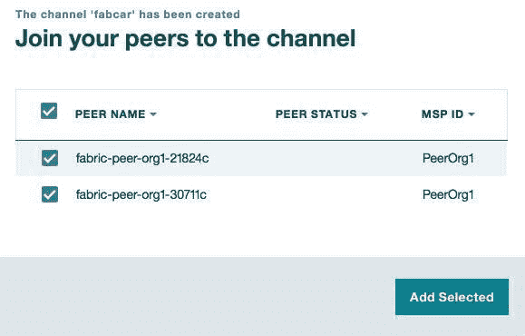

# 将一个样本应用程序部署到 IBM Blockchain Platform

> 原文：[`developer.ibm.com/zh/tutorials/cl-deploy-sample-application-ibm-blockchain-platform/`](https://developer.ibm.com/zh/tutorials/cl-deploy-sample-application-ibm-blockchain-platform/)


获取最佳免费工具、培训和社区资源的每月集萃，帮助您开始使用区块链。
**[最新一期](http://ibm.biz/blockchain-newsletter)** | **[订阅](http://ibm.biz/blockchain-newsletter-signup)**

在本教程中，将了解如何在 IBM Blockchain Platform 上创建一个网络，在该网络的一个通道中安装智能合约（链代码），并将一个样本应用程序部署到该网络。您将了解如何填充共享账本，以及如何从本地客户端应用程序执行调用来查询和更新账本，与它进行通信。

[IBM Blockchain Platform](https://www.ibm.com/blockchain/platform/) 以前称为 High Security Business Network (HSBN)，是一个在 IBM Cloud 上运行的全面集成、企业就绪的服务。该平台是为加速多机构业务网络的开发、治理和运作而设计的。

本教程中使用的样本应用程序是一个名为“fabcar”的 Hyperledger Fabric 样本，尽管您可以[在 Docker 容器中本地运行它](https://hyperledger-fabric.readthedocs.io/en/latest/write_first_app.html)，但在本教程中，您将了解如何将该应用程序安装到 IBM Cloud 上的 IBM Blockchain Platform 上并运行它。[Hyperledger](https://www.hyperledger.org/) 是 The Linux Foundation 主办的一个全球性的开源协作项目，旨在促进跨行业区块链技术的发展。[Hyperledger Fabric](https://www.hyperledger.org/projects/fabric) 是一个 Hyperledger 项目和框架实现，它的模块化架构为 IBM Blockchain Platform 提供了助力。

## 在 IBM Blockchain Platform 上创建一个网络

##### 未使用过 Enterprise Membership Plan？

没关系！您可以从我们的在线样本入手，[**免费设计区块链应用程序的原型**](https://developer.ibm.com/blockchain/sandbox/)。在一个完整开发环境中进行本地开发和测试。以后，您可以共享您的区块链应用程序，以便在 IBM Cloud 上进行协作开发。

了解[**立刻开始使用区块链的更多方式**](https://developer.ibm.com/dwblog/2017/getting-going-blockchain/)。

要完成本教程，您需要一个 [IBM Cloud 帐户](https://console.bluemix.net/) 并付费订阅 IBM Blockchain Platform 的 [Enterprise Membership Plan](https://console.bluemix.net/catalog/services/blockchain)，后者允许您在生产环境中激活区块链网络。*请注意，该平台经常更新，本教程中的屏幕截图与您看到的屏幕可能并不完全相同。*

1.  首先打开 [Rapidly build with IBM Blockchain Platform](https://console.bluemix.net/developer/blockchain/) 页面，选择 **Service Plans**。然后单击 **Upgrade**（如果已有一个 IBM Cloud 试用帐户）或 **Create**（如果没有 IBM Cloud 试用帐户）。现在您可以看到欢迎屏幕。单击 **Create Network** 查看您的网络的仪表板。

    

2.  现在您可以看到 Create Network 向导。在该向导中填入信息。

    

3.  在下一页上，可以通过添加受邀成员的机构名称和电子邮箱地址来邀请他们。但是，在本教程中，不需要邀请任何成员；您可以直接单击 **Next**。在下一页上，单击 **Next** 来接受默认的治理规则和策略。在最后一页上，可以检查您提供的细节的摘要并单击 **Done**。
4.  完成上述操作后，您会看到一个摘要页面；单击 **Enter Network** 获得您刚创建的区块链网络和资源的概述。

    

5.  单击 Overview 页面上的 **Add Peers**，添加一些对等节点。对于本教程，添加两个对等节点就足够了。

    

6.  对等节点会立刻出现在 Overview 页面上。

    

## 创建一个通道

##### 术语表

如果遇到任何不熟悉的术语，请查阅 [Hyperledger Fabric 术语表](http://hyperledger-fabric.readthedocs.io/en/latest/glossary.html )。

下一步是创建一个名为“fabcar”的通道。***通道***是对区块链网络中的一些选定对等节点的逻辑分组。通道允许与之关联的对等节点查看彼此的交易，但通道外的对等节点无法看到这些交易。通道在对等节点间提供了一定程度的交易隐私和安全保护。根据业务需求，每个通道可以拥有相同或不同的经过实例化的链代码。

1.  在区块链网络中，单击左侧的 **Channels** 选项卡，并选择 **Create Channel** 。输入通道名称 `fabcar`，然后单击 **Next**。

    

2.  为每个成员分配一个角色并单击 **Next**。确保在这一步中选择了所有选项。

    

3.  检查通道更新策略并单击 **Submit Request**。

    

4.  您会在 **Notifications** 选项卡中发现一个通知。选择 Channel Request 复选框并单击 **Review Request**。

    

5.  检查通道策略和成员。单击 **Accept** 接受通道邀请。

    

6.  在 **Notifications** 选项卡上，选择该通道并单击 **Submit Request**。

    

7.  选择 **Channels** 选项卡并单击 **Submit**。

    

8.  单击 **Channels** 选项卡上的 **Join Peers**。

    

9.  选择应该加入此通道的对等节点。单击 **Add Selected**。

    

10.  现在可以看到已创建的通道。

    

## 在通道上安装链代码

创建通道后，下一步是安装链代码。我们将使用来自“fabcar”样本应用程序的链代码。

1.  要获取该链代码，可按照 [“Getting a Test Network”操作说明](https://hyperledger-fabric.readthedocs.io/en/latest/write_first_app.html)进行操作，或者对此存储库执行 `git clone`：

    `git clone https://github.com/hyperledger/fabric-samples.git`

2.  要安装该链代码，请选择 **Chaincode** 选项卡，选择一个对等节点，并单击 **Install chaincode**。输入“fabcar”作为链代码名称，输入“v3”作为链代码的版本，并单击 **Choose Files**，从您从 GitHub 下载的 fabric-samples/chaincode/fabcar 文件夹中选择 fabcar.go 链代码文件。单击 **Submit**。

    

3.  链代码现在已安装在对等节点上。

    

4.  下一步是通过在链代码上调用 `init` 方法，在一个通道上实例化该链代码。在这一步中，不需要任何参数，所以可以仅选择 fabcar 通道，并将 arguments 字段留空。

    

5.  实例化的链代码将类似于：

    

6.  在通道上实例化链代码后，选择 Channels side 选项卡并选择 **Chaincode** 选项。然后可以在 fabcar 下看到 3 个按钮：

    *   **JSON**：这个 JSON 文件包含区块链网络的凭证和对等节点信息。
    *   **Logs**：所有链代码日志都会输出到这里。
    *   **Delete**：此按钮可以删除/停止链代码实例。

    

    在 fabric-samples/fabcar 文件夹中，创建一个名为 config 的新文件夹。单击 **JSON** 按钮，一个新选项卡将会打开。将此选项卡中显示的所有数据都复制到一个名为 blockchain_creds.json 的新文件中，并将此文件保存到 config 文件夹中。

## 配置您的应用程序以使其在 IBM Blockchain Platform 上运行

要在 IBM Blockchain Platform 上运行您的应用程序，需要对 fabcar 样本执行一些更改。

首先将 [extractCerts.js](https://www.ibm.com/developerworks/cloud/library/cl-deploy-sample-application-ibm-blockchain-platform/extractCerts.js) 和 [enrollUser.js](https://www.ibm.com/developerworks/cloud/library/cl-deploy-sample-application-ibm-blockchain-platform/enrollUser.js) 文件复制到 fabcar 文件夹 fabric-samples/fabcar 的根目录中。

### 运行 npm install

从 fabcar 文件夹运行 `npm install`：

```
cd fabric-samples/fabcar
npm install 
```

在 Windows 上，如果遇到错误，可能需要安装 Windows Build Tools：

`npm install --global windows-build-tools`

### 提取证书

在 IBM Blockchain Platform 中，传输层安全性 (TLS) 已启用，因此您需要提取该服务所提供的 TLS 证书，以便可以按照以下这些步骤建立一个连接。

在 fabcar 目录中创建一个名为 network 的目录，然后运行 extractCerts.js，如下所示。这将在给定路径中创建一个 CA 证书和一个对等节点证书，或者默认情况下在 fabcar 目录内的 ./network/tls 文件夹中创建它们。默认情况下，将会从 fabcar 目录内的 /config/blockchain_creds.json 获取输入。

```
node extractCerts.js

或

node extractCerts.js --input= /config/blockchain_creds.json --cert_path=./network/tls 
```

除了创建证书文件之外，该命令还会输出一个 EnrollId、一个 EnrollSecret 和一个 CA_URL，以供下一步使用。它还会输出 3 个 URL，供接下来注册用户（peer-url、peer-event-url 和 orderer-url）使用。

### 注册用户

使用上一节中的 EnrollId、EnrollSecret 和 CA_URL，运行以下命令。该命令将在给定钱包路径中为所提供的用户创建一个证书。

```
node enrollUser.js --wallet_path=./network/creds --user_id=admin --user_secret=secret --ca_url=https://fft-zbcxxx.4.secure.blockchain.ibm.com:15185 
```

### 初始化链代码

在查询和更新账本之前，需要运行一个设置事务，以便在账本中填充一些样本数据。复制 fabric-samples/fabcar 文件夹中的 invoke.js 文件，并将副本命名为 invokeNetwork.js。确保该副本与原始文件在同一个文件夹中。然后对 `invokeNetwork.js` 命令执行以下更改。

1.  将下面这个 `require` 参数添加到 `util` 变量下。

    ```
    var fs = require("fs") 
    ```

2.  修改 `options` 变量，如下所示。确保您已将 `peer_url`、`event-url` 和 `orderer-url` 字段更新为运行上面的 `extractCerts.js` 所返回的值。

    ```
    var options = {
        wallet_path: path.join(__dirname, './network/creds'),
        user_id: 'admin',
        channel_id: 'fabcar',
        chaincode_id: 'fabcar',
        peer_url: '<peer_url>',
        event_url: '<peer-event-url>',
        orderer_url: '<orderer-url>',
        tls_cert: {
            pem: fs.readFileSync(path.join(__dirname, './network/tls') + '/peer.cert').toString(),
        }
    }; 
    ```

3.  要启用 TLS，请将此代码：

    ```
    var peerObj = client.newPeer(options.peer_url); 
    ```

    替换为：

    ```
    var peerObj = client.newPeer(options.peer_url, {
        pem: options.tls_cert.pem
    }); 
    ```

4.  将此代码：

    ```
    channel.addOrderer(client.newOrderer(options.orderer_url)); 
    ```

    替换为：

    ```
    channel.addOrderer(client.newOrderer(options.orderer_url, {
        pem: options.tls_cert.pem
    })); 
    ```

5.  将此代码：

    ```
    eh.setPeerAddr(options.event_url); 
    ```

    替换为：

    ```
    eh.setPeerAddr(options.event_url, {
        pem: options.tls_cert.pem
    }); 
    ```

6.  最后，将 `request` 变量中的 `fcn` 字段的值从 `createCar` 更改为 `initLedger`，并将 `args` 设置为一个空数组。 更改后的 request 变量现在应该类似于：

    ```
    var request = {
            targets: targets,
            chaincodeId: options.chaincode_id,
            fcn: 'initLedger',
            args: [''],
            chainId: options.channel_id,
            txId: tx_id
    }; 
    ```

7.  现在保存该文件，并使用 `node invokeNetwork.js` 运行新命令。预期输出为：

    ```
    ...
    Successfully sent transaction to the orderer. 
    ```

### 查询账本

`invokeNetwork.js` 命令现在已在账本中填充了一些样本数据，让我们查询该账本来查看这些数据。复制 fabric-samples/fabcar 文件夹中的 query.js 文件，并将副本命名为 queryNetwork.js。确保该副本与原始文件在同一个文件夹中。然后对 `queryNetwork.js` 命令执行以下更改。

1.  将下面这个 `require` 参数添加到 `path` 变量下。

    ```
    var fs = require("fs") 
    ```

2.  修改 `options` 变量，如下所示。确保将 `network_url` 字段值更新为运行上面的 `extractCerts.js` 所返回的 `peer_url` 值。

    ```
    var options = {
        wallet_path: path.join(__dirname, './network/creds'),
        user_id: 'admin',
        channel_id: 'fabcar',
        chaincode_id: 'fabcar',
        network_url: '<peer_url>',
        tls_cert: {
            pem: fs.readFileSync(path.join(__dirname, './network/tls') + '/peer.cert').toString(),
        }
    }; 
    ```

3.  将此代码：

    ```
    channel.addPeer(client.newPeer(options.network_url)); 
    ```

    替换为：

    ```
    channel.addPeer(client.newPeer(options.network_url, {
        pem: options.tls_cert.pem
    })); 
    ```

    现在保存该文件，并使用 `node queryNetwork.js` 运行新命令。 预期输出为：

    ```
    ...
    Query result count =  1
    Response is  [{"Key":"CAR0","Record":{"make":"Toyota","model":"Prius","colour":"blue","owner":"Tomoko"}},{"Key":"CAR1","Record":{"make":"Ford","model":"Mustang","colour":"red","owner":"Brad"}},{"Key":"CAR10","Record":{"make":"","model":"","colour":"","owner":"Tom"}},{"Key":"CAR11","Record":{"make":"Honda","model":"Accord","colour":"Black","owner":"yog"}},{"Key":"CAR12","Record":{"make":"Honda","model":"Accord","colour":"Black","owner":"Tom"}},{"Key":"CAR2","Record":{"make":"Hyundai","model":"Tucson","colour":"green","owner":"JinSoo"}},{"Key":"CAR3","Record":{"make":"Volkswagen","model":"Passat","colour":"yellow","owner":"Max"}},{"Key":"CAR4","Record":{"make":"Tesla","model":"S","colour":"black","owner":"Adriana"}},{"Key":"CAR5","Record":{"make":"Peugeot","model":"205","colour":"purple","owner":"Michel"}},{"Key":"CAR6","Record":{"make":"Chery","model":"S22L","colour":"white","owner":"Aarav"}},{"Key":"CAR7","Record":{"make":"Fiat","model":"Punto","colour":"violet","owner":"Pari"}},{"Key":"CAR8","Record":{"make":"Tata","model":"Nano","colour":"indigo","owner":"Valeria"}},{"Key":"CAR9","Record":{"make":"Holden","model":"Barina","colour":"brown","owner":"Shotaro"}}] 
    ```

### 更新账本

最后，让我们对账本执行一次更新。为此，您可以对上面创建的新 `invokeNetwork.js` 命令进行另一次简单更改。

1.  编辑 `request` 变量，如下所示，以便使用一组描述要创建的车辆的参数来调用 `createCar` 链代码。更改后的 request 变量应该类似于：

    ```
    var request = {
            targets: targets,
            chaincodeId: options.chaincode_id,
            fcn: 'createCar',
            args: ['CAR11', 'Honda', 'Accord', 'Black', 'Tom'],
            chainId: options.channel_id,
            txId: tx_id
    }; 
    ```

2.  保存文件，并使用 `node invokeNetwork.js` 运行该命令。预期输出为：

    ```
    ...
    Successfully sent transaction to the orderer. 
    ```

    此命令已创建了一辆车主为”Tom”的新车，并将它存储在账本上。可以再次运行 `queryNetwork.js` 命令来查看账本上的新车。现在可以做一些试验，使用不同的姓名和车主在账本上创建新车。

3.  最后，您可能想试验 `changeOwner` 链代码来更改一辆车的车主。为此，再次更改 invokeNetwork.js 中的 `request` 变量，使其类似于：

    ```
    var request = {
            targets: targets,
            chaincodeId: options.chaincode_id,
            fcn: 'changeCarOwner',
            args: ['CAR11', 'MGK'],
            chainId: options.channel_id,
            txId: tx_id
    }; 
    ```

4.  现在保存该文件，并使用 `node invokeNetwork.js` 再次运行该命令。 预期输出为：

    ```
    ...
    Successfully sent transaction to the orderer. 
    ```

5.  可以再次运行 `queryNetwork.js` 命令来查看账本上已更新的车主。可以看到车主已从“Tom”更改为“MGK”。
6.  如果想要查询一辆车而不是所有车，可以对 `queryNetwork.js` 命令中的 `request` 变量执行此更改，并再次运行它：

    ```
    const request = {
            chaincodeId: options.chaincode_id,
            txId: transaction_id,
            fcn: 'queryCar',
            args: ['CAR11']
    }; 
    ```

    您现在应会看到一辆车的信息：

    ```
    ...
    Query result count =  1
    Response is  {"make":"Honda","model":"Accord","colour":"Black","owner":"MGK"} 
    ```

## 结束语

您现在已在 IBM Blockchain Platform 上运行着一个网络，网络上的一个通道中包含样本链代码，还有一个可以轻松使用的正常运行的应用程序。您已在账本中填充了样本应用程序，而且您的应用程序现在可以与 IBM Blockchain Platform 上的区块链进行通信（查询和更新）。祝开发区块链愉快！

### 致谢

感谢 IBM 区块链实验室全球互动团队的 Anthony O’Dowd 和 David Gorman 在本教程的整个开发过程中提供专业指导和支持。

本文翻译自：[Deploy a sample application to the IBM Blockchain Platform](https://developer.ibm.com/tutorials/cl-deploy-sample-application-ibm-blockchain-platform/)（2018-01-25）