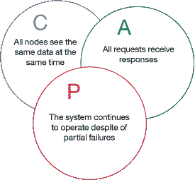
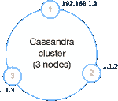
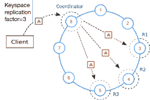
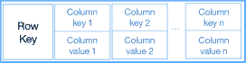
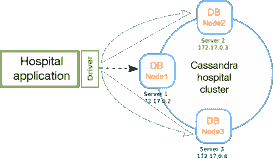
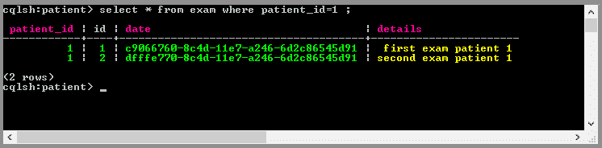

# 建立一个基本 Apache Cassandra 架构

> 原文：[`developer.ibm.com/zh/tutorials/ba-set-up-apache-cassandra-architecture/`](https://developer.ibm.com/zh/tutorials/ba-set-up-apache-cassandra-architecture/)

尽管您听说大数据和 NoSQL 数据库可能已经有一段时间了，但您或许还没有机会开始使用它们。尽管您可能知道 NoSQL 数据库对您的一些项目有所帮助，但您可能对完成任务没有信心。如果是这样，本教程将对您有所帮助。

我将指导您设置一个最酷、灾备能力最强的大数据存储：Apache Cassandra。这篇实践教程适用于具备基本关系数据库知识的开发人员和数据库管理员。我将详细介绍 Cassandra 的主要方面，并提供其他来源供您获取更多信息。

为了测试您的环境设置，我利用了 Cassandra 实用工具和 Python 脚本来使用存储在 Cassandra 中的数据。如果不熟悉这些工具，不必担心，因为您不需要使用它们来完成设置，而是仅使用它们来验证配置并充当附加资源。

## 基本概念

在本节中，我将解释使用 Cassandra 作为分布式数据库的一些内在细节。如果您已经对这些概念有一定的了解，或者您现在对理论不感兴趣，可以跳到构建计划部分。

### CAP 定理

*CAP* 代表“一致性、可用性和分区容错性”。CAP 定理由 Eric Brewer 在 2000 年首次提出，该定理表明，在任何共享数据系统中，最多只能获得这些属性中的两个。所以您必须选择两个属性；不能选择所有属性。我将大体介绍一下该定理，要获取更多信息，请参阅下面的”相关主题”。

CAP 定理与 Cassandra 相关，所以理解该定理很重要，因为它可能帮助您判断 Cassandra 是不是您的 NoSQL 数据库解决方案的最佳选择。在任何情况下，都应该首先考虑您的解决方案在一致性和可用性方面的约束，这很有帮助。

依据 CAP 定理，对于任何分布式系统，都必须为它选择两种最重要的保证（参见图 1）。您可以拥有 Cassandra 中的所有 3 种保证，但 *不能同时拥有* 它们。因此，在您想要获得一个不会宕机且高度可用的数据库，而且不想遭遇偶然的硬件故障时，Cassandra 是专注于可用性和分区容错性的解决方案的最佳选择。

这与传统关系数据库管理系统 (RDBMS)（比如 MySQL、DB2® 、Oracle 和 Sybase）的 *ACID* （原子性、一致性、隔离性、耐久性）属性相反。我并没有暗示在 Cassandra 中没有 *原子* 操作，以及 Cassandra 数据不是 *隔离的* 或 *耐久的* 。我的意思是说，这些不是 Cassandra 的主要关注点。该数据库天生就是分布式的，能随着数据和应用程序事务的增长而轻松扩展。

##### 图 1.CAP 定理的保证与 Cassandra



### 分布式数据库

Cassandra 实质上是一个分布式数据库。这意味着它被设计为在计算机节点网络中以服务器形式运行，不同部分在不同机器上运行，没有任何特定的硬件或软件需要管理或协调。所有节点的协调和数据分布都是在它们自己的架构内完成的。Cassandra 网络之所以比其他常见关系数据库系统更容易水平扩展且更便宜，这就是原因之一。

典型的 Cassandra 网络拓扑结构包含一个节点集群（也称为 Cassandra 环），每个节点在不同物理服务器上的不同网络地址中运行。

##### 图 2.不同网络主机中的节点的 Cassandra 集群



此特性提高了网络在节点发生故障时的可用性。每个节点都可以协调客户端的请求，而不需要主节点，因此没有单点故障。您还能设置不同的配置战略来让数据知道不同节点的位置，从而进一步提高系统可用性。

##### 图 3.包含 8 个节点的 Cassandra 集群收到一个客户端连接，该连接将数据写入一个配置了复制系数 3 的键空间中



所有数据都依据一个哈希算法均匀分布在 Cassandra 环（节点）中，以创建所需的副本（也称为 *复制品* ）数量。复制系数是集群配置的一个重要方面。该系数是通过一个键空间或模式配置来定义的。

关于集群数据、拓扑结构、节点可用性和性能的所有信息都通过 *gossip 协议* （一种对等协议）在节点之间进行交换。可使用此信息向客户端发出关于哪个节点最适合在给定时间写入或读取任何数据的连接建议。

Cassandra 客户端可通过两种协议与服务器进行通信： *CQL 二进制协议* 或一种称为 *thrift* 的 RPC 协议。CQL 二进制协议是一种较新的协议，该协议优先于 thrift。Cassandra 查询语言 (CQL) 是一种类似于 SQL 的语言，Cassandra 使用它创建处理其模式结构和数据（DDL 和 DML）的命令。

### 基本数据结构和建模

Cassandra 的一个重要且有时很难处理的方面是它的数据建模方法。首先，您需要了解如何在其架构内组织它的数据，然后如何建模您的应用程序的数据结构，以便获得其最高性能。

在 Cassandra 中，所有数据都通过一个主键（或行键）按分区进行组织，这使您能访问所有列或键/值对集合，如下图所示。

##### 图 4.Cassandra 数据结构分区



Cassandra 中的主键可以包含两种特殊键： *分区键* 和（可选的） *集群键* 。分区键的用途是将数据均匀分布在集群中。集群键（也称为”集群列”）的职责是集群化某个分区的数据并组织它们，以便实现高效查询。考虑下面这个示例。

当您在 Cassandra 中创建一个表时，您使用了一条与以下命令类似的 CQL 命令：

```
CREATE TABLE movie_catalog (category text, year int, title text,
PRIMARY KEY (category)); 
```

第一列被隐式地视为 `movie_catalog` 表的分区键。没有集群键。但是，假设您在主键中添加了 `year` 列，如下所示：

```
CREATE TABLE movie_catalog (category text, year int, title text,
PRIMARY KEY (category,year)) 
```

现在， `category` 继续作为分区键，而 `year` 列是集群键。两列都是主键的一部分。

如果对此很难理解，不要想太多！要知道的重要一点是，所有 Cassandra 表都必须有一个主键来确定数据位于集群中的哪个节点。该键至少要包含一个分区键。如上所示，用于定位节点（分区）中的数据的集群键也可以是主键的一部分。

要对您的表进行建模，必须小心选择分区键，使 Cassandra 能高效地将数据分布到节点中。将所有应用程序数据（行）放在一个分区中不是一个好主意。出于同样的原因，您还可以拥有 *许多* 分区。因此，您需要在对数据进行分组时找到一个很好的平衡点，以满足您的应用程序需求。

在 Cassandra 中建模的最常用技术称为 *基于查询的建模* 。此方法需要您考虑应用程序用户界面首先发出的查询。然后，您可以根据这些查询对您的表进行建模。该主题可能是后续某篇教程的主题。

## 构建计划

设想您需要为一种关键应用程序架构设计一个数据库层，用于存储一家大型医院的患者检查信息。此系统需要 24×7 正常运行并为许多用户服务。您的第一个关注点是，该数据库必须拥有高可用性，而且必须容错，这样就不会对其用户和医院操作造成不利影响。在下一节，我将介绍一种可能的解决方案。

### 解决方案概述

您决定为测试 (UAT) 环境初步设置一个包含 3 个节点的基本测试集群。然后，在生产中，会将这些节点部署到医院的生产数据中心内的 3 个不同的服务器机器上。

##### 图 5.访问服务器数据库层的医院应用程序（该服务器上运行一个 3 节点 Cassandra 集群）



拥有一个 3 节点集群而不只是一个节点的想法，是为了提高数据库系统的可用性。如果一个节点发生故障，仍有两个节点在运行，可以响应应用程序的所有请求。另外，您可以在高负载的情况下平衡请求负载，在读写数据期间为应用程序提供较低的延迟。

Cassandra 客户端驱动程序可以自动发现所有可用节点，并选择负责写入数据的所有副本的最佳协调节点。所有这些之所以成为可能，是由于 Cassandra 采用了 gossip 协议实现，在对等节点之间交换节点的健康信息。

### 复制系数

下一步是确定您希望对应用程序采用何种复制系数和一致性水平。在此之后，就可以开始安装并配置数据库运行时环境，为您的应用程序创建模式和表了。

在模式定义中，您将复制系数设置为 3。这意味着您将数据库模式（键空间）配置为，在 3 个节点中创建数据的 3 个副本。每当应用程序连接到一个节点并向一个表中插入一个数据项时，该数据项都会自动复制到另外两个节点。这使您能够更加安全可靠地存储数据。

```
CREATE KEYSPACE patient WITH replication = {'class': 'SimpleStrategy',
    'replication_factor' : 3}; 
```

### 一致性水平

您还需要定义在连接一个客户端时，应用程序在读写会话期间使用的一致性水平。这会帮助您确定您对查询与数据状态一致的需求有多强烈。例如，您可能决定为数据的读写设置 *QUORUM 一致性* 水平，这意味着您将强制 Cassandra 在返回请求结果前读写大部分节点（两个节点）的数据。

一致性水平由每个客户端会话定义，可随时更改。例如，在如下所示的 `cqlsh` 客户端 shell 中，在查询前，随时可以采用大部分 Cassandra 驱动程序允许的相同方式测试一致性水平。

```
cqlsh:patient> consistency QUORUM ;
Consistency level set to QUORUM.
cqlsh:patient> 
```

这里对一致性与延迟性能之间进行了权衡。一致性越高，读/写操作所花的时间就越长。在我们的基本集群设置中，这不会造成任何明显的时间差，但它是一个应用于大型 Cassandra 集群的重要概念。您可能正在处理大量数据且仍需快速进行响应。

## 需要做的准备工作

Cassandra 数据库基于 Java™ 平台，所以它可以在许多支持 Java 技术的操作系统中运行，而且只需很少的磁盘空间和可用内存就可以开始工作。对于本教程中描述的应用程序，我推荐以下配置：

*   **最少 2GB 可用 RAM** — 要安装并运行一个 Cassandra 数据库实例，建议机器上至少拥有 4 GB RAM，其中至少 2 GB 可用于该 Cassandra 实例。8GB RAM 机器更好。如果决定在 Docker 上运行 Cassandra 实例，每个容器至少必须有 1 GB RAM 可用来运行每个 Cassandra 节点。
*   **Java 8** — 自 Apache Cassandra V3 版本开始，您需要在机器上安装 Java Standard Edition 8，因为 Cassandra 在 Java 虚拟机 (JVM) 上运行。旧 Cassandra 版本（比如 V2.2）可以使用 Java 7 运行。您可以在操作系统提示 shell 中键入

    `java -version`

    来检查您的 Java 版本。

*   **Python 2.7** — 如果您想要使用 Cassandra 节点管理工具 `nodetool` 和 shell 实用工具 `cqlsh`_ ，则需要安装 Python。这些工具对获取关于 Cassandra 实例及其数据库的信息并对它们进行管理很有用。可以键入

    `python --version` 来检查您安装了哪个 Python 版本。

*   **Docker CE** — 如果您想在同一个机器上运行的容器上配置所有 Cassandra 节点，可以选择此产品。我建议使用它创建一个测试集群环境。如果您不熟悉 Docker 容器，不用担心。下面，我将介绍设置 Cassandra 集群所需的命令。从 [Docker 网站](https://www.docker.com/community-edition) 下载适合您的平台的最新 Docker CE 版本。

## 安装

可以选择从 [Cassandra 网站](http://cassandra.apache.org/) 手动安装或通过 Docker 容器自动安装 Cassandra。如果选择使用 Docker 容器来创建 Cassandra 集群，可以跳过”下载包”部分。

### 下载包

如果使用 Linux，您可以找到一个适合您的安装的特定包，但在大部分情况下，都将从最新可用版本（截至编写本文时为 V3.11）下载一个压缩的 tar.gz 文件。

1.  完成下载后，使用 TAR 实用工具（或类似工具）解压该包：

    ```
    $ tar -xvf apache-cassandra-3.11.0-bin.tar.gz 
    ```

2.  将文件内容提取到任何期望位置。在提取文件内容后，创建一个 apache-cassandra-3.11.0 目录，其中包含所有 Cassandra 二进制文件、配置文件、文档文件、库和实用工具，比如：

    ```
    $ ls
    CHANGES.txt  LICENSE.txt  NEWS.txt  NOTICE.txt  bin  conf  doc  interface  javadoc  lib  pylib  tools 
    ```

## 配置

本节将介绍如何手动设置第一个 Cassandra 节点。如果使用的是 Docker，您可能仍想阅读本节来了解主要的 Cassandra 配置参数。否则，请跳到”使用 Docker 设置一个测试集群 ”。

所有 Cassandra 主要配置都放在 conf 目录中的 cassandra.yaml 文件中。

### 配置参数

编辑 cassandra.yaml 文件来更改以下基本参数：

*   `cluster_name` — 此参数标识了包含 3 个节点的 Cassandra 集群的名称。一定要注意，所有节点配置都有相同的名称。

    `cluster_name: 'Hospital Test Cluster'`

*   `seeds` — 集群的主要节点的 IP 网络地址或主机名列表。对于测试集群，将会设置第一个节点的 IP 地址。

    `seeds: "127.0.0.1"`

*   `listen_address` — 客户端和其他节点连接到此节点所用的节点主机名。不要使用 localhost（如此处所示），而是设置网络上的机器所使用的真实主机名。

    `listen_address: localhost`

*   `native_transport_port` — 客户端连接到此节点所用的节点 TCP 端口号。确保使用了一个未遭到防火墙拦截的端口。默认端口为 9042。

    `native_transport_port: 9042`

要为此实例设置基本的身份验证和授权配置，需要更改以下这些可选的附加参数：

*   `authenticator` — 启用用户的身份验证。您需要更改此参数，以便要求用户在连接到集群时提供用户名和密码。

    `authenticator: PasswordAuthenticator`

*   `authorizer` — 启用用户的授权并限制他的权限。如果更改此参数，则需要增加 `system_auth` 键空间复制系数，以便在其他节点中创建授权数据的其他副本，防止节点不可用。

    `authorizer: CassandraRoleManager`

### 手动启动第一个节点

现在已经设置了所有配置，您可以运行位于 bin 目录内的 Cassandra 脚本，如下所示。 `-f` 选项将所有引导日志都输出到前台。在首次启动时，可以使用该选项来检查 Cassandra 启动期间的错误。

```
$ bin/cassandra -f 
```

如果在初始化几秒后看到以下日志信息，则表明 Cassandra 节点在正常运行并准备好接收客户端连接。

```
INFO  [main] 2017-08-20 18:04:58,329 Server.java:156 - Starting listening for CQL
    clients on localhost/127.0.0.1:9042 (unencrypted)... 
```

要仔细检查节点状态，可以使用 bin 目录中的 `nodetool` 实用工具。该工具可以为您提供有关 Cassandra 集群和节点的信息。要检查集群状态，只需发出以下命令：

```
$ nodetool status 
```

以下命令将会输出关于集群的信息，包括运行该集群的数据中心名称（在本例中为默认配置）和集群的每个节点成员的状态：

```
Datacenter: datacenter1
=======================
Status=Up/Down
|/ State=Normal/Leaving/Joining/Moving
--  Address    Load       Tokens       Owns (effective)  Host ID                               Rack
UN  127.0.0.1  103.67 KiB  256          100.0%            6aae6c1f-cf06-4874-9507-a43025c312d1  rack1 
```

IP 地址前面的 `UN` 字母表示节点在正常 (N) 运行 (U)。首次启动后，将会分别创建 data 和 logs 目录来存储所有键空间/表数据和日志。

如果不想使用 Docker 容器，可以重复以上步骤来创建其他节点。记得使用第一个节点的 IP 地址作为其他节点的种子配置。如果想要使用 Docker 容器，请执行接下来的步骤。

### 使用 Docker 设置一个测试集群

除了在不同的物理服务器机器中安装和配置 Cassandra 外，还可以使用 Docker 容器创建在同一个测试服务器机器上运行的 3 节点集群。确保您有足够的 RAM 来运行 3 个 Cassandra 实例。否则，可以试着将节点数量减少至 2 个。

如果在测试机器中安装了 Docker，可以使用 Docker Hub 提供的官方映像。要下载、安装并运行 Cassandra 3.11，可以输入以下 Docker 命令：

```
docker run --name node1 -d cassandra:3.11 
```

此命令在网络上的 Docker Hub 注册表中搜索一个名为 `cassandra` 、版本标签为 `3.11` 的映像。然后下载该映像，创建并启动一个名为 `node1` 的容器。之前已采用默认 Cassandra 配置对这个容器进行了配置，默认配置类似于上述配置。

您可以使用 `docker ps` 命令检查新容器是否在正常运行：

```
$ docker ps
CONTAINER ID        IMAGE               COMMAND                  CREATED              STATUS              PORTS                                         NAMES
803135731d1a        cassandra:3.11      "/docker-entrypoint.s"   About a minute ago   Up About a minute   7000-7001/tcp, 7199/tcp, 9042/tcp, 9160/tcp   node1 
```

现在，可以启动其他实例，向每个新节点告知第一个节点的位置。可以使用 `CASSANDRA_SEEDS` 环境变量更改新节点的种子节点 IP 地址来实现此操作。这会自动更改在容器内创建的新节点的 cassandra.yaml 文件内的种子配置。要创建并启动第二个节点容器 (`node2`)，请输入以下命令：

```
$ docker run --name node2 -d -e CASSANDRA_SEEDS="$(docker inspect --format='{{
    .NetworkSettings.IPAddress }}' node1)" cassandra:3.11 
```

要确定您的集群中有多少个节点，可以在 `node1` 容器内执行 `nodetool` 实用工具：

```
$ docker exec -it node1 nodetool status 
```

此命令显示了目前配置的集群中每个节点的状态，所以预期结果类似于以下结果：

```
Datacenter: datacenter1
=======================
Status=Up/Down
|/ State=Normal/Leaving/Joining/Moving
--  Address     Load       Tokens       Owns (effective)  Host ID                               Rack
UN  172.17.0.3  103.25 KiB  256          100.0%            f1bbd4d1-8930-45a3-ba43-4a2416617c7f  rack1
UN  172.17.0.2  108.64 KiB  256          100.0%            bec1b022-a397-4401-bd42-676c60397fe1  rack 
```

如果 `node2` 已成功启动，您可以采用相同方式创建第三个节点 (`node3`)。当所有 3 个节点都运行后，转到下面的”测试 ”部分。如果出于某种原因， `node2` 未能启动，可继续执行这里的故障排除过程。

#### 排除 Docker 上的集群的故障

如果某个节点没有正确启动，请检查 Cassandra 日志：

```
$ docker logs node2 
```

如果看到类似 “`Unable to gossip with any seeds` ” 的错误消息，则需要按照以下说明添加一个参数。否则，请转到”测试 ”部分。

1.  要添加必要的参数，首先使用 Docker `inspect` 命令捕获 `node1` 的 IP 地址：

    ```
    $ docker inspect --format='{{ .NetworkSettings.IPAddress }}' node1 
    ```

2.  让我们假设返回的 IP 地址为 172.17.0.2。运行以下命令以停止并删除 `node1` 容器，然后使用公开的 gossip 广播地址和端口参数重新创建它：

    ```
    $ docker stop node1
    $ docker rm node1
    $ docker run --name node1 -d -e CASSANDRA_BROADCAST_ADDRESS=172.17.0.2 -p 7000:7000 cassandra:3.11 
    ```

3.  然后，重用 `node1` 地址作为种子节点，使用广播 IP 地址 172.17.0.3 创建 `node2` ：

    `$ docker run --name node2 -d -e CASSANDRA_BROADCAST_ADDRESS=172.17.0.3 -p 7001:7000 -e CASSANDRA_SEEDS=172.17.0.2 cassandra:3.11`此配置允许这两个节点通过 7000 和 7001 容器端口相互广播 7000 端口中配置的 gossip 协议信息。

4.  接下来，使用 `docker ps` 检查两个 Docker 进程是否正在运行。然后再次使用 `nodetool` 实用工具确认集群的状态：

    ```
    $ docker exec -it node1 nodetool status
    Datacenter: datacenter1
    =======================
    Status=Up/Down
    |/ State=Normal/Leaving/Joining/Moving
    --  Address     Load       Tokens       Owns (effective)  Host ID                               Rack
    UN  172.17.0.3  108.29 KiB  256          100.0%            fd135375-711a-471a-b4e5-409199bbaaa5  rack1
    UN  172.17.0.2  108.66 KiB  256          100.0%
        5db97fc3-70e9-48e5-b63b-0be67e35daea  rack1 
    ```

#### 容器环境变量

要更改 Docker 容器内的默认 Cassandra 集群名称配置，可以使用容器环境变量。

运行某个 Cassandra Docker 映像时，可以在 Docker `run` 命令行上使用 `-e` 选项传递一个或多个环境变量来设置特定于 Cassandra 的配置。该映像将会使用这些变量来更改容器内的 Cassandra 参数。要获取更多信息，请参阅 Docker Hub 上的 [Cassandra 镜像文档](https://hub.docker.com/r/library/cassandra/) 。

## 测试

测试集群配置的第一步是使用 CQL shell 实用工具 (`cqlsh`) 连接它。这是一个 Python 命令行脚本，用于创建一个可连接到任何集群主机的客户端。您需要做的就是发出 `cqlsh` 命令。默认情况下，该脚本会尝试连接到某个在 localhost 上运行的实例。可以传递 `host` 参数来更改主机。请参阅 `cqlsh` 帮助来获取有关细节 (`cqlsh --help`)。

### CQL shell 工具

如果使用 Docker，可以在容器内执行 `cqlsh` ：

```
$ docker exec -it node1 cqlsh
Connected to Test Cluster at 127.0.0.1:9042.
[cqlsh 5.0.1 | Cassandra 3.11.0 | CQL spec 3.4.4 | Native protocol v4]
Use HELP for help.
cqlsh> 
```

这个 shell 允许您发出类似 SQL 的 CQL 命令，创建并定义您的键空间（模式）、表并处理数据。可以在 [Cassandra 文档](http://cassandra.apache.org/doc/latest/cql/index.html) 中找到更多信息。

### 创建测试键空间

让我们创建第一个键空间来存储所有患者检查信息：

1.  发出 CQL 命令 `CREATE KEYSPACE` 来创建患者模式。

    ```
    cqlsh> CREATE KEYSPACE patient WITH replication = {'class': 'SimpleStrategy', 'replication_factor' : 3}; 
    ```

2.  现在，您可以访问所创建的键空间，创建第一个表来存储检查数据。创建表的 CQL 命令类似于 SQL DDL 命令：

    ```
    CREATE TABLE patient.exam (
    patient_id int,
    id int,
    date timeuuid,
    details text,
    PRIMARY KEY (patient_id, id)); 
    ```

    上面的命令创建了一个表，该表的主键由患者的 ID 和检查 ID 组成。

### 插入数据

1.  现在，您已拥有所创建的键空间的结构，插入 3 个患者的一些样本数据：

    ```
    INSERT INTO exam (patient_id,id,date,details) values (1,1,now(),'first exam patient 1');
    INSERT INTO exam (patient_id,id,date,details) values (1,2,now(),'second exam patient 1');
    INSERT INTO exam (patient_id,id,date,details) values (2,1,now(),'first exam patient 2');
    INSERT INTO exam (patient_id,id,date,details) values (3,1,now(),'first exam patient
        3'); 
    ```

2.  接下来，运行一个测试查询来采集患者 1 的所有检查数据：

    ```
    cqlsh:patient> select * from exam where patient_id=1; 
    ```

##### 图 6.对患者 1 执行查询



### 测试集群

现在是时候测试集群可用性、一致性和分区容错性了。如果为患者键空间配置了复制系数 3，那么任何写入 exam 表的数据都会在 3 个节点中有一个副本。

#### 节点复制测试

可以将数据插入 `node1` 中并在 `node3` 上查询，因为写入 `node1` 的数据会自动复制到 `node2` 和 `node3` ，查询可以确认数据有 3 个副本。要测试在 `node1` 上插入了一个患者，从而确定 `node3` 上是否有他的信息，可以输入以下命令：

```
$ docker exec -it node1 cqlsh
Connected to Test Cluster at 127.0.0.1:9042.
[cqlsh 5.0.1 | Cassandra 3.11.0 | CQL spec 3.4.4 | Native protocol v4]
Use HELP for help.
cqlsh> INSERT INTO patient.exam (patient_id,id,date,details) values (9,1,now(),'first exam patient 9');
cqlsh> quit;
$ docker exec -it node3 cqlsh
Connected to Test Cluster at 127.0.0.1:9042.
[cqlsh 5.0.1 | Cassandra 3.11.0 | CQL spec 3.4.4 | Native protocol v4]
Use HELP for help.
cqlsh> select * from patient.exam where patient_id=9;
 patient_id | id | date                                 | details
------------+----+--------------------------------------+----------------------
          9 |  1 | 9cf570b0-8e9d-11e7-a592-6d2c86545d91 | first exam patient 9
(1 rows) 
```

#### 节点故障测试

现在停止 `node2` 和 `node3` 节点，然后将患者数据插入 `node1` 中。再次启动 `node2` 和 `node3` ，查看插入 `node1` 中的数据是否已复制到不可用的 node2 和 node3。

```
$ docker stop node2
$ docker stop node3
$ docker exec -it node1 cqlsh
Connected to Test Cluster at 127.0.0.1:9042.
[cqlsh 5.0.1 | Cassandra 3.11.0 | CQL spec 3.4.4 | Native protocol v4]
Use HELP for help.
cqlsh> INSERT INTO patient.exam (patient_id,id,date,details) values (10,1,now(),'first exam patient 10');
cqlsh> quit;
$ docker start node2
$ docker start node3
$ docker exec -it node3 cqlsh
Connected to Test Cluster at 127.0.0.1:9042.
[cqlsh 5.0.1 | Cassandra 3.11.0 | CQL spec 3.4.4 | Native protocol v4]
Use HELP for help.
cqlsh> select * from patient.exam where patient_id=10;
 patient_id | id | date                                 | details
------------+----+--------------------------------------+-----------------------
         10 |  1 | 76439070-8f04-11e7-a592-6d2c86545d91 | first exam patient 10
(1 rows) 
```

#### 节点一致性测试

如果想要获得强读取一致性，必须将一致性水平设置为 `QUORUM` ，以便让任何查询都会在至少两个可用节点上检查数据。

```
$ docker stop node1
node1
$ docker stop node2
node2
$ docker exec -it node3 cqlsh
Connected to Test Cluster at 127.0.0.1:9042.
[cqlsh 5.0.1 | Cassandra 3.11.0 | CQL spec 3.4.4 | Native protocol v4]
Use HELP for help.
cqlsh> select * from patient.exam where patient_id=10;
 patient_id | id | date                                 | details
------------+----+--------------------------------------+-----------------------
         10 |  1 | 76439070-8f04-11e7-a592-6d2c86545d91 | first exam patient 10
(1 rows)
cqlsh> consistency quorum
Consistency level set to QUORUM.
cqlsh> select * from patient.exam where patient_id=10;
NoHostAvailable: 
```

在本例中，必须让大部分节点（2 个）正常运行，否则查询将会失败。这是一种权衡。如果想要获得更高的可用性和更强的一致性，必须在集群中拥有更多节点，才能在节点发生故障时继续运行。如果将一致性水平设置为 `ONE` ，您的查询将成功，因为您连接的 `node3` 上有一个本地副本。

```
cqlsh> consistency one
Consistency level set to ONE.
cqlsh> select * from patient.exam where patient_id=10;
 patient_id | id | date                                 | details
------------+----+--------------------------------------+-----------------------
         10 |  1 | 76439070-8f04-11e7-a592-6d2c86545d91 | first exam patient 10
(1 rows)
cqlsh> quit; 
```

如果再次启动 `node1` ，您将拥有大部分节点，满足 QUORUM 一致性水平，该查询将不再失败。

```
$ docker start node1
node1
$ docker exec -it node3 cqlsh
Connected to Test Cluster at 127.0.0.1:9042.
[cqlsh 5.0.1 | Cassandra 3.11.0 | CQL spec 3.4.4 | Native protocol v4]
Use HELP for help.
cqlsh> consistency quorum
Consistency level set to QUORUM.
cqlsh> select * from patient.exam where patient_id=10;
 patient_id | id | date                                 | details
------------+----+--------------------------------------+-----------------------
         10 |  1 | 76439070-8f04-11e7-a592-6d2c86545d91 | first exam patient 10
(1 rows) 
```

如果检查您的节点状态，就可以看到有两个节点在运行 (UN)，一个节点已关闭 (DN)。

```
$ docker exec -it node3 nodetool status
Datacenter: datacenter1
=======================
Status=Up/Down
|/ State=Normal/Leaving/Joining/Moving
--  Address     Load       Tokens       Owns (effective)  Host ID                               Rack
DN  172.17.0.3  306.19 KiB  256          100.0%            fd135375-711a-471a-b4e5-409199bbaaa5  rack1
UN  172.17.0.2  365.72 KiB  256          100.0%            5db97fc3-70e9-48e5-b63b-0be67e35daea  rack1
UN  172.17.0.4  285.42 KiB  256          100.0%            4deb44f8-9253-4bff-b74b-239085e3a912  rack1 
```

还可以通过更多节点来探索其他测试场景，比如延迟测试或负载平衡测试，确认前面介绍的 Cassandra 分布式集群的特征。

## 结束语

在本教程中，我的目标是指导您完成 Cassandra 集群的基本安装和配置，并解释它的最重要特征。另外，我尝试提供了一些动手实践来帮助您更加熟悉这种 NoSQL 数据库。如果您的需求与 Cassandra 的特性相符，或许您现在应该准备好启动您的项目并使用 Cassandra。

还有其他一些细节没有介绍，比如针对不同数据集和管理任务的建模技术，以及如何通过调优获得更高性能。另外，处理与开发相关的客户端驱动程序还涉及其他许多方面，这些方面不属于本教程的讨论范围。这些方面可能会在未来的教程中进行介绍。与此同时，要进一步了解 Cassandra，推荐您参阅以下两个信息来源：Apache Cassandra 官方网站和 DataStax 文档网站。请参阅下面的”相关主题”。

本文翻译自：[Set up a basic Apache Cassandra architecture](https://developer.ibm.com/tutorials/ba-set-up-apache-cassandra-architecture/)（2017-11-08）