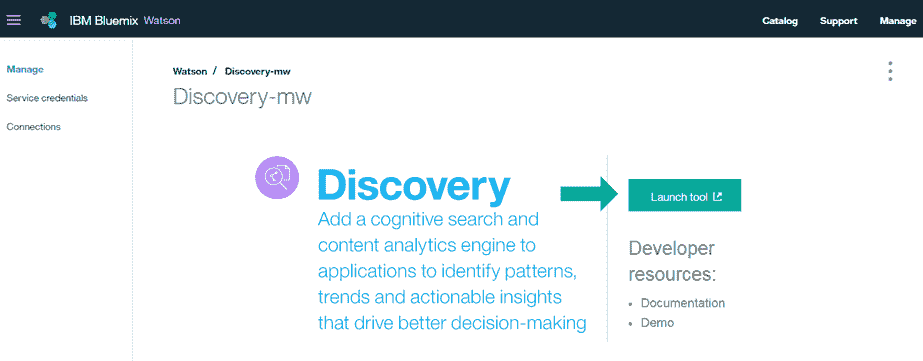
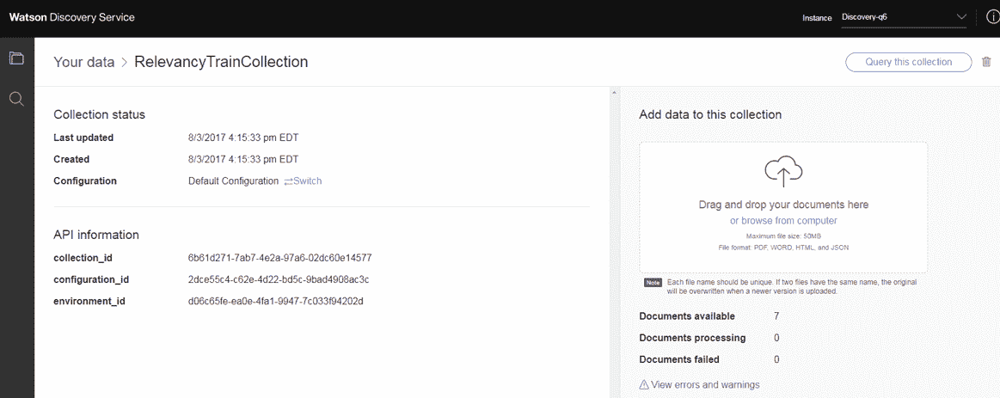
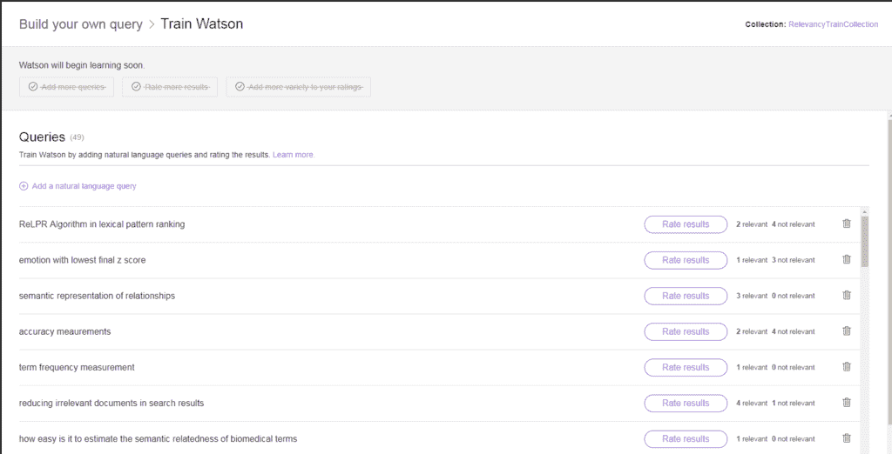

# 指导 Watson 呈现哪些结果

> 原文：[`developer.ibm.com/zh/tutorials/cc-cognitive-watson-relevancy-training/`](https://developer.ibm.com/zh/tutorials/cc-cognitive-watson-relevancy-training/)

最近，IBM Watson Discovery 服务引入了一个名为 Relevancy Training 的新功能。Relevancy Training 可用于指导 Watson 哪些结果应呈现在其他结果前面，使用户能更快获得其问题的正确答案。可以仅使用工具或使用 Discovery API 来训练您的私有搜索集合。在本教程中，我将解释如何使用工具训练您的私有搜索集合。

Relevancy Training 是一个流程，它允许执行查询，查看该查询返回的搜索结果，并告诉 Watson 应按何种顺序呈现结果。这样，您就可以使用用户输入的查询中的代表性查询示例来训练 Watson，对搜索结果进行显式评级。

Watson 从您那里获得足够的信息后，就可以开始学习搜索集合和用户输入的查询的模式及结构。Watson 使用机器学习技术在查询中查找能应用于语料库的特定信号。它识别这些知识与用户输入的新查询之间存在的相似性。它可以使用这些信号和模式来区分“好”文档和“坏”文档。然后，Watson 基于它接受的训练对搜索结果进行重新排序。

当然，名师出高徒，所以一定要确保 Watson 接受的所有训练都由了解该数据的人执行。训练问题应该是用户输入的查询中具有代表性的查询。推荐从实际用户查询记录中随机选择查询。不要手动挑选您看起来好像“不错的”查询的示例。如果这么做，可能会在训练数据中引入偏见，偏向于处理您希望用户询问的查询而不是用户实际询问的查询。

那么，如何获得这些查询？

如果您正在更换现有的搜索系统，那么您很可能拥有实际用户询问系统的查询日志。根据这些日志获取查询，以便对基于 Watson Discovery 的解决方案执行 Relevancy Training。输入来自日志的查询，查看来自 Watson 的结果，然后告诉 Watson 哪些结果是好的，哪些结果是坏的。

如果您从一个新实现开始训练，建议最初部署系统时不使用 Relevancy Training，但要确保您记录了查询。然后，使用记录的查询和 Relevancy Training 来训练 Watson。

## 示例场景

例如，您可能在内容丰富详尽的出版物（比如来自 Public Library of Science 的出版物）中寻找信息。

*   [`dx.plos.org/10.1371/journal.pcbi.1002199`](http://dx.plos.org/10.1371/journal.pcbi.1002199?cm_mc_uid=69849022823114993445685&cm_mc_sid_50200000=1501783148)
*   [`dx.plos.org/10.1371/journal.pone.0059030`](http://dx.plos.org/10.1371/journal.pone.0059030?cm_mc_uid=69849022823114993445685&cm_mc_sid_50200000=1501790988)
*   [`dx.plos.org/10.1371/journal.pone.0077868`](http://dx.plos.org/10.1371/journal.pone.0077868?cm_mc_uid=69849022823114993445685&cm_mc_sid_50200000=1501790988)
*   [`dx.plos.org/10.1371/journal.pone.0152725`](http://dx.plos.org/10.1371/journal.pone.0152725?cm_mc_uid=69849022823114993445685&cm_mc_sid_50200000=1501790988)
*   [`dx.plos.org/10.1371/journal.pone.0156031`](http://dx.plos.org/10.1371/journal.pone.0156031?cm_mc_uid=69849022823114993445685&cm_mc_sid_50200000=1501790988)
*   [`dx.plos.org/10.1371/journal.pone.0144717`](http://dx.plos.org/10.1371/journal.pone.0144717?cm_mc_uid=69849022823114993445685&cm_mc_sid_50200000=1501790988)

为了搜索这些文档，我将把它们上传到一个 Watson Discovery 服务实例中。上传文档后，我将对它们执行搜索。然后，将通过上传查询来启动 Relevancy Training 流程。对于每个查询，我都会检查返回的结果，并将它们评为 Relevant 或 Not Relevant。满足 Watson 的学习要求后，我会让 Watson 利用我提供的信息进行学习。最后，我将对新训练的 Watson 再尝试一些搜索。

## 入门

本教程假设您对 IBM Cloud 和 Watson Discovery 服务有一定的了解。需要一个 IBM Cloud 帐户来开始我们的操作。如果没有 IBM Cloud 帐户，可以在这里申请一个[免费试用帐户](https://developer.ibm.com/sso/bmregistration?lang=en_US)。如果已有 IBM Cloud 帐户和 Discovery 实例，可以跳到第 5 步。如果已有一个集合，可以跳到第 9 步。

1.  登录到您的 [IBM Cloud](https://cloud.ibm.com/?cm_sp=ibmdev-_-developer-tutorials-_-cloudreg) 帐户。
2.  单击 **Catalog**。
3.  单击 Watson 服务下的 **Discovery**。
4.  单击 **Create** 创建一个 Discovery 实例。
5.  从 Discovery 实例细节中，启动 Discovery 工具。

    

6.  单击 **Create a data collection**，在您的实例中创建一个新的数据集合。如果以前已经创建了一个环境，您应该会看到下面这个给集合命名的窗口。如果未创建环境，您会看到一条创建环境的提示。也可以在 Discovery [文档](https://www.ibm.com/watson/developercloud/doc/discovery/getting-started-tool.html)中找到有关环境的更多信息。
7.  为该集合命名。可以继续使用默认配置，其中提供了 Relevancy Training 的所有必要设置。

    

8.  创建集合后，将会打开集合细节页面。在此页面上，可以上传您想要对其执行 Relevancy Training 的文档。Discovery 服务支持 PDF、Microsoft Word、HTML 或 JSON 格式的文档。可以轻松地将来自本地文件系统的文档拖到 Discovery 服务。

    

9.  输入一些文件后，应该看到可用文档数量已更新。现在您已准备好进行查询。

    

10.  选择 **Query this collection**。这会打开数据洞察页面，在该页面中，基于应用于内容的自然语言扩充概述了您的集合中的数据。要查看搜索结果，选择 **Build your own query**。

    

11.  在查询构建器界面中，选择 **Use natural language**，以便在查询和过滤器输入中默认启用段落。

    

12.  选择 **Run query** 以获得包含段落和文档结果的结果。摘要显示了最前面的段落和最前面的查询结果。JSON 响应包含响应的一个单独的顶级部分，该部分包含检索的段落以及文档结果。

    

13.  结果是基于它们与用户的搜索查询的相关性进行排序的。切换到 JSON 视图，查看文档结果的原始格式。可以折叠段落部分，获得结果部分的更美观视图（其中包含搜索结果中返回的文档）。

    

14.  如果结果与您的查询或您测试的其他查询不太相关，请单击 **Train Watson to improve results**。

    

    您需要告诉 Watson 哪些文档是查询的最佳结果。使用足够多的查询（能很好地代表用户查询）和关联答案训练 Watson 后，Watson 开始基于学到的知识对结果进行重新排序。添加查询会向 Watson 提供代表性的查询。对结果进行评级，这可以让 Watson 根据查询来理解好结果的构成要素。向结果添加更多种类，这有助于 Watson 区分好结果与优秀结果。

15.  单击 **Add a natural language query**。

    

16.  将一个自然语言查询输入框中并单击 **Add**。切记，它应该是用户将会输入的查询中的代表性查询。

    

17.  为您输入的查询单击 **Rate more results**。现在可以查看为该查询返回的搜索结果。可以查看文档标题和文本段落，也可以单击 **View document** 查看文档的全文。

    如果没有在第一页结果中看到最佳文档，请使用屏幕底部的页面导航栏单击下一页。

    

18.  如果文档与您的查询相关，请单击 **Relevant**。如果文档与您的查询不相关，请单击 **Not relevant**。对相关和不相关的文档进行评级后，请单击 **Back to queries** 返回到查询列表。

    

    您会注意到，对结果进行评级后，屏幕上的某些部分发生了改变。首先，对于评级的每个查询，您会看到 Watson 更新了您标为 Relevant 和 Not Relevant 的文档数量。

19.  重复该过程，以便添加更多查询并进行评级。如果需要删除查询，请单击查询右侧的垃圾桶图标。

    

    随着对更多查询进行评级，您会注意到顶部的训练需求也在改变。满足每个需求后，Watson 就会将其划掉，让您知道它有足够的信息。需要约 50 个唯一查询才能满足训练需求。

    

    当 Watson 划掉所有需求时，它就准备好开始学习了。

    

    在 Watson 准备就绪后，就会开始学习流程。此过程可能会花一些时间（取决于提供的数据量，通常不超过 30 分钟）。

    

    瞧！Watson 已使用您提供的训练数据进行学习。您应该继续添加代表性的查询并进行评级，以帮助 Watson 学习。此外，只要添加或删除可能更改已评级查询的等级的文档，就应该重新训练 Watson。只要文档或查询的类型发生明显变化，也应该重新进行训练。

    

    现在您应该重试以前输入的一些查询，以查看 Watson 执行的调整。

20.  单击屏幕左侧的放大镜图标，选择刚训练的集合。

    

21.  选择 **Build your own query** 转到查询页面。

    

22.  输入自然语言查询并查看结果。应该根据您用于指导 Watson 的反馈来改进它们。

    

## 结束语

本教程演示了如何使用 Watson Discovery 服务中的 Relevancy Training，指导 Watson 在对搜索结果排序时做出更准确的判断。这意味着能够更快地向用户提供其问题的答案。既然已经知道了如何使用 Relevancy Training，您可以开始将此技术应用于其他业务应用程序了。

在任何提供文档作为搜索结果的应用程序中使用 Relevancy Training。您可以在产品支持案例中使用此功能，帮助代理快速找到客户问题的答案，搜索方案来扫描最新的出版物，训练应用程序来帮助知识工作者跟上工作进度，帮助企业应用程序呈现常见问题的最相关结果，还可找到其他许多潜在的用例。

请参阅[文档](https://www.ibm.com/watson/developercloud/doc/discovery/index.html)，获得关于如何试用 IBM Watson Discovery 服务中的 Relevancy Training 的详细信息。