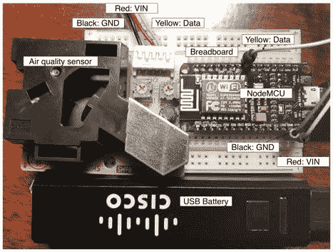

# Archived | 构建实用的 IoT 应用程序 —— 一个空气质量监视器

> 原文：[`developer.ibm.com/zh/tutorials/iot-mqtt-nodemcu-monitor-air-quality/`](https://developer.ibm.com/zh/tutorials/iot-mqtt-nodemcu-monitor-air-quality/)

**本文已归档**

**归档日期：:** 2020-03-10

此内容不再被更新或维护。 内容是按“原样”提供。鉴于技术的快速发展，某些内容，步骤或插图可能已经改变。

在我以前的文章中，我们讨论了 IBM Watson IoT Platform，具体来讲，讨论了该平台用于收集和分析来自 IoT 设备的数据的 [MQTT](https://www.ibm.com/developerworks/cn/iot/iot-mqtt-why-good-for-iot/index.html) 服务。我们还介绍了开源的 [NodeMCU IoT 开发平台](https://www.ibm.com/developerworks/cn/iot/library/iot-nodemcu-open-why-use/index.html)，使用该平台可以轻松地设计原型和生成 IoT 设备应用程序。本文将所有这些组件整合到一个监视空气质量的实用 IoT 应用程序中。

空气污染已成为当今世界人类健康的最大威胁之一。据估计，雾霾每年导致 550 万人死亡，成为了一个主要死亡原因。在像中国北京这样的地方，据估计生活在那里相当于每天抽两包香烟。此外，不仅仅是像中国和印度这样的国家存在这个问题。事实上，伦敦在 2017 年的头 5 天内均已达到了其全年的空气污染限额，巴黎现在每天都笼罩在雾霾中。

应对雾霾的最有趣方式之一是自行监视空气质量。在本文中，我将展示只需不到 35 美元，就能构建一个基于 NodeMCU 的空气质量监视设备（参见组装的带电源的原型设备。）。因为该设备拥有自己的电源（USB 电池），所以它可以放在任何有 WiFi 信号的地方。我通常将它放在房间里监视户内空气，或者放在打开的窗户旁边监视户外空气。这不仅是一个科学项目，也是医疗领域（包括公共卫生研究）的一个潜在的变革潮流，因为我们现在能跟踪个人对雾霾的准确接触量，并研究该接触量与健康问题有何关联。

##### 组装的带电源的原型设备。



## 第 1 步：为 IoT 设备选择并设置硬件

这个物理过程称为[米氏散射](https://en.wikipedia.org/wiki/Mie_scattering)。它作用于大于红外线波长的 1/10 的粉尘。所以，该设备只能测量超过某个大小的粉尘。大多数商用传感器都能测量大小超过 1um（1 微米）的粉尘，它们应能提供 PM2.5 密度读数（PM 是指颗粒物，PM2.5 表示小于 2.5um 的颗粒物）。这类低廉传感器的准确性存在诸多争议。但是，它们通常被认为非常准确，尤其是在户内。（甚至还有一篇关于这个主题的哲学博士论文！）

对于空气质量传感器，有各种各样的传感器可供选择。网站 [AQICN](http://aqicn.org/sensor) 对这些传感器进行了一些很好的评测分析。较低廉的传感器采用了相同的工作原理：它们有一个红外光源（LED 或激光器）和一个放在气室对面的光探测器。该探测器测量气室中的粉尘或雾霾颗粒散射的光。

在本项目中，我选择了使用 [Grove Shinyei Model PPD42NS](https://www.amazon.com/Super-Sensors-Grove-Sensor-PPD42NS/dp/B01HI1ILGS) 空气传感器。据证实，它能准确测量低污染环境（即户内）的 PM2.5 水平。

传感器模块有 3 条线：两条电源线，一条数据线。电源线（GND 和 VCC）连接到 NodeMCU 开发板上的 GND（黑色）和 Vin（红色），因为它们要从 NodeMCU 获取 5V 电源。数据线（黄色）连接到 NodeMCU 上的一个数字引脚。我选择连接到 D5。将传感器线连接到 NodeMCU 开发板的最简单方法是使用电路试验板。连线如上面的组装的带电源的原型设备。所示（带颜色的线是从照片顶部的空气质量传感器连出的线）。

NodeMCU 开发板可使用常规 USB 连接进行供电。所以，我将一个可充电的 USB 电池连接到原型来用作电源。

## 第 2 步：读取传感器数据

来自传感器的数据输出是一个具有随机波峰和波谷的波形。每个波峰表示传感器检测到大于 1um 的颗粒物 (PM)。

要从传感器读取 PM 水平，NodeMCU 应用程序需要计算某个给定时间单位内的低脉冲占用时间（LPO 时间）。它需要确定数据线处于低电压状态多长时间（百分比）。然后可使用产品规格中提供的响应曲线，将 LPO 值转换为每升空气中的颗粒物数（或每 m³ 的颗粒物数）。

对于我们的样本空气污染应用程序，需要修改 NodeMCU 上的 init.lua 应用程序。在 init.lua 应用程序中，NodeMCU 首先连接 WiFi 网络。然后每 10 分钟循环执行一次测量。测量本身会花费 30 秒。在这 30 秒中，每当 D5 上的数据线在高和低电压状态之间跳跃，就会将一个 INT（中断）信号发送给 NodeMCU。NodeMCU 测量 D5 处在高和低电压状态下的时间量，以计算 LPO。

下面列出了 init.lua 的代码。每隔 10 分钟，主计时器就会循环激活 D5 引脚进入“中断模式” (gpio.trig(dpin, “both”, dpin_cb))。激活后，只要该引脚改变状态，就会调用 dpin_cb 函数。dpin_cb 函数维护了一个计时器，以便计算该引脚处在高和低电压状态下占用的时间，并在 30 秒后停用“中断模式”，以便可以计算 LPO (gpio.trig(dpin, “none”))。

```
-- 1.Setup the device ID and access credential.See later.

-- PIN assignment
-- D5 is the driver PIN for the dust detector
dpin = 5
-- D0 is the LED on the NodeMCU board
lpin = 0
gpio.mode(dpin, gpio.INT)
-- The current pulse params
rising_ts = 0
falling_ts = 0
-- aggregated timing vars
high_time = 0
low_time = 0
-- determine if the INT is legit
prev_level = -1

-- setup Wifi
wifi.setmode(wifi.STATION)
wifi.sta.config("SSID","password")
wifi.eventmon.register(wifi.eventmon.STA_GOT_IP, connected)

-- This is the main application loop
-- It starts after the network is up
function connected (e)
    -- 2.Connect to the MQTT service.See later.
-- Timer to take a measurement and send data
-- every 10 minutes.
    tmr.alarm(1, 600000, tmr.ALARM_AUTO, function()
        -- Trigger the "dpin_cb” function (defined below)
        -- when a pulse comes in.
        -- dpin_cb will turn off the trigger after 30s
        gpio.trig(dpin, "both", dpin_cb)
    end)
end

-- Define the INT callback function
function dpin_cb (level, when)
    -- current_level = gpio.read(dpin)
    if prev_level == level then
        -- there is no change. ignore
        return
    else
        prev_level = level
    end
if level == 1 then
        rising_ts = tmr.now()
        print ("raising edge : " .. rising_ts)
        -- turn on the red LED
        gpio.write(lpin, gpio.LOW)
    else
        falling_ts = tmr.now()
        print ("falling edge : " .. falling_ts)
        -- turn off the red LED
        gpio.write(lpin, gpio.HIGH)
    end
    -- Start aggregated timer after a complete pulse is detected
    if falling_ts > 0 and rising_ts > 0 then
        if falling_ts > rising_ts then
            high_time = high_time + falling_ts - rising_ts
        else
            low_time = low_time + rising_ts - falling_ts
        end
    end
    -- Sampling period is 30*1,000,000 macroseconds
    total_time = high_time + low_time
    if total_time > 30000000 then
        lpo = low_time / total_time
        -- remove the INT and reset timers
        gpio.trig(dpin, "none")
        rising_ts = 0
        falling_ts = 0
        high_time = 0
        low_time = 0
        -- turn off the red LED
        gpio.write(lpin, gpio.HIGH)
        -- Very rough estimate.More calibration needed
        pm25 = lpo * 100.0 * 1.5
        -- 3.Send data to the MQTT server.See later.
    end
end 
```

请注意，代码段中有 3 条“see later”注释（这些行已突出显示）。这些注释是将数据发送到 MQTT 服务的附加代码的占位符，我接下来将讨论这些代码。

## 第 3 步：将 IoT 设备连接到 Watson IoT Platform

在[我的前一篇 MQTT 文章](https://www.ibm.com/developerworks/cn/iot/iot-mqtt-why-good-for-iot/index.html)中，介绍了如何在 Watson IoT Platform 上设置 MQTT 项目。请按照那篇文章中的说明，用您的 IBM Cloud 帐户设置一个 MQTT 项目，并创建您的设备的授权凭证。

在设备端，必须首先确保 NodeMCU 固件是使用 MQTT 支持模块构建的。请按照[我的前一篇 NodeMCU 文章](https://www.ibm.com/developerworks/cn/iot/library/iot-nodemcu-open-why-use/index.html)中的说明进行操作。

在 init.lua 应用程序中，首先将从 Watson IoT Platform 创建的设备 ID 和访问令牌分配给此设备。必须针对每个设备自定义此代码段。所以，对于涉及许多设备的大型项目，需要一个自动化代码生成和部署工具（一个 devops 解决方案）。

```
-- 1.Setup the device ID and access credential.
-- Device ID.It is a random string for each device.
-- But, it should match the device ID set up on Watson IoTP.
device_id = "random_string"
-- The access token Watson IoTP assigned for the device.
access_token = "assigned_by_Watson" 
```

接下来，在建立 WiFi 网络连接后，该设备应连接到 MQTT 服务。这是第二个占位符。使用下面的代码段更新 init.lua 应用程序，我在该代码段中还创建了一条“last will”消息，以便在设备断开网络时 MQTT 服务能保留一条记录。

```
-- 2.Connect to the MQTT service.
-- Init MQTT client with keepalive timer 120s
m = mqtt.Client(device_id, 120, "use-token-auth", access_token)

-- setup Last Will and Testament (optional)
-- Broker will publish a message "offline" to topic "dw/lwt"
-- if client doesn't send keepalive packet
m:lwt("dw/lwt", "offline", 0, 0) 
```

## 第 4 步：将数据发送到 Watson IoT Platform 并分析数据

设备建立连接后，可以向 MQTT 服务发送消息。在本例中，更新 init.lua 应用程序中的第三个占位符，使其将测量的值发送到某个主题。在此设置中，有一个聚合所有传感器读数的共享主题。然后 Watson IoT Platform 可以通过设备 ID 区分每个传感器设备的数据点。

```
-- 3.Send data to the MQTT server.
m:connect("host.iotp.mqtt.bluemix.com", 1883, 0,
  function(client)
    print("connected")
    -- subscribe topic with QoS = 0
    client:subscribe("dw/air", 0, function(client)
  print("subscribe success")
    end)
    -- publish a message with QoS = 0, retain = 0
    client:publish("dw/air", pm25, 0, 0, function(client)
  print("sent")
    end)
  end,
  function(client, reason)
    print("failed reason: " .. reason)
  end
)
m:close(); 
```

将数据发送到 Watson IoT Platform 服务器后，可以根据需要来可视化和处理数据。此外，MQTT 协议的一个关键特性是，它允许代理（服务器）向设备回发消息，以便潜在控制设备的行为。例如，我们应在服务器上设置一个所有设备都订阅的特殊主题。然后服务器可以向该主题发出一条消息，以控制单个设备的采样频率。该消息需要以设备 ID 开头，后跟一个空格，并以一个整数结尾，该整数指定了设备对空气质量数据进行采样的间隔（在我们的代码示例中，目前将它设置为 10 分钟）。

```
-- In the m:connect loop
client:subscribe("dw/control", 0)

-- ......

m:on("message", function(client, topic, data)
  if topic == "dw/control" then
print(data)
t = {}
for k, v in string.gmatch(data, "[^%s]+") do
    t[k] = v
end

if t[0] == device_id then
    -- Change the main loop interval to t[1]
  end
end) 
```

通过创造性地使用 MQTT 主题，我们甚至可以设计传感器设备来相互通信。可在[我的 MQTT 文章](https://www.ibm.com/developerworks/cn/iot/iot-mqtt-why-good-for-iot/index.html)中了解相关内容。

## 结束语

在本文中，讨论了如何使用 NodeMCU 硬件开发板和开发工具包构建一个 IoT 空气质量传感器，然后将该设备连接到 IBM Watson IoT Platform 的 MQTT 服务。可选的 MQTT 支持模块对 NodeMCU 平台上的 IoT 设备非常有用。IBM Watson IoT Platform 提供了一个易于使用的托管服务，用于聚合和管理来自启用了 MQTT 的 IoT 设备的数据。

本文翻译自：[Build a practical IoT app, an air quality monitor](https://developer.ibm.com/tutorials/iot-mqtt-nodemcu-monitor-air-quality/)（2019-06-03）