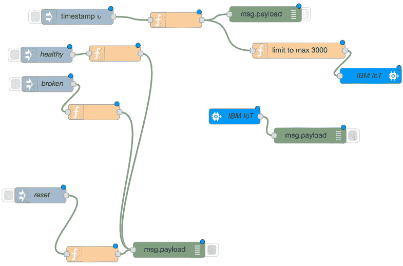
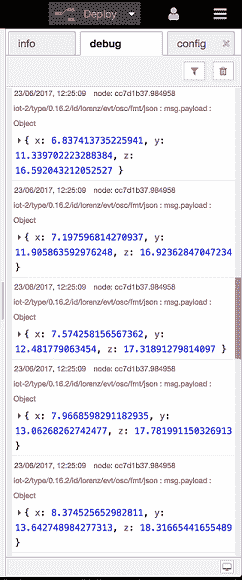
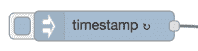
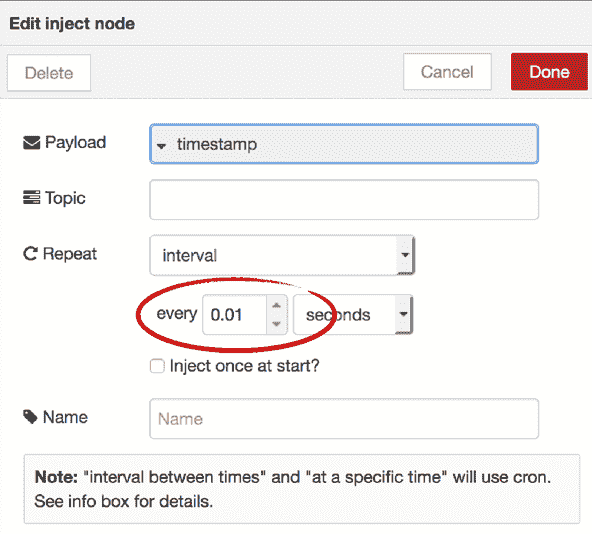
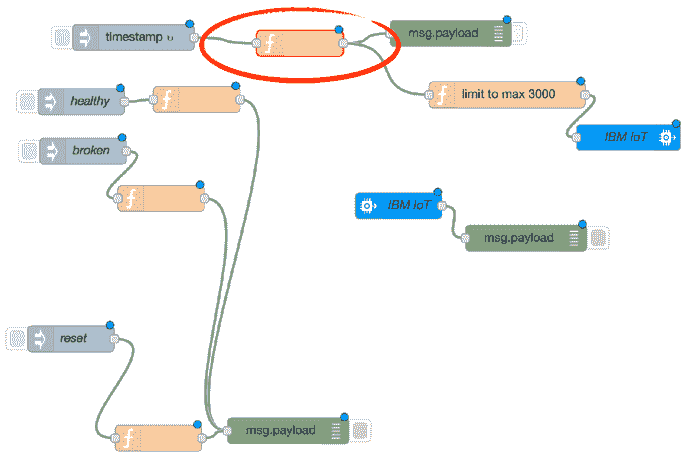
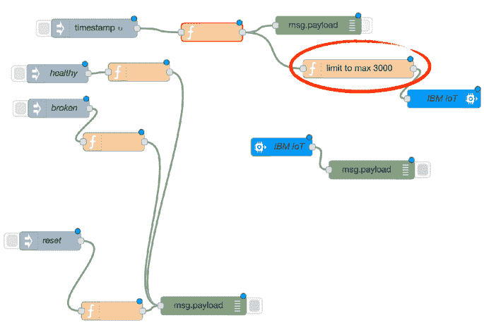
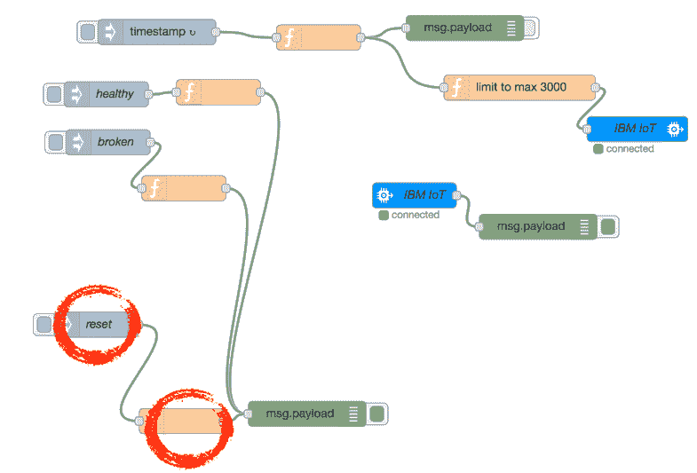
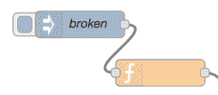
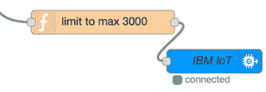
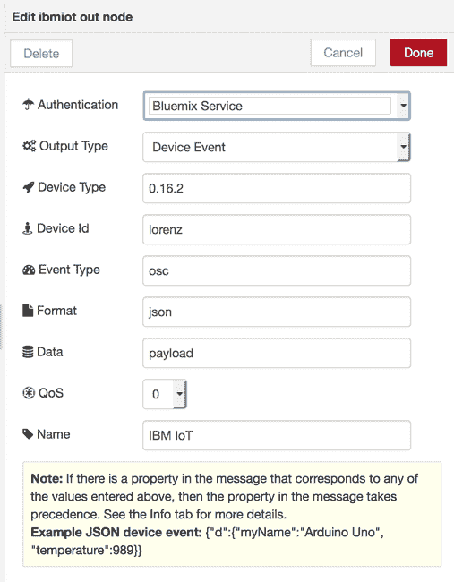

# 生成用于异常检测的数据

> 原文：[`developer.ibm.com/zh/tutorials/iot-deep-learning-anomaly-detection-2/`](https://developer.ibm.com/zh/tutorials/iot-deep-learning-anomaly-detection-2/)

每个数据项目都始于数据。*数据*是一个非常宽泛的术语。它可以是结构化或非结构化的，它可以或大或小，或快或慢，或准确或嘈杂。

我编写了一个关于深度学习和开发认知 IoT 解决方案的文章系列，首篇文章为[介绍深度学习和长短期记忆网络](https://www.ibm.com/developerworks/cn/analytics/library/iot-deep-learning-anomaly-detection-1/index.html)。后续文章将介绍使用 [Deeplearning4j](https://www.ibm.com/developerworks/cn/analytics/library/iot-deep-learning-anomaly-detection-3/index.html)、ApacheSystemML 和 TensorFlow (TensorSpark) 执行异常检测。我的用例是对来自振动（加速计）传感器数据的 IoT 时序数据进行异常检测。为了有效地演示用这些不同的技术创建深度学习解决方案的过程，我需要数据。我需要结构化的、快速且庞大的数据，这些数据也可能充满杂质。

为了有一个创建数据的简单框架，我编写了一个测试数据模拟器，它包含在一个更大的时序和机器学习工具包中。

该模拟器通过对各种物理模型进行采样来生成数据，您可以针对异常检测和分类任务，决定嘈杂程度并在物理模型的不同状态（健康和破坏）之间切换。

就现在而言，我已实现了 Lorenz Attractor 模型。这是一个非常简单，但仍然非常有趣的物理模型。Lorenz 是混沌理论的开创者之一，他证明了一个仅由 3 个等式和 4 个模型参数组成的非常简单的模型能创建一个混沌系统，该系统对初始条件非常敏感，而且还会在多个很难预测状态过渡情况的半稳定状态之间振荡。

我使用 Node-RED 作为模拟器的运行时平台，因为它可以非常快地实现以数据为中心的应用程序。Node-RED 是开源的，而且完全在 Node.js 上运行。如果想进一步了解 Node-RED，请参阅这篇优秀的[教程](https://developer.ibm.com/tv/an-introduction-to-node-red/)。

因为该数据模拟器完全实现成了一个 Node-RED 流，所以我们可以在 IBM 云上使用来自 IoT Starter 样板的 Node-RED。当然，该数据模拟器可在任何 Node-RED 实例上运行，甚至可在 Raspberry Pi 上用来模拟边缘上的传感器数据。

## 创建测试数据模拟器

尽管创建测试数据模拟器具有挑战，但只需 4 个主要步骤即可让模拟器正常运行：

1.  将 Node-RED IoT Starter 样板部署到 IBM 云。
2.  部署测试数据模拟器流。
3.  对测试数据模拟器流进行测试。
4.  获取 IBM Watson IoT Platform 凭证，以便能在世界任何地方通过 MQTT 使用该数据。

在开始之前，您将需要一个 IBM Cloud 帐户。（您可以[在这里申请一个免费试用帐户](http://ibm.biz/goCognitive)，可在以后将它转换为免费增值帐户。）

1.  使用 [Internet of Things Platform Starter](https://cloud.ibm.com/catalog/starters/internet-of-things-platform-starter?env_id=ibm:yp:us-south&cm_sp=ibmdev-_-developer-tutorials-_-cloudreg) 创建 IBM 云应用程序。如果未登录到 IBM Cloud，请进行登录。
2.  为您的应用程序提供一个唯一名称，单击 **Create**。

    **备注：**我将我的应用程序命名为 `romeoiotstarter123`，以确保它是一个唯一名称。该应用程序名称会变成用于访问您的应用程序的 URL 的一部分。例如，我的 URL 为 `romeoiotstarter123.mybluemix.net`。

3.  在左侧菜单中，单击 **Connections**。
4.  在 **Internet of Things Platform** 磁贴上，单击 **View credentials**。
5.  记下以下属性的值，因为您在以后使用 3 种技术（DeepLearning4j、ApacheSystemML 和 TensorFlow (TensorSpark)）之一时将需要它们：

    *   `org`
    *   `apiKey`
    *   `apiToken`

    [](https://developer.ibm.com/developer/default/tutorials/iot-deep-learning-anomaly-detection-2/images/image2.png)

6.  单击 **Close**。
7.  等待应用程序运行，然后单击 **Visit App URL**。

    **备注：**如果获得一个“404 – No route defined”错误，请在几分钟后重新加载该页面。此错误是 Cloud Foundry 开源云平台组件中的一个已知问题，在 IBM 遇到高工作负载时偶有发生。Cloud Foundry 组件之间采用的是异步通信，所以 UI 认为该应用程序在运行，但未更新负载平衡器。

    [](https://developer.ibm.com/developer/default/tutorials/iot-deep-learning-anomaly-detection-2/images/image5.png)

8.  在访问和打开您的 Node-RED 流编辑器之前，必须保护 Node-RED 编辑器。

    1.  单击 **Next**。
    2.  设置用户名和密码。

        **备注：**选中该复选框，以便与他人共享您的应用程序。如果不选中该复选框，您的实现将保持私有。

    3.  单击 **Next**。
    4.  单击 **Finish**。
9.  单击 **Go to your Node-RED flow editor**。

    [](https://developer.ibm.com/developer/default/tutorials/iot-deep-learning-anomaly-detection-2/images/image10.png)

10.  使用刚创建的用户名和密码进行登录。
11.  使用鼠标选择 **Flow 1** 中的所有节点；按 **Delete** 键清空它们。

    [](https://developer.ibm.com/developer/default/tutorials/iot-deep-learning-anomaly-detection-2/images/image11.png)

12.  从右上角的菜单，单击 **Import > Clipboard**。
13.  打开[我的 developerWorks GitHub 存储库中的 simulatorflow.json 文件](https://raw.githubusercontent.com/romeokienzler/developerWorks/master/lorenzattractor/simulatorflow.json)；将该 JSON 对象复制到剪贴板。
14.  在 **Import nodes** 窗口上，将该 JSON 对象粘贴到文本字段中，然后单击 **Import**。

    **备注：**确保您粘贴的是来自剪贴板的 JSON 文档，而不是 HTML。在下一个版本中，NodeRED 将集成 GIT，所以这一步将变得更轻松。

    Flow 1 选项卡中显示了下面这个流。

    

15.  单击 **Deploy**。此时将会显示消息“Successfully deployed”。 **debug** 选项卡显示了生成的消息。恭喜您！您的测试数据生成器正在运行。



## 理解这个 Node-RED 流

测试数据生成器已在正常运行，但这个 Node-RED 流发生了什么？

考虑标有单词 **timestamp** 的节点。



此节点是一个**注入**节点，它按定义的时间间隔生成消息。这非常适合用作我们的模拟器的起点。在真实场景中，会用一些连接到加速计传感器的节点替换此节点。因为我们使用 Lorenz Attractor 模型生成加速计值，所以可以忽略消息上的**时间戳**有效负载，仅对消息对象本身做出反应，我们稍后会查看这一点。

双击 **timestamp** 节点。请注意，该采样率每秒生成 100 条消息（或采样率为 100 Hz）。

**备注：**由于 [Nquist 定理](https://en.wikipedia.org/wiki/Nyquist_frequency)，采样率必须是我们想要捕获的最高采集频率的两倍。尽管 100 Hz 实际上非常慢，但对本教程而言，它已经足够高。在真实场景中，应按照 20 或 40 kHz 的频率进行采样（每 0.01 秒等于 100 Hz）。



接下来看看 **function** 节点。它是模拟器的核心。



双击此节点，可以看到以下函数代码：

```
var h = context.global.get('h')||0.008;
var a = context.global.get('a')||10;
var b = context.global.get('b')||28;
var c = context.global.get('c')||8/3;
var x = context.global.get('x')||2;
var y = context.global.get('y')||3;
var z = context.global.get('z')||4;

x+=h*a*(y-x)
y+=h*(x*(b-z)-y)
z+=h*(x*y-c*z)

context.global.set("x",x);
context.global.set("y",y);
context.global.set("z",z);
msg.payload={};
msg.payload.x=x;
msg.payload.y=y;
msg.payload.z=z;
return msg; 
```

**备注：**该模型的初始参数为 `h`、`a`、`b` 和 `c`。我们还将 `x`、`y` 和 `z` 初始化为一些值；这些等式就是实际的模型。它们依赖于 `h`、`a`、`b`、`c`、`x`、`y` 和 `z`。在每个时间步长（目前为每秒 100 条消息）中，该模型会向未来前进一步，因为 `x`、`y` 和 `z` 已使用来自常量 `h`、`a`、`b` 和 `c` 的值，以及来自以前的 `x`、`y` 和 `z` 的值进行更新。

出于两个原因，您需要在输出上设置一个限制：

*   在当前采样率下（每秒 100 条消息），将在几个小时内用完 Watson IoT Platform 上的每月 200 MB 免费配额。
*   下游分析可能无法应对此数据速率。

现在让我们看看 **limit to max 3000** 函数节点。目前，使用一个简单计数将最大值设置为 30 秒的数据量。



双击该节点来查看函数代码：

```
var count = context.global.get('count') || 0;
count += 1;
context.global.set('count',count);
if (count <= 3000) {
   return msg;
} 
```

现在考虑 **reset** 节点。将与此节点关联的函数节点设置为把接下来 30 秒的数据量发送到消息队列。



双击该函数节点。它的实现方式如下：

```
context.global.set('count',0);
msg.payload=context.global.get('count');
return msg; 
```

下一步到最后一步用于在破坏与正常状态之间切换此模拟器。要模拟故障或破坏的数据，可以单击与**破坏的**注入节点有关联的函数节点。



此节点的唯一任务是更新 Lorenz Attractor 模型常量。

```
context.global.set('h',0.008);
context.global.set('a',30);
context.global.set('b',128);
context.global.set('c',28/3);

return msg; 
```

我们当然还会查看将它切换回健康状态的函数。


```
context.global.set('h',0.008);
context.global.set('a',10);
context.global.set('b',28);
context.global.set('c',8/3);

return msg; 
```

最后但同样重要的是，让我们看看此数据如何传输到 IBM Watson IoT Platform 的 MQTT 消息代理。



您可以保留该配置不变，并使用 IBM Cloud 上运行的 Cloud Foundry 为您注入凭证。



## 结束语

您已成功部署了一个测试数据模拟器，它会创建一个从物理模型采样的事件时序。您也可以在两种状态（健康和破坏）之间切换，以便完成异常检测和分类。

现在可以在本系列的其他教程中使用此测试数据。 您将能使用 Deeplearning4j、ApacheSystemML 和 TensorFlow (TensorSpark) 为异常检测开发深度学习认知 IoT 解决方案。

本文翻译自：[Generating data for anomaly detection](https://developer.ibm.com/tutorials/iot-deep-learning-anomaly-detection-2/)（2017-07-19）