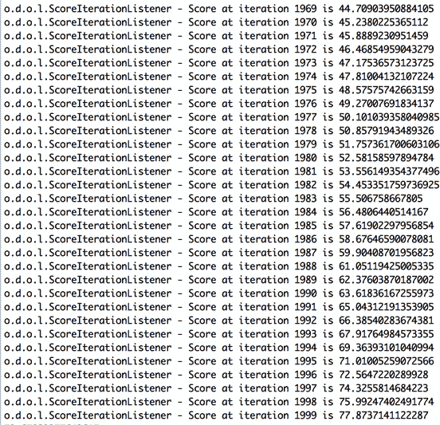

# 使用 Deeplearning4j 执行异常检测

> 原文：[`developer.ibm.com/zh/tutorials/iot-deep-learning-anomaly-detection-3/`](https://developer.ibm.com/zh/tutorials/iot-deep-learning-anomaly-detection-3/)

在本系列的第 1 篇文章[介绍深度学习和长期记忆网络](https://www.ibm.com/developerworks/cn/analytics/library/iot-deep-learning-anomaly-detection-1/index.html)中，我花费了一些时间介绍有关深度学习和神经网络的概念。还介绍了一个对 IoT 时序数据进行异常检测的演示用例。我们的任务是检测一个轴承中的振动（加速计）传感器数据中的异常，如轴承上的加速计传感器记录了 3 个几何轴 x、y 和 z 上的振动。所示。

##### 轴承上的加速计传感器记录了 3 个几何轴 x、y 和 z 上的振动。


由于很难将这样一个系统在此展示，所以我使用一个物理 Lorenz Attractor 模型生成了测试数据，因为它能生成一个三维数据流。我使用了此演示中生成的数据来检测异常，主要预测轴承何时会损坏。

我们需要对开发环境执行一些设置，但首先来概述一下该过程：

*   在 Node-RED 中生成测试数据并在 IBM Cloud 中运行（或者在 Raspberry Pi 等 IoT 网关上运行来模拟更真实的场景）。
*   使用 Watson IoT Platform 服务作为 [MQTT](http://mqtt.org/) 消息代理（也在云中运行）。
*   Eclipse（安装在您的桌面上并运行一个深度学习系统）订阅 MQTT 消息代理上的数据。

如何将 Node-RED 测试数据部署到 IBM Cloud 平台？我们将使用哪个深度学习系统？可使用多种不同的现有技术来实现深度学习系统。前面已经提到过，以下开放标准和开源解决方案可在 IBM Cloud 中运行：Deeplearning4j、ApacheSystemML 和 TensorFlow (TensorSpark)。本文将展示 Deeplearning4j 解决方案。

## 构建您的应用程序需要做的准备工作

*   一个 IBM Cloud 帐户。（您可以[在这里申请一个免费试用帐户](https://cloud.ibm.com/registration?cm_sp=ibmdev-_-developer-tutorials-_-cloudreg)，可在以后将它转换为免费增值帐户。）
*   [Eclipse](http://www.eclipse.org/)（一个用于 JVM 相关语言的集成开发环境 (IDE)）。
*   Eclipse Maven Plugin（依赖管理和自动化构建工具）。
*   Eclipse Scala Plugin（编程语言）。
*   Eclipse GIT Plugin（版本控制系统）。

## 设置开发环境

在讨论深度学习用例之前，让我们花点时间来设置一下开发环境。

1.  安装 [Eclipse Oxygen](https://www.eclipse.org/downloads/eclipse-packages/?show_instructions=TRUE)。选择 IDE for Java Developers。
2.  安装 [Eclipse Maven Plugin](http://download.eclipse.org/technology/m2e/releases/)。
3.  安装 [所描述的用于 Scala 2.10 的 Eclipse Scala Plugin](http://scala-ide.org/docs/current-user-doc/gettingstarted/index.html)。
4.  安装 [Eclipse GIT Plugin](http://www.eclipse.org/egit/download/)。
5.  按照我的 deeplearning4j GitHub 存储库入门文档中的指示，导入本教程的[源代码](https://github.com/romeokienzler/deeplearning4j/blob/gh-pages/gettingstarted.md#using-dl4j-examples-in-eclipse-with-direct-checkout-from-git-via-the-maven-plugin)。
6.  完成设置。

    1.  切换到 Scala Perspective。右键单击 dl4j-examples-spark 项目，然后单击 **Configure > Add Scala Nature**。
    2.  再次右键单击 dl4j-examples-spark 项目，然后单击 **Maven > Update Project**。

        **备注：**忽略 Maven 错误。只要 Run.scala 编译没有出错即可！

    3.  使用 IBM Watson IoT Platform 的凭证更新 **src/resources/ibm_watson_iot_mqtt.properties**。指定 Organization-ID、Authentication-Method (apikey)、API-Key 和 Authentication-Token。您已在“[生成用于异常检测的数据](https://www.ibm.com/developerworks/cn/analytics/library/iot-deep-learning-anomaly-detection-2/index.html)”文章中记下了这些凭证。
7.  运行 Scala 应用程序来测试连接。

    1.  打开 Eclipse 包资源管理器。
    2.  在 dl4j-examples-scala 项目中，展开 **src/main/scala** 文件夹。
    3.  找到 **Run.scala 文件**，右键单击该文件，并选择 **Run As > Scala Application**。

        您会看到以下输出，如 Scala 应用程序输出所示。

        **Scala 应用程序输出** {: #scala-应用程序输出}

        

        **备注：**忽略未找到 Vfs.Dir 的警告。这些只是警告，不会影响应用程序的行为。

恭喜您，最重要的部分工作正常。单击窗口右上角的红色 **Stop** 按钮停止该应用程序，如 Scala 应用程序输出所示。在本文后面的某个阶段，我们会再次运行此应用程序。

## Deeplearning4j 是什么？

[Deeplearning4j](http://www.deeplearning4j.org) 是一个基于 Java 的工具包。它是一种开源的、分布式的深度学习，在包括 Apache Spark 在内的许多不同环境中运行。Deeplearning4j 不需要安装任何其他组件，因为它是一个使用 Apache Spark 所提供的接口的原生 Apache Spark 应用程序。

该框架中对本文最重要的组件包括：

*   **Deeplearning4j 运行时**是核心模块。借助这个运行时模块，可在（但不是直接在）Apache Spark 上使用一个张量库来定义和执行各种各样的神经网络。

*   **ND4J** 是一个用于 JVM 的科学计算库。这个张量库实际上是 Deeplearning4j 的核心。它可以独立使用，用于加速 CPU 和 GPU 上的线性代数运算。要将代码移植到 GPU，无需更改代码，因为一个 JVM 属性会配置底层执行引擎，该引擎也可以是 nVidia GPU 卡的 CUDA 后端。

ND4J 是一个张量和线性代数库。这意味着多维数组（也称为*张量*）和它们之上的运算是主要目标。运算很简单，也很快。使用 ND4J 的优势在于：

*   使用 Apache Spark 时，您停留在同一个 JVM 进程中，不需要为进程间通信 (IPC) 承担开销。
*   ND4J 能使用现代 CPU 上的 SIMD 指令集，这使得 ND4J 性能可以达到 NumPy 等其他张量库的两倍。这是使用 OpenBLAS 实现的，后者是基础线性代数子程序 (BLAS) API 的一种开源实现。
*   ND4J 只需在 JVM 上设置一个系统属性，就能利用您机器上的 GPU（只要在您的系统上安装了最新版的 CUDA 驱动程序和框架）。

ND4J 如何利用 GPU？可以查看以下 Scala 语法来了解它的工作原理。

```
import org.nd4j.linalg.factory.Nd4j
import org.nd4j.linalg.api.ndarray.INDArray
var v:INDArray = Nd4j.create(Array(Array(1d, 2d, 3d), Array(4d, 5d, 6d)))
var w:INDArray = Nd4j.create(Array(Array(1d, 2d), Array(3d, 4d), Array(5d, 6d)))
print(v.mul(w)) 
```

如您所见，我使用 `Nd4j.create` 方法创建了两个 `INDArray` 类型的矩阵 `v` 和 `w`。还提供了一个 `double` 类型的嵌套 Scala 数组，我可以像这样创建内联：

```
Array(Array(1d, 2d, 3d), Array(4d, 5d, 6d)) 
```

代码 `v.mul(w)` 触发了矩阵乘法。同样地，在 CPU 或 GPU 上执行此操作。但是此操作对我们是完全透明的。

## 练习使用异或运算训练一个神经网络

现在您已经了解了 ND4J 的功能，我想展示一下如何创建神经网络。在开始处理 IoT 时序数据之前，我们先来看一个异或运算示例。首先，使用 Scala，生成一种训练数据内联：

```
/*
* List of input values:4 training samples with data for 2 input-neurons each.
*/
var input:INDArray = Nd4j.zeros(4, 2)
/*
* Corresponding list with expected output values, 4 training samples with
* data for 2 output-neurons each.
*/
var labels:INDArray = Nd4j.zeros(4, 2);
/*
* Create first data set when first input=0 and second input=0.
*/
input.putScalar(Array(0, 0), 0);
input.putScalar(Array(0, 1), 0);
/*
* Then the first output fires for false, and the second is 0 (see class comment).
*/
labels.putScalar(Array(0, 0), 1);
labels.putScalar(Array(0, 1), 0);
/*
* When first input=1 and second input=0.
*/
input.putScalar(Array(1, 0), 1);
input.putScalar(Array(1, 1), 0);
/*
* Then XOR is true, therefore the second output neuron fires.
*/
labels.putScalar(Array(1, 0), 0);
labels.putScalar(Array(1, 1), 1);
/*
* Same as above.
*/
input.putScalar(Array(2, 0), 0);
input.putScalar(Array(2, 1), 1);
labels.putScalar(Array(2, 0), 0);
labels.putScalar(Array(2, 1), 1);
/*
* When both inputs fire, XOR is false again.The first output should fire.
*/
input.putScalar(Array(3, 0), 1);
input.putScalar(Array(3, 1), 1);
labels.putScalar(Array(3, 0), 1);
labels.putScalar(Array(3, 1), 0); 
```

现在我们创建了两个 ND4J 数组，一个名为 `input`，包含特征；另一个名为 `labels`，包含预期结果。提醒一下，请查看异或函数表中的输入和输出。

##### 异或函数表的输入和输出

| 输入 1 | 输入 2 | 输出 |
| --- | --- | --- |
| 0 | 0 | 0 |
| 0 | 1 | 1 |
| 1 | 0 | 1 |
| 1 | 1 | 0 |

**备注：**如果只有一个输入 1，则输出为 1。

现在，让我们使用上面创建的数据执行神经网络训练。

```
var ds:DataSet = new DataSet(input, labels)
print(ds) 
```

`DataSet` 数组（不要与来自 Apache Spark SQL 的数组混淆）是一种 Deeplearning4j 数据结构，包含用于训练的 ND4J 数组。以下是这个 ND4J 数组的内部数学表示：

```
===========INPUT===================
[[0.00, 0.00],
[1.00, 0.00],
[0.00, 1.00],
[1.00, 1.00]]
===========OUTPUT==================
[[1.00, 0.00],
[0.00, 1.00],
[0.00, 1.00],
[1.00, 0.00]] 
```

此数组反映了异或函数表的输入和输出异或函数表的结构，但有两处不同：

*   ND4J 使用 float 作为内部数据类型表示。
*   输出为二进制格式，也就是说，是一个二维数组。对于使用拥有两个输出神经元的神经网络训练二元分类器，使用二维数组非常方便，因为二元分类是使用两个而不是一个输出神经元来完成的。完成训练后，每个输出神经元输出一个属于一类或另一类的概率。

## 为异或运算创建 Deeplearning4j 神经网络

仍然使用我们的异或运算输入和输出，我们将使用 `NeuralNetConfiguration.Builder` 类在 Deeplearning4j 中创建神经网络。

可以在 `[XOrExampleScala](https://github.com/romeokienzler/dl4j-examples/blob/master/dl4j-examples-scala/src/main/scala/org/deeplearning4j/examples/feedforward/xor/XOrExampleScala.scala)` 类中找到以下小节中讨论的所有代码。

### 设置全局参数

此代码基本上设置的是神经网络的全局参数。深入研究每个参数不属于本文的讨论范围。

```
/*
* Set up network configuration.
*/
var builder:NeuralNetConfiguration.Builder = new NeuralNetConfiguration.Builder();

/*
* How often should the training set be run?We need something above
* 1000, or a higher learning-rate; found this value just by trial and error.
*/
builder.iterations(10000);

/*
* Learning rate.
*/
builder.learningRate(0.1);

/*
* Fixed seed for the random generator.Any run of this program
* brings the same results.Might not work if you do something like ds.shuffle()
*/
builder.seed(123);

/*
* Not applicable as this network is too small, but for bigger networks it
* can help that the network is less prone to overfitting to the training data.
*/
builder.useDropConnect(false);

/*
* A standard algorithm for moving on the error-plane.This one works
* best for me.LINE_GRADIENT_DESCENT or CONJUGATE_GRADIENT can do the
* job, too.It's an empirical value which one matches best to
* your problem.
*/
builder.optimizationAlgo(OptimizationAlgorithm.STOCHASTIC_GRADIENT_DESCENT);

/*
* Initialize the bias with 0; empirical value, too.
*/
builder.biasInit(0);

/*
* From "http://deeplearning4j.org/architecture":The networks can
* process the input more quickly and more accurately by ingesting
* minibatches of 5-10 elements at a time in parallel.
* This example runs better without, because the data set is smaller than
* the minibatch size.
*/
builder.miniBatch(false);

/*
* Create a multilayer network with two layers (including the output layer, excluding the input layer)
*/
var listBuilder:ListBuilder = builder.list();
var hiddenLayerBuilder:DenseLayer.Builder = new DenseLayer.Builder();

/*
* Two input connections simultaneously defines the number of input
* neurons, because it's the first non-input-layer.
*/
hiddenLayerBuilder.nIn(2);

/*
* Number of outgoing connections, nOut simultaneously defines the
* number of neurons in this layer.
*/
hiddenLayerBuilder.nOut(4);

/*
* Put the output through the sigmoid function, to cap the output
* value between 0 and 1.
*/
hiddenLayerBuilder.activation(Activation.SIGMOID);

/*
* Random initialize weights with values between 0 and 1.
*/
hiddenLayerBuilder.weightInit(WeightInit.DISTRIBUTION);
hiddenLayerBuilder.dist(new UniformDistribution(0, 1)); 
```

### 设置神经网络层

设置全局参数后，接下来需要添加各个神经网络层来形成一个深度神经网络。此代码向神经网络添加两个层：包含两个神经元的输入层（每个神经元对应异或函数表的输入和输出中所示的异或函数表的一列）；包含两个神经元的输出层，每个神经元对应一个类（因为异或函数表中的结果为 0 和 1）。

**备注：**可以指定大量特定于层的参数，但这不属于本文的讨论范围。

```
/*
* Build and set as layer 0.
*/
listBuilder.layer(0, hiddenLayerBuilder.build());

/*
* MCXENT or NEGATIVELOGLIKELIHOOD (both are mathematically equivalent) work for this example.This
* function calculates the error-value (or 'cost' or 'loss function value'), and quantifies
the goodness
* or badness of a prediction, in a differentiable way.
* For classification (with mutually exclusive classes, like here), use multiclass cross entropy, in conjunction
* with softmax activation function.
*/
var outputLayerBuilder:Builder = new OutputLayer.Builder(LossFunctions.LossFunction.NEGATIVELOGLIKELIHOOD);

/*
* Must be the same amount of neurons in the layer before.
*/
outputLayerBuilder.nIn(4);

/*
* Two neurons in this layer.
*/
outputLayerBuilder.nOut(2);
outputLayerBuilder.activation(Activation.SOFTMAX);
outputLayerBuilder.weightInit(WeightInit.DISTRIBUTION);
outputLayerBuilder.dist(new UniformDistribution(0, 1));
listBuilder.layer(1, outputLayerBuilder.build()); 
```

### 创建神经网络

您已拥有全局参数和神经网络层，现在要创建神经网络。

```
/*
* No pretrain phase for this network.
*/
listBuilder.pretrain(false);

/*
* Seems to be mandatory
* according to agibsonccc:You typically only use that with
* pretrain(true) when you want to do pretrain/finetune without changing
* the previous layers finetuned weights that's for autoencoders and restricted Boltzmann machines (RBMs).
*/
listBuilder.backprop(true);

/*
* Build and initialize the network and check if everything is configured correctly.
*/
varconf:MultiLayerConfiguration = listBuilder.build();
var net:MultiLayerNetwork = new MultiLayerNetwork(conf);
net.init(); 
```

### 使用异或运算数据训练神经网络

现在，net 变量包含我们准备就绪的神经网络，要使用我们的异或函数表训练它，只需运行以下代码即可。

```
net.fit(ds) 
```

如果现在查看输出 (`sysout`)，则会看到有关学习进度的调试消息。

```
08:52:56.714 [main] INFO o.d.o.l.ScoreIterationListener - Score at iteration 400 is 0.6919901371002197
08:52:56.905 [main] INFO o.d.o.l.ScoreIterationListener - Score at iteration 500 is 0.6902942657470703
08:52:57.085 [main] INFO o.d.o.l.ScoreIterationListener - Score at iteration 600 is 0.6845208406448364
....
08:53:11.720 [main] INFO o.d.o.l.ScoreIterationListener - Score at iteration 9700 is 0.0012604787480086088
08:53:11.847 [main] INFO o.d.o.l.ScoreIterationListener - Score at iteration 9800 is 0.0012446331093087792
08:53:11.994 [main] INFO o.d.o.l.ScoreIterationListener - Score at iteration 9900 is 0.001229131012223661 
```

如您所见，执行了 9900 次迭代来训练神经网络（基本上讲，会多次向神经网络显示相同的数据集），每 100 次迭代打印一个称为 `score` 的测量指标。这就是所谓的 RMSE（均方根误差），该测量指标用于测量神经网络与数据的拟合程度，指标越低越好。可以观察到，在 10000 次迭代后，RMSE 降低到了 0.001229131012223661，这在本例中是一个非常不错的值。

### 评估训练效果

我们可以检查实际执行的效果，因为 Deeplearning4j 有一个用于评估的内置组件。

```
/*
* Let Evaluation print stats on how often the right output had the correct label.
*/
var eval:Evaluation = new Evaluation(2);
eval.eval(ds.getLabels(), output);
println(eval.stats()); 
```

该代码输出对预测（分类）性能的以下测量结果：

```
==========================Scores=========================
Accuracy:1
Precision:1
Recall:1
F1 Score:1
========================================================= 
```

所有测量指标均为 1，这意味着我们的分数达到了 100%，我们构建了一个完美的分类器来计算异或运算结果。

## 创建一个 Deeplearning4j 神经网络来执行异常检测

以异或运算为例，很容易掌握如何训练神经网络，但现在我们需要使用一个已生成的数据集，通过 Deeplearning4j 在 Apache Spark 上构建有用的功能。请记住，我们使用了一个 Lorenz Attractor 模型来获取模拟的实时振动传感器数据。我们需要将该数据传输到 IBM Cloud 平台；请参阅我的“[生成用于异常检测的数据](https://www.ibm.com/developerworks/cn/analytics/library/iot-deep-learning-anomaly-detection-2/index.html)”文章，了解有关的步骤。

我将使用 Scala，因为它不仅类似于 Java，还被视为一种数据科学语言。这个示例包含 3 个 Scala 类。

*   `WatsonIoTConnector` 负责订阅来自 MQTT 消息代理的实时数据。
*   `IoTAnomalyExampleLSTMFFTWatsonIoT` 包含实际神经网络配置。
*   `Run` 包含 `WatsonIoTConnector` 和 `IoTAnomalyExampleLSTMFFTWatsonIoT` 之间的某种联系。

### 使用 MQTT 订阅 IBM Watson IoT Platform 来实时摄入 IoT 传感器数据流

首先看看 `WatsonIoTConnector`。这里仅展示了相关代码，但您可以从我的 [GitHub 存储库 dl4j-examples](https://github.com/romeokienzler/dl4j-examples.git) 下载完整代码。

首先，创建一个 MQTT 应用程序客户端来订阅一个 MQTT 传感器数据流。

```
val props = new Properties()
props.load(getClass.getResourceAsStream("/ibm_watson_iot_mqtt.properties"))
val myClient = new ApplicationClient(props)
myClient.connect 
```

现在可以订阅所谓的设备事件。因为我们可能不想接收消息总线上传输的所有流量，所以我们很希望对它进行过滤。将与 IoT 设备和网关相连的传感器与实际的分析应用程序分离，这是一种明智之举，因为它们不再需要相互了解。那么我们该如何应对传入的数据？通过 ApplicationClient 实例 `myClient` 上设置的一个回调处理函数。

```
myClient.setEventCallback(eventbk) 
```

查看 `Run` 类中定义的这个事件处理函数。

```
object MyEventCallback extends EventCallback { 
```

我们要做的第一件事是创建一个 `fifo` 变量来存储事件的轮转计数窗口。

```
var fifo:Queue[Array[Double]] = new CircularFifoQueue[Array[Double]](windowSize) 
```

接下来，我们将实现 `processEvent` 方法，只要从 MQTT 队列传来消息，就会调用该方法。

```
override def processEvent(arg0:Event) { 
```

现在将事件转换为 `double` 类型的数组，并将它添加到 `fifo` 对象。

```
val json = arg0.getData().asInstanceOf[JsonObject]
def conv = { v:Object => v.toString.toDouble }
val event:Array[Double] = Array(conv(json.get("x")), conv(json.get("y")), conv(json.get("z")))
fifo.add(event); 
```

填充轮转计数窗口后，应用快速傅立叶变换 (FFT) 获取信号的频谱，最后将它转换为一个 `NDArray` – 一种内部 Deeplearning4j 数据类型。

```
val ixNd = Nd4j.create(fifo.toArray(Array.ofDimDouble));
def xtCol = { (x:INDArray, i:Integer) => x.getColumn(i).dup.data.asDouble }
val fftXYZ = Nd4j.hstack(Nd4j.create(fft(xtCol(ixNd, 0))), Nd4j.create(fft(xtCol(ixNd, 1))), Nd4j.create(fft(xtCol(ixNd, 2)))) 
```

现在是时候实例化神经网络了。

```
val lstm:IoTAnomalyExampleLSTMFFTWatsonIoT = new IoTAnomalyExampleLSTMFFTWatsonIoT(windowSize * 6) 
```

完成此任务后，我们可以实际将轮转计数窗口发送到下游的神经网络，以检测异常。

**备注**：训练和异常检测是同时执行的，因为神经网络会不断学习正常数据的举动，并在发现异常后抛出一个错误。

```
lstm.detect(fftXYZ) 
```

### 为异常检测创建深度神经网络 LSTM 自动编码器

但是这一强大功能是如何实现的？让我们看看 `IoTAnomalyExampleLSTMFFTWatsonIoT` 中的神经网络实现：

```
val conf = new NeuralNetConfiguration.Builder()
.seed(12345)
.iterations(1)
.weightInit(WeightInit.XAVIER)
.updater(Updater.ADAGRAD)
.optimizationAlgo(OptimizationAlgorithm.STOCHASTIC_GRADIENT_DESCENT)
.learningRate(learningRate)
.regularization(true)
.l2(0.0001)
.list() 
```

首先，设置神经网络的全局参数，比如学习速率。然后添加实际的层。我们首先将添加一个长短期记忆 (LSTM) 层 – 该层负责识别 IoT 时序传感器数据流中的时间模式。

```
.layer(0, new GravesLSTM.Builder().activation(Activation.TANH).nIn(windowSize).nOut(10)
.build()) 
```

要检测异常，使用自动编码器至关重要，我们会将它添加为第二层。

```
.layer(1, new VariationalAutoencoder.Builder()
.activation(Activation.LEAKYRELU)
.encoderLayerSizes(256, 256)
//2 encoder layers, each of size 256
.decoderLayerSizes(256, 256)
//2 decoder layers, each of size 256
.pzxActivationFunction(Activation.IDENTITY)
//p(z|data) activation function
//Bernoulli reconstruction distribution + sigmoid activation - for modelling binary data (or data in range 0 to 1)
.reconstructionDistribution(new BernoulliReconstructionDistribution(Activation.SIGMOID))
.nIn(10) //Input size:28x28
.nOut(10) //Size of the latent variable space: p(z|x) - 32 values
.build()) 
```

最后，添加一个输出层就大功告成了。

```
.layer(2, new RnnOutputLayer.Builder(LossFunctions.LossFunction.MSE)
      .activation(Activation.IDENTITY).nIn(10).nOut(windowSize).build()) 
```

### 在单个本地机器上运行神经网络

让我们首先看看实际的单节点配置是什么样子。

```
val net = new MultiLayerNetwork(conf) 
```

就这么简单。我们只需使用该配置，获取一个可以训练的神经网络对象。实际上很容易在 Deeplearning4j 中实现从单一节点转到 Apache Spark。

```
val tm = new ParameterAveragingTrainingMaster.Builder(batchSizePerWorker)
.averagingFrequency(5)
.workerPrefetchNumBatches(2)
.batchSizePerWorker(16)
.build();

val net = new SparkDl4jMultiLayer(sc, conf, tm); 
```

### 使用 Apache Spark 并行化此神经网络

让我们暂时跳过 `TrainingMaster`，看看 `SparkDl4jMultiLayer` 的构造函数签名。我们已经知道 `conf` 参数，它就是神经网络配置。然后，`sc` 代表 `SparkContext`，我们在使用 Apache Spark 时已提供它。最后，让我们看看 `TrainingMaster`。可使用参数平均化方法对神经网络执行并行训练。在训练期间，神经网络参数（或权重）会在每个训练迭代中更新。因为多个神经网络是在不同的数据分区上并行训练的，所以学到的每个神经网络的参数会发送到参数服务器，然后对它们求平均值并返回。

让我们看看以下源代码，看看要从本地执行切换到在 Apache Spark 上并行执行，需要对源代码执行的最少改动。

```
if (runLocal) {
    net = new MultiLayerNetwork(conf)
    net.setListeners(Collections.singletonList(new ScoreIterationListener(1).asInstanceOf[IterationListener]))
  } else {
    val tm = new ParameterAveragingTrainingMaster.Builder(20)
      .averagingFrequency(5)
      .workerPrefetchNumBatches(2)
      .batchSizePerWorker(16)
      .build();

    val sparkConf = new SparkConf()

    sparkConf.setAppName("DL4J Spark Example");
    sc = new JavaSparkContext(sparkConf);
    sparkNet = new SparkDl4jMultiLayer(sc, conf, tm);
  } 
```

如果 `runLocal` 为 false，则会实例化一个 `ParameterAveragingTrainingMaster`；该类在 Apache Spark 主节点上运行，负责并行训练神经网络。然后使用 `SparkContext`、实际的神经网络配置 `conf` 和刚才创建的 Training Master 实例（所有这些都是使用 SparkDl4jMultiLayer 的构造函数来完成的）来创建 `sparkNet`。如果想进一步了解参数平均化的详细工作原理，请观看我的视频“[深度学习神经网络的并行化策略](https://youtu.be/bJizBmBv4gg?t=8m19s)”中对数据并行化的解释（在这个时长 32:11 的视频的 8:19 处）。

### 闭合循环

最后实现 `detect` 方法来闭合循环，在轮转计数窗口装满后，会通过 MQTT 回调处理函数直接调用该方法。

```
def detect(xyz:INDArray):Double = {
 for (a <- 1 to 1000) {
   net.fit(xyz, xyz)
 }
 return net.score(new DataSet(xyz, xyz))
} 
```

该方法多次向神经网络显示完全相同的数据。实际上，拥有更低的学习速率并使用同一个数据集反复训练一个神经网络的效果更好。我们在这里向神经网络显示了同一个数据集 1000 次。

## 启动本地神经网络，并查看它如何应对收到的数据

让我们实际启动该流程，看看会发生什么。我们使用健康数据执行两轮训练，最后将测试数据生成器切换为破坏状态。使用正常数据训练一段时间后突然采用未知数据时，我们看到神经网络遇到的所谓重构误差会有很大不同。

首先，按照设置开发环境部分的描述，再次运行 `Run.scala` 类。您会看到类似 Scala 应用程序输出的输出。

##### Scala 应用程序输出


此输出意味着神经网络已在本地实例化，正等待数据实时从 IBM Watson IoT Platform MQTT 消息代理传入。

接下来，切换回运行测试数据生成器的 Node-RED 实例的浏览器窗口。单击 **Reset** 按钮启动测试数据生成器，以生成一些数据。

**备注：**尽管 Lorenz Attractor 模型不断生成数据（就像一个附加到轴承上的真实加速计传感器），但只在我们按下 **Reset** 按钮时，它才会将另外 30 秒的数据发布到 IBM Watson IoT Platform MQTT 消息代理；这可以预防本地运行的神经网络丢弃数据。

可以在 Node-RED 调试窗格中观察到数据是如何传输到消息代理的，因为该流包含订阅和调试显示了订阅数据流的节点的 Node-RED 流中所示的完全相同的数据流的节点。

##### 显示了订阅数据流的节点的 Node-RED 流


最后，切换回运行我们的神经网络的 Eclipse。可以在 Node-RED 流调试选项卡显示了正在传入的数据中的控制台中看到一些表明数据正在传入的调试消息。我们等待填满一个基于计数的轮转窗口，使它包含 30 秒的数据。我们将把每个轮转窗口提交到神经网络。

##### Node-RED 流调试选项卡显示了正在传入的数据


神经网络在训练期间的输出显示了神经网络在训练期间，在收到第一个可供处理的轮转窗口后的输出。它输出实际的训练迭代和当前的重构误差。重要的是，该数字在一段时间后收敛为一个局部最小值，而且重构误差会在一段时间后显著减少。

##### 神经网络在训练期间的输出


在健康数据迭代 0 到 30 的神经网络训练输出中，我们从迭代 0 开始，初始重构误差为 392314.67211754626。这是由于对神经网络权重参数的随机初始化所导致的。

##### 健康数据迭代 0 到 30 的神经网络训练输出


**备注：**我们每次运行此示例时，都会获得稍有不同的数字。

在健康数据迭代 969 到 999 的神经网络训练输出中，我们在迭代 999 时得到了重构误差 372.6741075529085，它比迭代 0 时的 392314.67211754626 小得多。

##### 健康数据迭代 969 到 999 的神经网络训练输出


在健康数据迭代 1969 到 1999 的神经网络训练输出中，经过第二轮训练并处理第二个轮转计数窗口后 – 我们最终在迭代 1999 时得到了重构误差 77.8737141122287。

**备注：**可以看到迭代 1999 时的分数比迭代 1969 时要高。这是由于振动，但并不意味着存在问题，除非您将收敛于一个很小的值。

##### 健康数据迭代 1969 到 1999 的神经网络训练输出



在健康数据迭代 969 到 999 的神经网络训练输出中可以看到，现在我们将异常数据传入神经网络中，并可以明确看到迭代 2999 时的重构误差 11091.125671441947 比健康数据迭代 969 到 999 的神经网络训练输出和健康数据迭代 1969 到 1999 的神经网络训练输出中高得多。

##### 健康数据迭代 969 到 999 的神经网络训练输出


**备注：**我在 HadoopSummit 17 大会上演示了这个端到端场景，可以在这个[视频](https://youtu.be/ytBVOXMsfpc?t=25m5s)中观看该场景（我是在这个时长 34:47 的视频中的 25:06 处开始演示的）。

## 结束语

我们的第一篇针对 IoT 时序数据的深度学习教程到此就结束了。如您所见，在 DeepLearning4J 中定义和运行深度神经网络很简单。DeepLearning4j 框架负责了并行神经网络训练中涉及的所有复杂数学运算。在 Apache Spark 上运行它，是在弹性 Apache Spark 云环境中构建高度可扩展的认知 IoT 解决方案的理想选择，比如 IBM Cloud Data Science Experience 平台附加了它的可扩展弹性 Apache Spark “即服务”产品。此外，您不会绑定到特定的云提供商，甚至可能在您自己的私有云或传统数据中心内运行此系统。

在接下来的两篇文章中，我们将处理生成的相同测试数据，但采用两个不同的深度学习框架：ApacheSystemML 和 TensorFlow (TensorSpark)。

本文翻译自：[Using Deeplearning4j for anomaly detection](https://developer.ibm.com/tutorials/iot-deep-learning-anomaly-detection-3/)（2017-07-19）