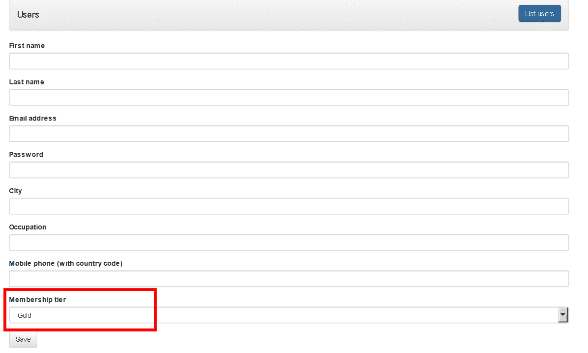
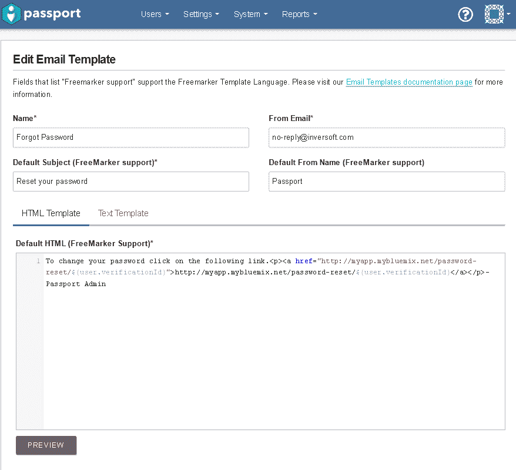

# 向 PHP 应用程序添加基于角色的访问和密码恢复

> 原文：[`developer.ibm.com/zh/tutorials/cl-bluemix-manage-authenticate-users-php-passport-2/`](https://developer.ibm.com/zh/tutorials/cl-bluemix-manage-authenticate-users-php-passport-2/)

在[第 1 部分](http://www.ibm.com/developerworks/cn/cloud/library/cl-bluemix-manage-authenticate-users-php-passport-1/index.html)中，我介绍了 Passport API 的基本知识，演示了将 Passport 与在 IBM Cloud 上运行的 PHP 应用程序相集成的过程。通过将应用程序的用户管理和身份验证外包给 Passport，可以快速高效地向 PHP 应用程序添加用户注册、登录/注销，以及激活/停用工作流。

但正如我当时所说的，这只是冰山一角。借助 Passport API，可以通过添加一些功能来增强 PHP 应用程序中的用户管理，比如修改和删除用户帐户，存储自定义用户个人资料属性，基于用户角色来限制对功能的访问，并提供一个针对忘记密码的恢复系统。我在第 1 部分结束时已承诺，我会在这里介绍所有这些功能。让我们开始吧！

> IBM Cloud 的 Passport 服务可以快速轻松地向应用程序添加功能全面的用户管理、身份验证和基于角色的访问。

## 您需要做的准备工作

请参阅[第 1 部分](http://www.ibm.com/developerworks/cn/cloud/library/cl-bluemix-manage-authenticate-users-php-passport-1/index.html)中的“您需要做的准备工作”，了解学习本教程需要做的所有准备工作。一定要注意与 [Inversoft 许可协议](https://www.inversoft.com/license)和 [IBM Cloud 使用条款](https://cloud.ibm.com/docs)相关的需求。

[在 GitHub 上获得代码](https://github.com/vvaswani/bluemix-user-api)

**免费试用 IBM Cloud**

利用 [IBM Cloud Lite](https://cloud.ibm.com/registration?cm_sp=ibmdev-_-developer-tutorials-_-cloudreg) 快速轻松地构建您的下一个应用程序。您的免费帐户从不过期，而且您会获得 256 MB 的 Cloud Foundry 运行时内存和包含 Kubernetes 集群的 2 GB 存储空间。

## 第 1 步：支持在用户记录中使用自定义属性

在第 1 部分中看到的用户注册表单非常简单：只需要提供用户的姓名、电子邮箱地址和密码。实际上，在用户注册时，可能还需要他们提供更多的信息 — 或许包括他们的地址、电话号码，甚至是支付信息。

好消息是，Passport 支持在用户记录中使用自定义属性，允许请求（并保存）认为完善用户记录所必需的信息。此信息连同其他强制性用户信息一起存储在 Passport 服务中，可使用 Passport API 进行访问。

为了演示如何实现这一支持，让我们返回到之前的 $APP_ROOT/views/users-save.phtml 文件，并更新注册表单，以包含 3 个额外的 — 用于填写城市、职业和手机号的字段：

```
...
<form method="post"
  action="<?php echo $data['router']->pathFor('admin-users-save'); ?>">
  <div class="form-group">
    <label for="fname">First name</label>
    <input type="text" class="form-control" id="fname" name="fname">
  </div>
  <div class="form-group">
    <label for="lname">Last name</label>
    <input type="text" class="form-control" id="lname" name="lname">
  </div>
  <div class="form-group">
    <label for="email">Email address</label>
    <input type="text" class="form-control" id="email" name="email">
  </div>
  <div class="form-group">
    <label for="password">Password</label>
    <input type="password" class="form-control" id="password" name="password">
  </div>
  <div class="form-group">
    <label for="city">City</label>
    <input type="text" class="form-control" id="city" name="city">
  </div>
  <div class="form-group">
    <label for="occupation">Occupation</label>
    <input type="text" class="form-control" id="occupation" name="occupation">
  </div>
  <div class="form-group">
    <label for="mobilePhone">Mobile phone (with country code)</label>
    <input type="text" class="form-control" id="mobilePhone" name="mobilePhone">
  </div>
  <div class="form-group">
    <button type="submit" name="submit" class="btn btn-default">Save</button>
  </div>
</form>
... 
```

这是修改后的用户注册表单：

##### 用户注册表单


接下来，更新相应的 Slim 回调来验证这些新输入，并将它们添加到发送给 `/api/user/registration` API 方法的 JSON 文档。

```
<?php
// Slim application initialization - snipped

// user form processor
$app->post('/admin/users/save', function (Request $request, Response $response) {
  // get configuration
  $config = $this->get('settings');

  // get input values
  $params = $request->getParams();

  // validate input
  if (!($fname = filter_var($params['fname'], FILTER_SANITIZE_STRING))) {
    throw new Exception('ERROR: First name is not a valid string');
  }

  if (!($lname = filter_var($params['lname'], FILTER_SANITIZE_STRING))) {
    throw new Exception('ERROR: Last name is not a valid string');
  }

  $password = trim(strip_tags($params['password']));
  if (strlen($password) < 8) {
    throw new Exception('ERROR: Password should be at least 8 characters long');
  }

  $email = filter_var($params['email'], FILTER_SANITIZE_EMAIL);
  if (filter_var($email, FILTER_VALIDATE_EMAIL) === false) {
    throw new Exception('ERROR: Email address should be in a valid format');
  }

  if (!($city = filter_var($params['city'], FILTER_SANITIZE_STRING))) {
    throw new Exception('ERROR: City is not a valid string');
  }

  if (!($occupation = filter_var($params['occupation'], FILTER_SANITIZE_STRING))) {
    throw new Exception('ERROR: Occupation is not a valid string');
  }

  $mobilePhone = filter_var($params['mobilePhone'], FILTER_SANITIZE_NUMBER_INT);
  if (filter_var($mobilePhone, FILTER_VALIDATE_FLOAT) === false) {
    throw new Exception('ERROR: Mobile phone is not a valid number');
  }

  // generate array of user data
  $user = [
    'registration' => [
      'applicationId' => $config['passport_app_id'],
    ],
    'skipVerification' => true,
    'user'  => [
      'email' => $email,
      'firstName' => $fname,
      'lastName' => $lname,
      'password' => $password,
      'mobilePhone' => $mobilePhone,
      'data' => [
        'attributes' => [
          'city' => $city,
          'occupation' => $occupation,
        ]
      ]
    ]
  ];

  // encode user data as JSON
  // POST to Passport API for user registration and creation
  $apiResponse = $this->passport->post('/api/user/registration', [
    'body' => json_encode($user),
    'headers' => ['Content-Type' => 'application/json'],
  ]);

  // if successful, display success message
  // with user id
  if ($apiResponse->getStatusCode() == 200) {
    $json = (string)$apiResponse->getBody();
    $body = json_decode($json);
    $response = $this->view->render($response, 'users-save.phtml', [
      'router' => $this->router, 'user' => $body->user
    ]);
    return $response;
 }
});

// other callbacks 
```

请注意发送到 Passport API 的 JSON 文档中的额外的 `user.data.attributes` 键；这个键旨在保存您希望为应用程序用户存储的所有自定义属性。在这个示例中，该键存储了用户的城市和职业，但也可以根据您的需求添加其他属性。用户的手机号单独存储在 `user.mobilePhone` 键中，这是一个已受 Passport API 支持的预定义的键。

要查看附加请求的实际效果，可使用该注册表单创建一个新的用户帐户，记得输入所请求的附加信息。然后，浏览到 Passport 前端 URL，使用您的管理凭证进行登录，并查看 Passport 服务仪表板中的新用户记录，以验证信息已成功保存。这是您应该看到的结果示例：

##### 包含自定义属性的用户记录


## 第 2 步：启用用户个人资料修改

通常，应用程序还会允许已注册用户修改存储在他们的用户个人资料中的信息。尽管在本例中，用户信息存储在 Passport 而不是应用程序数据库中，但仍然很容易使用 Passport API 检索和修改它。

实现此操作的最简单方法是重用现有的用户注册表单并更新它，以便将它也用作用户个人资料修改表单。首先是 `/admin/users/save` 路径的回调处理函数。该路径显示了注册表单，应更新该表单来接受一个可选用户标识符作为路径参数，如下所示：

```
<?php
// Slim application initialization - snipped

// user form handler
$app->get('/admin/users/save[/{id}]', function (Request $request,
  Response $response, $args) {
  $user = [];

  if (isset($args['id'])) {
    // sanitize input
    if (!($id = filter_var($args['id'], FILTER_SANITIZE_STRING))) {
      throw new Exception('ERROR: User identifier is not a valid string');
    }

    $apiResponse = $this->passport->get('/api/user/' . $id);

    if ($apiResponse->getStatusCode() == 200) {
      $json = (string)$apiResponse->getBody();
      $body = json_decode($json);
      $user = $body->user;
    }
  }

  $response = $this->view->render($response, 'users-save.phtml', [
    'router' => $this->router, 'user' => $user
  ]);
  return $response;
})->setName('admin-users-save');

// other callbacks 
```

如果请求此路径时附加了这个可选的用户标识符，回调会向 `/api/user/USER_ID` 端点发出一个请求。此端点然后返回一个包含相应用户记录（包括自定义属性）的 JSON 文档，而且此信息以数组形式传递到视图脚本。

下一步是更新 $APP_ROOT/views/users-save.phtml 上的注册表单，以便记下该附加信息，并使用来自所传入数组的用户现有数据来预先填充表单字段。以下是对该表单的必要更改：

```
...
<?php if (!isset($_POST['submit'])): ?>
  <form method="post"
    action="<?php echo $data['router']->pathFor('admin-users-save'); ?>">
    <input name="id" type="hidden"
      value="<?php echo (isset($data['user']->id)) ?
      $data['user']->id : ''; ?>" />
    <div class="form-group">
      <label for="fname">First name</label>
      <input type="text" class="form-control" id="fname"
        name="fname" value="<?php echo (isset($data['user']->firstName)) ?
        $data['user']->firstName : ''; ?>">
    </div>
    <div class="form-group">
      <label for="lname">Last name</label>
      <input type="text" class="form-control" id="lname"
        name="lname" value="<?php echo (isset($data['user']->lastName)) ?
        $data['user']->lastName : ''; ?>">
    </div>
    <div class="form-group">
      <label for="email">Email address</label>
      <input type="text" class="form-control" id="email"
        name="email" value="<?php echo (isset($data['user']->email)) ?
        $data['user']->email : ''; ?>">
    </div>
    <div class="form-group">
      <label for="password">Password</label>
      <input type="password" class="form-control" id="password" name="password">
    </div>
    <div class="form-group">
      <label for="city">City</label>
      <input type="text" class="form-control" id="city" name="city"
        value="<?php echo (isset($data['user']->data->attributes->city)) ?
        $data['user']->data->attributes->city : ''; ?>">
    </div>
    <div class="form-group">
      <label for="occupation">Occupation</label>
      <input type="text" class="form-control" id="occupation" name="occupation"
        value="<?php echo (isset($data['user']->data->attributes->occupation)) ?
        $data['user']->data->attributes->occupation : ''; ?>">
    </div>
    <div class="form-group">
      <label for="mobilePhone">Mobile phone (with country code)</label>
      <input type="text" class="form-control" id="mobilePhone" name="mobilePhone"
        value="<?php echo (isset($data['user']->mobilePhone)) ?
        $data['user']->mobilePhone : ''; ?>">
    </div>
    <div class="form-group">
      <button type="submit" name="submit" class="btn btn-default">Save
      </button>
    </div>
  </form>
<?php else: ?>
  <div class="alert alert-success">
    <strong>Success!</strong> The user with identifier
      <strong><?php echo $data['user']->id; ?></strong>
      was successfully created or updated. <a role="button"
      class="btn btn-primary"
      href="<?php echo $data['router']->pathFor('admin-users-save'); ?>">
      Add another?</a>
  </div>
<?php endif; ?>
... 
```

请注意，每个表单字段现在都包含一个 `value` 属性，该属性自动将字段值设置为来自用户记录的相应值（如果该值存在）。最终，会使用用户的现有数据预先填充表单。

现在，当用户修改部分或所有这些信息并提交它们时，表单处理程序需要验证该提交，并更新 Passport 服务中的现有用户记录。这是通过将一个 `PUT` 请求发送到 `/api/user/USER_ID` 端点来实现的，端点签名中包含用户标识符。

因为对修改请求执行的输入验证与对新注册请求执行的验证基本相同，所以重用现有回调处理函数是合理的操作。您只需要更新它，以便基于请求的 URL 中是否包含用户标识符来区分创建和修改操作。下面是修改后的回调，应在 $APP_ROOT/public/index.php 中更新它：

```
<?php
// Slim application initialization - snipped

// user form processor
$app->post('/admin/users/save', function (Request $request, Response $response) {
  // get configuration
  $config = $this->get('settings');

  // get input values
  $params = $request->getParams();

  // check for user id
  // if present, this is update modification
  // if absent, this is user creation
  if ($params['id']) {
    if (!($id = filter_var($params['id'], FILTER_SANITIZE_STRING))) {
      throw new Exception('ERROR: User identifier is not a valid string');
    }
  }

  if (!($fname = filter_var($params['fname'], FILTER_SANITIZE_STRING))) {
    throw new Exception('ERROR: First name is not a valid string');
  }

  if (!($lname = filter_var($params['lname'], FILTER_SANITIZE_STRING))) {
    throw new Exception('ERROR: Last name is not a valid string');
  }

  $password = trim(strip_tags($params['password']));
  if (empty($id)) {
    if (strlen($password) < 8) {
      throw new Exception('ERROR: Password should be at least 8 characters long');
    }
  } else {
    if (!empty($password) && (strlen($password) < 8)) {
      throw new Exception('ERROR: Password should be at least 8 characters long');
    }
  }

  $email = filter_var($params['email'], FILTER_SANITIZE_EMAIL);
  if (filter_var($email, FILTER_VALIDATE_EMAIL) === false) {
    throw new Exception('ERROR: Email address should be in a valid format');
  }

  if (!($city = filter_var($params['city'], FILTER_SANITIZE_STRING))) {
    throw new Exception('ERROR: City is not a valid string');
  }

  if (!($occupation = filter_var($params['occupation'], FILTER_SANITIZE_STRING))) {
    throw new Exception('ERROR: Occupation is not a valid string');
  }

  $mobilePhone = filter_var($params['mobilePhone'], FILTER_SANITIZE_NUMBER_INT);
  if (filter_var($mobilePhone, FILTER_VALIDATE_FLOAT) === false) {
    throw new Exception('ERROR: Mobile phone is not a valid number');
  }

  // generate array of user data
  $user = [
    'registration' => [
      'applicationId' => $config['passport_app_id'],
    ],
    'skipVerification' => true,
    'user'  => [
      'email' => $email,
      'firstName' => $fname,
      'lastName' => $lname,
      'mobilePhone' => $mobilePhone,
      'data' => [
        'attributes' => [
          'city' => $city,
          'occupation' => $occupation,
        ]
      ]
    ]
  ];

  // add password if exists
  // can be empty for user modification operations
  if (!empty($password)) {
    $user['user']['password'] = $password;
  }

  if (empty($id)) {
    // encode user data as JSON
    // POST to Passport API for user registration and creation
    $apiResponse = $this->passport->post('/api/user/registration', [
      'body' => json_encode($user),
      'headers' => ['Content-Type' => 'application/json'],
    ]);
  } else {
    // encode user data as JSON
    // PUT to Passport API for user modification
    $apiResponse = $this->passport->put('/api/user/' . $id, [
      'body' => json_encode($user),
      'headers' => ['Content-Type' => 'application/json'],
    ]);
  }

  // if successful, display success message
  // with user id
  if ($apiResponse->getStatusCode() == 200) {
    $json = (string)$apiResponse->getBody();
    $body = json_decode($json);
    $response = $this->view->render($response, 'users-save.phtml', [
      'router' => $this->router, 'user' => $body->user
    ]);
    return $response;
 }
});

// other callbacks 
```

将这个修改后的处理函数与[第 1 部分](http://www.ibm.com/developerworks/cn/cloud/library/cl-bluemix-manage-authenticate-users-php-passport-1/index.html)中看到的更简单版本进行比较，您会注意到以下重要区别：

*   回调首先检查请求参数中是否存在用户标识符。如果存在此用户标识符，回调会假设这是一个更新操作，而不是新的用户创建操作。此信息会影响后续输入验证（最明显的就是密码验证）的执行方式。
*   以前，回调对表单中提供的密码执行测试，确保它至少有 8 个字符，否则抛出一个错误。但是，对于更新操作，用户可以选择不更新现有密码。因此，我们更新了处理函数中的密码验证代码，这样，即使在执行更新操作期间没有提供密码，也不会抛出错误。类似地，我们对执行输入验证后生成的 JSON 文档的 `user` 键进行了配置，以便仅为新的用户创建操作或在表单中已经提供了新密码的更新操作而包含 `password` 键。
*   以前，客户端会通过 JSON 编码的文档向 `Passport API` 的 `/api/user/registration` 端点发送一个 POST 请求。这段代码现已更新，所以现在仅为新用户创建操作发送 `POST` 请求，对于更新操作，会生成一个 `PUT` 请求来发送到 `/api/user/USER_ID` 端点。

所有这些更改的结果是，同一个表单现在既可用于处理新用户注册，也允许现有用户修改他们的个人资料。剩下的工作是将一个 **Edit** 命令按钮添加到用户列表页面中每个记录的旁边，并将它链接到上述路径（可以在源代码存储库中看到相关代码）。

这是最终结果的一个示例：

##### 为编辑操作填充的用户注册表单信息


## 第 3 步：启用用户帐户删除

就像可以通过集成 Passport API 为应用程序用户提供一个接口来编辑其个人资料一样，也可以允许应用程序管理员从系统中删除用户。这很简单，只需将一个 `DELETE` 请求发送到 Passport API 的 `/api/user/USER_ID` 端点，并包含额外的 `hardDelete` 参数作为查询参数。以下是向应用程序添加此功能的必要代码：

```
<?php
// Slim application initialization – snipped

// user deletion handler
$app->get('/admin/users/delete/{id}', function (Request $request,
  Response $response, $args) {
  // sanitize and validate input
  if (!($id = filter_var($args['id'], FILTER_SANITIZE_STRING))) {
    throw new Exception('ERROR: User identifier is not a valid string');
  }

  $apiResponse = $this->passport->delete('/api/user/' . $id , [
    'query' => ['hardDelete' => 'true']
  ]);

  return $response->withHeader('Location',
    $this->router->pathFor('admin-users-index'));
})->setName('admin-users-delete');

// other callbacks 
```

像之前一样，您需要在用户列表页面中每条记录的旁边添加一个 **Delete** 命令，并将它链接到上述路径。这是最终将会看到的结果：

##### 包含编辑/删除按钮的用户仪表板


## 第 4 步：实现基于角色的访问

在[第 1 部分](http://www.ibm.com/developerworks/cn/cloud/library/cl-bluemix-manage-authenticate-users-php-passport-1/index.html)中，我展示了如何要求用户通过登录来验证自己，从而保护对应用程序的某些页面的访问。此功能是作为 Slim 中间件实现的，后者可添加到特定的路径处理程序来保护对相应应用程序功能的访问。

但是，您需要的往往不只是身份验证。例如，通常会为每个应用程序用户分配一个或多个角色，然后此角色（或角色组合）定义了可供该用户使用的特性或功能。所以，具有“employee”角色的用户可以访问有限数量的功能，而具有“administrator”角色的用户可以访问所有功能。

Passport API 完全支持在 PHP 应用程序中实现这种基于角色的身份验证。每条用户记录都包含一个 `roles` 键，该键包含分配给相应用户的所有角色，在决定授权还是拒绝用户访问特定功能时，应用程序可使用此键。

让我们通过一个简单示例看看如何实现此功能。假设您的应用程序将支持两种用户角色：“gold”会员和“silver”会员。进一步假设这两种角色能访问应用程序中不同的、非重叠的功能。要实现这种基于角色的访问，请执行以下步骤：

1.  第一步是向 Passport API 告知您希望支持的角色。浏览到 Passport 前端 URL，使用您的管理凭证进行登录，导航到应用程序的 **Manage Roles** 选项，并添加两个角色：“member-silver”和“member-gold”。您最终获得了类似下图的界面：

    用户角色 {: #用户角色}

    

2.  下一步是更新用户注册表单和处理函数来支持这两种角色，以便能在注册过程中为用户分配合适的角色。以下是向 $APP_ROOT/views/users-save.phtml 上的用户注册表单添加的代码：

    ```
    ...
    <div class="form-group">
      <label for="tier">Membership tier</label>
      <select class="form-control" id="tier" name="tier">
        <option value="1" <?php echo !empty($data['user']) &&
          !empty($data['user']->registrations[0]->roles) &&
          ($data['user']->registrations[0]->roles[0] == 'member-gold') ?
          'selected="selected"' : ''; ?>>Gold</option>
        <option value="2" <?php echo !empty($data['user']) &&
          !empty($data['user']->registrations[0]->roles) &&
          ($data['user']->registrations[0]->roles[0] == 'member-silver') ?
          'selected="selected"' : ''; ?>>Silver</option>
      </select>
    </div>
    ... 
    ```

    这会向注册表单添加一个角色选择列表。以下是具体表单：

    包含角色选择器的用户个人资料表单 {: #包含角色选择器的用户个人资料表单}

    

3.  与此同时，更新表单处理程序，以便在创建新用户时，验证选定的角色并将它添加到提交给 Passport API 的 JSON 文档。将选定的角色添加到 `registration.roles` 键。

    ```
    <?php
    // Slim application initialization – snipped

    // user form processor
    $app->post('/admin/users/save', function (Request $request, Response $response) {

      // ...

      if (!($tier = filter_var($params['tier'], FILTER_SANITIZE_NUMBER_INT))) {
        throw new Exception('ERROR: Membership tier is not valid');
      }
      if ($tier == 1) {
        $role = 'member-gold';
      } else if ($tier == 2) {
        $role = 'member-silver';
      }

      // generate array of user data
      $user = [
        'registration' => [
          'applicationId' => $config['passport_app_id'],
          'roles' => [
            $role
          ]
        ],
        'skipVerification' => true,
        'user'  => [
          'email' => $email,
          'firstName' => $fname,
          'lastName' => $lname,
          'mobilePhone' => $mobilePhone,
          'data' => [
            'attributes' => [
              'city' => $city,
              'occupation' => $occupation,
            ]
          ]
        ]
      ];

      // ...

    });

    // other callbacks 
    ```

4.  下一步是添加一些代码来实现基于角色的授权（实现为 Slim 中间件）。此代码将检查当前登录用户的角色，将它与正受访问的路径的角色需求进行比较。如果不匹配，则拒绝访问该路径，并将用户重定向到登录页面。以下是应添加到 $APP_ROOT/public/index.php 的代码，将它添加到其他回调处理函数的前面：

    ```
    <?php
    // Slim application initialization – snipped

    // simple authorization middleware
    $authorize = function ($role) {
      return function($request, $response, $next) use ($role) {
        if ($_SESSION['user']->registrations[0]->roles[0] != $role) {
          return $response->withHeader('Location',
            $this->router->pathFor('login'));
        }
        return $next($request, $response);
      };
    };

    // other callbacks 
    ```

5.  最后一步是将授权中间件附加到按角色施加限制的所有路径。为了演示这一点，在 $APP_ROOT/public/index.php 中创建两个路径和相应的回调处理函数，一个仅用于“gold”会员，另一个仅用于“silver”会员：

    ```
    <?php
    // Slim application initialization – snipped

    // role-limited page handler
    $app->get('/members/gold', function (Request $request, Response $response) {
      return $this->view->render($response, 'members-gold.phtml', [
        'router' => $this->router, 'user' => $_SESSION['user']
      ]);
    })->setName('members-gold')->add($authenticate)->add($authorize('member-gold'));

    // role-limited page handler
    $app->get('/members/silver', function (Request $request, Response $response) {
      return $this->view->render($response, 'members-silver.phtml', [
        'router' => $this->router, 'user' => $_SESSION['user']
      ]);
    })->setName('members-silver')->add($authenticate)->add($authorize('member-silver'));

    // other callbacks 
    ```

    请注意，向 `/members/gold` 路径附加了两个中间件功能。`$authenticate` 中间件确保此路径仅供已登录用户访问，而 `$authorize` 中间件将访问权进一步限制到具有“member-gold”角色的已登录用户。采用类似方法将 `/members/silver` 路径的访问限制到仅具有“member-silver”角色的用户。这些路径的视图脚本可从应用程序源代码存储库中获取。

    要查看此角色分配的实际效果，可在应用程序中创建两个用户，为每个用户分配“gold”或“silver”角色。接下来，尝试以每个用户身份登录后访问上述两个路径。“gold”用户应该能够访问 `/members/gold` 路径，但在访问 `/members/silver` 路径时会遭到拒绝；而“silver”用户的情况正好相反。这是您将会看到的结果示例：

    角色限制页面 {: #角色限制页面}

    

需要指出的是，在这个实现中，未分配角色的用户无法访问任何角色限制页面（除非您为他们构建一项特殊许可）。因此，在项目开头就定义和实现基于角色的访问控制规则通常是个好主意，这样就不必为没有分配任何角色的用户编写特殊许可代码。

## 第 5 步：实现密码恢复（请求阶段）

每个应用程序都需要有一种方法来处理忘记用户密码的情况，这样的应用程序才算称职。Passport API 包含的方法能帮助您快速为忘记的密码实现恢复系统，不需要大量代码或时间。它的工作原理如下：

1.  用户单击应用程序中的一个链接来启动工作流。
2.  应用程序向用户询问他或她的电子邮箱地址。收到此输入后，应用程序向 Passport API 端点 `/api/user/forgot-password` 发送一个请求，并向它传递用户的电子邮箱地址。
3.  Passport API 向用户的电子邮箱地址发送一封电子邮件，其中包含一个验证链接和唯一验证 ID。该链接将用户定向到应用程序内的一个路径。
4.  用户收到电子邮件并单击验证链接。
5.  应用程序要求用户输入新密码。收到此输入后，应用程序向 Passport API 端点 `/api/user/change-password/VERIFICATION_ID` 发送一个请求，并将验证 ID 和新密码传递给它。
6.  Passport API 使用验证 ID 验证该请求。如果匹配，API 将用户的密码重置为所提供的值。

要实现此过程，首先需要在 $APP_ROOT/views/password-request.phtml 上创建一个表单，供用户请求密码重置：

```
...
<?php if (!isset($_POST['submit'])): ?>
<div>
  <form method="post"
    action="<?php echo $data['router']->pathFor('password-request'); ?>">
    <div class="form-group">
      <label for="email">Email address</label>
      <input type="text" class="form-control" id="email" name="email">
    </div>
    <div class="form-group">
      <button type="submit" name="submit"
        class="btn btn-default">Submit</button>
    </div>
  </form>
</div>
<?php else: ?>
<div>
  <?php if ($data['status'] == 200): ?>
  <div class="alert alert-success">
    <strong>Success!</strong> A verification email has been sent
      to your email address. Click the link in the email to proceed.
  </div>
  <?php elseif ($data['status'] == 404): ?>
  <div class="alert alert-danger">
    <strong>Failure!</strong> No user matching that identifier
      could be found.
  </div>
  <?php else: ?>
  <div class="alert alert-danger">
    <strong>Failure!</strong> Something unexpected happened.
  </div>
  <?php endif; ?>
</div>
<?php endif; ?>
... 
```

接下来，创建回调处理函数来呈现该表单，并处理提交的电子邮箱地址：

```
<?php
// Slim application initialization – snipped

// password reset handlers (request step)
$app->get('/password-request', function (Request $request, Response $response) {
  return $this->view->render($response, 'password-request.phtml', [
    'router' => $this->router
  ]);
})->setName('password-request');

$app->post('/password-request', function (Request $request, Response $response) {
  try {
    // validate input
    $params = $request->getParams();
    $email = filter_var($params['email'], FILTER_SANITIZE_EMAIL);
    if (filter_var($email, FILTER_VALIDATE_EMAIL) === false) {
      throw new Exception('ERROR: Email address should be in a valid format');
    }

    // generate array of data
    $data = [
      'loginId' => $email,
      'sendForgotPasswordEmail' => true
    ];

    $apiResponse = $this->passport->post('/api/user/forgot-password', [
      'body' => json_encode($data),
      'headers' => ['Content-Type' => 'application/json'],
    ]);

  } catch (ClientException $e) {
    // in case of a Guzzle exception
    // if 404, user not found error
    // bypass exception handler and show failure message
    // for other errors, transfer to exception handler as normal
    if ($e->getResponse()->getStatusCode() != 404) {
      throw new Exception($e->getResponse());
    } else {
      $apiResponse = $e->getResponse();
    }
  }

  return $this->view->render($response, 'password-request.phtml', [
    'router' => $this->router,
    'status' => $apiResponse->getStatusCode()
  ]);
});

// other callbacks 
```

下面是具体的表单；可通过 `/password-request` 应用程序 URL 访问它。

密码重置请求和响应 {: #密码重置请求和响应}


可以在应用程序的登录页面中添加此 URL 的链接，如下所示：

```
<a href="<?php echo $data['router']->pathFor('password-request'); ?>"
  class="btn btn-default">Forgot password?</a> 
```

提交该表单后，会验证输入电子邮箱地址，如果有效，处理函数会将一个 `POST` 请求发送到 `/api/user/forgot-password` 端点。请求的主体包含提交的电子邮箱地址和一个标志，该标志告诉 Passport API 将一个验证电子邮件发送到指定地址。

如果用户的电子邮箱地址与 Passport 数据库不匹配，对请求的响应会是一个 404 错误，处理函数会捕获该错误并用它生成合适的错误消息。如果找到匹配值，Passport 服务会向用户发送一个包含验证链接的电子邮件。

此链接的目标可在 Passport 服务仪表板中进行配置，应指向您的应用程序控制的一个 URL；Passport 会自动将一个唯一的验证 ID 附加到该 URL。要定义该链接，可浏览到 Passport 前端 URL，使用您的管理凭证进行登录，并导航到应用程序的 **Settings → Email Templates → Forgot Password** 模板。在模板中更新该链接，如下所示，修改域以反映您的应用程序主机。请注意链接 URL 中的 `${user.verificationId}` 占位符，它表示要在设置新密码之前用于安全检查的唯一验证 ID。

用于密码重置的电子邮件模板 {: #用于密码重置的电子邮件模板}



## 第 6 步：实现密码恢复（验证和重置阶段）

在用户收到电子邮件并单击验证链接后，应用程序会显示一个表单，供用户输入新密码。

这是应用程序 URL `/password-reset` 的回调处理函数，用户单击电子邮件中的验证链接时会调用它：

```
<?php
// Slim application initialization – snipped

// password reset handlers (reset step)
$app->get('/password-reset[/{id}]', function (Request $request,
  Response $response, $args) {
  // sanitize and validate input
  if (!($id = filter_var($args['id'], FILTER_SANITIZE_STRING))) {
    throw new Exception('ERROR: Verification string is invalid');
  }
  return $this->view->render($response, 'password-reset.phtml', [
    'router' => $this->router, 'id' => $args['id']
  ]);
})->setName('password-reset');

// other callbacks 
```

此回调处理函数寻找作为路径参数连同 URL 一起传递的验证 ID，删除无用内容，然后呈现一个表单，该表单中包含作为隐含字段的验证 ID，以及供用户输入新密码的字段。这是该表单的代码，将在 $APP_ROOT/views/password-reset.phtml 中创建：

```
...
<?php if (!isset($_POST['submit'])): ?>
<div>
  <form method="post"
    action="<?php echo $data['router']->pathFor('password-reset'); ?>">
    <input name="id" type="hidden"
      value="<?php echo htmlentities($data['id']); ?>" />
    <div class="form-group">
      <label for="password">Password</label>
      <input type="password" class="form-control" id="password"
        name="password">
    </div>
    <div class="form-group">
      <label for="password-confirm">Password (again)</label>
      <input type="password" class="form-control" id="password-confirm"
        name="password-confirm">
    </div>
    <div class="form-group">
      <button type="submit" name="submit"
        class="btn btn-default">Submit</button>
    </div>
  </form>
</div>
<?php else: ?>
<div>
  <?php if ($data['status'] == 200): ?>
  <div class="alert alert-success">
    <strong>Success!</strong> Your password was changed.
  </div>
  <?php elseif ($data['status'] == 404): ?>
  <div class="alert alert-danger">
    <strong>Failure!</strong> Your password could not be changed.
  </div>
  <?php else: ?>
  <div class="alert alert-danger">
    <strong>Failure!</strong> Something unexpected happened.
  </div>
  <?php endif; ?>
</div>
<?php endif; ?>
... 
```

请注意，该表单包含一个针对验证 ID 的隐含字段，回调处理函数将该字段作为模板变量传递给该表单。以下是具体表单：

密码重置表单 {: #密码重置表单}


最后一步是处理此表单，并更新 Passport 数据库中的用户密码。下面给出了表单处理程序：

```
<?php
// Slim application initialization – snipped

// password reset handler
$app->post('/password-reset', function (Request $request, Response $response) {
  try {
    // validate input
    $params = $request->getParams();

    // sanitize and validate input
    if (!($id = filter_var($params['id'], FILTER_SANITIZE_STRING))) {
      throw new Exception('ERROR: Verification string is invalid');
    }

    $password = trim(strip_tags($params['password']));
    if (strlen($password) < 8) {
      throw new Exception('ERROR: Password should be at least 8 characters long');
    }
    $passwordConfirm = trim(strip_tags($params['password-confirm']));
    if ($password != $passwordConfirm) {
      throw new Exception('ERROR: Passwords do not match');
    }

    // generate array of data
    $data = [
      'password' => $password,
    ];

    $apiResponse = $this->passport->post('/api/user/change-password/' . $id, [
      'body' => json_encode($data),
      'headers' => ['Content-Type' => 'application/json'],
    ]);

  } catch (ClientException $e) {
    // in case of a Guzzle exception
    // if 404, user not found error
    // bypass exception handler and show failure message
    // for other errors, transfer to exception handler as normal
    if ($e->getResponse()->getStatusCode() != 404) {
      throw new Exception($e->getResponse());
    } else {
      $apiResponse = $e->getResponse();
    }
  }

  return $this->view->render($response, 'password-reset.phtml', [
    'router' => $this->router,
    'status' => $apiResponse->getStatusCode()
  ]);
});

// other callbacks 
```

用户向表单提交他或她的新密码时，表单处理程序会验证该密码与需求是否匹配，然后将一个 `POST` 请求发送到 `/api/user/change-password/VERIFICATION_ID` 端点。该 `POST` 请求的主体包含用户的新密码。

在 Passport 端，Passport API 会检查验证 ID 的有效性。如果有效，该 API 会将用户的密码重置为新值。依据重置操作是否成功，该 API 会返回一个 200 或 4xx 错误代码，回调可拦截该代码并用它来显示合适的成功或错误消息。如果成功，用户应能使用新密码登录到应用程序。

## 结束语

从前面的示例应能明显看出，IBM Cloud 的 Passport 服务能够快速轻松地向应用程序添加功能全面的用户管理、身份验证和基于角色的访问，只需要一个 API 客户端并对 Passport API 有一定的了解。本教程中的示例应用程序是一个 PHP 应用程序，但是，该 API 和这里介绍的原理同样适用于使用任何其他编程语言编写的应用程序。按照此方法，最终会得到一个可扩展的、安全的应用程序，该应用程序满足现代安全和 SSO 需求，同时能非常灵活地满足新需求。

如果想试验本教程中讨论的 Passport 服务，可首先试用演示应用程序。然后，从它的 [GitHub](https://github.com/vvaswani/bluemix-user-api) 存储库下载代码，仔细查看各部分是如何组合到一起的。您还可以参考下面的“相关主题”部分下的链接，进一步了解本教程中使用的各种服务和工具。祝开发愉快！

本文翻译自：[Add role-based access and password recovery to your PHP application](https://developer.ibm.com/tutorials/cl-bluemix-manage-authenticate-users-php-passport-2/)（2017-07-25）