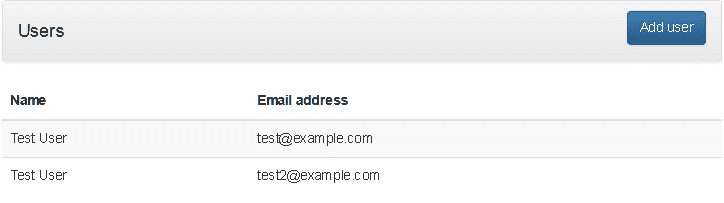
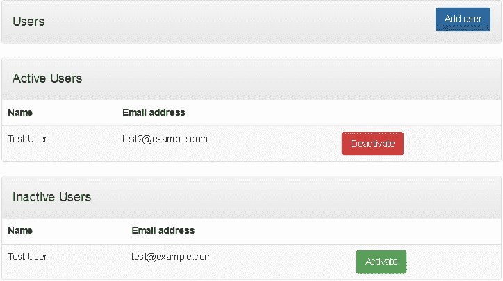

# 无需从头开始即可为应用程序添加用户验证和管理功能

> 原文：[`developer.ibm.com/zh/tutorials/cl-bluemix-manage-authenticate-users-php-passport-1/`](https://developer.ibm.com/zh/tutorials/cl-bluemix-manage-authenticate-users-php-passport-1/)

我发现每次编写新的 Web 应用程序时，有两个任务是必须完成的：创建一个可以添加、修改和删除用户的仪表板，实现一个登录/注销工作流。正如您所想象的，这两个任务在构建任何大小合理的应用程序时都无法避免……但它们已经实现了高度标准化且为人熟知，所以实现它们对大部分开发人员而言只是一种枯燥的例行工作。

在寻找更好（不那么乏味的）方法的过程中，我偶然发现了 IBM Cloud 的 Passport 服务集成，它让开发人员能将用户管理和身份验证的所有实现细节外包给外部 API。这大大减少了在开发新应用程序时需要编写（和测试）的代码量……而且，额外的好处是能快速实现“用户登录”功能，让您可以继续完成其他更重要的工作。

这个教程分两部分，我将介绍如何构建一个简单的 Web 应用程序并将其部署到 IBM Cloud 上。这个示例应用程序支持多用户，但我不会编写任何用户管理代码；相反，我将集成 IBM Cloud 的 Passport 服务，让它处理所有的麻烦工作。请继续阅读！

[在 GitHub 上获得代码](https://github.com/vvaswani/bluemix-user-api)

## 您需要做的准备工作

应用程序中的用户管理通常涉及到创建一个用户仪表板，使用该仪表板可添加新用户，编辑现有用户，以及激活、停用或删除用户帐户。通常还需要为用户提供一种登录到应用程序和从中注销的方法，以及允许用户访问某些功能前检查用户是否已通过验证。一些应用程序还有其他特性，比如基于角色的访问、用户概要文件，以及处理用户忘记密码和用户再激活的其他工作流。

**免费试用 IBM Cloud**

利用 [IBM Cloud Lite](https://cloud.ibm.com/registration?cm_sp=ibmdev-_-developer-tutorials-_-cloudreg) 快速轻松地构建您的下一个应用程序。您的免费帐户从不过期，而且您会获得 256 MB 的 Cloud Foundry 运行时内存和包含 Kubernetes 集群的 2 GB 存储空间。

在幕后，实现所有这些功能通常（至少）涉及到创建一个用户数据库，使用安全算法来加密和验证用户密码，以及编写 SQL 查询来创建、更新、删除和验证用户。有了 IBM Cloud 的 Passport 集成功能，无需创建用户数据库或编写 SQL；通过对 Passport 服务执行 API 调用即可完成所有这些任务。

因为 Passport API 符合 REST 规范，所以可使用任何编程语言访问它；在本文中我将使用 PHP。我还将使用 Bootstrap 创建一个移动优化的接口，使用 Slim PHP 微框架管理应用程序流，使用 Guzzle PHP 客户机访问 Passport API，使用 IBM Cloud 提供基础架构和托管服务。

开始前请确保您完成了所需的准备工作：

*   一个 IBM Cloud 帐户（[在此处注册](https://cloud.ibm.com/?cm_sp=ibmdev-_-developer-tutorials-_-cloudreg)）
*   一个 Passport 帐户（[在此处申请一个免费试用帐户](https://cleanspeak.com/docs/3.x/tech/getting-started/)）
*   基本熟悉 [Bootstrap](http://getbootstrap.com/) 和 [PHP](http://www.php.net/)
*   一个包含 [Apache](http://httpd.apache.org/)（具有 mod_rewrite 和 .htaccess 文件支持）的本地或托管 PHP 开发环境
*   [Composer](https://getcomposer.org/)（PHP 依赖项管理器）
*   [CloudFoundry 命令行工具](https://github.com/cloudfoundry/cli)
*   一个文本编辑器或 IDE

**备注：**任何使用 Passport 服务的应用程序都必须遵守 [Inversoft 许可协议](https://www.inversoft.com/license)。同样，任何使用 IBM Cloud 的应用程序都必须遵守[这里规定的](https://cloud.ibm.com/docs) IBM Cloud 使用条款。开始实施您的项目之前，花几分钟阅读一下这些要求，确保您的应用程序满足这些要求。

## 第 1 步：创建应用程序框架

第一步是使用 Slim PHP 微框架和 Guzzle PHP HTTP 客户机初始化一个基本应用程序。这些依赖项可以使用 Composer（PHP 依赖项管理器）轻松下载和安装。使用这个 Composer 配置文件，应该将它保存到 $APP_ROOT/composer.json（$APP_ROOT 是您的项目目录）：

```
{
    "require": {
        "slim/slim": "*",
        "slim/php-view": "*",
        "guzzlehttp/guzzle": "*"
    }
} 
```

接下来，使用 Composer 通过以下命令进行安装：

```
shell> php composer.phar install 
```

通过 Composer 下载必要的组件后，创建两个目录：$APP_ROOT/public 存放所有可通过网络访问的文件，$APP_ROOT/views 存放所有视图。

```
shell> cd myapp
shell> mkdir public views 
```

然后创建 $APP_ROOT/config.php 文件，其中包含以下信息（将在第 3 步填入占位符中的内容）：

```
<?php
$config = [
  'settings' => [
    'displayErrorDetails' => true, // disable for production
    'passport_api_key' => 'PASSPORT-API-KEY',
    'passport_api_url' => 'PASSPORT-API-URL',
    'passport_app_id'  => 'PASSPORT-APP-ID',
  ]
]; 
```

要使应用程序更容易访问，可在开发环境中定义一个名为 “myapp.localhost” 的新虚拟主机，并将它的文档根目录指向 $APP_ROOT/public。还应向 $APP_ROOT/public 目录添加一个 .htaccess 文件，其中包含以下设置：

```
<IfModule mod_rewrite.c>
  RewriteEngine On
  RewriteCond %{REQUEST_FILENAME} !-f
  RewriteCond %{REQUEST_FILENAME} !-d
  RewriteRule ^ index.php [QSA,L]
</IfModule> 
```

使用一个映射到 $APP_ROOT/public 目录的虚拟主机后，可以使用虚拟主机名直接访问应用程序的路由 — 例如，[`myapp.localhost/admin/users/index，而不是`](http://myapp.localhost/admin/users/index，而不是) [`localhost/public/admin/users/index。要进一步了解`](http://localhost/public/admin/users/index。要进一步了解) Slim 框架应用程序的虚拟主机和 Web 服务器配置，请参阅 [Slim 文档](https://www.slimframework.com/)、[针对 Apache 的 Slim 配置](http://www.slimframework.com/docs/v3/start/web-servers.html)和 [Composer 文档](https://getcomposer.org/)。

下一步是创建一个将初始化 Slim 框架的控制器脚本。它还包含对应用程序的路由的回调，每个回调定义了在该路由与一个传入请求匹配时要执行的代码。在 $APP_ROOT/public/index.php 上创建一个包含以下内容的脚本：

```
<?php
use \Psr\Http\Message\ServerRequestInterface as Request;
use \Psr\Http\Message\ResponseInterface as Response;
use GuzzleHttp\Client;
use GuzzleHttp\Exception\ClientException;

require '../vendor/autoload.php';
require '../config.php';

// configure Slim application instance
// initialize application
$app = new \Slim\App($config);

// initialize dependency injection container
$container = $app->getContainer();

// add view renderer
$container['view'] = function ($container) {
  return new \Slim\Views\PhpRenderer("../views/");
};

// index page handler
$app->get('/', function (Request $request, Response $response) {
  return $response->withHeader('Location', $this->router->pathFor('home'));
});

// public page handler
$app->get('/home', function (Request $request, Response $response) {
  return $this->view->render($response, 'home.phtml', [
    'router' => $this->router
  ]);
})->setName('home');

$app->run(); 
```

Slim 通过定义 HTTP 方法和端点的回调函数进行工作。要完成此任务，可调用相应的 Slim 方法 —`get()` 用于处理 GET 请求，`post()` 用于处理 POST 请求等 — 并传递要匹配的路由作为该方法的第一个参数。该方法的第二个参数是一个匿名函数，它指定了在路由与某个传入的请求相匹配时应执行的操作。

上述脚本设置两个处理程序（我们很快添加更多处理程序）。第一个是一种简单的重定向，它将对“/”路由的所有请求重定向到“/home”路由。第二个是“/home”路由本身，它呈现 $APP_ROOT/views/home.phtml 文件的内容。创建此文件并添加以下内容：

```
<!DOCTYPE html>
<html lang="en">
  <head>
    <meta charset="utf-8">
    <meta http-equiv="X-UA-Compatible" content="IE=edge">
    <meta name="viewport" content="width=device-width, initial-scale=1">
    <title>My App</title>
    <link rel="stylesheet" href="https://maxcdn.bootstrapcdn.com/bootstrap/3.3.5/css/bootstrap.min.css">
    <link rel="stylesheet" href="https://maxcdn.bootstrapcdn.com/bootstrap/3.3.5/css/bootstrap-theme.min.css">
    <!-- HTML5 shim and Respond.js for IE8 support of HTML5 elements and media queries -->
    <!-- WARNING: Respond.js doesn't work if you view the page via file:// -->
    <!--[if lt IE 9]>
      <script src="https://oss.maxcdn.com/html5shiv/3.7.2/html5shiv.min.js"></script>
      <script src="https://oss.maxcdn.com/respond/1.4.2/respond.min.js"></script>
    <![endif]-->
  </head>
  <body>

    <div class="container">
      <!-- header area -->
      <div class="panel panel-default">
        <div class="panel-heading clearfix">
          <h4 class="pull-left">Home</h4>
          <div class="btn-group pull-right">
            <a role="button" class="btn btn-primary" href="<?php echo $data['router']->pathFor('home'); ?>">Home</a>
          </div>
        </div>
      </div>
      <!-- end of header area -->

      <!-- content area -->
      <p>This is the home page. It is public and accessible to everyone.</p>
      <!-- end of content area -->

      <!-- footer -->
      <div class="container">
      </div>
      <!-- end of footer -->
    </div>

  </body>
</html> 
```

此模板包含一个基于 Bootstrap 的简单用户界面，该用户界面包含页眉、页脚和内容区域。所有后续页面也会使用这个基本模板，而且只有内容区域将更改。

要查看此模板的实际效果，可浏览到“/home”路由（[`myapp.localhost/home`](http://myapp.localhost/home) 或 [`localhost/public/home，具体取决于您是否使用虚拟主机），您应该看到上述模板的呈现效果：`](http://localhost/public/home，具体取决于您是否使用虚拟主机），您应该看到上述模板的呈现效果：)

##### 静态主页


## 第 2 步：创建用户注册表单

设置基本的应用程序框架后，可以开始构建应用程序的剩余部分了。实现用户管理功能的第一步是创建一个可注册新应用程序用户的表单，其中包含所需的最少字段。首先将以下代码添加到 $APP_ROOT/public/index.php，定义一个“/admin/users/save”路由和对应的回调函数：

```
<?php

// Slim application initialization - snipped

// user form handler
$app->get('/admin/users/save', function (Request $request, Response $response) {
  $response = $this->view->render($response, 'users-save.phtml', [
    'router' => $this->router
  ]);
  return $response;
})->setName('admin-users-save');

// other callbacks 
```

基本来讲，这段代码告诉 Slim 使用指定模板的内容来响应对 /admin/users/save URL 端点的 GET 请求。该模板位于 $APP_ROOT/views/users-save.phtml，应包含创建新用户所需的表单字段。以下是代码：

```
<div>
  <form method="post" action="<?php echo $data['router']->pathFor('admin-users-save'); ?>">
    <div class="form-group">
      <label for="fname">First name</label>
      <input type="text" class="form-control" id="fname" name="fname">
    </div>
    <div class="form-group">
      <label for="lname">Last name</label>
      <input type="text" class="form-control" id="lname" name="lname">
    </div>
    <div class="form-group">
      <label for="email">Email address</label>
      <input type="text" class="form-control" id="email" name="email">
    </div>
    <div class="form-group">
      <label for="password">Password</label>
      <input type="password" class="form-control" id="password" name="password">
    </div>
    <div class="form-group">
      <button type="submit" name="submit" class="btn btn-default">Save</button>
    </div>
  </form>
</div> 
```

简明扼要！它只需要用户的名字、姓氏、电子邮箱地址和密码。电子邮箱地址也在登录时用作唯一标识符。

在浏览器中访问“/admin/users/save”路由时，您应看到类似这样的界面：

##### 用户帐户创建表单


现在已完成了添加新用户的入口点。下一步是处理在表单中提交的数据，首先需要您配置 Passport 服务并将它与 IBM Cloud 集成。

## 第 3 步：配置 Passport 服务

要想开始使用 Passport API，需要 3 种信息：API 密钥、API URL 和应用程序 ID。要配置 IBM Cloud 服务实例，还需要您的 Passport 实例的后端 URL（通常与 API URL 相同）和前端 URL。可用以下方式收集这些信息：

*   首次注册 Passport 帐户时，会看到一个成功页面，其中包含 API URL、前端 URL 和后端 URL。如果您当时未记下它们，以后可从 [Inversoft 网站上的帐户页面](https://account.inversoft.com/account/)访问这些信息。这是该页面的示例：

##### Passport URL


*   在 Passport 设置过程中，Passport 设置向导会提示您设置一个 API 密钥。如果您当时未记下它，可以浏览到 Passport 前端 URL 并使用您的管理员帐户凭证登录。然后从“Settings -> API Keys”菜单中获取 API 密钥。这是该页面的示例：

##### Passport API 密钥


*   同样在设置过程中，向导会提示您设置第一个应用程序，并为您生成一个唯一的应用程序 ID。如果您当时未记下它，可以浏览到 Passport 前端 URL 并使用您的管理员帐户凭证登录。然后从“Settings -> Applications”菜单中获取应用程序 ID。

##### Passport 应用程序 ID


拥有所有必要信息后，在 IBM Cloud 上初始化一个新的 Passport 服务实例，方法是登录到您的 IBM Cloud 帐户，从仪表板单击 **Catalog** 按钮。从结果服务列表中，选择 **Application Services**，然后单击 **Passport**。输入 API 密钥、前端 URL 和后端 URL，然后单击 **Create** 按钮创建该服务。暂时保持不绑定该服务（第 8 步会将它与您的应用程序绑定）。

##### 在 IBM Cloud 上创建 Passport 服务


您最终希望将应用程序推送到 IBM Cloud 并使用已绑定服务实例的凭证将它连接到 Passport API，但是您的应用程序仍处于开发过程中。所以在此开发阶段中，可手动更新 $APP_ROOT/config.php 文件中的 API 密钥、API 端点和应用程序 ID，这样您可以从开发系统中使用 Passport API，然后将此配置文件导入您的 Slim 应用程序中。

有关更多信息，请参阅 [Passport IBM Cloud 服务文档](https://cloud.ibm.com/docs/services/Inversoft?topic=Inversoft-gettingstarted)和 [Guzzle 文档](http://guzzle.readthedocs.org/)。

## 第 4 步：处理用户注册

配置 API 密钥、API 文档和应用程序 ID 后，就可以开始处理通过第 2 步中的表单所提交的用户注册。首先，初始化 Guzzle HTTP 客户机并针对 Passport API 配置它，方法是将以下代码添加到 $APP_ROOT/public/index.php 中的回调函数的前面：

```
<?php

// Slim application initialization - snipped

// add Passport API client
$container['passport'] = function ($container) {
  $config = $container->get('settings');
  return new Client([
    'base_uri' => $config['passport_api_url'],
    'timeout'  => 6000,
    'verify' => false,  // set to true for production
    'headers' => [
      'Authorization' => $config['passport_api_key'],
    ]
  ]);
};

// other callbacks 
```

上面的代码使用 Slim 依赖注入容器来配置和准备要使用的 Guzzle 客户机。请注意，客户机配置为在每个请求中自动包含一个 `Authorization` 标头，该标头包含 API 密钥（来自您在上一步中更新的配置文件）。访问 Passport API 时，这是一个必要的身份验证步骤；如果缺少这个标头，系统会拒绝对 API 的访问。

提交表单后，会将其传递到一个表单处理器，后者接受并验证提交的表单，然后使用 Passport API 创建用户帐户。以下是应该添加到 $APP_ROOT/public/index.php 中的必要代码：

```
<?php

// Slim application initialization - snipped

// user form processor
$app->post('/admin/users/save', function (Request $request, Response $response) {
  // get configuration
  $config = $this->get('settings');

  // get input values
  $params = $request->getParams();

  // validate input
  if (!($fname = filter_var($params['fname'], FILTER_SANITIZE_STRING))) {
    throw new Exception('ERROR: First name is not a valid string');
  }

  if (!($lname = filter_var($params['lname'], FILTER_SANITIZE_STRING))) {
    throw new Exception('ERROR: Last name is not a valid string');
  }

  $password = trim(strip_tags($params['password']));
  if (strlen($password) < 8) {
    throw new Exception('ERROR: Password should be at least 8 characters long');
  }

  $email = filter_var($params['email'], FILTER_SANITIZE_EMAIL);
  if (filter_var($email, FILTER_VALIDATE_EMAIL) === false) {
    throw new Exception('ERROR: Email address should be in a valid format');
  }

  // generate array of user data
  $user = [
    'registration' => [
      'applicationId' => $config['passport_app_id'],
    ],
    'skipVerification' => true,
    'user'  => [
      'email' => $email,
      'firstName' => $fname,
      'lastName' => $lname,
      'password' => $password
    ]
  ];

  // encode user data as JSON
  // POST to Passport API for user registration and creation
  $apiResponse = $this->passport->post('/api/user/registration', [
    'body' => json_encode($user),
    'headers' => ['Content-Type' => 'application/json'],
  ]);

  // if successful, display success message
  // with user id
  if ($apiResponse->getStatusCode() == 200) {
    $json = (string)$apiResponse->getBody();
    $body = json_decode($json);
    $response = $this->view->render($response, 'users-save.phtml', [
      'router' => $this->router, 'user' => $body->user
    ]);
    return $response;
 }
});

// other callbacks 
```

此代码清单定义了一个回调函数来处理通过 POST 提交的表单。此代码涉及许多内容，让我们逐步分析一下：

*   回调函数首先收集各种输入参数 — 姓名、电子邮箱地址、密码 — 并使用各种验证器验证每个参数。发现无效输入后，会将它标记出来并抛出一个异常，以阻止进一步处理。
*   输入经过净化和验证后，会转换为一个包含两个主键的 PHP 数组。`registration` 键包含正在注册的用户的应用程序 ID；可从应用程序配置文件中获取该 ID。 `user` 键包含要创建的用户帐户的细节。然后使用 PHP 的 `json_encode()` 函数将这个 PHP 数组转换为 JSON 文档。
*   接下来，Guzzle 客户机采用 JSON 编码的文档，将一个 POST 请求发送到 Passport API 的 `/api/user/registration` 端点。这次 API 调用使用指定的电子邮箱地址、密码和其他细节在 Passport 服务中创建一个新用户，并将该用户链接到指定的应用程序。
*   如果成功，API 调用返回一个 JSON 文档，其中包含新用户记录以及相关的唯一标识符。然后系统解码该 JSON 文档并以模板变量的形式将其传回模板。

接下来更新 $APP_ROOT/views/users-save.phtml 上的模板，以检查返回的用户记录并显示一条成功消息，如下面这个经过修改的用户注册表单所示：

```
<div>
  <?php if (!isset($_POST['submit'])): ?>
  <form method="post" action="<?php echo $data['router']->pathFor('admin-users-save'); ?>">
    <div class="form-group">
      <label for="fname">First name</label>
      <input type="text" class="form-control" id="fname" name="fname">
    </div>
    <div class="form-group">
      <label for="lname">Last name</label>
      <input type="text" class="form-control" id="lname" name="lname">
    </div>
    <div class="form-group">
      <label for="email">Email address</label>
      <input type="text" class="form-control" id="email" name="email">
    </div>
    <div class="form-group">
      <label for="password">Password</label>
      <input type="password" class="form-control" id="password" name="password">
    </div>
    <div class="form-group">
      <button type="submit" name="submit" class="btn btn-default">Save</button>
    </div>
  </form>
<?php else: ?>
  <div class="alert alert-success">
    <strong>Success!</strong> The user with identifier <strong><?php echo $data['user']->id; ?></strong> was successfully created. <a role="button" class="btn btn-primary" href="<?php echo $data['router']->pathFor('admin-users-save'); ?>">Add another?</a>
  </div>
<?php endif; ?>
</div> 
```

要查看实际效果，可尝试通过该应用程序创建一个新用户。如果成功，您会看到一条类似下图的消息，其中包含新创建的用户帐户的 ID。

##### 创建新用户


## 第 5 步：列出用户

Passport API 在 `/api/user/search` 上包含一个用于搜索用户的 API，希望获取已在您的应用程序中注册的所有用户的列表时，该 API 就可以派上用场。要查看它的实际使用效果，可向 $APP_ROOT/public/index.php 添加一个路由和回调函数来调用这个 API 端点，如下所示：

```
<?php

// Slim application initialization - snipped

// user list handler
$app->get('/admin/users/index', function (Request $request, Response $response) {
  // get configuration
  $config = $this->get('settings');

  $apiResponse = $this->passport->get('/api/user/search', [
    'query' => ['queryString' => 'user.registrations.applicationId:' . $config['passport_app_id']]
  ]);

  if ($apiResponse->getStatusCode() == 200) {
    $json = (string)$apiResponse->getBody();
    $body = json_decode($json);
    $response = $this->view->render($response, 'users-index.phtml', [
      'router' => $this->router, 'results' => $body
    ]);
    return $response;
  }
})->setName('admin-users-index');

// other callbacks 
```

此回调函数调用 `/api/user/search` API 方法，以 JSON 文档的形式获取所有与当前应用程序相关的用户。然后将此文档转换为一个 PHP 数组并传递给视图脚本，该脚本在一个表中显示该数据。这是视图脚本的相关代码部分，应将它保存到 $APP_ROOT/views/users-index.phtml 中：

```
<?php if ($data['results']->total > 0): ?>
<table class="table table-striped">
  <thead>
    <tr>
      <th>Name</th>
      <th>Email address</th>
    </tr>
  </thead>
<?php foreach ($data['results']->users as $user): ?>
  <tr>
    <td><?php echo $user->firstName; ?> <?php echo $user->lastName; ?></td>
    <td><?php echo $user->email; ?></td>
  </tr>
<?php endforeach; ?>
</table>
<?php else: ?>
<div>
  <div class="alert alert-info">
    No users found. <a role="button" class="btn btn-primary" href="<?php echo $data['router']->pathFor('admin-users-save'); ?>">Why not create one?</a>
  </div>
</div>
<?php endif; ?> 
```

浏览“/admin/users/index”路由时，可以看到类似下图的界面：

##### 用户列表



## 第 6 步：启用登录和注销功能

现在您已经可以向应用程序中添加用户了。下一步是添加一种身份验证机制，以便能区分注册用户和未注册用户（而且可以仅向注册用户提供某些功能）。简言之，是时候添加一个登录工作流了。

Passport 提供了一个登录 API，可使用它通过已存储的凭证来验证用户。使用此 API 非常简单：向 `/api/login` 端点发送一个 POST 请求，该请求的 JSON 编码主体包含应用程序 ID、用户的电子邮箱地址和用户的密码。如果成功，该 API 将返回一个 2xx 响应代码；如果失败，则返回一个 4xx 响应代码。在两种情况下，可能出现多种响应代码，这取决于具体的场景。

以下是应该添加到 $APP_ROOT/public/index.php 中，用作对“/login”路由进行回调的必要代码：

```
<?php

// Slim application initialization - snipped

session_start();

// login page handler
$app->get('/login', function (Request $request, Response $response) {
  return $this->view->render($response, 'login.phtml', [
    'router' => $this->router
  ]);
})->setName('login');

// login form processor
$app->post('/login', function (Request $request, Response $response) {
  // get configuration
  $config = $this->get('settings');

  // set user record to false by default
  $user = false;

  try {
    // get input values
    $params = $request->getParams();

    // validate and sanitize input
    $email = filter_var($params['email'], FILTER_SANITIZE_EMAIL);
    if (filter_var($email, FILTER_VALIDATE_EMAIL) === false) {
      throw new Exception('ERROR: Email address should be in a valid format');
    }

    $password = trim(strip_tags($params['password']));
    if (empty($password)) {
      throw new Exception('ERROR: Password should not be an empty string');
    }

    // generate array of data for authentication
    $auth = [
      'applicationId' => $config['passport_app_id'],
      'loginId' => $email,
      'password' => $password,
    ];

    // authenticate
    $apiResponse = $this->passport->post('/api/login', [
      'body' => json_encode($auth),
      'headers' => ['Content-Type' => 'application/json'],
    ]);

    // if 2xx error, authentication successful
    // set user information in session
    if ($apiResponse->getStatusCode() == 200 || $apiResponse->getStatusCode() == 202) {
      $json = (string)$apiResponse->getBody();
      $body = json_decode($json);
      $_SESSION['user'] = $body->user;
      $user = $body->user;
    }
  } catch (ClientException $e) {
    // in case of a Guzzle exception
    // if 4xx, authentication error
    // bypass exception handler for login failure page
    // for other errors, transfer to exception handler as normal
    if (!($e->getResponse()->getStatusCode() >= 400 && $e->getResponse()->getStatusCode() < 500)) {
      throw new Exception($e->getResponse());
    }
  }
  return $this->view->render($response, 'login.phtml', [
    'router' => $this->router, 'user' => $user
  ]);
});

// other callbacks 
```

第一个处理程序接收对“/login”路由的 GET 请求，并返回一个登录表单（很快将看到此表单）。

第二个处理程序接收从登录表单提交的信息并进行检查，确保所提交的信息中包含有效的电子邮箱地址和密码。如果包含，则创建一个包含应用程序 ID、电子邮箱地址和密码的 JSON 文档，并通过 POST 将它发送到 `/api/login` 端点。

*   如果 API 返回 200 或 202 响应代码，则表明成功通过身份验证。响应中还将包含 JSON 格式的完整用户记录；系统解码该记录并将其与相应的代码一同传递到模板，放在一个名为 `$_SESSION['user']` 的会话变量中，以便在后续操作中使用它。
*   如果 API 返回 4xx 响应代码，则表明身份验证失败。通常，Guzzle 会自动将非 2xx 响应代码作为错误处理并将其转换为异常。在这个特定示例中，如果错误代码是 4xx 代码，回调会中断普通的异常处理过程，将控制权转交给登录页面模板，而不是普通的异常模板，以便显示一条自定义的失败消息。

除此之外，您还应创建一个登录模板，其中包含最初的登录表单，以及在登录后显示的登录成功和失败消息。以下是应保存为 $APP_ROOT/views/login.phtml 的代码：

```
<?php if (!isset($_POST['submit'])): ?>
<div>
  <form method="post" action="<?php echo $data['router']->pathFor('login'); ?>">
    <div class="form-group">
      <label for="email">Email address</label>
      <input type="text" class="form-control" id="email" name="email" value="">
    </div>
    <div class="form-group">
      <label for="body">Password</label>
      <input type="password" class="form-control" id="password" name="password">
    </div>
    <div class="form-group">
      <button type="submit" name="submit" class="btn btn-default">Submit</button>
    </div>
  </form>
</div>
<?php else: ?>
<div>
  <?php if ($data['user'] !== false): ?>
  <div class="alert alert-success">
    <strong>Success!</strong>.
  </div>
  <p>You are currently logged in as <strong><?php echo $data['user']->firstName; ?> <?php echo $data['user']->lastName; ?></strong> with email address <strong><?php echo $data['user']->email; ?></strong>.</p>
  <p>Visit the <a href="<?php echo $data['router']->pathFor('account'); ?>">account information page.</p>
  <?php else: ?>
  <div class="alert alert-danger">
    <strong>Failure!</strong> Please <a href="<?php echo $data['router']->pathFor('login'); ?>">try again</a>.
  </div>
  <?php endif; ?>
</div>
<?php endif; ?> 
```

此代码的大部分内容已在前面的段落中解释过。此模板包含一个登录表单，表单中包含电子邮箱地址和密码字段。提交时，根据 `$_SESSION['auth']` 模板变量的值，会显示一条成功消息或失败消息。如果登录成功，可以轻松地从会话变量中提取用户名、电子邮箱地址和其他细节，并在成功消息中显示它们。

这是登录表单的示例：

##### 用户登录


以下是登录成功后出现的界面示例：

##### 用户登录结果


就像需要一个“/login”路由一样，您还需要一个“/logout”路由。尽管 Passport API 包含一个 `/logout` 方法，但它仅在您使用刷新或访问令牌时有用。因为此应用程序不会也不需要显式地从 Passport 注销用户；相反，通过销毁应用程序范围内的会话变量就可简单地完成注销操作。以下是代码：

```
<?php

// Slim application initialization – snipped

// logout page handler
$app->get('/logout', function (Request $request, Response $response) {
  unset($_SESSION['user']);
  return $response->withHeader('Location', $this->router->pathFor('login'));
})->setName('logout');

// other callbacks 
```

## 第 7 步：实现身份验证检查

拥有用户验证途径后，可以非常轻松地保护特定页面，确保它们仅对已登录用户可见。以下是实现该功能的函数（将它添加到 $APP_ROOT/public/index.php 中其他回调处理程序的前面）：

```
<?php

// Slim application initialization - snipped

// simple authentication middleware
$authenticate = function ($request, $response, $next) {
  if (!isset($_SESSION['user'])) {
    return $response->withHeader('Location', $this->router->pathFor('login'));
  }
  return $next($request, $response);
};

// other callbacks 
```

`authenticate()` 函数检查会话中是否存在该用户标识符。如果该标识符不存在，它将用户重定向到 `/logout` URL，强制用户重新登录。此函数可用作 Slim “中间件”，也就是在处理一个请求之前运行的代码。通过将此中间件添加到特定的路由处理程序中，可保护人们对应用程序功能的访问，这样只有通过验证的用户才能访问它们。

例如，如果您只希望已登录的用户能访问帐户信息页，可以像平常一样为该页面创建一个回调处理程序，然后将上面的中间件附加到该回调后面。这是该代码的示例：

```
<?php

// Slim application initialization - snipped

// private page handler
$app->get('/account', function (Request $request, Response $response) {
  return $this->view->render($response, 'account.phtml', [
    'router' => $this->router, 'user' => $_SESSION['user']
  ]);
})->setName('account')->add($authenticate);

// other callbacks 
```

有了这个中间件，系统会将尝试访问“/account”路由的未经验证的用户重定向到登录页，而通过验证的用户能正常访问它。

## 第 8 步：启用用户激活和停用功能

Passport API 的一个重要功能是它对用户激活和停用的内置支持。在希望临时暂停一个用户的帐户，但不实际删除该帐户时，停用功能可派上用场。已停用的用户在重新激活其帐户之前无法登录进入系统。

Passport API 通过同一个 API 端点执行激活和停用，并使用 HTTP 方法本身来表示要执行的操作。通过向 `/api/user/USER_ID` 端点发送一个 DELETE 请求来完成停用操作，而再激活涉及到向该端点发送一个 PUT 请求，其中包含额外的再激活参数。在这两种情况下，API 请求都应包含来自 Passport 的唯一用户标识符。

要查看实际效果，可将以下回调处理程序添加到 $APP_ROOT/public/index.php：

```
<?php

// Slim application initialization - snipped

// user deactivation handler
$app->get('/admin/users/deactivate/{id}', function (Request $request, Response $response, $args) {
  // sanitize and validate input
  if (!($id = filter_var($args['id'], FILTER_SANITIZE_STRING))) {
    throw new Exception('ERROR: User identifier is not a valid string');
  }

  $apiResponse = $this->passport->delete('/api/user/' . $id);
  return $response->withHeader('Location', $this->router->pathFor('admin-users-index'));
})->setName('admin-users-deactivate');

// user activation handler
$app->get('/admin/users/activate/{id}', function (Request $request, Response $response, $args) {
  // sanitize and validate input
  if (!($id = filter_var($args['id'], FILTER_SANITIZE_STRING))) {
    throw new Exception('ERROR: User identifier is not a valid string');
  }

  $apiResponse = $this->passport->put('/api/user/' . $id , [
    'query' => ['reactivate' => 'true']
  ]);
  return $response->withHeader('Location', $this->router->pathFor('admin-users-index'));
})->setName('admin-users-activate');

// other callbacks 
```

两个处理程序首先检查路由请求中是否包含用户标识符，如果包含，则向 Passport API 生成一个 DELETE 或 PUT 请求来停用或再激活该用户。

如何触发这些路由？最轻松的方法是向第 5 步中创建的用户列表页面添加命令按钮，每个按钮链接到合适的路由。也可以对用户列表分类，将活跃用户与停用用户分开，以便在每个用户旁边显示合适的按钮。以下是经过修改的列表页面处理程序代码：

```
<?php

// Slim application initialization - snipped

$app->get('/admin/users/index', function (Request $request, Response $response) {
  // get configuration
  $config = $this->get('settings');

  $apiResponse = $this->passport->get('/api/user/search', [
    'query' => ['queryString' => 'user.registrations.applicationId:' . $config['passport_app_id']]
  ]);

  if ($apiResponse->getStatusCode() == 200) {
    $json = (string)$apiResponse->getBody();
    $body = json_decode($json);

    $activeUsers = [];
    $inactiveUsers = [];
    foreach ($body->users as $user) {
      if ($user->active == 1) {
        $activeUsers[] = $user;
      } else {
        $inactiveUsers[] = $user;
      }
    }

    $response = $this->view->render($response, 'users-index.phtml', [
      'router' => $this->router, 'active-users' => $activeUsers, 'inactive-users' => $inactiveUsers
    ]);
    return $response;
  }
})->setName('admin-users-index');

// other callbacks 
```

这个路由处理程序的开头与之前相同：它使用 `/api/user/search` 端点返回该应用程序的所有已注册用户列表。然后迭代所返回的集合，根据帐户状态将用户分到两个数组中。然后将这些数组传递给页面模板，该模板负责格式化它们并在用户的旁边显示合适的按钮。

修改 $APP_ROOT/views/users-index.phtml 上的模板以包含新信息和按钮：

```
<?php if (count($data['active-users']) > 0): ?>
<div class="panel panel-default">
  <div class="panel-heading clearfix">
    <h4 class="pull-left">Active Users</h4>
  </div>
  <table class="table table-striped">
    <thead>
      <tr>
        <th>Name</th>
        <th>Email address</th>
        <th></th>
      </tr>
    </thead>
  <?php foreach ($data['active-users'] as $user): ?>
    <tr>
      <td><?php echo $user->firstName; ?> <?php echo $user->lastName; ?></td>
      <td><?php echo $user->email; ?></td>
      <td><a href="<?php echo $data['router']->pathFor('admin-users-deactivate', array('id' => $user->id)); ?>" class="btn btn-danger">Deactivate</a></td>
    </tr>
  <?php endforeach; ?>
  </table>
</div>
<?php else: ?>
<div>
  <div class="alert alert-info">
    No users found. <a role="button" class="btn btn-primary" href="<?php echo $data['router']->pathFor('admin-users-save'); ?>">Why not create one?</a>
  </div>
</div>
<?php endif; ?>

<?php if (count($data['inactive-users']) > 0): ?>
<div class="panel panel-default">
  <div class="panel-heading clearfix">
    <h4 class="pull-left">Inactive Users</h4>
  </div>
  <table class="table table-striped">
    <thead>
      <tr>
        <th>Name</th>
        <th>Email address</th>
        <th></th>
      </tr>
    </thead>
  <?php foreach ($data['inactive-users'] as $user): ?>
    <tr>
      <td><?php echo $user->firstName; ?> <?php echo $user->lastName; ?></td>
      <td><?php echo $user->email; ?></td>
      <td><a href="<?php echo $data['router']->pathFor('admin-users-activate', array('id' => $user->id)); ?>" class="btn btn-success">Activate</a></td>
    </tr>
  <?php endforeach; ?>
  </table>
</div>
<?php endif; ?> 
```

这是该模板的示例：

##### 用户列表



## 第 9 步：部署到 IBM Cloud

现在应用程序已拥有合理数量的功能，是时候将它部署到 IBM Cloud，并绑定到您在第 3 步中创建的 Passport 服务实例了。首先，创建应用程序清单文件，务必记得通过附加一个随机字符串（比如您姓名的首字母）来获得唯一的主机和应用程序名称。

```
---
applications:
- name: myapp-[initials]
memory: 256M
instances: 1
host: myapp-[initials]
buildpack: https://github.com/cloudfoundry/php-buildpack.git
stack: cflinuxfs2 
```

还必须配置该 buildpack 来使用该应用程序的 public 目录作为 Web 服务器目录。创建一个包含以下内容的 $APP_ROOT/.bp-config/options.json 文件：

```
{
    "WEB_SERVER": "httpd",
    "PHP_EXTENSIONS": ["bz2", "zlib", "curl"],
    "COMPOSER_VENDOR_DIR": "vendor",
    "WEBDIR": "public",
    "PHP_VERSION": "{PHP_56_LATEST}"
} 
```

通常，您可能还希望从 IBM Cloud 自动获取 Passport 服务的服务凭证。这样，您无需更新应用程序代码库就可以修改服务密码，或者断开/重连新服务实例。为此，首先更新代码以使用 IBM Cloud 的 `VCAP_SERVICES` 变量：

```
<?php

// Slim application initialization - snipped

// if BlueMix VCAP_SERVICES environment available
// overwrite local config file with credentials from BlueMix
if ($services = getenv("VCAP_SERVICES")) {
  $services_json = json_decode($services, true);
  $config['settings']['passport_api_key'] = $services_json["user-provided"][0]["credentials"]["api_key"];
  $config['settings']['passport_api_url'] = $services_json["user-provided"][0]["credentials"]["passport_backend_url"];
  if (getenv("passport_app_id")) {
    $config['settings']['passport_app_id'] = getenv("passport_app_id");
  }
}

// other callbacks 
```

注意，上述代码从 IBM Cloud `VCAP_SERVICES` 变量获取 Passport API 密钥和 API URL。VCAP_SERVICES 是一个特殊的环境变量，存储了已绑定服务的连接细节。您应该还记得，在第 3 步中初始化 Passport 服务实例时添加了这些值。

还要注意，该代码尝试从 IBM Cloud 应用程序的环境中的一个自定义变量获取 Passport 应用程序 ID。这是将 ID 存储在配置文件中的一个不错替代方案，稍后我将介绍如何设置这个自定义变量。

现在，继续将该应用程序推送到 IBM Cloud，然后绑定前面已初始化的 Passport 服务。请记得对该服务实例使用正确的 ID，以确保将正确的实例绑定到该应用程序。可以从 IBM Cloud 仪表板的服务实例页面中获取服务 ID。

```
shell> cf api https://api.ng.bluemix.net
shell> cf login
shell> cf push
shell> cf bind-service myapp-[initials] "Passport-[id]" 
```

添加一个自定义变量来保存您的 Passport 应用程序 ID：

```
shell> cf set-env myapp-[initials] passport_app_id APP_ID 
```

完成后，对应用程序执行 restage 操作，让更改生效：

```
shell> cf restage myapp-[initials] 
```

您现在应该能够浏览到 [http://myapp-[initials].mybluemix.net](http://myapp-[initials].mybluemix.net) 上的应用程序并看到欢迎页面。如果不能，请访问本节顶部的链接，了解关于如何获取调试日志的信息。（有关更多信息，请参阅[在 IBM Cloud 上调试 PHP 错误](http://vikram-vaswani.in/weblog/2015/03/19/debugging-php-errors-on-ibm-bluemix/)。）

## 结束语

本文已经证明，IBM Cloud 的 Passport 服务让您能轻松地向应用程序添加用户验证和管理功能，而您无需从头开始编写代码。这可以加快开发工作，让您有更多时间专注于构建应用程序更为独特的方面。

但是，您在这里看到的只是冰山一角。Passport API 还提供了许多其他有用的特性：修改和删除用户帐户，存储自定义用户概要文件属性，支持用户角色，以及提供易于使用的工作流来处理忘记密码的情况。我将在第 2 部分介绍所有这些特性 — 所以一定不要错过！

本文翻译自：[Add user authentication and management to your application without starting from scratch](https://developer.ibm.com/tutorials/cl-bluemix-manage-authenticate-users-php-passport-1/)（2017-07-24）