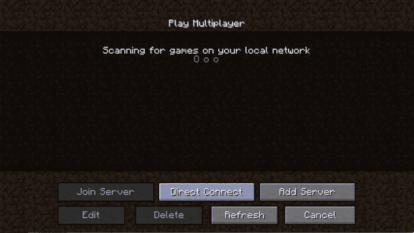
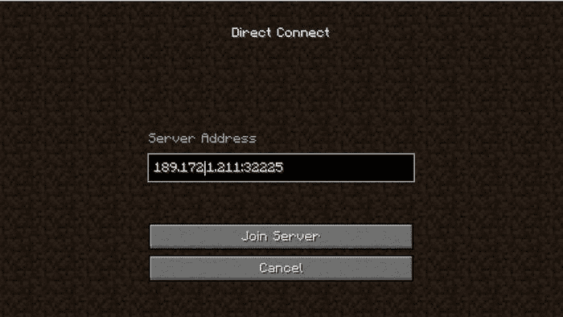

# Archived | 在 Kubernetes 中运行 Spigot 服务器

> 原文：[`developer.ibm.com/zh/tutorials/minecraft-and-ibm-cloud-part-3/`](https://developer.ibm.com/zh/tutorials/minecraft-and-ibm-cloud-part-3/)

**本文已归档**

**归档日期：:** 2019-12-09

此内容不再被更新或维护。 内容是按“原样”提供。鉴于技术的快速发展，某些内容，步骤或插图可能已经改变。

在[第 2 部分](https://www.ibm.com/developerworks/cn/cloud/library/cl-bluemix-minecraft-plugins-trs-2/)中，我们展示了如何在 Eclipse 中为 Spiget 服务器构建插件，以及如何在 Docker 安装中本地测试这些插件。现在，我们已经准备好进行下一个重要步骤：使用您刚刚开发的 Spiget 服务器，并将其部署到 IBM Cloud 中的云环境中。

为了帮助您理解如何实现这一步，我们需要首先介绍 Docker 文件如何在 IBM Cloud 中运行，这需要稍微解释一下 IBM Cloud Kubernetes Service 所依赖的技术：Kubernetes。

## 什么是 Kubernetes？

在第 1 部分和第 2 部分中，您了解了 Docker 如何为运行容器提供环境。但有时，光有容器是不够的（实际上经常如此）。当您实施由多个部件（如 Web 服务器、应用服务器和数据库等）构成的更复杂应用程序时，您需要一种方法来指定这些部件如何相互关联。此外，您需要一种方法将这些组件作为一个综合应用程序一起部署。

容器行业将此称为**编排**，也就是能够将多个容器的部署和管理作为一个统一的整体进行协调。另外，关于将容器作为生产应用程序的一部分运行，还有一些我们没有考虑到的其他问题。包括扩展（应该运行特定服务器的多少个副本）、负载平衡、网络等等。Kubernetes 解决了所有这些问题以及其他问题。为了了解它有哪些功能，我们需要定义一些与 Kubernetes 相关的术语。

## 集群、Pod、服务和部署

我们需要介绍的第一个 Kubernetes 概念是**集群**。Kubernetes 中的集群是指一组运行 Kubernetes 的不同部分的机器或虚拟机。集群被划分为一个*主*节点以及一个或多个*工作*节点，主节点负责集群的管理，工作节点实际运行您的应用程序。所有这些不同的节点都运行 Docker；记住，这是跨多台计算机运行 Docker 时的解决方案！

我们之所以这么做，是因为我们想要创建 **Pod**。Pod 是指您希望一起运行的一组逻辑上相互连接的容器。（为什么称为“Pod”？一群鲸鱼叫做 pod（小型鲸群），Docker 的徽标就是一条鲸鱼。鲸群中的所有鲸鱼都待在一起，沿着同一个方向游向同一个目的地。）就我们的目的而言，Pod 中的容器通过共享 IP 地址甚至共享存储等方式连接在一起。

在我们深入研究代码之前，您应该了解的最后一个概念是**部署**。将部署看作一个文件，该文件描述如何创建 Pod，以及如何将这些 Pod 链接到服务和 ReplicaSet，并设置它们的状态。**服务**是一个或多个 Pod 的集合，它们构成了一个内聚逻辑单元。服务是将特定服务的客户端（比如 Minecraft 客户端！）需要了解的细节从 Pod 组合方式的实现细节中分离出来。最后，ReplicaSet 是 Kubernetes 使用的一种机制，用来确定要运行多少个 Pod 的副本，以及在其中一个或多个副本失败的情况下要采取的操作。

## 创建集群

如果这些就是 Kubernetes 的功能，您要如何使用呢？第一步是创建一个新的 Kubernetes 集群。现在，Kubernetes 可以在本地计算机上运行（参阅 [minikube](https://kubernetes.io/docs/setup/minikube/)），但我们在这里不会采用这种方法。我们希望在 IBM Cloud 中的 Kubernetes 中运行我们的 Docker 容器，为此，我们需要使用 IBM Cloud Kubernetes Service 提供的服务。

IBM Cloud Kubernetes Service 允许您在 IBM Cloud 中创建自己的 Kubernetes 集群。现在，回想一下我们如何定义 Kubernetes 集群的各个部分。集群由一个*主*节点以及一个或多个*工作*节点组成。在 IBM Cloud Kubernetes Service 中，您可以创建两种类型的集群，区别在于可以包含工作节点的数量以及节点的计费方式。

允许每个帐户在 IBM Cloud Kubernetes Service 服务中创建一个免费的*Lite*集群。Lite 集群是一个预先设置了大小的单工作集群，适于开发和简单实验，就像我们使用 Minecraft 所做的那样。如果您要进行更复杂的多主机应用程序开发，或者更重要的，部署具备连续性且能够在损失一个或多个工作节点的情况下生存下来的应用程序，那么您需要在 IBM Cloud Kubernetes Service 中部署一个*标准*群集。此操作超出了本教程的范围，但是您应该通过阅读有关该主题的[文档](https://cloud.ibm.com/docs/containers/container_index.html#container_index)来了解更多内容。无论任何情况，IBM 都可以通过以相同方式创建*主*节点来处理管理部分。本教程稍后将重点介绍这一点。

让我们首先来创建免费的 Lite 集群。现在，这组指示信息假设您已经遵循了我们在本系列教程的[第 1 部分](https://www.ibm.com/developerworks/cn/cloud/library/cl-bluemix-minecraft-docker-trs-1/)中提到的 IBM Cloud 命令行工具和 IBM Cloud Kubernetes Service 插件的安装说明。同时还假设您还没有创建用于开发的免费 Kubernetes Lite 集群。

首先，登录到 Ubuntu 操作系统，打开一个终端，然后输入以下三个命令：

```
 bx login ‑a api.ng.bluemix.net

bx cs init ‑‑host https://us‑south.containers.bluemix.net

bx cs cluster‑create —name Minecraft 
```

第一步就是登录到 IBM Cloud。系统将提示您输入您的 IBM Cloud 用户 ID 和密码。如果您使用的是连锁 ID（如果您有 IBM Cloud 的企业帐户，或者如果您是 IBM 员工，那么这种情况很常见），请遵循[此处](https://cloud.ibm.com/docs/cli/reference/ibmcloud_cli/bx_cli.html#bluemix_login)说明的使用一次性登录的步骤。

下一步是初始化集群服务。这是一次性步骤，在这个步骤中，您将告诉 IBM Cloud 您希望以物理方式创建集群的位置。截止到本教程撰写时，您可以选择在美国南部（达拉斯）、欧洲中部（法兰克福）、欧洲南部（伦敦）或亚太地区南部（悉尼）运行集群。如果您居住的地方临近后三个地区中的任何一个，请在 `-host` 后面酌情替换以下地址之一：

*   [`eu-central.containers.bluemix.net`](https://eu-central.containers.bluemix.net)
*   [`uk-south.containers.bluemix.net`](https://uk-south.containers.bluemix.net)
*   [`ap-south.containers.bluemix.net`](https://ap-south.containers.bluemix.net)

最后一步是创建集群。因为我们仅提供了一个选项 (`–name`)，这告诉 IBM Cloud 创建一个 Lite 集群。您可以将集群命名为任何您喜欢的名称，但是在本系列的其余部分中，我们将使用“Minecraft”这个名称。

**注意：**创建 Kubernetes 集群可能需要一段时间（几分钟或更长的时间）。要确定集群是否已经准备就绪，可以发出以下命令：

```
 bx cs clusters 
```

在 Lite 集群上运行该命令的结果如下所示：

```
 Listing clusters...
OK
Name        ID        State      Created                Workers   Datacenter   
Minecraft   XXXXXXX   normal   2017‑07‑19T01:36:50+0000   1         hou02 
```

如果“State”结果不是“normal”（例如，“pending”），那么您应该等待几分钟，然后再次发出命令。一旦集群处于“normal”状态，您就可以继续下一步，也就是配置集群并在本地计算机上设置 kubectl（用于管理 Kubernetes 集群的命令行界面），以便能够访问集群。

```
 bx cs cluster‑config Minecraft 
```

此命令可下载 YML 文件，该文件允许计算机上的 kubectl 访问集群。运行此命令后，您应该会看到如下所示的输出：

```
 Downloading cluster config for Minecraft
OK
The configuration for Minecraft was downloaded successfully.Export environment variables to start using Kubernetes.

export KUBECONFIG=/home/kylebrown/.bluemix/plugins/container‑service/clusters/Minecraft/kube‑config‑hou02‑Minecraft.yml 
```

接下来，您需要选择最后一行（从 `export` 开始），将其复制到您的粘贴缓冲区中，然后在命令行执行（从粘贴缓冲区粘贴它，然后按回车键）。使用以下命令，验证您的操作是否正确：

```
 echo $KUBECONFIG 
```

然后将返回的值与通过 `cluster-config` 命令返回的 `KUBECONFIG` 环境变量的值进行比较。作为最后的验证步骤，运行以下命令：

```
 kubectl version —short 
```

如果您看到类似如下内容：

```
 Client Version: v1.6.4
Server Version: v1.5.6‑4+abe34653415733 
```

那么表示您正确执行了配置。另一方面，如果看到错误消息，尝试复制和重新导出环境变量。

## 安装容器注册表插件

下一步是安装容器注册表插件。容器注册表只是一个位置，您可以在其中安全地存储镜像，以便 Docker 在 Kubernetes 中使用。IBM Cloud 容器注册表“免费”计划的大小上限为 512MB，这足够存储您要构建的 Minecraft 镜像。执行以下两个命令，来安装该插件：

```
 bx plugin install container‑registry ‑r IBM Cloud
sudo bx cr login 
```

正如您在[第 1 部分](https://www.ibm.com/developerworks/cn/cloud/library/cl-bluemix-minecraft-docker-trs-1/)中看到的，如果您已安装了 Kubernetes 集群服务插件，那么第一个命令将安装容器注册表插件，并将注册表设置为 IBM Cloud 的缺省注册表。

第二个命令让您登录到容器注册表，并允许您使用在您的计划中预留的空间。在这种情况下，您将使用容器注册表的“免费”计划。但是该计划有一个缺点：为每个用户分配多少磁盘空间大小是非常有限的，您只能在云中存储 512MB，这只能存储一个基于 Ubuntu 镜像构建的微型镜像。实际上，您必须对您的 Dockerfile 进行一些更改，从而将镜像缩减到适合的大小。我们将在后面的一节中介绍这些更改的内容以及产生的影响。

## 使用容器注册表

不过，就目前而言，您首先需要使用容器注册表插件创建一个**名称空间**。名称空间类似于镜像文件夹。在本例中，您将创建一个与 IBM Cloud 用户名相同的名称空间。因此，如果您登录 IBM Cloud 的用户名是“yourname@yourcompany.com”，那么您将使用的名称就是“yourname”。在下面的尖括号中替换您的用户名，执行以下两个命令：第一个命令创建名称空间，第二个命令列出名称空间的集合，并允许您验证是否成功创建了名称空间。

```
 bx cr namespace‑add <yourname>
bx cr namespaces 
```

现在您已经验证了您的名称空间已正确创建，您需要构建一个具有正确名称或“标记”的本地镜像。然而，在执行此操作之前，让我们重新考虑我们必须对 Dockerfile 所做的修改，以缩减其大小。

现在，您可以继续构建第一个示例并将其推送到 IBM Cloud。如果您尚未执行此操作，将目录更改为 spigot-plugin-bluemix 目录。

```
 cd spigot‑plugin‑bluemix 
```

现在，输入以下命令来查看在该目录中找到的 Dockerfile：

```
 cat Dockerfile 
```

文件的内容应该与您在下面的清单中看到的内容相匹配。您还可以将其与[第 2 部分](https://www.ibm.com/developerworks/cn/cloud/library/cl-bluemix-minecraft-plugins-trs-2/)中的 Dockerfile 进行比较，以便参考。

```
 #Version 0.0.4
#This version builds a spigot server
#using the recommended build strategy for spigot
#This is advantageous in that it’s better for plugin development
#and fits well with the Docker approach
#it also adds a first Minecraft plugin into the bare spigot server
#
FROM ubuntu:16.04
MAINTAINER Kyle Brown “brownkyl@us.ibm.com”
RUN apt‑get update &&
    apt‑get install ‑y git &&
    apt‑get install ‑y default‑jdk &&
    apt‑get install ‑y wget &&
    mkdir minecraft &&
    wget "https://hub.spigotmc.org//jenkins/job/BuildTools/lastSuccessfulBuild/artifact/target/BuildTools.jar" ‑O minecraft/BuildTools.jar &&
    git config ‑‑global core.autocrlf input &&
    java ‑jar minecraft/BuildTools.jar ‑‑rev 1.12 &&
    rm ‑r Bukkit &&
    rm ‑r CraftBukkit &&
    rm ‑r Spigot &&
    rm ‑r BuildData &&
    rm ‑r apache‑maven‑3.2.5 &&
    rm ‑r work &&
    rm craftbukkit‑1.12.jar &&
    rm ‑r minecraft &&
    apt‑get purge ‑y ‑‑autoremove git wget
RUN echo "eula=true" > eula.txt &&
    mkdir plugins
ADD Tutorial.jar /plugins/Tutorial.jar
CMD java ‑Xms512m ‑Xmx1024m ‑jar spigot‑1.12.jar nogui
EXPOSE 25565 
```

在这个文件中，您首先会注意到，我们将 Dockerfile 中很多以前单独的 `RUN` 命令组合在一起，形成一个非常长的 `RUN` 命令。为实现此目的，我们采用标准 UNIX shell 脚本技巧：利用 `&&` 运算符将命令连接在一起。然后您会注意到，与[第 2 部分](https://www.ibm.com/developerworks/cn/cloud/library/cl-bluemix-minecraft-plugins-trs-2/)不同，在构建 Spigot JAR 文件之后，我们添加了一些命令以通过递归移除 (`rm –r`) 命令删除一些目录。最后，您将看到，我们还移除了在安装开始时安装的 git 和 wget 工具（BuildTools.jar 需要这两个工具）。

所有这些操作都是为了节省空间。组合命令可以减少 Docker 镜像中的**层**的数量。将层看作是一个不变的完整虚拟文件系统；您可以在一个层上面构建另一个层，但是一旦构建了某个层，就不能更改其内容。版本控制系统中的源代码版本的存储方式可能与此类似，一旦您提交了一个更改，它将永远存在，但是您始终可以在这个层上进行另一个更改。

使用 Docker，一旦向镜像添加了一个层，该层使用的任何磁盘空间都将被永久占用。每个 Dockerfile 命令都会创建一个新层，您可能在观察 Docker `build` 命令的输出时已经注意到了这一点。因此，即使您尝试删除 BuildTools.jar 使用的工作目录（例如 CraftBukkit、Bukkit 和 Spigot），如果您试图在稍后的层中删除这些目录，也不会节省任何磁盘空间。因此，要缩减镜像的大小，Docker 的常见最佳做法是将 `RUN` 命令组合成一个包含安装、执行和清理的长命令。

现在您已经看到了新的 Dockerfile，可以使用了。您可以通过执行前几个教程中熟悉的命令来实现，但这次是使用一个更长的标记。注意，您将在标记前面加上 IBM Cloud 注册表的地址，然后添加名称空间，最后添加镜像名称（需遵循我们在前面教程中采用的约定的名称）。

在命令行中执行此命令以继续，与之前一样，不要忘记结尾的句点 (“`.`”)！

```
 sudo docker build ‑t registry.ng.bluemix.net/<yourname>/spigot‑plugin‑bluemix . 
```

现在您的镜像已经构建，您需要将镜像上载或**推送**到 IBM Cloud 容器注册表。您可以使用 docker `push` 命令来完成，如下所示：

```
 sudo docker push registry.ng.bluemix.net/<yourname>/spigot‑plugin‑bluemix 
```

执行此命令可能需要几分钟，具体取决于您的网速。要验证您的镜像是否已成功推送，使用以下命令，并在列表中查找您的新镜像名称：

```
 bx cr image‑list 
```

## 了解配置文件

正如我们在本教程开始时所说的，*部署*是一个配置文件，描述了 *Pod* 的结构以及如何链接到*服务*。在这种情况下，文件格式是 YML,而不是 Dockerfile 格式。我在这里不详细介绍如何构造部署文件，但是我将在这个示例文件中指出一些相关的细节。有关文件格式和元素列表的更多信息，请参阅 [Kubernetes 文档](https://kubernetes.io/docs/home/)。请阅读下面的文件（名为 deploy.yml，也位于 spigot-plugin-bluemix 目录中），然后我们将突出显示其中的几个特定部分：

```
 apiVersion: extensions/v1beta1
kind: Deployment
metadata:
  name: spigot
spec:
  replicas: 1
  template:
    metadata:
      labels:
        app: spigot
    spec:
      containers:
      ‑ name: spigot
        image: registry.ng.bluemix.net/brownkyl/spigot‑plugin‑bluemix
‑‑‑
apiVersion: v1
kind: Service
metadata:
  name: spigot‑service
  labels:
    run: spigot
spec:
  selector:
    app: spigot
  type: NodePort
  ports:
   ‑ protocol: TCP
     port: 25565 
```

关于这个文件，最值得注意的是有两个部分，用虚线“`---`”分隔开。第一节描述了部署本身，它创建了一个单独的 Pod（如 `replicas: 1` 所示），其中仅包含我们的 spigot-plugin-bluemix 镜像。

第二部分描述了您正在创建的服务（用于向外部公开 Pod）。在这种情况下，您使用的是绝对最简单的公开类型，称为 **NodePort**。NodePort 是将请求路由到特定端口的一种方式，在本例中是端口 25565（由 Docker 镜像公开的端口）。

要路由到 Pod 中的镜像，有很多更灵活、更复杂的方式。您在这里所做的工作适合您的测试目的，但对于实际的生产应用程序来说，它有一些缺点。特别是，如果 Docker 镜像失败（因为它很容易失败！），那么 NodePort 没有任何机制能够将流量重定向到 Pod 的另一个实例。同样，也没有任何机制能够将流量路由到同一个 Pod 的两个或更多个实例，不具备可扩展性。这些功能由更复杂的路由选项提供，比如 Ingress Controller，但这超出了本系列教程的范围。（如果您有兴趣学习如何执行该操作，请查看 [Kubernetes 文档](https://kubernetes.io/docs/home/)。）

不过，在此期间，您终于准备好部署您的第一个 Kubernetes 服务了！

## 部署 Pod 和服务

现在您已经看到了 deploy.yml 文件的内容，您可以了解执行该部署时将创建哪些内容。可以通过在 kubectl 中执行 `create` 命令来创建部署。在命令行中执行以下命令以创建部署：

```
 kubectl create ‑f deploy.yml 
```

现在，有时创建部署可能会因为某种原因而失败。如果您的 deploy.yml 文件有错误，或者如果您未能将镜像部署到与部署文件中的名称匹配的正确注册表名称，可能就会遇到问题。如果发生这种情况，您可以使用以下方法进行清理：

```
 kubectl delete ‑f deploy.yml ‑‑all 
```

然后您可以重新发出 `kubectl create` 命令来尝试重新创建 Pod 和服务，如上所示。

## 测试服务器

您即将完成本次实验！现在您已经部署了您的 Pod 并创建了服务来访问该 Pod，您可以了解如何从外部访问该 Pod。NodePort 将在 Kubernetes 集群中的每个工作节点中公开一个端口。在 IBM Cloud Kubernetes Service 的 Free 层中，只有一个工作节点，因此当您发出以下命令时，应该只看到一个 IP 地址：

```
 bx cs workers Minecraft 
```

运行此命令时，结果应如下所示：

```
 Listing cluster workers...
OK ID Public IP Private IP  Machine Type   State Status   
kube‑hou02‑pa223babd2966d473cb031e7812024ce52‑w1   189.172.1.211   10.76.193.152   free    normal   Ready 
```

确保复制上面看到的 `Public IP` 地址（例如，189.172.1.211）。现在您已经知道了正在运行 Minecraft spigot 服务器的 IP 地址，您需要确定 NodePort 服务将哪一个端口重定向到镜像中的 25565 端口。您可以通过在命令行中发出此命令来确认：

```
 kubectl get svc 
```

发出此命令时，应该会看到如下所示的结果：

```
 NAME       CLUSTER‑IP   EXTERNAL‑IP       PORT(S)           AGE
kubernetes          10.10.10.1   <none>      443/TCP           14d
spigot‑service   10.10.10.217 <nodes>     25565:32225/TCP   8m 
```

与上一步骤中一样，复制第二个 `PORT`（冒号后面的那个；在本例中为 32225）。这是您现在将在 Minecraft 客户端中使用的 ip:port 的组合。

## 测试客户端

测试服务器的过程与第 1 部分和第 2 部分中的过程基本相同。您可以使用 Minecraft 客户端中的 “Direct Connect” 选项来测试其是否有效。登录 Minecraft，选择“Multiplayer”，然后单击 **Direct Connect** 按钮：



完成后，Minecraft 就会弹出一个屏幕，询问您的服务器地址。使用工作程序的公共 IP 与前面步骤中的路由端口的组合，如下所示：



输入地址和端口后，单击 **Join Server**，您应该能够连接到 Minecraft 服务器并能看到您的虚拟世界！

## 结束语

在本教程中，您学习了完成以下操作所需要的步骤：使用 IBM Cloud Kubernetes Service 设置一个精简的 Kubernetes 集群，将一个最小的 Minecraft Spigot 服务器推送到 IBM Container Registry，然后构建一个部署，该部署创建一个单实例 Kubernetes Pod 和 NodePort 服务，该服务允许您将 Minecraft 客户端连接到在 IBM Cloud 上运行的服务器。

在[第 4 部分](https://www.ibm.com/developerworks/cn/cloud/library/cl-bluemix-minecraft-watson-trs-4/)中，我们将为 Minecraft 构建一个更复杂的插件，这个插件使用 Watson Assistant 服务，以允许您和 Watson 交流并收集有关影响您的 Minecraft（我的世界）游戏中“村民”的疾病的信息。在此之前，探索 IBM Cloud 提供的用于管理和部署 Docker 镜像的功能！

本文翻译自：[Running Spigot servers in Kubernetes](https://developer.ibm.com/tutorials/minecraft-and-ibm-cloud-part-3/)（2017-09-21）