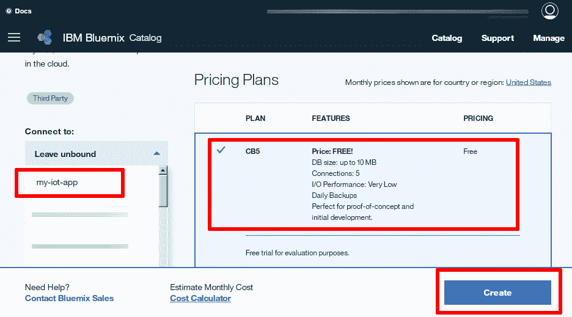
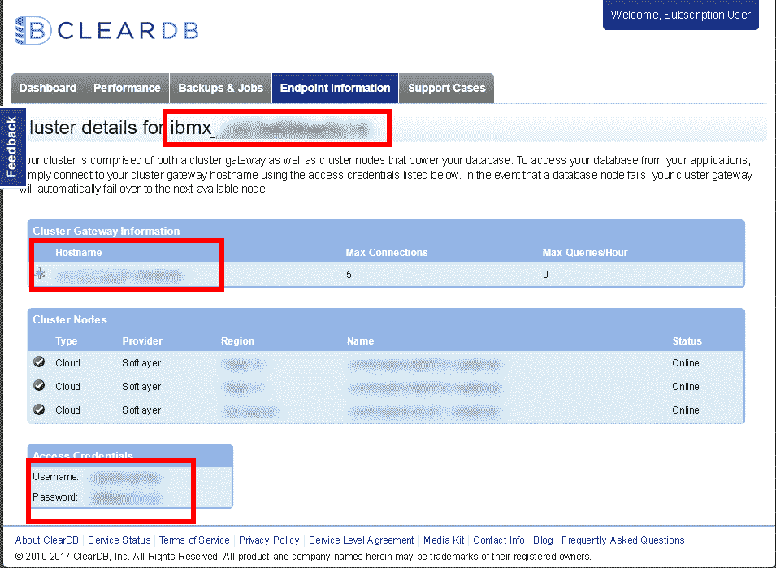
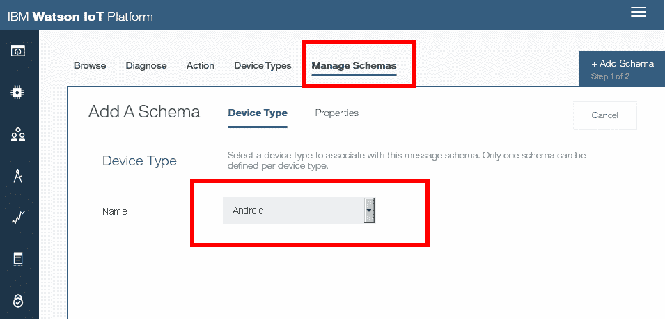
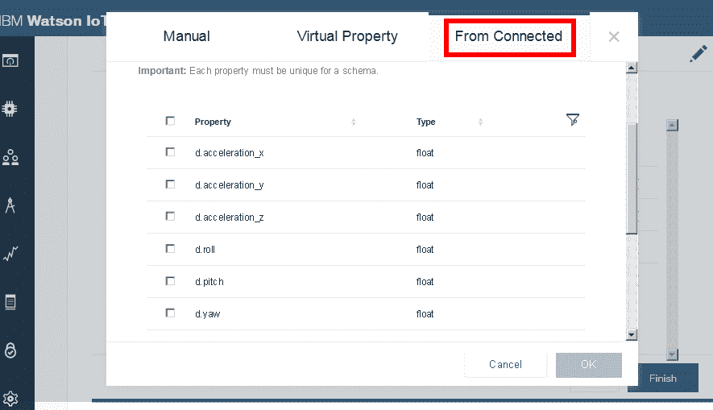
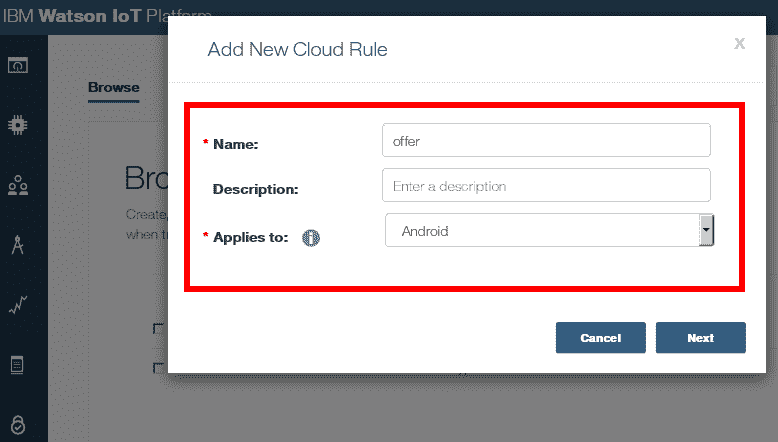
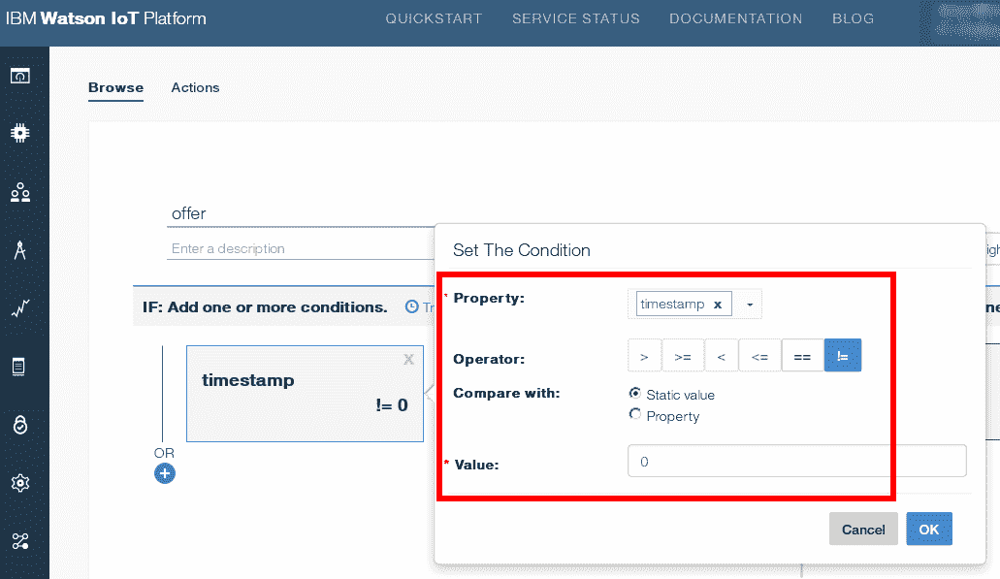
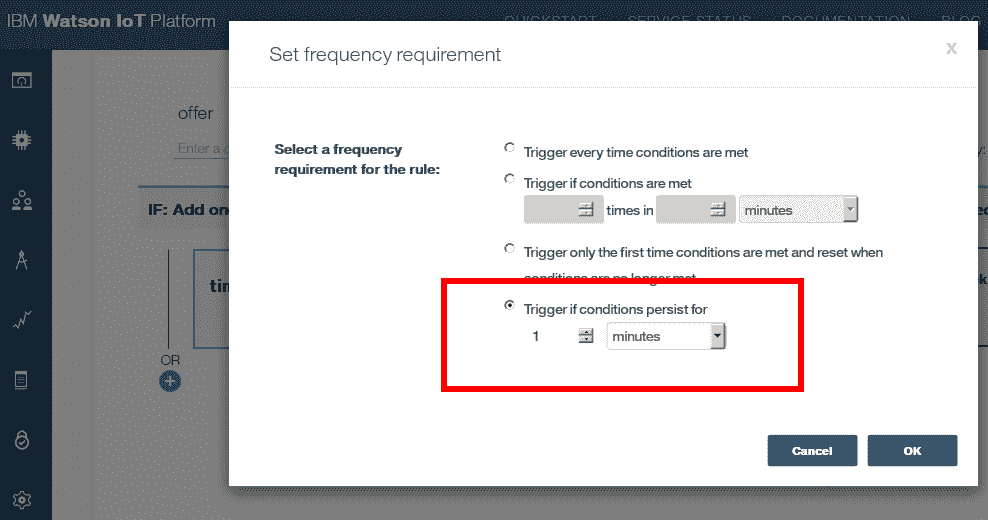
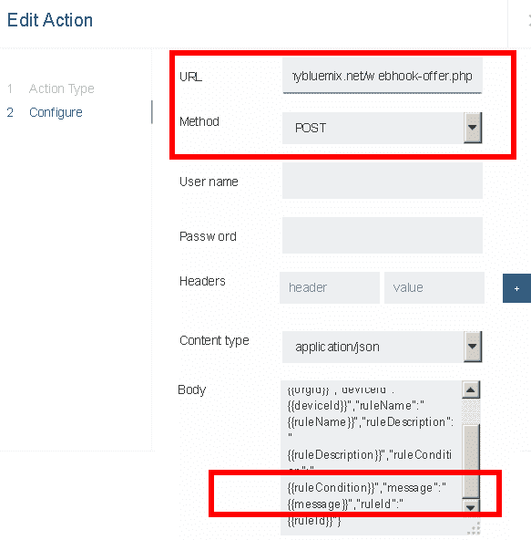
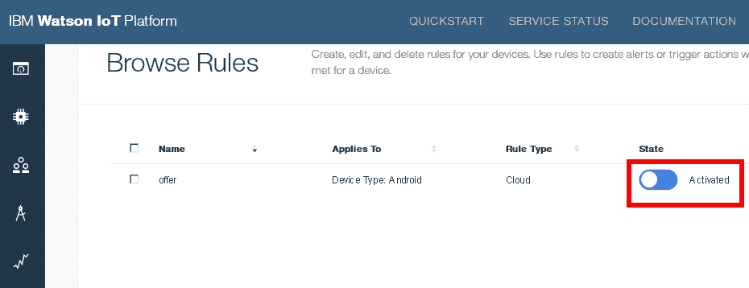

# Archived | 构建一个向 IoT 设备发送针对地理位置的营销消息的 PHP 应用程序

> 原文：[`developer.ibm.com/zh/tutorials/iot-php-app-location-aware/`](https://developer.ibm.com/zh/tutorials/iot-php-app-location-aware/)

**本文已归档**

**归档日期：:** 2019-11-26

此内容不再被更新或维护。 内容是按“原样”提供。鉴于技术的快速发展，某些内容，步骤或插图可能已经改变。

IoT 设备和应用程序拥有巨大的技术和业务前景。它们可以实时组合来自多个来源的数据流，分析这些数据流对系统的影响，然后自动且智能地做出反应。前端的传感器和设备与后端的规则、过滤器和业务逻辑之间的双向通信，是实现快速、高效和恰当的外部事件响应周转时间的关键。

在[前一篇文章](http://www.ibm.com/developerworks/cn/iot/iot-php-app-iot-foundation-bluemix/index.html)中，我介绍了 IBM Watson IoT Platform，解释了如何通过将它连接到 IoT 设备所生成的数据流来创建有用的应用程序。作为示例，我展示了如何将 IBM Cloud 上运行的 PHP 应用程序与 IBM Watson IoT Platform 集成，以便从 Android 智能手机接收 GPS 数据，然后使用该数据通过 Web 浏览器实时跟踪设备位置。

但是，我们还可以实现更多功能。IBM Watson IoT Platform 还包含其他许多有趣的特性，比如通过过滤器和操作实现自动化数据处理，以及支持将命令发布到设备。Watson IoT Platform 的这些特性使得在 IoT 设备与 IoT 应用程序之间实现双向通信成为可能：应用程序可读取从 IoT 设备传入的数据流，以有用的方式处理此数据，然后将结果信息或命令传送回 IoT 设备，以便“执行某项操作”。

在本教程中，我将借鉴该想法，向您展示如何创建一个 IBM Cloud 应用程序，该应用程序与 IBM Watson IoT Platform 集成，并通过查找并向设备传送附近的营销优惠信息，响应从 Android 智能手机传入的 GPS 数据。

样本应用程序的想法很简单。在当地街区或城市旅游时，您的智能手机会自动通知您附近的营销优惠信息、促销信息或活动。例如，当您前往购物商场时，会收到一个包含披萨午餐七五折优惠券的通知。或者当您到达电影院时，会获得附近酒吧在举行一场现场音乐活动的通知。您实时接收相关的、本地化的优惠信息；促销人员也能联系不在他们视线范围内的新的潜在客户。

那么如何实现此目标？

*   首先，我们使用 [IoT Starter Application for Android](https://github.com/ibm-watson-iot/iot-starter-for-android) 将您的 Android 手机转换为 GPS 传感器，不断将它的位置发送到 [IBM Watson IoT Platform](https://console.ng.bluemix.net/catalog/services/internet-of-things-platform/) 。
*   然后，使用 IBM Watson IoT Platform 监视此数据。当我们判断设备在某个地方停留一段合理时间时，就会触发一个在 [IBM IBM Cloud](https://www.ibm.com/cloud-computing/bluemix/zh) 上运行的 PHP 应用程序。
*   接下来，该 IBM Cloud 应用程序会检查一个数据库，查找该设备所报告位置附近的可用营销优惠信息。如果找到匹配结果，它会使用 IBM Watson IoT Platform 向 IoT 设备（Android 智能手机）发送一条提醒。
*   最后，智能手机上的 IoT Starter Application for Android 收到提醒并向用户发送通知。

[获取 GitHub 上的代码](https://github.com/vvaswani/bluemix-iot-locator)

## 构建此 IoT 应用程序需要做的准备工作

这个应用程序包含许多活动部件，所以下面给出了您需要做的准备工作的简单列表：

*   基本熟悉 [PHP](http://www.php.net/)
*   基本熟悉 [MySQL](http://www.mysql.com/)
*   一个包含 [Apache](http://httpd.apache.org/) 或 [nginx](https://www.nginx.com/resources/wiki/) 的本地 PHP 开发环境
*   MySQL 命令行客户端（或任何其他 MySQL 数据库管理工具）
*   一个 IBM Cloud 帐户（可以[在这里申请一个](https://cloud.ibm.com/registration?cm_sp=ibmdev-_-developer-tutorials-_-cloudreg)）
*   [CloudFoundry 命令行工具](https://github.com/cloudfoundry/cli)
*   一个文本编辑器或 IDE

因为您正在开发的 PHP 应用程序与我的[前一篇教程](http://www.ibm.com/developerworks/cn/iot/iot-php-app-iot-foundation-bluemix/index.html)中的应用程序非常相似，所以您应该首先完成该教程中的步骤，然后再回来完成本教程中的步骤。具体来讲，您需要完成以下步骤：

*   第 1 步，创建一个捆绑到 Internet of Things Platform 服务实例的 IBM Cloud 应用程序。
*   第 2 和第 3 步，向 IBM Watson IoT Platform 组织注册 Android 智能手机，编译 IoT Starter Application for Android 并将其安装到您的智能手机上。
*   第 4 步，将来自注册的 Android 智能手机的 GPS 数据发布到 Internet of Things Platform 服务实例。
*   第 5 步，为 IBM Cloud 应用程序生成一个 API 密钥，以便连接 IBM Watson IoT Platform 组织。

## 创建优惠信息数据库

首先，我们需要创建一个 MySQL 数据库来存储针对地理位置的营销优惠信息。此数据库还会存储设备的最新位置，以及已传送给它的优惠信息列表。该 PHP 应用程序将定期连接此数据库，以便查找优惠信息并更新设备的位置。

创建此数据库的最简单方法是使用 IBM Cloud ClearDB Managed MySQL Database 服务，该服务在云中配备了一个托管 MySQL 数据库。默认计划包含有限的免费存储配额。

1.  登录到您的 IBM Cloud 帐户。
2.  从仪表板中，单击 **Create Service**。
3.  从服务列表中，选择 **Data and Analytics**，然后选择 **ClearDB Managed MySQL Database** 服务。
4.  选择免费 CB5 计划，确保设置了 **Connect to** 字段，以便将数据库实例绑定到托管您 Internet of Things Platform 服务实例的相同 IBM Cloud 应用程序。

    创建 ClearDB 服务实例

    

5.  初始化数据库实例后，打开 ClearDB 仪表板，单击 **Endpoint Information** 选项卡来查看和记下该实例的凭证。

    ClearDB 服务实例凭证

    

设置 MySQL 数据库后，需要创建必要的表并使用一些营销优惠信息来初始化它们。

1.  在您的开发系统上使用 MySQL 命令行客户端（或任何其他 MySQL 管理工具）连接到 MySQL 实例，并运行下面的 SQL 命令来创建必要的表：

    ```
    CREATE TABLE `offer` (
      `id` int(11) NOT NULL AUTO_INCREMENT,
      `latitude` decimal(10,8) NOT NULL,
      `longitude` decimal(11,8) NOT NULL,
      `message` text NOT NULL,
      PRIMARY KEY (`id`)
    );

    CREATE TABLE `device_offer` (
      `id` int(11) NOT NULL AUTO_INCREMENT,
      `device_id` varchar(255) NOT NULL,
      `offer_id` int(11) NOT NULL,
      `offer_delivery_date` date NOT NULL,
      PRIMARY KEY (`id`)
    );

    CREATE TABLE `device_location` (
      `device_id` varchar(255) NOT NULL,
      `latitude` float(6,4) NOT NULL,
      `longitude` float(7,4) NOT NULL,
      `wait_time` int(11) NOT NULL,
      `updated` timestamp NOT NULL DEFAULT CURRENT_TIMESTAMP ON UPDATE CURRENT_TIMESTAMP,
      PRIMARY KEY (`device_id`)
    ); 
    ```

    每个表的功能如下：

    *   `offer` 表包含一组营销优惠信息。 每条优惠信息包含一条消息和托管该优惠信息的位置的 GPS 坐标。PHP 应用程序利用此数据识别优惠信息并传送到已注册的设备。
    *   `device_location` 表包含每个已注册设备最后报告的 GPS 坐标，以及它在该位置停留的时间。此数据用于计算设备在某个位置停留到何时才可以向它发送优惠信息。
    *   `device_offer` 表包含每天传送到每个已注册设备的优惠信息列表。此数据用于确保同一个设备每天只能接收同一条优惠信息一次。
2.  最初可以向 offer 表提供相同的样本数据，如下所示。更新示例 GPS 坐标来反映您附近的位置（请记住，可以使用 [Google Maps](https://maps.google.com) 获取特定位置的 GPS 坐标）。

    ```
    INSERT INTO `offer` VALUES (51.5101195,-0.134737,'Get 20% off your pizza today!');
    INSERT INTO `offer` VALUES (51.5101195,-0.134737,'Buy one, get one free on event entry tonight!'); 
    ```

## 定义设备数据的触发规则和操作

定义并填充数据库后，下一步是使用一个 PHP 应用程序，将从 Android 智能手机（它现在也是 IoT 设备）传入 IBM Watson IoT Platform 的数据与 MySQL 数据库相连。可以使用各种方法向数据库提供数据，但本文将重点介绍如何使用 IBM Watson IoT Platform 中的触发规则和操作来调用 PHP 应用程序和处理数据。

如果您已按照[我的上一篇文章](http://www.ibm.com/developerworks/cn/iot/iot-php-app-iot-foundation-bluemix/index.html)中的说明进行操作，那么您应该已在 Internet of Things Platform 服务实例中配置了一种 **Android** 设备类型，拥有一个已向 IBM Watson IoT Platform 组织注册的 Android 设备，以及一个从设备到 IBM Watson IoT Platform 的传入数据流。对于此样本应用程序，下一步是为 **Android** 设备类型创建一个模式，然后使用该模式配置触发规则和操作。

1.  在 Android 设备上打开 IoT Starter for Android 应用程序，输入所需的凭证，然后单击 **Activate Sensor** 将它连接到 IBM Watson IoT Platform。
2.  在 IBM Cloud 中，验证您的设备数据流已出现在 Internet of Things Platform 服务实例仪表板中。
3.  从 **Devices** 菜单，选择 **Manage Schemas** 部分，然后单击 **Add Schema** 按钮。
4.  在 Device Type 屏幕上，从选择列表中选择 **Android**，然后单击 **Next**。

    创建设备模式

    

5.  在 **Properties** 屏幕上，单击 **Add a property**，选择 **From Connected** 选项卡，然后选择 `d.latitude`、`d.longitude` 和 `d.timestamp` 属性。单击“OK”将这些属性添加到模式中。

    创建设备模式

    

6.  定义模式后，转到 **Rules** 菜单。在 **Browse** 部分，单击 **Create Cloud Rule** 按钮。

7.  输入一个规则名称（比如 `offer`），选择您刚创建的 **Android** 模式。单击 **Next** 继续后面的操作。

    创建规则

    

8.  按以下方式，将要执行的触发规则和操作添加到云规则：

    *   在 **If** 部分，单击 **New condition**，使用选择工具添加条件 `timestamp != 0`。单击 **OK** 保存该条件。

        定义条件

        

    *   在 **Trigger** 部分，将触发规则设置为 **if conditions persist for 1 minute**。

        定义触发频率

        

    *   在“Then”部分，单击 **New action**；在对话框中，单击 **Add action** 链接。有许多预先定义的操作，其中包括发送电子邮件，显示提醒，触发 IFTTT 秘诀，或者连接到 Node-RED HTTP 输入节点或 webhook。选择 **webhook action** 作为操作类型，将 webhook URL 设置为 [http://my-iot-app-[initials].mybluemix.net/webhook-offer.php，将操作方法设置为](http://my-iot-app-[initials].mybluemix.net/webhook-offer.php，将操作方法设置为) POST。

        请记住，必须将操作 URL 中的示例主机名称替换为您的 IBM Cloud 应用程序的实际主机名称，而且不要担忧 URL 末尾的 PHP 脚本 – 它目前不存在，但文章末尾会提供该 URL。

        为其他字段保留默认值，确保请求主体包含 `{{message}}` 占位符中的原始设备消息，如下所示。单击 **Finish** 保存操作。

    定义操作

    

9.  验证新的云规则已出现在 **Rules -> Browse** 部分，滑动 **State** 开关来激活它。

    激活规则

    

所有这些配置的最终结果是，激活设备并向 IBM Watson IoT Platform 发送数据时，条件测试将始终返回 true（设备时间戳将始终大于 0）。因此，webhook 操作将按照触发器频率执行（每分钟一次），并使用 POST 将设备数据发送到指定的 URL。

换句话说，有了此配置，只要设备已激活并连接到 IBM Watson IoT Platform，您现在就可以每分钟对设备数据处理一次。

## 处理设备数据并发布设备命令

此刻，您有一个包含针对地理位置的优惠信息的数据库，一个传输其 GPS 坐标的 Android 智能手机（IoT 设备），以及一个在收到设备消息时每分钟请求一个 URL 的触发器。剩下要做的就是通过一个 PHP 应用程序将所有这些组件粘合在一起，并在指定 URL 上托管该应用程序。

在介绍代码细节之前，让我们大体介绍一下 PHP“粘连代码”需要做的工作：

*   它需要接收并解码从设备传输给它的 JSON 数据。
*   它需要使用设备的当前位置更新数据库，如果设备是静止的，它需要更新所记录的等待时间。
*   当设备静止足够长时间时，它需要找到 (a) 在设备的半径范围内且 (b) 当天未发送给设备的可用优惠信息。
*   它需要在 IoT Starter for Android 应用程序的命令通道上，使用 MQTT 将所有这些优惠信息发送给设备。

看似有许多工作，但实际上并没有初看起来那么难。以下是该 PHP 应用程序的代码，该代码应在开发目录中保存为 webhook-offer.php：

```
<?php
// include class
require('phpMQTT.php');

// load configuration values
$config = array(
  'org_id' => 'IOT-ORG-ID',
  'port' => '1883',
  'app_id' => 'phpmqtt',
  'iotp_api_key' => 'IOT-API-KEY',
  'iotp_api_secret' => 'IOT-API-TOKEN',
  'device_id' => 'DEVICE-ID',
  'qos' => 1
  'db_host' => 'DATABASE-HOST-NAME',
  'db_user' => 'DATABASE-USER-NAME',
  'db_pass' => 'DATABASE-USER-PASSWORD',
  'db_name' => 'DATABASE-NAME',
  'wait_time_trigger_min' => 5,
  'proximity_trigger_km' => 1,
);
$config['server'] = $config['org_id'] .'.messaging.internetofthings.ibmcloud.com';
$config['client_id'] = 'a:'.$config['org_id'] .':'.$config['app_id'];

// report MySQL errors as exceptions
mysqli_report(MYSQLI_REPORT_ERROR | MYSQLI_REPORT_STRICT);

// get JSON packet posted to webhook
$json = file_get_contents('php://input');

// decode JSON packet
// extract device ID, message contents
$data = json_decode($json);
$deviceId = $data->deviceId;
$message = json_decode($data->message);
$longitude = round($message->d->longitude, 4);
$latitude = round($message->d->latitude, 4);

// open database connection
$mysqli = new mysqli($config['db_host'], $config['db_user'],
  $config['db_pass'], $config['db_name']);
if ($mysqli->connect_errno) {
  error_log("Failed to connect to MySQL:" .$mysqli->connect_error);
}

try {
  // check if this device already has a location record
  $sql = "SELECT latitude, longitude, wait_time FROM device_location
    WHERE device_id = '$deviceId' LIMIT 0,1";
  $result = $mysqli->query($sql);
  $row = $result->fetch_object();
  // check if the last location recorded in the database matches the current location
  // if yes, update the wait time
  // if no, update the location record
  if ($result->num_rows == 1 && $row->latitude == $latitude
    && $row->longitude == $longitude) {
    $wait_time = $row->wait_time + 1;
    $sql = "UPDATE device_location SET wait_time = '$wait_time',
      updated = NOW() WHERE device_id = '$deviceId'";
    $mysqli->query($sql);
  } else {
    $sql = "DELETE FROM device_location WHERE device_id = '$deviceId'";
    $mysqli->query($sql);
    $wait_time = 0;
    $sql = "INSERT INTO device_location (device_id, latitude, longitude,
      wait_time, updated) VALUES ('$deviceId', '$latitude', '$longitude',
      '$wait_time', NOW())";
    $mysqli->query($sql);
  }

  // if the device has been in the same location
  // for the trigger number of minutes
  // find offers within the configured proximity radius
  // which have not already been delivered to the device today
  if ($wait_time == $config['wait_time_trigger_min']) {
    $proximity = $config['proximity_trigger_km'];
    $sql = "SELECT o.id, o.message,
        (6371 * acos(cos(radians($latitude)) * cos(radians(latitude)) *
        cos(radians(longitude) - radians($longitude)) + sin(radians($latitude)) *
        sin(radians(latitude)))) AS distance
          FROM offer o
          LEFT JOIN device_offer dos ON o.id = dos.offer_id
        WHERE (dos.offer_delivery_date != DATE(NOW())
          OR dos.offer_delivery_date IS NULL)
        HAVING distance < $proximity
        ORDER BY distance
        LIMIT 0,10";
    $result = $mysqli->query($sql);

    if ($result->num_rows > 0) {
      // if offers found
      // initialize MQTT client
      $mqtt = new phpMQTT($config['server'], $config['port'], $config['client_id']);
      $mqtt->debug = false;

      // connect to broker
      if(!$mqtt->connect(true, null, $config['iotp_api_key'],
        $config['iotp_api_secret'])){
        error_log('Failed to Could not connect to IoT cloud');
        exit();
      }

      // iterate over offer list and publish to device
      // update database with offer delivery status
      while ($row = $result->fetch_object()) {
        $offerId = $row->id;
        $message = $row->message;
        $mqtt->publish('iot-2/type/Android/id/' .$config['device_id'] .
          '/cmd/alert/fmt/json', '{"d":{"text":"'.$message .'"}}', 1);
        $sql = "INSERT INTO device_offer (device_id, offer_id, offer_delivery_date)
          VALUES ('$deviceId', '$offerId', DATE(NOW()))";
        $mysqli->query($sql);
      }

      // disconnect MQTT client
      $mqtt->close();
    }
  }

} catch (Exception $e) {
  error_log($e->getMessage());
}

// close database connection
$mysqli->close(); 
```

该应用程序使用了 [phpMQTT](https://github.com/bluerhinos/phpMQTT) 库，这是一个用于处理 MQTT 消息和代理的 PHP 类。将它[克隆或下载](https://github.com/bluerhinos/phpMQTT)到您的 PHP 开发环境，并放置在与 PHP 应用程序相同的目录中。

PHP 应用程序代码首先会加载此库，并在顶部的 `$config` 数组中设置各种需要的参数。要指定的参数包括：

*   服务器名称，通常以您在“messaging.internetofthings.ibmcloud.com”域下的组织标识符命名。
*   服务器端口，对于未加密的连接，该端口为 1883；对于已加密的连接，该端口为 8883。
*   `a:ORG_ID:APP_ID` 格式的客户端标识符，其中 `APP_ID` 是一个用户提供的值。
*   客户端 API 密钥和密码，访问该服务需要它们。
*   数据库主机名、访问凭证和数据库名称，可像之前展示的那样从 ClearDB 仪表板获取它们。
*   等待设备变为静止的分钟数（默认为 5 分钟），要在设备位置周围检查可用优惠信息的地理半径（默认为 1 千米）。

完成了配置后，让我们看看详细的应用程序代码：

1.  我们在上一步中设置的云规则每分钟调用此应用程序一次，而且会向该应用程序传递一个包含来自设备的原始数据（包括它的 GPS 坐标）的 JSON 包。因此，该 PHP 应用程序的首要任务是读取并解码此 JSON 包，并将重要信息片段分配给 PHP 变量。

    ```
    <?php
    // ...
    // get JSON packet posted to webhook
    $json = file_get_contents('php://input');
    $data = json_decode($json);
    $deviceId = $data->deviceId;
    $message = json_decode($data->message);
    $longitude = round($message->d->longitude, 4);
    $latitude = round($message->d->latitude, 4);
    // ... 
    ```

2.  接下来，该应用程序会打开与 MySQL 数据库的连接，检查“device_location”表来查看是否已有一条调用它的设备的位置记录。如果有，它会进一步检查该位置自上次更新以来是否已发生更改，然后更新位置记录（如果位置已更改），或者向该记录添加 1 分钟来更新等待时间（如果设备是静止的）。

    另请注意，“device_location”表中的纬度/经度字段值没有“offer”表中的值那么精细。我们特意这样设计来提供一定的误差范围，否则即使很小的设备移动（例如从商店的一端移到另一端）也会导致生成新的位置坐标并重置等待计时器。

    ```
    <?php
    // ...
    // check if this device already has a location record
    $sql = "SELECT latitude, longitude, wait_time FROM device_location
      WHERE device_id = '$deviceId' LIMIT 0,1";
    $result = $mysqli->query($sql);
    $row = $result->fetch_object();
    // check if the last location recorded in the database matches the current location
    // if yes, update the wait time
    // if no, update the location record
    if ($result->num_rows == 1 && $row->latitude == $latitude
      && $row->longitude == $longitude) {
      $wait_time = $row->wait_time + 1;
      $sql = "UPDATE device_location SET wait_time = '$wait_time', updated = NOW()
        WHERE device_id = '$deviceId'";
      $mysqli->query($sql);
    } else {
      $sql = "DELETE FROM device_location WHERE device_id = '$deviceId'";
      $mysqli->query($sql);
      $wait_time = 0;
      $sql = "INSERT INTO device_location (device_id, latitude, longitude,
        wait_time, updated) VALUES ('$deviceId', '$latitude', '$longitude',
        '$wait_time', NOW())";
      $mysqli->query($sql);
    }
    // ... 
    ```

可以在 Google Maps 文档中进一步了解[如何找到一个纬度/经度对的某个半径范围内的位置](https://developers.google.com/maps/solutions/store-locator/clothing-store-locator#findnearsql)。

您现在应该能够浏览 [http://my-iot-app-[initials].mybluemix.net/webhook-offer.php](http://my-iot-app-[initials].mybluemix.net/webhook-offer.php) 上的应用程序。因为您是在访问它而不是向它提交任何 JSON 数据，所以您应该会看到一条错误消息；但是，这仍可以确认该 URL 已激活，并准备接收来自 IBM Watson IoT Platform 的 POST 数据。如果没有看到任何信息，请参阅侧栏中的链接，了解关于如何获取调试日志的信息。

## 结束语

如本文所示，IBM Watson IoT Platform 不仅允许从连网设备接收数据，还允许将数据发布到这些设备（然后它们可以使用此数据执行计算，显示提醒或执行其他有趣操作）。但您能做的并不止这些。IBM Watson IoT Platform 还允许您为设备数据配置触发规则和操作，使得发送提醒、触发秘诀或请求远程应用程序 URL 成为可能。将这些功能与 IBM Cloud 中提供的各种各样的服务相结合，您会看到构建集成了 IBM Cloud 和 Watson IoT 平台的最佳特性的先进且可扩展 IoT 应用程序的巨大前景。

如果想在 IBM Cloud 和 IBM Watson IoT Platform 上试验此应用程序，可以[从 GitHub 下载源代码](https://github.com/vvaswani/bluemix-iot-locator)，通过使用本文中提供的解释作为参考，仔细了解它的工作原理。然后，修改配置，使之与您的环境相匹配，将它连同一个 Android 设备一起部署，以便了解该应用程序的工作原理。祝开发愉快！

本文翻译自：[Build a PHP app that delivers geo-targeted marketing messages to an IoT device](https://developer.ibm.com/tutorials/iot-php-app-location-aware/)（2017-07-17）