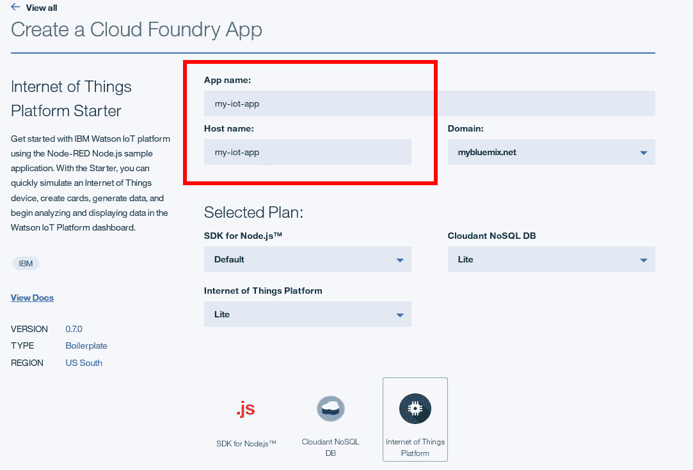
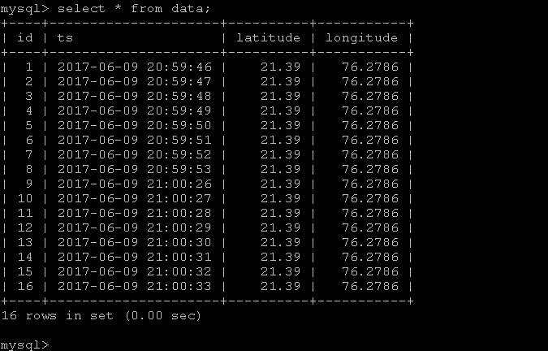

# Archived | 构建一个使用来自 IoT 设备的 GPS 数据的 PHP 应用程序

> 原文：[`developer.ibm.com/zh/tutorials/iot-php-app-iot-foundation-bluemix/`](https://developer.ibm.com/zh/tutorials/iot-php-app-iot-foundation-bluemix/)

**本文已归档**

**归档日期：:** 2019-11-26

此内容不再被更新或维护。 内容是按“原样”提供。鉴于技术的快速发展，某些内容，步骤或插图可能已经改变。

现在人们对物联网 (IoT) 的讨论沸沸扬扬。每个人都在谈论住宅、汽车、船只或太阳能供电装置如何发出有关其当前运行状况的实时数据流，这催生一系列新的技术应用程序和业务机会。

但是，如果您是一位对开发 IoT 应用程序感兴趣的 PHP 开发人员，通常很难拨开迷雾并在技术或实现层面上理解 IoT 设备和应用程序的运作方式。至少这是我曾经面临的情况。在有基本了解之前，我发现很难开始设想和构建应用程序来充分利用受 IoT 支持的世界。

我花了不少时间并做了大量试验，才开始理解 IoT 世界（而且我仍在学习中）。在这篇入门文章中，我希望通过逐步讲解构建一个 IoT 应用程序（它使用了我最喜欢的编程语言 PHP）的过程，节省您的时间和精力。

我将介绍如何使用 IoT Starter Application for Android 将 Android 手机转换为 GPS 传感器，不断将手机的位置发送到 IBM Cloud 云。然后我将展示如何将一个 PHP 应用程序与此数据流连接，并在 Web 浏览器中使用它实时跟踪 Android 手机的位置。

听起来很有趣，对吧？请继续阅读。

## 需要做的准备工作

*   基本熟悉 [PHP](http://www.php.net/)
*   一个包含 [Apache](http://httpd.apache.org/) 或 [nginx](https://www.nginx.com/resources/wiki/) 的本地 PHP 开发环境
*   一个 [Android Studio](http://developer.android.com/tools/studio/index.html) 副本
*   一个 IBM Cloud 帐户（可以[在这里申请一个](https://cloud.ibm.com/)。）
*   一个 Google 帐户（[在这里申请一个](https://accounts.google.com/SignUp)）
*   一个文本编辑器或 IDE

任何使用 Google Maps API 的应用程序都必须遵守 [Google Maps APIs 服务条款](https://developers.google.com/maps/terms)、[Google APIs 服务条款](https://developers.google.com/terms/)和 [Google 隐私政策](http://www.google.com/policies/privacy/)。开始之前，花几分钟阅读一下这些要求，确保您的应用程序满足它们。

## 使用 Internet of Things Platform Starter 样板构建一个 IBM Cloud 应用程序

开始使用 IoT 的最快方法之一是使用 IBM Watson IoT Platform。Watson IoT Platform 是一个托管在云上的平台，可用作所有启用了 IoT 的设备和应用程序的中央联系点。简单来讲，设备将其数据发送到云中的 IBM Watson IoT Platform，而移动或 Web 应用程序会使用该数据。

因为 IBM Watson IoT Platform 是我们构建的应用程序的关键组件，所以我们将首先设置它。开始使用 IBM Watson IoT Platform 的最容易方式是，使用 Internet of Things Platform Starter 样板创建一个新的 IBM Cloud 应用程序，这会将一个 Internet of Things Platform 服务实例与其绑定。

1.  登录到您的 IBM Cloud 帐户。
2.  从 IBM Cloud 帐户仪表板，单击 **Create App**。

    

3.  从样板列表中，选择 **Internet of Things Platform Starter** 样板。

    

4.  在 **Create a Cloud Foundry App** 区域中，为您的 IBM Cloud 应用程序指定一个名称和主机名，然后单击 **Create**。确保为 Internet of Things Platform 服务选择了“Lite”计划。

    

5.  一段时间后，您的应用程序将会载入并启动。单击 IBM Cloud 仪表板中的应用程序名称来查看您的应用程序的状态，而且可以在可用服务列表中看到捆绑到您的应用程序的 Internet of Things Platform 服务。

    

## 向 IBM Watson IoT Platform 注册设备

成功配置 Internet of Things Platform 服务后，下一步是告诉它哪些设备将与它连接。

出于安全考虑，IBM Watson IoT Platform 将您的设备及其数据隔离在一个单独的帐户中，这个帐户也称为 *组织* 。每个组织都有一个在 IBM Watson IoT Platform 中自动创建的唯一的 6 字符标识符。一个 IBM Watson IoT Platform 组织中的设备和应用程序对其他任何 IBM Watson IoT Platform 组织不可见。

1.  在应用程序细节页面上，选择 Internet of Things Platform 服务。服务细节页面将会打开。
2.  单击 **Launch** 按钮。您的组织的 IBM Watson IoT Platform 仪表板将会打开，标识符位于仪表板顶部。

    

3.  首次在组织内启动该平台时，没有注册任何设备。第一步必须是创建一种设备类型，将它用作一个注册特定类型设备的模板。然后，第二步是使用该模板向 IBM Watson IoT Platform 注册设备。

    1.  从 **Devices** 菜单，找到 **Device Types** 部分并单击 **Create Type**。在 Create Device Type 页面上，指定设备类型和一段简短描述。可选择任何字符串作为设备类型，但您的设备在向 Internet of Things Platform 服务进行验证时需要使用同一个字符串。在本教程中，指定 `Android` 作为设备类型，因为下一步中使用的 IoT Starter 应用程序已经硬编码为使用这种设备类型。

        

        尽管可以选择您的用户在注册新设备时必须指定的其他属性，比如它的序列号或硬件版本，但我们的简单应用程序不需要任何其他属性。保存设备类型。

        

    2.  从 **Devices** 菜单，找到 **Browse** 部分，单击 **Add Device**，并选择 Android 作为设备类型。

        

可在 IBM Internet of Things Platform 文档中进一步了解[针对设备的 MQTT 连接](https://cloud.ibm.com/docs/services/IoT?topic=iot-platform-getting-started#ref-mqtt?cm_sp=dw-bluemix-_-phpappiotfoundation-_-article)。

```
 为该设备输入一个唯一标识符。它可以是一个随机或描述性的字符串；例如，本教程中使用了 `A111`。记住该设备标识符，因为它将是在向 IBM Watson IoT Platform 执行验证时，您的设备将会使用的客户端标识符的一部分。

      
```

1.  系统会要求您提供或生成设备的身份验证令牌。让系统为您生成该令牌；摘要屏幕列出了新注册的设备的细节，包括自动生成的令牌。因为不会再显示该令牌，所以应将它复制到剪贴板，以便以后在教程中使用它。

    

现在，已向 IBM Watson IoT Platform 注册设备“A111”，而且 Internet of Things Platform 可以开始接受来自它的数据，但需要一个有效的身份验证令牌。

## 编译并安装 IoT Starter for Android 应用程序

IoT Starter for Android 是一个样本 Android 应用程序，它位于 Android 智能手机或平板电脑上，将来自设备加速计和其他传感器的数据和事件流发布到 IBM Watson IoT Platform。它也可以接收来自 IBM Watson IoT Platform 的命令。因此，它是开始试验 IBM Watson IoT Platform 并构建应用程序来与实时数据流交互的好方法。

如果拥有 Android 开发经验，可以从 GitHub [下载代码](https://github.com/ibm-watson-iot/iot-starter-for-android)，将它导入 Android 开发环境，然后构建 apk 文件。否则，要快速安装并运行该应用程序，请执行以下步骤。

[获得代码](https://github.com/ibm-watson-iot/iot-starter-for-android)

1.  克隆项目的源代码存储库。

    1.  启动 Android Studio。
    2.  单击 **Quick Start** > **Check out project from Version Control** > **Git**。
    3.  在 Clone Repository 对话框中，指定以下 GitHub 存储库：

        `https://github.com/ibm-messaging/iot-starter-for-android`

        

    4.  单击 **Clone**。
2.  单击 **Build** > **Build APK** 菜单来编译应用程序。在项目的输出目录（例如在 app/build/outputs/apk 中）中会生成一个 Android 应用程序包（一个 .apk 文件）。

    

    有关如何安装来自 Google Play 外的应用程序的更多信息，请查阅[这篇 CNET 文章](http://www.cnet.com/how-to/how-to-install-apps-outside-of-google-play/)。

将这个 .apk 文件复制到您的 Adnroid 设备，并使用一个文件管理器（比如 ES File Explorer

## 将来自 Android Starter 应用程序的数据发布到 IBM Watson IoT Platform

1.  在您的 Android 设备上，启动刚安装的应用程序。
2.  在 Welcome 屏幕上，输入第 2 步中获得的组织标识符、设备标识符和身份验证令牌。
3.  单击 **Activate Sensor** 按钮。


该应用程序会自行尝试连接您的组织并验证自身。如果成功，您会在应用程序欢迎屏幕上看到类似“Connected to IoT:Yes”的通知，而且您的设备会自动开始从其加速计向 IBM Watson IoT Platform 发送数据。


将 IoT 设备发送的数据发布到*主题*，主题大体相当于收音机上的频道。不同的事件类型可发布到不同的主题。例如，对于此设备，将加速计事件发布到主题 `iot-2/evt/ **accel** /fmt/ **json**`，将触摸事件发布到主题 `iot-2/evt/ **touchmove** /fmt/ **json**`。

返回到 IBM Watson IoT Platform 仪表板，您会看到以 JSON 文档形式从设备传入的数据流。这是一个示例：


具体来讲，请注意每条 JSON 消息中的“latitude”和“longitude”键，其中包含设备的当前 GPS 坐标。如果没有看到这些键，请确保 [Android 设备已设置为报告它的位置](https://support.google.com/accounts/answer/2819558?hl=en&ref_topic=6179443) ，然后重新启动 IOT Starter for Android 应用程序。

## 生成一个用于访问应用程序的 API 密钥

现在，您获得了一个从已注册的设备传到您的 IBM Watson IoT Platform 组织的数据流。要完善此过程，需要一个可从 IBM Watson IoT Platform 组织检索此数据并对它执行某种有用操作的应用程序。

首先，必须确保您的应用程序可访问您的 IBM Watson IoT Platform 组织。就像第 2 步中为设备生成身份验证令牌一样，现在需要为您的应用程序生成一个 API 密钥。

1.  打开您的组织的 IBM Watson IoT Platform 仪表板。
2.  选择 **Apps** > **API Keys**。
3.  单击 **Generate API Key** 按钮。
4.  记下为您生成的 API 密钥和身份验证令牌。下一步将使用这些值。


1.  单击 **Generate** 保存 API 密钥。

## 在 PHP 应用程序中使用来自 IBM Watson IoT Platform 的数据

现在到有趣的部分了。设备和应用程序可使用一个称为 *Message Queue Telemetry Transport* (MQTT) 的轻量型消息协议与 IBM Watson IoT Platform 发送和接收数据。Android Starter 应用程序使用 MQTT 将其加速计数据发送到 IBM Watson IoT Platform，您构建的任何应用程序通常都需要”采用 MQTT 语言”，这样它才能接收来自 IBM Watson IoT Platform 的数据。

就像设备将数据发布到特定主题一样，应用程序可以订阅和使用这些主题中的数据。设备类型和名称应指定为主题名称的一部分。例如，要订阅来自设备“A111”的“accel”事件，主题名称应为 `iot-2/type/Android/id/A111/evt/ **accel** /fmt/ **json**`。可使用”+”符号作为通配符来引用所有设备类型或所有设备。

如果使用 PHP 开发应用程序，那么添加 MQTT 支持的最简单方法之一是使用 [phpMQTT](https://github.com/bluerhinos/phpMQTT) 库，这是一个支持您使用 MQTT 消息和代理的 PHP 类。要使用它，请将它克隆或下载到 PHP 开发环境中。本教程的 PHP 脚本会调用 phpMQTT 库。

我们使用 3 个 PHP 脚本创建了 3 个 PHP 应用程序：

1.  cli-app.php 和 db-app.php – 这些脚本在服务器控制台或命令行上运行。
2.  web-app.php – 可通过 Web 浏览器访问此脚本。

[获得代码](https://github.com/vvaswani/bluemix-iot-locator)

下载这 3 个 .php 文件，在文本编辑器中打开它们。

可在 IBM Internet of Things 文档中进一步了解[针对应用程序的 MQTT 连接](https://cloud.ibm.com/docs/services/IoT?topic=iot-platform-getting-started#ref-mqtt?cm_sp=dw-bluemix-_-phpappiotfoundation-_-article)。

script cli-app.php 首先初始化一个新 phpMQTT 对象，该对象将用作所有与 IBM Watson IoT Platform 的通信的控制点。此对象需要多个参数，所有参数都存储在顶部的 `$config` 数组中。

使用来自本教程前几步的实际值，更新下面这个代码清单中所示的占位符：

```
// set configuration values
$config = array(
  'org_id' => 'IOTF-ORG-ID',
  'port' => '1883',
  'app_id' => 'phpmqtt',
  'iotf_api_key' => 'IOTF-API-KEY',
  'iotf_api_secret' => 'IOTF-API-TOKEN',
  'device_id' => 'DEVICE-ID'
);

$config['server'] = $config['org_id'] .'.messaging.internetofthings.ibmcloud.com';
$config['client_id'] = 'a:'.$config['org_id'] .':'.$config['app_id'];
$location = array(); 
```

phpMQTT 需要的参数包括：

*   **服务器名称**，通常以您在“messaging.internetofthings.ibmcloud.com”域下的组织标识符命名。
*   **服务器端口**，对于未加密的连接，该端口为 1883；对于已加密的连接，该端口为 8883。
*   **客户端标识符**。应用程序必须使用 `a: _ORG_ID:APP_ID` 格式的客户端标识符验证自身，其中 *APP_ID* 是一个用户提供的值。
*   **客户端 API 密钥**和**密码**，访问该服务需要它们。

初始化该对象后，必须使用它的 `connect()` 方法，使用来自第 5 步的 API 密钥和身份验证令牌连接到 IBM Watson IoT Platform。使用 `subscribe()` 方法订阅 `accel` 主题；该方法还会指定对每个传入的消息运行一个用户定义的函数。

在此脚本中，用户定义的函数是 `getLocation()` 函数，它的职责是使用 `json_decode()` PHP 函数从每条消息提取 GPS 数据并将它显示在屏幕上。`proc()` 方法在一个连续的循环中检查并处理到达该主题的消息流。

这是来自该脚本的输出的示例：


除了显示 GPS 数据之外，还可以将它保存到数据库，以便可以不断“跟踪”设备的移动（和它的所有者）。`db-app.php` 脚本是 `cli-app.php` 脚本的变形，它没有显示来自设备的 GPS 流，而是使用 PHP 不断将数据保存到 MySQL 数据库。然后可以分析此数据并将它用于各种用途；其中一个示例可能是构建用户随时间移动的曲线图。

要构建此曲线图，可以在脚本顶部建立一个与 MySQL 数据库的连接，然后使用该连接对通过 MQTT 收到的每个数据包执行 INSERT 查询。这些更改已本地化到之前给出的 `getLocation()` 函数中，可在源代码存储库中查看完整版本，但这里给出了一个快速样本：

```
// connect to database
$mysqli = new mysqli($config['db_host'], $config['db_user'], $config['db_pass'], $config['db_name']);
if ($mysqli->connect_errno) {
  echo 'ERROR:Could not connect to MySQL (' .$mysqli->connect_errno .') ' .$mysqli->connect_error;
  exit();
}

// ...

function getLocation($topic, $msg) {
  $mysqli = $GLOBALS['mysqli'];
  $json = json_decode($msg);
  $latitude = $json->d->latitude;
  $longitude = $json->d->longitude;
  if (!$mysqli->query("INSERT INTO data(ts, latitude, longitude) VALUES (NOW(), '$latitude', '$longitude')")) {
    echo 'ERROR:Data insertion failed';
    exit();
  }
} 
```

以下是保存到数据库的数据示例：



除了显示或保存 GPS 数据之外，一种更复杂的应用是在地图上显示设备位置的 PHP Web 应用程序。

在 Google 开发人员网站上的 [Google Static Maps 开发人员指南](https://developers.google.com/maps/documentation/static-maps/intro)中进一步了解 Google Static Maps API。

可以想象，使用此 GPS 数据流执行一些更有用的操作很容易，比如生成实时更新的设备位置地图。Google Static Maps API 包含您需要的一切。

使用 Google Static Maps API 之前，需要向 Google 注册您的 Web 应用程序。使用您的 Google Account 凭证登录到 Google 并访问 [Google Developers Console](https://console.developers.google.com/) 。创建一个新项目，为它分配一个名称，然后开启对 Google Static Maps API 的访问权。


熟悉此 API 的使用限制。

接下来，在凭证屏幕中，记下用于浏览器访问的 API 密钥。您将使用此 API 密钥来授权您的应用程序发出的所有 API 请求。


完成上述操作后，可以创建或更新 web-app.php 脚本，该脚本会在一个地图中显示 GPS 数据。

前一个脚本旨在处理主题中收到的每条消息并将它显示在屏幕上，而此脚本的需求稍有不同，需要各种不同的解决办法，以便在 Web 浏览器上下文中使用它：

*   首先，需要处理传入的数据流并从中提取 GPS 坐标，以在浏览器中显示地图，而不仅仅是将值输出到控制台。因此，在执行 `getLocation()` 方法期间提取的值需要向脚本的剩余部分公开，这意味着需要将它设置为全局变量。
*   其次，要显示地图，应用必须将 GPS 坐标插入到 Google Maps API 端点中，然后使用端点 URL 请求地图图像。但是，客户端浏览器执行此请求并呈现图像通常会花一些时间。为了避免每条新消息导致前一个请求未处理完就对 Google Maps API 发出一个新请求，`proc()` 循环会在收到第一条消息时自动终止。

    当然，前一个实现的问题在于，仅会处理从设备收到的第一条消息，所有后续消息都将忽略。在此场景中，地图将仅反应设备的第一个位置。这个问题可使用一个 `<meta http-equiv="refresh">` 标签修复，该标签强制页面每隔 10 秒重新加载一次。此标签实际上导致该脚本每隔 10 秒重新加载和生成一个更新过的地图。

*   第三，如果已关闭设备或从 IBM Watson IoT Platform 断开设备，`proc()` 循环会无休止地等待（直到脚本超时）消息，在看到超时错误消息之前，用户只会看到一个空白浏览器页面。此实现对用户不是特别友好，所以为了避免这种情况，我们使用了 `sleep()` 方法，如果在 5 秒内未在订阅的主题中收到消息，就会退出 `proc()` 处理循环，而且该页面会显示一条适当的错误消息。

这是在通过 Web 浏览器访问该脚本时显示的内容示例：


## 结束语

对于习惯于传统 Web 应用程序的开发人员而言，需要花费一些时间来习惯 IoT 世界的实时数据流和发布/订阅机制。IBM Cloud 和 IBM Watson IoT Platform 通过提供所有必要的基础架构从 IoT 传感器接收、向 IoT 传感器传输并管理数据，帮助减少了学习时间。如果再添加一些 PHP 粘连代码，您立刻就可以按自己的方式使用 IBM Cloud 构建 IoT 应用程序。

本文中讨论的概念仅是冰山一角。例如，本教程仅讨论了接收和处理来自 IoT 传感器的事件数据 – 如果您愿意的话，可称将其为单向通信。但是，实现双向通信循环，让 IoT 传感器响应请求并执行任务或计算，同样很简单（且更有趣）。

本文翻译自：[Build a PHP app that uses GPS data from an IoT device](https://developer.ibm.com/tutorials/iot-php-app-iot-foundation-bluemix/)（2017-09-13）