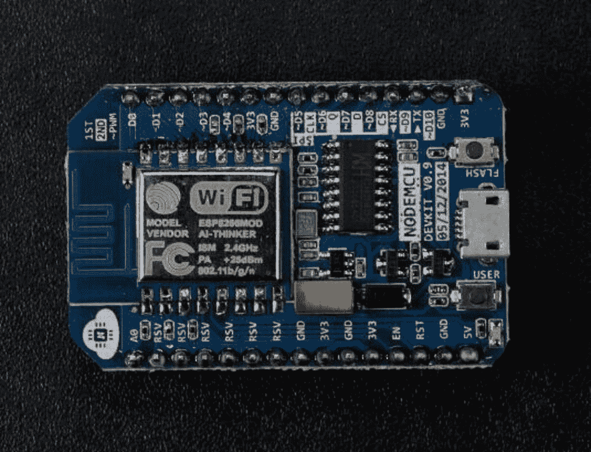
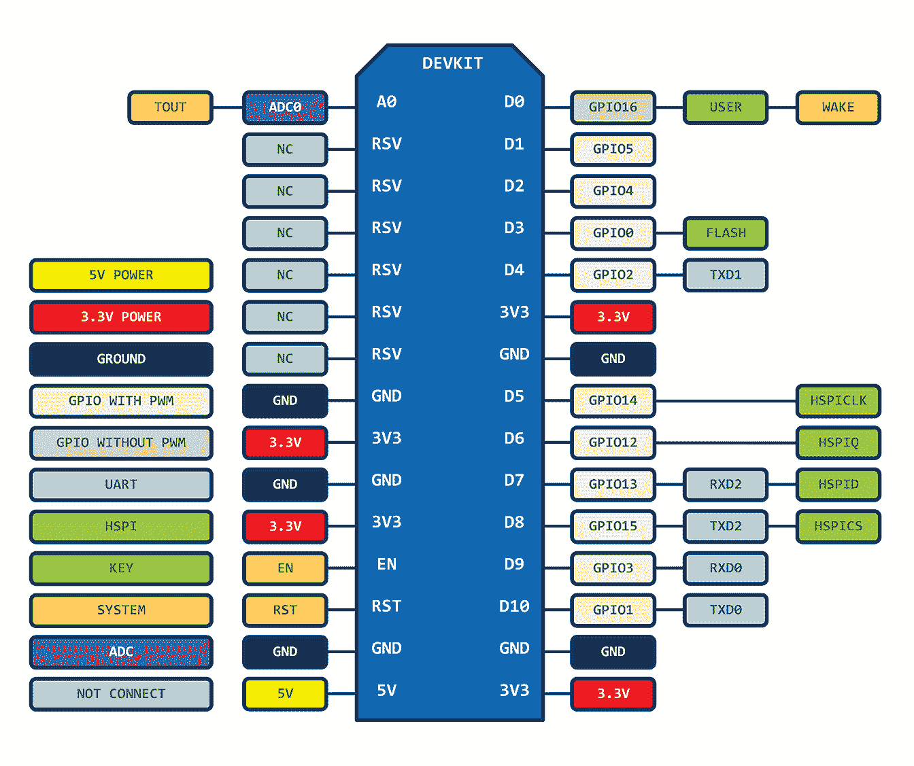
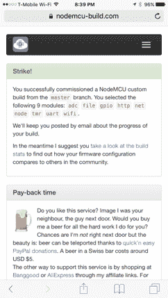

# Archived | 初识 NodeMCU 及其 DEVKIT 开发板

> 原文：[`developer.ibm.com/zh/tutorials/iot-nodemcu-open-why-use/`](https://developer.ibm.com/zh/tutorials/iot-nodemcu-open-why-use/)

**本文已归档**

**归档日期：:** 2020-03-10

此内容不再被更新或维护。 内容是按“原样”提供。鉴于技术的快速发展，某些内容，步骤或插图可能已经改变。

在为新 IoT 设备设计原型时，通常会选择使用开发板，比如 Arduino 和 Raspberry Pi。这些开发板实质上是微型计算机，可以连接到标准 PC 或 Mac 并通过它们进行编程。完成编程后，开发板可以连接并控制野外的传感器。（您可以在[这篇 IBM Developer 文章](https://www.ibm.com/developerworks/cn/iot/library/iot-lp101-best-hardware-devices-iot-project/index.html)中进一步了解 IoT 开发硬件。）

因为 IoT 中的“I”代表互联网，所以开发板需要采用某种方法来连接互联网。在现场作业时，连接互联网的最佳方法是使用无线网络。但是，Arduino 和 Raspberry Pi 没有内置对无线网络的支持。开发人员需要向开发板添加 Wifi 或蜂窝模块，通过编写代码来访问无线模块。

在本文中，我将介绍一个名为 NodeMCU 的开源 IoT 开发板。它的一个最独特的特性是内置了对 Wifi 连接的支持，因此使 IoT 应用程序开发变得容易得多。

## NodeMCU 是什么？

[NodeMCU](http://nodemcu.com/index_en.html)（节点微控制器单元）是一个开源软件和硬件开发环境，它围绕一个非常便宜的单芯片系统 (SoC) [ESP8266](https://en.wikipedia.org/wiki/ESP8266) 而构建。ESP8266 由 [Espressif Systems](https://espressif.com/en/products/hardware/esp8266ex/overview) 设计和制造，包含现代计算机的所有关键元素：CPU、RAM、网络 (wifi)，甚至是现代 [操作系统和 SDK](http://bbs.espressif.com/) 。批量购买时，一片 ESP8266 芯片的成本仅为 2 美元。这使它成为了所有类型的 IoT 项目的绝佳选择。

但是，作为芯片，ESP8266 也同样很难访问和使用。即使是最简单的任务，比如为它供电或发送击键信号到芯片上的“计算机”，也需要将电线焊接到它的 PIN 上，并提供合适的模拟电压。而且还需要使用可由芯片硬件解释的低级机器指令来对其进行编程。尽管在大规模生产的电子设备中使用 ESP8266 作为嵌入式控制器芯片时，这一集成水平不是问题，但这对爱好者、黑客或想在自己的 IoT 项目中试验它的学生而言是一种巨大负担。

NodeMCU 项目借鉴了成功的 [Arduino](http://www.arduino.org/) 或 [Raspberry Pi](https://www.raspberrypi.org/) 操作手册的内容，旨在简化 ESP8266 开发。它有两个重要组件。

1.  一个构建于该芯片制造商的专用 SDK 之上的开源 ESP8266 [固件](https://github.com/nodemcu/nodemcu-firmware)。该固件提供了一个基于 [eLua](http://www.eluaproject.net/)（嵌入式 [Lua](https://www.lua.org/)）的简单编程环境。eLua 是一种非常简单快捷的脚本语言，而且拥有一个完善的开发人员社区。对于新手，Lua 脚本语言很容易学习。
2.  一个 [DEVKIT 开发板](https://github.com/nodemcu/nodemcu-devkit)，它在标准电路板上嵌入了 ESP8266 芯片。该开发板有一个已与此芯片连接的内置 USB 端口、一个硬件重置按钮、Wifi 天线、LED 灯，以及可插入电路试验板中的标准尺寸 GPIO（通用输入输出）引脚。图 1 显示了 DEVKIT 开发板，图 2 显示了它的引脚模式。

##### NodeMCU DEVKIT 开发板



##### NodeMCU 引脚模式



花 8 美元的价格即可购得预先加载了该固件的 NodeMCU DEVKIT 开发板，这使它成为用于设计原型（甚至生产用途）的非常经济的设备。

但是，您可能会问 Arduino 有什么用？Arduino 项目为一个多用途的 IoT 控制器创建了一种开源硬件设计和软件 SDK。类似于 NodeMCU，Arduino 硬件是一个微控制器开发板，配备了 USB 接头、LED 灯和标准数据引脚。它还定义了与传感器或其他开发板交互的标准接口。但不同于 NodeMCU，Arduino 电路板可能拥有不同类型的 CPU 芯片（通常为 ARM 或 Intel x86 芯片），带有存储器芯片，以及各种各样的编程环境。事实上，还存在一种针对 ESP8266 芯片的 Arduino 参考设计。但是，Arduino 的灵活性还意味着不同供应商之间存在巨大差异。例如，大部分 Arduino 开发板都没有 Wifi 功能，有些甚至用串行数据端口代替 USB 端口。我感觉 NodeMCU 为 IoT 开发人员提供了更加一致、更容易访问的体验。

## NodeMCU 入门

尽管本文假设用户使用的是较新型号的 Mac OS X 计算机，但如果您使用了 Linux 机器，操作说明也基本相同。对于 Windows 用户，需要首先安装 [Python](https://www.python.org/downloads/) 和 [pip](https://pip.pypa.io/en/stable/installing/)。

### 安装一个 USB 转串行端口驱动程序

下载一个 USB 转串行端口驱动应用程序并安装在计算机上。我使用了来自 [Silicon Labs 网站](https://www.silabs.com/mcu)的应用程序。您的计算机需要这个驱动应用程序，以便使用标准 USB 线与 NodeMCU 开发板进行通信。

### 创建您的自定义 NodeMCU 固件

创建您自己的自定义 NodeMCU 固件。[转到 NodeMCU Custom Builds 网站](https://nodemcu-build.com/)，并选择您想要的选项。

##### 配置并创建您自己的 NodeMCU 固件



除了标准（默认）选择之外，您可能还想选择以下这些重要选项：

*   **ADC：**支持对 NodeMCU 开发板的 A0 引脚上的模拟输入（电压电平）进行测量。
*   **HTTP：**支持编写代码来处理 HTTP 请求。
*   **SSL / TLS：**支持 HTTPS 安全连接。
*   **MQTT：**支持 MQTT 协议使用基于 TCP/IP 的发布/订阅模型向其他设备或服务器发送数据。
*   **Websocket：**一个便捷的库，用于访问基于 websocket 的 Web 服务。
*   **DHT：**一个便捷的库，用于从 DHT 系列环境传感器读取数据。
*   **最终用户设置：**支持使用“捕获门户”让用户输入自己的 Wifi 密码，而无需将 Wifi 凭证硬编码到应用程序代码中。

创建固件后，系统将通过电子邮件向您发送一个下载固件二进制文件的链接。选择支持浮点数的构建版本，除非您知道您的应用程序将仅处理整数。

### 将固件闪存写入 NodeMCU 设备

安装 `esptool` Python 库，使用它将刚下载的固件闪存写入 NodeMCU 设备。

使用 Python 和 pip，运行以下命令来安装 `esptool` 和它的所有依赖项。

`sudo pip install esptool`

使用 USB 线将 NodeMCU 设备连接到计算机。NodeMCU 上的蓝灯将在连接时短暂闪烁。然后，运行以下命令来将刚下载的固件（`*.bin` 文件）闪存写入 NodeMCU。

`esptool.py --port=/dev/cu.SLAB_USBtoUART write_flash -fm=dio -fs=32m 0x00000 nodemcu-master-10-modules-2017-01-28-02-40-34-float.bin`

在 Mac 上，端口是上面介绍的 `/dev/cu.SLAB_USEtoUART`；在 Windows 上，端口可能是 `COM8`；在 Linux 上，端口可能是 `/dev/ttyUSB0`。

### 运行一些 Lua 代码

连接到您的 NodeMCU，运行一些 Lua 代码。幸运的是，在安装 `esptool` 时，系统还安装了 `miniterm` 作为依赖项。所以请继续运行以下命令。

```
miniterm.py /dev/cu.SLAB_USBtoUART 
```

现在，按下 NodeMCU 开发板上的 RESET 按钮，然后按下计算机键盘上的 RETURN 键几次。您首先会看到一些随机字符，最后会看到一个交互式命令提示符。

```
--- Miniterm on /dev/cu.SLAB_USBtoUART  9600,8,N,1 ---
--- Quit: Ctrl+] | Menu: Ctrl+T | Help: Ctrl+T followed by Ctrl+H ---
␒�␁@����␆�G��p��������␟␅]␝bvFD����������
>
> 
```

现在，可以在命令提示符上运行 Lua 脚本。尝试此命令：

```
print ("Hello World") 
```

现在可以试验它。来自 [NodeMCU 网站的“Examples”部分](http://nodemcu.com/index_en.html#fr_5475f7667976d8501100000f)的简单代码段是一个很好的起点。

作为 `miniterm` 的替代，您还可以使用 ESPlorer GUI 工具。但是，您需要在计算机上安装 Java。

### 更新 init.lua 脚本

只要 NodeMCU 开发板通电或重置，就会执行 `init.lua` 脚本。此脚本是您的应用程序的起点。下面是一段示例 `init.lua` 脚本，它会让板载的红色 LED 灯每秒闪烁一次。

```
-- D0 is the LED on the NodeMCU board
lpin = 0
-- timer to run every 1000ms
tmr.alarm(1, 1000, tmr.ALARM_AUTO, function()
    -- Turn on the LED
    gpio.write(lpin, gpio.LOW)
    -- Keep it on for 100ms
    tmr.delay(100000)
    -- Turn off the LED
    gpio.write(lpin, gpio.HIGH)
end) 
```

使用 `luatool` 程序将 `init.lua` 脚本安装在设备上。可以从这个 [GitHub 存储库](https://github.com/4refr0nt/luatool)下载 `luatool`。然后，从与 `init.lua` 文件相同的文件夹运行以下命令。

`python luatool.py --port /dev/cu.SLAB_USBtoUART --src init.lua --dest init.lua --verbose`

根据我的经验，您需要先运行 `miniterm`，并会看到 Lua 命令行提示符。然后，使用 `CTRL-]` 退出 `miniterm`，然后运行 `luatool.py`。原因在于 `luatool` 对串行端口中的噪声的容忍度较差。所以，我们应该先运行 `miniterm` 来清理该通道。

## NodeMCU 编程基础

目前为止，您已经了解了如何在 NodeMCU 上加载并运行 Lua 应用程序。在这部分，让我们回顾一下运行 NodeMCU 应用程序的一些基本技术。

### 开启 Wifi

NodeMCU 的一个重要特性是它开箱即用的 Wifi 功能。在 `init.lua` 脚本中，可通过几行代码将 NodeMCU 设备连接到任何 Wifi 网络。

```
-- setup Wifi
wifi.setmode(wifi.STATION)
wifi.sta.config("SSID","password") 
```

请注意，您需要知道网络名称和密码才能连接网络。如果设备可能位于多个不同环境中，一种常见技术是循环尝试一组已知网络名称和密码对。

### 连接到互联网

NodeMCU SDK 包含一个通过互联网发出 HTTP 请求的 HTTP 模块。构建 NodeMCU 固件时，您需要选择 HTTP 选项才能包含此模块。下面的代码段展示了如何发出 HTTP GET 请求，并在此请求完成后执行一些代码。在回调函数中，`code` 参数是 HTTP 返回值（例如，200 表示成功，404 表示 URL 无法访问），`data` 参数是 HTTP 响应消息中的内容。

```
geturl = "http://www.ibm.com/"
    http.get(geturl, nil, function(code, data)
        -- Turn off the red LED on NodeMCU board
end) 
```

### 访问 GPIO 引脚

通用输入输出 (GPIO) 引脚是 NodeMCU DEVKIT 开发板上的数字引脚。每个引脚只能有两种状态：低电压状态和高电压状态，分别用 0 和 1 表示。从 NodeMCU Lua 应用程序，可以读取每个引脚的状态，然后设置该状态。

```
-- Read the state of GPIO PIN #5\. The val value is 0 or 1
gpio.mode(5, gpio.INPUT)
val = gpio.read(5)

-- Set the state of GPIO PIN #5 to be HIGH
gpio.mode(5, gpio.OUTPUT)
gpio.write(5,gpio.HIGH) 
```

### 读取模拟信号

尽管 GPIO 引脚是数字引脚，但一些 IoT 传感器会以模拟信号形式传入数据。也就是说，输入线路的电压表示了该数据。例如，来自温度传感器的实际电压电平可能表示温度读数。在 NodeMCU DEVKIT 开发板上，A0 引脚可充当 ADC（模数转换器）引脚。当一条输入线连接到 A0 时，它在 0 到 3.3V 之间的电压电平将被转换为 0 到 1024 之间的整数。下面的代码段展示了如何从 A0 引脚读取模拟值。

```
-- Read the voltage level on A0\. The v value is from 0 to 1024
adc.force_init_mode(adc.INIT_ADC)
v = adc.read(0) 
```

ADC 引脚只能转换 0 到 3.3V 的电压。如果传感器生成的模拟电压在此范围外（比如 0 到 5V），则需要在输入线与 A0 引脚之间添加一个电阻。将 NodeMCU DEVKIT 开发板连接到电路试验板时，可以轻松地添加这个电阻。

## 结束语

在本文中，我介绍了 NodeMCU DEVKIT。它是一个强大、易于使用且成本非常低的 IoT 应用程序开发解决方案。对于 IoT 初学者，我感觉 NodeMCU 是从原型设计一直到生产部署的最佳选择之一。

在下一篇文章中，我将以 NodeMCU 为例，展示如何使用后端 [MQTT 服务](http://www.ibm.com/developerworks/cn/iot/iot-mqtt-why-good-for-iot/index.html)开发一个完整的 IoT 传感器解决方案。

本文翻译自：[Getting to know NodeMCU and its DEVKIT board](https://developer.ibm.com/tutorials/iot-nodemcu-open-why-use/)（2017-08-07）