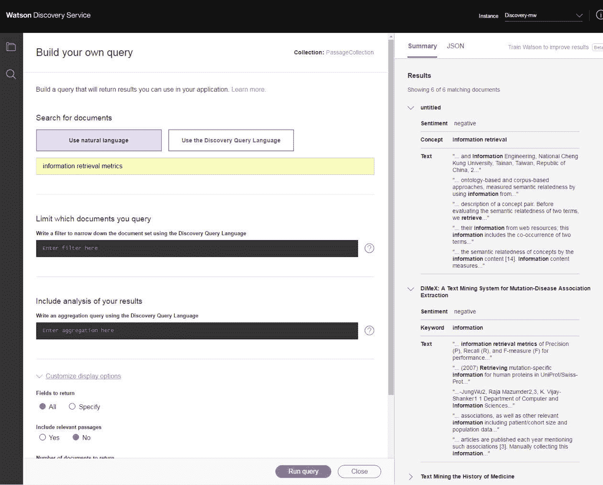
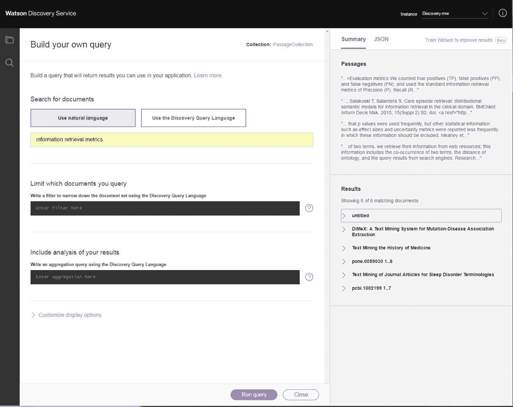
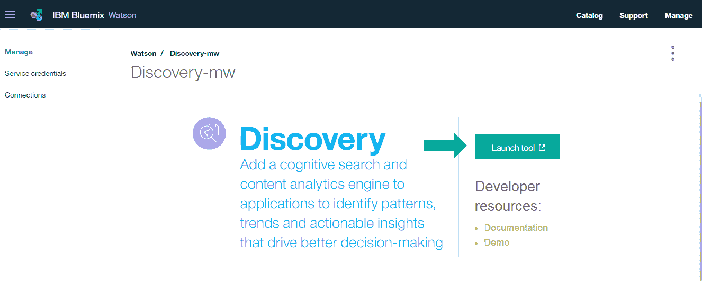
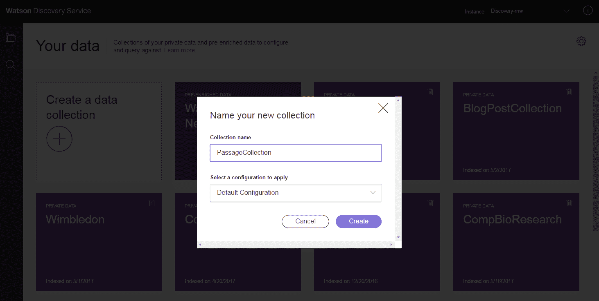
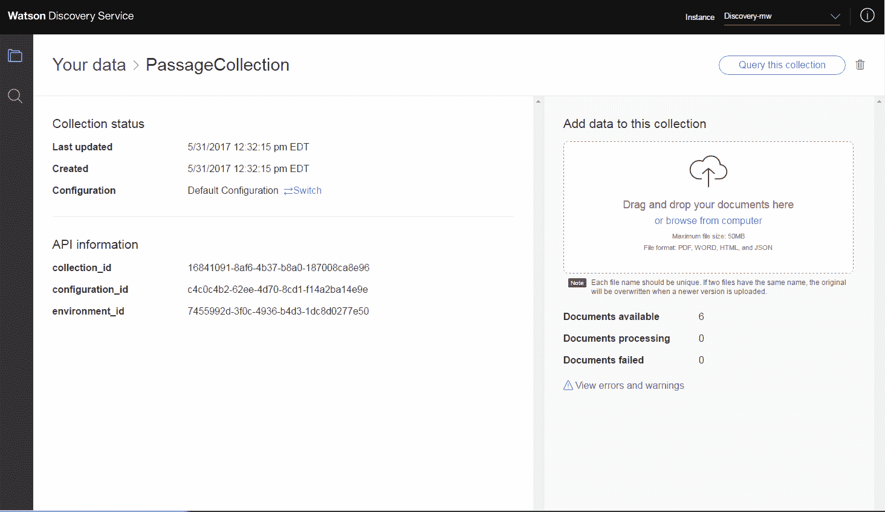
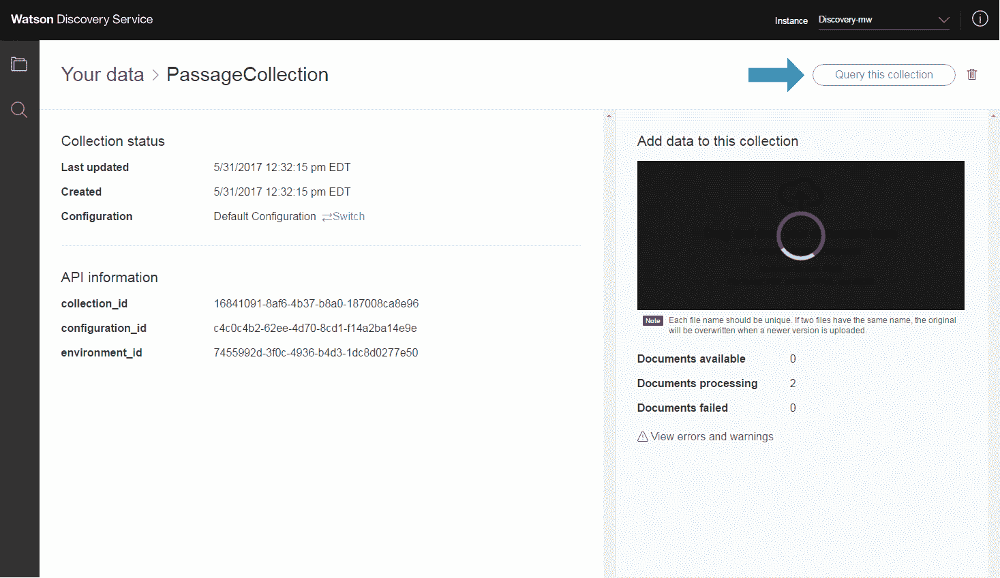
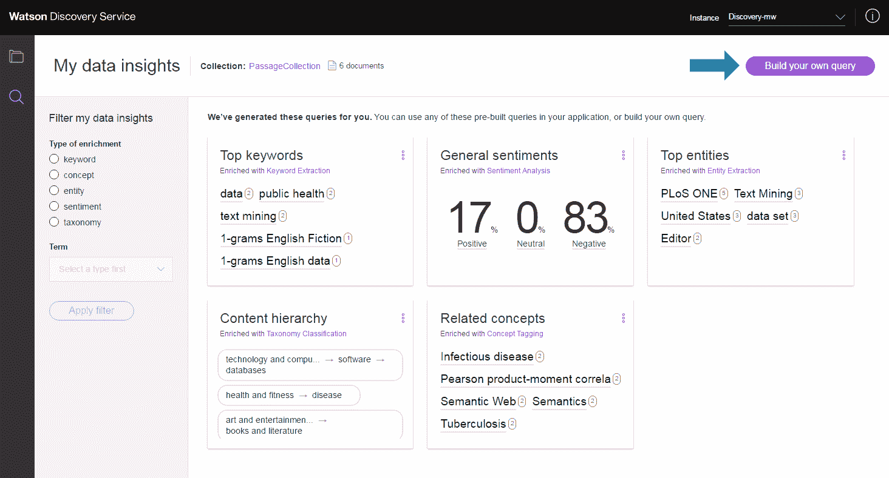
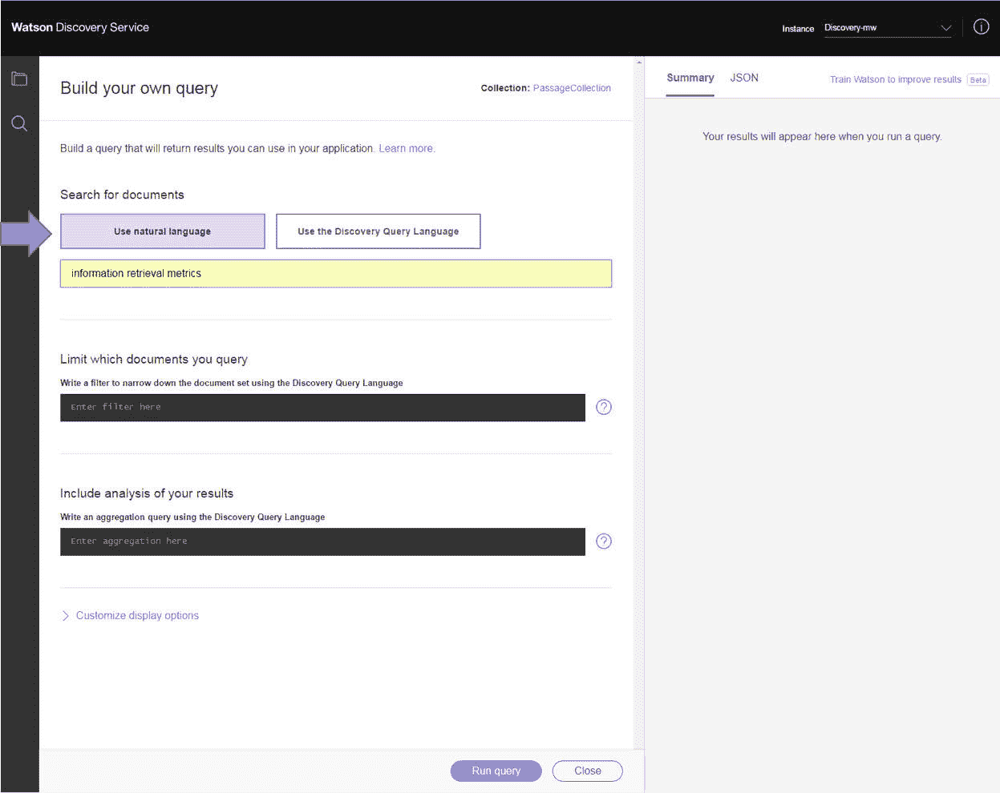
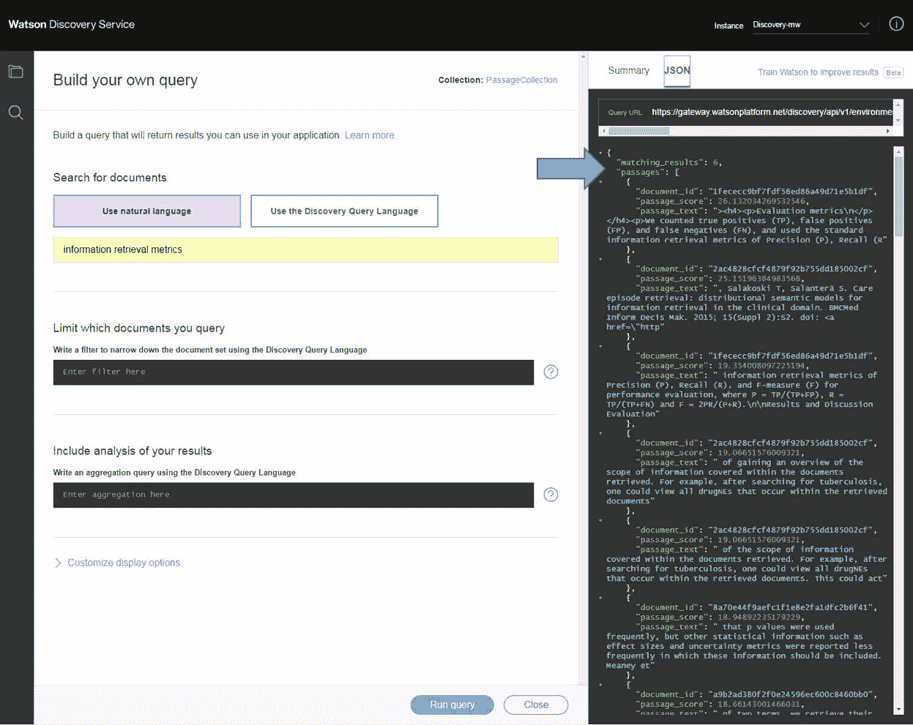

# 通过 Watson Discovery 中的 Passage Retrieval 快速寻找相关信息

> 原文：[`developer.ibm.com/zh/tutorials/cc-cognitive-watson-discovery-passage-retrieval/`](https://developer.ibm.com/zh/tutorials/cc-cognitive-watson-discovery-passage-retrieval/)

搜索信息很耗时。有时用户不知道在何处进行查找。数据可能位于不同的数据库、网站、电子邮件等地方。甚至在可以找到有用的产品文档或电子邮件时，也需要花费很长时间来准确找到他们所需的具体信息。IBM Watson Discovery 服务能通过其新的 [Passage Retrieval](https://www.ibm.com/watson/developercloud/doc/discovery/query-reference.html) 功能，在大量非结构化信息中快速找到正确的信息。

Passage Retrieval 允许在摄入 Discovery 中的不同大型文档中查找信息片段。找到文档后，它会根据您的查询来识别最可能、最相关的信息片段，并使用智能评分算法对段落进行排序。对于开发人员，Passage Retrieval 能更快地将手动获得的数据制作成可使用的信息单元，以供对话聊天机器人或搜索和探索接口使用。

例如，您可能在内容丰富详尽的出版物（比如来自 Public Library of Science 的出版物）中寻找有关“信息检索指标”的信息。

*   [`dx.plos.org/10.1371/journal.pcbi.1002199`](http://dx.plos.org/10.1371/journal.pcbi.1002199)
*   [`dx.plos.org/10.1371/journal.pone.0059030`](http://dx.plos.org/10.1371/journal.pone.0059030)
*   [`dx.plos.org/10.1371/journal.pone.0077868`](http://dx.plos.org/10.1371/journal.pone.0077868)
*   [`dx.plos.org/10.1371/journal.pone.0152725`](http://dx.plos.org/10.1371/journal.pone.0152725)
*   [`dx.plos.org/10.1371/journal.pone.0156031`](http://dx.plos.org/10.1371/journal.pone.0156031)
*   [`dx.plos.org/10.1371/journal.pone.0144717`](http://dx.plos.org/10.1371/journal.pone.0144717)

通过向查询中添加 Passage Retrieval，Discovery 可提高搜索精确度，这可以减少找到您寻找的信息所花的时间。

借助 Passage Retrieval，可以返回一个包含您需要的信息的更简洁的结果集。

## 入门

开始使用 Passage Retrieval 很简单。

1.  登录到您的 [IBM Cloud](https://cloud.ibm.com/?cm_sp=ibmdev-_-developer-tutorials-_-cloudreg) 帐户。请注意，如果您已经有一个 Discovery 实例，可以跳到第 5 步。
2.  单击 **Catalog**。
3.  单击 Watson 服务下的 **Discovery**。
4.  单击 **Create** 创建一个 Discovery 实例。
5.  从 Discovery 实例细节中，启动 Discovery 工具。

    

6.  单击 **Create a data collection** 在您的实例中创建一个新数据集合。如果以前已经创建了一个环境，您应该会看到下面这个给集合命名的窗口。如果未创建环境，您会看到一条创建环境的提示。也可以在 Discovery [文档](https://www.ibm.com/watson/developercloud/doc/discovery/getting-started-tool.html)中找到有关环境的更多信息。
7.  为该集合命名。可以继续使用默认配置，其中提供了 Passage Retrieval 的所有必要设置。

    

8.  创建集合后，将会打开集合细节页面。在此页面上，可以上传您想要对其执行 Passage Retrieval 的文档。Discovery 服务支持 PDF、Microsoft Word、HTML 或 JSON 格式的文档。可以轻松地将来自本地文件系统的文档拖到 Discovery 服务。

    

    传入一些文件后，应该看到可用文档数量已更新。现在您已准备好进行查询。

    

9.  选择 **Query this collection**。这会打开数据洞察页面，其中基于应用于内容的自然语言扩充概述了您的集合中的数据。要建立一个 Passage Retrieval 查询，请选择 **Build your own query**。

    

10.  在查询构建器界面中，选择 **Use natural language**，以在查询和过滤器输入中默认启用段落。

    

11.  如果选择 **Run query**，则会获得包含段落的结果。Summary 显示了段落文本，JSON 响应中有一个单独的顶层部分包含已检索的段落。每个段落都包含该段落的文本，以及一个指向可在其中找到该段落的文档的指针。默认情况下，响应中还会显示已检索文档的列表。

    

12.  查看 Results 窗口中的查询 URL，就可以了解如何使用 API 将 Passage Retrieval 集成到应用程序中。使用 `passages=true` 参数启用段落。

    /query?version=2016-11- 07&query=information%20retrieval%20metrics&count=&offset=&aggregation=&filter=&passages=true&highlight=true&return=

## 结束语

本教程演示了如何在 Watson Discovery 服务中启用 Passage Retrieval，以帮助在大量非结构化数据中精确查找相关信息。您可以在产品支持案例中使用 Passage Retrieval，帮助代理快速找到客户问题的答案，搜索方案来扫描最新的出版物，训练应用程序来帮助知识工作者跟上工作进度，还可找到其他许多潜在的用例。请参阅文档，了解关于如何试用 IBM Watson Discovery 服务中的 Passage Retrieval 的详细信息。

有关更多信息，请观看 [Building with Watson](https://www.ibm.com/watson/webinars/?cm_mmc=OSocial_Facebook-_-Watson+Core_Watson+Core+-+Platform-_-WW_WW-_-Passage+Retrieval+Sign+Up+for+Webinar&cm_mmca1=000016UP&cm_mmca2=10004084&) 网络讲座系列中提供的其他网络讲座。

本文翻译自：[Find relevant information quickly with Passage Retrieval in Watson Discovery](https://developer.ibm.com/tutorials/cc-cognitive-watson-discovery-passage-retrieval/)（2017-06-27）