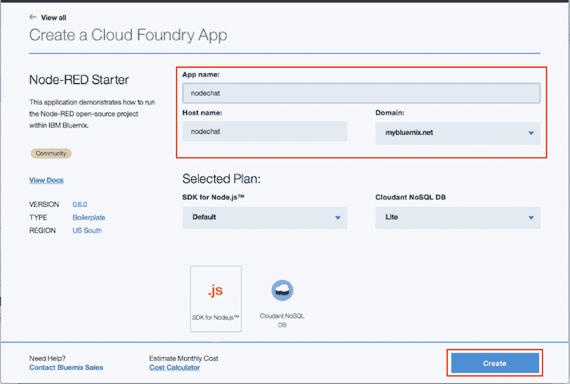

# 在 5 分钟内使用 Node-RED 构建一个实时聊天应用程序

> 原文：[`developer.ibm.com/zh/tutorials/cl-rtchat-app/`](https://developer.ibm.com/zh/tutorials/cl-rtchat-app/)

**免费试用 IBM Cloud**

利用 [IBM Cloud Lite](https://cloud.ibm.com/registration?cm_sp=ibmdev-_-developer-tutorials-_-cloudreg) 快速轻松地构建您的下一个应用程序。您的免费帐户从不过期，而且您会获得 256 MB 的 Cloud Foundry 运行时内存和包含 Kubernetes 集群的 2 GB 存储空间。

Node-RED 是 IBM 新兴技术团队创建的一个新开源工具，让您可以通过简单地连接各部分来构建应用程序。这些部分可以是硬件设备、Web API 或在线服务。

在 [IBM Cloud](https://cloud.ibm.com/?cm_sp=ibmdev-_-developer-tutorials-_-cloudreg) 上创建一个新的 Node-RED 运行时很容易。只需几次单击，即可拥有一个可用于创建新应用程序的有效环境。在本文中，我将介绍如何利用 IBM Cloud — 只需几分钟 — 就能在 Node-RED 上构建一个实时聊天应用程序。

[获得代码](https://git.ng.bluemix.net/laoqui/nodechat)

## 需要做的准备工作

*   一个 [IBM Cloud](https://cloud.ibm.com/registration?cm_sp=ibmdev-_-developer-tutorials-_-cloudreg) 帐户
*   HTML、CSS 和 JavaScript 的基本知识。我们提供了所有必要的代码，但对这些技术有基本的了解有助于您理解细节。

## 第 1 步.创建 Node-RED 应用程序

1.  登录到您的 IBM Cloud 帐户并创建一个新的 Node-RED 样板。

    

2.  为应用程序提供一个名称并单击 **CREATE**。

    

3.  从 IBM Cloud 仪表板中，导航到应用程序的 Overview 页，单击 **Visit…** 链接启动 Node-RED 的主页。应用程序启动可能需要一段时间；在它准备就绪后，会显示一个绿色圆圈和 “Running” 字样。

    

4.  第一次访问该网站时，会要求您执行一些基本配置工作。完成配置后，可以单击 **Go to your Node-RED flow editor** 打开流编辑器。

    

5.  您应该看到一个空白流，可从这里开始构建您的应用程序。使用 Node-RED 时，我们使用这个图形编辑器界面连接所需的各个块来构建应用程序。我们可以简单地从左侧菜单将各个块拖到屏幕中央的工作区中，并连接它们来创建一个新流。

    

## 第 2 步.导入代码

可使用 JSON 格式导入和导出每个 Node-RED 应用程序。所以下面将我们的聊天应用程序导入到新表中。

1.  访问 IBM DevOps Services 上的[项目存储库](https://git.ng.bluemix.net/laoqui/nodechat)并打开 `nodechat.json` 文件。
2.  复制整个文件的内容，然后在浏览器中返回到 Node-RED。
3.  单击右上角的菜单按钮，选择 `Import from...` > `Clipboard...`

    

4.  粘贴您从存储库复制的文件内容，单击 **Import**。

    

5.  单击空白表上的某处，添加已导入的节点。

    

本文后面将解释每个部分的作用，但现在是时候部署和运行您的应用程序了。

## 第 3 步.部署和运行应用程序

1.  单击菜单按钮旁边的红色 **Deploy** 按钮，激活您的应用程序。

    

2.  您应看到在顶部出现一条成功消息，而且节点上的蓝点将消失。这些点表示一个节点已更改但尚未部署。

    

3.  现在，在浏览器上打开一个新选项卡，访问 `http://[app name].mybluemix.net/chat`，将 `[app name]` 改成您为应用程序提供的名称。

    

4.  您的聊天应用程序现在已运行。在左侧的字段中输入一个用户名，在右侧的方框中输入一条消息，然后按 **Send**。

    

5.  在第二个窗口中打开聊天应用程序，或者将该链接发送给好友。您应该会立即收到消息。

    

## 第 4 步.解释代码（可选）

在本部分中，我们会更为详细地解释应用程序背后的代码。您可跳过本部分，但我们建议您通读本部分内容，更好地理解应用程序的构建方式，并进一步了解 Node-RED 的工作原理。

1.  在第一部分中，我们有 3 个节点：

    *   `WebSocket in`
    *   `Function`
    *   `WebSocket out`

    

    这些块负责创建通信通道，并使用 [WebSocket](http://www.websocket.org/) 协议实时处理消息。`Function` 块非常简单。它仅从 `msg` 对象中删除 `_session` 的值，以便将消息广播到与 WebSocket 相连的所有客户机。

    

2.  第二个流负责客户端代码。它有一个 `HTTP in` 节点，一个用于呈现 HTML 页面的 `Template`，以及一个提供响应的 `HTTP out` 节点。

    

    `HTTP in` 节点 (`[get] /chat`) 创建一个端点来接收 GET 请求，并将这些请求转发到 `Template`。`HTTP out` 节点创建合适的响应，呈现完模板后会将该响应发送回用户。

3.  模板可以分为 3 部分：页面结构、消息处理和视觉效果。
4.  页面结构是一个简单的 HTML 页面，包含一个将接收所有聊天消息的 `div`，以及一个包含消息发送字段的页脚。

    

5.  使用 JavaScript 完成消息处理工作。首先，打开一个与我们使用 Node-RED 创建的 WebSocket 端点的连接。

    

    接下来，我们为 `ws` 对象注册一个事件处理程序来处理各种事件，比如打开和关闭与服务器的连接，以及接收新消息。

    

6.  用户发送一条消息时，我们使用该用户名和消息创建一个对象，使用 `ws` 对象中的 `send` 方法将该对象发送给服务器。

    

7.  视觉效果部分使用一些简单的 CSS 规则来完成，本文没有介绍这些规则。

## 结束语

Node-RED 为我们提供一组适合连接在一起来使用的节点，简化了代码开发工作。如本文所示，只需极少的工作即可在 IBM Cloud 上设置一个服务器并在您的项目中使用它。您可添加新节点并创建与现有流相连接的新流，进一步完善这个简单的聊天应用程序的功能。