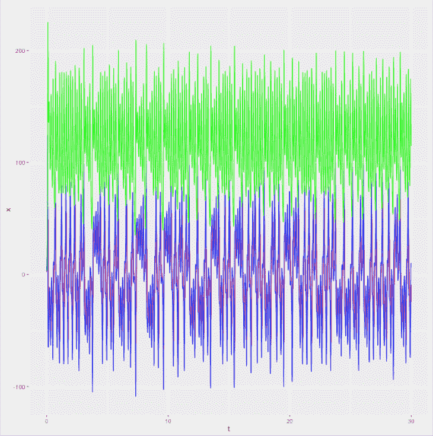

# 介绍深度学习和长期记忆网络

> 原文：[`developer.ibm.com/zh/tutorials/iot-deep-learning-anomaly-detection-1/`](https://developer.ibm.com/zh/tutorials/iot-deep-learning-anomaly-detection-1/)

尽管预测结果总是存在争议，[但 Gartner 认为，在 2017 年，会有 84 亿个互联的 IoT 设备](http://www.gartner.com/newsroom/id/3598917)（不包括智能电话），而且一些分析师认为，到 2020 年，该数字将会是 500 亿。就算该数字被高估，但 IoT 设备的数量很快就会超过全球人口数量。而且众所周知，所有这些设备都在不断生成数据；如果不对这些数据进行分析，它们将毫无用处。

认知系统提供了一组技术功能来帮助分析所有这些数据，这些功能包括人工智能 (AI)、自然语言处理、机器学习和高级机器学习。认知系统能自然地向人类学习并与人类交互，以便从数据中收集洞察，帮助人们制定更好的决策。在[我的上一篇文章](https://developer.ibm.com/zh/tutorials/iot-cognitive-iot-app-machine-learning/)中，我曾提到过，认知计算不只是人机交互 (HCI)，它还是一种受强大的算法（模型）和接近无限的数据处理功能驱动的高级机器学习。

要了解使用 IoT 传感器和深度学习分析的认知系统，首先需要了解从高级机器学习到神经网络的跳跃式发展。在本文中，我会尝试帮您了解这种跳跃。在未来几周，我将通过 3 篇不同的教程介绍如何在 Apache Spark 上使用 Deeplearning4j、ApacheSystemML 和 TensorFlow (TensorSpark) 深度学习框架检测时序数据上的异常，帮助您充分理解如何使用深度学习为异常检测开发认知 IoT 解决方案。

## 从机器学习到神经网络和深度学习

如果认知系统基于模型，那么您需要首先了解机器学习模型是什么。与通过数据训练来学习隐藏模式的物理模型（白盒）相反，机器学习模型是一种统计模型（黑盒）。

参见机器学习模型。它包含不同参数的历史数据、在一个制造管道上测量到的观察结果，以及一个二元结果。

##### 机器学习模型

| 部件编号 | 最高温度 1 | 最低温度 1 | 最大震动 1 | 结果 |
| --- | --- | --- | --- | --- |
| 100 | 35 | 35 | 12 | 正常 |
| 101 | 36 | 35 | 21 | 正常 |
| 130 | 56 | 46 | 3412 | 故障 |

在这个高度人为的示例中，数字的含义不言而喻。您可能已经猜到，高温度和高震动会导致部件故障。出现这种情况的根本原因可能是机器中的某个轴承坏了。

在这个示例中，（监督式）机器学习算法能考虑所有这些数据（以及其他许多数据），以便从纯数据中学习并预测故障。这样一种算法生成的组件被称为*机器学习模型*。

*神经网络*是一种特殊类型的机器学习算法。它非常适合数据，而且能学习任何在数据和结果之间的隐藏数学函数。神经网络的唯一缺陷在于，需要大量的计算资源和数据才能良好执行。那么我为什么还要谈论神经网络呢？我们生活在一个 IoT 世界中，通过使用云，我们可以获得海量的数据和（接近）无限的计算能力。这种情况使神经网络对 IoT 数据处理特别有用。

神经网络的灵感来源于人脑，深度学习网络也是如此。神经网络与深度学习网络的主要区别在于添加了多个神经层。深度学习优于传统机器学习的最明显例子是图像识别。每个最先进的系统都会使用一种特殊类型的深度学习神经网络（称为*卷积神经网络*）来执行其任务。

例如，基于深度学习的图像识别算法能区分制造管道中的正常部件与故障部件。我将此称为*机器智能*，[IBM Watson Visual Recognition Service](https://www.ibm.com/watson/services/visual-recognition/)中也这么称呼它。对于这个特定的示例，机器可以像人类一样准确完成相同的任务。机器的唯一优势在于，它从不睡觉，从不请病假，而且从不会受伤。此外，如果想让生产量加倍，只需将硬件或云资源量加倍即可。但是，如果要对部件间或性故障进行根本原因分析，则仍是人类专家的领域。不过，认知解决方案可在这种场景中应用深度学习。

事实上，视觉识别服务返回的信息远比“正常”或“故障”这样的二元结果多得多。像人类一样，该服务会检测图像中偏离标准的结构和区域。现在，如果想将所有声音和震动传感器数据与所有视觉识别数据相关联，我敢肯定这样一个系统能够像人类一样有效地检测故障根源，或者甚至比人类更有效。

## 人工神经网络的工作原理

如果说与消息代理（比如基于 MQTT 的 IBM Watson IoT Platform）相连的 IoT 传感器是认知解决方案的中枢神经系统，那么深度学习就是大脑。要理解深度学习，需要对回归、感知器、生物和人工神经网络，以及隐藏层有基本的了解。

### 首先介绍线性和逻辑回归

有许多介绍回归的科学文献，所以我将试着给出适合开发人员的简短说明。考虑人工神经网络数据。它与机器学习模型相同，但在这里我将结果转换成了二进制表示。

##### 人工神经网络数据

| 部件编号 | 最高温度 1 | 最低温度 1 | 最大震动 1 | 结果 |
| --- | --- | --- | --- | --- |
| 100 | 35 | 35 | 12 | 1 |
| 101 | 46 | 35 | 21 | 1 |
| 130 | 56 | 46 | 3412 | 0 |

很容易编写一个软件来实现分类。

```
def  predict  (datapoint):
       if  datapoint.MaxVibration1 > 100 :
              return 0
       else :
              return 1 
```

在这个白盒模型示例中，您的底层物理系统知识（或分析数据的领域专家知识）有助于创建一些规则。机器学习的理念是让机器从数据中学习这些规则。完成此学习的方式是，使用一个框架 (skeleton)，并使用优化算法来填充该框架的缺失部分。我将使用这样一个框架（线性回归）：

```
def  predict (dp) :
       return  a + b * dp.MaxTemp1 + c * dp.MinTemp1 + d * dp.MaxVibration1 
```

如您所见，如果我选择参数 `b` 和 `c` 为 0，`a` 为 1，`d` 为 -0.0002930832（也即 -1/3412），最终结果会非常接近我需要的结果。好消息是，参数 `a 、b、c` 和 `d` 可从算法中学习。结果：机器学习！

您可能注意到，结果并不是准确的 1 或 0，因为线性回归是一个（尝试预测浮点类型值的）连续模型。但我想要的是一个二元分类器。让我们通过添加一个名为 `sigmoid` 的帮助器函数，将此算法转换为逻辑回归模型。

```
 import  math

 def  sigmoid (x):
     return  1 / (1  +  math.exp( - x))

 def  predict (dp):
     return  sigmoid(a + b * dp.MaxTemp1 + c * dp.MinTemp1 + d * dp.MaxVibration1) 
```

`sigmoid` 函数的唯一作用是将从负无穷大到正无穷大的区间缩小为 0 -1 的区间。我只需要定义一个阈值，例如将小于 0.5 的值转换为 0，将大于 0.5 的值转换为 1。

##### sigmoid 函数映射区间


### 最简单的神经网络：感知器

您现在已经熟悉了最简单的神经网络：*感知器*。它类似于逻辑回归模型 – 有一些可忽略不计的差异。但 “神经网络” 这个词要高深得多，对吧？参见 一个感知器 中的感知器。

##### 一个感知器


我为模型提供 `x_1` 到 `x_n` 的输入，模型拥有 `w_1` 到 `w_n` 的参数。然后我对这些数值进行求和，并使用一个激活函数（例如 `sigmoid`）将求和结果缩小。如果用稍微不同的方式编写此模型，它看起来类似于：

```
out(x_1,x_2,...,x_n) = activation_function(w_0+w_1*x_1+w_2*x_2+...+w_n*x_n) 
```

如果将 `activation_function` 替换为 `sigmoid`，则又回到了逻辑回归。唯一的区别是……它现在看起来更像大脑的结构。但是人脑是什么样子的？

### 从生物神经网络到人工神经网络

看看生物神经元中的生物神经元。在数学术语中，树突是 “输入”，上游数据从这里传入；细胞体（和突触）计算总和并执行 “激活函数”；“结果” 通过轴突发送到下游的后续神经元。

##### 生物神经元


因为很有趣（至少对我而言），让我们来看看生物突触，它描绘了一个（以生化方式）将神经元连接在一起的生物突触。这个图中描绘了感知器中的 `w_n` 值的集合。

##### 生物突触


如果将多个神经元链接在一起，就会获得一个如人工神经网络所示的大脑或人工神经网络。

##### 人工神经网络


### 不同之处在于隐藏层

这个人工网络与感知器的最大区别在于隐藏层。隐藏层是什么？它有用吗？可能有用。至少在人脑中，隐藏层似乎很有用，因为我们的大脑中堆叠着数百个隐藏层。在图 6 中的这个前馈神经网络示例中，可以看到模型堆叠在一起。

##### 堆叠神经网络层来实现图像识别


没有看到？看看这个模型的编程语言表示形式。但在这么做之前，让我告诉您一个秘密。一个被数学家用来吓跑所有人的秘密。但这个秘密非常简单。我讲的是*矢量乘法*。矢量是什么？矢量就是一列数字，没有别的。程序员可能称之为*数组*。矢量乘法的定义稍有不同。它规定，如果有一个矢量 `x=(x_1,x_2,...,x_n)` 和另一个矢量 `w=(w_1,w_2,...,w_n)`，而且如果将它们相乘 `x*w`，那么结果是一个值：

```
w_1*x_1+w_2*x_2+...+w_n*x_n 
```

此模型看起来熟悉吗？如果不熟悉，让我们再次看看线性回归。我可以通过计算 `sigmoid(x*w)` 来计算一个神经元。而且因为 Python 不支持直接使用矢量乘法，所以我可以使用 `numpy` 库来实现此目的。我将开始计算一个神经元：

```
import numpy as np

datapoint = {" MaxTemp1 ": 35 , " MinTemp1 ": 35 , " MaxVibration1 ": 12 }

#randomly initialize weights
w_layer1 = np.random.rand(4)

def  neuron1 (dp):
    x = np.array([ 1 ,dp[" MaxTemp1 "],dp[" MinTemp1 "],dp[" MaxVibration1 "]])
    return  sigmoid(x.dot(w_layer1))

print (neuron1 ( datapoint ) ) 
```

如果想要同时计算多个神经元（例如一个层的所有神经元），可以使用此函数多次。但是数学家发明了另一个概念来迷惑您（如果您没有被矢量乘法弄晕）：*矩阵乘法*。在神经网络中，可以像线性回归中一样并行执行不同次数的计算，而且可以通过这种形式将此过程编写为矩阵乘法。

同样地，我假设输入包含在矢量 `x=(x_1,x_2,...,x_n)` 中。但是现在我想同时计算隐藏层中的所有神经元。无需将 `x` 乘以一个权重矢量 `w` 来计算一个神经元，我将 x 乘以一个权重矩阵 `w=`

```
w_1_1,  w_1_2,.., w_1_m
w_2_1,  w_2_2,.., w_2_m
...
w_n_1,  w_n_2,.., w_n_m 
```

矩阵乘法将 `w*x =` 定义为 “

```
(w_1_1*x_1,  w_1_2*x_2,.., w_1_m*x_n,
w_2_1*x_1,  w_2_2*x_2,.., w_2_m*x_n,
...
 w_n_1*x_1,  w_n_2*x_2,.., w_n_m*x_n) 
```

我的结果是一个浮点值矢量，然后可以将该矢量提供给下一层。这是 Python 中的相同代码：

```
import numpy as np

#make sigmoid function applicable to vectors instead of scalars only
def  sigmoid (z):
    s =  1.0  / ( 1.0  + np.exp(- 1.0  * z))
        return  s

datapoint = {" MaxTemp1 ": 35 , " MinTemp1 ": 35 , " MaxVibration1 ": 12 }

#randomly initialize weights, now as a matrix for the four hidden layer neurons
w_layer1 = np.random.rand(4,4)

def  layer 1 (dp):
     x = np.array([ 1 ,dp[" MaxTemp1 "],dp[" MinTemp1 "],dp[" MaxVibration1 "]])
        return  sigmoid(x.dot(w_layer1))

print ( layer 1 ( datapoint ) ) 
```

如您所见，代码段 `x.dot(w_layer1)` 没有发生任何改变。但在内部应用了矩阵乘法而不是矢量乘法，因为 `w_layer1` 现在是一个矩阵而不是矢量。最后，我需要添加输出层，并编写了以下代码：

```
w_layer2 = np.random.rand( 5 , 2 )

def  layer2 (x):
     x = np.concatenate(([ 1 ],x))
        return  sigmoid(x.dot(w_layer2))

print (layer2(layer1(datapoint))) 
```

当然，权重矩阵 `w` 未经训练，仅被随机初始化。对神经网络的训练不属于本文的讨论范围。

**备注：**这个随机神经网络输出了两个浮点数。这些数字是某个项属于一个类或其他类的概率。同样地，因为该神经网络未经训练，所以这些数字目前没有任何意义。

```
[ 0.97435552   0.89144977] 
```

### 深入了解隐藏层

隐藏层有何作用？就其本身而言，每一层都可以视为一个单独的机器学习算法。上游层的输出被用作输入，它的输出被传递到下一层，然后下一层使用该输出作为输入，依此类推。此行为意味着，当堆叠各种层和创建深度神经网络时，系统会学习数据的中间表示，以帮助下游层更有效地完成其工作。最具有启发性的示例是人脑的视觉系统。前几层（感光器后的几层）无法识别面部、汽车和猫，但能识别形状，比如线、圆、矩形和点。越深入，一层能识别的东西就越多……直到最终识别整幅图像。

因此，我在本节中得出以下结论：深度前馈神经网络能学习任何数学函数（只要有足够的数据和计算能力来训练它）。

## 时序数据需要长期记忆网络

希望您深信神经网络非常强大。但不幸的是，对于时序数据（IoT 数据主要是时序数据），前馈网络存在着缺陷。这些网络很难识别顺序，因为它们不会保留记忆。此问题的一个解决方案是添加反馈循环。

##### 反馈循环


这些反馈循环从某种程度上解决了这个问题，因为网络现在是能够记忆的。但它只会临时记住最近发生的事件。如果网络要记住更久远的事件，可向神经元添加记忆细胞来获得长期记忆 (LSTM) 网络，如长期记忆网络所示。

##### 长期记忆网络


### 训练需要计算能力

LSTM 网络有何缺点？在使用神经网络时，需要大量数据和计算能力才能获得良好的性能。好消息是，目前的图形处理单元 (GPU) 卡的计算能力已相当于 2009 年的一个 16.000 核心集群。此外，IBM 正准备[发布一种神经形态芯片](http://www.research.ibm.com/articles/brain-chip.shtml)，该芯片由 IBM Watson Group 提供，具有相同的计算能力，但功耗仅为 3 瓦。所以未来有望提高性能和节约能源。

根据以下出版物中的发现，LSTM 网络在时序预测和异常检测方面正在超越最先进的算法：

*   [用于检测时序数据中的异常的长期记忆网络](https://www.elen.ucl.ac.be/Proceedings/esann/esannpdf/es2015-56.pdf)
*   [使用深度学习进行时序建模 – CS 229 最终项目报告](http://cs229.stanford.edu/proj2012/BussetiOsbandWong-DeepLearningForTimeSeriesModeling.pdf)
*   [使用重建概率实现基于变化自动编码器的异常检测](http://dm.snu.ac.kr/static/docs/TR/SNUDM-TR-2015-03.pdf)

### LSTM 网络可以学习任何算法

为什么我会在认知 IoT 场景中介绍所有这些内容？因为 LSTM 网络是图灵完备的。这意味着 LSTM 网络能学习计算机可执行的任何算法。就这么简单。

而且这与许多用于时序预测和异常检测的最先进机器学习算法形成了鲜明对比，这些算法是认知 IoT 所涉及的领域。在认知 IoT 应用中，您需要预测系统的未来状态来提前采取调控措施，或者您想在某个部件发生故障时获得通知。

那么最先进的算法有何问题？毫无问题。我说的是 LSTM 通常比最先进的算法表现得更好；有时会好很多，有时会好一点，很少比它们表现得差（尤其是在有足够的数据来训练系统时）。用额外的计算成本换取准确性的提升是否值得，这取决于具体用例。

## 演示用例：IoT 时序数据的异常检测

请思考这个演示用例。这个用例是后续教程的基础。考虑对测量轴承的震动传感器（加速计）数据执行异常检测任务。可以将一个传感器附加到轴承上，如 轴承上的加速计传感器 所示。

##### 轴承上的加速计传感器


洛伦茨吸引子是 Edward Lorenz（混沌理论的先驱之一）在 1963 年提出的常微分方程的理论物理模型。（要进一步了解 [Lorenz 系统，](https://en.wikipedia.org/wiki/Lorenz_system) 请参阅这篇 Wikipedia 文章。）

在该模型中，`x`、`y` 和 `z` 组成了系统状态。在我们的用例中，要模拟的是轴承的当前震动强度，其中 `t` 是时间，σ (sigma)、ρ (rho)、β (beta) 是系统参数。要将此模型从正常状态切换为故障状态，只需稍微更改参数 σ (sigma)、ρ (rho)、β (beta)，就会导致系统状态 `x`、`y` 和 `z` 形成完全不同的时间轨迹。

加速计传感器记录了 3 个几何轴 x、y 和 z 上的震动。更复杂的传感器还会考虑旋转运动模式，但对我们而言这个简单模式就足够用了，因为在每个智能电话中都能找到它。（如果想了解如何访问和分析智能电话中的加速计，可以阅读这篇[教程](https://developer.ibm.com/zh/tutorials/iot-simple-iot-accelerometer-game/)。）由于很难将这样一个系统在此展示，我需要在 Node-RED 中实现一个模拟器，以便使用物理*洛伦茨吸引子模型*生成数据。我将在教程中使用生成的这些数据来检测异常，主要预测轴承何时会损坏。

我可以在两种状态之间切换测试数据生成器：正常和故障。正常状态的相位图是一个相位图，显示了一个正常状态下的一个时序上的 3 个震动维度。

##### 正常状态的相位图


通过正常状态的相位图中的同一个相位图，可以观察到，只需稍微改动物理模型的参数，即可获得故障状态。

##### 故障状态中的相位图


如果不熟悉相位图，正常状态中的运行图和故障状态中的运行图给出了 3 个轴值（在正常和故障状态下）的运行图。

##### 正常状态中的运行图


##### 故障状态中的运行图



一种常见技术是，使用 DFT（离散傅立叶变换）或小波变换将此数据从时域转换为频域。正常状态的离散傅里叶变换和故障状态的离散傅里叶变换中也给出了正常和故障状态的 DFT。

##### 正常状态的离散傅里叶变换


##### 故障状态的离散傅里叶变换


可以清楚地看到，故障状态消耗的能量更多，出现的频率也更高。此数据足以用来训练您前面学到的分类器。但我们可以做得更好。我们将构造一个能从数据中学习正常行为的系统，而且在看到新的（未曾见过的）数据（或顺序模式）后，它会发出警报。

LSTM 自动编码器模型 中所示的基于 LSTM 的自动编码器就是这样一个系统。

##### LSTM 自动编码器模型


这个系统通过神经瓶颈尝试重建它看到的相同数据，从而压缩大量数据，但同样也会在使用瓶颈时，丢弃大量不相关数据。这样一种神经网络能学习系统的正常行为，而且只要看到新模式，它就很难重建数据并会发出警报。

## 结束语

现在您已充分理解神经网络，也理解了数据应用深度学习概念对认知系统中的 IoT 数据有何作用。

在接下来的 3 篇文章中，我将重点介绍如何在 Apache Spark 上使用不同技术实现这样一个深度学习系统，并进一步加强您对这种技术能在您系统中产生的影响的理解。我会介绍 IBM 云中运行的开放标准和开源解决方案，比如 Deeplearning4j、Apache SystemML 和 TensorFlow (TensorSpark)。

本文翻译自：[Introducing deep learning and long-short term memory networks](https://developer.ibm.com/tutorials/iot-deep-learning-anomaly-detection-1/)（2017-05-16）