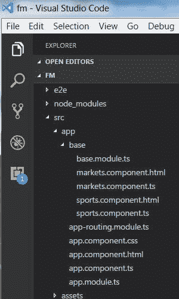

# 在 Angular 4 中加载功能模块

> 原文：[`developer.ibm.com/zh/tutorials/wa-load-feature-modules-in-angular4/`](https://developer.ibm.com/zh/tutorials/wa-load-feature-modules-in-angular4/)

过去几年来，Angular 作为单页 Web 应用程序的开发框架变得越来越流行。尽管 Angular 4 最初是为 JavaScript 而设计的，但它在 Angular 2 基础之上添加了对更多语言的支持，比如 Dart 和 Typescript。

本教程将介绍如何在 Angular 中开发和加载功能模块。尽管对于较小的应用程序，根模块就足够用了，但对于更大更复杂的应用程序，需要创建功能模块。还需要能够高效地加载模块，以获得最佳应用程序性能。

注意，本教程适用于熟悉使用 Angular 进行基本 Web 应用程序开发的开发人员。

第一次接触 Angular？[从这里开始！](https://developer.ibm.com/tutorials/wa-implement-a-single-page-application-with-angular2/)

[Angular 应用概览](https://angular.io/guide/architecture)

## Angular 中的功能模块

单页 Web 应用程序在启动时仅呈现一个 HTML 页面。除了该 HTML 页面之外，服务器还会向客户端发送一个应用程序引擎。该引擎会控制整个应用程序，包括处理和加载 HTML 页面。

一个 Angular 应用程序由以下部分组成：

*   模块
*   组件
*   模板
*   元数据
*   数据绑定
*   指令
*   服务
*   依赖注入

每个 Angular 应用程序都至少有一个模块，称为根模块。您可以引导根模块来启动 Angular 应用程序。对于小型应用程序，只需要根模块和一些组件。在构建更复杂的中到大型应用程序时，会向应用程序添加功能模块。

功能模块根据业务需求被组织在一个更大的应用程序中。每个模块都包含它所需的特性和功能，而且一些模块被设计为可以重复使用。

[在 Github 上获得应用源代码](https://github.com/suresht1/NG_Loading_Feature_Modules)

## 关于示例应用程序

本教程将介绍使用 Angular 4 创建一个中型 Web 应用程序的过程。示例应用程序在 4 个功能区域呈现不断更新的信息：Markets、Sports、Weather 和 Currency。除了为每个区域开发特性模块之外，还可以考虑和实现 3 种应用程序加载技术。

### 加载技术

有效的加载策略是开发一个单页应用程序成功的关键。对于示例应用程序，将结合使用 3 种常见的加载技术来实现一种混合加载策略：

*   **贪婪加载** ：在贪婪加载场景中，所有模块和功能都在应用程序启动时加载。对根模块始终采用贪婪加载，在一些情况下，也会对其他功能使用贪婪加载。
*   **惰性加载** ：随着应用程序的功能区域的构建，应用程序的大小会不断增加。在某个时刻，应用程序的大小会达到一个阈值，然后应用程序的加载开始变缓。惰性加载用于减少中大型应用程序的初始加载时间。在示例应用程序中，将使用惰性加载来满足以下应用程序需求：

    *   仅在用户请求时加载应用程序区域。
    *   加快仅访问某些（优先）区域的用户的加载速度。
    *   扩展应用程序功能而不增加初始加载包的大小。
*   **预加载** ：在预加载场景中，主应用程序启动所有标为贪婪加载的模块，然后几乎立即在后台加载 `<ModulesDefinedAsLazyLoading>` 。当用户导航到这些辅助模块中的某个模块时，就会加载该模块并准备就绪。

出于本教程的目的，假设应用程序用户最感兴趣的是获取有关金融市场和体育项目的更新。您首先要加载这些模块，随后加载货币和天气模块。

### 前提条件

要掌握本教程，需要在开发机器上安装两个工具：

*   [Node](https://nodejs.org/en/download/)
*   [Angular CLI](https://github.com/angular/angular-cli)

输入命令 `ng -v` ，以便找到您当前使用的 Angular CLI 和 Node 的版本。如下所示，我使用的是 Node 7.9.0 和 Angular CLI 1.0.2。

```
@angular/cli: 1.0.2
node: 7.9.0
os: win32 x64 
```

## 练习 1：贪婪加载

示例应用程序目前有两个模块： `AppModule` 和 `BaseModule` 。 `AppModule` 是根模块， `BaseModule` 是功能模块。 `BaseModule` 包含两个功能区域：Markets 和 Sports。我们指定对这些应用程序执行贪婪加载，所以 `AppModule` 会在应用程序启动时调用 `BaseModule` 。

让我们来分析一下该应用程序：

1.  如果尚未下载源代码，请下载它。
2.  将 Angular4BaseModules 源文件（位于 Angular4TutorialSrc.zip 中）解压到一个空目录位置。我的目录名为 `.../fm` 。
3.  转到 `.../fm` 目录并输入命令 `npm i` 。这会在 `.../fm` 文件夹中创建 `node_modules` 目录，即 `.../fm/node_modules` 。
4.  运行命令 `ng serve` 。

您会看到应用程序在默认端口 4200 中成功运行，以及一条与此消息类似的消息：

##### 应用程序运行在端口 4200


`ng` 是一条 Angular CLI 命令，您将使用它构建和处理应用程序代码。打开 Chrome 浏览器并输入 URL **[`localhost:4200`](http://localhost:4200)** 。您会看到该应用程序正在运行。如果单击 Home 图标，将会看到 Markets 的功能区域：

##### Markets 的用户界面


如果单击 Sports，将会看到 Sports 的功能区域：

##### Sports 的用户界面


现在转到 `fm/src/app` 目录中的应用程序代码。这是该目录的快照。

##### 应用程序目录结构



在您的应用程序目录中，打开文件 `app.component.html` 。用户单击 Markets 链接时，应用程序会调用 `/markets` 路径。用户单击 Sports 链接时，应用程序会调用 `/sports` 路径。

##### 主应用程序中的路径


打开文件 `app-routing.module.ts` ，如下所示。

##### app-routing.module.ts


在调用 `/markets` 和 `/sports` 路径时，会调用 `MarketComponent` 和 `SportsComponent` 。如果未指定路径，数组中的第一项会重定向到 `/markets` 路径。

要确认目前实现的应用程序功能，可在浏览器中返回到 **[`localhost:4200`](http://localhost:4200)** 。在 Windows 机器上，按下 **Fn+F12** 。在 Mac 机器上，按下 **Command->Option->i** 。现在您会看到 Chrome 开发人员工具 GUI。查看 `Sources/top/ng://` 部分，然后重新加载 URL。如图 7 所示，您会看到在重启应用程序时自动加载了 `AppModule` 和 `BaseModule` 。

##### 在 Google Chrome 开发人员工具中查看源代码


## 练习 2：惰性加载

假设多个团队正在为此应用程序开发模块。您的离岸团队刚交付了 Weather 和 Currency 模块。您的任务是将新模块合并到主应用程序中。

从应用程序源代码中解压 Angular4LazyLoadModules 文件（位于 Angular4TutorialSrc.zip 中）。将 `weather` 和 `currency` 文件夹复制到您的主应用程序目录中，如下所示。

##### 将辅助模块添加到主应用程序目录


您的下一个任务是告诉 Angular 为 Weather 和 Currency 模块实现惰性加载。要将新模块添加到基础应用程序中，可以编辑 `app-routing.module.ts` ，如下所示：

##### 原始 app-routing.module.ts 的一节

```
const appRoutes: Routes = [
  { path: '', redirectTo: '/markets', pathMatch: 'full' },
  { path: 'markets', component: MarketsComponent },
  { path: 'sports', component: SportsComponent }
]; 
```

##### 更新后的 app-routing.module.ts 的一节

```
const appRoutes: Routes = [
  { path: '', redirectTo: '/markets', pathMatch: 'full' },
  { path: 'markets', component: MarketsComponent },
  { path: 'sports', component: SportsComponent },
  { path: 'weather', loadChildren: './weather/weather.module#WeatherModule' },
  { path: 'currency', loadChildren: './currency/currency.module#CurrencyModule' }
]; 
```

更新后的代码告诉 Angular，在用户请求时加载辅助模块。请注意， `weather` 模块的 `loadChildren` 属性被设置为 `WeatherModule` 的地址。该地址是 `WeatherModule` 的文件位置（相对于应用程序根目录），后跟 `# separator` ，再后面是已导出的模块类的名称 `WeatherModule` 。Currency 模块的配置完全相同。

当路由器导航到更新后的地址时，它会使用 `loadChildren` 字符串动态加载 `WeatherModule` 或 `CurrencyModule` 。第一次请求某个新路径时，会惰性加载该模块并重新配置应用程序路径。然后该路径立即可供后续请求使用。

### 更新 UI

接下来，将会更新用户界面。在您的应用程序目录中找到文件 `app.component.html` ，将光标放在以下语句下方：

##### 原始 app.component.html 的一节

```
<li routerLinkActive="active"> <a routerLink="/sports">Sports</a></li> 
```

在该语句下插入以下代码：

##### 更新后的 app.component.html 的一节

```
<li class="dropdown"> <a href="#" data-toggle="dropdown" role="button" aria-haspopup="true" aria-expanded="false" class="dropdown-toggle">Weather <span class="caret"></span></a>
  <ul class="dropdown-menu">
    <li routerLinkActive="active"><a [routerLink]="['/weather/yahoo']">Yahoo! Weather</a></li>
    <li routerLinkActive="active"><a [routerLink]="['/weather/facts']">Weather Facts</a></li>
    <li routerLinkActive="active"><a [routerLink]="['/weather/globalwarming']">Global Warming</a></li>
  </ul>
</li>
<li routerLinkActive="active"> <a routerLink="/currency">Currency</a></li> 
```

现在用户将会看到并能单击 Weather 和 Sports 应用程序区域的新菜单。请注意，Weather 有 3 个子菜单。

保存文件内容，然后发出命令 `ng serve` 来运行该应用程序。

##### 该应用程序正在运行


现在检查执行 `ng serve` 命令后的应用程序输出。您会看到两个针对 “chunk” 文件的新行，它们是被 `angular-cli` 自动添加的。这些行表示您惰性加载的模块。

浏览器中的应用程序现在应包含 Weather 和 Currency 菜单，如图 10 所示。

##### 右上角的 Weather 和 Currency 菜单


### 幕后过程

在继续操作之前，我们看看此加载机制的细节。首先在 Chrome 浏览器中运行该应用程序。在 Windows 机器上，按下 **Fn+F12** 。在 Mac 上，按下 **Command->alt->i** 。单击 Network 选项卡并等待页面加载。单击 Weather 或 Currency 链接前，查看下面的图 11 （第 1 列）和图 12（第 1 列）。

##### 测试和调试期间可用的源代码


##### 网络相关信息


这些图显示了贪婪加载的模块 AppModule 和 BaseModule。可以看到 Weather 和 Currency 模块尚未加载。

现在尝试单击 **Currency** 菜单，查看图 11（第 2 列）和图 12（第 2 列）中的 Sources 和 Network 选项卡。您会看到 Currency 模块 (`module(y.chunk.js)`) 已加载。但是，Weather 模块尚未加载。单击 **Weather** ，然后单击 Weather 子菜单下的一个菜单项。参见图 11（第 3 列）和图 12（第 3 列），您现在应看到 Weather 模块 `(module(x.chunk.js))` 也已加载。

请注意， *x* 和 *y* 块分别有一个整数值；惰性加载机制通过它们获知要加载这些模块。

## 练习 3：预加载

除了等待用户调用辅助模块的路径，有时预先加载这些模块更高效。在这种情况下，在贪婪加载主要模块后，路由器开始预加载标有 `loadChildren` 属性的所有剩余模块。

要为预加载重新配置应用程序，可编辑您的 `app-routing.module.ts` ，如下所示。下面的代码导入了预加载模块并调用它们的功能。

##### 原始 app-routing.module.ts 的一节

```
import { Routes, RouterModule } from '@angular/router'; 
```

##### 更新后的 app-routing.module.ts 的一节

```
import { Routes, RouterModule, PreloadAllModules } from '@angular/router'; 
```

##### 原始 app-routing.module.ts 的一节

```
imports:[RouterModule.forRoot(appRoutes)], 
```

##### 更新后的 app-routing.module.ts 的一节

```
imports:[RouterModule.forRoot(appRoutes, {preloadingStrategy:PreloadAllModules})], 
```

保存更新后的文件，然后运行该应用程序。在 Chrome 浏览器中重新加载该应用程序，然后转到 Chrome 开发人员工具的 Network 和 Sources 选项卡。 `x.chunk.js` 和 `y.chunk.js` 文件应紧接着主应用程序后被加载，使辅助模块在用户单击这些菜单 *之前* 就已可用。参见 Angular4PreLoadModules.zip 中的示例应用程序，更详细地了解预加载。

**自定义预加载**：在大型应用程序中，仅预先加载少数惰性加载模块的做法是比较合理的。请参见 Angular 文档的 [路由和导航](https://angular.io/docs/ts/latest/guide/router.html#!) 部分，了解如何自定义预加载配置。

## 结束语

加载时间是应用程序性能的关键因素，它会影响应用程序的用户体验。本教程介绍了一种混合加载策略，使用贪婪加载、惰性加载和预加载 3 种技术来提高应用程序性能。要实现有效的混合加载策略，可遵循以下经验法则：

*   对基础应用程序功能和主要模块使用 **贪婪加载** 。这些是必须在应用程序启动时就能用的资源。
*   对大多数用户将要访问的模块使用 **预加载** ，即使它们不是第一个查找的或查找得最频繁的应用程序资源。
*   对需求不太高的模块使用 **惰性加载** 。

#### 致谢

感谢 IBM 成员 John Petri、David Stanich、Mark Shade、Dean P. Cummings 和 Don Turner 在编写本教程期间提供的审查和支持。

本文翻译自：[Loading feature modules in Angular 4](https://developer.ibm.com/tutorials/wa-load-feature-modules-in-angular4/)（2017-06-01）