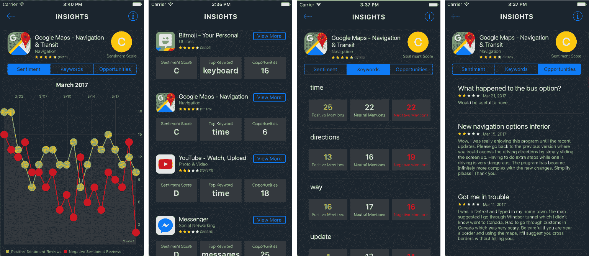
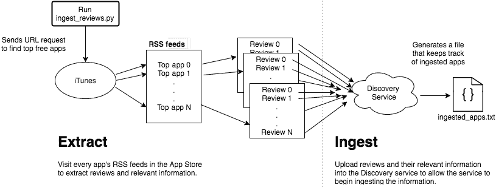
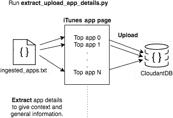

# 使用 IBM Cloud、Watson Discovery 和 Cloudant 构建移动应用程序来分析其他应用程序

> 原文：[`developer.ibm.com/zh/tutorials/cc-build-app-analysis-mobile-app-bluemix-watson-discovery-cloudant/`](https://developer.ibm.com/zh/tutorials/cc-build-app-analysis-mobile-app-bluemix-watson-discovery-cloudant/)

由于想进一步了解数据分析，我决定利用最近发布的 Watson Discovery 服务。我想看看能否从 iTunes App Store 中排名前 10 的免费应用程序的评价中获取任何价值。由于 Python 简单快捷，我选择使用 Python 来提取和抓取应用程序评价。我想创建一个移动应用程序来显示我找到的所有数据，所以我使用了 Swift 来显示信息。App Insights 是一个在 IBM Cloud 上运行的移动应用程序，它使用 Watson Discovery 服务为评价提供分析，并使用 Cloudant 存储应用程序细节。



我的应用程序特性：

*   情绪随时间的变化：Watson [Discovery](https://www.ibm.com/watson/services/discovery/) 在每条评价中找到的基于特定目标短语的情绪。
*   关键词：从每条评价中获取的重要主题。
*   机会：通过查询 Discovery 服务所返回的评价。每条评价代表一个您发现要实现、更改或删除哪些特性的机会。

## 前提条件

您必须满足以下前提条件，才能构建该应用程序：

*   一个 [IBM Cloud 帐户](https://cloud.ibm.com/registration?cm_sp=ibmdev-_-developer-tutorials-_-cloudreg)
*   一个 [Cloudant 帐户](https://developer.ibm.com/sso/bmregistration?target=/catalog/services/cloudant-nosql-db/)，可通过 IBM Cloud 将它添加到您的应用程序中
*   一个从 IBM Cloud 添加到您的应用程序中的 [Discovery 服务](https://developer.ibm.com/sso/bmregistration?target=/catalog/services/discovery/)实例
*   [Xcode 8.x](https://developer.apple.com/xcode/)
*   [Carthage 0.18.1](https://github.com/Carthage/Carthage)

**[获得代码](https://github.com/watson-developer-cloud/app-insights-discovery)**

## 设置后端配置

我使用 Python 提取、解析和上传从应用商店的 RSS 提要中获取的评价。然后清理数据，将应用程序细节上传到 Cloudant，并将应用程序评价上传到 Discovery 服务。

1.  安装 Python 脚本需要的以下第三方依赖项：

    ```
    pip install --upgrade watson-developer-cloud
    pip install cloudant
    pip install -U python-dotenv
    pip install beautifulsoup4
    pip install lxml
    pip install cssselect 
    ```

2.  将您的 Watson Discovery 和 Cloudant 凭证插入 Scripts/.env 文件中：

    ```
    DISCOVERY_USERNAME="YOUR-DISCOVERY-USERNAME-HERE"
    DISCOVERY_PASSWORD="YOUR-DISCOVERY-PASSWORD-HERE"
    DISCOVERY_VERSION="2016-12-15"
    COLLECTION_NAME="EXAMPLE-COLLECTION-NAME"
    CLOUDANT_USERNAME="YOUR-CLOUDANT-USERNAME-HERE"
    CLOUDANT_PASSWORD="YOUR-CLOUDANT-PASSWORD-HERE"
    DATABASE_NAME="EXAMPLE-DB-NAME" 
    ```

    为您的 Watson Discovery 集合和 Cloudant 数据库提供您想要的名称。如果 Discovery 集合或 Cloudant 数据库实例不存在，Python 脚本会为您创建它们（假设每个服务的凭证已正确完成）。

3.  按此顺序运行这两段脚本，以便将信息载入 Cloudant 和 Discovery 中：

    ```
    python Scripts/ingest_reviews.py
    python Scripts/extract_upload_app_details.py 
    ```

    `ingest_reviews.py` 脚本通过从应用商店的 RSS 提要中提取评价来抓取排名前 10 的免费应用程序的评价，然后将评价转到 Discovery 服务中来扩充它。`extract_upload_app_details.py` 脚本提取一般的应用程序细节信息，包括应用程序名称、描述、URL、评价数量和评分。然后将这些信息存储在被应用程序调用的 Cloudant 中。

## 设置前端配置

1.  使用 [Carthage](https://github.com/Carthage/Carthage) 安装第三方依赖项。请注意，第一次运行此命令可能需要 20 分钟。

    ```
    cd app-insights-iOS
    cd carthage update --platform iOS 
    ```

    此命令从 Carthage 拉入所有依赖项。我使用了 Graphs、Watson Developer Cloud Swift SDK 和 SwiftyJSON 库。

2.  将您的 Discovery 和 Cloudant 用户名和密码插入到 app-insights-iOS/app-insights/Configuration.swift 文件中。将您在运行 Python 脚本时创建的 Discovery 集合名称和 Cloudant 数据库名称插入到 Configuration 文件中。

    ```
    import Foundation
    public struct Credentials {
    static let DiscoveryUsername = "your-discovery-username-here"
    static let DiscoveryPassword = "your-discovery-password-here"
    static let EnvironmentName = "your-discovery-environment-name"
    static let CollectionName = "your-collection-name"
    static let DiscoveryVersion = "2017-02-14"
      static let CloudantUsername = "your-cloudant-username-here"
      static let CloudantPassword = "your-cloudant-password-here"
      static let AppsDBName = "your-cloudant-database-name"
    } 
    ```

按下 **Build and run** 来查看正在运行的 Xcode’s iPhone 模拟器应用程序。

## 架构解释

上述 Python 脚本设置了从应用商店提取的信息的一个静态副本。访问在 iTunes 的[排行榜页面](https://www.apple.com/itunes/charts/free-apps/)上找到的每个上榜应用程序的 RSS 提要，以便抓取每个应用程序的评价。`scriptextract_reviews.py` 脚本将会清理评价，并以文档形式将每个评价上传到 Discovery 服务内创建的一个集合中。使用 Python 的 ElementTree 库提取相关信息，需要此信息才能将 XML 数据从[此格式](https://itunes.apple.com/us/rss/customerreviews/page=1/id=284815942/sortby=mostrecent/xml)转换为类似下面这样的多个 JSON 文档：

```
{
"review": "It's a fun park management game. Just at the moment when you found yourself enjoying the game, poof, all your progress was gone and Atari reassigned you a new player ID.",
"review_id": 1553629663,
"version": "1.07",
"updated": "2017-02-27T01:41:00-07:00",
"rating": 2,
"app_name": "RollerCoaster Tycoon Touchv2",
"title": "Fun game till all progress is lost"
} 
```



在 `extract_reviews.py` 脚本完成运行后，它会创建一个 ingested_apps.txt 文本文件来记录 Discovery 服务引入了哪些应用程序。这个文本文件很重要，因为不是所有应用程序都有 RSS 提要。没有 RSS 提要的应用程序没有评价可供提取，所以这些应用程序会被跳过，下一个最流行应用程序的评价将被抓取。extract_upload_app_details.py 文件接受此文本文件，以便向应用商店发送更多 URL 请求来抓取每个应用程序的细节。使用 Cloudant Python SDK，以文档形式将以下 JSON 上传到 Cloudant。

```
{
"name": "Bitmoji - Your Personal Emoji",
"description": "Bitmoji is your own personal emoji. Create an expressive cartoon avatar. Choose from a huge library of stickers all featuring YOU. Use Bitmoji in Snapchat, iMessage and wherever else you chat. Using Bitmoji in Snapchat unlocks friendmoji 2-person bitmojis featuring you and your friends!",
"imageURL": "http://is4.mzstatic.com/image/thumb/Purple122/v4/2e/53/b3/2e53b39c-5101-94df-5cdf-88e331bc594e/source/1200x630bb.jpg",
"category": "Utilities",
rating: 4.5,
"numberOfReviews": 36907,
"topKeyword": "keyboard",
"numberOfTurnarounds": 16,
"appSentimentValue": -0.079542891986754932
} 
```



如果查看此代码，就会看到从 Discovery 服务抓取的字段 `topKeyword`、`numberOfTurnarounds` 和 `appSentimentValue`，而不是从应用商店本身抓取的。这是因为在我正创建的应用程序的主页上，此数据被用作所提取的每个应用程序的摘要。我存储了用户单击每个单元时能看到的信息的摘要，而无需在加载应用程序时向 Discovery 和 Cloudant 服务发送双倍的 URL 请求。

创建该应用程序的最难的部分是，确定提取的数据是否包含有趣的趋势或内容。幸运的是，Discovery 服务有一个非常出色的[工具](https://discovery-tooling.mybluemix.net/)，它不仅能查看所创建的集合，还会尝试自定义配置、[查询](https://www.ibm.com/watson/developercloud/doc/discovery/query-reference.html)和[聚合](https://www.ibm.com/watson/developercloud/doc/discovery/query-reference.html#aggregations)。

### iOS 客户端代码

设置完后端后，我们就可以探索使用哪些查询和聚合来创建应用程序。通过将 Watson Developer Cloud 依赖项包含在 Carthage 中，我能利用 [Swift SDK](https://github.com/watson-developer-cloud/swift-sdk) for Watson 并使用它的 Discovery 服务。

我们来看一下 app-insights-iOS/app-insights/DiscoveryManager.swift 文件，它让应用程序抓取我想呈现给用户的关键数据。我先是定义了常量以用于访问我在 Configuration/Credentials.swift 文件中输入的凭证，之后创建了一个 Discovery 单例，以便仅允许此类有一个实例，并遵循单例设计模式。单例模式背后的理念是控制对 DiscoveryManager 的实例化和访问。我决定采用此方法是因为，在我用于操作从 Discovery 服务收到的数据的各种视图控制器中，该应用程序仅需要 DiscoveryManager 的一个实例即可访问其查询方法。

另外，在使用单例实例的背后，有许多考虑因素。使用单例的 Apple 很常见。但是，单例可能是全局状态的，而面向对象编程入门指南认为全局变量不好。（要了解其中的原由，可以复习一下[此内容](http://wiki.c2.com/?GlobalVariablesAreBad)。）全局变量可能生成隐式耦合，使得对象定义和对象使用之间的接口依赖于无法在对象接口中显式捕获的共有知识。换句话说，可能存在隐藏的依赖关系。由于单例要管理自己的生命周期，所以可能还会出现范围限定问题。但是，当前的应用程序必须访问 DiscoveryManager 和 CloudantManager，因为我需要访问它们在整个应用程序中提供的数据。

那么我该如何使用 Swift SDK 的 Discovery 服务？在 DiscoveryManager 中，我首先导入 DiscoveryV1，以便能够访问该 SDK 的 Discovery 方法。我在 `setupDiscovery` 方法内实例化了一个 `Discoveryobject`，应用程序主页出现时会调用该方法来设置这个单例实例，并延迟实例化该类。

```
func setupDiscovery(onSuccess success: @escaping () ->Void, onFailure failure: @escaping (DiscoveryErrors) ->Void) {
// Instantiate a Discovery instance using our Credentials.
discovery = Discovery(
username: Credentials.DiscoveryUsername,
password: Credentials.DiscoveryPassword,
version: kDiscoveryVersion) 
```

实例化一个 Discovery 实例后，我需要抓取用来存储数据集合的环境。我使用创建的环境名称来调用 `getEnvironments` 方法，将返回的相应 `environmentID` 存储为一个 `fileprivate var`。我现在可以在整个 DiscoveryManager 中访问此变量，我需要该变量是因为所有方法都依赖于这个环境 ID。如果不能访问该变量，则会返回一个故障：

```
// Fetch environment
discovery.getEnvironments(withName: kEnvironmentName,
failure: { error in
print("Error - getEnvironments: (error)")
failure(.other(error.localizedDescription))},
success: { environments in
print("Environments: (environments)")
if let environmentID = environments.first?.environmentID {
self.environmentID = environmentID
// Fetch collection
self.getCollectionID(onSuccess: success, onFailure: failure)
} else {
failure(DiscoveryErrors.noEnvironments)
}
})
} 
```

在 `success` 回调中，现在可通过调用 `ongetCollectionID` 找到附加到环境的数据集合，这需要有一个有效的环境 ID。因此，在将 `environmentID` 变量设置为该服务返回给我的信息后，我调用了 `getCollectionID` 方法。加载该应用程序并在主屏幕上单击一个集合单元后，将跳转到 `GraphViewController` 中的 `AppDetailsview`。这个视图控制器在完成情绪数据的加载后向 Discovery 服务查询该数据，方法是使用 DiscoveryManager 的单例实例来调用其 `queryForSentiment` 方法：

```
func queryForSentiment(appName: String, onSuccess success: @escaping ([GraphSentiment]) ->Void, onFailure failure: @escaping (DiscoveryErrors) ->Void) {
discovery.queryDocumentsInCollection(
withEnvironmentID: environmentID,
withCollectionID: collectionID,
withAggregation: "filter(app_name:(appName)).timeslice(updated,1day).term(review_enriched.docSentiment.type)",
return: "aggregations",
failure: { error in
failure(.other(error.localizedDescription))},
success: { response in
if let responseData = try? JSONSerialization.data(withJSONObject: response.json, options: []) {
var graphSentiments =GraphSentiment
let json = JSON(data: responseData)
                // Unwrap first aggregation response returned by Discovery service. Unwrapping over response index and corresponding value.
                guard let (_, firstAggregation) = json["aggregations"].first else {
                    failure(DiscoveryErrors.unexpectedJSON)
                    return
                }
                // Safely unwrap second part of aggregation json response returned by Discovery service.
                guard let (_, secondAggregation) = firstAggregation["aggregations"].first else {
                    failure(DiscoveryErrors.unexpectedJSON)
                    return
                }

                let timeSlice = secondAggregation["results"]
                for (_, timeSliceInterval) in timeSlice {
                    let time = timeSliceInterval["key_as_string"].stringValue
                    var positiveSentiment = Sentiment(type: "positive", matchingResults: 0)
                    var negativeSentiment = Sentiment(type: "negative", matchingResults: 0)

                    // Iterating over array's index and its corresponding value
                    guard let (_, timeSliceIntervalResults) = timeSliceInterval["aggregations"].first else {
                        failure(DiscoveryErrors.unexpectedJSON)
                        return
                    }
                    for (_, sentiment) in timeSliceIntervalResults["results"] {
                        guard let matchingResults = Int(sentiment["matching_results"].stringValue) else {
                            failure(DiscoveryErrors.stringToIntFailed)
                            break
                        }
                        if sentiment["key"] == "positive" {
                            positiveSentiment.matchingResults = matchingResults
                        }
                        if sentiment["key"] == "negative" {
                            negativeSentiment.matchingResults = matchingResults
                        }
                    }
                    let graphSentiment = GraphSentiment(date: time, positiveSentiment: positiveSentiment, negativeSentiment: negativeSentiment)
                    graphSentiments.append(graphSentiment)
                    success(graphSentiments)
                }

            }
    })
} 
```

我们分解一下该方法：

```
func queryForSentiment(appName: String, onSuccess success: @escaping ([GraphSentiment]) ->Void, onFailure failure: @escaping (DiscoveryErrors) ->Void) 
```

此函数定义获取了我想查询的应用程序名称，以及转义后的成功和失败闭包，以便允许应用程序处理每种情况。`@escaping` 闭包可以将方法的范围转义为类的范围。如果成功，则会返回一个 `GraphSentiment` 对象数组的强引用，我可以在调用此 `queryForSentiment` 方法的类中使用该引用。否则，会返回一个 `DiscoveryErrors` 对象的强引用。Swift 3.0 避免了对象意外转义闭包问题，以及由于闭包默认未转义而导致的保留周期。

```
discovery.queryDocumentsInCollection(
withEnvironmentID: environmentID,
withCollectionID: collectionID,
withAggregation: "filter(app_name:(appName)).timeslice(updated,1day).term(review_enriched.docSentiment.type)",
return: "aggregations",
failure: { error in
failure(.other(error.localizedDescription))},
success: { response in 
```

我调用 Discovery 服务的方法来查询文档。使用在设置 Discovery 服务实例时定义的 `environmentID` 和 `collectionID`，然后指定想在数据上运行哪种聚合。

```
withAggregation: "filter(app_name:(appName)).timeslice(updated,1day).term(review_enriched.docSentiment.type)",
return: "aggregations", 
```

Discovery 服务有自己的查询引用语言，我需要遵守该语言的规则。我通过过滤应用程序名称 `filter(app_name:\(appName)`，指定想在集合中查询哪个应用程序。这会告诉 Discovery 服务过滤 `keyapp_name` 中所有与我传入函数调用 `appName` 中的字符串匹配的值。`'.'` 将要在过滤器返回的数据上构建的其他聚合链接在一起。基于返回的应用程序，我创建了一个 `timeslice`，后者返回的 JSON 中提供了构建全天范围内的情绪变化图所需的信息。然后我通过术语 `keyword` 来聚合此信息，这会得出最常见的文档情绪类型 — 正面、中性或负面。最终，作为此聚合的结果，我会收到该应用程序每天的正面、中性和负面情绪评价数量。

`return` 参数允许我指定想从 Discovery 服务收到哪些信息，而且可以减少传回的数据量和获取该信息所需的时间。因为我仅对聚合结果感兴趣，所以我指定该服务仅返回聚合结果。有关可以聚合哪些数据的更多信息，请参阅 Discovery 服务的[查询参考指南](https://www.ibm.com/watson/developercloud/doc/discovery/query-reference.html#aggregations)。

```
failure: { error in
failure(.other(error.localizedDescription))}, 
```

如果由于语法错误、网络错误等，Discovery 服务无法解析聚合，则返回该错误。

```
success: { response in
if let responseData = try? JSONSerialization.data(withJSONObject: response.json, options: []) {
var graphSentiments =GraphSentiment
let json = JSON(data: responseData) 
```

否则，我会解析 Discovery 服务返回的数据，以 `GraphSentiment` 对象形式返回数据供我构造图表。由于返回的对象因摄入数据和查询数据的方式不同而不同，所以 SDK 会以原始 Foundation 对象形式返回所有 Discovery 响应。尽管这使得 Swift 这样的强类型语言更难解包和使用数据，但这些操作是有可能做到的。使用 Foundation 的 `JSONSerialization` 类将数据序列化为 JSON 后，可求助于 SwiftyJSON！对象 `json` 现在是一个 JSON 对象，我可以像访问 Dictionary 的键和值一样使用它。

解包 JSON 对象的缺陷在于，数据解包方式高度依赖于数据的返回方式。不幸的是，了解数据返回方式的唯一途径是打印出对象，比如 `print ("graph data = \(json)")`。这样做之后，就会看到下面这种难看的原始格式：

```
{
"results" : [
{
"id" : "4ef583c4-c7af-4c5c-bba4-189197606c57",
"score" : 1
},
{
"id" : "a2848c63-7f2a-40e7-bcd2-5614ee50c585",
"score" : 1
},
{
"id" : "79102dd5-2129-4e81-bcbd-79bc814c12da",
"score" : 1
},
{
"id" : "5e2b5685-1e08-4706-a470-175151c3b383",
"score" : 1
},
{
"id" : "2cf2c9ac-29dc-4e1f-b465-e7dc7fc1401e",
"score" : 1
},
{
"id" : "63488b40-56ae-4cbb-91ad-209fd40737a1",
"score" : 1
},
{
"id" : "ae8d0803-ee94-4b25-97e7-a7832fc30e15",
"score" : 1
},
{
"id" : "bbc28f66-744f-4487-ae49-f944e7a3223e",
"score" : 1
},
{
"id" : "33113ebf-20e5-498b-bf9f-5450f88b7717",
"score" : 1
},
{
"id" : "0b087b5d-542c-4f9a-bbb7-3d7e92107321",
"score" : 1
}
],
"matching_results" : 4665,
"aggregations" : [
{
"match" : "app_name:Google Maps - Navigation & Transit",
"matching_results" : 480,
"type" : "filter",
"aggregations" : [
{
"interval" : "1d",
"results" : [
{
"key" : 1488412800000,
"matching_results" : 35,
"aggregations" : [
{
"type" : "term",
"field" : "review_enriched.docSentiment.type",
"results" : [
{
"key" : "positive",
"matching_results" : 18
},
{
"key" : "negative",
"matching_results" : 15
},
{
"key" : "neutral",
"matching_results" : 2
}
]
}
],
"key_as_string" : "2017-03-02T00:00:00.000Z"
},
{
"key" : 1488499200000,
"matching_results" : 31,
"aggregations" : [
{
"type" : "term",
"field" : "review_enriched.docSentiment.type",
"results" : [
{
"key" : "positive",
"matching_results" : 18
},
{
"key" : "negative",
"matching_results" : 13
}
]
}
],
"key_as_string" : "2017-03-03T00:00:00.000Z"
}, 
```

在返回的所有这些信息中，我仅关心 aggregations 键内用于构造图表的值。

```
// Unwrap first aggregation response returned by Discovery service. Unwrapping over response index and corresponding value.
guard let (_, firstAggregation) = json["aggregations"].first else {
    failure(DiscoveryErrors.unexpectedJSON)
    return
}
// Safely unwrap second part of aggregation json response returned by Discovery service.
guard let (_, secondAggregation) = firstAggregation["aggregations"].first else {
    failure(DiscoveryErrors.unexpectedJSON)
    return
} 
```

抓取第一个 `"aggregations"` 键的值后，我需要解包下一个 `"aggregations"` 键，其中包含我关心的大部分值。

```
let timeSlice = secondAggregation["results"]
for (_, timeSliceInterval) in timeSlice {
let time = timeSliceInterval["key_as_string"].stringValue
var positiveSentiment = Sentiment(type: "positive", matchingResults: 0)
var negativeSentiment = Sentiment(type: "negative", matchingResults: 0)
  // Iterating over array's index and its corresponding value
  guard let (_, timeSliceIntervalResults) = timeSliceInterval["aggregations"].first else {
      failure(DiscoveryErrors.unexpectedJSON)
      return
  }
  for (_, sentiment) in timeSliceIntervalResults["results"] {
      guard let matchingResults = Int(sentiment["matching_results"].stringValue) else {
          failure(DiscoveryErrors.stringToIntFailed)
          break
      }
      if sentiment["key"] == "positive" {
          positiveSentiment.matchingResults = matchingResults
      }
      if sentiment["key"] == "negative" {
          negativeSentiment.matchingResults = matchingResults
      }
  }
  let graphSentiment = GraphSentiment(date: time, positiveSentiment: positiveSentiment, negativeSentiment: negativeSentiment)
  graphSentiments.append(graphSentiment)
  success(graphSentiments)
} 
```

上面的代码段包含收集我构造图表所需的数据片段的大量工作。我决定创建一个 Sentiment 模型来存储该数据，并允许 `GraphsViewController` 在同一个时间点下存储正面和负面情绪。我返回所构造的 `GraphSentiments` 数组。该应用程序的另外两个功能是，通过类似的方式将从 Discovery 服务中获得的数据解包。

## 结束语

对于想在任何类型的数据中探索和寻找模式的数据科学家新手，Discovery 服务是一个不错的工具。一个人不可能分析完已存在的和每天创建的数据量。最困难的地方在于确定如何消除所有“干扰数据”，将精力集中在提供直接洞察的相关数据上。借助 Discovery 工具，可以轻松地处理您想了解的任何数量和类型的数据。可以在此工具内创建一个集合，摄入文档，并开始查询。确定想通过哪些查询和聚合来分享和呈现所发现的洞察后，可利用多个 SDK 来操作和呈现您找到的数据。Swift SDK 只是多个 Watson SDK 中的一个。期待能看到您开始利用 Discovery 服务并创建自己的应用。现在已经了解了 Watson Discovery 的功能，您可以自行[尝试使用它](https://www.ibm.com/watson/services/discovery/)。

本文翻译自：[Build a mobile app to analyze other apps with IBM Cloud, Watson Discovery, and Cloudant](https://developer.ibm.com/tutorials/cc-build-app-analysis-mobile-app-bluemix-watson-discovery-cloudant/)（2017-05-22）