# 使用 Watson Assistant 打造聊天机器人

> 原文：[`developer.ibm.com/zh/tutorials/cc-watson-chatbot-conversation-nlu/`](https://developer.ibm.com/zh/tutorials/cc-watson-chatbot-conversation-nlu/)

IBM Watson Developer Cloud 是一个认知服务平台，允许您用应用程序实现认知计算功能。认知计算系统向人类学习并与人类自然地交互，以增强人类从数据中收集洞察并制定更佳决策的能力。Watson Developer Cloud 提供了各种不同的服务，涵盖自然交互和理解的不同方面，其中包括：

*   文本（Natural Language Understanding、Natural Language Classifier 和 Assistant）
*   图像 (Visual Recognition)
*   语音（Speech to Text 和 Text to Speech）
*   个性 (Personality Insights)
*   情绪或社交语气 (Tone Analyzer)

在本教程中，我将重点介绍 Watson Assistant 服务。Assistant 提供了一个构建机器人和虚拟代理的全方位服务，机器人和虚拟代理在各种应用程序和平台中变得越来越流行。我还会介绍如何将 [Watson Assistant](https://www.ibm.com/cloud/watson-assistant/) 服务与另一个 Watson 服务 [Natural Language Understanding](https://www.ibm.com/watson/services/natural-language-understanding/) 集成在一起，以扩充可从用户语音中提取的实体数量。

## 前提条件

开始之前，您需要有一个 IBM Cloud 帐户才能配置 Watson Developer Cloud 服务。IBM Cloud 是 IBM 的平台即服务 (PaaS) 解决方案，您可以在这里托管应用程序和配置服务，比如 Watson、移动和分析。

备注：如果已经知道如何在 IBM Cloud 上构建应用程序，可以跳过本节。否则，请按照以下步骤在 IBM Cloud 上构建一个简单的 Hello World 应用程序。

1.  注册一个 [IBM Cloud](https://cloud.ibm.com/?cm_sp=ibmdev-_-developer-tutorials-_-cloudreg) 帐户。IBM Cloud 可免费使用 30 天。
2.  使用您注册的凭证登录到 IBM Cloud。
3.  单击仪表板中的 **Catalog**。

    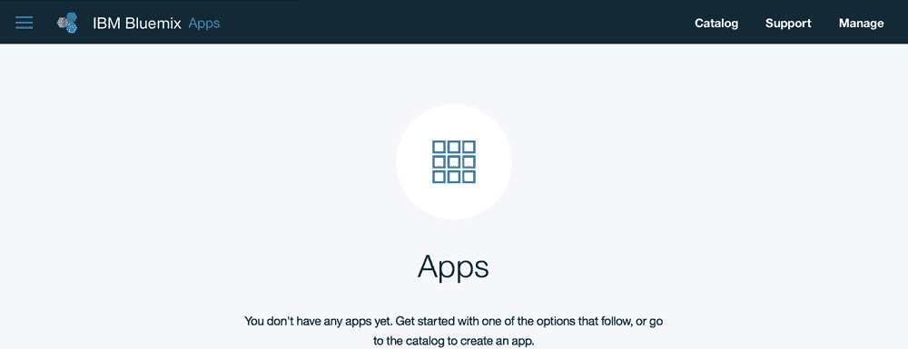

4.  在左侧导航栏中，选择 **Cloud Foundry Apps**，然后选择 **SDK for Node.js**。IBM Cloud 提供了丰富的运行时，包括 Java™ 运行时、Swift、PHP 和 Ruby，但在本教程中，我使用的是 Node.js。单击 **SDK for Node.js**。

    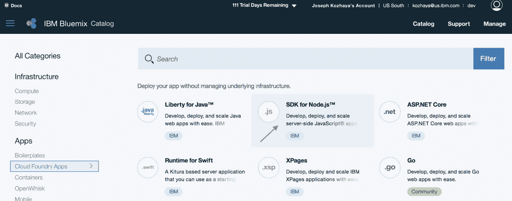

5.  为应用程序提供一个唯一名称，然后单击 **Create**。

    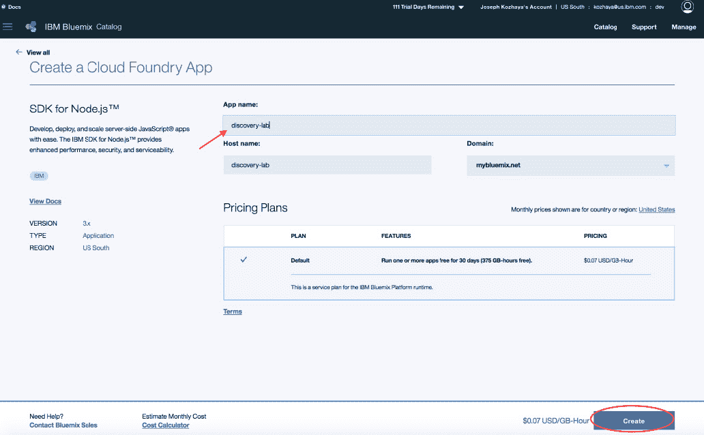

    此刻，您已经创建了一个简单的 Hello World Node.js 应用程序，并将它托管在您的 IBM Cloud 帐户中。要查看您运行的应用程序，可以在浏览器中访问 [`appname.mybluemix.net，其中`](http://appname.mybluemix.net，其中) *appname* 是您的应用程序的名称。对于我的示例应用程序，我使用了 tlelab-bluemix 作为应用程序名称，所以我在浏览器中访问 [`tlelab-bluemix.mybluemix.net`](http://tlelab-bluemix.mybluemix.net) 来查看 Hello World 消息。

    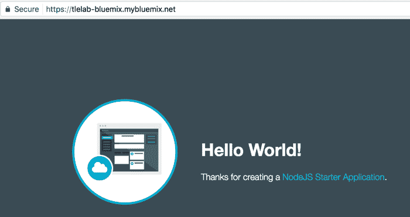

6.  创建应用程序后，您会看到一个类似下图的页面。可以单击 **download the sample code** 下载入门代码，您可以编辑和修改它们，然后将它们推送回 IBM Cloud。

    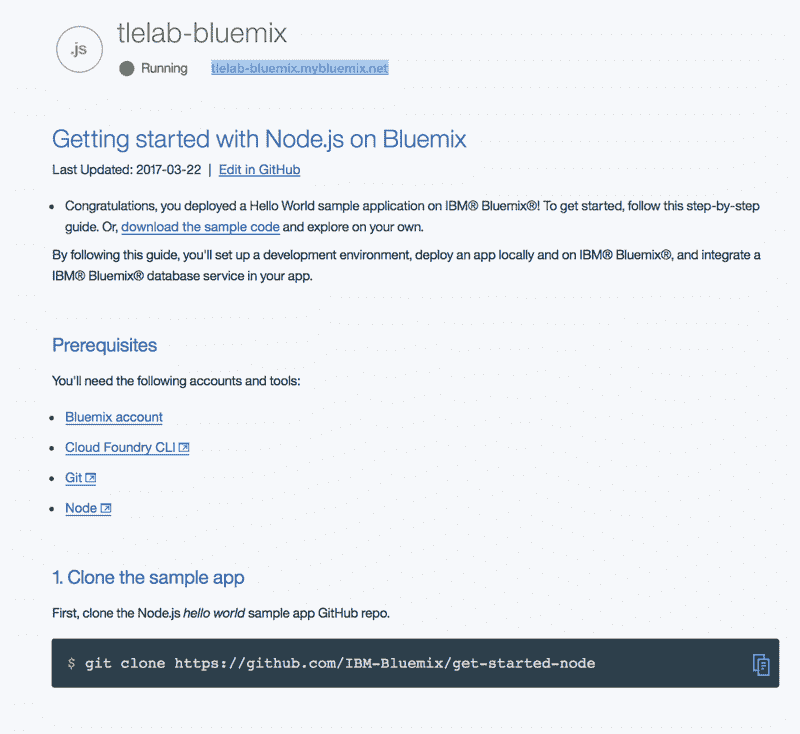

7.  按照说明解压已下载的代码，您可以对它进行编辑和修改，然后将代码推送回 IBM Cloud。

## Watson Assistant 入门

本节将介绍设置和运行一个使用 Watson Assistant 的简单应用程序的过程。开始介绍之前，请运行以下命令，以确认您已在机器上安装了所需的包。

1.  在 Mac 上打开终端或在您的机器上打开命令行接口。如果图标栏上没有终端，可以使用搜索功能找到它。
2.  在命令行窗口中键入 `git --version`，确认已安装 Git。如果返回错误，则表明未安装 Git。下载并安装 [Git](https://git-scm.com/downloads)。
3.  在命令行窗口中键入 `node -v`，确认已安装 Node.js。如果返回错误，则表明未安装 Node.js。下载并安装 [Node.js](http://nodejs.org)。
4.  在命令行窗口中键入 `npm -v`，确认 npm 已和 Node.js 一起安装。
5.  在命令行窗口中键入 `cf -v`，确认已安装 cf（cloud foundry 命令行接口）。如果返回错误，则表明未安装 cf。从 GitHub 存储库下载并安装 [cf](https://github.com/cloudfoundry/cli/releases)。

### 对话型 cognitive car dashboard 应用程序

安装所有需要的工具后，下一步是设置并运行 [cognitive car dashboard](https://github.com/watson-developer-cloud/conversation-simple) 示例应用程序，这是一个非常适合快速上手使用 Watson Assistant 的简单应用程序。

首先下载 cognitive car dashboard 应用程序的代码。在命令行窗口中，运行以下命令：

```
mkdir tlelab
cd tlelab
git clone https://github.com/watson-developer-cloud/conversation-simple.git
cd conversation-simple
npm install
cp .env.example .env
vi .env 
```

**备注：**`npm install` 会安装 package.json 文件中定义的节点包。服务凭证是在 .env 文件中定义的；可以复制并粘贴您在创建 Assistant 服务（接下来将创建它）时获得的该服务的凭证。

此刻，必须定义一个 Watson Assistant 服务，并创建一个可在此应用程序中使用的对话流。请注意，根据 .env 文件中的定义，您需要 3 个参数：`WORKSPACE_ID`、`CONVERSATION_USERNAME` 和 `CONVERSATION_PASSWORD`。可以忽略 .env 文件中的其他参数。

`CONVERSATION_USERNAME` 和 `CONVERSATION_PASSWORD` 参数是在创建新 Assistant 服务时定义的。而 `WORKSPACE_ID` 参数是在构建对话时定义的。要使用 Watson Assistant 构建对话，必须定义意图、实体和对话流，以便根据从用户语音及对话上下文中提取的意图和实体，对对话进行编排。

有关定义意图、实体和对话流的更多信息，请参阅 Watson 开发者云上的 [Watson Assistant](https://cloud.ibm.com/catalog/services/watson-assistant?cm_sp=ibmdev-_-developer-tutorials-_-cloudreg) 服务文档。也可以访问博客文章[具有 Alchemy 实体提取功能的 Watson Assistant](https://kozhayasite.wordpress.com/2016/08/27/watson-conversation-with-alchemy-entity-extraction/)。

### 创建一个 Watson Assistant 服务实例

1.  使用您的 IBM Cloud 凭证登录到 [IBM Cloud](https://cloud.ibm.com/?cm_sp=ibmdev-_-developer-tutorials-_-cloudreg)。
2.  单击 **Catalog**，然后单击左侧导航面板中的 **Watson**。Catalog 显示了可用的 Watson 服务。单击 **Assistant**。

    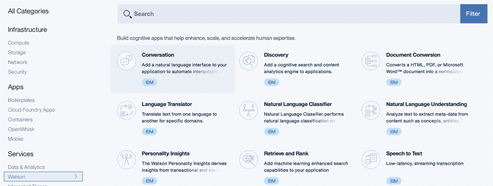

3.  提供一个唯一名称（或使用默认服务名称），选择 **Leave unbound** 让服务保持未绑定状态，然后选择免费计划（允许每月调用 API 1000 次）。单击 **Create**。

    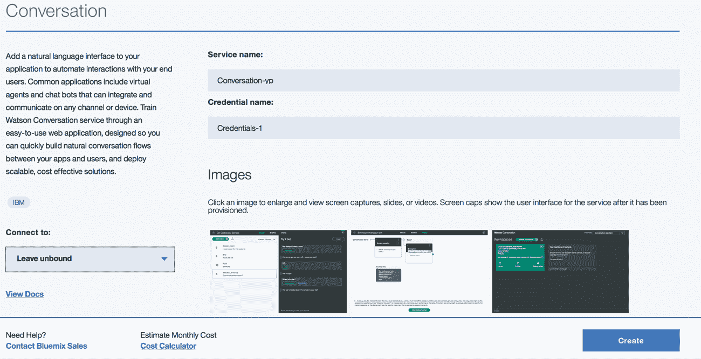

    这会创建一个新的 Assistant 实例并提供凭证，可以单击 Service Credentials 来访问这些凭证。

4.  单击 **Service Credentials** 选项卡。

    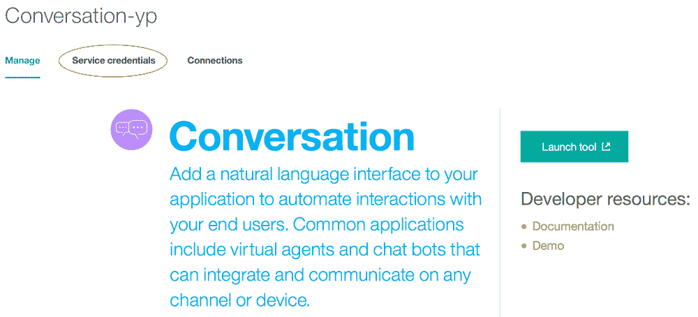

5.  展开 **View Credentials** 下拉列表。复制凭证（用户名和密码）并保存它们。

    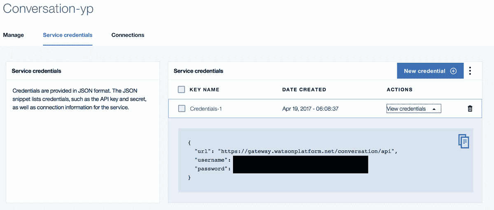

    使用这些凭证来设置 .env 文件中的变量：

    *   CONVERSATION_USERNAME = 用户名
    *   CONVERSATION_PASSWORD = 密码
6.  单击 **Manage** 选项卡，然后单击 **Launch tool**。这会启动一个交互式工具接口，您可以在其中为对话定义意图、实体和对话内容。如果它是您创建的第一个工作区，您会看到一个类似下图的屏幕，可以在其中单击 **Create** 开始创建新对话，以及定义意图、实体和对话内容，或者可以单击 **Import** 导入一个完整的工作区。

    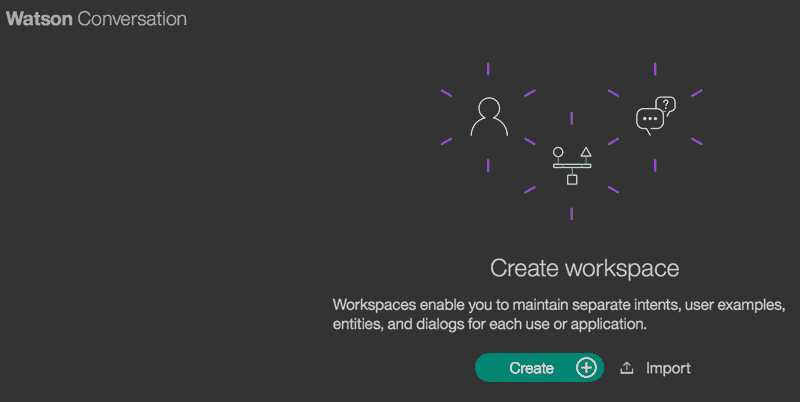

7.  单击 **Import** 导入 **car_workspace.json** 工作区。选择一个文件，导航到将 GitHub 存储库克隆到的目录 **$DIR/tlelab/conversation-simple/training/car_workspace.json**，然后单击 **Import**。

    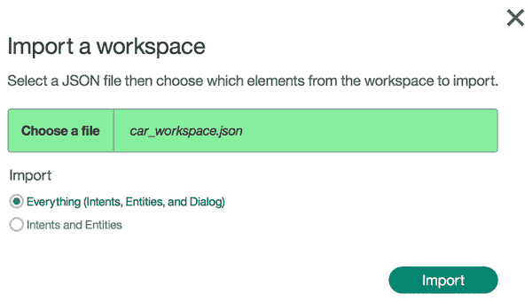

8.  浏览工作区，查看定义了哪些意图和实体。另外，浏览 Dialog 选项卡，以了解工作流程：检查意图和实体，并决定如何相应地为对话建立分支和控制对话。

    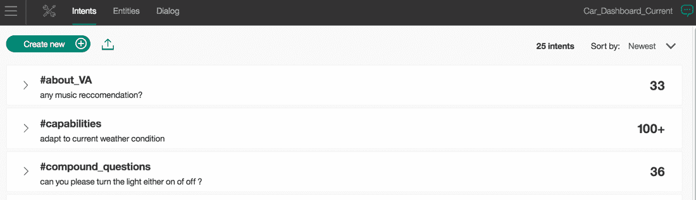

9.  定义对话后，可以获取 `WORKSPACE_ID` 并将它填入 .env 文件中。返回上一页（其中显示了所有工作区；在本例中只有一个工作区）。单击由 3 个垂直排列的点组成的图标，打开菜单并选择 **View details**。这会加载工作区的细节，包括工作区 id。
10.  复制工作区 id，在 conversation-simple 应用程序的 .env 文件中设置变量。

    ```
    WORKSPACE_ID = 工作区 id 
    ```

11.  在命令行窗口中键入以下命令，以便在本地运行该应用程序。

    ```
    node server.js 
    ```

12.  在浏览器中访问 localhost:3000，也可以跟正与 cognitive care dashboard 通信的应用程序进行交互。
13.  最后，将该应用程序托管在 IBM Cloud 上。为此，编辑应用程序的主目录中的 manifest.yml 文件。

    1.  删除以下行：

        ```
        ```
        declared-services:
                  conversation-simple-demo-test1:
                        label: conversation
                    plan: free

             services:
          - conversation-simple-demo-test1
        ``` 
        ```

    2.  将应用程序的名称更改为唯一名称（将您姓名的首字母包含在名称中）

        ```
        ```
        name: tlelab-jk
        ``` 
        ```

    3.  在命令行窗口中键入以下命令，将应用程序推送到 IBM Cloud。这需要花几分钟的时间，然后您会获得一条表明应用程序正在运行的消息。

        ```
        ```
        cf push
        ``` 
        ```

    4.  在浏览器中访问应用程序的主机名：tlelab-jk.mybluemix.net，也可以与该应用程序交互。

## 集成 Natural Language Understanding 来提取实体

浏览 car dashboard 工作区的对话时，可以注意到我们定义了一个 #weather 意图，以便了解用户何时在询问天气。但是，该应用程序目前不会提供回复。它仅显示 “Unfortunately I don’t know much about the weather.I’m still learning.”。

本节将介绍如何更新该应用程序来返回天气信息。为了获得天气信息，我使用了 [Weather Underground API](https://www.wunderground.com/weather/api/)。要使用 Weather Underground API，必须[注册获取一个 API 密钥](https://www.wunderground.com/weather/api/)。这是一个使用 Weather Underground API 的示例调用：[`api.wunderground.com/api/apikey/conditions/q/state/city.json`](http://api.wunderground.com/api/apikey/conditions/q/state/city.json)

例如，要查找加州旧金山的天气，可以使用：[`api.wunderground.com/api/apikey/conditions/q/CA/San_Francisco.json`](http://api.wunderground.com/api/apikey/conditions/q/CA/San_Francisco.json)

请注意，除了 Weather Underground API 密钥之外，您还需要传入州和城市，然后 Weather API 才会返回该州的这座城市的天气预报。要从用户在对话中输入的文字中获取城市和州，您有两种选择：

1.  在 Assistant 中定义两个实体 city 和 state，并提供所有可能的城市和州的列表。
2.  设计您的应用程序来管理相关实体的提取，将这些实体作为上下文变量传递给 Assistant 服务。

尽管可以使用选项 1，但选项 2 显然更容易扩展。此外，尽管可以识别并列出所有城市和州（对于选项 1），但可能无法始终列出某个关注的实体（例如组织）在其他应用程序中的所有可能变体。本教程的剩余部分将重点介绍选项 2：具体来讲，就是利用 [Watson Natural Language Understanding](https://www.ibm.com/watson/services/natural-language-understanding/) 服务，该服务已经过预先训练，能提取 24 种不同类型的实体。

### 创建一个 Watson Natural Language Understanding 服务实例

要创建 Natural Language Understanding 服务实例，可以重复创建 Watson Assistant 实例的指令，但选择的是 Natural Language Understanding 服务。对于服务凭证，您将获得一个用户名和密码作为 Natural Language Understanding 服务的凭证。保存这些凭证，因为您需要使用它们才能从您的应用程序连接到 Natural Language Understanding 服务。

执行以下步骤，下载集成了 Natural Language Understanding 服务的示例代码。在命令行窗口中，运行以下命令：

```
cd $DIR
mkdir tlelab-nlu
cd tlelab-nlu
git clone https://github.com/joe4k/conversation-nlu.git
cd conversation-nlu
npm install
cp .env.example .env
vi .env
========== 
```

**备注：**`npm install` 会安装 package.json 文件中定义的节点包。服务凭证是在 .env 文件中定义的；可以复制并粘贴您在创建 Assistant 服务时获得的该服务的凭证。将 Natural Language Understanding 服务的凭证复制并粘贴到 .env 文件中。另外，确保包含了来自 Weather Underground 的 apikey，以便可以访问 Weather Underground API 并获得天气预报。您的 .env 文件看起来类似这样：

```
# Environment variables
WORKSPACE_ID=YOUR_CONVERSATION_WORKSPACE_ID
CONVERSATION_USERNAME=YOUR_CONVERSATION_USERNAME
CONVERSATION_PASSWORD=YOUR_CONVERSATION_PASSWORD
NATURAL_LANGUAGE_UNDERSTANDING_USERNAME=YOUR_NLU_USERNAME
NATURAL_LANGUAGE_UNDERSTANDING_PASSWORD=YOUR_NLU_PASSWORD
WEATHER_API_KEY=YOUR_WEATHER_UNDERGROUND_API_KEY 
```

快速浏览这段代码，注意如何创建 Natural Language Understanding 服务包装器。

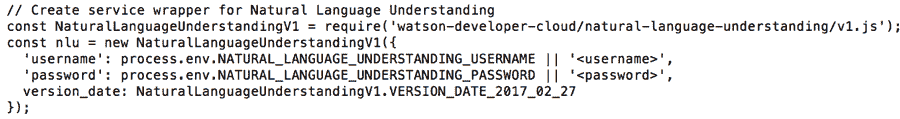

您还可以了解如何调用 Natural Language Understanding 服务来提取 City 实体，以及如何将它定义为 Assistant 服务的上下文变量 `payload.context.appCity`。

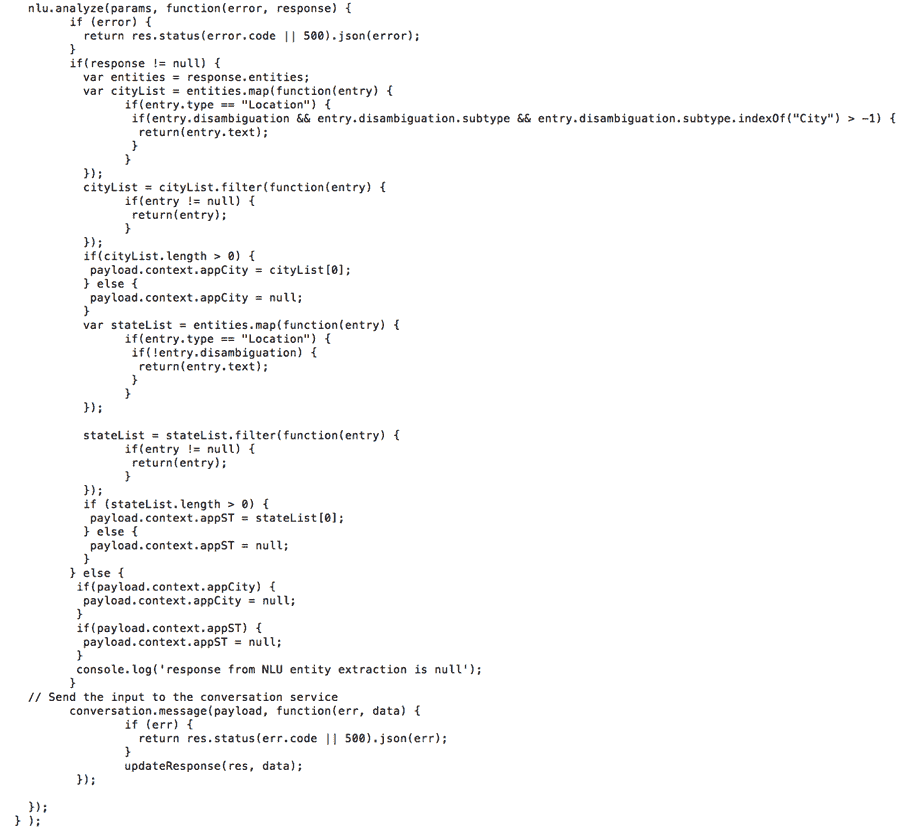

接下来，必须更新对话流来检查是否定义了上下文变量 `appCity`，如果已定义，则返回所提取的州和城市的天气。

**备注：**如果在修改对话流时遇到困难，可以将克隆自 [`github.com/joe4k/conversation-nlu.git`](https://github.com/joe4k/conversation-nlu.git) 的代码导入 **car_workspace_nlu** 工作区。在 Waston Assistant 服务中，**导入**该工作区并选择文件 **tlelab-nlu/conversation-nlu/training/car_workspace_nlu.json**。如果将 car_workspace_nlu.json 导入一个新工作区中，则需要编辑 .env 文件，以指向新的 WORKSPACE_ID。

要更新对话流来检查该变量，可在 Waston Assistant 工作区中转到定义 #weather 意图的节点，并（在它的右侧）添加一个节点来检查 `$appCity` 和 `$appST` 是否已定义。请注意，应用程序使用了 Natural Language Understanding 服务来提取城市和州实体，并将它们作为上下文变量传递给 Waston Assistant 服务。如果 `$appCity` 或 `$appST` 未定义，则为用户提供一条回复，表明您需要城市和州的信息才能提供天气。如果 `$appCity` 和 `$appST` 均已定义，则添加一条对用户的回复，表明您可以提供给定州中的给定城市的天气。

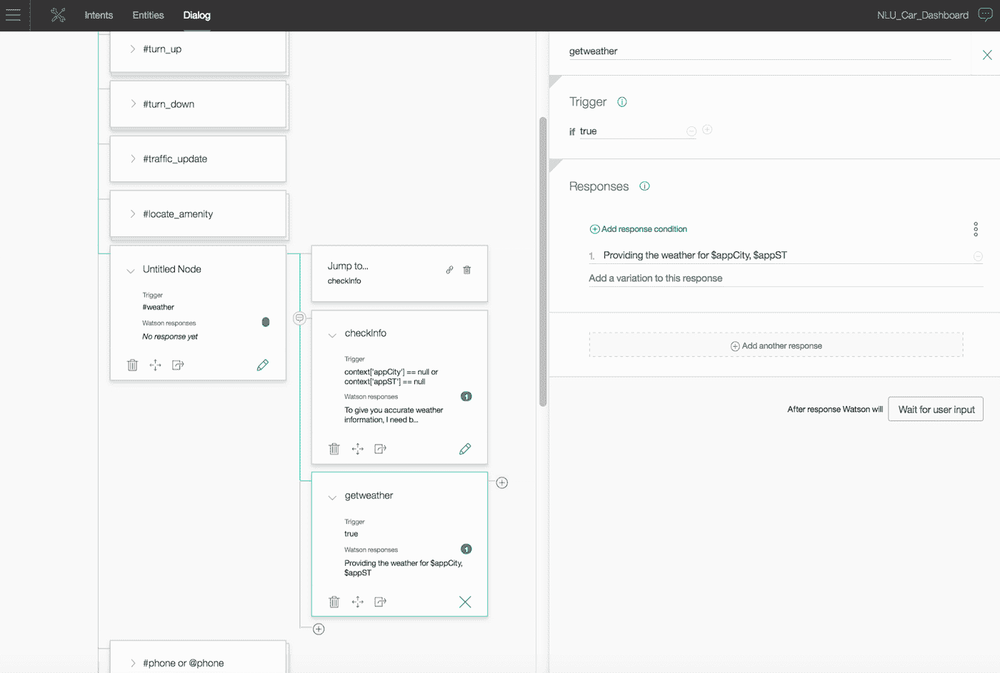

此刻，您已准备好运行应用程序，并提供给定州中的给定城市的天气状况。

1.  在命令行窗口中键入 `node server.js`，在本地运行该应用程序。
2.  在浏览器中访问 localhost:3000，也可以跟正与 cognitive care dashboard 通信的应用程序进行交互。
3.  最后，将该应用程序托管在 IBM Cloud 上。为此，可以编辑应用程序主目录中的 manifest.yml 文件，将应用程序的名称更改为唯一名称（将您姓名的首字母包含在名称中）。

    ```
    name: tlelab-conv-nlu-jk 
    ```

4.  在命令行窗口中键入 `cf push`，将应用程序推送到 IBM Cloud。这需要花几分钟的时间，然后您会获得一条表明应用程序正在运行的消息。
5.  在浏览器中访问应用程序的主机名：[`tlelab-conv-nlu-jk.mybluemix.net，也可以与该应用程序交互。`](http://tlelab-conv-nlu-jk.mybluemix.net，也可以与该应用程序交互。)

应用程序运行后，尝试询问“What is the weather in Raleigh, NC”。应用程序会意识到您在询问北卡罗来纳州罗利市的天气，它会从 Weather Underground API 抓取天气预报并将结果返回给您。

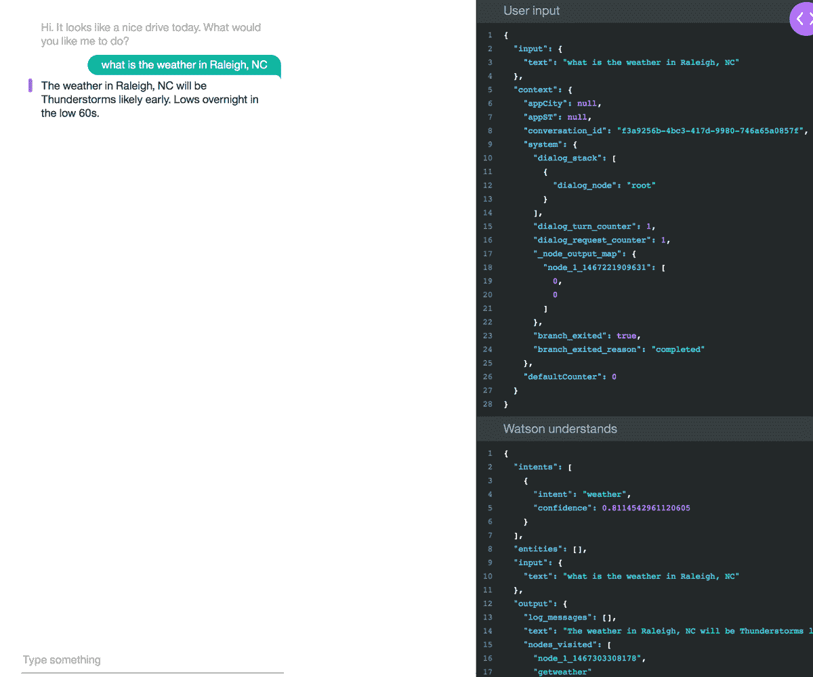

## 结束语

本教程介绍了如何集成 Watson Natural Language Understanding 服务与 Watson Assistant 服务，以便从用户的输入文字中提取您感兴趣的实体（在本例中为城市和州），并将该信息作为上下文变量传递给 Waston Assistant 服务，以便 Waston Assistant 能执行所需的操作。