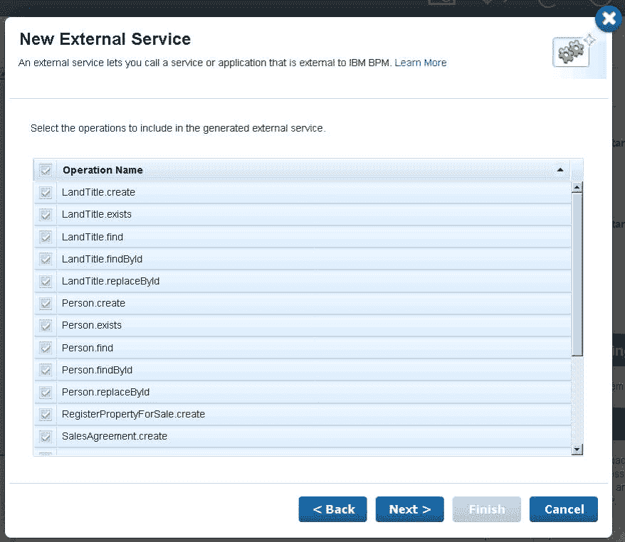
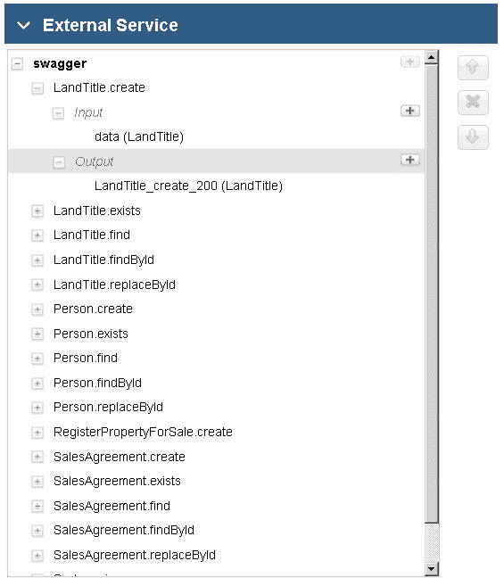
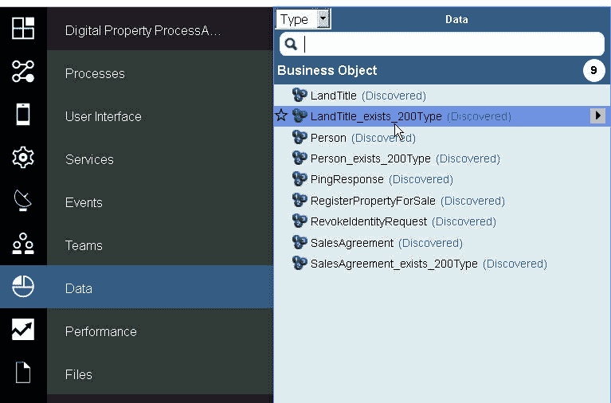
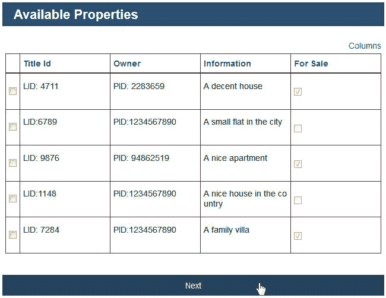

# 组合业务流程管理与区块链

> 原文：[`developer.ibm.com/zh/tutorials/mw-1705-auberger-bluemix/`](https://developer.ibm.com/zh/tutorials/mw-1705-auberger-bluemix/)

*注意：IBM Blockchain Platform 现在使用超分类帐结构进行端到端开发。用户可以选择使用 Hyperledger Composer，但 IBM 不提供支持.*

在参与者通常彼此信任的企业中，业务流程管理简化了业务流程。与此相反，区块链使业务流程能够在多个企业和不受信任的参与者之间执行。

您是否曾考虑过组合这些方法，将业务流程的集成和自动化提高一个等级？本系列可以帮助您实现此目标。

在第 1 部分中，将了解如何组合使用业务流程管理与区块链技术来创造更智能的业务流程。然后，发现区块链服务，并实现服务流和一个业务流程。您还将学习在业务流程中使用区块链资产。

## 问题：数据不一致，而且多个参与者之间缺乏信任和透明性

十多年来，企业一直使用业务流程管理作为简化业务流程的框架，以提高整体的透明度、效率和一致执行能力。IBM® Business Process Manager (BPM) 在案例管理、事件处理、业务规则和集成机制等领域的创新，有助于企业实现新业务流程和持续改进现有业务流程，从而实现战略业务目标。

为了高效地运行，业务流程依赖于来自信息系统的数据。但是，在企业外部的信息系统中创建和修改数据时，会发生什么？目前的一个常规手段是在碎片化的信息系统之间迁移流程所需的数据。此方法不但复杂而且成本高昂，往往还会产生一些过时和不一致的数据。更令人担忧的是，还会导致缺乏透明性和信任。

下图演示了 6 个与车辆交互的协作企业，比如制造商、经销商和租车公司。每个企业都维护着自己的信息系统，其中包含部分资产信息，比如车辆信息。如果制造商的信息系统中更新了与经销商相关的车辆数据，经销商的信息系统中也需要对该数据进行更新。

## 引入区块链

区块链技术可以解决碎片化系统中的互操作性、信任和透明性问题。从核心来讲，区块链是资产和事务记录的分布式账本。智能合约控制了不受信任的各方之间的事务执行，确保合约条件得以满足，义务得以履行。许可区块链确保区块链上的所有信息和事务仅供拥有合适权限的网络成员使用。

业界的早期区块链试验项目正在探索使用区块链作为资产注册表的方式 – 不仅包括车辆等物理资产，还包括音乐等数字资产。

下图演示了一个使用共享账本的网络中的各方，而不是上一幅图中的碎片化系统。

在业务流程管理术语中，资产生命周期就像一次统筹安排，其中涉及的多个参与者都有自己的业务流程。这些单独的流程通过基于消息的接口实现彼此交互，而这些接口遵守各对参与者之间的单独合约。

但是，如果业务网络包含一个维护单一事实版本的分布式账本，那么该账本需要提供接口。参与者在账本上获取和更新信息，并在信息被其他人更新时对事件做出反应。通过使用分布式账本作为基础记录系统，所有参与者都能实现重大的业务流程改进。

## 区块链实战

如果不熟悉区块链的功能，请查阅 [IBM Blockchain 租车演示](https://developer.ibm.com/tv/ibm-blockchain-car-lease-demo/) 。该演示遍历了一辆车从诞生一直到被处置的生命周期，展示了如何在区块链上记录供应链的每个阶段。

在该场景的初始步骤中，政府监管者为新车创建登记信息并将其存储在区块链中。然后监管者通过在区块链上调用一个事务，将车辆所有权转交给制造商。制造商制造车辆，在区块链上的车辆模板中添加相关的车辆细节。接下来，车辆被售于经销商，然后转移到租车公司。在车辆被租给新的所有者后，区块链再次更新所有者的细节。最后，在车辆终止使用时，废物回收商可以更新区块链，以表明该车辆已被处置。

您可以将 [IBM Blockchain 租车演示](https://developer.ibm.com/tv/ibm-blockchain-car-lease-demo/) 部署到 IBM Cloud 中来自行试用区块链。在 GitHub 中的 [IBM-Blockchain/car-lease-demo](https://github.com/IBM-Blockchain/car-lease-demo) 上获取工件。

## 完美搭档：业务流程管理与区块链

因为该演示专注于区块链概念，所以它没有考虑在每个参与方幕后运行的内部业务流程。要体现一种业务流程管理方法，需要考虑经销商处的业务流程是什么样的。

该流程可以从客户前往经销商处购买新车开始。客户向销售员描述她的理想车型，销售员然后浏览目前可用的车辆列表。很幸运，有一辆完全符合客户要求的车，客户当场决定购买它。

客户选择签署需支付首付款的租赁合约，而不是现金支付。销售员输入客户的细节并从租车公司申请报价。客户同意该报价并签署合约。客户支付首付款，车辆的所有权转移到租车公司。客户很高兴地接过车钥匙，驾驶她的新车离开。

要让该流程顺利进行，需要与区块链进行多次交互，如下图中的橙色部分所示： **Get vehicles I own** 、 **Get data of the vehicle the customer wants** 和 **Transfer vehicle ownership to Leasing Company** 。

可以看到，该流程的第一步是获取经销商拥有的车辆列表。销售员使用该列表帮助客户寻找车辆。

第二步是再次在区块链中查询一辆具体的车的细节。售出车辆后，在区块链上更新车辆所有权信息。

实际上，该流程可能还会使用业务规则来支持决策，在需要时提供支持文档，并使用外部服务和事件来核对信誉、应收款或收到的文档。

您还可以通过包含与区块链的更多交互让该流程变得更智能，比如对区块链上显示发生欺诈或其他事故的事件做出反应。这些事件可以直接发起新业务流程，确保合适的人员采取了相应的措施。下图演示了在区块链上发起一个业务流程来解决事故的事件。

这个示例展示了业务流程管理和区块链如何相互补充，以及组合解决方案如何为业务流程的更高集成和自动化水平清除障碍。

以下各节将介绍实现 IBM BPM 和 IBM Blockchain 解决方案的细节。您将学习如何查询资产和从业务流程中调用事务。

## 在业务流程中使用区块链资产

更深入地分析实现细节，并通过查询数据和在区块链上发起事务，了解流程如何与区块链数据交互。

本教程将详细介绍以下步骤：

1.  从 IBM BPM 中发现 IBM Blockchain 服务。
2.  创建一个服务流，以便使用已发现的服务获取资产数据并提供给流程。

    如果您已经具备业务流程开发知识，本教程还会大体介绍以下步骤：

3.  创建另一个服务流，以便使用已发现的服务在 IBM Blockchain 上执行事务。
4.  开发一个简单的流程，供业务用户处理 IBM Blockchain 数据和发起事务。

要了解如何使用 IBM BPM 实现该场景，可以从 GitHub 下载一个示例 `.twx` 文件，地址为 [LarissaAuberger/bpm-blockchain](http://github.com/LarissaAuberger/bpm-blockchain) 。

## 完成本教程需要做的准备工作

本教程中的场景需要带累积修复包 2017.03 的 IBM BPM V8.5.7，以及一个使用在 Hyperledger Fabric 上运行的 Hyperledger Composer 构建的区块链业务网络。Hyperledger 是一个 Linux Foundation 项目。Hyperledger Fabric 是区块链技术的一种开源实现。Hyperledger Composer 是一组开源开发工具，它们在 Hyperledger Fabric 上运行，用于快速开发区块链业务网络。

本教程需要考虑以下前提条件：

*   IBM BPM：如果没有所需级别的 IBM BPM，可以考虑使用 IBM BPM on Cloud 代替。可按照说明 [注册一个免费试用帐户](https://www.bpm.ibmcloud.com/#trial) 。
*   区块链业务网络：本教程使用了 Hyperledger Composer 提供的数字财产网络示例。该数字财产网络包含想购买或销售数字财产的参与者。它还提供了接口来创建和移除数字财产，或者更新它们的属性，比如它们的所有权。请参阅 Hyperledger Composer 文档中的 [安装 Hyperledger Composer](http://hyperledger.github.io/composer/unstable/installing/development-tools.html) 和 [使用 Hyperledger Composer 进行安装和开发](http://hyperledger.github.io/composer/unstable/installing/installing-index.html) 。Hyperledger Composer 包含 composer-rest-server 包，可通过该包轻松地设置一个使用该业务网络的 REST API 服务器。部署业务网络后，即可生成 REST API。
*   从 IBM BPM 发现服务：您需要一个已生成的 REST API 的 Swagger 定义。要获取 Swagger 定义，可以访问 `http://localhost:3000/explorer/swagger.json` 并将 Swagger 定义保存到本地目录。为了让该文件更容易阅读，可以使用 [`jsonformatter.org`](https://jsonformatter.org/) 上的 JSON 格式化工具将其格式化。
*   Hyperledger Composer REST API 服务器：确保您可以从您的 IBM BPM 环境访问该服务器。

然后，从 GitHub 获取示例代码，地址为 [LarissaAuberger/bpm-blockchain](http://github.com/LarissaAuberger/bpm-blockchain) 。

## 开始行动

理解您在本教程中实现的流程。当业务流程开始时，它会与数字财产网络交互，以便从业务网络中获取数字财产。在流程结束时，在数字财产网络上执行一个事务来更新数字财产。在流程开始到结束期间，有一个通用流程，它实现了处理资产所需的操作，如下图所示：

注：可以使用其他 Hyperledger Composer 业务网络与 IBM BPM 进行集成。您只需要描述所选应用程序的 REST 接口的 Swagger 定义文件，以便能发现和使用本教程中介绍的服务。

## 发现 IBM Blockchain 服务

1.  在浏览器中，登录到您的 Web Process Designer。
2.  创建一个 Process App 并在 Web Process Designer 中打开它。
3.  从库中，选择 **Services > New > External Service** 来创建一个外部服务。
4.  在 New External Service 向导中，选择 `**Java, REST or Web Service**` ，然后单击 **Next** 。
5.  如下面的屏幕截图所示，选择 **Browse local files (Swagger)** 作为发现服务的方法，然后导航到您之前复制到本地文件系统的 Swagger 文件。然后单击 **Next** 。

    

6.  Swagger 文件中定义的一些操作需要一个编程方法来实现其调用。这些操作不会包含在服务接口中。要调用这些操作，可以创建一个脚本任务并使用 JavaScript API 调用它们。检查列出的操作，如下面的屏幕截图所示，然后单击 **Next** 。

    

7.  在下一个窗口中，可以看到这些操作被自动发现，如下面的屏幕截图所示。指定要包含在已生成的服务中的操作，然后可以通过服务任务来调用它们。单击 **Next** 。

    

8.  创建一个服务器来调用 REST 服务。为它提供一个名称，比如 `swaggerServer` 。在后面的一个步骤中定义它的配置。单击 **Finish** 。

## 浏览生成的工件

1.  在 Web Process Designer 中的 **Services > External Service** 下，可以看到生成的服务。如下面的屏幕截图所示，生成的服务包含第 7 步中选择的操作，以及它们的输入输出参数和各自的业务对象类型，这些信息都已在 Swagger 定义中定义。

    

2.  在 Web Process Designer 中的 **Data > Business Objects** 下，可以看到基于 Swagger 定义中提供的规格而发现的业务对象，如下面的屏幕截图所示：

    

## 配置 REST 服务器

生成的外部服务指向一个服务器。现在您需要指定此服务器的连接信息。

1.  导航到 Process App Settings。选择 Servers 选项卡 – 可以看到第 8 步中指定的服务器。对于此服务器，确保选择了 REST Server 作为类型。
2.  对于默认环境，指定您在前提条件中配置的 REST 服务器的主机名和端口。保存配置。

## 创建一个服务流

现在创建服务流来从区块链中获取可用的数字财产。

1.  从库中，单击 **Services > New> Service Flow** 。
2.  为服务流指定一个名称，例如 `Retrieve Properties` 。然后单击 **Finish** 。
3.  在 Variables 下，定义一个 `LandTitle` 类型的输出变量，然后选择 `Is list` ，如下面的屏幕截图所示：

    

4.  在 Diagram 选项卡上，将一个 Service Task 拖到画布上，为它提供一个名称（例如 `retrieveProperties` ），然后连接它。
5.  在 Properties 的 Implementation 选项卡中，选择生成的外部服务作为实现，选择 `LandTitle.find` 作为操作，如下面的屏幕截图所示。

    

6.  在 Properties 的 Data Mapping 选项卡中，将参数 `filter` 留空（这会返回所有可用的数字财产），如下面的屏幕截图所示。对于输出映射，可以指定您在之前的步骤中创建的变量 (`tw.local.landTitle`)。

    

## 自行尝试：实现另一个服务流

现在轮到您了！

1.  根据下图，实现另一个服务流来获取一个具有给定 ID 的财产，更改获取的财产的所有者，然后更新区块链上的财产细节。

    

    *   要更新财产，可使用 `LandTitle.replaceById` 操作，如下面的屏幕截图所示：

        

    *   使用下面的屏幕截图中的数据映射。一个 `LandTitle` 类型的数据是更新后的财产记录：

        

    您现在已拥有可用来从区块链获取数字财产并在区块链上执行事务的服务流。

2.  实现一个使用这些服务流并提供人工服务的流程，以便业务用户（您的流程参与者）能够使用这些服务流处理数字财产。

    提示：如果需要帮助，可以查看 GitHub 上的 `.twx` 文件中的示例流程，地址为 [LarissaAuberger/bpm-blockchain](http://github.com/LarissaAuberger/bpm-blockchain) 。

## 查看您的流程和区块链的实际运行情况

根据 `.twx` 文件提供的示例流程应用程序，执行以下步骤。

1.  以业务用户身份登录到 Process Portal。
2.  启动 `Work with digital properties` 流程的一个实例，并认领任务。
3.  如下面的屏幕截图所示，浏览可用的财产，检查它们是否可售，并单击 **Next** 。

    

4.  通过指定一个财产的 ID (**Title Id**) 和新所有者 ID 来更改财产的所有权（基于您在 “完成本教程需要做的准备工作” 小节中创建的内容）。然后单击 **Change Ownership** 。
5.  在业务网络的 REST API 浏览器中，验证所有者已根据您指定的信息而进行更改。它应该类似于下面的屏幕截图。

    

## 结束语

在本系列的第 1 部分中，大体了解了如何组合使用业务流程和区块链。然后了解了如何让存储在区块链中的资产可用于 IBM BPM 流程中。为了让区块链资产可用，您使用示例区块链业务网络的 Swagger 定义发现了一个 REST 服务。您在服务流中使用生成的服务，在区块链中查询了相关数据，并在人工服务中使用了该数据，让业务用户能够处理该数据。

可以看到，区块链和业务流程管理器是相辅相成的。通过使用区块链，多个参与者可以通过明确定义的、公开可见的事务来管理资产。业务网络中的参与者可使用业务流程管理来实现自己的私有业务流程，将它们集成到整体公共流程中。

在您的下一个区块链项目中，可以考虑使用 IBM BPM 来实现私有流程。在本教程中可以看到，IBM BPM 能够轻松地与 Hyperledger Fabric 相集成，而且您可以使用它实现完整的业务流程，而无需任何编码。此外，您还可以使用其他功能，比如让人们轻松参与流程，文档集成和案例管理，业务规则和事件处理，以及监视，所有这些功能都有助于让区块链上的业务流程变得高效且智能。考虑使用 IBM BPM on Cloud： [注册一个免费试用帐户](https://www.bpm.ibmcloud.com/#trial) 。

在今年晚些时候发表的第 2 部分中，将会介绍区块链事件和它们如何影响业务流程，第 3 部分将会介绍如何掌握集成解决方案中的安全性，敬请期待。

我们渴望了解您集成 IBM BPM 和区块链的体验，以及任何其他需求。您可以通过 Twitter、电子邮件或在本文底部发表评论来联系我们。

### 致谢

非常感谢 Helen O’Shea 和 Claudia Zentner 细心评审本文，提供建设性意见并进行校正。

还要感谢 Dan Selman 和 Liam Grace 长久以来对各种 Hyperledger 问题提供支持。我们非常重视在流程和区块链主题上的紧密合作。

本文翻译自：[Archived | Combine business process management and blockchain](https://developer.ibm.com/tutorials/mw-1705-auberger-bluemix/)（2017-05-15）