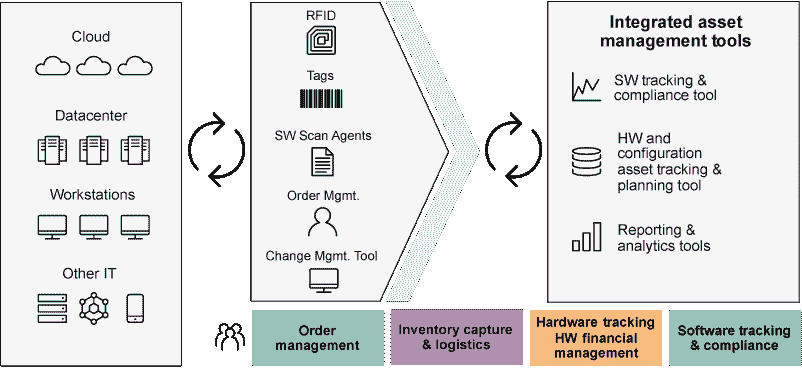
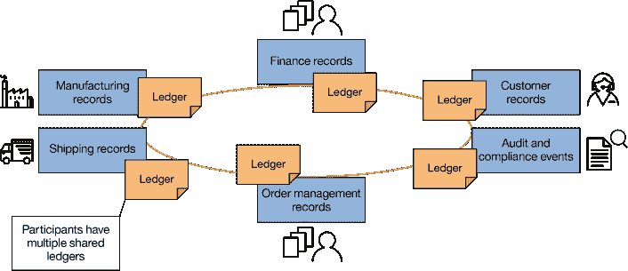
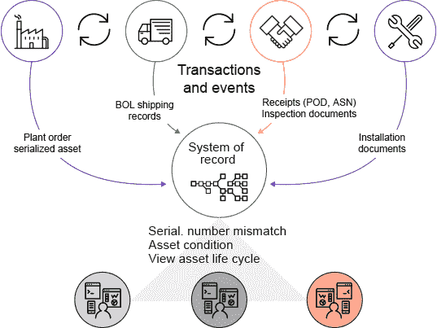
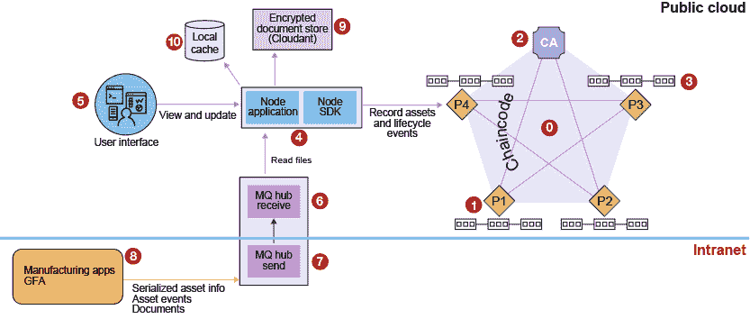
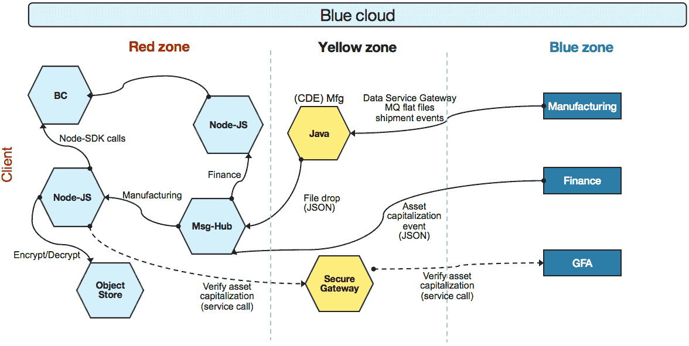
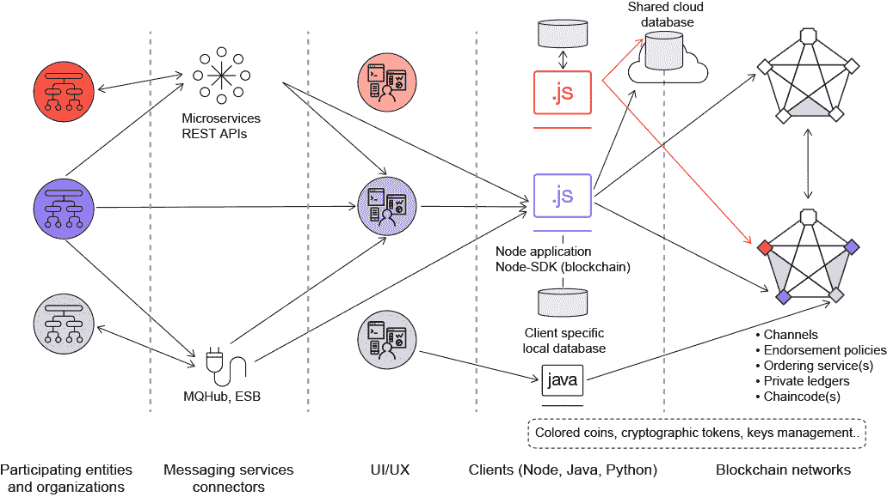
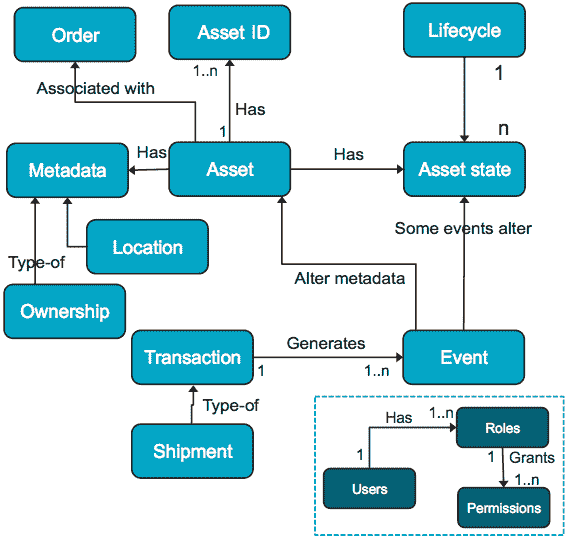

# 采用区块链执行企业资产管理 (EAM)

> 原文：[`developer.ibm.com/zh/tutorials/cl-adopting-blockchain-for-enterprise-asset-management-eam/`](https://developer.ibm.com/zh/tutorials/cl-adopting-blockchain-for-enterprise-asset-management-eam/)


获取最佳免费工具、培训和社区资源的每月集萃，帮助您开始使用区块链。
**[最新一期](http://ibm.biz/blockchain-newsletter)** | **[订阅](http://ibm.biz/blockchain-newsletter-signup)**

区块链是一项有着巨大前景的技术，有望改善供应链管理，使其更高效、更经济。本文将跟踪介绍一个负责改进企业资产端到端管理的 IBM 团队的经历。

我们将介绍我们的起点、我们需要解答的关键架构问题，以及为我们的任务实现的基于区块链的最终解决方案。我们将分享学到的经验教训，以及关于如何扩展系统来实现未来增长的一些想法。最后，我们将详细介绍我们使用的 IBM 产品，您也可以使用这些产品构建最先进的区块链解决方案。

## 孤立系统和数据对供应链的影响

作为全球最大的 IT 基础架构和服务提供商之一，IBM 管理着数百个 IBM 设施和客户设施中的数万项软硬件资产。这些资产是在 IBM 和供应商工厂中制造的，然后交给 IBM 进行配置，并部署在客户数据中心。

跟踪这些资产从制造到部署，再到最终处置的全过程很复杂。IBM、提供商、物流公司和客户所操作的系统被用于支持这个端到端流程，每个系统都专注于一项特定功能，比如规划、物流、财务、保修和运营。

当所有环节都进展顺利时，就能高效地在供应链和各种系统中转移 IBM 资产。但是，当出现问题时，比如资产在运输途中损坏，或者发送了与订单不符的错误商品，则很难让所有系统对资产的实际状态达成共识。系统和数据是孤立的，分别拥有自己对资产的看法。解决这些问题需要很高的成本，而且会造成延迟，影响客户满意度和收入确认。

## 区块链与我们的方法简介

2016 年年末，IBM 认识到了使用区块链技术改进其资产管理系统的机会。在资产从制造过渡到部署期间，区块链能捕获发生的所有交易和状态变化，包括在 IBM 系统外执行的操作。这种区块链将提供每种资产的核心信息的单一事实来源。这样，无论资产在供应链中进行转移的过程中发生了什么，所有利益相关者和系统都能了解它的状态。

> 我们选择采用一种最小可行产品 (MVP, Minimum Viable Product) 方法，使用区块链技术实现端到端资产管理。MVP 为我们提供了一个在有限范围内切实可行的解决方案。

区块链技术使企业能够建立一个网络来协调一个或多个账本的共享。这些共享账本在某些方面不同于传统数据库。最重要的是，账本是去中心化的。账本不受单个管理员或公司控制，它们由共享账本的所有各方控制。区块链技术有 4 个基本要素：共享账本、对等节点一致性、智能合约（业务规则）和隐私。在 [区块链技术基础：分布式账本简介](https://www.ibm.com/developerworks/cn/cloud/library/cl-blockchain-basics-intro-bluemix-trs/index.html) 中了解更多信息。

## IBM 资产管理流程中的挑战

区块链激励我们进行反思，使我们能够重新实现我们的跨企业工作方式。话虽如此，由于区块链技术是企业中引入的一项新技术，所以我们想从让资产管理区块链沿用现有流程开始着手。我们发现，我们甚至不需要重新设计流程，就可以通过具有业务价值的方式，使用区块链增强现有技术。

IBM 管理着许多类型的自有资产，而且还管理着客户的资产。我们在此项目中仅关注有限的硬件资产。具体来讲，我们仅关注安装在数据中心的服务器。

图 1 展示了完整的资产管理生命周期解决方案。出于本文的目的，我们将重点关注两个子流程：**库存采集和物流**，**硬件跟踪和财务管理**。

##### 图 1\. IBM 资产管理流程



IBM 资产管理团队将会跟踪资产在供应链中的转移。跟踪是从订购资产时开始的，经历生产使用，一直到资产被处置（出售、回收等）。此外，IBM 资产管理服务团队还会进行一些与软件相关的活动，包括许可跟踪、合规性和优化。为了实现 MVP 用途，我们从制造商为资产生成序列号（序列化）时开始跟踪，再到在财务账本中将资产记录为资本项（资本化）（此操作在发货时执行），然后到 IBM 收到资产（接收），包括这一步中识别的错误。我们跟踪的最后一个事件是将资产安装在数据中心。

在资产经历序列化、资本化、接收和安装过程时，它的状态被记录在不同系统中。出现问题后，资产管理团队通常需要从多个系统收集信息，然后才能解决问题。在某些情况下，比如当 IBM 收到的订单中包含的一个或多个资产的序列号与发票上列出的序列号不同时，IBM 和制造商需要协同解决问题。

随着资产从供应链中的一方转移到另一方（从制造商转移到 IBM），以及随着资产的状态被修改（例如资本化），我们构建的区块链解决方案会捕获资产的信息。通过在区块链中捕获此信息，为 IBM 及其供应链合作伙伴提供了核心资产信息的单一事实来源。单这一点就提供了一些价值，因为利益相关者拥有一个系统，他们可以利用该系统获取他们需要了解的资产信息。

在未来，随着我们重构现有系统来依靠区块链作为其记录系统，此区块链提供的价值将显著增加。随着我们开始使用区块链作为一个更自动化和更简化的流程的信息中枢，借此缩短周期时间和减少错误，区块链还将带来更多的收益。

## 使用区块链重新构想资产管理

硬件和软件资产的管理已成为分布式环境中的一个复杂流程。我们常常发现，客户在寻找第三方工具和服务来更好地控制其 IT 环境，改善企业内的库存合规性状态。这些因素再加上 IT 数据存储库和系统设计/流程流的激增（和冗余），使得最简单的“跟踪资产”定义变得非常复杂，容易出现误差，而且访问服务参与者获得所需关键信息的时间变得无比漫长。将数据安全地存放在高度受限的存储库中的想法，现在已转变为基于云的应用程序，通过聚合和认知相关元数据来恢复对数据的信任。尽管自动化战略实现了内部的后勤职能，但它们很少给客户带来直接好处。

我们的愿望是让基于区块链的系统，取代各种服务交付参与者在整个过程中执行的许多遗留的流程、任务和手动操作。该系统将不一致和不同步的数据替换为一个信息 “块”，这个信息块被用作最终的、不可变的事实记录系统，所有参与者可以近实时地使用它来实现持续信息获取和交易。要确保构建的系统符合客户的要求和预期，与更多供应商和客户合作同样也很重要。

设想一个全新的资产跟踪流程。通过使用区块链技术中提供的业务网络，参与涉及任何关键数据元素的交易的所有各方都能避免争议，近实时地访问状态的单一事实，并减轻（甚至消除）软件合规性披露和审计。我们从通过管理和分析来提供反应式的中等价值服务转变为高价值的自动化服务，将所有参与数据交易的必要方与新流程中的主动检查相集成，消除任何冗余、验证、调解和合规性文档。

如图 2 所示，我们的愿望是通过区块链技术，改进用于管理应用于硬件、软件以及相关合同上的交易更新的技术和流程，为所有服务交付操作和客户，以及这些软硬件资产的生命周期，提供一种全新的互动参与体系方法。

##### 图 2\. 适用于资产管理服务的一些关键区块链概念的基本应用



## 构建区块链解决方案过程中的一些关键决策

我们启动了 MVP，以便检查我们能否管理服务器等畅销产品的生命周期。我们应用了“IBM 设计思维”方法，将范围限制到我们能在 12 周内实现的决策上：

*   确定业务流程划分，以及与资产生命周期中的数据质量相关的难题
*   确定参与的人员和他们要解决的具体问题
*   确定解决方案所实现的业务价值

##### 图 3\. 交易和事件



在制定一些关键架构决策之前，我们需要进行一些分析：

*   可用于解决此问题的技术选项有哪些？
*   利益相关者是谁，他们将从中获得哪些好处？
*   利益相关者在其企业内的决策和责任是什么？
*   所有机构或企业/利益相关者共同关注的数据是什么？
*   输入/输出是什么，哪些应用生成和/或使用它们？

我们断定应用区块链技术将提供显著的长期收益。

最终制定的关键架构决策是：

*   **使用区块链账本作为记录系统**：区块链将充当 IBM 制造的畅销资产（比如服务器）的单一事实来源，自动跟踪资产生命周期中的每个变化，所以它是可审计、值得信赖和透明的。
*   **许可**：参与企业（比如制造、物流、财务和客户）将是已知的，并有权加入区块链网络。
*   **共享数据模型**：参与企业共同关注的一个特定于解决方案的数据模型，将在区块链上进行维护。
*   **智能合约**：对影响资产的角色、交易和事件之间的关系进行管理的业务规则，将在区块链上进行维护。例如，货运公司不能将序列号标为不匹配，但接收方能够这样做。
*   **存在证明**：对收到的交易和事件证明（比如“工厂订单”或“提货单”）执行数字化哈希运算和记录。
*   **客户端接口**：区块链将通过客户端接口订阅外部交易和事件，比如“资产已发货”或“资产已安装”。

## 使用区块链的解决方案架构

MVP 的目标是构建一个有限用途、“适合生产的”解决方案，证明区块链能够帮助解决资产生命周期管理问题。因此，团队挑选了一组核心用户案例来演示业务价值和克服技术挑战。

该解决方案架构解决了以下用户案例：

*   通过用户接口（临时）上传生成交易的 JSON 格式的交易文件，记录资产的制造和序列化
*   通过一个集成接口接收来自制造阶段的 JSON 格式的交易文件，记录资产的制造和序列化
*   记录与资产相关的事件，比如发货、资本化、收货、安装和保修
*   在收到发货事件时，通过与 GFA 系统交互来确定资产能否被资本化
*   加密并存储原始交易或事件细节，将这些证据的哈希值记录在区块链上
*   使用各种方法，提供通过用户界面查看资产生命周期（包括证明）的能力 — 通过资产序列号、通过订单标识符，以及通过货运标识符
*   允许根据用户角色和权限来运行整个应用程序

我们将解决方案部署在一个运行在 IBM 公有云 [**Bluemix**](http://www.bluemix.net) ® 上的区块链实例上。通过 [**SDK for Node.js**](https://console.ng.bluemix.net/catalog/starters/sdk-for-nodejs/) 客户端接口访问区块链。所有合作伙伴、应用程序和用户交互都流经 API 或它之上的用户界面。流入和流出区块链的数据为 JSON 格式，这使得数据很容易被理解、使用和处理。在 MVP 中，Node.js 客户端使用 Bluemix 上提供的 MQHub 服务与制造系统相集成。

在解决方案开发过程中，需要小心地避免将区块链设计为“另一个应用程序”或“集中化的操作数据库”的陷阱。

##### 图 4\. 解决方案架构



##### 图 4 的图例

|  |  |
| --- | --- |
| 0 | Fabric — 运行软件的物理或虚拟服务器（对等网络中的一个或多个对等实体，以及启用或未启用安全性、隐私和 TSL 的证书颁发机构 (CA)）。 |
| 1 | 对等实体。在网络上的一个节点上运行的软件。每个对等实体都能与网络中的其他对等实体密切合作，能充当许多角色：非验证、验证、背书者、提交者。 |
| 2 | CA 或证书颁发机构。也称为成员服务。颁发 eCert（成员登记证书）和 tCert（交易证书）。成员企业是通过 membersrvc.yaml 文件启用的。 |
| 3 | 账本。与对等实体有关联的数据库实例。每个对等实体都有账本的一个副本，不仅记录特定于应用程序的数据，还记录每次执行智能合约所导致的全局状态。 |
| 4 | 连接到 Fabric 的节点应用程序组件和 Node SDK 客户端。应用程序组件执行的功能包括接收和解析 JSON 文件，向供应链发回事件，加密和解密文件，管理会话，以及连接 Node SDK 客户端 API。我们还提供了一个本地客户端数据库来缓存特定于客户端的数据。 |
| 5 | 基于浏览器的用户界面。使用户能够与资产管理应用程序进行交互。可利用区块链、本地应用程序组件和其他外部供应链应用程序获取用户请求的结果。 |
| 6 | 消息中心：发送和接收端点：在 MVP 中，发送端点位于企业供应链应用程序一端，用于发送 JSON 结构事件和交易。 |
| 7 | 企业供应链应用程序，比如 SAP、制造和 GFA。交易证明事件。 |
| 8 | 一个加密的文档存储。保存收到的交易证明事件和文档的加密副本。 |
| 9 | 特定于 Fabric 客户端的本地数据缓存 |

MVP 需要支持全球的内部用户和业务合作伙伴，所以它需要一个高度可用的基础架构。我们最初的部署是在一个公有 Bluemix 环境中进行的，该环境以服务形式提供 IBM Blockchain 和 Node JS。部署架构如图 5 所示。

##### 部署架构



如图 5 所示，IBM 内的环境被划分为不同的安全区。资产管理应用程序部署在公有的“红色专区”。供应链应用程序位于内部网或“蓝色专区”中。在 Fabric v0.6 推出后，最终的目标生产环境将位于 HSBN（高安全性业务网络）上。

## 图 5\. 可扩展性设计

区块链技术能够应对供应链 IT 系统中目前存在的互操作性挑战，成为使客户、供应商、物流运营商、金融机构、合同制造商和第三方服务提供商能安全共享资产信息的技术标准。

因此，我们提供的设计必须能够扩展，以便支持新资产类型、事件、业务实体和应用程序。在 MVP 阶段，我们很早就认识到，在维护账本不可变性的同时，解决方案还必须是可扩展的，具有与 Fabric 的新版本的向前和向后兼容性。

图 6 中的临时参考架构展示了我们的战略考量。

##### 图 6\. 临时参考架构



在图 6 中，右侧两列表示区块链集群和访问这些链的 Fabric-Client 客户端。集群中的每个区块链向彼此以及与它们相连的客户端提供不同的服务。Fabric-Client 客户端被设计用于访问本地数据库，客户端实例使用该数据库来存储需要缓存的客户端特定数据。这些客户端还利用了一个在它们之间共享的云数据库。在未来的架构中，Cloudant 等云数据库可以充当加密文档的共享数据存储，而不是 MVP 中使用的文件共享。

中间列表示应用程序 UI 和它的组件。可以任意多个组件连接到 Fabric-Client API 并与区块链交互。

##### 使用 IBM Blockchain Platform 和 Hyperledger Fabric 快速开发区块链应用程序

IBM Blockchain Platform 是一组可配置的服务，API，建模语言和编程模型，可帮助您快速定义和部署区块链网络和应用程序。[了解更多](https://www.ibm.com/blockchain/platform)

左侧第二列提供集成服务（比如 MQ、ESB）和微服务。例如，在处理一个发货事件时，Fabric-Client 客户端可能调用 GFA-Microservice 与 GFA 系统进行实时资产资本化检查。第一列表示各种供应链企业（包括合作伙伴）和提供各种供应链服务的应用程序。它们通过集成服务和/或 UI 与区块链进行通信。

初步发布 MVP 后，我们将解决方案定位为能适应该 Fabric 的未来版本并进行相应扩展。链代码（智能合约）可为一个特定的产品类别使用一种事件状态配置定义（如清单 1 所示），并在该列别上执行此定义。此模型支持添加可在未来发现的新事件和状态。

##### 清单 1\. 事件状态配置定义

```
Product_category {
{ "EventStates":       [
         {
            "EventID": "MANUFACTURING",
            "EventNO": 1,
            "RecType": "EventState",
            "EventDesc": "The Asset is manufactured & serialized",
            "ParentStates": [ "INIT"],
            "ChildStates": [ "SERIALIZED", "SHIPPED"],
            "Action": "AssetManufacturedEvent",
            "Documents": ["PlantOrder", "CustomerOrder"],
            "Signatures": ["Asset Admin", "Customer", "Order Manager"],
            "PreEvents": ["None"],
            "NextEvents": ["None"],
            "RoleAccess": ["Admin", "Manufacturer"],
            "TestEvent": "TestEventIntegrity"
       },
       {
            "EventID": "SERIALIZED",
            "EventNO": 2, 
```

智能合约针对资产的当前状态来验证事件，并应用 `Action`，验证 `Signature` 和支持 `Document`，前提是客户拥有特定的 `RoleAccess` 权限。

将新事件添加到配置中后，链代码提供了一个函数来重新初始化它的映射，拥有相应权限和授权的客户可以调用该函数。显然，需要将普通合同的例外情况编码到链代码中，而且还需要发布一个新版本。

资产管理数据模型（如图 7 所示）是可扩展设计必不可少的一部分。资产被视为一类对象，它的状态受事件影响。事件由在供应链环境中发起的交易触发。

##### 图 7\. ALC 高级对象模型



资产数据模型包含以下属性：

*   **资产**：IBM 或其合作伙伴制造的最终用户物理产品，供 IBM 最终用户在内部使用。
*   **资产 ID**：一个唯一标识符，比如产品序列号、型号、RFID 标签、加密地址或所有这些信息的组合。
*   **资产元数据**：描述资产的属性，比如产品编码、型号。
*   **交易**：两方之间的供应链合同，比如工厂订单、客户发票、交付订单和 ASN。
*   **事件**：与交易有关联的操作，比如将触发开发票操作的商品送达行为。
*   **资产状态**：资产在其生命周期中的当前上下文，比如已创建、已发货、运输途中、已收货、已安装、在保修期内等。
*   **资产生命周期**：资产状态的时序集合。

## 学到的经验教训

我们在构建此 MVP 的过程中学到了许多经验教训，具体来讲，是因为该解决方案代表着我们对业务、颠覆性技术和遗留系统的思考方式的模式转变。

*   **准备**：我们的许多团队成员没有使用区块链的经验，而且在许多情况下，我们注意到，在遗留系统的云思维方面，该缺陷被不断暴露出来，导致成员们的精力主要集中在了战术问题上。

    *   团队中必须至少有一名成员理解这项新技术，知道如何采用和接受它。
    *   团队必须包含理解业务领域并拥有改革思维的主题专家。
*   **分析**：在我们的 MVP 中，首先会举办一个为期一天的研讨会来定义范围。然后执行 6 次迭代或冲刺。

    *   在进入冲刺之前，必须好好对用户案例、技术案例和技术债进行合理分析。我们推荐在每次迭代或实现之前，都执行一个发现阶段或迭代 0。
    *   和用户一起召开会议，了解他们将如何查询信息。
*   **设计**：设计应用程序时，牢记设计区块链解决方案的原则和要实现的目标业务价值。

    *   信息或数据建模不可或缺。识别区块链数据，包括可能位于外部的共享区块链客户端数据，以及特定于客户端的本地数据。
    *   识别将提供交易和事件的源系统，识别数据属性，最终确定数据格式。
    *   确保真实数据可用在 MVP 中，尤其是在 MVP 阶段无法访问生产系统时。
    *   尽早向区块链 API 发布签名，以便客户端和服务器端实现可并行执行。
*   **构建解决方案**

    *   使用共享存储库，比如 GitHub。这有助于持续集成。
    *   使用生态系统中所有软件的正确版本来搭建环境。这些软件包括 Vagrant、Docker、Hyperledger Fabric、Git、HFC、Node.js、NPM 和 Golang 等。
    *   测试部署到 IBM Cloud 的策略。这包括配置节点服务、区块链服务和消息中心服务。

## 后续行动

从初创公司到大型企业，从纸式办公企业到科技公司，都能使用灵活的平台和基础架构产品，利用 IBM Blockchain 产品来设计、部署和管理区块链网络。

IBM Blockchain 网络的构建是为了从去中心化控制中获益，但一些云环境可能存在漏洞。通过与安全专家、密码学专家、硬件专家和研究人员团队合作，IBM 已为防篡改、受信任的区块链网络创建了必要的云服务。

### 高安全性业务网络：一个适用于业务网络的隔离环境

这个区块链网络计划运行在一个安全的基础架构中。此计划提供了很高的安全水平，关闭了未授权访问和篡改的所有后门。可在 [**IBM Blockchain 产品**](https://www.ibm.com/blockchain/offerings.html)中了解更多信息，并[**注册参与高安全性业务网络 (HSBN) 计划**](https://console.ng.bluemix.net/catalog/services/blockchain/)。此计划提供了容易使用的内置工作流工具，使区块链网络的成员能随多公司网络的扩展而扩展和增长。此计划还提供了备份和还原过程、日志和监控、严格的安全性，以及一个能消除单点故障的高可用性/容错架构。

本文翻译自：[Adopting blockchain for enterprise asset management (EAM)](https://developer.ibm.com/tutorials/cl-adopting-blockchain-for-enterprise-asset-management-eam/)（2017-03-17）