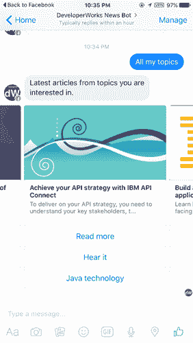

# 使用认知（或人工智能）服务增强聊天机器人

> 原文：[`developer.ibm.com/zh/tutorials/cc-cognitive-chatbot-watson/`](https://developer.ibm.com/zh/tutorials/cc-cognitive-chatbot-watson/)

*Watson Conversation 现在是 Watson Assistant。虽然本教程中的一些插图可能会将服务显示为 Watson Conversation，但步骤和过程仍然有效。*

本教程系列将介绍如何创建一个可部署在两种消息应用程序上的聊天机器人：Facebook 和 Slack。在最后一篇教程中，将介绍如何使用 IBM [Watson 服务](https://cloud.ibm.com/catalog?category=ai?cm_sp=ibmdev-_-developer-tutorials-_-cloudreg)增强聊天机器人。本系列中的新闻聊天机器人以 IBM Developer 内容为例，但您也可以修改内容来源来满足自己的需求。

在[前一篇](http://www.ibm.com/developerworks/cn/cognitive/library/cc-cognitive-chatbot-conversational-design/index.html)教程中，介绍了人工智能 (AI) 在聊天机器人中的重要性，解释了构建您自己的 AI 有多难 — 不仅需要数据科学精英，还需要大量的数据来训练模型。小公司通常无法提供这些类型的资源。幸运的是，您可以在自己的应用程序中使用 IBM 等公司提供的高级 AI 研究成果。

IBM 在其 IBM Cloud 平台上通过 Watson 服务提供其 AI 功能。这些服务使您只需简单地调用 Web 服务，即可将 AI 整合到应用程序中。在本系列的前两篇文章中，我在 `BaseServlet` 类中留下了一些空的服务密钥。这些密钥可供我在聊天机器人中使用的 Watson 服务使用。具体地讲，操作如下：

*   在用户提供的信息不在命令关键词列表中时，使用 [Watson Assistant](https://www.ibm.com/cloud/watson-assistant/) 来确定用户的意图。
*   使用 [Watson Retrieve and Rank](https://www.ibm.com/watson/developercloud/retrieve-rank.html) 将搜索引擎与经过训练的排序模型相结合，提供自定义的、特定于领域的搜索结果。
*   使用 [Watson Speech to Text](https://www.ibm.com/watson/services/speech-to-text/) 解释用户在发送录音时提供的信息。
*   使用 [Watson Text to Speech](https://www.ibm.com/watson/services/text-to-speech/) 向用户朗读文章摘要。
*   使用 [Watson Tradeoff Analytics](https://www.ibm.com/watson/developercloud/tradeoff-analytics.html) 允许聊天机器人根据用户提供的偏好为其选择文章。

**备注：**Watson Assistant 的作用不仅仅是检测用户的意图。它还会检测消息中的实体（即概念或对象，以及相关同义词），并不断跟踪对话状态。您可以编写该服务脚本，以便根据当前意图、实体和对话状态生成自动化响应 — 使其成为一个独立的微型聊天机器人。

当然，Watson 目录中还有许多 AI 服务，但本教程中将重点介绍这 5 种服务，以它们为例。

## IBM Cloud 设置

在开始之前，您必须能访问 IBM Cloud。可以注册一个免费 30 天的[试用帐户](https://cloud.ibm.com/?cm_sp=ibmdev-_-developer-tutorials-_-cloudreg)，而无需信用卡。您将获得 2 GB 运行时和容器内存来运行应用程序，无限的 IBM 服务和 API，以及免费技术支持。对于测试和个人项目，该内存应该足够用了。

1.  登录到 IBM Cloud 后，从 Watson [目录](https://cloud.ibm.com/catalog?category=ai?cm_sp=ibmdev-_-developer-tutorials-_-cloudreg)选择要添加到您的帐户中的服务。

    

2.  配置并创建该服务。对于每个服务，创建一个凭证 — 一个用户名和密码 — 用于访问该服务。该用户名和密码通过 HTTP 标头传递给 Web 服务。
3.  自动生成的凭证可用来访问 Watson 服务。

可以使用命令行工具（比如 curl）或使用基于 Web 的 API 资源管理器来测试 Web 服务。（在本教程中，我使用的是 curl。）API 资源管理器可使用一个交互式网页来访问 Web 服务端点。您可以建立一个请求，并查看 Watson API 资源管理器生成的响应的细节，如下图所示。（请注意右上角的用户名和密码。）


## Watson Assistant

让我们来看看 Watson Assistant 服务。它的一项功能是检测消息中的用户意图，这在聊天机器人对话中很有用。聊天机器人可将用户输入映射到它知道如何执行的多个“操作”之一，然后提供合适的响应。这是让聊天机器人看起来“很智能”的本质。

**备注：**如果只需要一个自然语言意图分类器，可以使用 [Watson Natural Language Classifier](https://www.ibm.com/watson/services/natural-language-classifier/) 服务代替。但是，Assistant 服务为聊天机器人的开发提供了许多有用的功能和工具。

在 Assistant 服务仪表板中，单击启动图标打开该服务的一个基于 Web 的控制台。（如果需要知道如何访问 Assistant 服务仪表板，可以按照 [Watson Developer Cloud](https://cloud.ibm.com/docs/services/assistant?topic=assistant-getting-started) 上的说明进行操作。）


为项目创建一个工作空间，然后在该工作空间中添加意图、实体和对话服务。在本例中，我将介绍意图的工作原理。


要检测意图，必须先“训练”一个模型。为模型提供一些示例句子和它们的意图。在“学习”了一些示例后，模型就能够对新句子进行分类。模型获得的训练越多，对新句子的分类就越准确。

可以上传一个包含训练数据的 CSV 文件或创建您自己的意图。我的训练数据包含在 CSV 文件中。第一列包含示例句子，第二列包含分类。以下是一些示例训练句子。前几行被分类为“help”，后几行被分类为“search”。

```
Can you help me?,help
Please help!,help
Someone help,help
I want to know how this works,help
How does this work?,help
I would like to know why,search
Can you search for this for me?,search
I have a question,search
I'd like to ask a question,search 
```

在 **Intents** 选项卡下，输入您的意图或上传您的 CSV 文件，Web 控制台中填充了您表明的意图和阶段示例。可以在 Web 控制台上交互式地调整意图和示例。


训练您的模型后，可以使用新句子来查询它，它会提供它“认为”的意图和每个意图的置信水平。`WORKSPACEID` 是我在创建工作空间时生成的模型 ID。当您位于该工作空间内时，就会发现您是在 Web 控制台的 URL 中。

```
curl -X POST -u "USERNAME":"PASSWORD" -H "Content-Type:application/json" -d "{\"input\": {\"text\": \"how are you\"}}" "https://gateway.watsonplatform.net/conversation/api/v1/workspaces/WORKSPACEID/message?version=2016-07-11"

{"input":{"text":"how are you"},
 "context":{"conversation_id":"..." ...},
 "entities":[],
 "intents":[{"intent":"hello","confidence":1}],
 "output":{"log_messages":[...],"text":[]}
} 
```

要让您的聊天机器人变得智能化，必须不断收集真实的用户输入，手动对它们进行分类，然后不断训练您的自然语言分类器（也就是说，构建多个模型）。

## Watson Retrieve and Rank

在本系列中创建的 IBM Developer 新闻传递聊天机器人中，我部署了一个 Lucene 搜索引擎 (Hibernate Search) 来根据用户请求索引和搜索教程。它非常适合以客观方式（即词汇频率、逆文档频率或 tf-idf 方法）查找相关内容。但是，词汇和文档频率搜索的问题在于，它无法反映用户偏好；它只反映了是否在文档内容中使用了搜索关键词。

Watson Retrieve and Rank 服务通过将搜索引擎与机器学习相结合，解决了这个问题。可以手动排列搜索词汇的搜索结果。根据该数据，它会学习您的偏好，并排列新搜索词汇的搜索结果。

Retrieve and Rank 服务需要两个东西：一个 Apache Solr 集群和一个 ranker。该服务使用 Apache Solr 独立搜索引擎，该引擎也基于 Lucene。在 Watson 云中将一个 Solr 集群设置为服务大约需要 3 步：

1.  使用 Web 服务调用创建一个 Solr 集群。该调用会返回集群的 ID，可在以后使用该 ID。
2.  将 Solr 配置文件上传到集群。配置文件指定了搜索引擎的行为，比如哪些单词被视为同义词，集群的索引策略、过滤条件及缓存策略。
3.  上传一个 JSON 文档，其中包含所有要搜索的源文档。您必须从文档检索文本，为每个文档分配一个 ID，然后将它们放在一个 JSON 文件中，通过使用 Watson Web 服务将该 JSON 文件上传到 Solr 集群。

要训练 ranker，可像训练自然语言分类器一样训练它。创建一个 CSV 文件，其中包含用户可能要问的问题，后跟任意多个列，列出了搜索结果文档 ID 和每个文档的相关性（排序）。训练模型后，可以执行后续的搜索查询。Watson 会尝试返回根据您的偏好进行排序的结果。

为 Watson Retrieve and Rank 服务设置 Solr 集群和 ranker 的过程非常复杂。请参阅 [Watson 文档](https://www.ibm.com/watson/developercloud/doc/retrieve-rank/) 来理解示例文件。

## Watson Tradeoff Analytics

Watson Tradeoff Analytics 服务可帮助您的聊天机器人平衡多个决策因素，并为用户提供推荐。此用例非常常见。简单的方法是根据用户偏好或给出的条件来过滤结果并对结果进行排序。但是过滤和排序后的结果通常很糟糕，因为这些结果非常粗糙。Tradeoff Analytics 服务使用一个名为 Pareto Optimization 的算法来平衡冲突的条件。

要使用 Tradeoff Analytics，必须传入要优化的因素，以及一个潜在选择列表及每个因素的评分。下面是来自一个 IBM 官方示例的 XML 数据输入文件。`columns` 数组包含必须在决策中优化的字段 (`key`)。`options` 数组包含可供选择的选项。每个 `options` 元素都包含 `columns` 中的所有 `key`。

```
 {
  "subject": "phones",
  "columns": [
    {
      "key": "price",
      "type": "numeric",
      "goal": "min",
      "is_objective": true,
      "full_name": "Price",
      "range": {
        "low": 0,
        "high": 400
      },
      "format": "number:2"
    },
    {
      "key": "weight",
      "type": "numeric",
      "goal": "min",
      "is_objective": true,
      "full_name": "Weight",
      "format": "number:0"
    },
    {
      "key": "brand",
      "type": "categorical",
      "goal": "min",
      "is_objective": true,
      "full_name": "Brand",
      "range": [
        "Apple",
        "HTC",
        "Samsung",
        "Sony"
      ],
      "preference": [
        "Samsung",
        "Apple",
        "HTC"
      ]
    },
    {
      "key": "rDate",
      "type": "datetime",
      "goal": "max",
      "full_name": "Release Date",
      "format": "date: 'MMM dd, yyyy'"
    }
  ],
  "options": [
    {
      "key": "1",
      "name": "Samsung Galaxy S4",
      "values": {
        "price": 249,
        "weight": 130,
        "brand": "Samsung",
        "rDate": "2013-04-29T00:00:00Z"
      }
    },
    {
      "key": "2",
      "name": "Apple iPhone 5",
      "values": {
        "price": 449,
        "weight": 112,
        "brand": "Apple",
        "rDate": "2012-09-21T00:00:00Z"
      }
    },
    {
      "key": "3",
      "name": "HTC One",
      "values": {
        "price": 299,
        "weight": 143,
        "brand": "HTC",
        "rDate": "2013-03-01T00:00:00Z"
      }
    }
  ]
} 
```

将以下 XML 内容作为 HTTP POST 内容提交给 Tradeoff Analytics 服务。

```
curl -X POST -u USERNAME":"PASSWORD"
--header "Content-Type: application/json"
--data @problem.json
https://gateway.watsonplatform.net/tradeoff-
analytics/api/v1/dilemmas?generate_visualization=false" 
```

该服务为每个潜在的选择返回一条建议。您的聊天机器人现在可以将结果返回给用户。在本例中，最佳选择是 `options` 1，即 `Samsung Galaxy S4`。

```
{
  "problem": {
   ......
    "resolution": {
    "solutions": [
      {
        "solution_ref": "1",
        "status": "FRONT"
      },
      {
        "solution_ref": "2",
        "status": "INCOMPLETE",
        "status_cause": {
          "message": "A column of a option is out of range. Option \"2\" has a value in column \"price\" which is:\"449\" while the column range is: \"[0.0,400.0]\"",
          "error_code": "RANGE_MISMATCH",
          "tokens": [
            "price",
            "449",
            "[0.0,400.0]"
          ]
        }
      },
      {
        "solution_ref": "3",
        "status": "EXCLUDED"
      }
    ]
  }
} 
```

## Watson Text to Speech

借助 Watson Text to Speech 服务，您的聊天机器人可向用户朗读消息。在用户不方便阅读信息时，此方法是一种向用户传达信息的好方法。该方法对在移动消息环境中传达大段文本也很有用。在 IBM Developer 新闻机器人示例代码中，我使用 Watson Text to Speech 服务朗读教程摘要。

**备注：**“Hear it” 按钮仅包含在 GitHub 中的示例应用程序中。Facebook Messenger 和 Slack 上的现场演示应用程序中不包含它。



该服务很简单。以 HTTP 参数形式传入您的文本，该服务会返回一个包含该音频的 WAV 文件。您可以保存二进制 WAV 数据，并以 Web 链接形式将它提供给消息应用程序，以供回放。

```
curl -X GET -u "USERNAME":"PASSWORD"
--output output.wav
"https://stream.watsonplatform.net/text-to-speech/api/v1/synthesize?accept=audio/wav&text=TEXT_TO_READ_ALOUD&voice=en-US_AllisonVoice" 
```

但是，WAV 音频的压缩率很小，消息客户端需要花很长时间来下载它。我的策略是将 WAV 内容传递给基于 Web 的媒体编码器服务，并将它转换为 MP3 链接。

在我的示例代码中，我选择使用 [zencoder 服务](https://zencoder.com/en/)来实现此目的。来自 Watson 的 WAV 内容缓存在服务器上，并调用一个 Web 服务将缓存的链接传递给 zencoder，以便进行 MP3 编码。在 zencoder 完成其编码工作后，机器人应用程序能够获得一个 MP3 链接，并将用户重定向到此处。

## Watson Speech to Text

Watson Speech to Text 服务将一段录音转换为文本。这在开发基于语音的聊天机器人时很有用，使得机器人能对用户的语音命令作出响应。这些语音命令应用程序对许多用户都很有吸引力。Web API 很简单。您只需在 HTTP Post 请求中上传语音音频内容。

```
curl -X POST -u "USERNAME":"PASSWORD"
--header "Content-Type: audio/ogg"
--data-binary @audio.ogg
"https://stream.watsonplatform.net/speech-to-text/api/v1/recognize" 
```

在大多数现代消息应用程序中，用户可以互相发送录制的语音消息。这种消息在聊天会话中显示为“可播放的”音频剪辑。当用户将语音消息发送给聊天机器人时，API 将音频文件的 MP3 链接发送给机器人的 webhook。


在 IBM Developer 新闻机器人中，我将音频转换为文本命令。


在我的代码中的 `BaseServlet` 类中，所有语音处理都是自动进行的。如果用户发送一条语音消息，`BaseServlet` 类会将它转换为文本，并将该文本传入到机器人开发人员实现的 `converse()` 方法中。因此，在 `converse()` 方法中，您可以专注于处理文本消息。

根据您的消息处理程序平台，您可能需要执行更多步骤。例如，Facebook Messenger 平台发送 MP3 文件的语音音频链接。在本例中，我先将 MP3 文件转码为 Watson 支持的 OGG 音频文件，然后将该 OGG 文件传递给 Watson。转码是通过使用 zencoder Web 服务来完成的。

## 结束语

在本教程系列中，介绍了在现代移动消息平台上构建聊天机器人的基本原理和技术。IBM Watson 认知服务对让聊天机器人变得更智能、更易于使用发挥了至关重要的作用。

本文翻译自：[Archived | Use cognitive (or artificial intelligence) services to enhance a chatbot](https://developer.ibm.com/tutorials/cc-cognitive-chatbot-watson/)（2017-02-06）